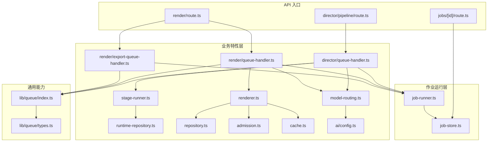
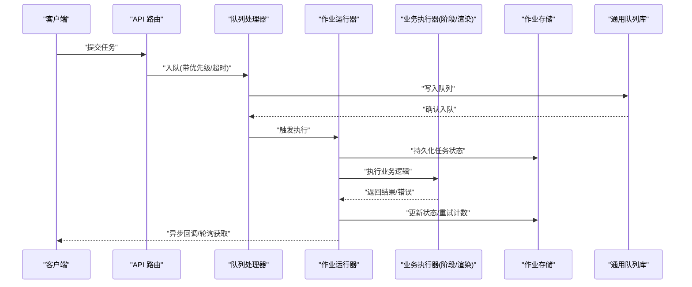
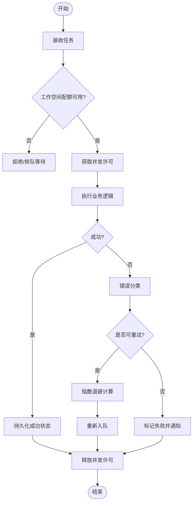
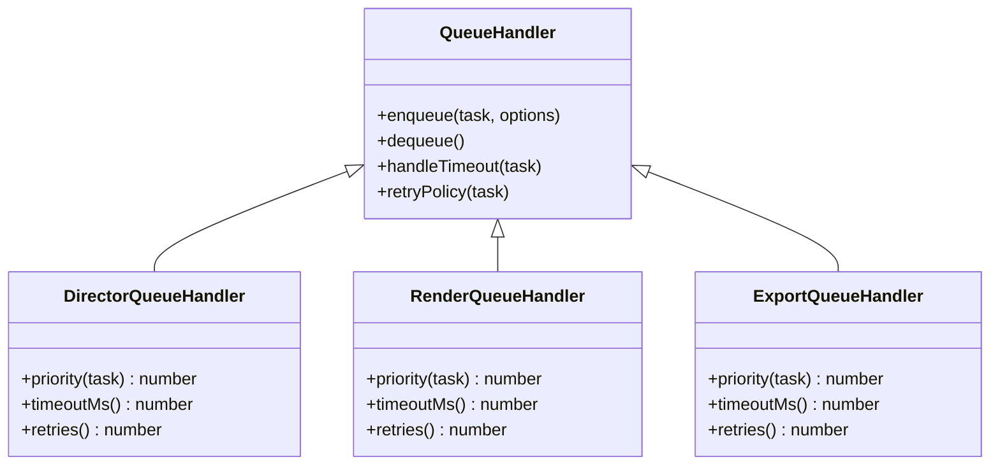
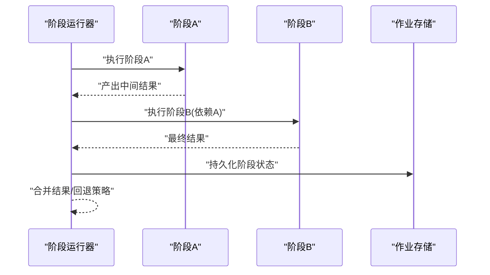
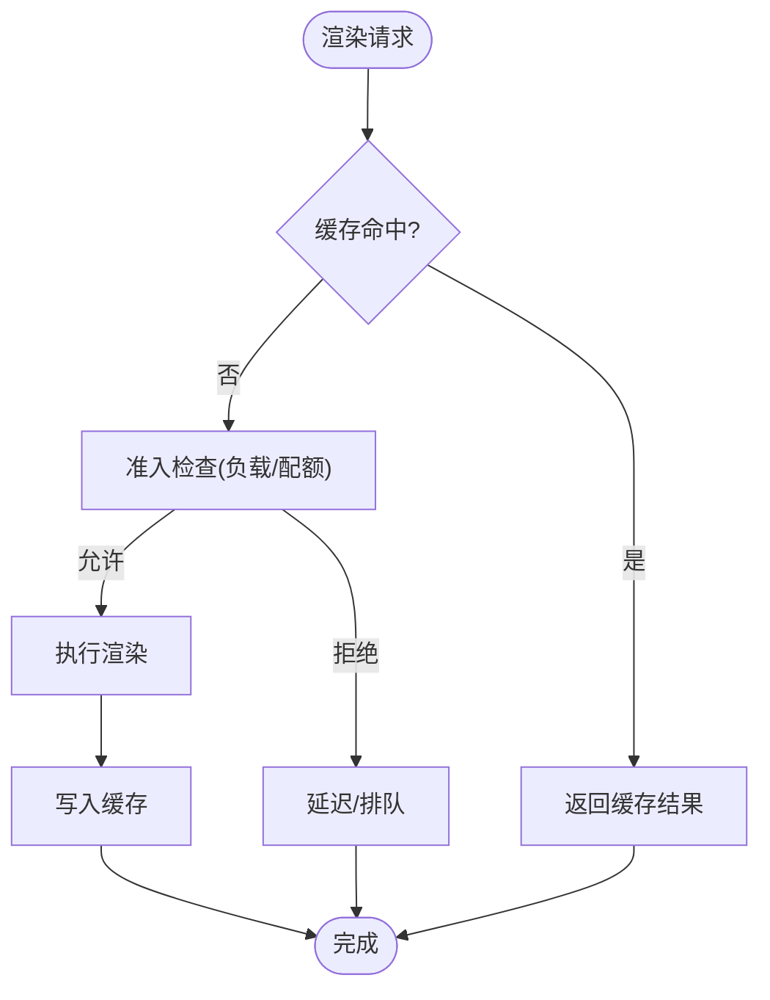
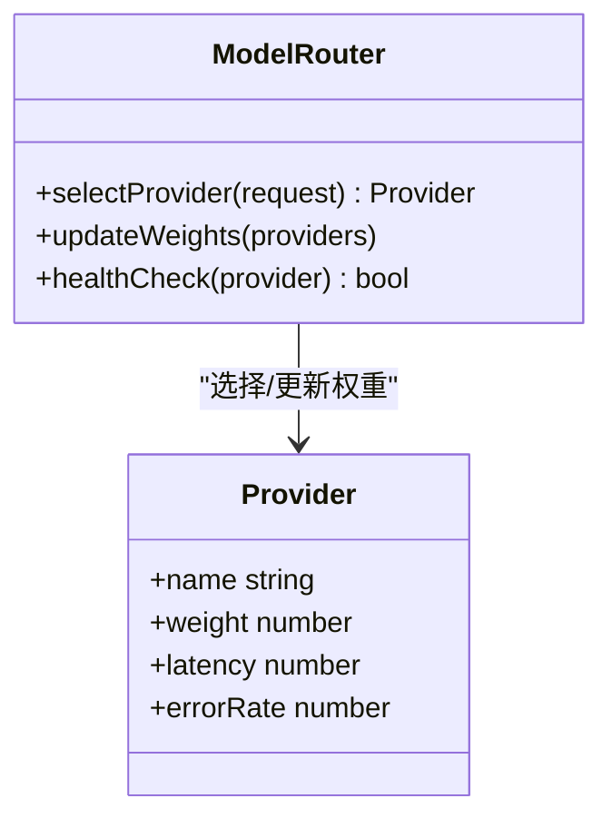
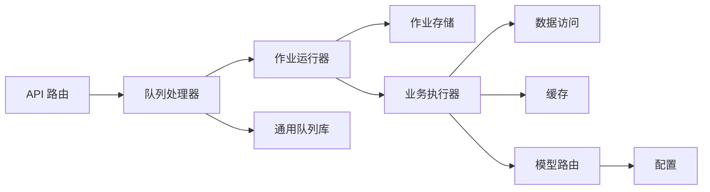

# AI 并发控制

<cite>
**本文引用的文件**   
- [server/src/server/job-runner.ts](file://server/src/server/job-runner.ts)
- [server/src/server/job-store.ts](file://server/src/server/job-store.ts)
- [src/features/director/queue-handler.ts](file://src/features/director/queue-handler.ts)
- [src/features/render/queue-handler.ts](file://src/features/render/queue-handler.ts)
- [src/features/render/export-queue-handler.ts](file://src/features/render/export-queue-handler.ts)
- [src/lib/queue/index.ts](file://src/lib/queue/index.ts)
- [src/lib/queue/types.ts](file://src/lib/queue/types.ts)
- [src/app/api/director/pipeline/route.ts](file://src/app/api/director/pipeline/route.ts)
- [src/app/api/render/route.ts](file://src/app/api/render/route.ts)
- [src/app/api/jobs/[id]/route.ts](file://src/app/api/jobs/[id]/route.ts)
- [src/features/director/stage-runner.ts](file://src/features/director/stage-runner.ts)
- [src/features/director/runtime-repository.ts](file://src/features/director/runtime-repository.ts)
- [src/features/render/renderer.ts](file://src/features/render/renderer.ts)
- [src/features/render/repository.ts](file://src/features/render/repository.ts)
- [src/features/render/admission.ts](file://src/features/render/admission.ts)
- [src/features/render/cache.ts](file://src/features/render/cache.ts)
- [src/features/ai/model-routing.ts](file://src/features/ai/model-routing.ts)
- [src/features/ai/config.ts](file://src/features/ai/config.ts)
- [deploy/compose.yaml](file://deploy/compose.yaml)
- [deploy/env.example](file://deploy/env.example)
- [config/tts.env.example](file://config/tts.env.example)
</cite>

## 目录
1. [简介](#简介)
2. [项目结构](#项目结构)
3. [核心组件](#核心组件)
4. [架构总览](#架构总览)
5. [详细组件分析](#详细组件分析)
6. [依赖关系分析](#依赖关系分析)
7. [性能考量](#性能考量)
8. [故障排查指南](#故障排查指南)
9. [结论](#结论)
10. [附录](#附录)

## 简介
本文件面向 AI 服务并发控制系统，围绕工作空间级别的资源隔离、提供商池管理、任务调度与限流、负载均衡与故障转移、队列机制（优先级、超时、重试）、监控指标与容量规划进行系统化说明。文档以仓库中实际实现为依据，结合架构图、时序图与流程图帮助开发者理解并优化吞吐量和响应时间。

## 项目结构
本项目采用前后端分离与多模块组织：
- server 层提供作业运行器与持久化存储接口，负责后台任务的执行与状态管理
- features 层按业务域划分，包含导演编排、渲染导出、AI 模型路由等
- lib/queue 提供通用队列能力与类型定义
- app/api 暴露 HTTP 路由，作为请求入口与编排协调点
- deploy 与 config 提供部署与环境配置示例

图表来源
- [src/app/api/director/pipeline/route.ts](file://src/app/api/director/pipeline/route.ts)
- [src/app/api/render/route.ts](file://src/app/api/render/route.ts)
- [src/app/api/jobs/[id]/route.ts](file://src/app/api/jobs/[id]/route.ts)
- [server/src/server/job-runner.ts](file://server/src/server/job-runner.ts)
- [server/src/server/job-store.ts](file://server/src/server/job-store.ts)
- [src/features/director/queue-handler.ts](file://src/features/director/queue-handler.ts)
- [src/features/render/queue-handler.ts](file://src/features/render/queue-handler.ts)
- [src/features/render/export-queue-handler.ts](file://src/features/render/export-queue-handler.ts)
- [src/features/director/stage-runner.ts](file://src/features/director/stage-runner.ts)
- [src/features/render/renderer.ts](file://src/features/render/renderer.ts)
- [src/features/director/runtime-repository.ts](file://src/features/director/runtime-repository.ts)
- [src/features/render/repository.ts](file://src/features/render/repository.ts)
- [src/features/render/admission.ts](file://src/features/render/admission.ts)
- [src/features/render/cache.ts](file://src/features/render/cache.ts)
- [src/features/ai/model-routing.ts](file://src/features/ai/model-routing.ts)
- [src/features/ai/config.ts](file://src/features/ai/config.ts)
- [src/lib/queue/index.ts](file://src/lib/queue/index.ts)
- [src/lib/queue/types.ts](file://src/lib/queue/types.ts)

章节来源
- [server/src/server/job-runner.ts](file://server/src/server/job-runner.ts)
- [server/src/server/job-store.ts](file://server/src/server/job-store.ts)
- [src/lib/queue/index.ts](file://src/lib/queue/index.ts)
- [src/lib/queue/types.ts](file://src/lib/queue/types.ts)

## 核心组件
- 作业运行器（Job Runner）：负责任务生命周期管理、并发度控制、错误恢复与重试策略
- 作业存储（Job Store）：提供任务持久化、状态查询与一致性保障
- 队列处理器（Queue Handlers）：按业务域（导演、渲染、导出）处理入队、出队、优先级与超时
- 阶段运行器（Stage Runner）：编排多阶段流水线，支持失败回退与结果合并
- 渲染器（Renderer）：执行具体渲染任务，集成缓存与准入控制
- 模型路由（Model Routing）：在多个 AI 提供商之间做负载均衡与故障转移
- 通用队列库（lib/queue）：抽象队列能力、类型与约束

章节来源
- [server/src/server/job-runner.ts](file://server/src/server/job-runner.ts)
- [server/src/server/job-store.ts](file://server/src/server/job-store.ts)
- [src/features/director/queue-handler.ts](file://src/features/director/queue-handler.ts)
- [src/features/render/queue-handler.ts](file://src/features/render/queue-handler.ts)
- [src/features/render/export-queue-handler.ts](file://src/features/render/export-queue-handler.ts)
- [src/features/director/stage-runner.ts](file://src/features/director/stage-runner.ts)
- [src/features/render/renderer.ts](file://src/features/render/renderer.ts)
- [src/features/ai/model-routing.ts](file://src/features/ai/model-routing.ts)
- [src/lib/queue/index.ts](file://src/lib/queue/index.ts)
- [src/lib/queue/types.ts](file://src/lib/queue/types.ts)

## 架构总览
系统以“API 入口 → 队列处理器 → 作业运行器 → 业务执行器”的链路组织，配合“作业存储”和“通用队列库”提供一致的任务管理能力。AI 模型路由位于业务执行层之前，确保对上游提供商的弹性与可观测性。

图表来源
- [src/app/api/director/pipeline/route.ts](file://src/app/api/director/pipeline/route.ts)
- [src/app/api/render/route.ts](file://src/app/api/render/route.ts)
- [src/app/api/jobs/[id]/route.ts](file://src/app/api/jobs/[id]/route.ts)
- [src/features/director/queue-handler.ts](file://src/features/director/queue-handler.ts)
- [src/features/render/queue-handler.ts](file://src/features/render/queue-handler.ts)
- [src/features/render/export-queue-handler.ts](file://src/features/render/export-queue-handler.ts)
- [server/src/server/job-runner.ts](file://server/src/server/job-runner.ts)
- [server/src/server/job-store.ts](file://server/src/server/job-store.ts)
- [src/lib/queue/index.ts](file://src/lib/queue/index.ts)

## 详细组件分析

### 作业运行器（Job Runner）
- 职责：维护并发度上限、任务生命周期、错误分类与重试策略、超时控制
- 并发控制：通过内部信号量或线程池限制同时运行的任务数；支持按工作空间隔离并发配额
- 重试策略：指数退避 + 最大重试次数；区分可重试与不可重试错误
- 超时处理：为每个任务设置执行超时，避免长尾阻塞

图表来源
- [server/src/server/job-runner.ts](file://server/src/server/job-runner.ts)
- [server/src/server/job-store.ts](file://server/src/server/job-store.ts)

章节来源
- [server/src/server/job-runner.ts](file://server/src/server/job-runner.ts)
- [server/src/server/job-store.ts](file://server/src/server/job-store.ts)

### 队列处理器（Director / Render / Export）
- 职责：将 API 请求转换为队列任务，设置优先级、超时、重试参数，并调用作业运行器
- 优先级排序：基于任务类型与 SLA 设定权重，高优先级优先出队
- 超时处理：任务级与阶段级双重超时，防止长时间占用资源
- 重试策略：针对瞬时错误（网络抖动、限流）自动重试，幂等性保证

图表来源
- [src/features/director/queue-handler.ts](file://src/features/director/queue-handler.ts)
- [src/features/render/queue-handler.ts](file://src/features/render/queue-handler.ts)
- [src/features/render/export-queue-handler.ts](file://src/features/render/export-queue-handler.ts)

章节来源
- [src/features/director/queue-handler.ts](file://src/features/director/queue-handler.ts)
- [src/features/render/queue-handler.ts](file://src/features/render/queue-handler.ts)
- [src/features/render/export-queue-handler.ts](file://src/features/render/export-queue-handler.ts)

### 阶段运行器（Stage Runner）
- 职责：编排多阶段流水线，支持阶段间数据传递、失败回退与结果合并
- 容错：单阶段失败不影响其他分支，支持补偿与重放
- 可观测性：每阶段记录耗时与状态，便于定位瓶颈

图表来源
- [src/features/director/stage-runner.ts](file://src/features/director/stage-runner.ts)
- [src/features/director/runtime-repository.ts](file://src/features/director/runtime-repository.ts)

章节来源
- [src/features/director/stage-runner.ts](file://src/features/director/stage-runner.ts)
- [src/features/director/runtime-repository.ts](file://src/features/director/runtime-repository.ts)

### 渲染器（Renderer）
- 职责：执行渲染任务，集成缓存命中、准入控制与资源隔离
- 缓存：对相同输入进行去重，减少重复计算
- 准入控制：根据当前负载与配额决定是否立即执行或延迟

图表来源
- [src/features/render/renderer.ts](file://src/features/render/renderer.ts)
- [src/features/render/cache.ts](file://src/features/render/cache.ts)
- [src/features/render/admission.ts](file://src/features/render/admission.ts)

章节来源
- [src/features/render/renderer.ts](file://src/features/render/renderer.ts)
- [src/features/render/cache.ts](file://src/features/render/cache.ts)
- [src/features/render/admission.ts](file://src/features/render/admission.ts)

### 模型路由（Model Routing）
- 职责：在多个 AI 提供商之间进行负载均衡与故障转移
- 策略：轮询、权重分配、健康检查与快速失败
- 自适应：根据延迟与错误率动态调整权重

图表来源
- [src/features/ai/model-routing.ts](file://src/features/ai/model-routing.ts)
- [src/features/ai/config.ts](file://src/features/ai/config.ts)

章节来源
- [src/features/ai/model-routing.ts](file://src/features/ai/model-routing.ts)
- [src/features/ai/config.ts](file://src/features/ai/config.ts)

### 通用队列库（lib/queue）
- 职责：抽象队列操作、类型定义与约束，供各业务域复用
- 能力：入队/出队、优先级、超时、重试、统计指标

章节来源
- [src/lib/queue/index.ts](file://src/lib/queue/index.ts)
- [src/lib/queue/types.ts](file://src/lib/queue/types.ts)

## 依赖关系分析
- API 路由依赖对应业务的队列处理器，统一入队与参数校验
- 队列处理器依赖作业运行器与通用队列库，实现任务调度与执行
- 作业运行器依赖作业存储，保证状态一致性与可恢复性
- 业务执行器（阶段/渲染）依赖各自的数据访问与缓存组件
- 模型路由依赖配置，支撑提供商管理与权重策略

图表来源
- [src/app/api/director/pipeline/route.ts](file://src/app/api/director/pipeline/route.ts)
- [src/app/api/render/route.ts](file://src/app/api/render/route.ts)
- [src/app/api/jobs/[id]/route.ts](file://src/app/api/jobs/[id]/route.ts)
- [src/features/director/queue-handler.ts](file://src/features/director/queue-handler.ts)
- [src/features/render/queue-handler.ts](file://src/features/render/queue-handler.ts)
- [src/features/render/export-queue-handler.ts](file://src/features/render/export-queue-handler.ts)
- [server/src/server/job-runner.ts](file://server/src/server/job-runner.ts)
- [server/src/server/job-store.ts](file://server/src/server/job-store.ts)
- [src/lib/queue/index.ts](file://src/lib/queue/index.ts)
- [src/features/director/stage-runner.ts](file://src/features/director/stage-runner.ts)
- [src/features/render/renderer.ts](file://src/features/render/renderer.ts)
- [src/features/director/runtime-repository.ts](file://src/features/director/runtime-repository.ts)
- [src/features/render/repository.ts](file://src/features/render/repository.ts)
- [src/features/render/cache.ts](file://src/features/render/cache.ts)
- [src/features/ai/model-routing.ts](file://src/features/ai/model-routing.ts)
- [src/features/ai/config.ts](file://src/features/ai/config.ts)

章节来源
- [src/app/api/director/pipeline/route.ts](file://src/app/api/director/pipeline/route.ts)
- [src/app/api/render/route.ts](file://src/app/api/render/route.ts)
- [src/app/api/jobs/[id]/route.ts](file://src/app/api/jobs/[id]/route.ts)
- [server/src/server/job-runner.ts](file://server/src/server/job-runner.ts)
- [server/src/server/job-store.ts](file://server/src/server/job-store.ts)
- [src/lib/queue/index.ts](file://src/lib/queue/index.ts)

## 性能考量
- 并发度与配额：按工作空间隔离并发上限，避免热点租户影响整体稳定性
- 限流算法：令牌桶用于平滑突发流量，滑动窗口用于稳定窗口内的速率控制，自适应调整依据延迟与错误率动态调节阈值
- 负载均衡：轮询与权重分配结合健康检查，快速失败与降级策略降低雪崩风险
- 队列优化：优先级队列减少关键任务等待时间，超时与重试避免长尾阻塞
- 缓存与去重：渲染与 AI 输出缓存命中率高时显著降低后端压力
- 容量规划：基于历史峰值与增长趋势评估 CPU/GPU、内存与 I/O 需求，预留扩容缓冲

[本节为通用指导，不直接分析具体文件]

## 故障排查指南
- 任务堆积：检查队列长度、消费者并发度与作业运行器配额；查看超时与重试配置是否合理
- 频繁重试：识别错误类型，区分瞬时错误与业务错误；必要时增加熔断与降级
- 模型调用失败：检查提供商健康状态与权重配置；观察延迟与错误率变化
- 渲染卡顿：检查缓存命中率与准入控制阈值；关注 GPU/CPU 使用率与 I/O 等待
- 状态不一致：核对作业存储的事务与幂等性；验证阶段运行器的回滚与补偿逻辑

章节来源
- [server/src/server/job-runner.ts](file://server/src/server/job-runner.ts)
- [server/src/server/job-store.ts](file://server/src/server/job-store.ts)
- [src/features/ai/model-routing.ts](file://src/features/ai/model-routing.ts)
- [src/features/render/renderer.ts](file://src/features/render/renderer.ts)
- [src/features/director/stage-runner.ts](file://src/features/director/stage-runner.ts)

## 结论
本并发控制系统通过工作空间隔离、提供商池管理、精细化队列与限流策略，以及稳健的重试与容错机制，实现了高吞吐与低延迟的 AI 服务处理能力。建议在生产环境中持续采集指标、压测调优与容量规划，确保系统在峰值场景下的稳定性与可扩展性。

[本节为总结性内容，不直接分析具体文件]

## 附录

### 配置示例与环境变量
- 部署配置：参考 compose 与 env 示例，设置数据库连接、队列后端、并发度与超时
- TTS 配置：参考 tts.env 示例，设置提供商密钥与限流参数

章节来源
- [deploy/compose.yaml](file://deploy/compose.yaml)
- [deploy/env.example](file://deploy/env.example)
- [config/tts.env.example](file://config/tts.env.example)

### 调试技巧
- 启用详细日志：记录任务入队、出队、执行与失败原因
- 指标采集：收集队列长度、P95/P99 延迟、错误率与重试次数
- 压测工具：模拟不同负载模式，验证限流与负载均衡效果
- 慢查询定位：结合阶段运行器与渲染器的耗时统计，定位瓶颈

[本节为通用指导，不直接分析具体文件]