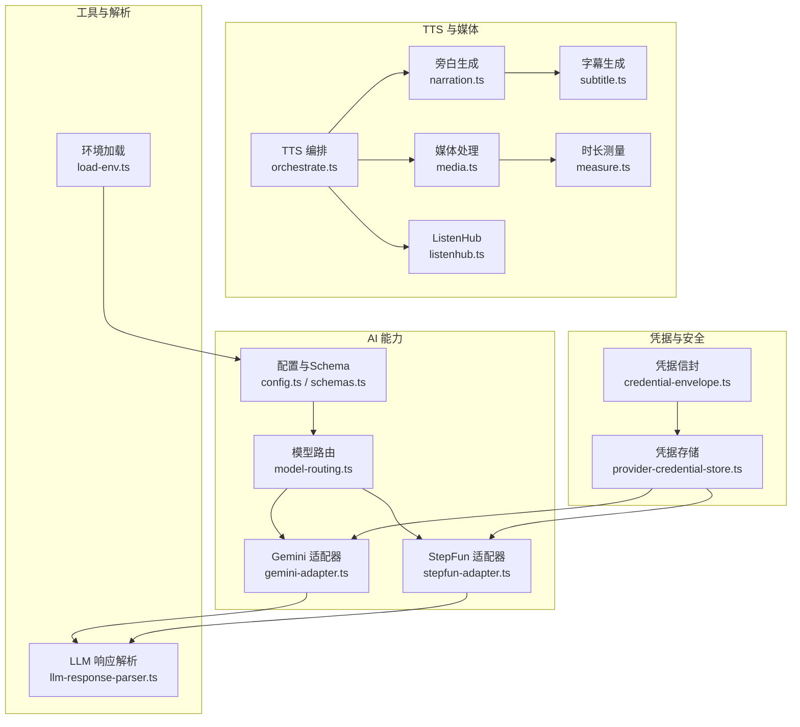
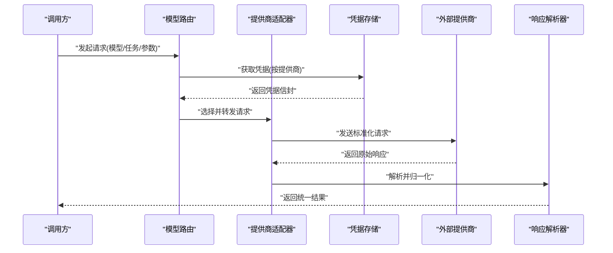
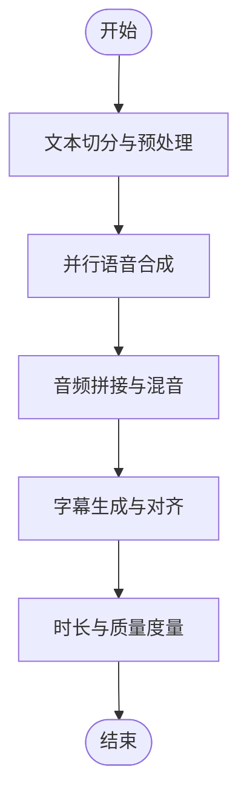
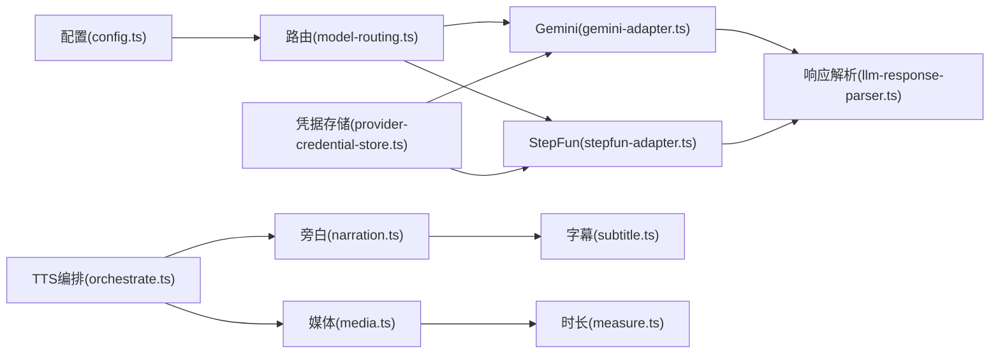

# AI 服务层

<cite>
**本文引用的文件**   
- [src/features/ai/config.ts](file://src/features/ai/config.ts)
- [src/features/ai/model-routing.ts](file://src/features/ai/model-routing.ts)
- [src/features/ai/gemini-adapter.ts](file://src/features/ai/gemini-adapter.ts)
- [src/features/ai/stepfun-adapter.ts](file://src/features/ai/stepfun-adapter.ts)
- [src/features/ai/schemas.ts](file://src/features/ai/schemas.ts)
- [src/features/credentials/provider-credential-store.ts](file://src/features/credentials/provider-credential-store.ts)
- [src/features/credentials/credential-envelope.ts](file://src/features/credentials/credential-envelope.ts)
- [src/features/audio/subtitle.ts](file://src/features/audio/subtitle.ts)
- [src/features/audio/narration.ts](file://src/features/audio/narration.ts)
- [src/features/audio/measure.ts](file://src/features/audio/measure.ts)
- [src/features/routing/media-route-repository.ts](file://src/features/routing/media-route-repository.ts)
- [src/features/routing/model-route-repository.ts](file://src/features/routing/model-route-repository.ts)
- [server/src/tts/orchestrate.ts](file://server/src/tts/orchestrate.ts)
- [server/src/tts/listenhub.ts](file://server/src/tts/listenhub.ts)
- [server/src/tts/media.ts](file://server/src/tts/media.ts)
- [server/src/tts/narration.ts](file://server/src/tts/narration.ts)
- [server/src/lib/llm-response-parser.ts](file://server/src/lib/llm-response-parser.ts)
- [server/src/lib/load-env.ts](file://server/src/lib/load-env.ts)
</cite>

## 目录
1. [简介](#简介)
2. [项目结构](#项目结构)
3. [核心组件](#核心组件)
4. [架构总览](#架构总览)
5. [详细组件分析](#详细组件分析)
6. [依赖关系分析](#依赖关系分析)
7. [性能考量](#性能考量)
8. [故障排查指南](#故障排查指南)
9. [结论](#结论)
10. [附录](#附录)

## 简介
本文件为 PurpleInk AI 服务层的权威技术文档，聚焦于模型适配器架构、多提供商支持与智能路由策略。内容涵盖 Gemini、StepFun 等模型的集成实现（认证管理、请求封装与响应处理），以及 TTS 语音合成、音频处理与字幕生成流程。同时提供扩展新 AI 提供商与自定义处理逻辑的实践指引，并总结并发控制、负载均衡与故障转移机制的设计要点。

## 项目结构
AI 服务层由“配置与路由”“提供商适配器”“凭据与安全”“TTS 编排与媒体处理”“响应解析与工具库”等模块组成。前端与后端通过 API 边界解耦，AI 能力以适配器模式接入，统一对外暴露一致的调用接口。

图表来源
- [src/features/ai/config.ts](file://src/features/ai/config.ts)
- [src/features/ai/model-routing.ts](file://src/features/ai/model-routing.ts)
- [src/features/ai/gemini-adapter.ts](file://src/features/ai/gemini-adapter.ts)
- [src/features/ai/stepfun-adapter.ts](file://src/features/ai/stepfun-adapter.ts)
- [src/features/credentials/provider-credential-store.ts](file://src/features/credentials/provider-credential-store.ts)
- [src/features/credentials/credential-envelope.ts](file://src/features/credentials/credential-envelope.ts)
- [server/src/tts/orchestrate.ts](file://server/src/tts/orchestrate.ts)
- [server/src/tts/narration.ts](file://server/src/tts/narration.ts)
- [server/src/tts/media.ts](file://server/src/tts/media.ts)
- [server/src/tts/listenhub.ts](file://server/src/tts/listenhub.ts)
- [src/features/audio/subtitle.ts](file://src/features/audio/subtitle.ts)
- [src/features/audio/measure.ts](file://src/features/audio/measure.ts)
- [server/src/lib/llm-response-parser.ts](file://server/src/lib/llm-response-parser.ts)
- [server/src/lib/load-env.ts](file://server/src/lib/load-env.ts)

章节来源
- [src/features/ai/config.ts](file://src/features/ai/config.ts)
- [src/features/ai/model-routing.ts](file://src/features/ai/model-routing.ts)
- [src/features/ai/gemini-adapter.ts](file://src/features/ai/gemini-adapter.ts)
- [src/features/ai/stepfun-adapter.ts](file://src/features/ai/stepfun-adapter.ts)
- [src/features/credentials/provider-credential-store.ts](file://src/features/credentials/provider-credential-store.ts)
- [src/features/credentials/credential-envelope.ts](file://src/features/credentials/credential-envelope.ts)
- [server/src/tts/orchestrate.ts](file://server/src/tts/orchestrate.ts)
- [server/src/tts/narration.ts](file://server/src/tts/narration.ts)
- [server/src/tts/media.ts](file://server/src/tts/media.ts)
- [server/src/tts/listenhub.ts](file://server/src/tts/listenhub.ts)
- [src/features/audio/subtitle.ts](file://src/features/audio/subtitle.ts)
- [src/features/audio/measure.ts](file://src/features/audio/measure.ts)
- [server/src/lib/llm-response-parser.ts](file://server/src/lib/llm-response-parser.ts)
- [server/src/lib/load-env.ts](file://server/src/lib/load-env.ts)

## 核心组件
- 配置与 Schema：集中定义模型能力、参数校验与默认值，确保不同提供商的输入输出一致性。
- 模型路由：根据任务类型、负载、健康状态与成本策略选择最优提供商实例。
- 提供商适配器：对具体 LLM/TTS 厂商进行封装，统一认证、请求构造、重试与错误归一化。
- 凭据管理：安全存取密钥与令牌，支持按提供商隔离与最小权限访问。
- TTS 编排：协调文本分段、语音合成、音频拼接、字幕生成与质量度量。
- 响应解析：将各提供商返回的结构化或非结构化结果标准化为内部模型。

章节来源
- [src/features/ai/config.ts](file://src/features/ai/config.ts)
- [src/features/ai/model-routing.ts](file://src/features/ai/model-routing.ts)
- [src/features/ai/gemini-adapter.ts](file://src/features/ai/gemini-adapter.ts)
- [src/features/ai/stepfun-adapter.ts](file://src/features/ai/stepfun-adapter.ts)
- [src/features/credentials/provider-credential-store.ts](file://src/features/credentials/provider-credential-store.ts)
- [src/features/credentials/credential-envelope.ts](file://src/features/credentials/credential-envelope.ts)
- [server/src/tts/orchestrate.ts](file://server/src/tts/orchestrate.ts)
- [server/src/lib/llm-response-parser.ts](file://server/src/lib/llm-response-parser.ts)

## 架构总览
AI 服务层采用“适配器 + 路由 + 编排”的分层架构：
- 适配层屏蔽各厂商差异，暴露统一接口。
- 路由层基于规则与指标动态选择最佳实例。
- 编排层串联文本到语音、媒体处理与字幕生成的端到端流程。

图表来源
- [src/features/ai/model-routing.ts](file://src/features/ai/model-routing.ts)
- [src/features/ai/gemini-adapter.ts](file://src/features/ai/gemini-adapter.ts)
- [src/features/ai/stepfun-adapter.ts](file://src/features/ai/stepfun-adapter.ts)
- [src/features/credentials/provider-credential-store.ts](file://src/features/credentials/provider-credential-store.ts)
- [server/src/lib/llm-response-parser.ts](file://server/src/lib/llm-response-parser.ts)

## 详细组件分析

### 模型配置与 Schema
- 职责：定义模型能力、参数约束、默认值与校验规则；为路由与适配器提供一致的配置基线。
- 关键点：
  - 使用强类型 Schema 保证输入合法性与可观测性。
  - 支持占位符与环境变量注入，便于部署期配置。
  - 提供默认回退策略，提升可用性。

章节来源
- [src/features/ai/config.ts](file://src/features/ai/config.ts)
- [src/features/ai/schemas.ts](file://src/features/ai/schemas.ts)

### 模型路由与智能策略
- 职责：根据任务类型、提供商健康度、延迟与成本等指标，选择最优实例；支持权重、黑名单与故障转移。
- 关键点：
  - 路由决策包含优先级、容量与配额感知。
  - 失败快速回退至备选提供商，避免级联故障。
  - 可插拔策略，便于 A/B 测试与灰度发布。

章节来源
- [src/features/ai/model-routing.ts](file://src/features/ai/model-routing.ts)

### Gemini 适配器
- 职责：封装 Google Gemini 的认证、请求构造、流式与非流式响应处理与错误归一化。
- 关键点：
  - 从凭据存储读取 API Key/Token，构建安全请求头。
  - 统一错误码映射与重试策略。
  - 输出标准化结构，供上层消费。

章节来源
- [src/features/ai/gemini-adapter.ts](file://src/features/ai/gemini-adapter.ts)
- [src/features/credentials/provider-credential-store.ts](file://src/features/credentials/provider-credential-store.ts)

### StepFun 适配器
- 职责：封装 StepFun 的文本/音频相关能力，包括文本生成与音频合成（如适用）的统一接口。
- 关键点：
  - 鉴权与限流处理，兼容其 SDK/HTTP 协议。
  - 响应体解析与字段映射，保证与内部契约一致。
  - 异常分类与降级策略。

章节来源
- [src/features/ai/stepfun-adapter.ts](file://src/features/ai/stepfun-adapter.ts)
- [src/features/credentials/provider-credential-store.ts](file://src/features/credentials/provider-credential-store.ts)

### 凭据管理与安全访问控制
- 职责：集中管理各提供商的密钥与令牌，提供最小权限访问与审计能力。
- 关键点：
  - 凭据信封封装敏感信息，限制传播范围。
  - 存储层支持加密与访问控制，按提供商隔离。
  - 生命周期管理（轮换、过期检测）。

章节来源
- [src/features/credentials/provider-credential-store.ts](file://src/features/credentials/provider-credential-store.ts)
- [src/features/credentials/credential-envelope.ts](file://src/features/credentials/credential-envelope.ts)

### TTS 编排与媒体处理
- 职责：编排文本到语音的全链路，包括文本切分、语音合成、音频拼接、字幕生成与质量度量。
- 关键点：
  - 并行化合成与后处理，提升吞吐。
  - 失败重试与断点续传，保障稳定性。
  - 字幕时间轴对齐与格式转换。

图表来源
- [server/src/tts/orchestrate.ts](file://server/src/tts/orchestrate.ts)
- [server/src/tts/narration.ts](file://server/src/tts/narration.ts)
- [server/src/tts/media.ts](file://server/src/tts/media.ts)
- [server/src/tts/listenhub.ts](file://server/src/tts/listenhub.ts)
- [src/features/audio/subtitle.ts](file://src/features/audio/subtitle.ts)
- [src/features/audio/measure.ts](file://src/features/audio/measure.ts)

章节来源
- [server/src/tts/orchestrate.ts](file://server/src/tts/orchestrate.ts)
- [server/src/tts/narration.ts](file://server/src/tts/narration.ts)
- [server/src/tts/media.ts](file://server/src/tts/media.ts)
- [server/src/tts/listenhub.ts](file://server/src/tts/listenhub.ts)
- [src/features/audio/subtitle.ts](file://src/features/audio/subtitle.ts)
- [src/features/audio/measure.ts](file://src/features/audio/measure.ts)

### 响应解析与工具库
- 职责：将各提供商返回的原始响应解析为统一的内部结构，并提供通用工具函数。
- 关键点：
  - 容错解析与字段缺失回退。
  - 日志与追踪埋点，便于问题定位。
  - 环境变量加载与配置合并。

章节来源
- [server/src/lib/llm-response-parser.ts](file://server/src/lib/llm-response-parser.ts)
- [server/src/lib/load-env.ts](file://server/src/lib/load-env.ts)

## 依赖关系分析
AI 服务层的关键依赖如下：
- 路由依赖配置与凭据存储，决定目标适配器。
- 适配器依赖凭据存储与响应解析器。
- TTS 编排依赖媒体处理、字幕与时长测量模块。
- 所有模块依赖统一的环境加载与日志工具。

图表来源
- [src/features/ai/config.ts](file://src/features/ai/config.ts)
- [src/features/ai/model-routing.ts](file://src/features/ai/model-routing.ts)
- [src/features/ai/gemini-adapter.ts](file://src/features/ai/gemini-adapter.ts)
- [src/features/ai/stepfun-adapter.ts](file://src/features/ai/stepfun-adapter.ts)
- [src/features/credentials/provider-credential-store.ts](file://src/features/credentials/provider-credential-store.ts)
- [server/src/lib/llm-response-parser.ts](file://server/src/lib/llm-response-parser.ts)
- [server/src/tts/orchestrate.ts](file://server/src/tts/orchestrate.ts)
- [server/src/tts/narration.ts](file://server/src/tts/narration.ts)
- [server/src/tts/media.ts](file://server/src/tts/media.ts)
- [src/features/audio/subtitle.ts](file://src/features/audio/subtitle.ts)
- [src/features/audio/measure.ts](file://src/features/audio/measure.ts)

章节来源
- [src/features/ai/config.ts](file://src/features/ai/config.ts)
- [src/features/ai/model-routing.ts](file://src/features/ai/model-routing.ts)
- [src/features/ai/gemini-adapter.ts](file://src/features/ai/gemini-adapter.ts)
- [src/features/ai/stepfun-adapter.ts](file://src/features/ai/stepfun-adapter.ts)
- [src/features/credentials/provider-credential-store.ts](file://src/features/credentials/provider-credential-store.ts)
- [server/src/lib/llm-response-parser.ts](file://server/src/lib/llm-response-parser.ts)
- [server/src/tts/orchestrate.ts](file://server/src/tts/orchestrate.ts)
- [server/src/tts/narration.ts](file://server/src/tts/narration.ts)
- [server/src/tts/media.ts](file://server/src/tts/media.ts)
- [src/features/audio/subtitle.ts](file://src/features/audio/subtitle.ts)
- [src/features/audio/measure.ts](file://src/features/audio/measure.ts)

## 性能考量
- 并发控制：在 TTS 编排中采用并行合成与批处理，结合队列与限流避免过载。
- 负载均衡：路由层按权重与健康度分配流量，支持热点模型分流。
- 缓存与去重：对重复请求与中间结果进行缓存，降低外部调用成本。
- 超时与重试：设置合理的超时阈值与指数退避重试，提高鲁棒性。
- 资源隔离：按任务类型划分执行槽位，防止长尾任务阻塞关键路径。

[本节为通用指导，不直接分析具体文件]

## 故障排查指南
- 常见问题
  - 凭据无效或过期：检查凭据存储中的令牌有效期与轮换策略。
  - 路由失败：查看路由策略与提供商健康状态，确认是否触发回退。
  - 响应解析异常：核对 Schema 与字段映射，检查上游变更。
  - TTS 合成失败：检查文本切分、媒体格式与时长测量结果。
- 诊断步骤
  - 启用详细日志与追踪，定位失败阶段。
  - 复现最小用例，隔离问题域。
  - 验证配置与环境变量加载顺序。
  - 对比成功与失败的请求/响应样本。

章节来源
- [src/features/credentials/provider-credential-store.ts](file://src/features/credentials/provider-credential-store.ts)
- [src/features/ai/model-routing.ts](file://src/features/ai/model-routing.ts)
- [server/src/lib/llm-response-parser.ts](file://server/src/lib/llm-response-parser.ts)
- [server/src/tts/orchestrate.ts](file://server/src/tts/orchestrate.ts)

## 结论
PurpleInk AI 服务层通过适配器与路由解耦多提供商差异，配合 TTS 编排与媒体处理，形成稳定可扩展的 AI 能力平台。建议持续完善路由策略、增强监控与可观测性，并在扩展新提供商时遵循现有契约与规范，确保系统的一致性与可维护性。

[本节为总结，不直接分析具体文件]

## 附录

### 如何扩展新的 AI 提供商（示例步骤）
- 新增适配器
  - 在适配器目录创建新文件，实现统一接口（认证、请求构造、响应解析、错误处理）。
  - 参考现有适配器结构与命名约定。
- 注册路由与配置
  - 在路由配置中添加新提供商的策略与权重。
  - 在 Schema 中补充参数校验与默认值。
- 凭据与安全
  - 在凭据存储中增加新提供商的密钥项，设置访问权限。
  - 使用凭据信封传递敏感信息。
- 测试与验证
  - 编写单元测试覆盖正常与异常路径。
  - 进行端到端集成测试，验证路由与回退。

章节来源
- [src/features/ai/gemini-adapter.ts](file://src/features/ai/gemini-adapter.ts)
- [src/features/ai/stepfun-adapter.ts](file://src/features/ai/stepfun-adapter.ts)
- [src/features/ai/config.ts](file://src/features/ai/config.ts)
- [src/features/ai/model-routing.ts](file://src/features/ai/model-routing.ts)
- [src/features/credentials/provider-credential-store.ts](file://src/features/credentials/provider-credential-store.ts)

### TTS 语音合成与字幕生成流程（示例）
- 文本切分：按语义与长度切分，保证每段适合合成。
- 并行合成：按并发上限并行调用 TTS 提供商。
- 音频拼接：按时间轴拼接，处理静音与过渡。
- 字幕生成：基于音频时长与文本同步生成字幕。
- 质量度量：计算时长、停顿与清晰度指标。

章节来源
- [server/src/tts/orchestrate.ts](file://server/src/tts/orchestrate.ts)
- [server/src/tts/narration.ts](file://server/src/tts/narration.ts)
- [server/src/tts/media.ts](file://server/src/tts/media.ts)
- [src/features/audio/subtitle.ts](file://src/features/audio/subtitle.ts)
- [src/features/audio/measure.ts](file://src/features/audio/measure.ts)