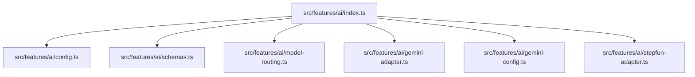
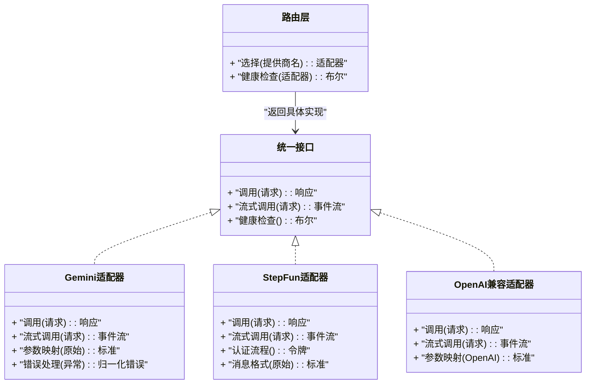
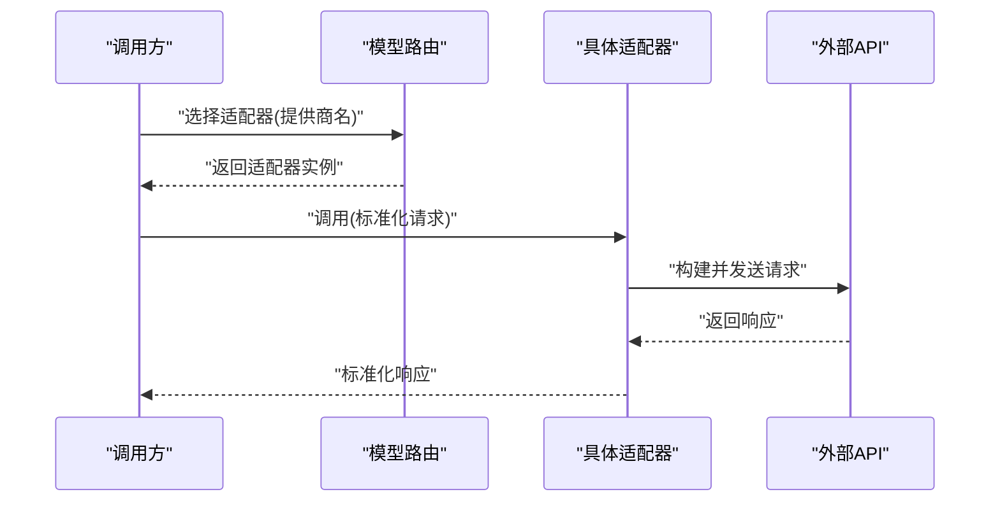
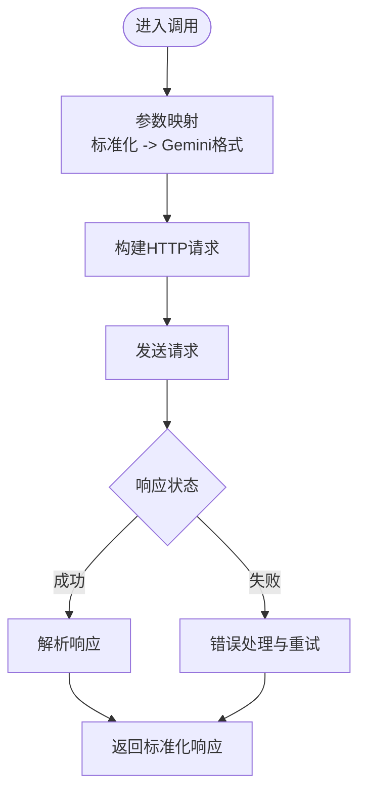
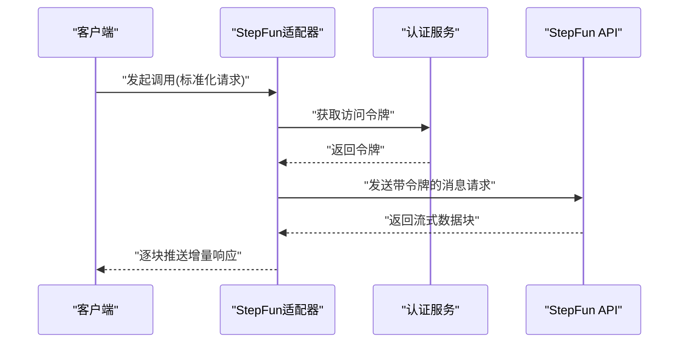
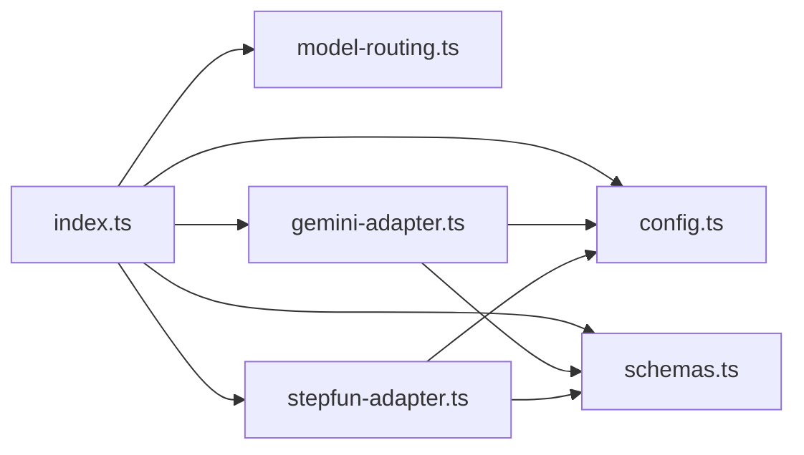

# AI 模型适配器

<cite>
**本文引用的文件**   
- [src/features/ai/index.ts](file://src/features/ai/index.ts)
- [src/features/ai/config.ts](file://src/features/ai/config.ts)
- [src/features/ai/schemas.ts](file://src/features/ai/schemas.ts)
- [src/features/ai/model-routing.ts](file://src/features/ai/model-routing.ts)
- [src/features/ai/gemini-adapter.ts](file://src/features/ai/gemini-adapter.ts)
- [src/features/ai/gemini-config.ts](file://src/features/ai/gemini-config.ts)
- [src/features/ai/stepfun-adapter.ts](file://src/features/ai/stepfun-adapter.ts)
</cite>

## 目录
1. [简介](#简介)
2. [项目结构](#项目结构)
3. [核心组件](#核心组件)
4. [架构总览](#架构总览)
5. [详细组件分析](#详细组件分析)
6. [依赖关系分析](#依赖关系分析)
7. [性能考量](#性能考量)
8. [故障排查指南](#故障排查指南)
9. [结论](#结论)
10. [附录](#附录)

## 简介
本文件面向“AI 模型适配器系统”，系统性阐述适配器的架构设计模式与实现细节，重点覆盖：
- 统一接口定义、提供商抽象与请求响应转换机制
- Gemini 适配器的 API 调用、参数映射与错误处理
- StepFun 适配器的认证流程、消息格式与流式响应处理
- Mimo 适配器的特殊功能与配置选项（概念性说明）
- OpenAI 兼容适配器的通用实现思路（概念性说明）
- 扩展新模型提供商的示例步骤：注册、配置校验与性能优化策略

## 项目结构
AI 适配器相关代码集中在 src/features/ai 目录下，采用“按能力域组织”的结构：
- index.ts：模块入口，聚合导出适配器与路由能力
- config.ts：运行时配置加载与校验
- schemas.ts：类型与校验 Schema 定义
- model-routing.ts：模型路由与选择逻辑
- gemini-adapter.ts / gemini-config.ts：Gemini 提供商适配器与配置
- stepfun-adapter.ts：StepFun 提供商适配器

图表来源 
- [src/features/ai/index.ts](file://src/features/ai/index.ts)
- [src/features/ai/config.ts](file://src/features/ai/config.ts)
- [src/features/ai/schemas.ts](file://src/features/ai/schemas.ts)
- [src/features/ai/model-routing.ts](file://src/features/ai/model-routing.ts)
- [src/features/ai/gemini-adapter.ts](file://src/features/ai/gemini-adapter.ts)
- [src/features/ai/gemini-config.ts](file://src/features/ai/gemini-config.ts)
- [src/features/ai/stepfun-adapter.ts](file://src/features/ai/stepfun-adapter.ts)

章节来源
- [src/features/ai/index.ts](file://src/features/ai/index.ts)
- [src/features/ai/config.ts](file://src/features/ai/config.ts)
- [src/features/ai/schemas.ts](file://src/features/ai/schemas.ts)
- [src/features/ai/model-routing.ts](file://src/features/ai/model-routing.ts)
- [src/features/ai/gemini-adapter.ts](file://src/features/ai/gemini-adapter.ts)
- [src/features/ai/gemini-config.ts](file://src/features/ai/gemini-config.ts)
- [src/features/ai/stepfun-adapter.ts](file://src/features/ai/stepfun-adapter.ts)

## 核心组件
- 统一接口与提供商抽象
  - 通过统一的适配器接口定义，屏蔽不同模型提供商的差异，向上层提供一致的调用方式。
  - 关键职责包括：参数标准化、请求构建、响应解析、错误归一化、可选的流式输出。
- 配置与校验
  - 集中管理各提供商的配置项，使用 Schema 进行强类型校验，确保运行期安全。
- 模型路由
  - 根据配置或上下文动态选择具体适配器实例，支持多提供商切换与降级。
- 适配器实现
  - Gemini 适配器：封装 Google Gemini API 的请求与响应转换。
  - StepFun 适配器：封装 StepFun API 的认证、消息格式与流式响应。
  - OpenAI 兼容适配器（概念）：基于 OpenAI 格式的 HTTP 接口进行通用适配。
  - Mimo 适配器（概念）：针对特定业务场景的特殊能力与配置。

章节来源
- [src/features/ai/schemas.ts](file://src/features/ai/schemas.ts)
- [src/features/ai/config.ts](file://src/features/ai/config.ts)
- [src/features/ai/model-routing.ts](file://src/features/ai/model-routing.ts)
- [src/features/ai/gemini-adapter.ts](file://src/features/ai/gemini-adapter.ts)
- [src/features/ai/gemini-config.ts](file://src/features/ai/gemini-config.ts)
- [src/features/ai/stepfun-adapter.ts](file://src/features/ai/stepfun-adapter.ts)

## 架构总览
适配器系统采用“统一接口 + 提供商实现 + 路由选择”的分层架构：
- 上层调用方仅依赖统一接口，无需关心底层提供商差异
- 路由层根据配置或运行时条件选择具体适配器
- 每个适配器负责将统一请求转换为提供商特定请求，并将响应转回统一格式

图表来源 
- [src/features/ai/model-routing.ts](file://src/features/ai/model-routing.ts)
- [src/features/ai/gemini-adapter.ts](file://src/features/ai/gemini-adapter.ts)
- [src/features/ai/stepfun-adapter.ts](file://src/features/ai/stepfun-adapter.ts)

## 详细组件分析

### 统一接口与路由
- 统一接口
  - 定义标准化的调用方法、流式方法与错误模型，确保所有适配器行为一致。
- 路由层
  - 根据配置中的提供商名称或运行时策略选择具体适配器实例。
  - 支持健康检查与快速失败，避免对不可用提供商的无效调用。

图表来源 
- [src/features/ai/model-routing.ts](file://src/features/ai/model-routing.ts)
- [src/features/ai/gemini-adapter.ts](file://src/features/ai/gemini-adapter.ts)
- [src/features/ai/stepfun-adapter.ts](file://src/features/ai/stepfun-adapter.ts)

章节来源
- [src/features/ai/model-routing.ts](file://src/features/ai/model-routing.ts)
- [src/features/ai/schemas.ts](file://src/features/ai/schemas.ts)

### Gemini 适配器
- API 调用
  - 将统一请求转换为 Gemini API 所需格式，包含模型名、提示词、温度等参数。
- 参数映射
  - 将内部标准参数映射到 Gemini 特定的字段，处理缺失值与默认值。
- 错误处理
  - 捕获网络与业务错误，统一为内部错误模型，便于上层处理。
- 流式响应（如适用）
  - 若提供商支持流式输出，则按块推送增量结果，降低首字节延迟。

图表来源 
- [src/features/ai/gemini-adapter.ts](file://src/features/ai/gemini-adapter.ts)
- [src/features/ai/gemini-config.ts](file://src/features/ai/gemini-config.ts)

章节来源
- [src/features/ai/gemini-adapter.ts](file://src/features/ai/gemini-adapter.ts)
- [src/features/ai/gemini-config.ts](file://src/features/ai/gemini-config.ts)

### StepFun 适配器
- 认证流程
  - 在请求前获取访问令牌（如 OAuth），并将其注入到请求头中。
- 消息格式
  - 将统一消息体转换为 StepFun 所需的 JSON 结构，包括角色、内容、工具调用等。
- 流式响应处理
  - 使用流式传输接收增量文本，逐步渲染给用户，提升交互体验。

图表来源 
- [src/features/ai/stepfun-adapter.ts](file://src/features/ai/stepfun-adapter.ts)

章节来源
- [src/features/ai/stepfun-adapter.ts](file://src/features/ai/stepfun-adapter.ts)

### OpenAI 兼容适配器（概念）
- 通用实现思路
  - 基于 OpenAI 格式的 HTTP 接口，将统一请求映射为标准 OpenAI 请求体。
  - 支持多种模型与参数，如 temperature、max_tokens、stream 等。
  - 错误处理遵循 OpenAI 错误码规范，统一转换为内部错误模型。
- 适用场景
  - 任意遵循 OpenAI 格式的第三方服务（如本地部署的 LLM 服务）。

[本节为概念性说明，不直接分析具体文件]

### Mimo 适配器（概念）
- 特殊功能
  - 可能包含领域特定的参数、工具调用或输出格式。
- 配置选项
  - 提供额外的开关以启用/禁用某些特性，如缓存、日志级别、超时等。

[本节为概念性说明，不直接分析具体文件]

## 依赖关系分析
- 模块内依赖
  - index.ts 聚合导出 config、schemas、model-routing 与各适配器
  - 各适配器依赖 schemas 进行类型校验，依赖 config 读取运行时配置
- 外部依赖
  - HTTP 客户端用于调用外部 API
  - 认证库用于获取访问令牌（StepFun）
  - 流式处理库用于处理 SSE/流式响应

图表来源 
- [src/features/ai/index.ts](file://src/features/ai/index.ts)
- [src/features/ai/config.ts](file://src/features/ai/config.ts)
- [src/features/ai/schemas.ts](file://src/features/ai/schemas.ts)
- [src/features/ai/model-routing.ts](file://src/features/ai/model-routing.ts)
- [src/features/ai/gemini-adapter.ts](file://src/features/ai/gemini-adapter.ts)
- [src/features/ai/stepfun-adapter.ts](file://src/features/ai/stepfun-adapter.ts)

章节来源
- [src/features/ai/index.ts](file://src/features/ai/index.ts)
- [src/features/ai/config.ts](file://src/features/ai/config.ts)
- [src/features/ai/schemas.ts](file://src/features/ai/schemas.ts)
- [src/features/ai/model-routing.ts](file://src/features/ai/model-routing.ts)
- [src/features/ai/gemini-adapter.ts](file://src/features/ai/gemini-adapter.ts)
- [src/features/ai/stepfun-adapter.ts](file://src/features/ai/stepfun-adapter.ts)

## 性能考量
- 连接复用与超时控制
  - 复用 HTTP 连接，设置合理的超时与重试策略，避免频繁握手与资源耗尽。
- 流式输出
  - 优先使用流式响应以降低首字节延迟，提升用户体验。
- 参数裁剪与缓存
  - 对大请求体进行必要裁剪；对可缓存的响应进行短期缓存以减少重复调用。
- 并发与限流
  - 控制并发请求数，避免触发提供商限流；必要时实现队列与退避策略。

[本节为通用指导，不直接分析具体文件]

## 故障排查指南
- 常见错误分类
  - 认证失败：检查令牌有效期与权限范围
  - 参数错误：核对必填字段与数据类型
  - 网络错误：检查代理、DNS 与防火墙设置
  - 业务错误：查看提供商返回的错误码与消息
- 诊断建议
  - 开启调试日志，记录请求与响应摘要
  - 使用健康检查端点验证提供商可用性
  - 对关键路径添加重试与降级逻辑

章节来源
- [src/features/ai/gemini-adapter.ts](file://src/features/ai/gemini-adapter.ts)
- [src/features/ai/stepfun-adapter.ts](file://src/features/ai/stepfun-adapter.ts)

## 结论
本适配器系统通过统一接口与路由机制，有效解耦了上层业务与下游模型提供商的差异。Gemini 与 StepFun 的实现展示了参数映射、认证与流式响应的典型实践。对于 OpenAI 兼容与 Mimo 等场景，可采用相同的设计模式快速扩展。建议在新增提供商时严格遵循配置校验、错误归一化与性能优化原则，以确保系统的稳定性与可维护性。

[本节为总结性内容，不直接分析具体文件]

## 附录
- 扩展新提供商的步骤（概念性）
  - 定义适配器类，实现统一接口
  - 在路由层注册新提供商
  - 编写配置校验规则与默认值
  - 实现参数映射与错误处理
  - 添加单元测试与集成测试
  - 评估性能并引入必要的优化（连接池、缓存、流式）

[本节为概念性指导，不直接分析具体文件]