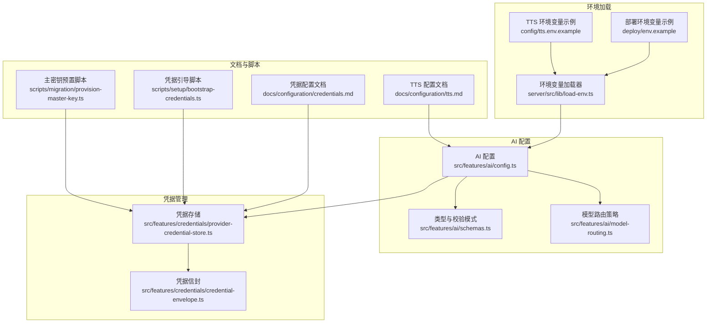
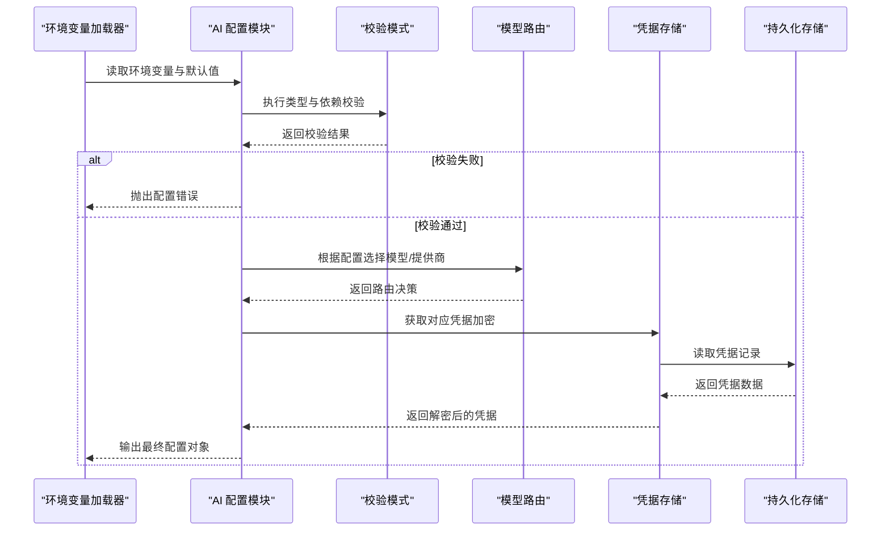
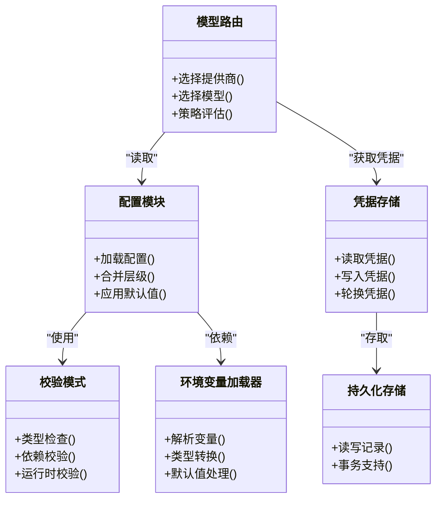

# AI 配置管理

<cite>
**本文档引用的文件**
- [src/features/ai/config.ts](file://src/features/ai/config.ts)
- [src/features/ai/schemas.ts](file://src/features/ai/schemas.ts)
- [src/features/ai/model-routing.ts](file://src/features/ai/model-routing.ts)
- [src/features/credentials/provider-credential-store.ts](file://src/features/credentials/provider-credential-store.ts)
- [src/features/credentials/credential-envelope.ts](file://src/features/credentials/credential-envelope.ts)
- [server/src/lib/load-env.ts](file://server/src/lib/load-env.ts)
- [deploy/env.example](file://deploy/env.example)
- [config/tts.env.example](file://config/tts.env.example)
- [docs/configuration/credentials.md](file://docs/configuration/credentials.md)
- [docs/configuration/tts.md](file://docs/configuration/tts.md)
- [scripts/setup/bootstrap-credentials.ts](file://scripts/setup/bootstrap-credentials.ts)
- [scripts/migration/provision-master-key.ts](file://scripts/migration/provision-master-key.ts)
- [tests/deployment-config.test.mjs](file://tests/deployment-config.test.mjs)
- [tests/env.test.ts](file://tests/env.test.ts)
</cite>

## 目录
1. [简介](#简介)
2. [项目结构](#项目结构)
3. [核心组件](#核心组件)
4. [架构总览](#架构总览)
5. [详细组件分析](#详细组件分析)
6. [依赖关系分析](#依赖关系分析)
7. [性能考虑](#性能考虑)
8. [故障排查指南](#故障排查指南)
9. [结论](#结论)
10. [附录](#附录)

## 简介
本文件为 AI 服务配置管理系统提供全面文档，覆盖配置层次与优先级、验证机制、凭据管理、动态更新与环境变量管理。目标是帮助开发者与运维人员快速理解并正确配置系统，确保多 AI 提供商接入的安全性与稳定性。

## 项目结构
AI 配置相关代码主要分布在以下位置：
- AI 配置与路由：src/features/ai
- 凭据存储与信封封装：src/features/credentials
- 环境变量加载：server/src/lib/load-env.ts
- 部署与环境示例：deploy/env.example, config/tts.env.example
- 配置文档：docs/configuration
- 初始化与密钥分发脚本：scripts/setup, scripts/migration
- 配置相关测试：tests

图表来源
- [src/features/ai/config.ts](file://src/features/ai/config.ts)
- [src/features/ai/schemas.ts](file://src/features/ai/schemas.ts)
- [src/features/ai/model-routing.ts](file://src/features/ai/model-routing.ts)
- [src/features/credentials/provider-credential-store.ts](file://src/features/credentials/provider-credential-store.ts)
- [src/features/credentials/credential-envelope.ts](file://src/features/credentials/credential-envelope.ts)
- [server/src/lib/load-env.ts](file://server/src/lib/load-env.ts)
- [deploy/env.example](file://deploy/env.example)
- [config/tts.env.example](file://config/tts.env.example)
- [docs/configuration/credentials.md](file://docs/configuration/credentials.md)
- [docs/configuration/tts.md](file://docs/configuration/tts.md)
- [scripts/setup/bootstrap-credentials.ts](file://scripts/setup/bootstrap-credentials.ts)
- [scripts/migration/provision-master-key.ts](file://scripts/migration/provision-master-key.ts)

章节来源
- [src/features/ai/config.ts](file://src/features/ai/config.ts)
- [src/features/ai/schemas.ts](file://src/features/ai/schemas.ts)
- [src/features/ai/model-routing.ts](file://src/features/ai/model-routing.ts)
- [src/features/credentials/provider-credential-store.ts](file://src/features/credentials/provider-credential-store.ts)
- [src/features/credentials/credential-envelope.ts](file://src/features/credentials/credential-envelope.ts)
- [server/src/lib/load-env.ts](file://server/src/lib/load-env.ts)
- [deploy/env.example](file://deploy/env.example)
- [config/tts.env.example](file://config/tts.env.example)
- [docs/configuration/credentials.md](file://docs/configuration/credentials.md)
- [docs/configuration/tts.md](file://docs/configuration/tts.md)
- [scripts/setup/bootstrap-credentials.ts](file://scripts/setup/bootstrap-credentials.ts)
- [scripts/migration/provision-master-key.ts](file://scripts/migration/provision-master-key.ts)

## 核心组件
- 配置加载与合并：负责从环境变量、配置文件与工作空间/用户级设置中读取并按优先级合并，生成最终运行时配置对象。
- 类型与模式校验：使用统一模式定义对配置进行强类型检查，确保字段类型、必填项与取值范围正确。
- 模型路由：根据配置选择具体 AI 提供商与模型，支持按工作负载或策略切换。
- 凭据存储与信封：集中管理敏感信息，采用加密存储与访问控制，并提供轮换能力。
- 环境变量加载：标准化环境变量解析与默认值处理，保证跨环境一致性。

章节来源
- [src/features/ai/config.ts](file://src/features/ai/config.ts)
- [src/features/ai/schemas.ts](file://src/features/ai/schemas.ts)
- [src/features/ai/model-routing.ts](file://src/features/ai/model-routing.ts)
- [src/features/credentials/provider-credential-store.ts](file://src/features/credentials/provider-credential-store.ts)
- [src/features/credentials/credential-envelope.ts](file://src/features/credentials/credential-envelope.ts)
- [server/src/lib/load-env.ts](file://server/src/lib/load-env.ts)

## 架构总览
下图展示了配置加载、校验、路由与凭据管理的整体流程。

图表来源
- [server/src/lib/load-env.ts](file://server/src/lib/load-env.ts)
- [src/features/ai/config.ts](file://src/features/ai/config.ts)
- [src/features/ai/schemas.ts](file://src/features/ai/schemas.ts)
- [src/features/ai/model-routing.ts](file://src/features/ai/model-routing.ts)
- [src/features/credentials/provider-credential-store.ts](file://src/features/credentials/provider-credential-store.ts)
- [src/features/credentials/credential-envelope.ts](file://src/features/credentials/credential-envelope.ts)

## 详细组件分析

### 配置层次结构与优先级
- 全局配置：来自环境变量与部署配置，作为系统默认值。
- 工作空间配置：按工作空间覆盖全局配置，用于团队或项目级定制。
- 用户级配置：按用户覆盖工作空间与全局配置，实现个性化设置。
- 优先级规则：用户级 > 工作空间级 > 全局级；同层配置以显式覆盖为准。
- 合并策略：深合并对象字段，数组通常以高优先级替换低优先级（除非另有说明）。

章节来源
- [src/features/ai/config.ts](file://src/features/ai/config.ts)
- [deploy/env.example](file://deploy/env.example)
- [config/tts.env.example](file://config/tts.env.example)

### 配置验证机制
- 类型检查：基于统一模式定义，严格校验字段类型、可选性与枚举值。
- 依赖关系验证：在基础类型通过后，进行字段间依赖校验（如启用某功能需满足前置条件）。
- 运行时校验：在关键路径上再次校验输入参数，防止脏数据进入下游。
- 错误反馈：提供清晰的错误消息与定位，便于快速修复。

章节来源
- [src/features/ai/schemas.ts](file://src/features/ai/schemas.ts)
- [src/features/ai/config.ts](file://src/features/ai/config.ts)

### 凭据管理方案
- 加密存储：凭据以密文形式持久化，避免明文泄露。
- 访问控制：仅允许受信任的服务与角色访问特定凭据。
- 轮换策略：支持凭据版本管理与平滑轮换，降低密钥泄露风险。
- 信封封装：将凭据与元数据打包，便于审计与追踪。

章节来源
- [src/features/credentials/provider-credential-store.ts](file://src/features/credentials/provider-credential-store.ts)
- [src/features/credentials/credential-envelope.ts](file://src/features/credentials/credential-envelope.ts)
- [docs/configuration/credentials.md](file://docs/configuration/credentials.md)
- [scripts/setup/bootstrap-credentials.ts](file://scripts/setup/bootstrap-credentials.ts)
- [scripts/migration/provision-master-key.ts](file://scripts/migration/provision-master-key.ts)

### 动态配置更新机制
- 热重载：在不重启服务的情况下重新加载配置，适用于非敏感参数。
- 版本管理：配置变更附带版本号，支持回滚到上一稳定版本。
- 回滚支持：当新版本引发问题时，可快速恢复到上一个已知良好的配置快照。

章节来源
- [src/features/ai/config.ts](file://src/features/ai/config.ts)
- [src/features/ai/model-routing.ts](file://src/features/ai/model-routing.ts)

### 环境变量管理、配置文件格式与默认值
- 环境变量：通过统一加载器解析，支持类型转换与默认值。
- 配置文件格式：建议采用结构化格式（如 JSON/YAML），便于版本管理与合并。
- 默认值处理：未提供的字段使用默认值，确保系统可启动与运行。

章节来源
- [server/src/lib/load-env.ts](file://server/src/lib/load-env.ts)
- [deploy/env.example](file://deploy/env.example)
- [config/tts.env.example](file://config/tts.env.example)

### 配置示例与实践
- 设置不同 AI 提供商：通过环境变量或配置文件指定提供商与模型名称，由路由模块自动选择。
- 配置网络参数：设置超时、重试次数、并发连接数等，提升稳定性与吞吐。
- 优化性能选项：调整缓存大小、批处理大小、线程池规模等，平衡资源与延迟。

章节来源
- [src/features/ai/model-routing.ts](file://src/features/ai/model-routing.ts)
- [deploy/env.example](file://deploy/env.example)
- [config/tts.env.example](file://config/tts.env.example)

## 依赖关系分析
AI 配置模块依赖校验模式与环境变量加载器；模型路由依赖配置与凭据存储；凭据存储依赖持久化存储与加密模块。

图表来源
- [src/features/ai/config.ts](file://src/features/ai/config.ts)
- [src/features/ai/schemas.ts](file://src/features/ai/schemas.ts)
- [src/features/ai/model-routing.ts](file://src/features/ai/model-routing.ts)
- [src/features/credentials/provider-credential-store.ts](file://src/features/credentials/provider-credential-store.ts)
- [server/src/lib/load-env.ts](file://server/src/lib/load-env.ts)

章节来源
- [src/features/ai/config.ts](file://src/features/ai/config.ts)
- [src/features/ai/schemas.ts](file://src/features/ai/schemas.ts)
- [src/features/ai/model-routing.ts](file://src/features/ai/model-routing.ts)
- [src/features/credentials/provider-credential-store.ts](file://src/features/credentials/provider-credential-store.ts)
- [server/src/lib/load-env.ts](file://server/src/lib/load-env.ts)

## 性能考虑
- 配置加载缓存：避免重复解析环境变量与配置文件，减少启动开销。
- 校验短路：在早期阶段快速失败，避免无效配置进入后续流程。
- 路由优化：缓存模型选择结果，降低频繁决策的开销。
- 凭据访问最小化：按需解密与读取，减少敏感数据的暴露面。

[本节为通用指导，不直接分析具体文件]

## 故障排查指南
- 配置校验失败：检查字段类型、必填项与依赖关系，参考错误消息定位问题。
- 凭据无法读取：确认权限与加密密钥是否正确，检查凭据版本与轮换状态。
- 环境变量缺失：对照示例文件补齐必要变量，确保命名与格式一致。
- 动态更新异常：验证版本合法性与回滚策略，必要时恢复上一版本。

章节来源
- [src/features/ai/schemas.ts](file://src/features/ai/schemas.ts)
- [src/features/credentials/provider-credential-store.ts](file://src/features/credentials/provider-credential-store.ts)
- [server/src/lib/load-env.ts](file://server/src/lib/load-env.ts)
- [tests/deployment-config.test.mjs](file://tests/deployment-config.test.mjs)
- [tests/env.test.ts](file://tests/env.test.ts)

## 结论
本配置管理系统通过分层合并、严格校验与安全凭据管理，为多 AI 提供商接入提供了可靠基础。结合动态更新与环境变量标准化，可在保证安全性的同时提升运维效率与系统稳定性。

[本节为总结性内容，不直接分析具体文件]

## 附录
- 环境变量示例：deploy/env.example, config/tts.env.example
- 配置文档：docs/configuration/credentials.md, docs/configuration/tts.md
- 初始化脚本：scripts/setup/bootstrap-credentials.ts, scripts/migration/provision-master-key.ts
- 测试用例：tests/deployment-config.test.mjs, tests/env.test.ts

章节来源
- [deploy/env.example](file://deploy/env.example)
- [config/tts.env.example](file://config/tts.env.example)
- [docs/configuration/credentials.md](file://docs/configuration/credentials.md)
- [docs/configuration/tts.md](file://docs/configuration/tts.md)
- [scripts/setup/bootstrap-credentials.ts](file://scripts/setup/bootstrap-credentials.ts)
- [scripts/migration/provision-master-key.ts](file://scripts/migration/provision-master-key.ts)
- [tests/deployment-config.test.mjs](file://tests/deployment-config.test.mjs)
- [tests/env.test.ts](file://tests/env.test.ts)