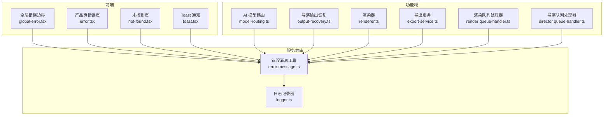
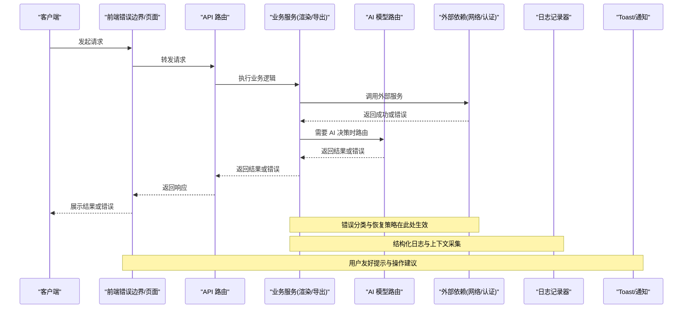
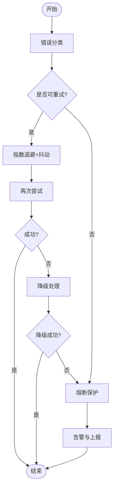
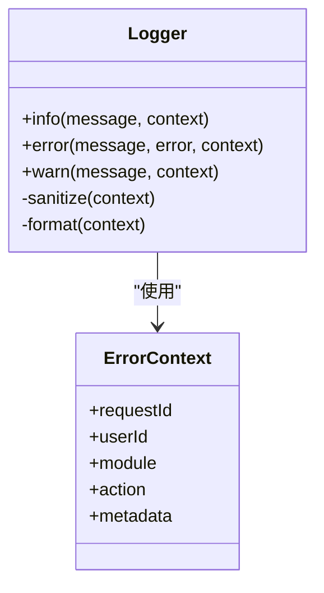
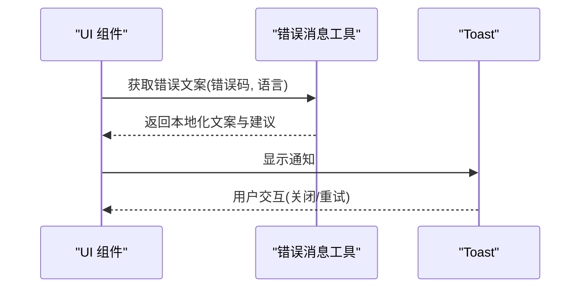
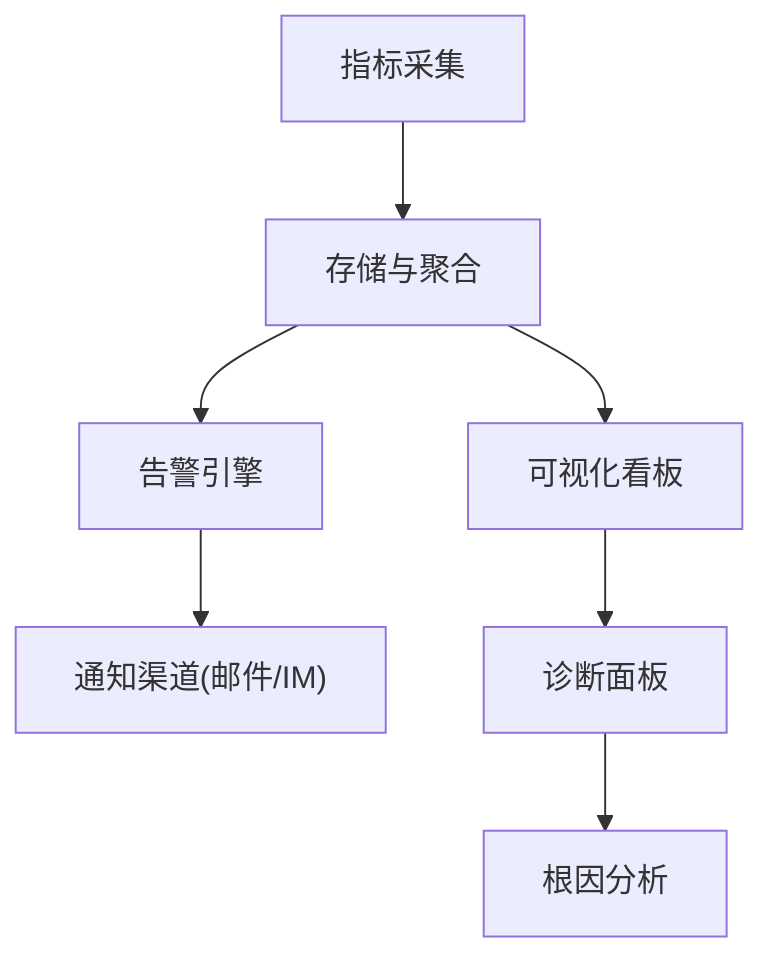
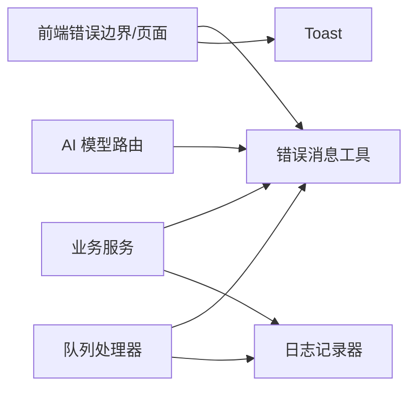

# AI 错误处理

<cite>
**本文引用的文件**
- [server/src/lib/error-message.ts](file://server/src/lib/error-message.ts)
- [server/src/lib/logger.ts](file://server/src/lib/logger.ts)
- [src/app/global-error.tsx](file://src/app/global-error.tsx)
- [src/app/(products)/error.tsx](file://src/app/(products)/error.tsx)
- [src/app/not-found.tsx](file://src/app/not-found.tsx)
- [src/components/ui/toast.tsx](file://src/components/ui/toast.tsx)
- [src/features/ai/model-routing.ts](file://src/features/ai/model-routing.ts)
- [src/features/director/output-recovery.ts](file://src/features/director/output-recovery.ts)
- [src/features/render/renderer.ts](file://src/features/render/renderer.ts)
- [src/features/render/export-service.ts](file://src/features/render/export-service.ts)
- [src/features/render/queue-handler.ts](file://src/features/render/queue-handler.ts)
- [src/features/director/queue-handler.ts](file://src/features/director/queue-handler.ts)
- [tests/worker-error-hygiene.test.ts](file://tests/worker-error-hygiene.test.ts)
</cite>

## 目录
1. [简介](#简介)
2. [项目结构](#项目结构)
3. [核心组件](#核心组件)
4. [架构总览](#架构总览)
5. [详细组件分析](#详细组件分析)
6. [依赖关系分析](#依赖关系分析)
7. [性能考虑](#性能考虑)
8. [故障排查指南](#故障排查指南)
9. [结论](#结论)
10. [附录](#附录)

## 简介
本文件面向 AI 服务错误处理系统，系统化阐述错误分类体系（网络错误、认证失败、速率限制、业务逻辑错误）、错误恢复策略（自动重试、降级处理、熔断机制）、错误日志规范（上下文信息、堆栈跟踪、调试数据收集）、用户友好提示生成（错误码映射、多语言支持、建议操作），以及监控告警与诊断工具配置。文档同时提供具体示例，展示如何捕获异常、执行恢复操作并通知用户。

## 项目结构
本项目采用前后端分离与功能域划分：
- 服务端库层：统一错误消息与日志记录能力
- Next.js 应用层：全局错误边界、页面级错误页、Toast 通知
- 功能域：AI 模型路由、导演编排输出恢复、渲染与导出服务、队列处理器
- 测试：工作进程错误卫生性验证

**图表来源**
- [src/app/global-error.tsx](file://src/app/global-error.tsx)
- [src/app/(products)/error.tsx](file://src/app/(products)/error.tsx)
- [src/app/not-found.tsx](file://src/app/not-found.tsx)
- [src/components/ui/toast.tsx](file://src/components/ui/toast.tsx)
- [server/src/lib/error-message.ts](file://server/src/lib/error-message.ts)
- [server/src/lib/logger.ts](file://server/src/lib/logger.ts)
- [src/features/ai/model-routing.ts](file://src/features/ai/model-routing.ts)
- [src/features/director/output-recovery.ts](file://src/features/director/output-recovery.ts)
- [src/features/render/renderer.ts](file://src/features/render/renderer.ts)
- [src/features/render/export-service.ts](file://src/features/render/export-service.ts)
- [src/features/render/queue-handler.ts](file://src/features/render/queue-handler.ts)
- [src/features/director/queue-handler.ts](file://src/features/director/queue-handler.ts)

**章节来源**
- [server/src/lib/error-message.ts](file://server/src/lib/error-message.ts)
- [server/src/lib/logger.ts](file://server/src/lib/logger.ts)
- [src/app/global-error.tsx](file://src/app/global-error.tsx)
- [src/app/(products)/error.tsx](file://src/app/(products)/error.tsx)
- [src/app/not-found.tsx](file://src/app/not-found.tsx)
- [src/components/ui/toast.tsx](file://src/components/ui/toast.tsx)
- [src/features/ai/model-routing.ts](file://src/features/ai/model-routing.ts)
- [src/features/director/output-recovery.ts](file://src/features/director/output-recovery.ts)
- [src/features/render/renderer.ts](file://src/features/render/renderer.ts)
- [src/features/render/export-service.ts](file://src/features/render/export-service.ts)
- [src/features/render/queue-handler.ts](file://src/features/render/queue-handler.ts)
- [src/features/director/queue-handler.ts](file://src/features/director/queue-handler.ts)

## 核心组件
- 错误消息工具：集中定义错误类型、错误码与用户可读消息，便于跨模块一致化呈现
- 日志记录器：统一结构化日志格式，包含请求上下文、堆栈跟踪与调试数据
- 全局错误边界：捕获未处理异常，转换为可展示的错误状态并上报
- 页面级错误页：针对业务场景的错误展示与回退路径
- Toast 通知：轻量级用户反馈通道
- AI 模型路由：按健康度与配额选择模型，实现降级与熔断
- 导演输出恢复：在部分失败时尝试恢复或回退到可用产物
- 渲染与导出服务：封装外部依赖调用，统一错误分类与重试策略
- 队列处理器：消费任务并处理错误，支持重试、死信与告警

**章节来源**
- [server/src/lib/error-message.ts](file://server/src/lib/error-message.ts)
- [server/src/lib/logger.ts](file://server/src/lib/logger.ts)
- [src/app/global-error.tsx](file://src/app/global-error.tsx)
- [src/app/(products)/error.tsx](file://src/app/(products)/error.tsx)
- [src/components/ui/toast.tsx](file://src/components/ui/toast.tsx)
- [src/features/ai/model-routing.ts](file://src/features/ai/model-routing.ts)
- [src/features/director/output-recovery.ts](file://src/features/director/output-recovery.ts)
- [src/features/render/renderer.ts](file://src/features/render/renderer.ts)
- [src/features/render/export-service.ts](file://src/features/render/export-service.ts)
- [src/features/render/queue-handler.ts](file://src/features/render/queue-handler.ts)
- [src/features/director/queue-handler.ts](file://src/features/director/queue-handler.ts)

## 架构总览
错误处理贯穿“请求入口—业务逻辑—外部依赖—响应出口”全链路，关键流程如下：

**图表来源**
- [src/app/global-error.tsx](file://src/app/global-error.tsx)
- [src/app/(products)/error.tsx](file://src/app/(products)/error.tsx)
- [src/components/ui/toast.tsx](file://src/components/ui/toast.tsx)
- [src/features/ai/model-routing.ts](file://src/features/ai/model-routing.ts)
- [src/features/render/renderer.ts](file://src/features/render/renderer.ts)
- [src/features/render/export-service.ts](file://src/features/render/export-service.ts)
- [server/src/lib/logger.ts](file://server/src/lib/logger.ts)

## 详细组件分析

### 错误分类体系
- 网络错误：连接超时、DNS 解析失败、HTTP 状态码异常等
- 认证失败：令牌过期、权限不足、签名校验失败
- 速率限制：API 限流、并发超限、配额耗尽
- 业务逻辑错误：参数校验失败、状态机不合法、资源不存在

处理要点：
- 统一错误码映射，区分可重试与不可重试
- 为每类错误附加上下文（请求 ID、用户 ID、模型名、阶段）
- 对可重试错误实施指数退避与抖动

**章节来源**
- [server/src/lib/error-message.ts](file://server/src/lib/error-message.ts)
- [src/features/ai/model-routing.ts](file://src/features/ai/model-routing.ts)
- [src/features/render/renderer.ts](file://src/features/render/renderer.ts)
- [src/features/render/export-service.ts](file://src/features/render/export-service.ts)

### 错误恢复策略
- 自动重试：针对瞬态错误（网络抖动、限流）进行指数退避重试，设置最大次数与超时
- 降级处理：当主模型不可用时切换到备用模型；当导出失败时使用缓存或默认模板
- 熔断机制：基于错误率与延迟阈值快速失败，避免雪崩；冷却后逐步恢复

**图表来源**
- [src/features/ai/model-routing.ts](file://src/features/ai/model-routing.ts)
- [src/features/director/output-recovery.ts](file://src/features/director/output-recovery.ts)
- [src/features/render/renderer.ts](file://src/features/render/renderer.ts)
- [src/features/render/export-service.ts](file://src/features/render/export-service.ts)

**章节来源**
- [src/features/ai/model-routing.ts](file://src/features/ai/model-routing.ts)
- [src/features/director/output-recovery.ts](file://src/features/director/output-recovery.ts)
- [src/features/render/renderer.ts](file://src/features/render/renderer.ts)
- [src/features/render/export-service.ts](file://src/features/render/export-service.ts)

### 错误日志记录规范
- 结构化字段：时间戳、级别、请求 ID、用户 ID、模块、动作、错误码、错误消息、堆栈、上下文键值对
- 敏感信息脱敏：禁止记录密码、密钥、完整令牌
- 采样策略：高负载时对调试日志采样，保留关键错误全量
- 关联追踪：通过请求 ID 串联前端、API、后端、外部依赖的日志

**图表来源**
- [server/src/lib/logger.ts](file://server/src/lib/logger.ts)

**章节来源**
- [server/src/lib/logger.ts](file://server/src/lib/logger.ts)

### 用户友好的错误提示
- 错误码映射：将内部错误码映射为用户可读文案，支持多语言
- 建议操作：根据错误类型给出下一步建议（如刷新、切换模型、检查网络）
- 渠道选择：Toast 用于轻提示，页面级错误用于重要失败，邮件/工单用于严重问题

**图表来源**
- [server/src/lib/error-message.ts](file://server/src/lib/error-message.ts)
- [src/components/ui/toast.tsx](file://src/components/ui/toast.tsx)

**章节来源**
- [server/src/lib/error-message.ts](file://server/src/lib/error-message.ts)
- [src/components/ui/toast.tsx](file://src/components/ui/toast.tsx)

### 监控告警与诊断
- 关键指标：错误率、重试次数、降级触发次数、熔断开启/关闭、平均延迟、P95/P99
- 告警规则：错误率突增、熔断频繁触发、队列积压、导出失败率超过阈值
- 诊断工具：请求追踪、堆栈采样、慢查询分析、外部依赖健康检查

[此图为概念性流程图，无需源码映射]

## 依赖关系分析
- 前端错误边界与页面错误页依赖错误消息工具与 Toast
- 业务服务依赖日志记录器与错误消息工具
- AI 模型路由依赖健康度与配额信息，影响降级与熔断
- 队列处理器依赖错误分类与重试策略，支撑稳定性

**图表来源**
- [src/app/global-error.tsx](file://src/app/global-error.tsx)
- [src/app/(products)/error.tsx](file://src/app/(products)/error.tsx)
- [src/components/ui/toast.tsx](file://src/components/ui/toast.tsx)
- [server/src/lib/error-message.ts](file://server/src/lib/error-message.ts)
- [server/src/lib/logger.ts](file://server/src/lib/logger.ts)
- [src/features/ai/model-routing.ts](file://src/features/ai/model-routing.ts)
- [src/features/render/queue-handler.ts](file://src/features/render/queue-handler.ts)
- [src/features/director/queue-handler.ts](file://src/features/director/queue-handler.ts)

**章节来源**
- [src/app/global-error.tsx](file://src/app/global-error.tsx)
- [src/app/(products)/error.tsx](file://src/app/(products)/error.tsx)
- [src/components/ui/toast.tsx](file://src/components/ui/toast.tsx)
- [server/src/lib/error-message.ts](file://server/src/lib/error-message.ts)
- [server/src/lib/logger.ts](file://server/src/lib/logger.ts)
- [src/features/ai/model-routing.ts](file://src/features/ai/model-routing.ts)
- [src/features/render/queue-handler.ts](file://src/features/render/queue-handler.ts)
- [src/features/director/queue-handler.ts](file://src/features/director/queue-handler.ts)

## 性能考虑
- 重试策略需控制频率与上限，避免放大负载
- 降级路径应轻量且快速失败，减少阻塞
- 熔断阈值动态调整，结合历史错误率与延迟分布
- 日志采样在高并发下降低写入开销，关键错误全量记录
- 错误消息本地化与缓存，减少重复计算

[本节为通用指导，无需源码映射]

## 故障排查指南
- 定位步骤：从全局错误边界与页面错误页入手，查看请求 ID 与堆栈
- 日志检索：按模块、动作、错误码筛选，关注上下文键值对
- 重试与降级：检查重试次数、降级触发原因与熔断状态
- 外部依赖：确认认证、限流与健康状态
- 用户反馈：结合 Toast 与页面提示，复现问题并收集必要信息

**章节来源**
- [src/app/global-error.tsx](file://src/app/global-error.tsx)
- [src/app/(products)/error.tsx](file://src/app/(products)/error.tsx)
- [src/components/ui/toast.tsx](file://src/components/ui/toast.tsx)
- [server/src/lib/logger.ts](file://server/src/lib/logger.ts)
- [tests/worker-error-hygiene.test.ts](file://tests/worker-error-hygiene.test.ts)

## 结论
通过统一的错误分类、恢复策略、日志规范与用户提示，AI 服务能够在复杂外部依赖与高并发环境下保持稳定与可观测。建议持续完善指标采集与告警规则，结合演练与复盘优化恢复路径与用户体验。

## 附录
- 错误码字典：建议在错误消息工具中维护，覆盖网络、认证、限流、业务四类
- 重试与熔断参数：建议以配置中心管理，支持热更新
- 多语言文案：集中管理，支持扩展新语言包
- 诊断脚本：提供常用命令与查询模板，提升排障效率

[本节为补充说明，无需源码映射]