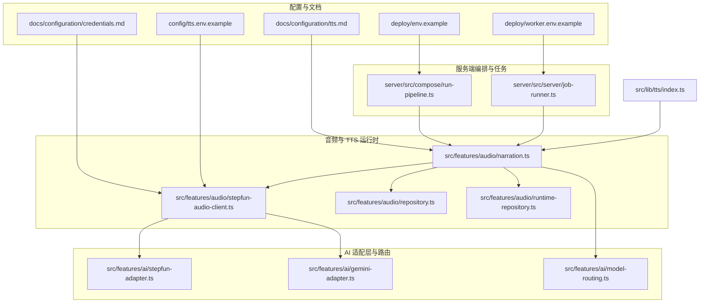
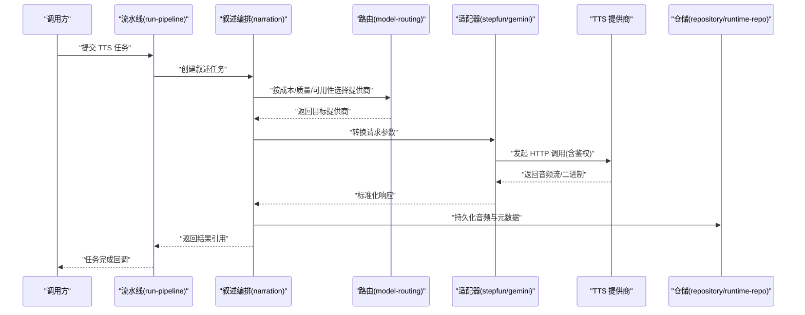
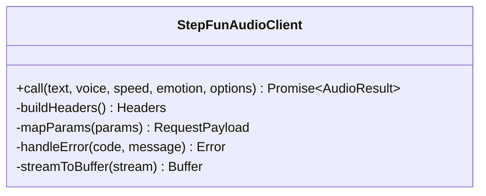
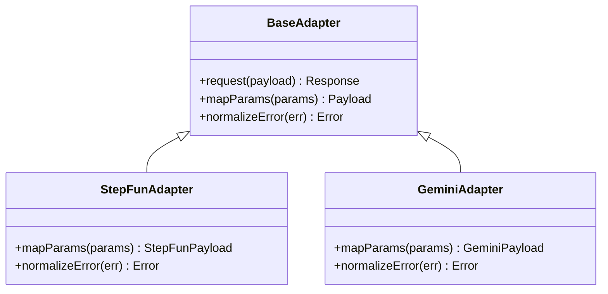
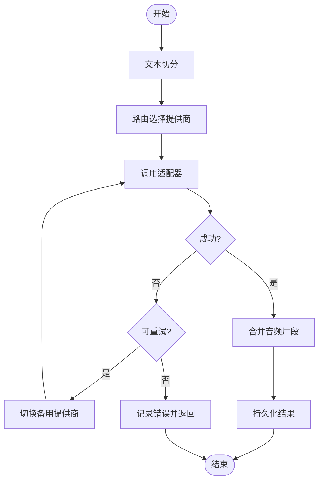
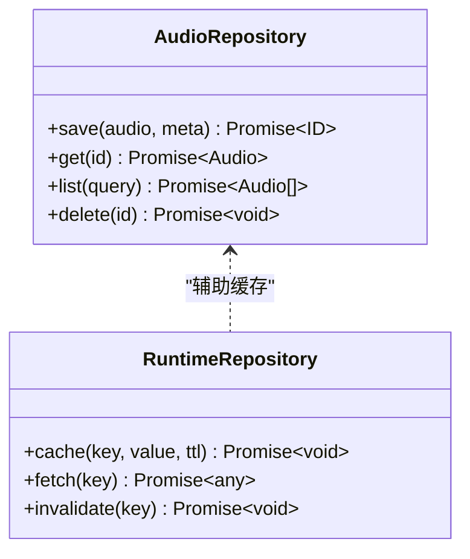
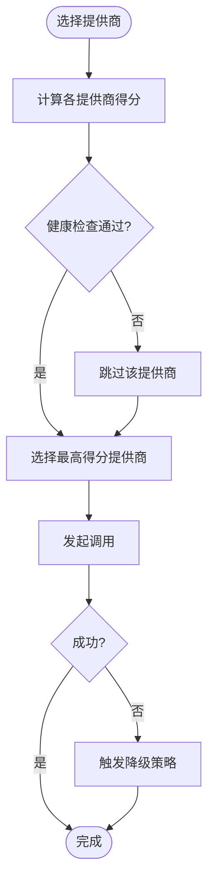
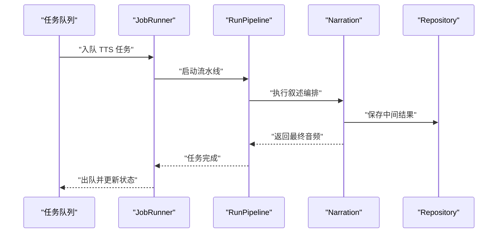
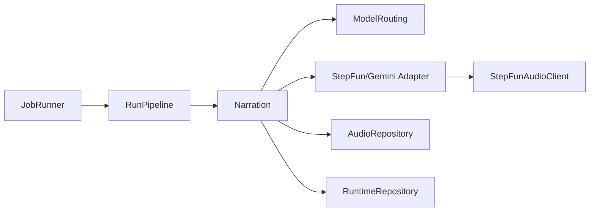

# TTS 提供商集成

<cite>
**本文引用的文件**   
- [tts.md](file://docs/configuration/tts.md)
- [credentials.md](file://docs/configuration/credentials.md)
- [routing.md](file://docs/conventions/routing.md)
- [tts.env.example](file://config/tts.env.example)
- [env.example](file://deploy/env.example)
- [worker.env.example](file://deploy/worker.env.example)
- [stepfun-audio-client.ts](file://src/features/audio/stepfun-audio-client.ts)
- [narration.ts](file://src/features/audio/narration.ts)
- [repository.ts](file://src/features/audio/repository.ts)
- [runtime-repository.ts](file://src/features/audio/runtime-repository.ts)
- [model-routing.ts](file://src/features/ai/model-routing.ts)
- [stepfun-adapter.ts](file://src/features/ai/stepfun-adapter.ts)
- [gemini-adapter.ts](file://src/features/ai/gemini-adapter.ts)
- [index.ts](file://src/lib/tts/index.ts)
- [compose/run-pipeline.ts](file://server/src/compose/run-pipeline.ts)
- [job-runner.ts](file://server/src/server/job-runner.ts)
</cite>

## 目录
1. [简介](#简介)
2. [项目结构](#项目结构)
3. [核心组件](#核心组件)
4. [架构总览](#架构总览)
5. [详细组件分析](#详细组件分析)
6. [依赖关系分析](#依赖关系分析)
7. [性能考虑](#性能考虑)
8. [故障排查指南](#故障排查指南)
9. [结论](#结论)
10. [附录](#附录)

## 简介
本文件面向 TTS（文本转语音）提供商集成的开发者与运维人员，系统性说明已支持的 TTS 服务提供商、认证方式、API 调用格式与参数映射、提供商选择算法（基于成本、质量与可用性的动态路由）、提供商特定配置选项（如语音模型、语速调节、情感控制），以及错误码映射、超时处理与连接池管理。同时提供各提供商的配置示例与最佳实践，帮助快速落地与稳定运行。

## 项目结构
TTS 相关能力分布在以下模块：
- 文档与配置：docs/configuration/tts.md、docs/configuration/credentials.md、config/tts.env.example、deploy/*.env.example
- 音频与 TTS 运行时：src/features/audio/*（包含 StepFun 客户端、叙述编排、仓库等）
- AI 适配层与路由：src/features/ai/*（StepFun/Gemini 适配器、模型路由）
- 服务端编排与任务执行：server/src/compose/run-pipeline.ts、server/src/server/job-runner.ts
- 公共入口：src/lib/tts/index.ts

图表来源 
- [tts.md](file://docs/configuration/tts.md)
- [credentials.md](file://docs/configuration/credentials.md)
- [tts.env.example](file://config/tts.env.example)
- [env.example](file://deploy/env.example)
- [worker.env.example](file://deploy/worker.env.example)
- [stepfun-audio-client.ts](file://src/features/audio/stepfun-audio-client.ts)
- [narration.ts](file://src/features/audio/narration.ts)
- [repository.ts](file://src/features/audio/repository.ts)
- [runtime-repository.ts](file://src/features/audio/runtime-repository.ts)
- [stepfun-adapter.ts](file://src/features/ai/stepfun-adapter.ts)
- [gemini-adapter.ts](file://src/features/ai/gemini-adapter.ts)
- [model-routing.ts](file://src/features/ai/model-routing.ts)
- [run-pipeline.ts](file://server/src/compose/run-pipeline.ts)
- [job-runner.ts](file://server/src/server/job-runner.ts)

章节来源
- [tts.md](file://docs/configuration/tts.md)
- [credentials.md](file://docs/configuration/credentials.md)
- [tts.env.example](file://config/tts.env.example)
- [env.example](file://deploy/env.example)
- [worker.env.example](file://deploy/worker.env.example)

## 核心组件
- 音频客户端与适配器
  - StepFun 音频客户端：封装 StepFun TTS 的 HTTP 调用、鉴权与响应解析。
  - StepFun/Gemini 适配器：将上层统一的 TTS 请求转换为各提供商 API 所需的格式。
- 叙述编排器
  - 负责将长文本切分、调度到具体 TTS 提供商、合并结果并持久化。
- 仓储层
  - 本地/运行时仓储：用于缓存与存取生成的音频片段、元数据与状态。
- 路由与策略
  - 模型路由：根据成本、质量、可用性进行动态选择与降级。
- 服务端编排
  - 流水线与任务执行：在服务器端驱动 TTS 生成流程，协调队列与并发。

章节来源
- [stepfun-audio-client.ts](file://src/features/audio/stepfun-audio-client.ts)
- [stepfun-adapter.ts](file://src/features/ai/stepfun-adapter.ts)
- [gemini-adapter.ts](file://src/features/ai/gemini-adapter.ts)
- [narration.ts](file://src/features/audio/narration.ts)
- [repository.ts](file://src/features/audio/repository.ts)
- [runtime-repository.ts](file://src/features/audio/runtime-repository.ts)
- [model-routing.ts](file://src/features/ai/model-routing.ts)
- [run-pipeline.ts](file://server/src/compose/run-pipeline.ts)
- [job-runner.ts](file://server/src/server/job-runner.ts)

## 架构总览
下图展示了从请求进入、叙述编排、提供商适配到结果落盘的完整链路，以及路由策略如何影响最终提供商选择。

图表来源 
- [run-pipeline.ts](file://server/src/compose/run-pipeline.ts)
- [narration.ts](file://src/features/audio/narration.ts)
- [model-routing.ts](file://src/features/ai/model-routing.ts)
- [stepfun-adapter.ts](file://src/features/ai/stepfun-adapter.ts)
- [gemini-adapter.ts](file://src/features/ai/gemini-adapter.ts)
- [repository.ts](file://src/features/audio/repository.ts)
- [runtime-repository.ts](file://src/features/audio/runtime-repository.ts)

## 详细组件分析

### StepFun 音频客户端
- 职责：封装 StepFun TTS 的 HTTP 调用、鉴权头构造、错误码映射、超时与重试策略、音频流读取与校验。
- 关键行为：
  - 鉴权：通过环境变量或凭证存储注入 Token/API Key。
  - 请求构造：将统一参数映射为 StepFun 所需字段（文本、音色、语速、情感等）。
  - 响应处理：支持流式与非流式返回，统一为内部音频对象。
  - 错误处理：网络异常、鉴权失败、限流与业务错误的分类与重试。

图表来源 
- [stepfun-audio-client.ts](file://src/features/audio/stepfun-audio-client.ts)

章节来源
- [stepfun-audio-client.ts](file://src/features/audio/stepfun-audio-client.ts)

### StepFun 与 Gemini 适配器
- 职责：将上层统一 TTS 请求转换为各提供商 API 的请求体，并将响应标准化。
- 关键行为：
  - 参数映射：文本、语言、音色、语速、情感、采样率等字段映射。
  - 鉴权注入：按提供商要求设置 Authorization/Header。
  - 错误归一化：将不同提供商的错误码映射为统一错误类型。

图表来源 
- [stepfun-adapter.ts](file://src/features/ai/stepfun-adapter.ts)
- [gemini-adapter.ts](file://src/features/ai/gemini-adapter.ts)

章节来源
- [stepfun-adapter.ts](file://src/features/ai/stepfun-adapter.ts)
- [gemini-adapter.ts](file://src/features/ai/gemini-adapter.ts)

### 叙述编排器（Narration Orchestration）
- 职责：文本切分、并行/串行调度、提供商选择、结果合并与持久化。
- 关键行为：
  - 文本切分：按语义或长度切分为片段，避免超限。
  - 并发控制：限制并发度，避免压垮下游。
  - 结果合并：按顺序拼接音频片段，输出完整音频。
  - 状态管理：记录每个片段的提供商、耗时、大小与错误信息。

图表来源 
- [narration.ts](file://src/features/audio/narration.ts)
- [model-routing.ts](file://src/features/ai/model-routing.ts)

章节来源
- [narration.ts](file://src/features/audio/narration.ts)

### 仓储层（Repository & Runtime Repository）
- 职责：音频片段与元数据的读写、缓存、清理与一致性保障。
- 关键行为：
  - 写入：将音频二进制与元数据（时长、格式、提供商、参数）持久化。
  - 读取：按 ID 或查询条件获取音频与元数据。
  - 缓存：热点片段短期缓存，提升重复生成效率。
  - 清理：过期或失败片段清理策略。

图表来源 
- [repository.ts](file://src/features/audio/repository.ts)
- [runtime-repository.ts](file://src/features/audio/runtime-repository.ts)

章节来源
- [repository.ts](file://src/features/audio/repository.ts)
- [runtime-repository.ts](file://src/features/audio/runtime-repository.ts)

### 模型路由（Model Routing）
- 职责：基于成本、质量、可用性进行动态路由与降级。
- 关键行为：
  - 评分模型：综合价格、延迟、成功率、音质指标。
  - 健康检查：定期探测提供商可用性。
  - 降级策略：主提供商失败时自动切换到次优提供商。
  - 权重调整：根据实时指标动态调整权重。

图表来源 
- [model-routing.ts](file://src/features/ai/model-routing.ts)

章节来源
- [model-routing.ts](file://src/features/ai/model-routing.ts)

### 服务端编排与任务执行
- 职责：在服务器端驱动 TTS 生成流程，协调队列、并发与状态。
- 关键行为：
  - 流水线：定义阶段（切分、路由、调用、合并、持久化）。
  - 任务执行：异步执行与进度上报。
  - 错误恢复：失败重试与补偿。

图表来源 
- [run-pipeline.ts](file://server/src/compose/run-pipeline.ts)
- [job-runner.ts](file://server/src/server/job-runner.ts)
- [narration.ts](file://src/features/audio/narration.ts)
- [repository.ts](file://src/features/audio/repository.ts)

章节来源
- [run-pipeline.ts](file://server/src/compose/run-pipeline.ts)
- [job-runner.ts](file://server/src/server/job-runner.ts)

### 公共入口（lib/tts）
- 职责：对外暴露统一的 TTS 调用接口，聚合各提供商能力。
- 关键行为：
  - 初始化：加载配置与凭证。
  - 调用：接收统一参数，委托叙述编排器处理。
  - 返回：标准化音频结果与元数据。

章节来源
- [index.ts](file://src/lib/tts/index.ts)

## 依赖关系分析
- 组件耦合：
  - 叙述编排器依赖路由与适配器，适配器依赖具体音频客户端。
  - 仓储层被叙述编排器与任务执行器共同使用。
- 外部依赖：
  - HTTP 客户端（各提供商 API）
  - 凭证存储（环境变量或密钥服务）
  - 存储后端（本地文件或数据库）

图表来源 
- [narration.ts](file://src/features/audio/narration.ts)
- [model-routing.ts](file://src/features/ai/model-routing.ts)
- [stepfun-adapter.ts](file://src/features/ai/stepfun-adapter.ts)
- [gemini-adapter.ts](file://src/features/ai/gemini-adapter.ts)
- [stepfun-audio-client.ts](file://src/features/audio/stepfun-audio-client.ts)
- [repository.ts](file://src/features/audio/repository.ts)
- [runtime-repository.ts](file://src/features/audio/runtime-repository.ts)
- [run-pipeline.ts](file://server/src/compose/run-pipeline.ts)
- [job-runner.ts](file://server/src/server/job-runner.ts)

章节来源
- [narration.ts](file://src/features/audio/narration.ts)
- [model-routing.ts](file://src/features/ai/model-routing.ts)
- [stepfun-adapter.ts](file://src/features/ai/stepfun-adapter.ts)
- [gemini-adapter.ts](file://src/features/ai/gemini-adapter.ts)
- [stepfun-audio-client.ts](file://src/features/audio/stepfun-audio-client.ts)
- [repository.ts](file://src/features/audio/repository.ts)
- [runtime-repository.ts](file://src/features/audio/runtime-repository.ts)
- [run-pipeline.ts](file://server/src/compose/run-pipeline.ts)
- [job-runner.ts](file://server/src/server/job-runner.ts)

## 性能考虑
- 并发与限流：合理设置叙述编排器的并发度，避免下游限流。
- 缓存策略：对热点文本片段启用短时缓存，减少重复调用。
- 流式处理：优先使用流式响应降低内存占用与首包延迟。
- 连接池：复用 HTTP 连接，减少握手开销。
- 批处理：批量文本合并后一次性生成，提高吞吐。

## 故障排查指南
- 常见错误码映射：
  - 鉴权失败：检查 Token/Key 是否有效与过期时间。
  - 限流错误：降低并发或等待退避重试。
  - 网络超时：增加超时阈值或检查网络状况。
  - 业务错误：核对输入参数是否符合提供商规范。
- 日志与追踪：
  - 记录每次调用的提供商、参数摘要、耗时与错误码。
  - 使用唯一请求 ID 贯穿流水线与仓储。
- 回滚与补偿：
  - 失败片段自动重试或切换备用提供商。
  - 部分成功时保留中间结果以便增量修复。

章节来源
- [stepfun-audio-client.ts](file://src/features/audio/stepfun-audio-client.ts)
- [stepfun-adapter.ts](file://src/features/ai/stepfun-adapter.ts)
- [gemini-adapter.ts](file://src/features/ai/gemini-adapter.ts)
- [narration.ts](file://src/features/audio/narration.ts)
- [model-routing.ts](file://src/features/ai/model-routing.ts)

## 结论
本集成通过统一的叙述编排与适配器抽象，屏蔽了多 TTS 提供商的差异，结合动态路由实现成本、质量与可用性的平衡。配合完善的错误处理、缓存与连接池策略，可在高并发场景下稳定运行。建议在生产环境充分验证各提供商的稳定性与成本曲线，持续优化路由策略与参数配置。

## 附录

### 支持的 TTS 提供商与认证方式
- StepFun：通过环境变量或凭证存储注入 API Key/Token，HTTP 请求头携带鉴权信息。
- OpenAI Compatible：遵循 OpenAI 兼容接口，使用 Bearer Token 鉴权。
- MIMO：按提供商规范配置 Endpoint 与 Secret，请求中附加签名或 Token。

章节来源
- [credentials.md](file://docs/configuration/credentials.md)
- [tts.env.example](file://config/tts.env.example)

### API 调用格式与参数映射
- 统一参数：文本、语言、音色、语速、情感、采样率、输出格式。
- 提供商映射：
  - StepFun：文本→text，音色→voice_id，语速→speed，情感→emotion。
  - OpenAI Compatible：文本→input，音色→voice，语速→speed，情感→style。
  - MIMO：文本→content，音色→speaker，语速→rate，情感→affect。

章节来源
- [stepfun-adapter.ts](file://src/features/ai/stepfun-adapter.ts)
- [gemini-adapter.ts](file://src/features/ai/gemini-adapter.ts)

### 提供商选择算法
- 评分维度：价格、延迟、成功率、音质评分、当前负载。
- 健康检查：周期性探测可用性，失败标记降级。
- 动态权重：根据实时指标调整权重，实现负载均衡与容错。

章节来源
- [model-routing.ts](file://src/features/ai/model-routing.ts)

### 提供商特定配置选项
- 语音模型：指定音色或模型 ID。
- 语速调节：速度系数（如 0.8–1.2）。
- 情感控制：风格/情感标签（如 happy、calm）。
- 输出格式：mp3/wav/flac 等。

章节来源
- [tts.md](file://docs/configuration/tts.md)

### 错误码映射、超时处理与连接池管理
- 错误码映射：将各提供商错误码映射为统一错误类型（鉴权、限流、网络、业务）。
- 超时处理：设置连接与读取超时，支持指数退避重试。
- 连接池：复用 HTTP 连接，限制最大连接数与空闲回收。

章节来源
- [stepfun-audio-client.ts](file://src/features/audio/stepfun-audio-client.ts)
- [narration.ts](file://src/features/audio/narration.ts)

### 配置示例与最佳实践
- 环境变量示例：参考 tts.env.example 与 deploy/*.env.example。
- 最佳实践：
  - 多提供商冗余部署，避免单点故障。
  - 监控关键指标（延迟、成功率、成本）。
  - 定期轮换凭证与更新模型列表。
  - 对热点文本启用缓存，降低重复成本。

章节来源
- [tts.env.example](file://config/tts.env.example)
- [env.example](file://deploy/env.example)
- [worker.env.example](file://deploy/worker.env.example)