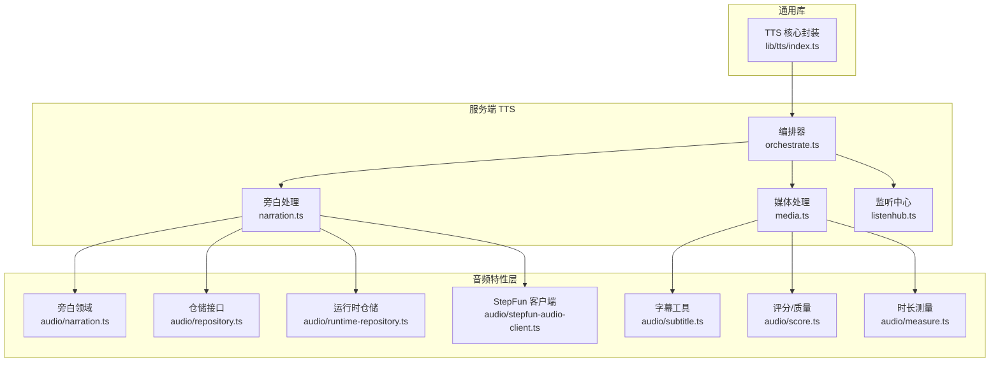
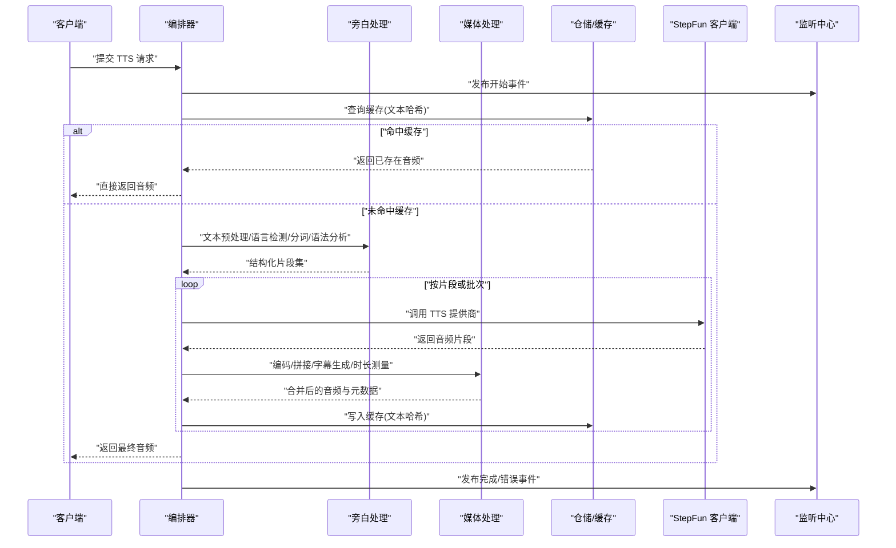
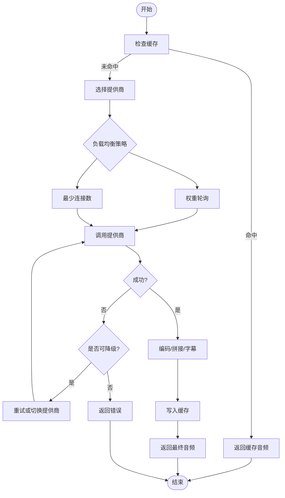
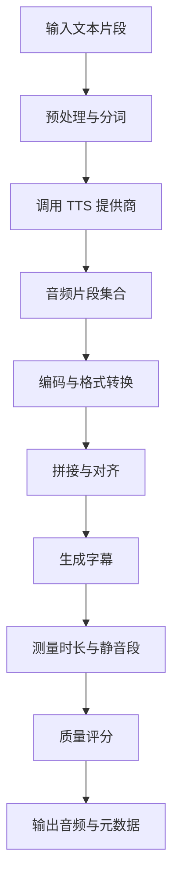
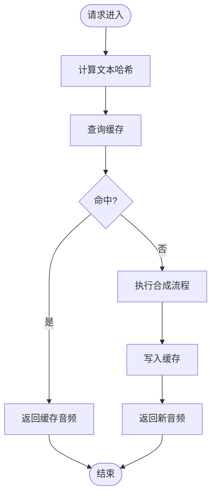
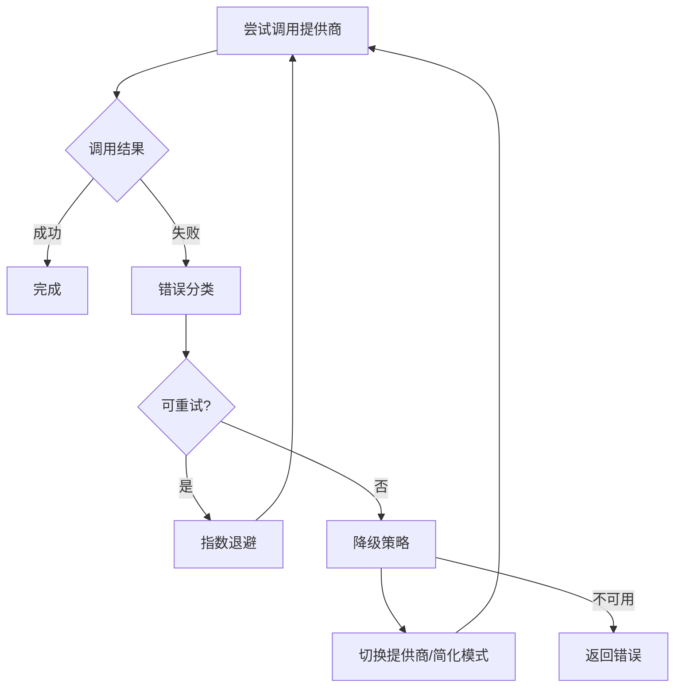
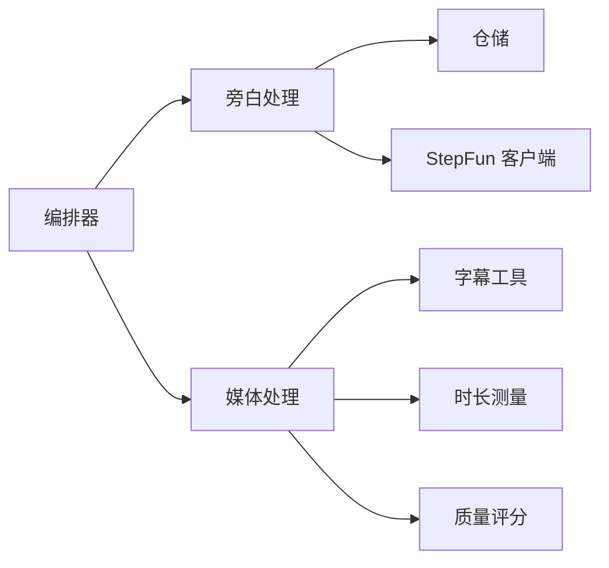

# TTS 核心引擎

<cite>
**本文引用的文件**   
- [server/src/tts/orchestrate.ts](file://server/src/tts/orchestrate.ts)
- [server/src/tts/narration.ts](file://server/src/tts/narration.ts)
- [server/src/tts/media.ts](file://server/src/tts/media.ts)
- [server/src/tts/listenhub.ts](file://server/src/tts/listenhub.ts)
- [src/features/audio/narration.ts](file://src/features/audio/narration.ts)
- [src/features/audio/repository.ts](file://src/features/audio/repository.ts)
- [src/features/audio/runtime-repository.ts](file://src/features/audio/runtime-repository.ts)
- [src/features/audio/stepfun-audio-client.ts](file://src/features/audio/stepfun-audio-client.ts)
- [src/features/audio/subtitle.ts](file://src/features/audio/subtitle.ts)
- [src/features/audio/score.ts](file://src/features/audio/score.ts)
- [src/features/audio/measure.ts](file://src/features/audio/measure.ts)
- [src/lib/tts/index.ts](file://src/lib/tts/index.ts)
- [tests/tts-orchestration.test.ts](file://tests/tts-orchestration.test.ts)
- [tests/tts-narration.test.ts](file://tests/tts-narration.test.ts)
- [tests/tts-runtime.test.ts](file://tests/tts-runtime.test.ts)
- [tests/tts-pipeline-integration.test.ts](file://tests/tts-pipeline-integration.test.ts)
- [config/tts.env.example](file://config/tts.env.example)
- [docs/configuration/tts.md](file://docs/configuration/tts.md)
</cite>

## 目录
1. [简介](#简介)
2. [项目结构](#项目结构)
3. [核心组件](#核心组件)
4. [架构总览](#架构总览)
5. [详细组件分析](#详细组件分析)
6. [依赖关系分析](#依赖关系分析)
7. [性能考量](#性能考量)
8. [故障排查指南](#故障排查指南)
9. [结论](#结论)
10. [附录](#附录) 

## 简介
本文件为 TTS（文本转语音）核心引擎的技术文档，面向开发与运维人员。内容覆盖：
- 文本预处理、语言检测、分词与语法分析的流水线设计
- 调度机制：提供商选择策略、负载均衡与故障转移
- 音频生成管道：从文本到音频的端到端流程
- 缓存策略：文本哈希计算、结果复用与内存管理
- 错误处理、重试逻辑与降级方案
- 配置示例与性能优化建议

## 项目结构
TTS 相关代码主要分布在以下位置：
- server/src/tts：服务端编排与媒体处理
- src/features/audio：音频领域模型、仓储、客户端与工具
- src/lib/tts：通用 TTS 能力封装
- tests：TTS 相关的单元测试与集成测试
- config/docs：环境配置与文档

图表来源 
- [server/src/tts/orchestrate.ts](file://server/src/tts/orchestrate.ts)
- [server/src/tts/narration.ts](file://server/src/tts/narration.ts)
- [server/src/tts/media.ts](file://server/src/tts/media.ts)
- [server/src/tts/listenhub.ts](file://server/src/tts/listenhub.ts)
- [src/features/audio/narration.ts](file://src/features/audio/narration.ts)
- [src/features/audio/repository.ts](file://src/features/audio/repository.ts)
- [src/features/audio/runtime-repository.ts](file://src/features/audio/runtime-repository.ts)
- [src/features/audio/stepfun-audio-client.ts](file://src/features/audio/stepfun-audio-client.ts)
- [src/features/audio/subtitle.ts](file://src/features/audio/subtitle.ts)
- [src/features/audio/score.ts](file://src/features/audio/score.ts)
- [src/features/audio/measure.ts](file://src/features/audio/measure.ts)
- [src/lib/tts/index.ts](file://src/lib/tts/index.ts)

章节来源
- [server/src/tts/orchestrate.ts](file://server/src/tts/orchestrate.ts)
- [server/src/tts/narration.ts](file://server/src/tts/narration.ts)
- [server/src/tts/media.ts](file://server/src/tts/media.ts)
- [server/src/tts/listenhub.ts](file://server/src/tts/listenhub.ts)
- [src/features/audio/narration.ts](file://src/features/audio/narration.ts)
- [src/features/audio/repository.ts](file://src/features/audio/repository.ts)
- [src/features/audio/runtime-repository.ts](file://src/features/audio/runtime-repository.ts)
- [src/features/audio/stepfun-audio-client.ts](file://src/features/audio/stepfun-audio-client.ts)
- [src/features/audio/subtitle.ts](file://src/features/audio/subtitle.ts)
- [src/features/audio/score.ts](file://src/features/audio/score.ts)
- [src/features/audio/measure.ts](file://src/features/audio/measure.ts)
- [src/lib/tts/index.ts](file://src/lib/tts/index.ts)

## 核心组件
- 编排器（Orchestrator）：负责接收请求、路由到各阶段、协调并行与串行任务、汇总结果与错误。
- 旁白处理（Narration）：文本预处理、语言检测、分词与语法分析、片段切分与标注。
- 媒体处理（Media）：音频编码、拼接、字幕生成、时长测量与质量评分。
- 监听中心（ListenHub）：事件总线，用于跨模块状态同步与进度上报。
- 音频仓储（Repository/Runtime Repository）：持久化与运行时缓存，支持结果复用与去重。
- StepFun 客户端：对接外部 TTS 提供商，实现调用、重试与降级。
- 字幕与评分工具：辅助生成 SRT/VTT 与评估合成质量。
- TTS 核心封装：统一入口与配置聚合。

章节来源
- [server/src/tts/orchestrate.ts](file://server/src/tts/orchestrate.ts)
- [server/src/tts/narration.ts](file://server/src/tts/narration.ts)
- [server/src/tts/media.ts](file://server/src/tts/media.ts)
- [server/src/tts/listenhub.ts](file://server/src/tts/listenhub.ts)
- [src/features/audio/narration.ts](file://src/features/audio/narration.ts)
- [src/features/audio/repository.ts](file://src/features/audio/repository.ts)
- [src/features/audio/runtime-repository.ts](file://src/features/audio/runtime-repository.ts)
- [src/features/audio/stepfun-audio-client.ts](file://src/features/audio/stepfun-audio-client.ts)
- [src/features/audio/subtitle.ts](file://src/features/audio/subtitle.ts)
- [src/features/audio/score.ts](file://src/features/audio/score.ts)
- [src/lib/tts/index.ts](file://src/lib/tts/index.ts)

## 架构总览
下图展示了从请求进入至音频输出的关键路径，以及各组件之间的交互关系。

图表来源 
- [server/src/tts/orchestrate.ts](file://server/src/tts/orchestrate.ts)
- [server/src/tts/narration.ts](file://server/src/tts/narration.ts)
- [server/src/tts/media.ts](file://server/src/tts/media.ts)
- [server/src/tts/listenhub.ts](file://server/src/tts/listenhub.ts)
- [src/features/audio/repository.ts](file://src/features/audio/repository.ts)
- [src/features/audio/runtime-repository.ts](file://src/features/audio/runtime-repository.ts)
- [src/features/audio/stepfun-audio-client.ts](file://src/features/audio/stepfun-audio-client.ts)

## 详细组件分析

### 文本预处理与语言检测
- 目标：将原始文本规范化，识别语言，进行分词与语法分析，输出可被 TTS 引擎消费的结构化片段。
- 关键点：
  - 文本清洗：去除多余空白、标准化标点、过滤不可读字符。
  - 语言检测：基于统计或规则判断语言，必要时回退到默认语言。
  - 分词与语法分析：按语义边界切分句子/短语，保留停顿与重音信息。
  - 片段标注：为每个片段附加语言、语速、情感等元数据。
- 复杂度：线性扫描为主，分词与语法分析可能引入 O(n log n) 或更高复杂度，取决于算法实现。
- 优化建议：
  - 对长文本采用流式处理，避免一次性加载。
  - 使用缓存的语言检测结果，减少重复计算。

章节来源
- [server/src/tts/narration.ts](file://server/src/tts/narration.ts)
- [src/features/audio/narration.ts](file://src/features/audio/narration.ts)

### 调度机制：提供商选择、负载均衡与故障转移
- 提供商选择策略：
  - 基于配置优先级与可用性动态选择提供商。
  - 支持多提供商并行探测与择优。
- 负载均衡：
  - 按 QPS、延迟、成功率等指标分配负载。
  - 支持权重轮询与最少连接数策略。
- 故障转移：
  - 检测到超时、错误率升高时自动切换备用提供商。
  - 熔断与退避策略防止雪崩。

图表来源 
- [server/src/tts/orchestrate.ts](file://server/src/tts/orchestrate.ts)
- [src/features/audio/stepfun-audio-client.ts](file://src/features/audio/stepfun-audio-client.ts)

章节来源
- [server/src/tts/orchestrate.ts](file://server/src/tts/orchestrate.ts)
- [src/features/audio/stepfun-audio-client.ts](file://src/features/audio/stepfun-audio-client.ts)

### 音频生成管道：从文本到音频
- 阶段划分：
  - 文本预处理与分词
  - 提供商调用与音频片段生成
  - 音频编码、拼接与格式转换
  - 字幕生成与时长测量
  - 质量评分与校验
- 数据流：
  - 输入：结构化文本片段
  - 中间产物：音频片段、时间戳、元数据
  - 输出：完整音频与可选字幕文件
- 并发与批处理：
  - 支持批量合成与并行处理以提升吞吐。
  - 控制并发度以避免资源耗尽。

图表来源 
- [server/src/tts/media.ts](file://server/src/tts/media.ts)
- [src/features/audio/subtitle.ts](file://src/features/audio/subtitle.ts)
- [src/features/audio/measure.ts](file://src/features/audio/measure.ts)
- [src/features/audio/score.ts](file://src/features/audio/score.ts)

章节来源
- [server/src/tts/media.ts](file://server/src/tts/media.ts)
- [src/features/audio/subtitle.ts](file://src/features/audio/subtitle.ts)
- [src/features/audio/measure.ts](file://src/features/audio/measure.ts)
- [src/features/audio/score.ts](file://src/features/audio/score.ts)

### 缓存策略：文本哈希、结果复用与内存管理
- 文本哈希：
  - 对预处理后的文本进行哈希，作为缓存键。
  - 考虑语言、语速、情感等参数变化影响哈希。
- 结果复用：
  - 命中缓存直接返回，降低重复合成成本。
  - 支持版本化与失效策略。
- 内存管理：
  - 限制缓存大小与过期时间。
  - 使用 LRU 或 TTL 策略避免内存泄漏。

图表来源 
- [src/features/audio/repository.ts](file://src/features/audio/repository.ts)
- [src/features/audio/runtime-repository.ts](file://src/features/audio/runtime-repository.ts)

章节来源
- [src/features/audio/repository.ts](file://src/features/audio/repository.ts)
- [src/features/audio/runtime-repository.ts](file://src/features/audio/runtime-repository.ts)

### 错误处理、重试与降级
- 错误分类：
  - 网络错误、超时、提供商限流、参数非法、内部异常。
- 重试策略：
  - 指数退避与最大重试次数。
  - 区分可重试与不可重试错误。
- 降级方案：
  - 切换到备用提供商或简化合成模式。
  - 返回部分结果或占位音频。

图表来源 
- [src/features/audio/stepfun-audio-client.ts](file://src/features/audio/stepfun-audio-client.ts)
- [server/src/tts/orchestrate.ts](file://server/src/tts/orchestrate.ts)

章节来源
- [src/features/audio/stepfun-audio-client.ts](file://src/features/audio/stepfun-audio-client.ts)
- [server/src/tts/orchestrate.ts](file://server/src/tts/orchestrate.ts)

### 事件与监控：监听中心
- 功能：
  - 发布与订阅事件，如开始、进度、完成、错误。
  - 提供实时状态上报与调试日志。
- 使用场景：
  - 前端进度条更新
  - 后端链路追踪与度量采集

章节来源
- [server/src/tts/listenhub.ts](file://server/src/tts/listenhub.ts)

## 依赖关系分析
- 组件耦合：
  - 编排器依赖旁白处理、媒体处理与仓储。
  - 旁白处理依赖仓储与提供商客户端。
  - 媒体处理依赖字幕、测量与评分工具。
- 外部依赖：
  - StepFun 客户端对接外部 TTS 服务。
  - 仓储可能对接数据库或对象存储。
- 潜在循环依赖：
  - 通过事件总线解耦，避免直接循环引用。

图表来源 
- [server/src/tts/orchestrate.ts](file://server/src/tts/orchestrate.ts)
- [server/src/tts/narration.ts](file://server/src/tts/narration.ts)
- [server/src/tts/media.ts](file://server/src/tts/media.ts)
- [src/features/audio/repository.ts](file://src/features/audio/repository.ts)
- [src/features/audio/stepfun-audio-client.ts](file://src/features/audio/stepfun-audio-client.ts)
- [src/features/audio/subtitle.ts](file://src/features/audio/subtitle.ts)
- [src/features/audio/measure.ts](file://src/features/audio/measure.ts)
- [src/features/audio/score.ts](file://src/features/audio/score.ts)

章节来源
- [server/src/tts/orchestrate.ts](file://server/src/tts/orchestrate.ts)
- [server/src/tts/narration.ts](file://server/src/tts/narration.ts)
- [server/src/tts/media.ts](file://server/src/tts/media.ts)
- [src/features/audio/repository.ts](file://src/features/audio/repository.ts)
- [src/features/audio/stepfun-audio-client.ts](file://src/features/audio/stepfun-audio-client.ts)
- [src/features/audio/subtitle.ts](file://src/features/audio/subtitle.ts)
- [src/features/audio/measure.ts](file://src/features/audio/measure.ts)
- [src/features/audio/score.ts](file://src/features/audio/score.ts)

## 性能考量
- 文本预处理：
  - 使用流式解析与增量哈希，避免大文本内存峰值。
- 提供商调用：
  - 合理设置并发度与超时时间，避免阻塞。
  - 启用连接池与请求压缩。
- 音频处理：
  - 并行编码与拼接，利用多核 CPU。
  - 控制音频片段大小，减少 I/O 开销。
- 缓存：
  - 热点文本优先缓存，LRU 淘汰策略。
  - 定期清理过期条目。
- 监控与度量：
  - 记录关键指标：QPS、延迟、错误率、缓存命中率。

[本节为通用指导，不直接分析具体文件]

## 故障排查指南
- 常见问题：
  - 提供商超时或限流：检查网络与配额，调整重试与退避策略。
  - 文本预处理异常：验证输入文本格式与语言检测准确性。
  - 音频拼接错位：检查时间戳与静音段处理逻辑。
  - 缓存未命中：确认哈希键一致性，包括语言与参数。
- 定位方法：
  - 查看监听中心事件日志，定位失败阶段。
  - 检查仓储写入与读取状态。
  - 使用质量评分工具评估合成效果。

章节来源
- [server/src/tts/listenhub.ts](file://server/src/tts/listenhub.ts)
- [src/features/audio/score.ts](file://src/features/audio/score.ts)
- [src/features/audio/repository.ts](file://src/features/audio/repository.ts)

## 结论
TTS 核心引擎通过模块化设计与清晰的职责划分，实现了从文本到音频的高效转换。编排器协调各阶段，旁白处理确保文本质量，媒体处理保证音频输出，仓储与缓存提升性能，错误处理与降级保障稳定性。通过合理的配置与优化，系统可在高并发场景下保持良好表现。

[本节为总结性内容，不直接分析具体文件]

## 附录
- 配置示例与环境变量：
  - 参考 tts.env.example 与 docs/configuration/tts.md 获取提供商密钥、超时、并发等配置项。
- 测试用例：
  - 查看 tts-orchestration.test.ts、tts-narration.test.ts、tts-runtime.test.ts、tts-pipeline-integration.test.ts 了解行为预期与边界条件。

章节来源
- [config/tts.env.example](file://config/tts.env.example)
- [docs/configuration/tts.md](file://docs/configuration/tts.md)
- [tests/tts-orchestration.test.ts](file://tests/tts-orchestration.test.ts)
- [tests/tts-narration.test.ts](file://tests/tts-narration.test.ts)
- [tests/tts-runtime.test.ts](file://tests/tts-runtime.test.ts)
- [tests/tts-pipeline-integration.test.ts](file://tests/tts-pipeline-integration.test.ts)