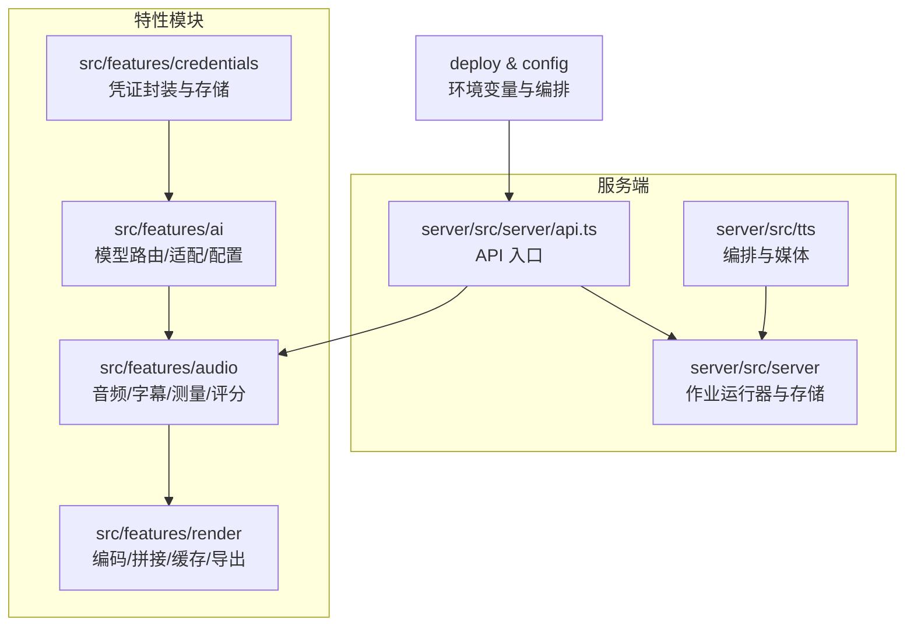
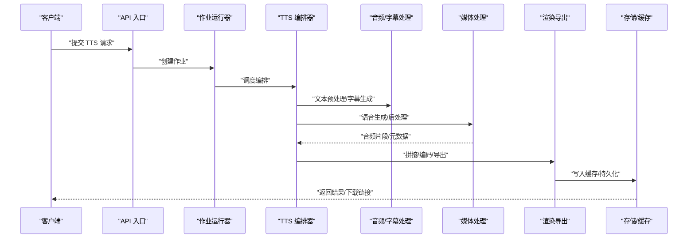
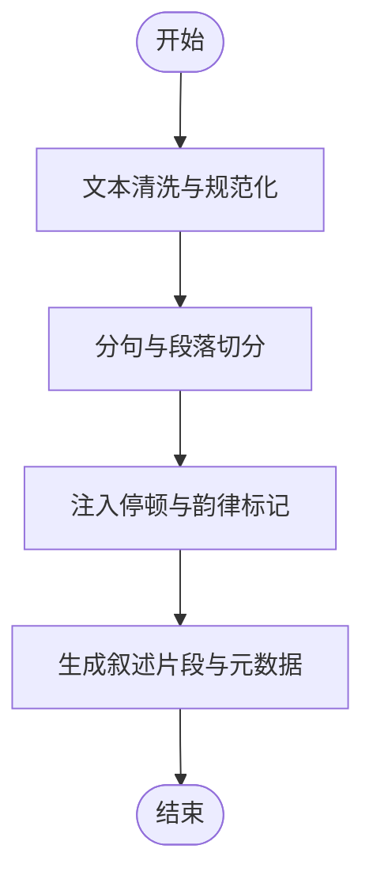
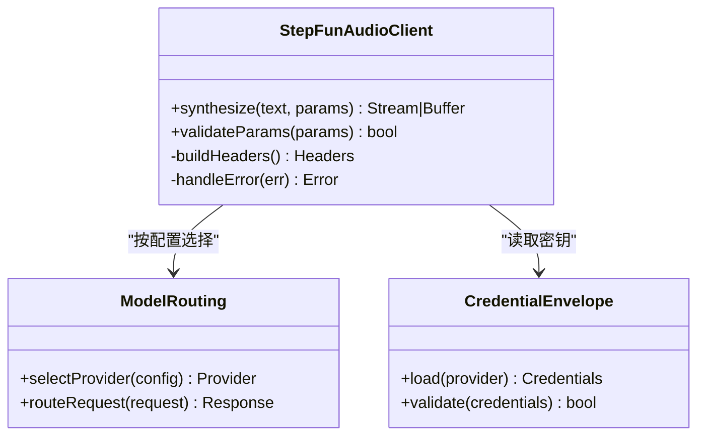
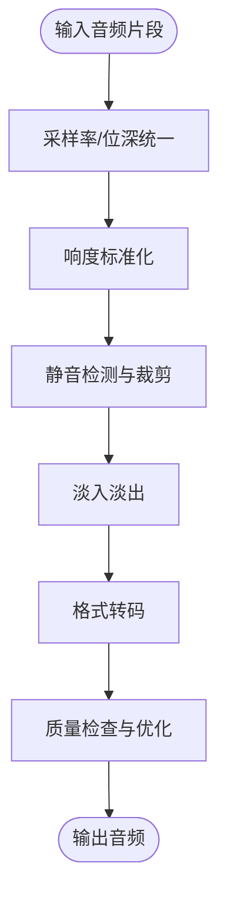
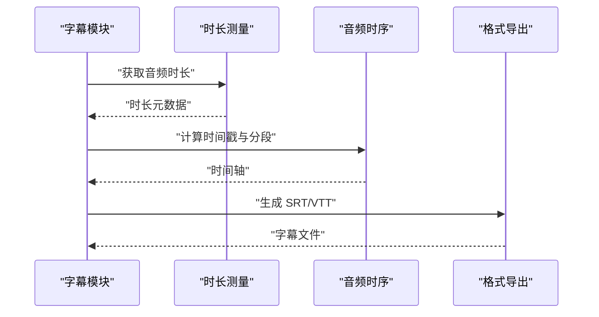
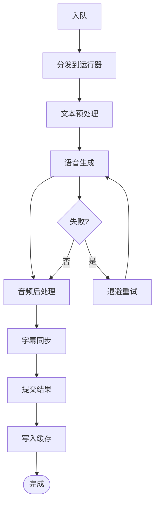
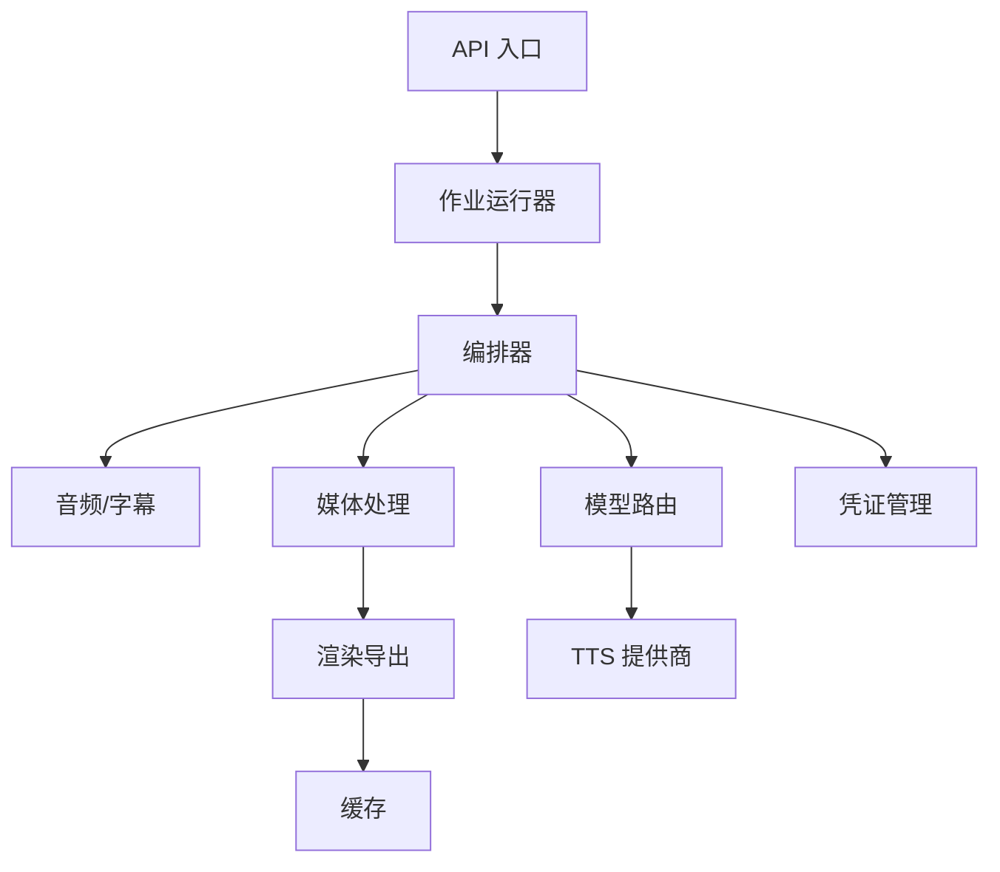

# TTS 语音合成服务

<cite>
**本文引用的文件**   
- [tts.env.example](file://config/tts.env.example)
- [compose.yaml](file://deploy/compose.yaml)
- [env.example](file://deploy/env.example)
- [worker.env.example](file://deploy/worker.env.example)
- [credentials.md](file://docs/configuration/credentials.md)
- [tts.md](file://docs/configuration/tts.md)
- [narration.ts](file://src/features/audio/narration.ts)
- [subtitle.ts](file://src/features/audio/subtitle.ts)
- [repository.ts](file://src/features/audio/repository.ts)
- [runtime-repository.ts](file://src/features/audio/runtime-repository.ts)
- [stepfun-audio-client.ts](file://src/features/audio/stepfun-audio-client.ts)
- [measure.ts](file://src/features/audio/measure.ts)
- [score.ts](file://src/features/audio/score.ts)
- [sfx.ts](file://src/features/audio/sfx.ts)
- [index.ts](file://src/features/audio/index.ts)
- [listenhub.ts](file://server/src/tts/listenhub.ts)
- [media.ts](file://server/src/tts/media.ts)
- [narration.ts](file://server/src/tts/narration.ts)
- [orchestrate.ts](file://server/src/tts/orchestrate.ts)
- [job-runner.ts](file://server/src/server/job-runner.ts)
- [job-store.ts](file://server/src/server/job-store.ts)
- [api.ts](file://server/src/server/api.ts)
- [queue-handler.ts](file://src/features/director/queue-handler.ts)
- [audio-timing.ts](file://src/features/director/audio-timing.ts)
- [export-service.ts](file://src/features/render/export-service.ts)
- [encode.ts](file://src/features/render/encode.ts)
- [concat.ts](file://src/features/render/concat.ts)
- [cache.ts](file://src/features/render/cache.ts)
- [model-routing.ts](file://src/features/ai/model-routing.ts)
- [gemini-config.ts](file://src/features/ai/gemini-config.ts)
- [stepfun-adapter.ts](file://src/features/ai/stepfun-adapter.ts)
- [credential-envelope.ts](file://src/features/credentials/credential-envelope.ts)
- [provider-credential-store.pg.test.ts](file://src/features/credentials/provider-credential-store.pg.test.ts)
</cite>

## 目录
1. [简介](#简介)
2. [项目结构](#项目结构)
3. [核心组件](#核心组件)
4. [架构总览](#架构总览)
5. [详细组件分析](#详细组件分析)
6. [依赖关系分析](#依赖关系分析)
7. [性能考量](#性能考量)
8. [故障排查指南](#故障排查指南)
9. [结论](#结论)
10. [附录](#附录)

## 简介
本文件为 TTS 语音合成服务的全面技术文档，覆盖文本预处理、语音生成、音频后处理与字幕同步全流程；说明多 TTS 提供商集成（配置管理、认证处理、结果缓存）；阐述音频格式转换、质量优化与流式处理机制；解释字幕生成算法（时间戳计算、样式应用、格式导出）；并给出并发控制、负载均衡与故障恢复策略。同时提供具体使用示例，展示如何配置不同 TTS 提供商、自定义语音参数和处理异常情况。

## 项目结构
TTS 能力横跨服务端与前端特性模块：
- 服务端 TTS 编排与媒体处理位于 server/src/tts 目录，负责编排任务、调用外部 TTS、媒体转码与输出。
- 音频与字幕能力集中在 src/features/audio，包含叙述生成、字幕解析/生成、时长测量、评分与音效等。
- 渲染与导出流程在 src/features/render，涵盖编码、拼接、缓存与导出服务。
- AI 模型路由与适配层在 src/features/ai，用于统一多模型接入与配置。
- 凭证与配置在 src/features/credentials 与 docs/configuration 中集中管理。
- 部署与环境变量在 deploy 与 config 目录中定义。

图表来源
- [api.ts](file://server/src/server/api.ts)
- [job-runner.ts](file://server/src/server/job-runner.ts)
- [job-store.ts](file://server/src/server/job-store.ts)
- [orchestrate.ts](file://server/src/tts/orchestrate.ts)
- [media.ts](file://server/src/tts/media.ts)
- [narration.ts](file://server/src/tts/narration.ts)
- [listenhub.ts](file://server/src/tts/listenhub.ts)
- [index.ts](file://src/features/audio/index.ts)
- [subtitle.ts](file://src/features/audio/subtitle.ts)
- [repository.ts](file://src/features/audio/repository.ts)
- [runtime-repository.ts](file://src/features/audio/runtime-repository.ts)
- [stepfun-audio-client.ts](file://src/features/audio/stepfun-audio-client.ts)
- [encode.ts](file://src/features/render/encode.ts)
- [concat.ts](file://src/features/render/concat.ts)
- [cache.ts](file://src/features/render/cache.ts)
- [export-service.ts](file://src/features/render/export-service.ts)
- [model-routing.ts](file://src/features/ai/model-routing.ts)
- [gemini-config.ts](file://src/features/ai/gemini-config.ts)
- [stepfun-adapter.ts](file://src/features/ai/stepfun-adapter.ts)
- [credential-envelope.ts](file://src/features/credentials/credential-envelope.ts)
- [provider-credential-store.pg.test.ts](file://src/features/credentials/provider-credential-store.pg.test.ts)
- [compose.yaml](file://deploy/compose.yaml)
- [env.example](file://deploy/env.example)
- [worker.env.example](file://deploy/worker.env.example)
- [tts.env.example](file://config/tts.env.example)

章节来源
- [tts.env.example](file://config/tts.env.example)
- [compose.yaml](file://deploy/compose.yaml)
- [env.example](file://deploy/env.example)
- [worker.env.example](file://deploy/worker.env.example)
- [credentials.md](file://docs/configuration/credentials.md)
- [tts.md](file://docs/configuration/tts.md)

## 核心组件
- 文本预处理与叙述生成：将输入文本规范化、分句、注入停顿与韵律标记，生成叙述片段与元数据。
- 语音生成：通过多 TTS 提供商适配器进行请求构建、鉴权、流式或批量合成，返回音频片段与时间戳。
- 音频后处理：采样率/位深统一、响度标准化、静音裁剪、淡入淡出、格式转码与质量优化。
- 字幕同步：基于音频时长与文本边界计算时间戳，生成 SRT/VTT 等格式，支持样式与分段。
- 编排与调度：作业队列、并发控制、重试与回退、负载均衡与故障恢复。
- 缓存与持久化：中间结果与最终产物缓存、运行时状态与工件存储。

章节来源
- [narration.ts](file://src/features/audio/narration.ts)
- [subtitle.ts](file://src/features/audio/subtitle.ts)
- [measure.ts](file://src/features/audio/measure.ts)
- [score.ts](file://src/features/audio/score.ts)
- [sfx.ts](file://src/features/audio/sfx.ts)
- [repository.ts](file://src/features/audio/repository.ts)
- [runtime-repository.ts](file://src/features/audio/runtime-repository.ts)
- [stepfun-audio-client.ts](file://src/features/audio/stepfun-audio-client.ts)
- [orchestrate.ts](file://server/src/tts/orchestrate.ts)
- [media.ts](file://server/src/tts/media.ts)
- [narration.ts](file://server/src/tts/narration.ts)
- [listenhub.ts](file://server/src/tts/listenhub.ts)
- [job-runner.ts](file://server/src/server/job-runner.ts)
- [job-store.ts](file://server/src/server/job-store.ts)
- [api.ts](file://server/src/server/api.ts)
- [queue-handler.ts](file://src/features/director/queue-handler.ts)
- [audio-timing.ts](file://src/features/director/audio-timing.ts)
- [encode.ts](file://src/features/render/encode.ts)
- [concat.ts](file://src/features/render/concat.ts)
- [cache.ts](file://src/features/render/cache.ts)
- [export-service.ts](file://src/features/render/export-service.ts)
- [model-routing.ts](file://src/features/ai/model-routing.ts)
- [gemini-config.ts](file://src/features/ai/gemini-config.ts)
- [stepfun-adapter.ts](file://src/features/ai/stepfun-adapter.ts)
- [credential-envelope.ts](file://src/features/credentials/credential-envelope.ts)
- [provider-credential-store.pg.test.ts](file://src/features/credentials/provider-credential-store.pg.test.ts)

## 架构总览
TTS 服务采用“编排-执行-产出”的分层架构：
- API 层接收请求，校验参数并创建作业。
- 作业运行器从队列拉取任务，协调各阶段处理器。
- 编排器根据配置选择 TTS 提供商，驱动文本预处理、语音生成、音频后处理与字幕同步。
- 媒体处理模块负责转码、拼接与质量优化。
- 渲染导出模块负责最终产物编码、缓存与下载。
- 凭证与配置模块统一管理密钥与模型路由。

图表来源
- [api.ts](file://server/src/server/api.ts)
- [job-runner.ts](file://server/src/server/job-runner.ts)
- [orchestrate.ts](file://server/src/tts/orchestrate.ts)
- [narration.ts](file://server/src/tts/narration.ts)
- [media.ts](file://server/src/tts/media.ts)
- [encode.ts](file://src/features/render/encode.ts)
- [concat.ts](file://src/features/render/concat.ts)
- [cache.ts](file://src/features/render/cache.ts)
- [export-service.ts](file://src/features/render/export-service.ts)

## 详细组件分析

### 文本预处理与叙述生成
- 功能要点：文本清洗、分句、韵律标记、段落对齐、叙述片段元数据生成。
- 关键实现：叙述模块负责将原始文本转换为可合成的结构化片段，便于后续 TTS 与字幕对齐。
- 复杂度与优化：分句与标记通常线性扫描，注意长文本的批处理与内存占用。

章节来源
- [narration.ts](file://src/features/audio/narration.ts)
- [narration.ts](file://server/src/tts/narration.ts)

### 多 TTS 提供商集成
- 功能要点：统一接口抽象、配置加载、鉴权处理、流式/批量合成、错误回退。
- 关键实现：StepFun 音频客户端作为示例，演示如何构造请求、处理响应与流式传输。
- 配置与凭证：通过凭证信封与提供者存储管理密钥，结合模型路由选择最优提供商。

图表来源
- [stepfun-audio-client.ts](file://src/features/audio/stepfun-audio-client.ts)
- [model-routing.ts](file://src/features/ai/model-routing.ts)
- [credential-envelope.ts](file://src/features/credentials/credential-envelope.ts)

章节来源
- [stepfun-audio-client.ts](file://src/features/audio/stepfun-audio-client.ts)
- [model-routing.ts](file://src/features/ai/model-routing.ts)
- [gemini-config.ts](file://src/features/ai/gemini-config.ts)
- [stepfun-adapter.ts](file://src/features/ai/stepfun-adapter.ts)
- [credential-envelope.ts](file://src/features/credentials/credential-envelope.ts)
- [provider-credential-store.pg.test.ts](file://src/features/credentials/provider-credential-store.pg.test.ts)

### 音频后处理与格式转换
- 功能要点：采样率/位深统一、响度标准化、静音裁剪、淡入淡出、格式转码、质量优化。
- 关键实现：媒体处理模块负责音频片段合并、转码与质量检查；渲染编码模块负责最终输出编码。
- 性能考量：避免重复解码/编码，尽量使用无损中间格式，按需降采样。

章节来源
- [media.ts](file://server/src/tts/media.ts)
- [encode.ts](file://src/features/render/encode.ts)
- [concat.ts](file://src/features/render/concat.ts)
- [measure.ts](file://src/features/audio/measure.ts)
- [score.ts](file://src/features/audio/score.ts)

### 字幕生成与同步
- 功能要点：基于音频时长与文本边界计算时间戳，生成 SRT/VTT，支持样式与分段。
- 关键实现：字幕模块负责时间戳计算与格式导出；音频时序工具辅助对齐。
- 准确性保障：利用测量模块获取精确时长，结合叙述片段边界映射。

图表来源
- [subtitle.ts](file://src/features/audio/subtitle.ts)
- [measure.ts](file://src/features/audio/measure.ts)
- [audio-timing.ts](file://src/features/director/audio-timing.ts)

章节来源
- [subtitle.ts](file://src/features/audio/subtitle.ts)
- [measure.ts](file://src/features/audio/measure.ts)
- [audio-timing.ts](file://src/features/director/audio-timing.ts)

### 编排与调度
- 功能要点：作业队列、并发控制、重试与回退、负载均衡与故障恢复。
- 关键实现：作业运行器与存储管理任务生命周期；队列处理器协调阶段推进；编排器驱动 TTS 流水线。
- 可靠性：失败重试、降级策略、超时与熔断。

章节来源
- [job-runner.ts](file://server/src/server/job-runner.ts)
- [job-store.ts](file://server/src/server/job-store.ts)
- [queue-handler.ts](file://src/features/director/queue-handler.ts)
- [orchestrate.ts](file://server/src/tts/orchestrate.ts)

### 缓存与持久化
- 功能要点：中间结果与最终产物缓存、运行时状态与工件存储。
- 关键实现：渲染缓存模块与运行时仓库管理数据一致性；导出服务确保幂等与可恢复。
- 一致性：键设计考虑输入指纹，避免无效命中。

章节来源
- [cache.ts](file://src/features/render/cache.ts)
- [repository.ts](file://src/features/audio/repository.ts)
- [runtime-repository.ts](file://src/features/audio/runtime-repository.ts)
- [export-service.ts](file://src/features/render/export-service.ts)

## 依赖关系分析
TTS 服务依赖多个模块与外部服务：
- 内部依赖：音频处理、渲染导出、AI 模型路由、凭证管理。
- 外部依赖：TTS 提供商 API、媒体转码工具、存储后端。
- 耦合与内聚：模块化清晰，职责单一，通过接口抽象降低耦合。

图表来源
- [api.ts](file://server/src/server/api.ts)
- [job-runner.ts](file://server/src/server/job-runner.ts)
- [orchestrate.ts](file://server/src/tts/orchestrate.ts)
- [index.ts](file://src/features/audio/index.ts)
- [encode.ts](file://src/features/render/encode.ts)
- [cache.ts](file://src/features/render/cache.ts)
- [model-routing.ts](file://src/features/ai/model-routing.ts)
- [credential-envelope.ts](file://src/features/credentials/credential-envelope.ts)

章节来源
- [index.ts](file://src/features/audio/index.ts)
- [model-routing.ts](file://src/features/ai/model-routing.ts)
- [credential-envelope.ts](file://src/features/credentials/credential-envelope.ts)

## 性能考量
- 并发控制：限制并行任务数，避免资源争用；使用队列分层与优先级。
- 流式处理：优先流式合成与传输，减少内存峰值与延迟。
- 缓存策略：对相同输入指纹命中缓存，避免重复计算。
- 转码优化：使用高效编码器与预设，减少 CPU 占用。
- 监控与度量：记录耗时、错误率与资源使用，定位瓶颈。

[本节为通用指导，不直接分析具体文件]

## 故障排查指南
- 常见问题：
  - 提供商鉴权失败：检查凭证加载与有效期。
  - 音频时长异常：验证测量模块与输入格式。
  - 字幕时间戳错位：检查分句边界与对齐逻辑。
  - 转码失败：确认编码器可用性与参数合法性。
- 调试建议：
  - 启用详细日志与追踪 ID。
  - 使用最小复现用例与固定种子。
  - 逐步隔离问题模块，定位根因。

章节来源
- [stepfun-audio-client.ts](file://src/features/audio/stepfun-audio-client.ts)
- [measure.ts](file://src/features/audio/measure.ts)
- [subtitle.ts](file://src/features/audio/subtitle.ts)
- [encode.ts](file://src/features/render/encode.ts)

## 结论
TTS 语音合成服务通过清晰的模块化设计与统一的编排机制，实现了多提供商集成、高质量音频处理与精准字幕同步。借助并发控制、缓存与故障恢复策略，系统在稳定性与性能上具备良好表现。建议在生产环境完善监控与告警，持续优化转码与流式处理路径。

[本节为总结性内容，不直接分析具体文件]

## 附录

### 配置与使用示例
- 环境变量：
  - 设置 TTS 提供商密钥与端点。
  - 调整并发、超时与缓存策略。
- 调用流程：
  - 提交文本与语音参数。
  - 监听作业状态与进度。
  - 下载音频与字幕产物。
- 异常处理：
  - 捕获鉴权与网络错误。
  - 重试与降级策略。
  - 记录诊断信息。

章节来源
- [tts.env.example](file://config/tts.env.example)
- [env.example](file://deploy/env.example)
- [worker.env.example](file://deploy/worker.env.example)
- [credentials.md](file://docs/configuration/credentials.md)
- [tts.md](file://docs/configuration/tts.md)