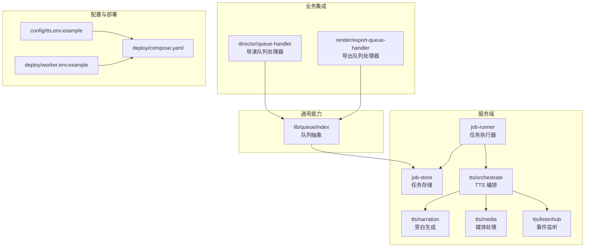
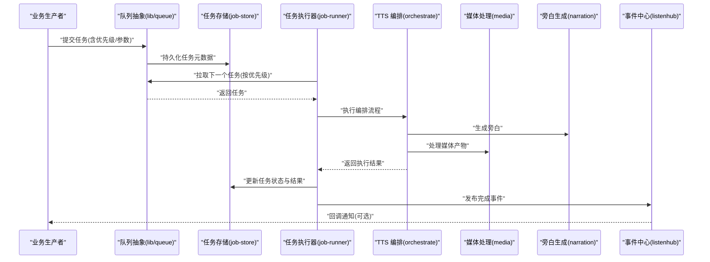
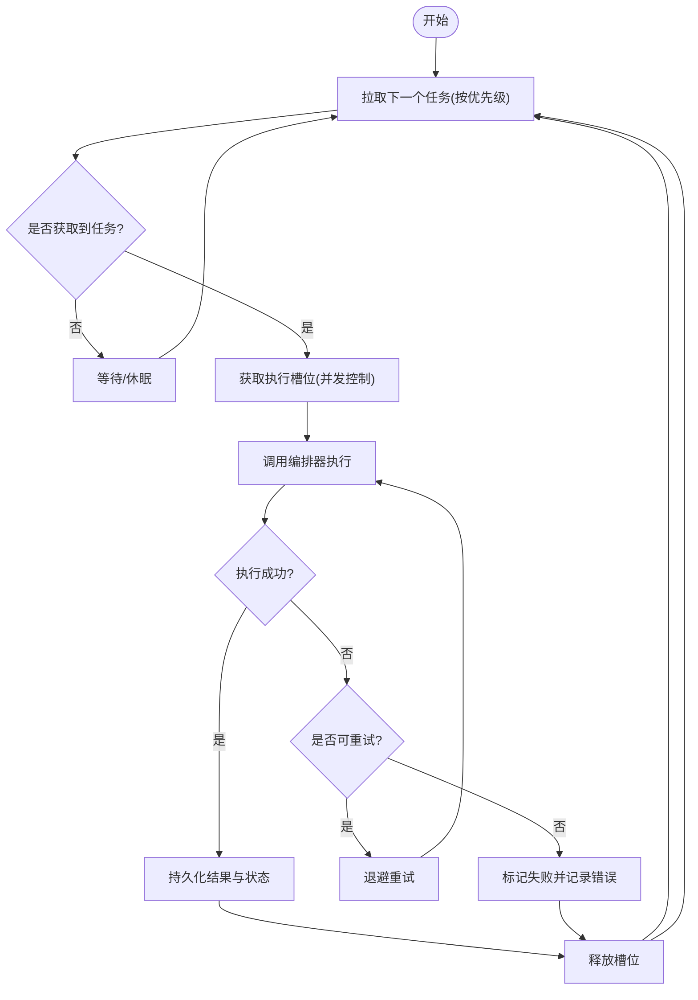
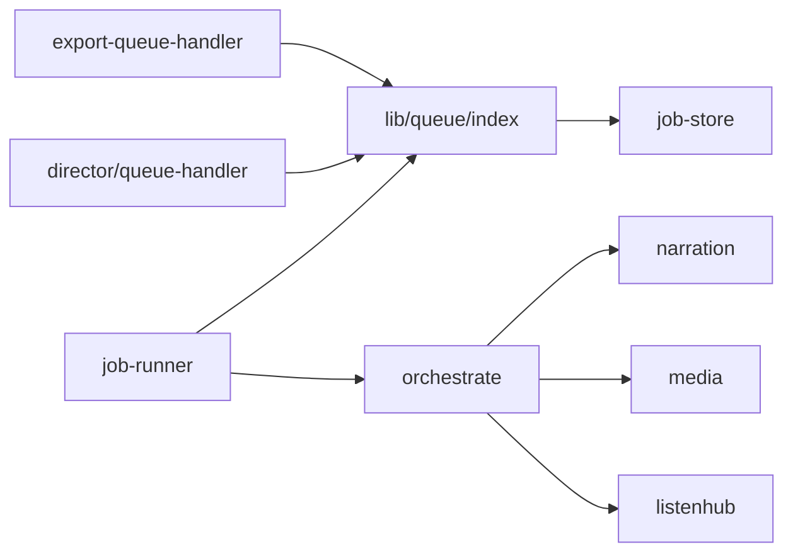

# TTS 队列管理

<cite>
**本文引用的文件**   
- [server/src/server/job-runner.ts](file://server/src/server/job-runner.ts)
- [server/src/server/job-store.ts](file://server/src/server/job-store.ts)
- [server/src/tts/orchestrate.ts](file://server/src/tts/orchestrate.ts)
- [server/src/tts/narration.ts](file://server/src/tts/narration.ts)
- [server/src/tts/media.ts](file://server/src/tts/media.ts)
- [server/src/tts/listenhub.ts](file://server/src/tts/listenhub.ts)
- [src/features/director/queue-handler.ts](file://src/features/director/queue-handler.ts)
- [src/features/render/export-queue-handler.ts](file://src/features/render/export-queue-handler.ts)
- [src/lib/queue/index.ts](file://src/lib/queue/index.ts)
- [src/lib/tts/index.ts](file://src/lib/tts/index.ts)
- [config/tts.env.example](file://config/tts.env.example)
- [deploy/compose.yaml](file://deploy/compose.yaml)
- [deploy/env.example](file://deploy/env.example)
- [deploy/worker.env.example](file://deploy/worker.env.example)
- [docs/configuration/tts.md](file://docs/configuration/tts.md)
- [docs/issues/ISSUE-004-queue-concurrency-lanes.md](file://docs/issues/ISSUE-004-queue-concurrency-lanes.md)
- [tests/tts-config.test.ts](file://tests/tts-config.test.ts)
- [tests/tts-narration.test.ts](file://tests/tts-narration.test.ts)
- [tests/tts-orchestration.test.ts](file://tests/tts-orchestration.test.ts)
- [tests/tts-pipeline-integration.test.ts](file://tests/tts-pipeline-integration.test.ts)
- [tests/tts-runtime.test.ts](file://tests/tts-runtime.test.ts)
</cite>

## 目录
1. [简介](#简介)
2. [项目结构](#项目结构)
3. [核心组件](#核心组件)
4. [架构总览](#架构总览)
5. [详细组件分析](#详细组件分析)
6. [依赖关系分析](#依赖关系分析)
7. [性能考量](#性能考量)
8. [故障排查指南](#故障排查指南)
9. [结论](#结论)
10. [附录](#附录)

## 简介
本文件面向 TTS（文本转语音）异步任务队列管理系统，系统性阐述其设计架构与实现要点。内容涵盖：
- 任务优先级、并发控制与资源分配策略
- 队列处理器工作机制：任务分发、状态跟踪与结果回调
- 任务持久化策略：确保不丢失与可恢复性
- 队列监控与调试工具：状态查询、性能指标与错误日志
- 扩展性设计：水平扩展与负载均衡
- 配置优化建议与故障排查指南

## 项目结构
TTS 队列相关代码主要分布在服务端与前端功能模块中：
- 服务端核心：job-runner（任务执行器）、job-store（任务存储）、tts 编排与媒体处理
- 通用队列能力：lib/queue（抽象队列接口与实现）
- 业务集成：director 与 render 的队列处理器
- 配置与环境：tts.env、compose 与 worker 环境变量
- 文档与测试：配置说明、并发问题记录与端到端测试

图表来源
- [server/src/server/job-runner.ts](file://server/src/server/job-runner.ts)
- [server/src/server/job-store.ts](file://server/src/server/job-store.ts)
- [server/src/tts/orchestrate.ts](file://server/src/tts/orchestrate.ts)
- [server/src/tts/narration.ts](file://server/src/tts/narration.ts)
- [server/src/tts/media.ts](file://server/src/tts/media.ts)
- [server/src/tts/listenhub.ts](file://server/src/tts/listenhub.ts)
- [src/lib/queue/index.ts](file://src/lib/queue/index.ts)
- [src/features/director/queue-handler.ts](file://src/features/director/queue-handler.ts)
- [src/features/render/export-queue-handler.ts](file://src/features/render/export-queue-handler.ts)
- [config/tts.env.example](file://config/tts.env.example)
- [deploy/compose.yaml](file://deploy/compose.yaml)
- [deploy/worker.env.example](file://deploy/worker.env.example)

章节来源
- [server/src/server/job-runner.ts](file://server/src/server/job-runner.ts)
- [server/src/server/job-store.ts](file://server/src/server/job-store.ts)
- [server/src/tts/orchestrate.ts](file://server/src/tts/orchestrate.ts)
- [src/lib/queue/index.ts](file://src/lib/queue/index.ts)
- [config/tts.env.example](file://config/tts.env.example)
- [deploy/compose.yaml](file://deploy/compose.yaml)

## 核心组件
- 任务执行器（job-runner）：负责从队列拉取任务、调度执行、重试与失败处理，维护执行上下文与生命周期。
- 任务存储（job-store）：提供任务的持久化、状态更新、幂等写入与查询接口，保证任务不丢失与可恢复。
- TTS 编排（orchestrate）：协调旁白生成、媒体处理与事件监听，串联多阶段任务并管理中间产物。
- 队列抽象（lib/queue）：定义统一的入队、出队、优先级与并发控制接口，屏蔽底层实现差异。
- 业务队列处理器（director/export）：将业务动作封装为队列任务，统一接入通用队列能力。

章节来源
- [server/src/server/job-runner.ts](file://server/src/server/job-runner.ts)
- [server/src/server/job-store.ts](file://server/src/server/job-store.ts)
- [server/src/tts/orchestrate.ts](file://server/src/tts/orchestrate.ts)
- [src/lib/queue/index.ts](file://src/lib/queue/index.ts)
- [src/features/director/queue-handler.ts](file://src/features/director/queue-handler.ts)
- [src/features/render/export-queue-handler.ts](file://src/features/render/export-queue-handler.ts)

## 架构总览
TTS 队列系统采用“生产者—队列—消费者”的解耦架构：
- 生产者：业务层（如导演、导出）通过队列抽象提交任务，附带优先级与参数。
- 队列：持久化存储任务元数据与状态，支持优先级排序与并发限制。
- 消费者：job-runner 拉取任务，调用 tts/orchestrate 编排执行，最终回写结果与状态。
- 事件通道：listenhub 用于跨进程/服务的事件广播与订阅，便于监控与调试。

图表来源
- [src/lib/queue/index.ts](file://src/lib/queue/index.ts)
- [server/src/server/job-store.ts](file://server/src/server/job-store.ts)
- [server/src/server/job-runner.ts](file://server/src/server/job-runner.ts)
- [server/src/tts/orchestrate.ts](file://server/src/tts/orchestrate.ts)
- [server/src/tts/media.ts](file://server/src/tts/media.ts)
- [server/src/tts/narration.ts](file://server/src/tts/narration.ts)
- [server/src/tts/listenhub.ts](file://server/src/tts/listenhub.ts)

## 详细组件分析

### 任务执行器（job-runner）
- 职责：周期性拉取任务、设置执行上下文、调用编排器、处理异常与重试、更新状态。
- 并发控制：基于全局或分桶的并发上限，避免资源争用；支持任务抢占与超时保护。
- 错误处理：区分可重试与不可重试错误，记录错误上下文与堆栈，触发告警与降级。
- 可观测性：输出关键指标（吞吐、延迟、失败率），发布事件供监控消费。

图表来源
- [server/src/server/job-runner.ts](file://server/src/server/job-runner.ts)
- [server/src/server/job-store.ts](file://server/src/server/job-store.ts)

章节来源
- [server/src/server/job-runner.ts](file://server/src/server/job-runner.ts)
- [server/src/server/job-store.ts](file://server/src/server/job-store.ts)

### 任务存储（job-store）
- 职责：任务元数据持久化、状态机转换、幂等写入、查询与统计。
- 一致性：使用事务与锁机制保证并发写入安全；支持补偿与重放。
- 索引与查询：按优先级、状态、时间戳建立索引，提升拉取与监控效率。
- 清理策略：过期任务归档与删除，避免存储膨胀。

章节来源
- [server/src/server/job-store.ts](file://server/src/server/job-store.ts)

### TTS 编排（orchestrate）
- 职责：串联旁白生成与媒体处理，管理中间产物与依赖关系。
- 容错：阶段级重试与回滚，失败时保留部分产物以便增量修复。
- 资源隔离：为不同阶段分配独立资源池，避免相互影响。

章节来源
- [server/src/tts/orchestrate.ts](file://server/src/tts/orchestrate.ts)
- [server/src/tts/narration.ts](file://server/src/tts/narration.ts)
- [server/src/tts/media.ts](file://server/src/tts/media.ts)

### 队列抽象（lib/queue）
- 接口：入队、出队、优先级排序、并发限制、批量操作。
- 实现：可插拔后端（内存/消息队列/数据库），统一契约。
- 扩展点：拦截器、审计、指标上报。

章节来源
- [src/lib/queue/index.ts](file://src/lib/queue/index.ts)

### 业务队列处理器（director/export）
- director/queue-handler：将导演工作流步骤转换为队列任务，支持阶段推进与状态同步。
- export/queue-handler：将导出任务入队，处理编码、合并与产物落盘。

章节来源
- [src/features/director/queue-handler.ts](file://src/features/director/queue-handler.ts)
- [src/features/render/export-queue-handler.ts](file://src/features/render/export-queue-handler.ts)

### 事件中心（listenhub）
- 职责：跨进程/服务的事件广播与订阅，支撑监控、调试与回调。
- 特性：可靠投递、去重、过滤与限流。

章节来源
- [server/src/tts/listenhub.ts](file://server/src/tts/listenhub.ts)

## 依赖关系分析

图表来源
- [src/lib/queue/index.ts](file://src/lib/queue/index.ts)
- [server/src/server/job-store.ts](file://server/src/server/job-store.ts)
- [server/src/server/job-runner.ts](file://server/src/server/job-runner.ts)
- [server/src/tts/orchestrate.ts](file://server/src/tts/orchestrate.ts)
- [server/src/tts/narration.ts](file://server/src/tts/narration.ts)
- [server/src/tts/media.ts](file://server/src/tts/media.ts)
- [server/src/tts/listenhub.ts](file://server/src/tts/listenhub.ts)
- [src/features/director/queue-handler.ts](file://src/features/director/queue-handler.ts)
- [src/features/render/export-queue-handler.ts](file://src/features/render/export-queue-handler.ts)

章节来源
- [src/lib/queue/index.ts](file://src/lib/queue/index.ts)
- [server/src/server/job-store.ts](file://server/src/server/job-store.ts)
- [server/src/server/job-runner.ts](file://server/src/server/job-runner.ts)
- [server/src/tts/orchestrate.ts](file://server/src/tts/orchestrate.ts)

## 性能考量
- 优先级与公平性：高优先级任务优先调度，同时防止低优先级饥饿（可采用加权轮询或时间片）。
- 并发控制：根据 CPU/GPU/IO 瓶颈动态调整并发度，避免过载导致抖动。
- 批处理与合并：对相似任务进行批处理以减少开销（如批量编码）。
- 缓存与复用：中间产物缓存、模型权重预热，降低重复计算。
- 背压与限流：当下游服务慢时，自动降速入队或丢弃非关键任务。
- 监控指标：吞吐、延迟分布、失败率、队列长度、资源利用率。

[本节为通用指导，无需特定文件引用]

## 故障排查指南
- 常见问题定位：
  - 任务堆积：检查 job-runner 并发配置与下游处理能力。
  - 任务失败：查看 job-store 错误日志与重试次数，确认是否可重试。
  - 资源争用：观察 CPU/GPU/IO 指标，调整并发与超时。
  - 事件丢失：验证 listenhub 投递可靠性与订阅者消费能力。
- 诊断工具：
  - 状态查询：通过 job-store 查询任务状态与进度。
  - 指标采集：收集 runner 与 store 的关键指标。
  - 日志聚合：集中收集错误堆栈与上下文信息。
- 恢复策略：
  - 失败任务重放：基于持久化状态进行补偿执行。
  - 断点续传：从最近成功阶段继续执行。
  - 降级模式：关闭非关键步骤，保障核心路径可用。

章节来源
- [server/src/server/job-store.ts](file://server/src/server/job-store.ts)
- [server/src/server/job-runner.ts](file://server/src/server/job-runner.ts)
- [server/src/tts/listenhub.ts](file://server/src/tts/listenhub.ts)

## 结论
TTS 队列管理系统通过清晰的职责分离与可扩展的队列抽象，实现了高可靠的任务处理与编排。结合持久化、并发控制与事件驱动，系统在稳定性、性能与可观测性方面具备良好基础。后续可进一步优化优先级策略、资源自适应与横向扩展能力。

[本节为总结，无需特定文件引用]

## 附录

### 配置与环境
- 环境变量：参考 tts.env 示例与 worker 环境配置，设置队列后端、并发上限、重试策略与日志级别。
- 部署编排：使用 compose 管理多实例 worker 与共享存储，支持水平扩展。

章节来源
- [config/tts.env.example](file://config/tts.env.example)
- [deploy/worker.env.example](file://deploy/worker.env.example)
- [deploy/compose.yaml](file://deploy/compose.yaml)

### 并发与优先级设计
- 并发车道：参考并发车道问题记录，理解分桶与隔离策略。
- 优先级策略：按业务重要性设定优先级，并结合公平调度避免饥饿。

章节来源
- [docs/issues/ISSUE-004-queue-concurrency-lanes.md](file://docs/issues/ISSUE-004-queue-concurrency-lanes.md)

### 测试与验证
- 单元测试：覆盖 tts 配置、旁白生成、编排流程与运行时行为。
- 集成测试：验证端到端管道与队列交互的正确性与鲁棒性。

章节来源
- [tests/tts-config.test.ts](file://tests/tts-config.test.ts)
- [tests/tts-narration.test.ts](file://tests/tts-narration.test.ts)
- [tests/tts-orchestration.test.ts](file://tests/tts-orchestration.test.ts)
- [tests/tts-pipeline-integration.test.ts](file://tests/tts-pipeline-integration.test.ts)
- [tests/tts-runtime.test.ts](file://tests/tts-runtime.test.ts)

### 配置优化建议
- 合理设置并发上限与超时，避免资源耗尽。
- 启用重试与退避策略，提高容错能力。
- 开启指标与日志，便于监控与排障。
- 定期清理过期任务，保持存储健康。

章节来源
- [docs/configuration/tts.md](file://docs/configuration/tts.md)