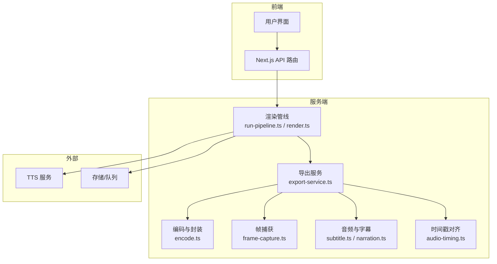
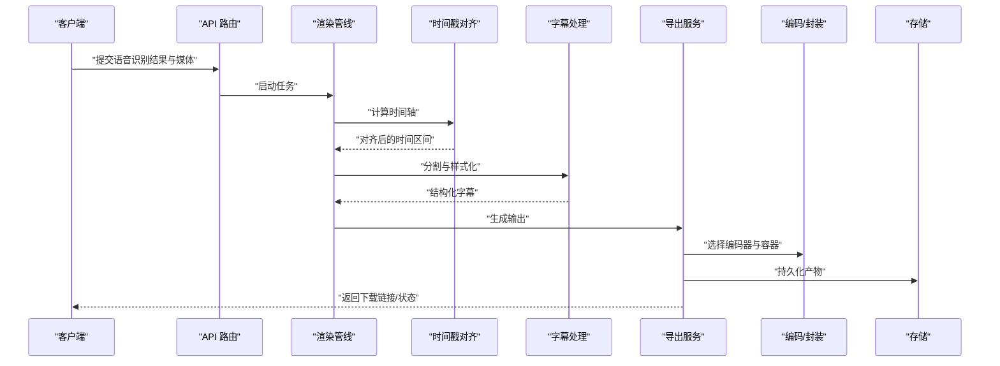
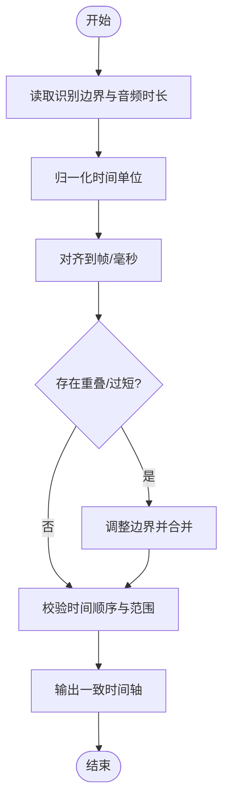
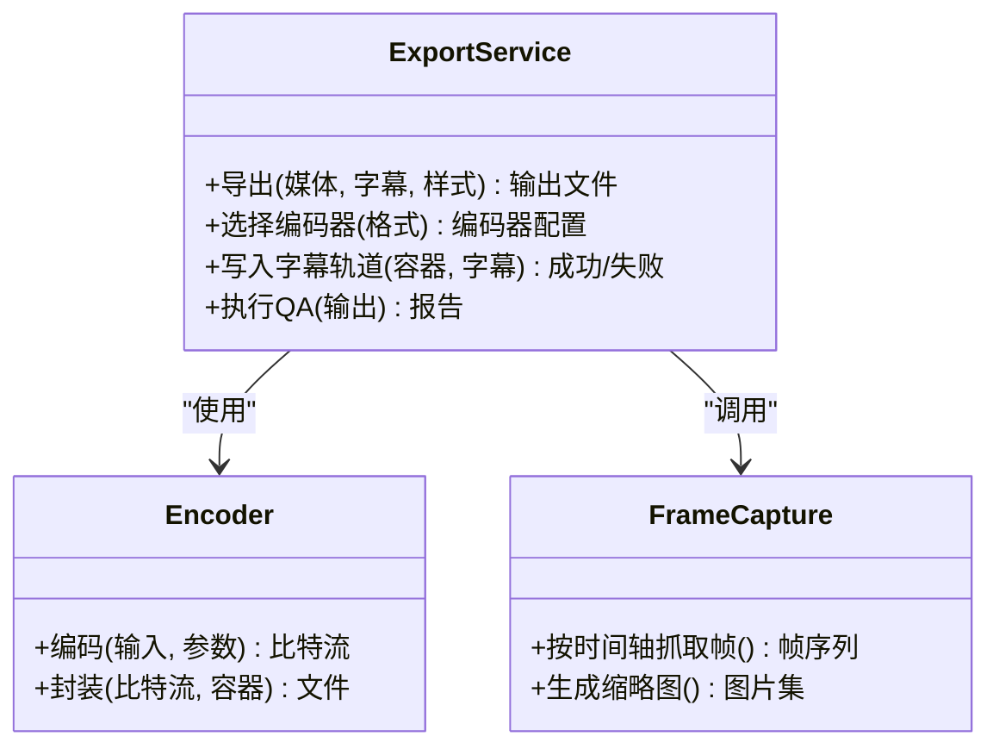
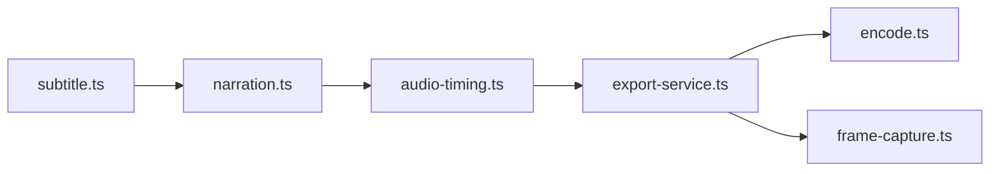

# 字幕生成系统

<cite>
**本文引用的文件**   
- [subtitle.ts](file://src/features/audio/subtitle.ts)
- [narration.ts](file://src/features/audio/narration.ts)
- [audio-timing.ts](file://src/features/director/audio-timing.ts)
- [export-service.ts](file://src/features/render/export-service.ts)
- [encode.ts](file://src/features/render/encode.ts)
- [concat.ts](file://src/features/render/concat.ts)
- [frame-capture.ts](file://src/features/render/frame-capture.ts)
- [render.ts](file://server/src/compose/render.ts)
- [run-pipeline.ts](file://server/src/compose/run-pipeline.ts)
- [tts.env.example](file://config/tts.env.example)
- [compose.yaml](file://deploy/compose.yaml)
</cite>

## 目录
1. [简介](#简介)
2. [项目结构](#项目结构)
3. [核心组件](#核心组件)
4. [架构总览](#架构总览)
5. [详细组件分析](#详细组件分析)
6. [依赖关系分析](#依赖关系分析)
7. [性能考虑](#性能考虑)
8. [故障排查指南](#故障排查指南)
9. [结论](#结论)
10. [附录](#附录)

## 简介
本文件为“字幕生成系统”的全面技术文档，聚焦从语音识别结果到最终字幕文件的完整流程。内容涵盖：
- 支持的输出格式（SRT、ASS、VTT）及其特性与兼容性
- 时间戳计算算法与精确同步策略
- 样式系统（字体、颜色、位置、动画）配置方法
- 字幕分割策略（语义完整性与阅读体验）
- 多语言支持与国际化处理
- 自定义样式最佳实践

## 项目结构
本项目采用前后端分离与模块化设计：
- 前端 Next.js 应用负责交互与展示
- 服务端编排渲染与导出管线
- 音频与字幕能力集中在 features/audio 与 features/render 模块
- TTS 与外部服务通过环境变量与部署配置管理

图表来源
- [run-pipeline.ts](file://server/src/compose/run-pipeline.ts)
- [render.ts](file://server/src/compose/render.ts)
- [export-service.ts](file://src/features/render/export-service.ts)
- [encode.ts](file://src/features/render/encode.ts)
- [frame-capture.ts](file://src/features/render/frame-capture.ts)
- [subtitle.ts](file://src/features/audio/subtitle.ts)
- [narration.ts](file://src/features/audio/narration.ts)
- [audio-timing.ts](file://src/features/director/audio-timing.ts)

章节来源
- [run-pipeline.ts](file://server/src/compose/run-pipeline.ts)
- [render.ts](file://server/src/compose/render.ts)
- [export-service.ts](file://src/features/render/export-service.ts)
- [encode.ts](file://src/features/render/encode.ts)
- [frame-capture.ts](file://src/features/render/frame-capture.ts)
- [subtitle.ts](file://src/features/audio/subtitle.ts)
- [narration.ts](file://src/features/audio/narration.ts)
- [audio-timing.ts](file://src/features/director/audio-timing.ts)

## 核心组件
- 字幕数据模型与格式化：定义字幕条目、时间轴、样式标记与输出序列化
- 叙事与音频：将语音识别结果与音频片段关联，维护时间基准
- 时间戳对齐：基于音频时长与识别边界计算精确起止时间
- 导出服务：协调渲染、编码、帧捕获与字幕写入，生成最终产物
- 编码与封装：根据目标格式选择编码器与容器参数
- 帧捕获：按时间轴抓取关键帧用于预览或 QA

章节来源
- [subtitle.ts](file://src/features/audio/subtitle.ts)
- [narration.ts](file://src/features/audio/narration.ts)
- [audio-timing.ts](file://src/features/director/audio-timing.ts)
- [export-service.ts](file://src/features/render/export-service.ts)
- [encode.ts](file://src/features/render/encode.ts)
- [frame-capture.ts](file://src/features/render/frame-capture.ts)

## 架构总览
整体流程从语音识别结果开始，经时间戳对齐、字幕分割、样式注入，最终导出为 SRT/ASS/VTT 等格式。

图表来源
- [run-pipeline.ts](file://server/src/compose/run-pipeline.ts)
- [render.ts](file://server/src/compose/render.ts)
- [audio-timing.ts](file://src/features/director/audio-timing.ts)
- [subtitle.ts](file://src/features/audio/subtitle.ts)
- [export-service.ts](file://src/features/render/export-service.ts)
- [encode.ts](file://src/features/render/encode.ts)

章节来源
- [run-pipeline.ts](file://server/src/compose/run-pipeline.ts)
- [render.ts](file://server/src/compose/render.ts)
- [audio-timing.ts](file://src/features/director/audio-timing.ts)
- [subtitle.ts](file://src/features/audio/subtitle.ts)
- [export-service.ts](file://src/features/render/export-service.ts)
- [encode.ts](file://src/features/render/encode.ts)

## 详细组件分析

### 字幕数据与格式化（SRT/ASS/VTT）
- 数据结构：包含文本、起始时间、结束时间、样式标签、说话人标识、语言代码等
- 格式化器：分别实现 SRT、ASS、VTT 的序列化规则
  - SRT：简单时间轴与换行，兼容性强
  - ASS：支持样式表、动画、定位、特效
  - VTT：Web 友好，支持样式与区域设置
- 兼容性：确保时间精度、字符编码、换行符与特殊字符转义符合规范

章节来源
- [subtitle.ts](file://src/features/audio/subtitle.ts)

### 叙事与音频关联
- 将语音识别结果与音频片段建立映射，记录每段文本对应的音频区间
- 维护说话人、语言、置信度等元数据
- 提供查询接口以获取某时间段内的字幕片段

章节来源
- [narration.ts](file://src/features/audio/narration.ts)

### 时间戳计算与精确同步
- 输入：语音识别的时间边界、音频采样率、帧率
- 算法：
  - 基于音频时长校准识别边界
  - 对齐到帧或毫秒级精度
  - 合并相邻短间隔，避免重叠与空隙
- 输出：稳定的时间轴，保证播放时字幕与语音严格同步

图表来源
- [audio-timing.ts](file://src/features/director/audio-timing.ts)

章节来源
- [audio-timing.ts](file://src/features/director/audio-timing.ts)

### 字幕分割策略
- 语义完整性：优先在句子或短语边界切分，避免打断语义
- 阅读体验：控制每行字数与显示时长，确保可读性
- 动态调整：根据语速与停顿自动扩展或压缩显示时间
- 冲突解决：当语义边界与时间约束冲突时，优先保证时间准确性

章节来源
- [subtitle.ts](file://src/features/audio/subtitle.ts)
- [narration.ts](file://src/features/audio/narration.ts)

### 样式系统与动画配置
- 基础样式：字体族、字号、颜色、描边、阴影、背景
- 高级样式：位置锚点、对齐方式、滚动效果、淡入淡出、缩放
- 动画：过渡时长、缓动函数、循环模式
- 平台差异：不同播放器对 ASS/VTT 样式的支持需做降级处理

章节来源
- [subtitle.ts](file://src/features/audio/subtitle.ts)

### 导出服务与编码封装
- 导出服务协调渲染、帧捕获、字幕写入与打包
- 编码策略：根据目标格式选择编码器参数（码率、分辨率、帧率）
- 封装容器：MP4/WebM 等容器与字幕轨道嵌入
- 质量检查：输出前进行基本 QA（时长、音画同步、字幕可见性）

图表来源
- [export-service.ts](file://src/features/render/export-service.ts)
- [encode.ts](file://src/features/render/encode.ts)
- [frame-capture.ts](file://src/features/render/frame-capture.ts)

章节来源
- [export-service.ts](file://src/features/render/export-service.ts)
- [encode.ts](file://src/features/render/encode.ts)
- [frame-capture.ts](file://src/features/render/frame-capture.ts)

### 多语言支持与国际化
- 语言代码：遵循 ISO 639-1/2 标准，标注每条字幕的语言
- 翻译与本地化：支持多语言字幕轨道切换
- 字符集：UTF-8 编码，确保特殊字符正确显示
- 区域设置：日期、时间、数字格式适配不同地区

章节来源
- [subtitle.ts](file://src/features/audio/subtitle.ts)
- [narration.ts](file://src/features/audio/narration.ts)

## 依赖关系分析
- 模块内聚：字幕、叙事、时间戳对齐紧密耦合，形成字幕子域
- 模块解耦：导出服务通过接口与编码器、帧捕获解耦
- 外部依赖：TTS 服务、存储与队列通过环境变量与部署配置注入

图表来源
- [subtitle.ts](file://src/features/audio/subtitle.ts)
- [narration.ts](file://src/features/audio/narration.ts)
- [audio-timing.ts](file://src/features/director/audio-timing.ts)
- [export-service.ts](file://src/features/render/export-service.ts)
- [encode.ts](file://src/features/render/encode.ts)
- [frame-capture.ts](file://src/features/render/frame-capture.ts)

章节来源
- [subtitle.ts](file://src/features/audio/subtitle.ts)
- [narration.ts](file://src/features/audio/narration.ts)
- [audio-timing.ts](file://src/features/director/audio-timing.ts)
- [export-service.ts](file://src/features/render/export-service.ts)
- [encode.ts](file://src/features/render/encode.ts)
- [frame-capture.ts](file://src/features/render/frame-capture.ts)

## 性能考虑
- 时间戳计算：批量处理与并行对齐，减少 I/O 等待
- 字幕分割：缓存语义边界，避免重复解析
- 导出优化：按需抓取帧，限制并发数，使用硬件加速编码
- 内存管理：流式处理大文件，避免一次性加载

[本节为通用指导，不直接分析具体文件]

## 故障排查指南
- 时间不同步：检查音频采样率与帧率一致性，确认对齐算法是否启用
- 字幕缺失：验证识别结果是否完整，检查分割策略是否过于激进
- 样式异常：确认播放器对 ASS/VTT 的支持，必要时降级为 SRT
- 导出失败：查看编码器日志，检查磁盘空间与权限

章节来源
- [audio-timing.ts](file://src/features/director/audio-timing.ts)
- [subtitle.ts](file://src/features/audio/subtitle.ts)
- [export-service.ts](file://src/features/render/export-service.ts)

## 结论
本系统通过模块化设计与清晰的职责划分，实现了从语音识别到字幕输出的完整流水线。时间戳对齐与字幕分割策略确保了同步性与可读性，样式系统与多语言支持提升了用户体验与适用范围。建议在生产环境中结合硬件加速与缓存机制进一步优化性能。

[本节为总结，不直接分析具体文件]

## 附录

### 环境变量与部署配置
- TTS 配置：通过 tts.env.example 管理密钥与端点
- 容器编排：使用 compose.yaml 管理服务与依赖

章节来源
- [tts.env.example](file://config/tts.env.example)
- [compose.yaml](file://deploy/compose.yaml)