# 音频处理管道

<cite>
**本文引用的文件**   
- [src/features/audio/index.ts](file://src/features/audio/index.ts)
- [src/features/audio/measure.ts](file://src/features/audio/measure.ts)
- [src/features/audio/mp3-frame-header.ts](file://src/features/audio/mp3-frame-header.ts)
- [src/features/audio/narration.ts](file://src/features/audio/narration.ts)
- [src/features/audio/repository.ts](file://src/features/audio/repository.ts)
- [src/features/audio/runtime-repository.ts](file://src/features/audio/runtime-repository.ts)
- [src/features/audio/score.ts](file://src/features/audio/score.ts)
- [src/features/audio/sfx.ts](file://src/features/audio/sfx.ts)
- [src/features/audio/subtitle.ts](file://src/features/audio/subtitle.ts)
- [src/features/audio/types.ts](file://src/features/audio/types.ts)
- [src/features/director/audio-timing.ts](file://src/features/director/audio-timing.ts)
- [src/features/render/encode.ts](file://src/features/render/encode.ts)
- [src/features/render/concat.ts](file://src/features/render/concat.ts)
- [src/features/render/export-service.ts](file://src/features/render/export-service.ts)
- [src/features/render/renderer.ts](file://src/features/render/renderer.ts)
- [src/features/render/source-contract.ts](file://src/features/render/source-contract.ts)
- [src/features/render/thumbnail.ts](file://src/features/render/thumbnail.ts)
- [server/src/tts/media.ts](file://server/src/tts/media.ts)
- [server/src/tts/orchestrate.ts](file://server/src/tts/orchestrate.ts)
</cite>

## 目录
1. [简介](#简介)
2. [项目结构](#项目结构)
3. [核心组件](#核心组件)
4. [架构总览](#架构总览)
5. [详细组件分析](#详细组件分析)
6. [依赖关系分析](#依赖关系分析)
7. [性能考虑](#性能考虑)
8. [故障排查指南](#故障排查指南)
9. [结论](#结论)
10. [附录](#附录)

## 简介
本文件面向“音频处理管道”的完整技术文档，覆盖以下目标：
- 音频格式转换与编解码（WAV、MP3、AAC）
- 音频质量优化（降噪、均衡、压缩）
- 音频测量与分析（时长检测、音量分析、频谱分析）
- 音频流式处理机制（大文件分段、内存优化）
- 元数据提取、标签管理与格式校验
- 性能调优与常见问题解决方案

该管道由前端特性模块（src/features/audio）、渲染导出服务（src/features/render）、以及服务端 TTS 编排（server/src/tts）共同组成。通过统一的类型契约与仓库抽象，实现从媒体摄取、转码、测量、合成到导出的端到端流程。

## 项目结构
音频相关代码主要分布在三个区域：
- src/features/audio：音频领域模型、测量、字幕、音效、TTS 叙事、持久化与运行时仓库等
- src/features/render：编码、拼接、缩略图、导出服务、渲染器、源契约等
- server/src/tts：TTS 媒体处理与编排

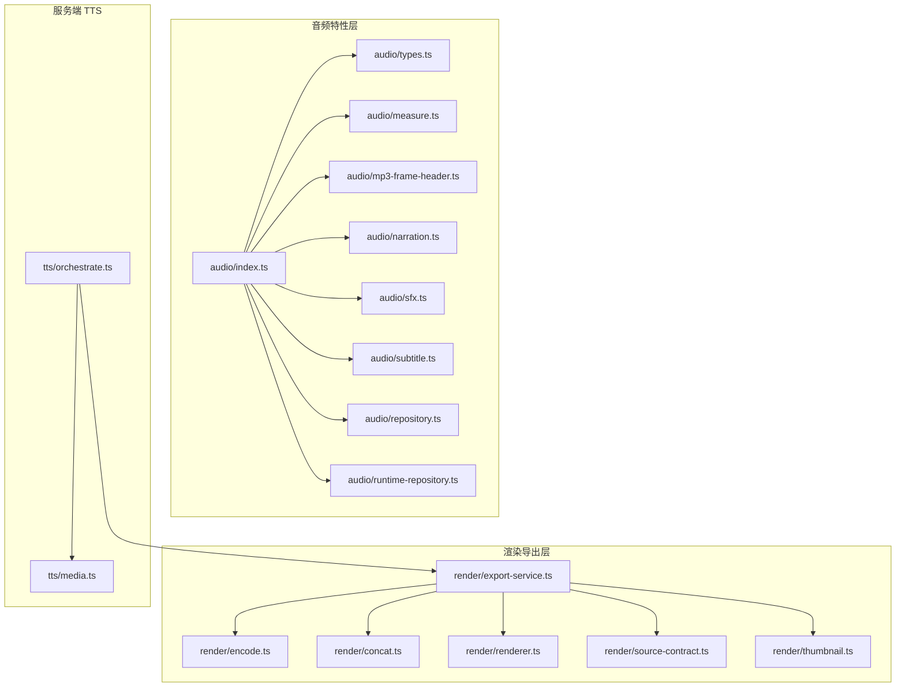

图表来源
- [src/features/audio/index.ts](file://src/features/audio/index.ts)
- [src/features/audio/types.ts](file://src/features/audio/types.ts)
- [src/features/audio/measure.ts](file://src/features/audio/measure.ts)
- [src/features/audio/mp3-frame-header.ts](file://src/features/audio/mp3-frame-header.ts)
- [src/features/audio/narration.ts](file://src/features/audio/narration.ts)
- [src/features/audio/sfx.ts](file://src/features/audio/sfx.ts)
- [src/features/audio/subtitle.ts](file://src/features/audio/subtitle.ts)
- [src/features/audio/repository.ts](file://src/features/audio/repository.ts)
- [src/features/audio/runtime-repository.ts](file://src/features/audio/runtime-repository.ts)
- [src/features/render/encode.ts](file://src/features/render/encode.ts)
- [src/features/render/concat.ts](file://src/features/render/concat.ts)
- [src/features/render/export-service.ts](file://src/features/render/export-service.ts)
- [src/features/render/renderer.ts](file://src/features/render/renderer.ts)
- [src/features/render/source-contract.ts](file://src/features/render/source-contract.ts)
- [src/features/render/thumbnail.ts](file://src/features/render/thumbnail.ts)
- [server/src/tts/media.ts](file://server/src/tts/media.ts)
- [server/src/tts/orchestrate.ts](file://server/src/tts/orchestrate.ts)

章节来源
- [src/features/audio/index.ts](file://src/features/audio/index.ts)
- [src/features/render/export-service.ts](file://src/features/render/export-service.ts)
- [server/src/tts/orchestrate.ts](file://server/src/tts/orchestrate.ts)

## 核心组件
- 类型与契约：统一描述音频片段、轨道、采样率、声道、比特率、容器格式等
- 测量与分析：时长、响度、峰值、频谱统计
- MP3 帧头解析：快速定位帧边界，辅助分片与索引
- 叙事与音效：TTS 文本到音频、音效叠加与混音
- 字幕：时间轴与文本对齐
- 仓库抽象：本地/运行时存储访问，解耦 I/O
- 渲染与导出：编码、拼接、缩略图生成、导出任务编排
- TTS 编排：服务端侧的媒体管线协调

章节来源
- [src/features/audio/types.ts](file://src/features/audio/types.ts)
- [src/features/audio/measure.ts](file://src/features/audio/measure.ts)
- [src/features/audio/mp3-frame-header.ts](file://src/features/audio/mp3-frame-header.ts)
- [src/features/audio/narration.ts](file://src/features/audio/narration.ts)
- [src/features/audio/sfx.ts](file://src/features/audio/sfx.ts)
- [src/features/audio/subtitle.ts](file://src/features/audio/subtitle.ts)
- [src/features/audio/repository.ts](file://src/features/audio/repository.ts)
- [src/features/audio/runtime-repository.ts](file://src/features/audio/runtime-repository.ts)
- [src/features/render/encode.ts](file://src/features/render/encode.ts)
- [src/features/render/concat.ts](file://src/features/render/concat.ts)
- [src/features/render/export-service.ts](file://src/features/render/export-service.ts)
- [src/features/render/renderer.ts](file://src/features/render/renderer.ts)
- [src/features/render/source-contract.ts](file://src/features/render/source-contract.ts)
- [src/features/render/thumbnail.ts](file://src/features/render/thumbnail.ts)
- [server/src/tts/media.ts](file://server/src/tts/media.ts)
- [server/src/tts/orchestrate.ts](file://server/src/tts/orchestrate.ts)

## 架构总览
整体采用“特性层 + 渲染导出层 + 服务端编排”的分层架构。特性层负责音频领域能力封装；渲染导出层提供通用编码、拼接、缩略图与导出流水线；服务端编排将 TTS、媒体处理与导出串联为可执行任务。

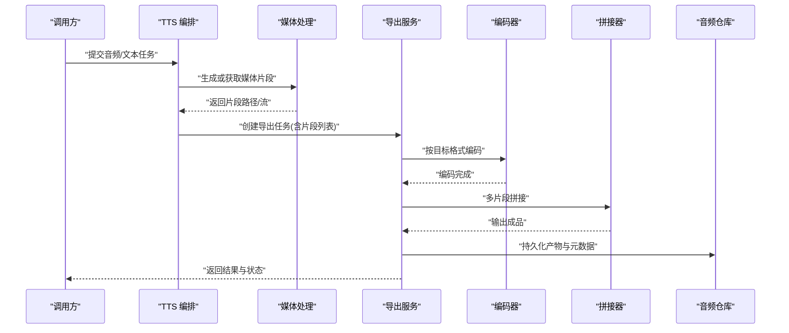

图表来源
- [server/src/tts/orchestrate.ts](file://server/src/tts/orchestrate.ts)
- [server/src/tts/media.ts](file://server/src/tts/media.ts)
- [src/features/render/export-service.ts](file://src/features/render/export-service.ts)
- [src/features/render/encode.ts](file://src/features/render/encode.ts)
- [src/features/render/concat.ts](file://src/features/render/concat.ts)
- [src/features/audio/repository.ts](file://src/features/audio/repository.ts)

## 详细组件分析

### 音频类型与契约
- 定义音频片段、轨道、采样率、声道、比特率、容器格式、时间戳等基础数据结构
- 为测量、编码、拼接、字幕等模块提供统一输入输出契约

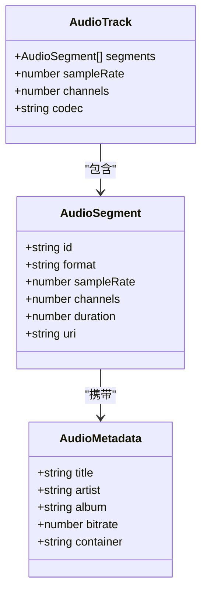

图表来源
- [src/features/audio/types.ts](file://src/features/audio/types.ts)

章节来源
- [src/features/audio/types.ts](file://src/features/audio/types.ts)

### 音频测量与分析
- 时长检测：基于容器信息或帧扫描计算精确时长
- 音量分析：RMS、峰值、LUFS 近似值
- 频谱分析：FFT 分带能量统计，用于质量评估与自适应处理

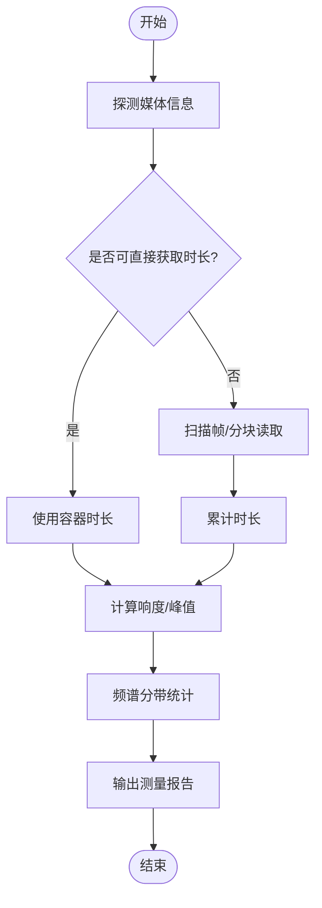

图表来源
- [src/features/audio/measure.ts](file://src/features/audio/measure.ts)
- [src/features/audio/mp3-frame-header.ts](file://src/features/audio/mp3-frame-header.ts)

章节来源
- [src/features/audio/measure.ts](file://src/features/audio/measure.ts)
- [src/features/audio/mp3-frame-header.ts](file://src/features/audio/mp3-frame-header.ts)

### MP3 帧头解析
- 解析帧头字段（同步字、版本、层、比特率、采样率、填充、模式等）
- 支持快速定位帧边界，便于分片与随机访问

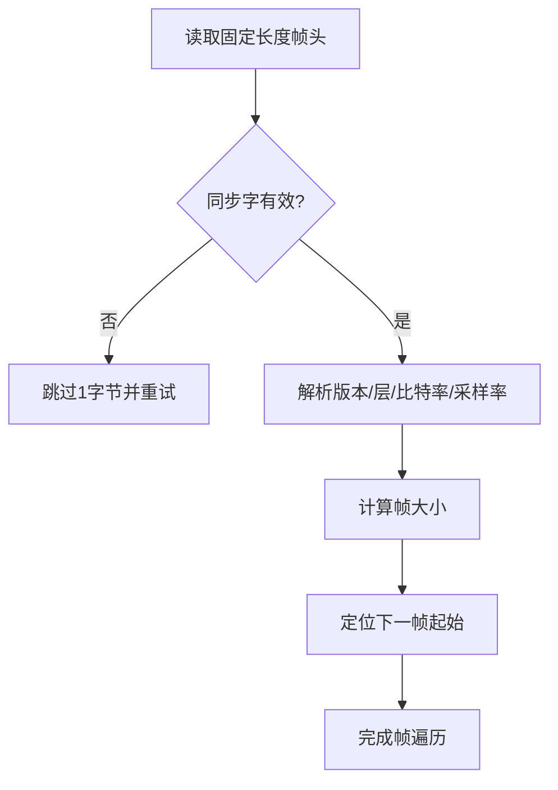

图表来源
- [src/features/audio/mp3-frame-header.ts](file://src/features/audio/mp3-frame-header.ts)

章节来源
- [src/features/audio/mp3-frame-header.ts](file://src/features/audio/mp3-frame-header.ts)

### 叙事与音效（TTS 与 SFX）
- 叙事：文本到语音合成，生成音频片段并写入仓库
- 音效：加载音效片段，进行增益、淡入淡出、混音

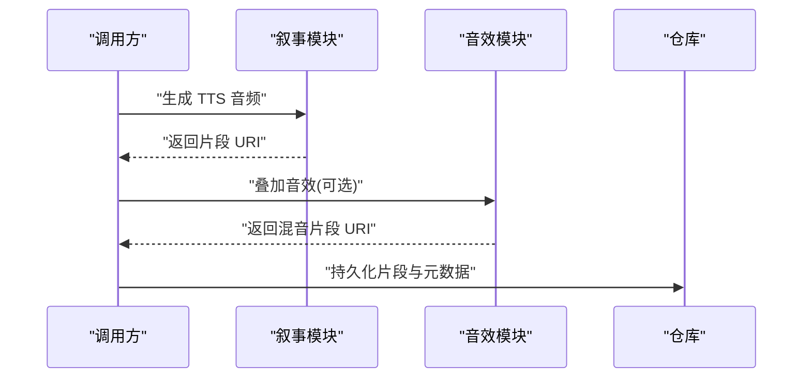

图表来源
- [src/features/audio/narration.ts](file://src/features/audio/narration.ts)
- [src/features/audio/sfx.ts](file://src/features/audio/sfx.ts)
- [src/features/audio/repository.ts](file://src/features/audio/repository.ts)

章节来源
- [src/features/audio/narration.ts](file://src/features/audio/narration.ts)
- [src/features/audio/sfx.ts](file://src/features/audio/sfx.ts)
- [src/features/audio/repository.ts](file://src/features/audio/repository.ts)

### 字幕与时间轴
- 字幕条目包含起止时间与文本内容
- 与音频片段时间轴对齐，支持导出为 SRT/ASS 等格式

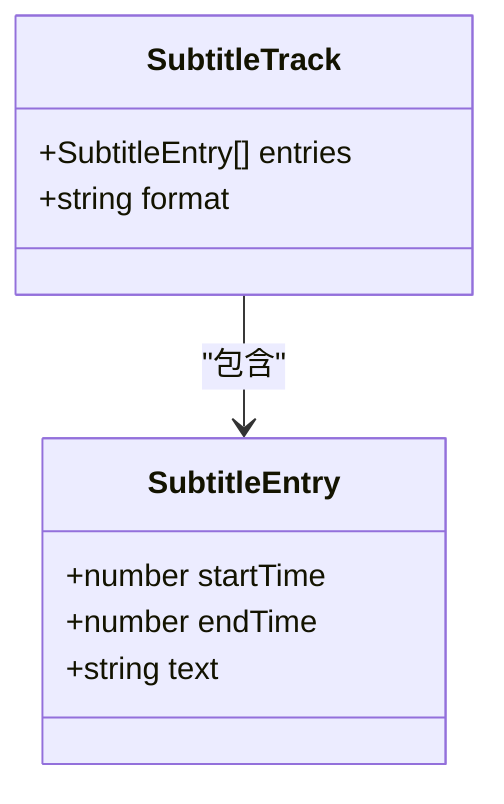

图表来源
- [src/features/audio/subtitle.ts](file://src/features/audio/subtitle.ts)

章节来源
- [src/features/audio/subtitle.ts](file://src/features/audio/subtitle.ts)

### 仓库与运行时仓库
- 仓库抽象：统一读写音频片段、元数据与评分
- 运行时仓库：针对运行期临时存储与缓存策略

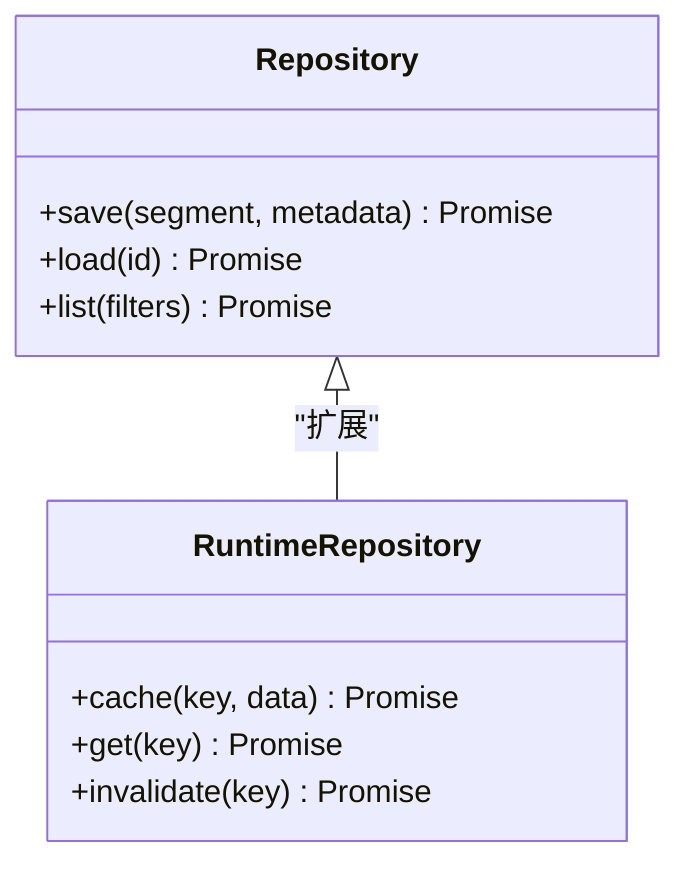

图表来源
- [src/features/audio/repository.ts](file://src/features/audio/repository.ts)
- [src/features/audio/runtime-repository.ts](file://src/features/audio/runtime-repository.ts)

章节来源
- [src/features/audio/repository.ts](file://src/features/audio/repository.ts)
- [src/features/audio/runtime-repository.ts](file://src/features/audio/runtime-repository.ts)

### 评分与质量指标
- 对音频片段进行质量评分（如信噪比、失真、动态范围）
- 结合测量结果给出综合分数，辅助质量控制

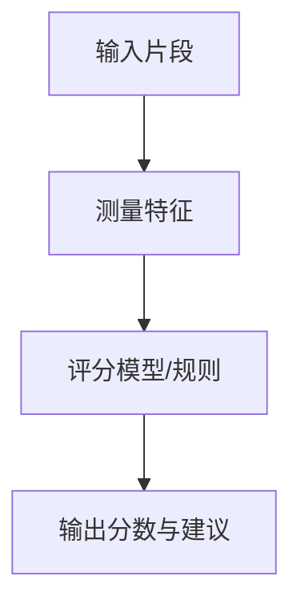

图表来源
- [src/features/audio/score.ts](file://src/features/audio/score.ts)
- [src/features/audio/measure.ts](file://src/features/audio/measure.ts)

章节来源
- [src/features/audio/score.ts](file://src/features/audio/score.ts)
- [src/features/audio/measure.ts](file://src/features/audio/measure.ts)

### 导演层音频时序
- 在导演阶段保证音频时序一致性，避免漂移与错位
- 与测量结果联动，校正时间轴

章节来源
- [src/features/director/audio-timing.ts](file://src/features/director/audio-timing.ts)

### 编码与导出
- 编码器：支持 WAV、MP3、AAC 等格式的编码参数配置与执行
- 导出服务：编排编码、拼接、缩略图生成与结果回写

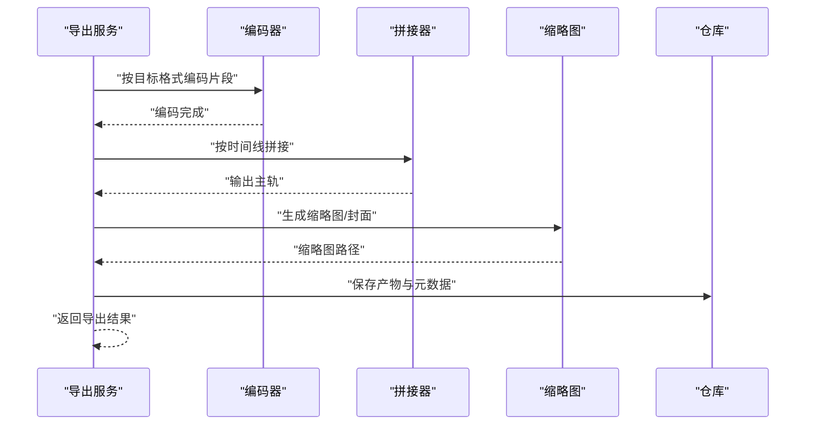

图表来源
- [src/features/render/encode.ts](file://src/features/render/encode.ts)
- [src/features/render/concat.ts](file://src/features/render/concat.ts)
- [src/features/render/export-service.ts](file://src/features/render/export-service.ts)
- [src/features/render/thumbnail.ts](file://src/features/render/thumbnail.ts)
- [src/features/audio/repository.ts](file://src/features/audio/repository.ts)

章节来源
- [src/features/render/encode.ts](file://src/features/render/encode.ts)
- [src/features/render/concat.ts](file://src/features/render/concat.ts)
- [src/features/render/export-service.ts](file://src/features/render/export-service.ts)
- [src/features/render/thumbnail.ts](file://src/features/render/thumbnail.ts)

### 源契约与渲染器
- 源契约：定义媒体源的读取接口（路径、流、元数据）
- 渲染器：驱动整个渲染流程，协调各子任务

章节来源
- [src/features/render/source-contract.ts](file://src/features/render/source-contract.ts)
- [src/features/render/renderer.ts](file://src/features/render/renderer.ts)

### 服务端 TTS 媒体处理
- 媒体处理：封装 TTS 生成的音频片段与中间产物
- 编排：串联 TTS、测量、编码、导出等步骤

章节来源
- [server/src/tts/media.ts](file://server/src/tts/media.ts)
- [server/src/tts/orchestrate.ts](file://server/src/tts/orchestrate.ts)

## 依赖关系分析
- 低耦合：仓库抽象隔离 I/O；源契约统一媒体读取；导出服务聚合编码与拼接
- 内聚性：音频特性模块聚焦领域能力；渲染模块专注媒体处理；TTS 编排负责跨模块协作
- 外部依赖：编码与测量通常依赖底层库（如 FFmpeg），通过适配器或命令调用实现

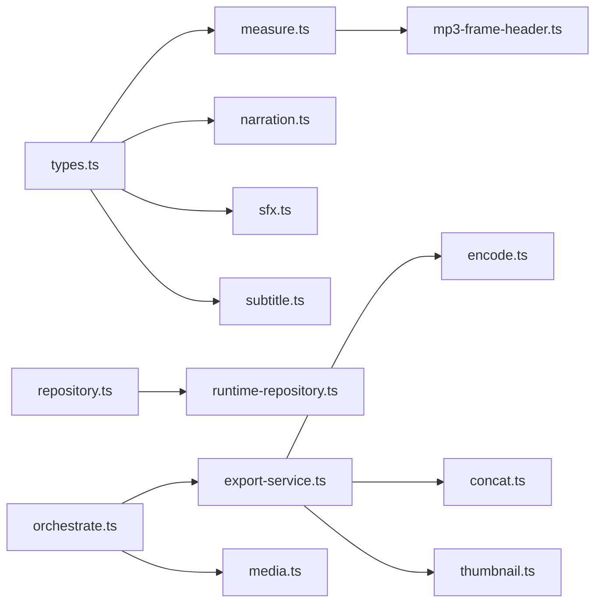

图表来源
- [src/features/audio/types.ts](file://src/features/audio/types.ts)
- [src/features/audio/measure.ts](file://src/features/audio/measure.ts)
- [src/features/audio/mp3-frame-header.ts](file://src/features/audio/mp3-frame-header.ts)
- [src/features/audio/narration.ts](file://src/features/audio/narration.ts)
- [src/features/audio/sfx.ts](file://src/features/audio/sfx.ts)
- [src/features/audio/subtitle.ts](file://src/features/audio/subtitle.ts)
- [src/features/audio/repository.ts](file://src/features/audio/repository.ts)
- [src/features/audio/runtime-repository.ts](file://src/features/audio/runtime-repository.ts)
- [src/features/render/export-service.ts](file://src/features/render/export-service.ts)
- [src/features/render/encode.ts](file://src/features/render/encode.ts)
- [src/features/render/concat.ts](file://src/features/render/concat.ts)
- [src/features/render/thumbnail.ts](file://src/features/render/thumbnail.ts)
- [server/src/tts/orchestrate.ts](file://server/src/tts/orchestrate.ts)
- [server/src/tts/media.ts](file://server/src/tts/media.ts)

章节来源
- [src/features/audio/index.ts](file://src/features/audio/index.ts)
- [src/features/render/export-service.ts](file://src/features/render/export-service.ts)
- [server/src/tts/orchestrate.ts](file://server/src/tts/orchestrate.ts)

## 性能考虑
- 流式处理与分片
  - 使用流式读取与写入，避免一次性加载大文件到内存
  - 对长音频进行分块处理（例如按帧或固定时长分片），降低峰值内存占用
- 并行与批处理
  - 对独立片段进行并行编码与测量，提升吞吐
  - 合并小片段以减少 I/O 次数
- 缓存与复用
  - 对测量结果与中间产物进行缓存，避免重复计算
  - 利用运行时仓库管理短期缓存
- 编码参数调优
  - 根据目标平台选择合适的比特率与采样率
  - 合理设置 AAC/MP3 的码率控制策略（CBR/VBR）
- 资源限制
  - 限制并发任务数，防止 CPU/IO 饱和
  - 监控内存与磁盘空间，及时清理临时文件

[本节为通用指导，不直接分析具体文件]

## 故障排查指南
- 时长不一致
  - 检查容器探测与帧扫描逻辑，确认时间基准一致
  - 对比不同容器的时长差异，必要时以帧计数为准
- 编码失败或音质劣化
  - 验证编码器参数与输入格式兼容性
  - 检查采样率与声道数是否匹配
- 内存溢出
  - 启用流式处理与分片
  - 减少并行度或增大垃圾回收频率
- 元数据缺失或错误
  - 确保写入时正确设置标题、艺术家、专辑等字段
  - 导出后校验元数据完整性
- 时序错位
  - 在导演层进行时间轴校准
  - 使用测量结果修正偏移

章节来源
- [src/features/audio/measure.ts](file://src/features/audio/measure.ts)
- [src/features/audio/mp3-frame-header.ts](file://src/features/audio/mp3-frame-header.ts)
- [src/features/render/encode.ts](file://src/features/render/encode.ts)
- [src/features/director/audio-timing.ts](file://src/features/director/audio-timing.ts)

## 结论
本音频处理管道通过清晰的层次划分与契约抽象，实现了从媒体摄取、测量、合成、编码到导出的完整链路。借助流式处理、分片与缓存策略，能够在保证音质的同时高效处理大文件。建议在生产环境中结合监控与日志，持续优化编码参数与并发策略，以获得更稳定的性能与质量表现。

[本节为总结，不直接分析具体文件]

## 附录
- 术语表
  - 采样率：每秒采样的数量，影响音质与文件大小
  - 比特率：单位时间内编码的数据量，影响音质与体积
  - LUFS：响度标准化单位，用于音量一致性
  - FFT：快速傅里叶变换，用于频谱分析
- 最佳实践清单
  - 始终先探测媒体信息再决定处理策略
  - 对长音频采用分片与流式处理
  - 在导出前进行质量测量与评分
  - 保持元数据一致性与完整性
  - 合理设置并发与缓存策略

[本节为补充信息，不直接分析具体文件]