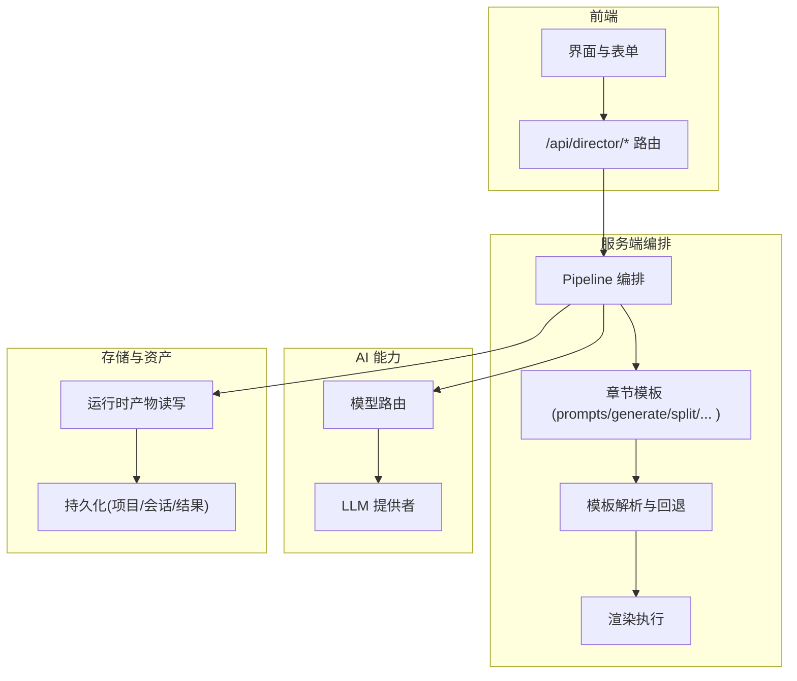
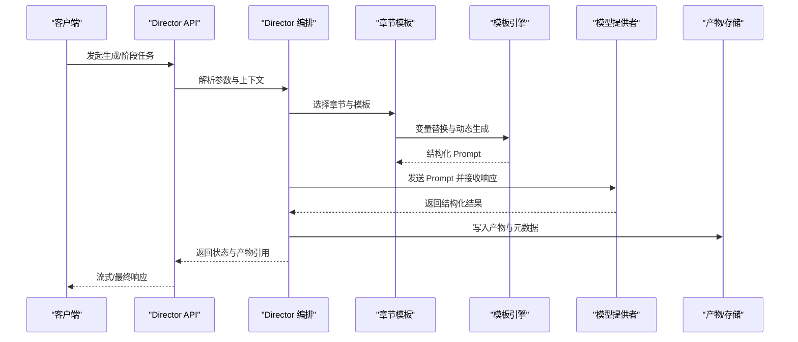
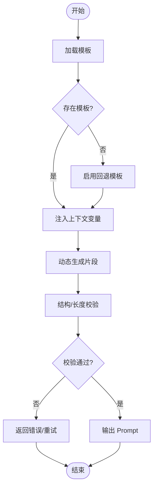
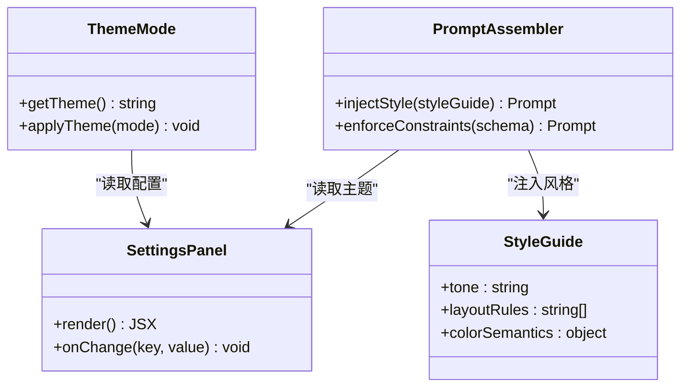
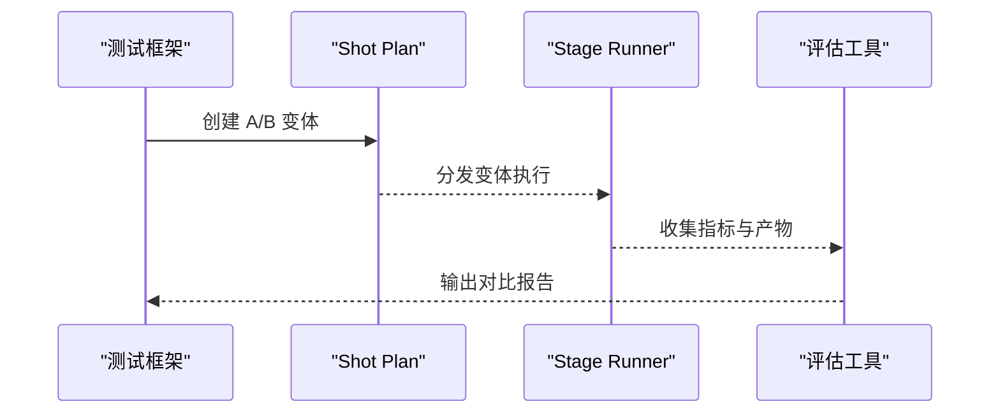
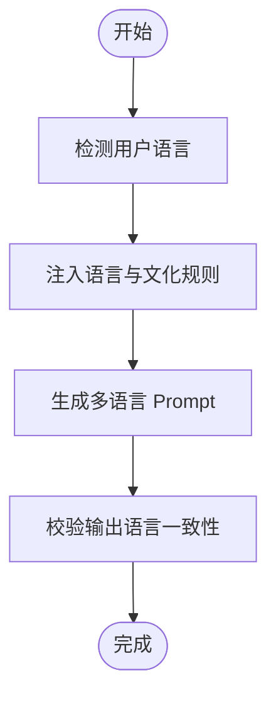
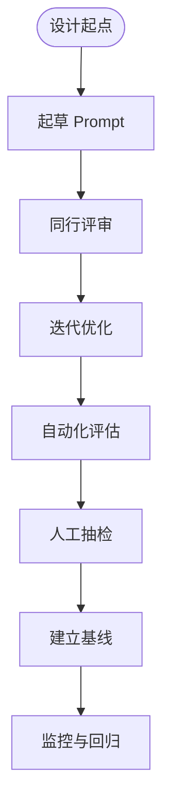
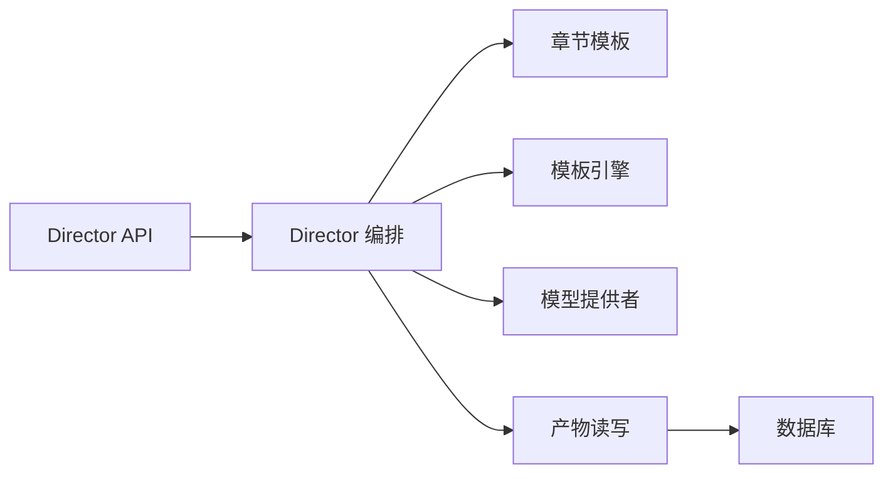

# Prompt 工程系统

<cite>
**本文引用的文件**   
- [server/src/compose/chapters/prompts.ts](file://server/src/compose/chapters/prompts.ts)
- [server/src/compose/chapters/template-fallback.ts](file://server/src/compose/chapters/template-fallback.ts)
- [server/src/compose/chapters/generate.ts](file://server/src/compose/chapters/generate.ts)
- [server/src/compose/chapters/page-cam.ts](file://server/src/compose/chapters/page-cam.ts)
- [server/src/compose/chapters/split.ts](file://server/src/compose/chapters/split.ts)
- [server/src/compose/chapters/validate.ts](file://server/src/compose/chapters/validate.ts)
- [server/src/compose/chapters/root-html.ts](file://server/src/compose/chapters/root-html.ts)
- [server/src/compose/template.ts](file://server/src/compose/template.ts)
- [server/src/compose/model.ts](file://server/src/compose/model.ts)
- [server/src/compose/render.ts](file://server/src/compose/render.ts)
- [server/src/compose/run-pipeline.ts](file://server/src/compose/run-pipeline.ts)
- [server/src/compose/project.ts](file://server/src/compose/project.ts)
- [src/features/director/prompts/assemble.ts](file://src/features/director/prompts/assemble.ts)
- [src/features/director/prompts/direct.ts](file://src/features/director/prompts/direct.ts)
- [src/features/director/prompts/fabricate.ts](file://src/features/director/prompts/fabricate.ts)
- [src/features/director/prompts/finalize.ts](file://src/features/director/prompts/finalize.ts)
- [src/features/director/prompts/ingest.ts](file://src/features/director/prompts/ingest.ts)
- [src/features/director/prompts/prompts.test.ts](file://src/features/director/prompts/prompts.test.ts)
- [src/features/director/prompts/shot-spec.ts](file://src/features/director/prompts/shot-spec.ts)
- [src/features/director/stage-prompt.ts](file://src/features/director/stage-prompt.ts)
- [src/features/director/pi-messages.ts](file://src/features/director/pi-messages.ts)
- [src/features/director/pi-provider.ts](file://src/features/director/pi-provider.ts)
- [src/features/director/pi-session.ts](file://src/features/director/pi-session.ts)
- [src/features/director/pi-tool-adapter.ts](file://src/features/director/pi-tool-adapter.ts)
- [src/features/director/pipeline.ts](file://src/features/director/pipeline.ts)
- [src/features/director/stage-runner.ts](file://src/features/director/stage-runner.ts)
- [src/features/director/runtime-artifact-reader.ts](file://src/features/director/runtime-artifact-reader.ts)
- [src/features/director/runtime-artifact-writer.ts](file://src/features/director/runtime-artifact-writer.ts)
- [src/features/director/runtime-node-data.ts](file://src/features/director/runtime-node-data.ts)
- [src/features/director/stage-result.ts](file://src/features/director/stage-result.ts)
- [src/features/director/stage-effects.ts](file://src/features/director/stage-effects.ts)
- [src/features/director/stage-artifact-gate.ts](file://src/features/director/stage-artifact-gate.ts)
- [src/features/director/advance.ts](file://src/features/director/advance.ts)
- [src/features/director/queue-handler.ts](file://src/features/director/queue-handler.ts)
- [src/features/director/output-recovery.ts](file://src/features/director/output-recovery.ts)
- [src/features/director/audio-timing.ts](file://src/features/director/audio-timing.ts)
- [src/features/director/tools/check-determinism.ts](file://src/features/director/tools/check-determinism.ts)
- [src/features/director/tools/validate-shot-plan.ts](file://src/features/director/tools/validate-shot-plan.ts)
- [src/features/director/tools/write-artifact.ts](file://src/features/director/tools/write-artifact.ts)
- [src/features/director/schemas/director-shot-plan.ts](file://src/features/director/schemas/director-shot-plan.ts)
- [src/features/director/schemas/ingest.ts](file://src/features/director/schemas/ingest.ts)
- [src/features/director/schemas/shot-plan.ts](file://src/features/director/schemas/shot-plan.ts)
- [src/app/api/director/pipeline/route.ts](file://src/app/api/director/pipeline/route.ts)
- [src/app/api/director/stage/route.ts](file://src/app/api/director/stage/route.ts)
- [src/app/api/director/stream/[nodeId]/route.ts](file://src/app/api/director/stream/[nodeId]/route.ts)
- [src/app/api/director/stream/project/[projectId]/route.ts](file://src/app/api/director/stream/project/[projectId]/route.ts)
- [src/app/products/(app)/canvas/[projectId]/canvas-action-api.ts](file://src/app/products/(app)/canvas/[projectId]/canvas-action-api.ts)
- [src/app/products/(app)/export/[projectId]/export-api.ts](file://src/app/products/(app)/export/[projectId]/export-api.ts)
- [src/app/products/(app)/shots/[shotId]/shot-api.ts](file://src/app/products/(app)/shots/[shotId]/shot-api.ts)
- [src/features/ai/config.ts](file://src/features/ai/config.ts)
- [src/features/ai/model-routing.ts](file://src/features/ai/model-routing.ts)
- [src/lib/theme-mode.ts](file://src/lib/theme-mode.ts)
- [src/components/ui/settings-panel.tsx](file://src/components/ui/settings-panel.tsx)
- [src/components/ui/settings-row.tsx](file://src/components/ui/settings-row.tsx)
- [deploy/env.example](file://deploy/env.example)
- [config/tts.env.example](file://config/tts.env.example)
</cite>

## 目录
1. [简介](#简介)
2. [项目结构](#项目结构)
3. [核心组件](#核心组件)
4. [架构总览](#架构总览)
5. [详细组件分析](#详细组件分析)
6. [依赖关系分析](#依赖关系分析)
7. [性能考量](#性能考量)
8. [故障排查指南](#故障排查指南)
9. [结论](#结论)
10. [附录](#附录)

## 简介
本文件为 PurpleInK Prompt 工程系统的权威技术文档，聚焦以下目标：
- 解释 Prompt 模板系统、变量替换与动态生成机制
- 描述风格圣经集成、视觉主题配置与内容约束
- 说明提示词版本管理、A/B 测试与优化策略
- 提供多语言支持、本地化与文化适配方案
- 给出 Prompt 设计指南与效果评估方法

该系统以“导演（Director）”为核心编排器，结合“章节（Chapters）”模板管线，将用户输入、资产与上下文组装为结构化 Prompt，驱动模型生成并产出可渲染的产物。同时通过路由与配置层实现模型选择、主题与风格控制、以及多语言切换。

## 项目结构
- 服务端编排与渲染
  - server/src/compose：章节式模板管线、模板解析、渲染执行、项目与模型配置
- 前端应用与 API
  - src/app/api/director：导演管线与阶段执行的 HTTP 接口
  - src/app/products：产品页面与交互入口（画布、导出、镜头等）
- 功能模块
  - src/features/director：Prompt 装配、阶段运行、工具、结果提交、流式输出
  - src/features/ai：模型路由与配置
  - src/lib/theme-mode：主题模式与样式开关
- 部署与环境
  - deploy/env.example、config/tts.env.example：环境变量示例

**图示来源** 
- [server/src/compose/run-pipeline.ts](file://server/src/compose/run-pipeline.ts)
- [server/src/compose/chapters/prompts.ts](file://server/src/compose/chapters/prompts.ts)
- [server/src/compose/template.ts](file://server/src/compose/template.ts)
- [server/src/compose/render.ts](file://server/src/compose/render.ts)
- [src/features/director/pipeline.ts](file://src/features/director/pipeline.ts)
- [src/features/ai/model-routing.ts](file://src/features/ai/model-routing.ts)

**章节来源**
- [server/src/compose/run-pipeline.ts](file://server/src/compose/run-pipeline.ts)
- [server/src/compose/template.ts](file://server/src/compose/template.ts)
- [server/src/compose/render.ts](file://server/src/compose/render.ts)
- [src/app/api/director/pipeline/route.ts](file://src/app/api/director/pipeline/route.ts)

## 核心组件
- 模板与章节
  - prompts.ts：章节级 Prompt 定义与组合
  - generate.ts：基于上下文的 Prompt 动态生成
  - split.ts：长文本/复杂结构的拆分策略
  - template-fallback.ts：模板缺失时的回退逻辑
  - root-html.ts：根 HTML 模板注入
  - page-cam.ts：页面级采集与快照信息注入
  - validate.ts：Prompt 结构与约束校验
- 模板引擎
  - template.ts：变量替换、占位符解析、模板加载与缓存
- 渲染与执行
  - render.ts：渲染管线执行、产物收集
  - run-pipeline.ts：端到端流水线调度
  - model.ts / project.ts：模型与项目配置
- 导演（Director）
  - assemble.ts：Prompt 装配（上下文、约束、风格）
  - direct.ts：直接调用 LLM
  - fabricate.ts：合成/补全策略
  - finalize.ts：收尾与一致性检查
  - ingest.ts：输入摄取与标准化
  - stage-prompt.ts：阶段级 Prompt 构建
  - pi-messages.ts / pi-provider.ts / pi-session.ts：消息协议、提供者抽象与会话管理
  - pipeline.ts / stage-runner.ts：阶段编排与执行
  - runtime-artifact-reader/writer.ts：产物读写
  - tools/*：确定性检查、计划校验、产物写入等工具
  - schemas/*：计划与输入的结构化 Schema

**章节来源**
- [server/src/compose/chapters/prompts.ts](file://server/src/compose/chapters/prompts.ts)
- [server/src/compose/chapters/generate.ts](file://server/src/compose/chapters/generate.ts)
- [server/src/compose/chapters/split.ts](file://server/src/compose/chapters/split.ts)
- [server/src/compose/chapters/template-fallback.ts](file://server/src/compose/chapters/template-fallback.ts)
- [server/src/compose/chapters/root-html.ts](file://server/src/compose/chapters/root-html.ts)
- [server/src/compose/chapters/page-cam.ts](file://server/src/compose/chapters/page-cam.ts)
- [server/src/compose/chapters/validate.ts](file://server/src/compose/chapters/validate.ts)
- [server/src/compose/template.ts](file://server/src/compose/template.ts)
- [server/src/compose/render.ts](file://server/src/compose/render.ts)
- [server/src/compose/run-pipeline.ts](file://server/src/compose/run-pipeline.ts)
- [server/src/compose/model.ts](file://server/src/compose/model.ts)
- [server/src/compose/project.ts](file://server/src/compose/project.ts)
- [src/features/director/prompts/assemble.ts](file://src/features/director/prompts/assemble.ts)
- [src/features/director/prompts/direct.ts](file://src/features/director/prompts/direct.ts)
- [src/features/director/prompts/fabricate.ts](file://src/features/director/prompts/fabricate.ts)
- [src/features/director/prompts/finalize.ts](file://src/features/director/prompts/finalize.ts)
- [src/features/director/prompts/ingest.ts](file://src/features/director/prompts/ingest.ts)
- [src/features/director/stage-prompt.ts](file://src/features/director/stage-prompt.ts)
- [src/features/director/pi-messages.ts](file://src/features/director/pi-messages.ts)
- [src/features/director/pi-provider.ts](file://src/features/director/pi-provider.ts)
- [src/features/director/pi-session.ts](file://src/features/director/pi-session.ts)
- [src/features/director/pipeline.ts](file://src/features/director/pipeline.ts)
- [src/features/director/stage-runner.ts](file://src/features/director/stage-runner.ts)
- [src/features/director/runtime-artifact-reader.ts](file://src/features/director/runtime-artifact-reader.ts)
- [src/features/director/runtime-artifact-writer.ts](file://src/features/director/runtime-artifact-writer.ts)
- [src/features/director/tools/check-determinism.ts](file://src/features/director/tools/check-determinism.ts)
- [src/features/director/tools/validate-shot-plan.ts](file://src/features/director/tools/validate-shot-plan.ts)
- [src/features/director/tools/write-artifact.ts](file://src/features/director/tools/write-artifact.ts)
- [src/features/director/schemas/director-shot-plan.ts](file://src/features/director/schemas/director-shot-plan.ts)
- [src/features/director/schemas/ingest.ts](file://src/features/director/schemas/ingest.ts)
- [src/features/director/schemas/shot-plan.ts](file://src/features/director/schemas/shot-plan.ts)

## 架构总览
下图展示了从前端请求到 Prompt 生成、模型调用与产物落盘的完整流程，以及模板与变量的装配路径。

**图示来源** 
- [src/app/api/director/pipeline/route.ts](file://src/app/api/director/pipeline/route.ts)
- [src/features/director/pipeline.ts](file://src/features/director/pipeline.ts)
- [server/src/compose/chapters/prompts.ts](file://server/src/compose/chapters/prompts.ts)
- [server/src/compose/template.ts](file://server/src/compose/template.ts)
- [src/features/director/pi-provider.ts](file://src/features/director/pi-provider.ts)
- [src/features/director/runtime-artifact-writer.ts](file://src/features/director/runtime-artifact-writer.ts)

## 详细组件分析

### 模板系统与变量替换
- 模板加载与回退
  - 优先使用指定模板；若缺失则按 fallback 策略降级，确保稳定性
- 变量替换
  - 支持占位符与上下文注入，包括项目配置、页面快照、资产元数据
- 动态生成
  - 根据输入类型与场景自动拼装 Prompt 片段，保证一致性与可维护性
- 校验与约束
  - 对生成的 Prompt 进行结构与长度校验，避免超限或非法结构

**图示来源** 
- [server/src/compose/chapters/template-fallback.ts](file://server/src/compose/chapters/template-fallback.ts)
- [server/src/compose/chapters/generate.ts](file://server/src/compose/chapters/generate.ts)
- [server/src/compose/chapters/validate.ts](file://server/src/compose/chapters/validate.ts)
- [server/src/compose/template.ts](file://server/src/compose/template.ts)

**章节来源**
- [server/src/compose/chapters/template-fallback.ts](file://server/src/compose/chapters/template-fallback.ts)
- [server/src/compose/chapters/generate.ts](file://server/src/compose/chapters/generate.ts)
- [server/src/compose/chapters/validate.ts](file://server/src/compose/chapters/validate.ts)
- [server/src/compose/template.ts](file://server/src/compose/template.ts)

### 风格圣经与视觉主题配置
- 风格圣经
  - 在 Prompt 中嵌入风格规则（如文案语气、排版规范、色彩语义），由 assemble 阶段注入
- 主题配置
  - 通过 theme-mode 与设置面板控制深色/浅色、品牌色与组件样式
- 内容约束
  - 通过 Schema 与校验器限制输出格式、字段范围与长度

**图示来源** 
- [src/lib/theme-mode.ts](file://src/lib/theme-mode.ts)
- [src/components/ui/settings-panel.tsx](file://src/components/ui/settings-panel.tsx)
- [src/components/ui/settings-row.tsx](file://src/components/ui/settings-row.tsx)
- [src/features/director/prompts/assemble.ts](file://src/features/director/prompts/assemble.ts)

**章节来源**
- [src/lib/theme-mode.ts](file://src/lib/theme-mode.ts)
- [src/components/ui/settings-panel.tsx](file://src/components/ui/settings-panel.tsx)
- [src/components/ui/settings-row.tsx](file://src/components/ui/settings-row.tsx)
- [src/features/director/prompts/assemble.ts](file://src/features/director/prompts/assemble.ts)

### 提示词版本管理与 A/B 测试
- 版本管理
  - 通过 schema 与 plan 定义版本标识，变更时保留历史快照，便于回溯与对比
- A/B 测试
  - 在 pipeline 中并行执行不同 Prompt 变体，比较指标（质量、耗时、成本）
- 优化策略
  - 基于 check-determinism 与 validate-shot-plan 工具进行回归与收敛

**图示来源** 
- [src/features/director/schemas/shot-plan.ts](file://src/features/director/schemas/shot-plan.ts)
- [src/features/director/stage-runner.ts](file://src/features/director/stage-runner.ts)
- [src/features/director/tools/check-determinism.ts](file://src/features/director/tools/check-determinism.ts)
- [src/features/director/tools/validate-shot-plan.ts](file://src/features/director/tools/validate-shot-plan.ts)

**章节来源**
- [src/features/director/schemas/shot-plan.ts](file://src/features/director/schemas/shot-plan.ts)
- [src/features/director/stage-runner.ts](file://src/features/director/stage-runner.ts)
- [src/features/director/tools/check-determinism.ts](file://src/features/director/tools/check-determinism.ts)
- [src/features/director/tools/validate-shot-plan.ts](file://src/features/director/tools/validate-shot-plan.ts)

### 多语言支持与本地化
- 语言选择
  - 通过配置与上下文注入目标语言，影响 Prompt 生成与输出
- 文化适配
  - 在 assemble 阶段注入地区化规则（日期、货币、称谓等）
- 资源管理
  - 统一的多语言键值与翻译文件（建议集中管理，按需加载）

**图示来源** 
- [src/features/director/prompts/assemble.ts](file://src/features/director/prompts/assemble.ts)
- [src/features/director/prompts/ingest.ts](file://src/features/director/prompts/ingest.ts)

**章节来源**
- [src/features/director/prompts/assemble.ts](file://src/features/director/prompts/assemble.ts)
- [src/features/director/prompts/ingest.ts](file://src/features/director/prompts/ingest.ts)

### 提示词设计与效果评估
- 设计指南
  - 明确角色、目标、约束与输出格式；保持模块化与可复用
  - 使用 Schema 约束产物结构，减少歧义
- 评估方法
  - 自动化：check-determinism、validate-shot-plan、Vision QA（渲染前后对比）
  - 人工：抽样评审与评分表（相关性、可读性、一致性）
- 持续优化
  - 建立基线与回归测试，记录每次变更的影响

**图示来源** 
- [src/features/director/tools/check-determinism.ts](file://src/features/director/tools/check-determinism.ts)
- [src/features/director/tools/validate-shot-plan.ts](file://src/features/director/tools/validate-shot-plan.ts)
- [src/features/render/vision-qa.ts](file://src/features/render/vision-qa.ts)

**章节来源**
- [src/features/director/tools/check-determinism.ts](file://src/features/director/tools/check-determinism.ts)
- [src/features/director/tools/validate-shot-plan.ts](file://src/features/director/tools/validate-shot-plan.ts)
- [src/features/render/vision-qa.ts](file://src/features/render/vision-qa.ts)

## 依赖关系分析
- 模块耦合
  - Director 编排依赖章节模板与模板引擎；模板引擎依赖上下文与配置
  - 模型路由与提供者解耦，便于扩展新模型
- 外部依赖
  - LLM 提供者、存储后端（产物与数据库）、渲染服务
- 潜在循环依赖
  - 通过分层与接口隔离避免循环；例如 PiProvider 抽象与 StageRunner 职责分离

**图示来源** 
- [src/app/api/director/pipeline/route.ts](file://src/app/api/director/pipeline/route.ts)
- [src/features/director/pipeline.ts](file://src/features/director/pipeline.ts)
- [server/src/compose/chapters/prompts.ts](file://server/src/compose/chapters/prompts.ts)
- [server/src/compose/template.ts](file://server/src/compose/template.ts)
- [src/features/director/runtime-artifact-writer.ts](file://src/features/director/runtime-artifact-writer.ts)

**章节来源**
- [src/app/api/director/pipeline/route.ts](file://src/app/api/director/pipeline/route.ts)
- [src/features/director/pipeline.ts](file://src/features/director/pipeline.ts)
- [server/src/compose/chapters/prompts.ts](file://server/src/compose/chapters/prompts.ts)
- [server/src/compose/template.ts](file://server/src/compose/template.ts)
- [src/features/director/runtime-artifact-writer.ts](file://src/features/director/runtime-artifact-writer.ts)

## 性能考量
- 模板缓存
  - 对常用模板与变量映射进行缓存，减少重复解析开销
- 流式处理
  - 通过流式 API 降低首字节延迟，提升用户体验
- 并发与队列
  - 合理设置并发度与队列容量，避免过载与内存泄漏
- 产物压缩
  - 对大体积产物进行压缩与分片传输

[本节为通用指导，不直接分析具体文件]

## 故障排查指南
- 常见问题
  - 模板缺失：检查 fallback 策略与模板路径
  - 变量未替换：确认上下文注入顺序与键名一致性
  - 模型调用失败：检查凭证、限流与超时配置
  - 产物不一致：使用 check-determinism 定位差异
- 调试步骤
  - 开启详细日志，捕获中间产物与错误堆栈
  - 使用 validate-shot-plan 验证计划合法性
  - 逐步缩小范围至单个章节或阶段

**章节来源**
- [server/src/compose/chapters/template-fallback.ts](file://server/src/compose/chapters/template-fallback.ts)
- [src/features/director/tools/check-determinism.ts](file://src/features/director/tools/check-determinism.ts)
- [src/features/director/tools/validate-shot-plan.ts](file://src/features/director/tools/validate-shot-plan.ts)

## 结论
PurpleInK Prompt 工程系统通过“章节模板 + 模板引擎 + 导演编排”的分层架构，实现了高内聚、低耦合的 Prompt 生成与执行流程。借助 Schema 约束、风格注入与主题配置，系统在一致性、可维护性与用户体验方面具备良好基础。配合版本管理、A/B 测试与评估工具，可实现持续优化与稳定交付。

[本节为总结，不直接分析具体文件]

## 附录
- 环境变量与配置
  - deploy/env.example：服务器与 Worker 环境变量示例
  - config/tts.env.example：TTS 相关配置示例
- 关键 API
  - /api/director/pipeline：启动端到端流水线
  - /api/director/stage：执行单阶段任务
  - /api/director/stream/*：流式输出节点与项目级事件

**章节来源**
- [deploy/env.example](file://deploy/env.example)
- [config/tts.env.example](file://config/tts.env.example)
- [src/app/api/director/pipeline/route.ts](file://src/app/api/director/pipeline/route.ts)
- [src/app/api/director/stage/route.ts](file://src/app/api/director/stage/route.ts)
- [src/app/api/director/stream/[nodeId]/route.ts](file://src/app/api/director/stream/[nodeId]/route.ts)
- [src/app/api/director/stream/project/[projectId]/route.ts](file://src/app/api/director/stream/project/[projectId]/route.ts)