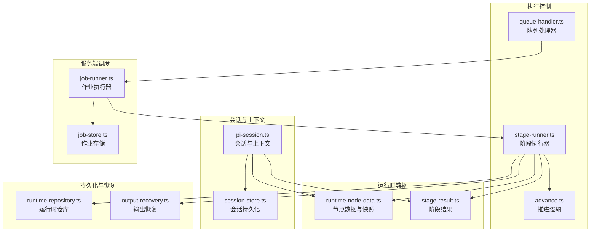
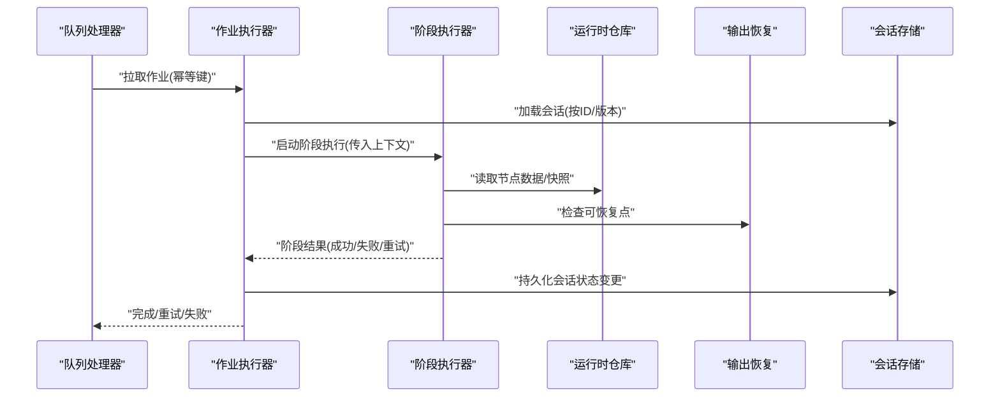
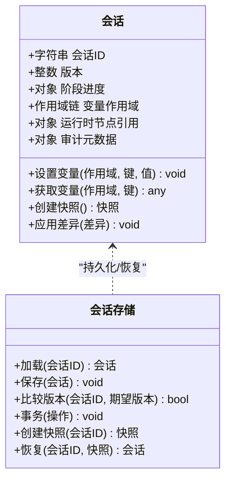
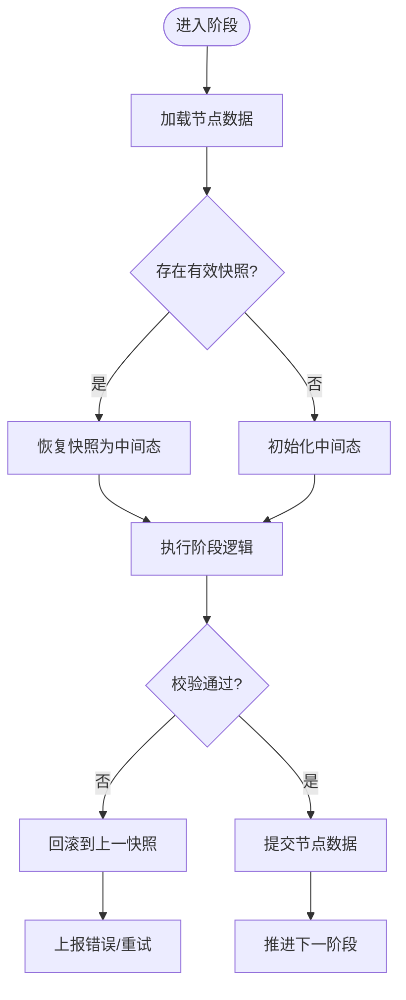
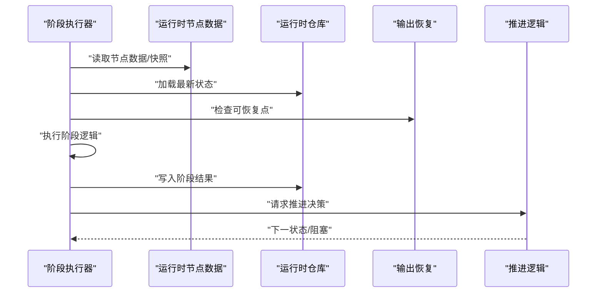
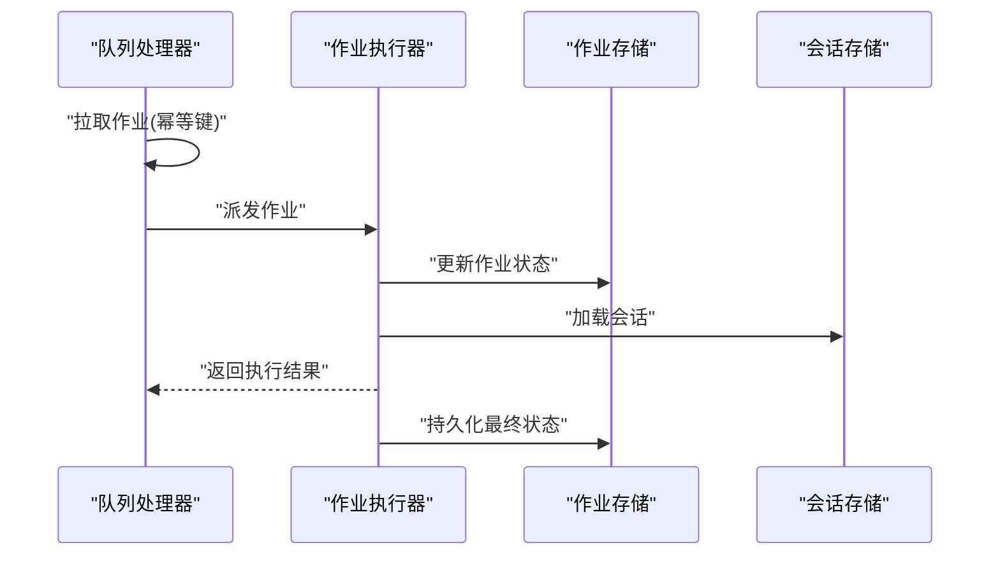
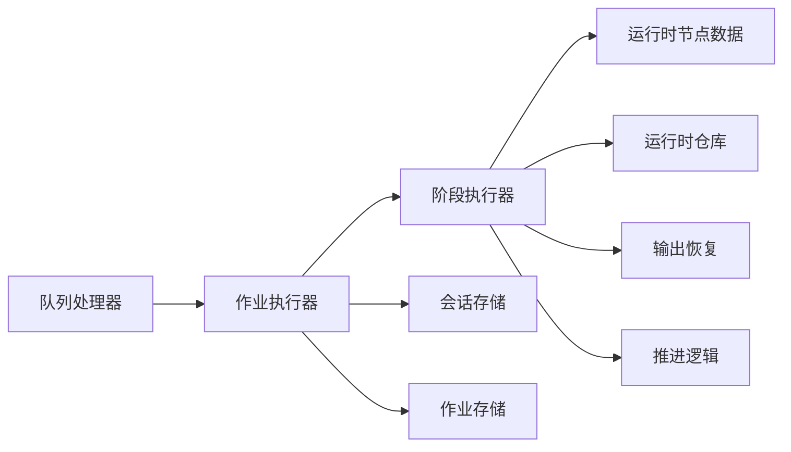

# 会话与上下文管理

<cite>
**本文引用的文件**   
- [pi-session.ts](file://src/features/director/pi-session.ts)
- [session-store.ts](file://src/features/director/session-store.ts)
- [runtime-node-data.ts](file://src/features/director/runtime-node-data.ts)
- [stage-runner.ts](file://src/features/director/stage-runner.ts)
- [advance.ts](file://src/features/director/advance.ts)
- [queue-handler.ts](file://src/features/director/queue-handler.ts)
- [runtime-repository.ts](file://src/features/director/runtime-repository.ts)
- [output-recovery.ts](file://src/features/director/output-recovery.ts)
- [stage-result.ts](file://src/features/director/stage-result.ts)
- [job-runner.ts](file://server/src/server/job-runner.ts)
- [job-store.ts](file://server/src/server/job-store.ts)
</cite>

## 目录
1. [简介](#简介)
2. [项目结构](#项目结构)
3. [核心组件](#核心组件)
4. [架构总览](#架构总览)
5. [详细组件分析](#详细组件分析)
6. [依赖关系分析](#依赖关系分析)
7. [性能考量](#性能考量)
8. [故障排查指南](#故障排查指南)
9. [结论](#结论)
10. [附录](#附录)

## 简介
本文件面向 PurpleInK 的“会话与上下文管理系统”，围绕以下目标展开：
- 会话生命周期：创建、推进、暂停、恢复、终止与清理
- 持久化策略：运行时节点数据、阶段结果、输出恢复的存储与一致性
- 并发访问控制：队列驱动、任务隔离、锁与幂等
- 上下文数据结构：变量作用域、继承机制、节点数据模型
- 运行时节点数据管理：状态快照、增量更新、恢复机制
- 会话隔离与安全边界：多租户/多项目隔离、权限与资源边界
- 内存管理与调试监控：对象生命周期、泄漏防护、指标与日志

## 项目结构
与会话与上下文相关的核心代码集中在 features/director 与服务端 server/src/server 中。关键模块职责如下：
- 会话与上下文
  - pi-session.ts：会话抽象、上下文作用域、变量继承与作用域链
  - session-store.ts：会话持久化与加载（含事务与版本）
- 运行时节点数据
  - runtime-node-data.ts：节点运行期数据模型、快照与差异
  - stage-result.ts：阶段执行结果的结构与校验
- 执行与控制流
  - stage-runner.ts：阶段编排、错误处理、重试与回滚
  - advance.ts：工作流推进逻辑，状态机转换
  - queue-handler.ts：队列消费、并发限制、任务去重
- 持久化与恢复
  - runtime-repository.ts：运行时数据的读写接口
  - output-recovery.ts：失败恢复、断点续跑、一致性保障
- 服务端调度
  - job-runner.ts：作业执行器，协调队列与阶段执行
  - job-store.ts：作业元数据与状态持久化

**图表来源** 
- [pi-session.ts](file://src/features/director/pi-session.ts)
- [session-store.ts](file://src/features/director/session-store.ts)
- [runtime-node-data.ts](file://src/features/director/runtime-node-data.ts)
- [stage-result.ts](file://src/features/director/stage-result.ts)
- [stage-runner.ts](file://src/features/director/stage-runner.ts)
- [advance.ts](file://src/features/director/advance.ts)
- [queue-handler.ts](file://src/features/director/queue-handler.ts)
- [runtime-repository.ts](file://src/features/director/runtime-repository.ts)
- [output-recovery.ts](file://src/features/director/output-recovery.ts)
- [job-runner.ts](file://server/src/server/job-runner.ts)
- [job-store.ts](file://server/src/server/job-store.ts)

**章节来源**
- [pi-session.ts](file://src/features/director/pi-session.ts)
- [session-store.ts](file://src/features/director/session-store.ts)
- [runtime-node-data.ts](file://src/features/director/runtime-node-data.ts)
- [stage-result.ts](file://src/features/director/stage-result.ts)
- [stage-runner.ts](file://src/features/director/stage-runner.ts)
- [advance.ts](file://src/features/director/advance.ts)
- [queue-handler.ts](file://src/features/director/queue-handler.ts)
- [runtime-repository.ts](file://src/features/director/runtime-repository.ts)
- [output-recovery.ts](file://src/features/director/output-recovery.ts)
- [job-runner.ts](file://server/src/server/job-runner.ts)
- [job-store.ts](file://server/src/server/job-store.ts)

## 核心组件
- 会话与会话存储
  - 会话对象封装了当前执行上下文、变量作用域链、阶段进度与元数据；会话存储负责序列化、版本控制与事务提交。
- 运行时节点数据
  - 每个节点在运行期维护输入、中间态、输出与时间戳；支持快照与增量合并，便于恢复与审计。
- 阶段执行器
  - 负责调用具体阶段逻辑、捕获异常、记录结果、触发副作用（如写入产物），并参与回滚与重试。
- 推进逻辑
  - 基于状态机的推进流程，决定下一阶段的准入条件、依赖满足与并行度。
- 队列处理器
  - 从消息队列拉取作业，进行限流、去重、分配执行槽位，保证幂等与顺序性。
- 运行时仓库与输出恢复
  - 提供统一的读写接口，确保跨进程/重启的一致性；输出恢复用于失败后从最近一致点继续。

**章节来源**
- [pi-session.ts](file://src/features/director/pi-session.ts)
- [session-store.ts](file://src/features/director/session-store.ts)
- [runtime-node-data.ts](file://src/features/director/runtime-node-data.ts)
- [stage-runner.ts](file://src/features/director/stage-runner.ts)
- [advance.ts](file://src/features/director/advance.ts)
- [queue-handler.ts](file://src/features/director/queue-handler.ts)
- [runtime-repository.ts](file://src/features/director/runtime-repository.ts)
- [output-recovery.ts](file://src/features/director/output-recovery.ts)

## 架构总览
下图展示了从队列到阶段执行的端到端流程，以及会话与运行时数据的交互。

**图表来源** 
- [queue-handler.ts](file://src/features/director/queue-handler.ts)
- [job-runner.ts](file://server/src/server/job-runner.ts)
- [stage-runner.ts](file://src/features/director/stage-runner.ts)
- [runtime-repository.ts](file://src/features/director/runtime-repository.ts)
- [output-recovery.ts](file://src/features/director/output-recovery.ts)
- [session-store.ts](file://src/features/director/session-store.ts)

## 详细组件分析

### 会话与会话存储
- 会话对象
  - 包含：会话标识、版本、阶段进度、变量作用域链、运行时节点引用、审计元数据。
  - 作用域与继承：支持多层作用域（全局、项目、阶段、节点），变量查找遵循最近优先原则；父作用域的只读变量可在子作用域覆盖或扩展。
- 会话存储
  - 提供加载、保存、版本比较与事务提交；支持乐观锁防止并发覆盖；提供快照与差异合并能力。

**图表来源** 
- [pi-session.ts](file://src/features/director/pi-session.ts)
- [session-store.ts](file://src/features/director/session-store.ts)

**章节来源**
- [pi-session.ts](file://src/features/director/pi-session.ts)
- [session-store.ts](file://src/features/director/session-store.ts)

### 运行时节点数据与快照
- 节点数据模型
  - 字段包括：节点ID、阶段ID、输入、中间态、输出、状态、时间戳、校验哈希。
  - 支持增量更新与快照对比，便于快速定位变更与恢复。
- 快照与恢复
  - 在关键阶段前后生成快照；恢复时选择最近一致点，避免重复计算。

**图表来源** 
- [runtime-node-data.ts](file://src/features/director/runtime-node-data.ts)
- [stage-runner.ts](file://src/features/director/stage-runner.ts)
- [output-recovery.ts](file://src/features/director/output-recovery.ts)

**章节来源**
- [runtime-node-data.ts](file://src/features/director/runtime-node-data.ts)
- [stage-runner.ts](file://src/features/director/stage-runner.ts)
- [output-recovery.ts](file://src/features/director/output-recovery.ts)

### 阶段执行器与推进逻辑
- 阶段执行器
  - 负责调用阶段函数、捕获异常、记录结果、触发副作用（如产物写入）、参与回滚与重试。
  - 支持幂等执行与结果校验，确保多次执行不破坏一致性。
- 推进逻辑
  - 基于状态机判断下一阶段的准入条件（依赖满足、资源可用、配额限制）。
  - 支持并行推进与串行回退，保证整体正确性。

**图表来源** 
- [stage-runner.ts](file://src/features/director/stage-runner.ts)
- [runtime-node-data.ts](file://src/features/director/runtime-node-data.ts)
- [runtime-repository.ts](file://src/features/director/runtime-repository.ts)
- [output-recovery.ts](file://src/features/director/output-recovery.ts)
- [advance.ts](file://src/features/director/advance.ts)

**章节来源**
- [stage-runner.ts](file://src/features/director/stage-runner.ts)
- [advance.ts](file://src/features/director/advance.ts)

### 队列处理器与作业调度
- 队列处理器
  - 拉取作业、去重、限流、分配执行槽位；保证幂等与顺序性。
- 作业执行器
  - 协调会话加载、阶段执行、结果持久化与错误处理。
- 作业存储
  - 持久化作业元数据、状态与审计信息。

**图表来源** 
- [queue-handler.ts](file://src/features/director/queue-handler.ts)
- [job-runner.ts](file://server/src/server/job-runner.ts)
- [job-store.ts](file://server/src/server/job-store.ts)
- [session-store.ts](file://src/features/director/session-store.ts)

**章节来源**
- [queue-handler.ts](file://src/features/director/queue-handler.ts)
- [job-runner.ts](file://server/src/server/job-runner.ts)
- [job-store.ts](file://server/src/server/job-store.ts)

### 阶段结果与一致性
- 阶段结果
  - 定义结果结构、校验规则与错误码；支持部分成功与重试标记。
- 一致性保障
  - 通过事务与版本号确保会话与节点数据的一致性；失败时自动回滚到最近一致点。

**章节来源**
- [stage-result.ts](file://src/features/director/stage-result.ts)
- [runtime-repository.ts](file://src/features/director/runtime-repository.ts)

## 依赖关系分析
- 低耦合高内聚
  - 会话与上下文独立于阶段实现；运行时数据与持久化解耦；队列与执行器通过明确接口协作。
- 直接依赖
  - 阶段执行器依赖运行时数据与仓库；推进逻辑依赖阶段结果与会话状态；队列处理器依赖作业存储与会话存储。
- 潜在循环依赖
  - 通过接口与事件解耦，避免阶段与推进逻辑之间的直接循环。

**图表来源** 
- [queue-handler.ts](file://src/features/director/queue-handler.ts)
- [job-runner.ts](file://server/src/server/job-runner.ts)
- [stage-runner.ts](file://src/features/director/stage-runner.ts)
- [runtime-node-data.ts](file://src/features/director/runtime-node-data.ts)
- [runtime-repository.ts](file://src/features/director/runtime-repository.ts)
- [output-recovery.ts](file://src/features/director/output-recovery.ts)
- [advance.ts](file://src/features/director/advance.ts)
- [session-store.ts](file://src/features/director/session-store.ts)
- [job-store.ts](file://server/src/server/job-store.ts)

**章节来源**
- [queue-handler.ts](file://src/features/director/queue-handler.ts)
- [job-runner.ts](file://server/src/server/job-runner.ts)
- [stage-runner.ts](file://src/features/director/stage-runner.ts)
- [runtime-node-data.ts](file://src/features/director/runtime-node-data.ts)
- [runtime-repository.ts](file://src/features/director/runtime-repository.ts)
- [output-recovery.ts](file://src/features/director/output-recovery.ts)
- [advance.ts](file://src/features/director/advance.ts)
- [session-store.ts](file://src/features/director/session-store.ts)
- [job-store.ts](file://server/src/server/job-store.ts)

## 性能考量
- 并发控制
  - 使用队列限流与执行槽位分配，避免热点节点过载；对长耗时阶段采用异步与批处理。
- 缓存与快照
  - 合理设置快照粒度，减少IO开销；对只读变量与作用域进行缓存以提升查找速度。
- 内存管理
  - 及时释放中间态与大对象；使用对象池与惰性加载降低峰值内存。
- I/O优化
  - 批量写入与事务合并；读写分离与索引优化提升查询性能。

[本节为通用指导，无需特定文件来源]

## 故障排查指南
- 常见问题
  - 会话版本冲突：检查乐观锁与事务提交；确认并发写入是否幂等。
  - 节点数据不一致：核对快照与差异合并逻辑；验证校验哈希。
  - 阶段执行失败：查看阶段结果与错误码；检查输出恢复点是否正确。
  - 队列堆积：调整限流与并发度；检查下游依赖可用性。
- 调试工具
  - 启用详细日志与指标采集；导出会话快照与节点差异；回放失败路径定位问题。
- 恢复策略
  - 从最近一致点恢复；必要时回滚到上一阶段；清理脏数据后重试。

**章节来源**
- [stage-result.ts](file://src/features/director/stage-result.ts)
- [output-recovery.ts](file://src/features/director/output-recovery.ts)
- [runtime-repository.ts](file://src/features/director/runtime-repository.ts)

## 结论
PurpleInK 的会话与上下文管理系统以清晰的会话抽象、严格的运行时数据模型与稳健的持久化恢复机制为核心，结合队列驱动的并发控制与幂等执行，实现了高可靠、可扩展的执行环境。通过作用域与继承机制、快照与差异合并、以及完善的调试与监控手段，系统能够在复杂的多阶段流水线中保持正确性与性能。

[本节为总结性内容，无需特定文件来源]

## 附录
- 术语表
  - 会话：一次执行上下文的完整封装
  - 作用域：变量的可见范围与继承链
  - 快照：关键点的状态备份
  - 幂等：多次执行产生相同结果
- 最佳实践
  - 设计幂等阶段与结果校验
  - 合理使用快照与差异合并
  - 严格控制并发与资源配额
  - 完善日志与指标采集

[本节为补充信息，无需特定文件来源]