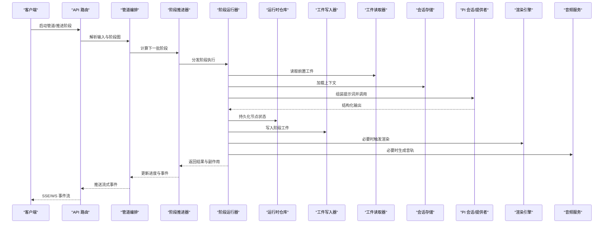
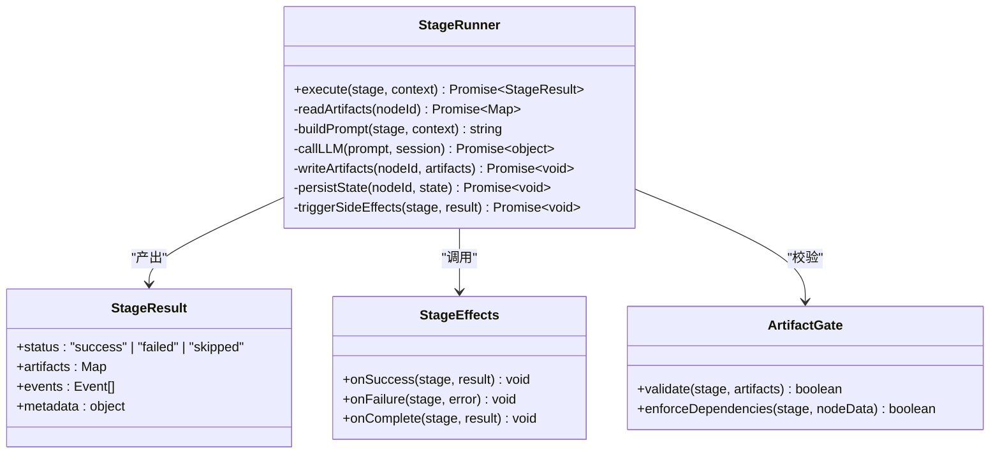
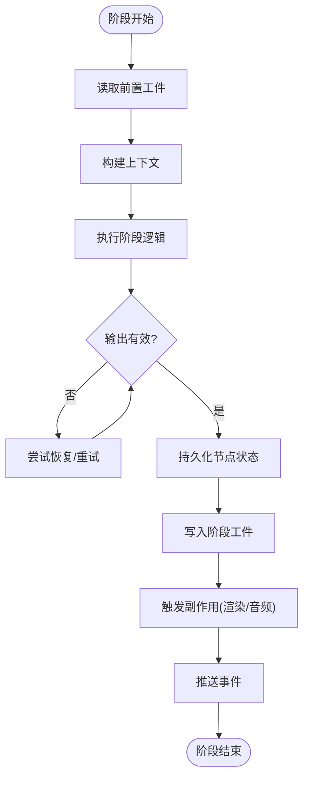
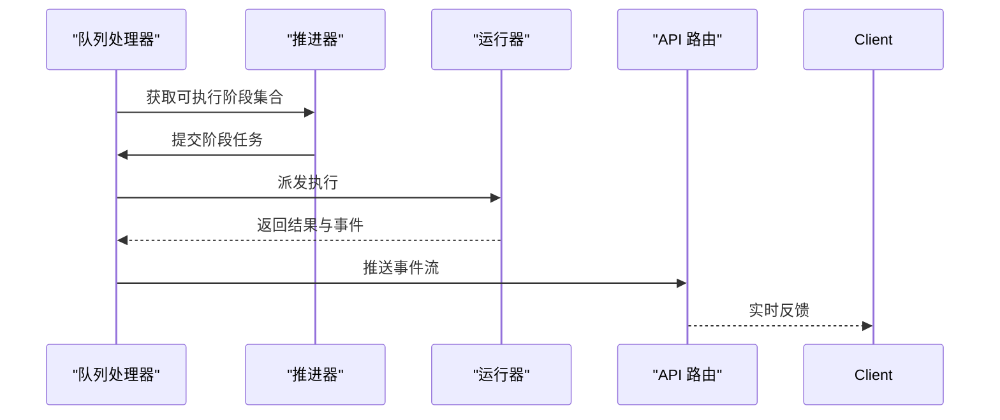
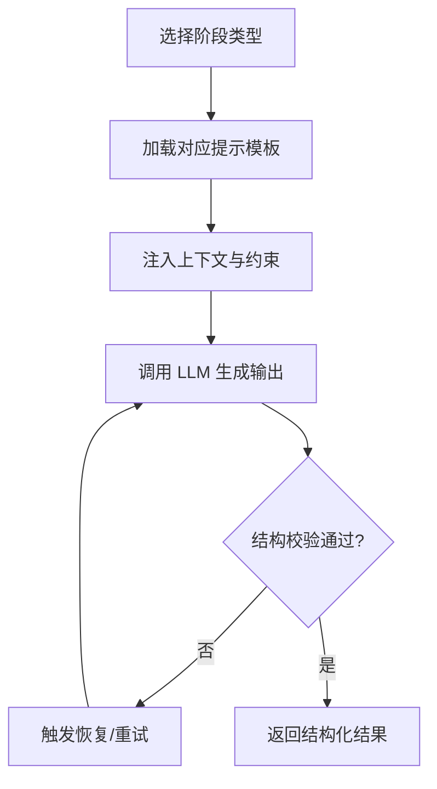
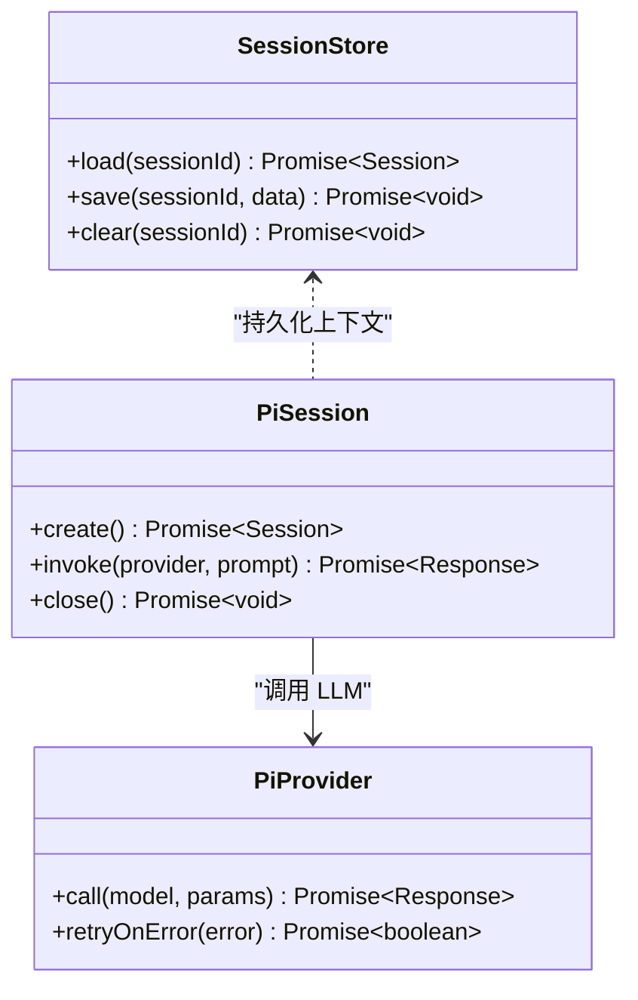
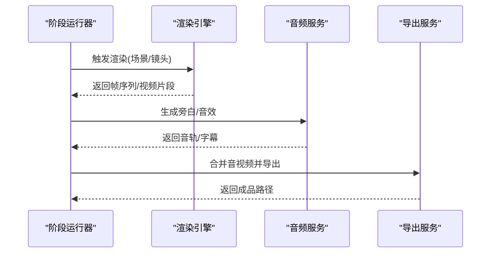
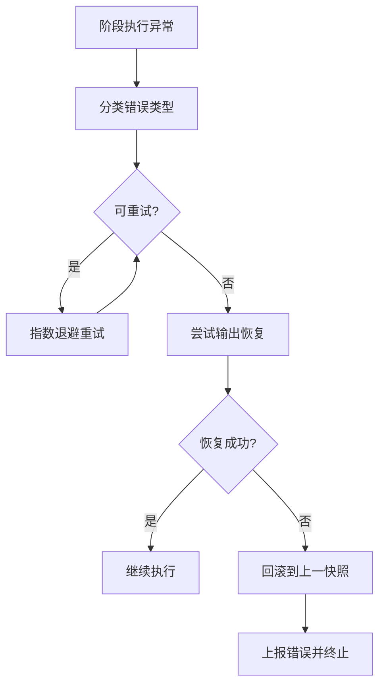
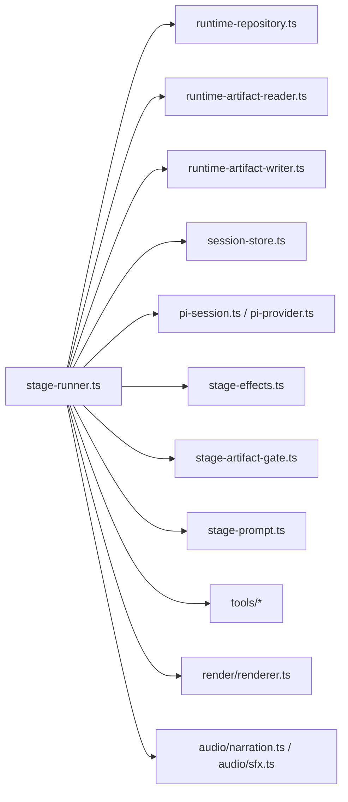

# 导演服务层

<cite>
**本文引用的文件**   
- [src/features/director/index.ts](file://src/features/director/index.ts)
- [src/features/director/pipeline.ts](file://src/features/director/pipeline.ts)
- [src/features/director/advance.ts](file://src/features/director/advance.ts)
- [src/features/director/stage-runner.ts](file://src/features/director/stage-runner.ts)
- [src/features/director/stage-result.ts](file://src/features/director/stage-result.ts)
- [src/features/director/stage-effects.ts](file://src/features/director/stage-effects.ts)
- [src/features/director/stage-artifact-gate.ts](file://src/features/director/stage-artifact-gate.ts)
- [src/features/director/runtime-repository.ts](file://src/features/director/runtime-repository.ts)
- [src/features/director/runtime-node-data.ts](file://src/features/director/runtime-node-data.ts)
- [src/features/director/runtime-artifact-reader.ts](file://src/features/director/runtime-artifact-reader.ts)
- [src/features/director/runtime-artifact-writer.ts](file://src/features/director/runtime-artifact-writer.ts)
- [src/features/director/session-store.ts](file://src/features/director/session-store.ts)
- [src/features/director/pi-session.ts](file://src/features/director/pi-session.ts)
- [src/features/director/pi-provider.ts](file://src/features/director/pi-provider.ts)
- [src/features/director/pi-output.ts](file://src/features/director/pi-output.ts)
- [src/features/director/pi-tool-adapter.ts](file://src/features/director/pi-tool-adapter.ts)
- [src/features/director/stage-prompt.ts](file://src/features/director/stage-prompt.ts)
- [src/features/director/prompts/assemble.ts](file://src/features/director/prompts/assemble.ts)
- [src/features/director/prompts/direct.ts](file://src/features/director/prompts/direct.ts)
- [src/features/director/prompts/fabricate.ts](file://src/features/director/prompts/fabricate.ts)
- [src/features/director/prompts/finalize.ts](file://src/features/director/prompts/finalize.ts)
- [src/features/director/prompts/ingest.ts](file://src/features/director/prompts/ingest.ts)
- [src/features/director/prompts/shot-spec.ts](file://src/features/director/prompts/shot-spec.ts)
- [src/features/director/tools/write-artifact.ts](file://src/features/director/tools/write-artifact.ts)
- [src/features/director/tools/validate-shot-plan.ts](file://src/features/director/tools/validate-shot-plan.ts)
- [src/features/director/tools/check-determinism.ts](file://src/features/director/tools/check-determinism.ts)
- [src/features/director/output-recovery.ts](file://src/features/director/output-recovery.ts)
- [src/features/director/audio-timing.ts](file://src/features/director/audio-timing.ts)
- [src/features/director/queue-handler.ts](file://src/features/director/queue-handler.ts)
- [src/app/api/director/pipeline/route.ts](file://src/app/api/director/pipeline/route.ts)
- [src/app/api/director/stage/route.ts](file://src/app/api/director/stage/route.ts)
- [src/app/api/director/stream/[nodeId]/route.ts](file://src/app/api/director/stream/[nodeId]/route.ts)
- [src/app/api/director/stream/project/[projectId]/route.ts](file://src/app/api/director/stream/project/[projectId]/route.ts)
- [src/features/render/renderer.ts](file://src/features/render/renderer.ts)
- [src/features/render/export-service.ts](file://src/features/render/export-service.ts)
- [src/features/audio/narration.ts](file://src/features/audio/narration.ts)
- [src/features/audio/sfx.ts](file://src/features/audio/sfx.ts)
</cite>

## 目录
1. [简介](#简介)
2. [项目结构](#项目结构)
3. [核心组件](#核心组件)
4. [架构总览](#架构总览)
5. [详细组件分析](#详细组件分析)
6. [依赖关系分析](#依赖关系分析)
7. [性能考量](#性能考量)
8. [故障排查指南](#故障排查指南)
9. [结论](#结论)
10. [附录](#附录)

## 简介
本文件为 PurpleInk 导演服务层的全面技术文档，聚焦工作流编排引擎的设计模式与执行机制。内容涵盖阶段管理、状态持久化、任务调度策略、工具链集成、Prompt 工程与输出验证流程；并详细说明会话管理、上下文传递与数据流转机制；同时给出错误恢复、重试与回滚策略，以及与渲染引擎、音频服务的协作模式。文末提供实际工作流定义示例与自定义阶段开发指南，帮助开发者快速扩展与集成新能力。

## 项目结构
导演服务层位于 features/director 模块中，围绕“阶段（Stage）—运行器（Runner）—工件（Artifact）—会话（Session）—队列（Queue）”的编排模型组织代码。API 路由暴露了管道启动、阶段推进与实时流式事件的能力；渲染与音频作为外部协作者通过接口契约接入。

```mermaid
graph TB
subgraph "API 层"
API_Pipe["pipeline/route.ts"]
API_Stage["stage/route.ts"]
API_StreamNode["stream/[nodeId]/route.ts"]
API_StreamProj["stream/project/[projectId]/route.ts"]
end
subgraph "导演服务层"
Pipeline["pipeline.ts"]
Advance["advance.ts"]
StageRunner["stage-runner.ts"]
StageResult["stage-result.ts"]
StageEffects["stage-effects.ts"]
ArtifactGate["stage-artifact-gate.ts"]
RuntimeRepo["runtime-repository.ts"]
NodeData["runtime-node-data.ts"]
ArtReader["runtime-artifact-reader.ts"]
ArtWriter["runtime-artifact-writer.ts"]
SessionStore["session-store.ts"]
PiSession["pi-session.ts"]
PiProvider["pi-provider.ts"]
PiOutput["pi-output.ts"]
ToolAdapter["pi-tool-adapter.ts"]
StagePrompt["stage-prompt.ts"]
PromptsAssemble["prompts/assemble.ts"]
PromptsDirect["prompts/direct.ts"]
PromptsFabricate["prompts/fabricate.ts"]
PromptsFinalize["prompts/finalize.ts"]
PromptsIngest["prompts/ingest.ts"]
PromptsShotSpec["prompts/shot-spec.ts"]
ToolsWrite["tools/write-artifact.ts"]
ToolsValidate["tools/validate-shot-plan.ts"]
ToolsCheckDet["tools/check-determinism.ts"]
OutputRecovery["output-recovery.ts"]
AudioTiming["audio-timing.ts"]
QueueHandler["queue-handler.ts"]
end
subgraph "外部协作"
Renderer["render/renderer.ts"]
ExportSvc["render/export-service.ts"]
Narration["audio/narration.ts"]
SFX["audio/sfx.ts"]
end
API_Pipe --> Pipeline
API_Stage --> Advance
API_StreamNode --> Advance
API_StreamProj --> Advance
Pipeline --> Advance
Advance --> StageRunner
StageRunner --> StageResult
StageRunner --> StageEffects
StageRunner --> ArtifactGate
StageRunner --> RuntimeRepo
StageRunner --> ArtReader
StageRunner --> ArtWriter
StageRunner --> SessionStore
StageRunner --> PiSession
StageRunner --> PiProvider
StageRunner --> PiOutput
StageRunner --> ToolAdapter
StageRunner --> StagePrompt
StagePrompt --> PromptsAssemble
StagePrompt --> PromptsDirect
StagePrompt --> PromptsFabricate
StagePrompt --> PromptsFinalize
StagePrompt --> PromptsIngest
StagePrompt --> PromptsShotSpec
ToolAdapter --> ToolsWrite
ToolAdapter --> ToolsValidate
ToolAdapter --> ToolsCheckDet
StageRunner --> OutputRecovery
StageRunner --> AudioTiming
StageRunner --> QueueHandler
StageRunner --> Renderer
StageRunner --> ExportSvc
StageRunner --> Narration
StageRunner --> SFX
```

图表来源
- [src/app/api/director/pipeline/route.ts](file://src/app/api/director/pipeline/route.ts)
- [src/app/api/director/stage/route.ts](file://src/app/api/director/stage/route.ts)
- [src/app/api/director/stream/[nodeId]/route.ts](file://src/app/api/director/stream/[nodeId]/route.ts)
- [src/app/api/director/stream/project/[projectId]/route.ts](file://src/app/api/director/stream/project/[projectId]/route.ts)
- [src/features/director/pipeline.ts](file://src/features/director/pipeline.ts)
- [src/features/director/advance.ts](file://src/features/director/advance.ts)
- [src/features/director/stage-runner.ts](file://src/features/director/stage-runner.ts)
- [src/features/director/stage-result.ts](file://src/features/director/stage-result.ts)
- [src/features/director/stage-effects.ts](file://src/features/director/stage-effects.ts)
- [src/features/director/stage-artifact-gate.ts](file://src/features/director/stage-artifact-gate.ts)
- [src/features/director/runtime-repository.ts](file://src/features/director/runtime-repository.ts)
- [src/features/director/runtime-node-data.ts](file://src/features/director/runtime-node-data.ts)
- [src/features/director/runtime-artifact-reader.ts](file://src/features/director/runtime-artifact-reader.ts)
- [src/features/director/runtime-artifact-writer.ts](file://src/features/director/runtime-artifact-writer.ts)
- [src/features/director/session-store.ts](file://src/features/director/session-store.ts)
- [src/features/director/pi-session.ts](file://src/features/director/pi-session.ts)
- [src/features/director/pi-provider.ts](file://src/features/director/pi-provider.ts)
- [src/features/director/pi-output.ts](file://src/features/director/pi-output.ts)
- [src/features/director/pi-tool-adapter.ts](file://src/features/director/pi-tool-adapter.ts)
- [src/features/director/stage-prompt.ts](file://src/features/director/stage-prompt.ts)
- [src/features/director/prompts/assemble.ts](file://src/features/director/prompts/assemble.ts)
- [src/features/director/prompts/direct.ts](file://src/features/director/prompts/direct.ts)
- [src/features/director/prompts/fabricate.ts](file://src/features/director/prompts/fabricate.ts)
- [src/features/director/prompts/finalize.ts](file://src/features/director/prompts/finalize.ts)
- [src/features/director/prompts/ingest.ts](file://src/features/director/prompts/ingest.ts)
- [src/features/director/prompts/shot-spec.ts](file://src/features/director/prompts/shot-spec.ts)
- [src/features/director/tools/write-artifact.ts](file://src/features/director/tools/write-artifact.ts)
- [src/features/director/tools/validate-shot-plan.ts](file://src/features/director/tools/validate-shot-plan.ts)
- [src/features/director/tools/check-determinism.ts](file://src/features/director/tools/check-determinism.ts)
- [src/features/director/output-recovery.ts](file://src/features/director/output-recovery.ts)
- [src/features/director/audio-timing.ts](file://src/features/director/audio-timing.ts)
- [src/features/director/queue-handler.ts](file://src/features/director/queue-handler.ts)
- [src/features/render/renderer.ts](file://src/features/render/renderer.ts)
- [src/features/render/export-service.ts](file://src/features/render/export-service.ts)
- [src/features/audio/narration.ts](file://src/features/audio/narration.ts)
- [src/features/audio/sfx.ts](file://src/features/audio/sfx.ts)

章节来源
- [src/features/director/index.ts](file://src/features/director/index.ts)
- [src/app/api/director/pipeline/route.ts](file://src/app/api/director/pipeline/route.ts)
- [src/app/api/director/stage/route.ts](file://src/app/api/director/stage/route.ts)
- [src/app/api/director/stream/[nodeId]/route.ts](file://src/app/api/director/stream/[nodeId]/route.ts)
- [src/app/api/director/stream/project/[projectId]/route.ts](file://src/app/api/director/stream/project/[projectId]/route.ts)

## 核心组件
- 工作流编排引擎：以“阶段”为基本单元，由运行器驱动执行，结合效果器与工件门控实现幂等与可观测性。
- 状态持久化：运行时节点数据与工件读写分离，通过仓库抽象统一存取，支持跨进程恢复。
- 任务调度：基于队列处理器协调并发与优先级，保证阶段推进的顺序性与稳定性。
- Prompt 工程：按阶段拼装提示词，注入上下文与约束，确保 LLM 输出稳定可控。
- 工具链集成：将写工件、校验计划、确定性检查等工具暴露给阶段执行环境。
- 会话与上下文：会话存储与 PI 会话封装，贯穿请求生命周期，承载中间态与审计信息。
- 输出验证与恢复：对阶段输出进行结构化校验与修复，失败时触发回退或重试。
- 协作服务：与渲染引擎和音频服务通过明确接口交互，完成画面合成与音轨生成。

章节来源
- [src/features/director/pipeline.ts](file://src/features/director/pipeline.ts)
- [src/features/director/advance.ts](file://src/features/director/advance.ts)
- [src/features/director/stage-runner.ts](file://src/features/director/stage-runner.ts)
- [src/features/director/runtime-repository.ts](file://src/features/director/runtime-repository.ts)
- [src/features/director/queue-handler.ts](file://src/features/director/queue-handler.ts)

## 架构总览
导演服务层采用“分层+插件化”的编排架构：API 路由仅负责入站请求与流式响应转发；编排核心在 advance 与 stage-runner 中实现；持久化与工件读写通过仓库与读写器解耦；LLM 调用通过 pi-provider 与 pi-session 统一管理；工具与提示词按阶段装配；渲染与音频作为外部服务被阶段调用。

图表来源
- [src/app/api/director/pipeline/route.ts](file://src/app/api/director/pipeline/route.ts)
- [src/app/api/director/stage/route.ts](file://src/app/api/director/stage/route.ts)
- [src/features/director/pipeline.ts](file://src/features/director/pipeline.ts)
- [src/features/director/advance.ts](file://src/features/director/advance.ts)
- [src/features/director/stage-runner.ts](file://src/features/director/stage-runner.ts)
- [src/features/director/runtime-repository.ts](file://src/features/director/runtime-repository.ts)
- [src/features/director/runtime-artifact-reader.ts](file://src/features/director/runtime-artifact-reader.ts)
- [src/features/director/runtime-artifact-writer.ts](file://src/features/director/runtime-artifact-writer.ts)
- [src/features/director/session-store.ts](file://src/features/director/session-store.ts)
- [src/features/director/pi-session.ts](file://src/features/director/pi-session.ts)
- [src/features/director/pi-provider.ts](file://src/features/director/pi-provider.ts)
- [src/features/render/renderer.ts](file://src/features/render/renderer.ts)
- [src/features/audio/narration.ts](file://src/features/audio/narration.ts)

## 详细组件分析

### 阶段运行器与结果处理
阶段运行器是编排的核心，负责：
- 读取前置工件与上下文
- 构建阶段提示词并调用 LLM
- 执行阶段内工具（写工件、校验、确定性检查）
- 持久化节点状态与工件
- 触发副作用（渲染、音频）
- 产出阶段结果与事件

图表来源
- [src/features/director/stage-runner.ts](file://src/features/director/stage-runner.ts)
- [src/features/director/stage-result.ts](file://src/features/director/stage-result.ts)
- [src/features/director/stage-effects.ts](file://src/features/director/stage-effects.ts)
- [src/features/director/stage-artifact-gate.ts](file://src/features/director/stage-artifact-gate.ts)

章节来源
- [src/features/director/stage-runner.ts](file://src/features/director/stage-runner.ts)
- [src/features/director/stage-result.ts](file://src/features/director/stage-result.ts)
- [src/features/director/stage-effects.ts](file://src/features/director/stage-effects.ts)
- [src/features/director/stage-artifact-gate.ts](file://src/features/director/stage-artifact-gate.ts)

### 状态持久化与工件读写
- 运行时节点数据：记录阶段输入、输出、状态、时间戳与版本，支持断点续跑。
- 工件仓库：抽象读/写路径与命名约定，确保幂等与一致性。
- 会话存储：保存跨阶段的上下文、配置与审计日志。

图表来源
- [src/features/director/runtime-node-data.ts](file://src/features/director/runtime-node-data.ts)
- [src/features/director/runtime-repository.ts](file://src/features/director/runtime-repository.ts)
- [src/features/director/runtime-artifact-reader.ts](file://src/features/director/runtime-artifact-reader.ts)
- [src/features/director/runtime-artifact-writer.ts](file://src/features/director/runtime-artifact-writer.ts)
- [src/features/director/session-store.ts](file://src/features/director/session-store.ts)
- [src/features/director/output-recovery.ts](file://src/features/director/output-recovery.ts)

章节来源
- [src/features/director/runtime-node-data.ts](file://src/features/director/runtime-node-data.ts)
- [src/features/director/runtime-repository.ts](file://src/features/director/runtime-repository.ts)
- [src/features/director/runtime-artifact-reader.ts](file://src/features/director/runtime-artifact-reader.ts)
- [src/features/director/runtime-artifact-writer.ts](file://src/features/director/runtime-artifact-writer.ts)
- [src/features/director/session-store.ts](file://src/features/director/session-store.ts)
- [src/features/director/output-recovery.ts](file://src/features/director/output-recovery.ts)

### 任务调度与队列
- 队列处理器：维护阶段任务队列，控制并发度与优先级，避免资源争用。
- 推进器：根据阶段依赖图计算可执行集合，批量派发至运行器。
- 事件流：通过 API 路由向客户端推送进度、日志与错误事件。

图表来源
- [src/features/director/queue-handler.ts](file://src/features/director/queue-handler.ts)
- [src/features/director/advance.ts](file://src/features/director/advance.ts)
- [src/app/api/director/stream/[nodeId]/route.ts](file://src/app/api/director/stream/[nodeId]/route.ts)
- [src/app/api/director/stream/project/[projectId]/route.ts](file://src/app/api/director/stream/project/[projectId]/route.ts)

章节来源
- [src/features/director/queue-handler.ts](file://src/features/director/queue-handler.ts)
- [src/features/director/advance.ts](file://src/features/director/advance.ts)
- [src/app/api/director/stream/[nodeId]/route.ts](file://src/app/api/director/stream/[nodeId]/route.ts)
- [src/app/api/director/stream/project/[projectId]/route.ts](file://src/app/api/director/stream/project/[projectId]/route.ts)

### Prompt 工程与输出验证
- 阶段提示词：按阶段类型（采集、组装、直接生成、制作、收尾）拼装模板与上下文。
- 输出验证：对 LLM 输出进行结构校验与约束检查，失败时触发恢复策略。
- 工具集成：写工件、校验计划、确定性检查等工具在阶段内可用。

图表来源
- [src/features/director/stage-prompt.ts](file://src/features/director/stage-prompt.ts)
- [src/features/director/prompts/assemble.ts](file://src/features/director/prompts/assemble.ts)
- [src/features/director/prompts/direct.ts](file://src/features/director/prompts/direct.ts)
- [src/features/director/prompts/fabricate.ts](file://src/features/director/prompts/fabricate.ts)
- [src/features/director/prompts/finalize.ts](file://src/features/director/prompts/finalize.ts)
- [src/features/director/prompts/ingest.ts](file://src/features/director/prompts/ingest.ts)
- [src/features/director/prompts/shot-spec.ts](file://src/features/director/prompts/shot-spec.ts)
- [src/features/director/tools/write-artifact.ts](file://src/features/director/tools/write-artifact.ts)
- [src/features/director/tools/validate-shot-plan.ts](file://src/features/director/tools/validate-shot-plan.ts)
- [src/features/director/tools/check-determinism.ts](file://src/features/director/tools/check-determinism.ts)
- [src/features/director/output-recovery.ts](file://src/features/director/output-recovery.ts)

章节来源
- [src/features/director/stage-prompt.ts](file://src/features/director/stage-prompt.ts)
- [src/features/director/prompts/assemble.ts](file://src/features/director/prompts/assemble.ts)
- [src/features/director/prompts/direct.ts](file://src/features/director/prompts/direct.ts)
- [src/features/director/prompts/fabricate.ts](file://src/features/director/prompts/fabricate.ts)
- [src/features/director/prompts/finalize.ts](file://src/features/director/prompts/finalize.ts)
- [src/features/director/prompts/ingest.ts](file://src/features/director/prompts/ingest.ts)
- [src/features/director/prompts/shot-spec.ts](file://src/features/director/prompts/shot-spec.ts)
- [src/features/director/tools/write-artifact.ts](file://src/features/director/tools/write-artifact.ts)
- [src/features/director/tools/validate-shot-plan.ts](file://src/features/director/tools/validate-shot-plan.ts)
- [src/features/director/tools/check-determinism.ts](file://src/features/director/tools/check-determinism.ts)
- [src/features/director/output-recovery.ts](file://src/features/director/output-recovery.ts)

### 会话管理与上下文传递
- 会话存储：持久化会话元数据、配置与审计信息，支持跨阶段共享。
- PI 会话：封装与 LLM 提供者的交互，管理令牌、缓存与限流。
- 上下文传递：阶段间通过工件与节点数据传递，确保幂等与可追溯。

图表来源
- [src/features/director/session-store.ts](file://src/features/director/session-store.ts)
- [src/features/director/pi-session.ts](file://src/features/director/pi-session.ts)
- [src/features/director/pi-provider.ts](file://src/features/director/pi-provider.ts)

章节来源
- [src/features/director/session-store.ts](file://src/features/director/session-store.ts)
- [src/features/director/pi-session.ts](file://src/features/director/pi-session.ts)
- [src/features/director/pi-provider.ts](file://src/features/director/pi-provider.ts)

### 与渲染引擎与音频服务的协作
- 渲染引擎：阶段完成后触发帧捕获、序列合成与缩略图生成。
- 音频服务：根据脚本生成旁白与音效，并进行时长对齐与混音。
- 导出服务：将最终产物打包导出，支持多种格式与分辨率。

图表来源
- [src/features/render/renderer.ts](file://src/features/render/renderer.ts)
- [src/features/render/export-service.ts](file://src/features/render/export-service.ts)
- [src/features/audio/narration.ts](file://src/features/audio/narration.ts)
- [src/features/audio/sfx.ts](file://src/features/audio/sfx.ts)
- [src/features/director/audio-timing.ts](file://src/features/director/audio-timing.ts)

章节来源
- [src/features/render/renderer.ts](file://src/features/render/renderer.ts)
- [src/features/render/export-service.ts](file://src/features/render/export-service.ts)
- [src/features/audio/narration.ts](file://src/features/audio/narration.ts)
- [src/features/audio/sfx.ts](file://src/features/audio/sfx.ts)
- [src/features/director/audio-timing.ts](file://src/features/director/audio-timing.ts)

### 错误恢复、重试与回滚
- 输出恢复：对失败输出进行修复或降级，确保阶段可继续。
- 重试策略：按错误类型与次数限制进行指数退避重试。
- 回滚机制：在关键步骤失败时回写上一快照状态，保证一致性。

图表来源
- [src/features/director/output-recovery.ts](file://src/features/director/output-recovery.ts)
- [src/features/director/stage-runner.ts](file://src/features/director/stage-runner.ts)

章节来源
- [src/features/director/output-recovery.ts](file://src/features/director/output-recovery.ts)
- [src/features/director/stage-runner.ts](file://src/features/director/stage-runner.ts)

## 依赖关系分析
- 低耦合：阶段运行器通过接口与仓库、会话、LLM 提供者解耦，便于替换与测试。
- 高内聚：提示词、工具与校验逻辑集中在各自模块，职责清晰。
- 外部依赖：渲染与音频服务通过明确契约接入，避免强耦合。

图表来源
- [src/features/director/stage-runner.ts](file://src/features/director/stage-runner.ts)
- [src/features/director/runtime-repository.ts](file://src/features/director/runtime-repository.ts)
- [src/features/director/runtime-artifact-reader.ts](file://src/features/director/runtime-artifact-reader.ts)
- [src/features/director/runtime-artifact-writer.ts](file://src/features/director/runtime-artifact-writer.ts)
- [src/features/director/session-store.ts](file://src/features/director/session-store.ts)
- [src/features/director/pi-session.ts](file://src/features/director/pi-session.ts)
- [src/features/director/pi-provider.ts](file://src/features/director/pi-provider.ts)
- [src/features/director/stage-effects.ts](file://src/features/director/stage-effects.ts)
- [src/features/director/stage-artifact-gate.ts](file://src/features/director/stage-artifact-gate.ts)
- [src/features/director/stage-prompt.ts](file://src/features/director/stage-prompt.ts)
- [src/features/director/tools/write-artifact.ts](file://src/features/director/tools/write-artifact.ts)
- [src/features/director/tools/validate-shot-plan.ts](file://src/features/director/tools/validate-shot-plan.ts)
- [src/features/director/tools/check-determinism.ts](file://src/features/director/tools/check-determinism.ts)
- [src/features/render/renderer.ts](file://src/features/render/renderer.ts)
- [src/features/audio/narration.ts](file://src/features/audio/narration.ts)
- [src/features/audio/sfx.ts](file://src/features/audio/sfx.ts)

章节来源
- [src/features/director/stage-runner.ts](file://src/features/director/stage-runner.ts)
- [src/features/director/runtime-repository.ts](file://src/features/director/runtime-repository.ts)
- [src/features/director/runtime-artifact-reader.ts](file://src/features/director/runtime-artifact-reader.ts)
- [src/features/director/runtime-artifact-writer.ts](file://src/features/director/runtime-artifact-writer.ts)
- [src/features/director/session-store.ts](file://src/features/director/session-store.ts)
- [src/features/director/pi-session.ts](file://src/features/director/pi-session.ts)
- [src/features/director/pi-provider.ts](file://src/features/director/pi-provider.ts)
- [src/features/director/stage-effects.ts](file://src/features/director/stage-effects.ts)
- [src/features/director/stage-artifact-gate.ts](file://src/features/director/stage-artifact-gate.ts)
- [src/features/director/stage-prompt.ts](file://src/features/director/stage-prompt.ts)
- [src/features/director/tools/write-artifact.ts](file://src/features/director/tools/write-artifact.ts)
- [src/features/director/tools/validate-shot-plan.ts](file://src/features/director/tools/validate-shot-plan.ts)
- [src/features/director/tools/check-determinism.ts](file://src/features/director/tools/check-determinism.ts)
- [src/features/render/renderer.ts](file://src/features/render/renderer.ts)
- [src/features/audio/narration.ts](file://src/features/audio/narration.ts)
- [src/features/audio/sfx.ts](file://src/features/audio/sfx.ts)

## 性能考量
- 并发控制：队列处理器限制阶段并发度，避免 I/O 与 LLM 调用过载。
- 幂等设计：工件写入与状态持久化具备幂等性，支持断点续跑与重复执行。
- 缓存与复用：会话与工件缓存减少重复计算与网络开销。
- 流式输出：通过事件流降低前端等待时间，提升用户体验。
- 资源隔离：渲染与音频任务独立调度，避免阻塞主流程。

[本节为通用指导，不直接分析具体文件]

## 故障排查指南
- 常见问题定位：
  - 阶段失败：查看阶段结果与事件日志，确认工件完整性与校验结果。
  - LLM 调用失败：检查会话令牌、限流与重试策略。
  - 渲染/音频异常：核对输入参数与依赖工件路径。
- 调试建议：
  - 启用详细日志与追踪 ID，关联请求与阶段执行。
  - 使用确定性检查工具验证输出一致性。
  - 通过恢复策略与回滚快照快速定位问题根因。

章节来源
- [src/features/director/stage-result.ts](file://src/features/director/stage-result.ts)
- [src/features/director/output-recovery.ts](file://src/features/director/output-recovery.ts)
- [src/features/director/tools/check-determinism.ts](file://src/features/director/tools/check-determinism.ts)

## 结论
PurpleInk 导演服务层以阶段为核心，结合运行器、仓库与会话管理，构建了可扩展、可恢复、可观测的工作流编排引擎。通过 Prompt 工程与工具链集成，实现了稳定的 LLM 输出与丰富的阶段能力；借助与渲染与音频服务的协作，完成了从素材到成品的全流程自动化。开发者可基于现有接口与模式快速扩展新阶段与工具，满足多样化创作需求。

[本节为总结性内容，不直接分析具体文件]

## 附录

### 实际工作流定义示例
- 典型阶段序列：采集 → 组装 → 直接生成 → 制作 → 收尾
- 阶段依赖：每个阶段声明输入工件与输出工件，推进器据此计算可执行集合
- 事件订阅：客户端订阅节点级与项目级事件，实时反馈进度与错误

章节来源
- [src/features/director/prompts/ingest.ts](file://src/features/director/prompts/ingest.ts)
- [src/features/director/prompts/assemble.ts](file://src/features/director/prompts/assemble.ts)
- [src/features/director/prompts/direct.ts](file://src/features/director/prompts/direct.ts)
- [src/features/director/prompts/fabricate.ts](file://src/features/director/prompts/fabricate.ts)
- [src/features/director/prompts/finalize.ts](file://src/features/director/prompts/finalize.ts)
- [src/features/director/advance.ts](file://src/features/director/advance.ts)
- [src/app/api/director/stream/project/[projectId]/route.ts](file://src/app/api/director/stream/project/[projectId]/route.ts)

### 自定义阶段开发指南
- 定义阶段元数据：名称、描述、输入/输出工件、依赖关系
- 实现阶段逻辑：读取工件、构建提示词、调用 LLM、写入工件
- 注册效果器：成功/失败/完成回调，触发渲染或音频任务
- 添加工具：在阶段内暴露写工件、校验与确定性检查工具
- 编写测试：覆盖正常路径、异常恢复与边界条件

章节来源
- [src/features/director/stage-runner.ts](file://src/features/director/stage-runner.ts)
- [src/features/director/stage-effects.ts](file://src/features/director/stage-effects.ts)
- [src/features/director/tools/write-artifact.ts](file://src/features/director/tools/write-artifact.ts)
- [src/features/director/tools/validate-shot-plan.ts](file://src/features/director/tools/validate-shot-plan.ts)
- [src/features/director/tools/check-determinism.ts](file://src/features/director/tools/check-determinism.ts)