# 工作流编排引擎

<cite>
**本文引用的文件**   
- [server/src/index.ts](file://server/src/index.ts)
- [server/src/server/job-runner.ts](file://server/src/server/job-runner.ts)
- [server/src/server/job-store.ts](file://server/src/server/job-store.ts)
- [src/features/director/pipeline.ts](file://src/features/director/pipeline.ts)
- [src/features/director/stage-runner.ts](file://src/features/director/stage-runner.ts)
- [src/features/director/runtime-repository.ts](file://src/features/director/runtime-repository.ts)
- [src/features/director/session-store.ts](file://src/features/director/session-store.ts)
- [src/features/director/types.ts](file://src/features/director/types.ts)
- [src/features/director/advance.ts](file://src/features/director/advance.ts)
- [src/features/director/pi-provider.ts](file://src/features/director/pi-provider.ts)
- [src/features/director/stage-effects.ts](file://src/features/director/stage-effects.ts)
- [src/features/director/stage-result.ts](file://src/features/director/stage-result.ts)
- [src/features/director/runtime-artifact-writer.ts](file://src/features/director/runtime-artifact-writer.ts)
- [src/features/director/runtime-artifact-reader.ts](file://src/features/director/runtime-artifact-reader.ts)
- [src/features/director/runtime-node-data.ts](file://src/features/director/runtime-node-data.ts)
- [src/features/director/stage-prompt.ts](file://src/features/director/stage-prompt.ts)
- [src/features/director/stage-artifact-gate.ts](file://src/features/director/stage-artifact-gate.ts)
- [src/features/render/renderer.ts](file://src/features/render/renderer.ts)
- [src/features/render/export-service.ts](file://src/features/render/export-service.ts)
- [src/app/api/director/pipeline/route.ts](file://src/app/api/director/pipeline/route.ts)
- [src/app/api/director/stage/route.ts](file://src/app/api/director/stage/route.ts)
- [src/app/api/director/stream/[nodeId]/route.ts](file://src/app/api/director/stream/[nodeId]/route.ts)
</cite>

## 目录
1. [简介](#简介)
2. [项目结构](#项目结构)
3. [核心组件](#核心组件)
4. [架构总览](#架构总览)
5. [详细组件分析](#详细组件分析)
6. [依赖关系分析](#依赖关系分析)
7. [性能考量](#性能考量)
8. [故障排查指南](#故障排查指南)
9. [结论](#结论)
10. [附录](#附录)

## 简介
本文件为 PurpleInk 工作流编排引擎的权威技术文档，面向开发者与集成方，系统性阐述工作流定义格式、阶段依赖关系与执行顺序控制；深入解析管道构建器模式、阶段注册机制与动态工作流生成；说明执行上下文管理、数据传递协议与状态同步机制；覆盖模板系统、条件分支处理与并行执行策略；并提供设计最佳实践与性能优化建议。

## 项目结构
PurpleInk 的工作流编排能力由“服务端调度层 + 导演编排层 + 渲染服务层”构成：
- 服务端调度层：负责作业生命周期、持久化与队列消费（job-runner、job-store）。
- 导演编排层：负责工作流图构建、阶段运行、结果提交、产物读写与会话状态管理（pipeline、stage-runner、runtime-*、session-store）。
- 渲染服务层：负责媒体渲染、导出与缓存等（renderer、export-service）。

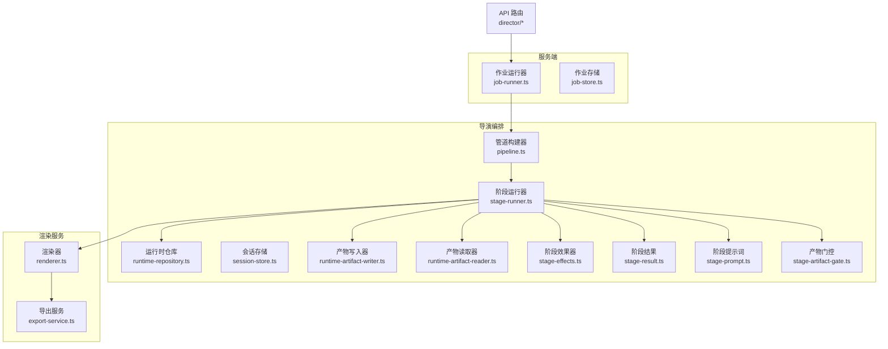

图表来源 
- [server/src/server/job-runner.ts](file://server/src/server/job-runner.ts)
- [server/src/server/job-store.ts](file://server/src/server/job-store.ts)
- [src/features/director/pipeline.ts](file://src/features/director/pipeline.ts)
- [src/features/director/stage-runner.ts](file://src/features/director/stage-runner.ts)
- [src/features/director/runtime-repository.ts](file://src/features/director/runtime-repository.ts)
- [src/features/director/session-store.ts](file://src/features/director/session-store.ts)
- [src/features/director/runtime-artifact-writer.ts](file://src/features/director/runtime-artifact-writer.ts)
- [src/features/director/runtime-artifact-reader.ts](file://src/features/director/runtime-artifact-reader.ts)
- [src/features/director/stage-effects.ts](file://src/features/director/stage-effects.ts)
- [src/features/director/stage-result.ts](file://src/features/director/stage-result.ts)
- [src/features/director/stage-prompt.ts](file://src/features/director/stage-prompt.ts)
- [src/features/director/stage-artifact-gate.ts](file://src/features/director/stage-artifact-gate.ts)
- [src/features/render/renderer.ts](file://src/features/render/renderer.ts)
- [src/features/render/export-service.ts](file://src/features/render/export-service.ts)

章节来源
- [server/src/index.ts](file://server/src/index.ts)
- [server/src/server/job-runner.ts](file://server/src/server/job-runner.ts)
- [server/src/server/job-store.ts](file://server/src/server/job-store.ts)
- [src/features/director/pipeline.ts](file://src/features/director/pipeline.ts)
- [src/features/director/stage-runner.ts](file://src/features/director/stage-runner.ts)
- [src/features/director/runtime-repository.ts](file://src/features/director/runtime-repository.ts)
- [src/features/director/session-store.ts](file://src/features/director/session-store.ts)
- [src/features/director/types.ts](file://src/features/director/types.ts)
- [src/features/director/advance.ts](file://src/features/director/advance.ts)
- [src/features/director/pi-provider.ts](file://src/features/director/pi-provider.ts)
- [src/features/director/stage-effects.ts](file://src/features/director/stage-effects.ts)
- [src/features/director/stage-result.ts](file://src/features/director/stage-result.ts)
- [src/features/director/runtime-artifact-writer.ts](file://src/features/director/runtime-artifact-writer.ts)
- [src/features/director/runtime-artifact-reader.ts](file://src/features/director/runtime-artifact-reader.ts)
- [src/features/director/runtime-node-data.ts](file://src/features/director/runtime-node-data.ts)
- [src/features/director/stage-prompt.ts](file://src/features/director/stage-prompt.ts)
- [src/features/director/stage-artifact-gate.ts](file://src/features/director/stage-artifact-gate.ts)
- [src/features/render/renderer.ts](file://src/features/render/renderer.ts)
- [src/features/render/export-service.ts](file://src/features/render/export-service.ts)
- [src/app/api/director/pipeline/route.ts](file://src/app/api/director/pipeline/route.ts)
- [src/app/api/director/stage/route.ts](file://src/app/api/director/stage/route.ts)
- [src/app/api/director/stream/[nodeId]/route.ts](file://src/app/api/director/stream/[nodeId]/route.ts)

## 核心组件
- 作业运行器（Job Runner）：从队列拉取作业，维护执行上下文，协调阶段执行与状态推进。
- 管道构建器（Pipeline Builder）：声明式构建工作流图，支持阶段注册、依赖注入与拓扑排序。
- 阶段运行器（Stage Runner）：按依赖顺序调度阶段，管理输入输出、副作用、重试与错误恢复。
- 运行时仓库（Runtime Repository）：统一存取阶段中间态、产物元数据与执行进度。
- 会话存储（Session Store）：跨阶段共享上下文（如用户配置、模型凭据、临时变量）。
- 产物读写器（Artifact I/O）：标准化阶段产物的序列化、落盘与读取。
- 阶段效果器（Stage Effects）：在阶段前后插入钩子（日志、指标、审计）。
- 阶段结果（Stage Result）：结构化表达成功/失败/跳过状态及诊断信息。
- 阶段提示词（Stage Prompt）：将 LLM 或外部工具调用封装为可编排的阶段。
- 产物门控（Artifact Gate）：基于前置产物存在性进行条件分支与短路。
- 渲染与导出（Renderer & Export）：媒体渲染管线与导出任务编排。

章节来源
- [src/features/director/types.ts](file://src/features/director/types.ts)
- [src/features/director/pipeline.ts](file://src/features/director/pipeline.ts)
- [src/features/director/stage-runner.ts](file://src/features/director/stage-runner.ts)
- [src/features/director/runtime-repository.ts](file://src/features/director/runtime-repository.ts)
- [src/features/director/session-store.ts](file://src/features/director/session-store.ts)
- [src/features/director/runtime-artifact-writer.ts](file://src/features/director/runtime-artifact-writer.ts)
- [src/features/director/runtime-artifact-reader.ts](file://src/features/director/runtime-artifact-reader.ts)
- [src/features/director/stage-effects.ts](file://src/features/director/stage-effects.ts)
- [src/features/director/stage-result.ts](file://src/features/director/stage-result.ts)
- [src/features/director/stage-prompt.ts](file://src/features/director/stage-prompt.ts)
- [src/features/director/stage-artifact-gate.ts](file://src/features/director/stage-artifact-gate.ts)
- [src/features/render/renderer.ts](file://src/features/render/renderer.ts)
- [src/features/render/export-service.ts](file://src/features/render/export-service.ts)

## 架构总览
下图展示从 HTTP 请求到阶段执行的端到端流程，以及关键组件间的交互。

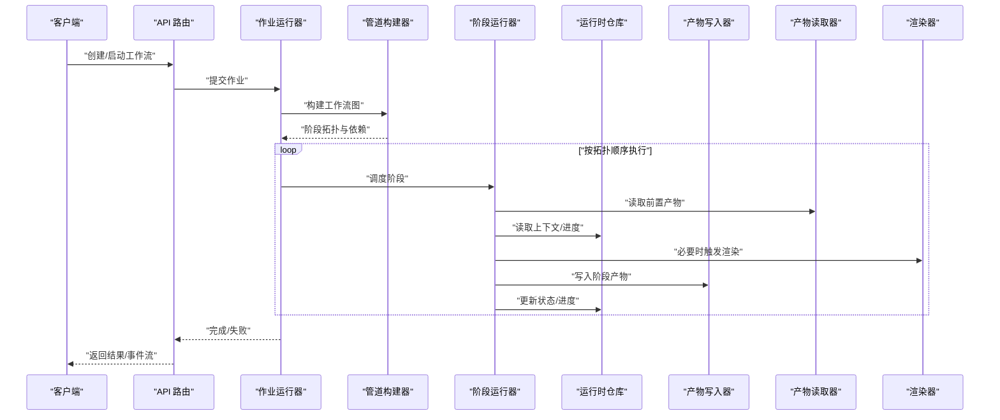

图表来源 
- [src/app/api/director/pipeline/route.ts](file://src/app/api/director/pipeline/route.ts)
- [server/src/server/job-runner.ts](file://server/src/server/job-runner.ts)
- [src/features/director/pipeline.ts](file://src/features/director/pipeline.ts)
- [src/features/director/stage-runner.ts](file://src/features/director/stage-runner.ts)
- [src/features/director/runtime-repository.ts](file://src/features/director/runtime-repository.ts)
- [src/features/director/runtime-artifact-writer.ts](file://src/features/director/runtime-artifact-writer.ts)
- [src/features/director/runtime-artifact-reader.ts](file://src/features/director/runtime-artifact-reader.ts)
- [src/features/render/renderer.ts](file://src/features/render/renderer.ts)

## 详细组件分析

### 管道构建器与阶段注册机制
- 构建器职责：接收阶段定义（名称、输入/输出契约、依赖边），生成有向无环图（DAG），并输出可执行拓扑序列。
- 阶段注册：通过集中式注册表声明阶段类型与工厂函数，支持动态加载与版本兼容。
- 依赖解析：基于入度/出度计算拓扑序，确保无环且满足最小等待时间。
- 动态生成：根据运行时参数（如项目配置、用户选择）动态增删节点与边，实现“同一模板，多实例”。

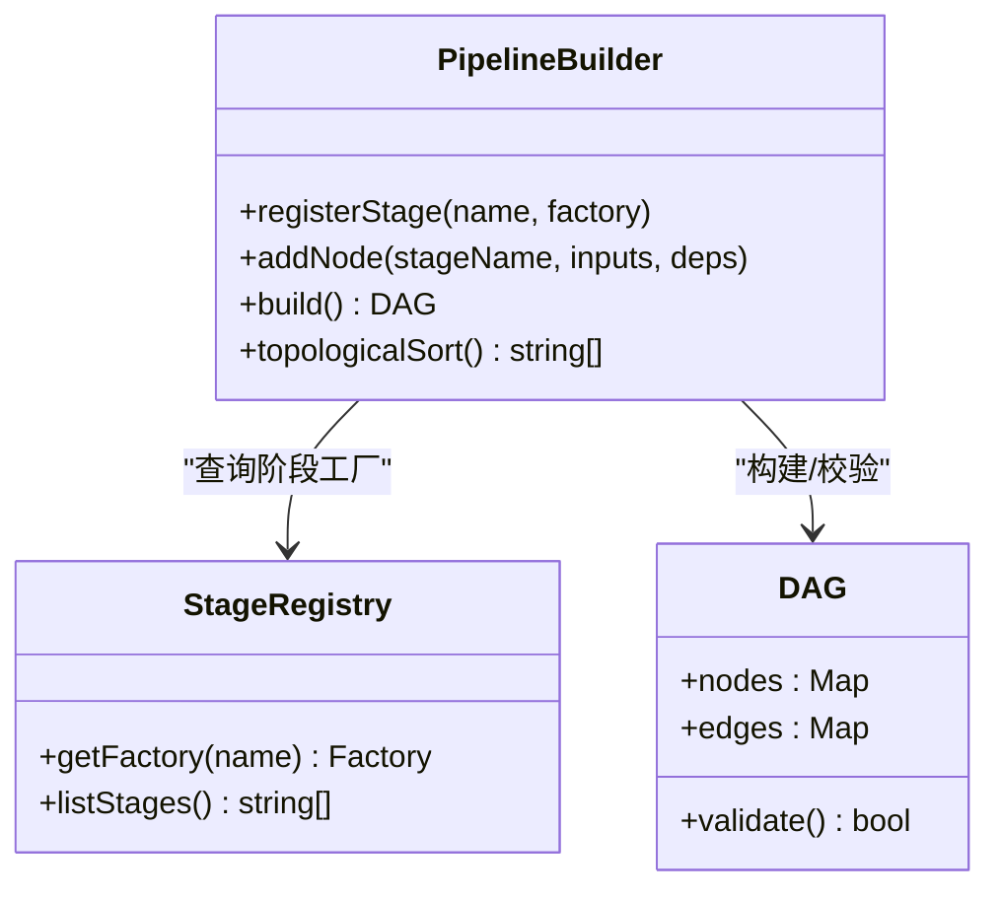

图表来源 
- [src/features/director/pipeline.ts](file://src/features/director/pipeline.ts)
- [src/features/director/types.ts](file://src/features/director/types.ts)

章节来源
- [src/features/director/pipeline.ts](file://src/features/director/pipeline.ts)
- [src/features/director/types.ts](file://src/features/director/types.ts)

### 阶段运行器与执行上下文
- 执行上下文：包含作业 ID、项目 ID、会话变量、凭据、并发限制、超时与重试策略。
- 数据传递协议：阶段间通过“键值产物”传递，产物由运行时仓库持久化，支持增量读取与断点续跑。
- 状态同步：每步执行后写回进度与状态，支持外部观察者实时订阅。
- 错误处理：捕获异常、记录诊断信息、触发重试或降级路径。

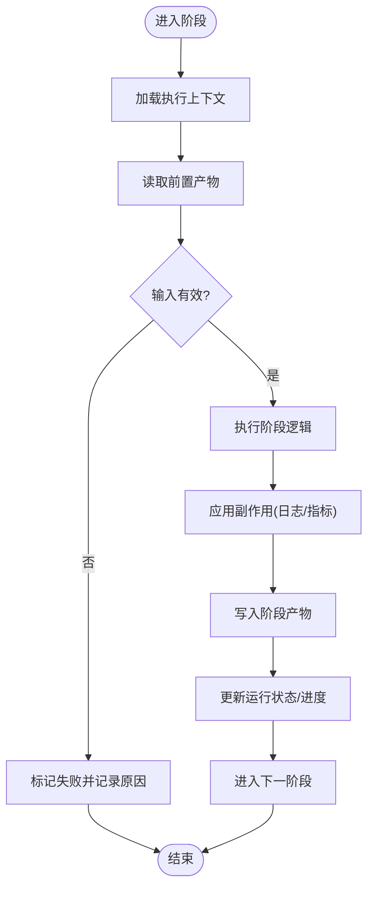

图表来源 
- [src/features/director/stage-runner.ts](file://src/features/director/stage-runner.ts)
- [src/features/director/runtime-repository.ts](file://src/features/director/runtime-repository.ts)
- [src/features/director/runtime-node-data.ts](file://src/features/director/runtime-node-data.ts)

章节来源
- [src/features/director/stage-runner.ts](file://src/features/director/stage-runner.ts)
- [src/features/director/runtime-repository.ts](file://src/features/director/runtime-repository.ts)
- [src/features/director/runtime-node-data.ts](file://src/features/director/runtime-node-data.ts)

### 运行时仓库与会话存储
- 运行时仓库：提供阶段中间态、产物元数据、执行进度的原子读写，保证一致性。
- 会话存储：跨阶段共享不可变配置与可变变量，支持快照与回滚。
- 事务与锁：对关键路径加锁，避免竞态；对长耗时操作采用异步提交。

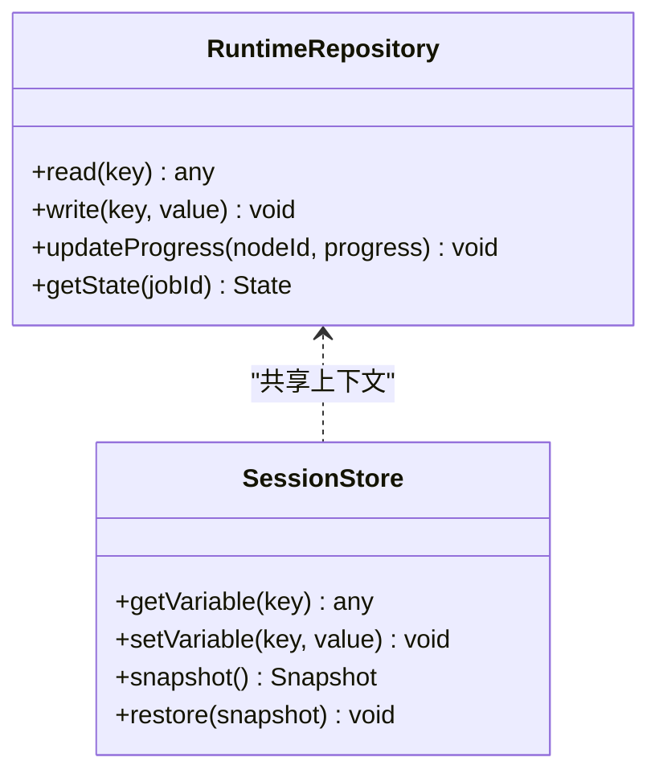

图表来源 
- [src/features/director/runtime-repository.ts](file://src/features/director/runtime-repository.ts)
- [src/features/director/session-store.ts](file://src/features/director/session-store.ts)

章节来源
- [src/features/director/runtime-repository.ts](file://src/features/director/runtime-repository.ts)
- [src/features/director/session-store.ts](file://src/features/director/session-store.ts)

### 产物读写与门控
- 产物写入器：序列化阶段输出，落盘至对象存储或本地文件系统，并记录元数据。
- 产物读取器：按键读取产物，支持范围读取与缓存命中。
- 产物门控：检查前置产物是否存在/有效，决定分支走向或短路执行。

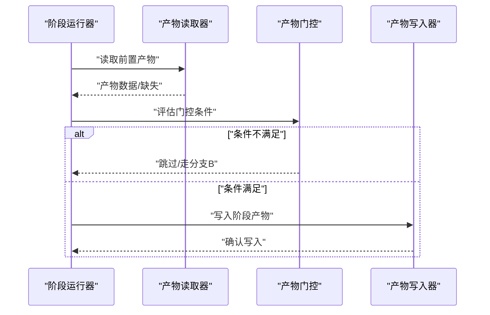

图表来源 
- [src/features/director/runtime-artifact-reader.ts](file://src/features/director/runtime-artifact-reader.ts)
- [src/features/director/stage-artifact-gate.ts](file://src/features/director/stage-artifact-gate.ts)
- [src/features/director/runtime-artifact-writer.ts](file://src/features/director/runtime-artifact-writer.ts)

章节来源
- [src/features/director/runtime-artifact-reader.ts](file://src/features/director/runtime-artifact-reader.ts)
- [src/features/director/stage-artifact-gate.ts](file://src/features/director/stage-artifact-gate.ts)
- [src/features/director/runtime-artifact-writer.ts](file://src/features/director/runtime-artifact-writer.ts)

### 阶段效果器与结果模型
- 阶段效果器：在阶段执行前后注入日志、指标、审计与告警。
- 阶段结果：统一的成功/失败/跳过状态与诊断字段，便于可视化与回放。

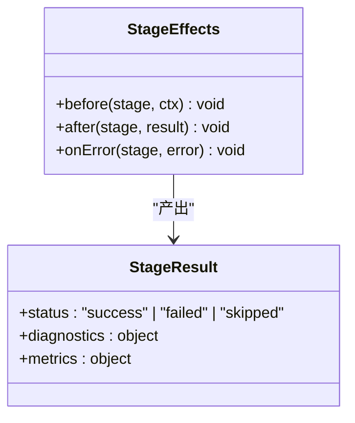

图表来源 
- [src/features/director/stage-effects.ts](file://src/features/director/stage-effects.ts)
- [src/features/director/stage-result.ts](file://src/features/director/stage-result.ts)

章节来源
- [src/features/director/stage-effects.ts](file://src/features/director/stage-effects.ts)
- [src/features/director/stage-result.ts](file://src/features/director/stage-result.ts)

### 阶段提示词与 AI 集成
- 阶段提示词：将 LLM 调用封装为阶段，支持参数化、重试与结果结构化。
- PI Provider：抽象不同 AI 提供商的统一接口，便于切换与路由。

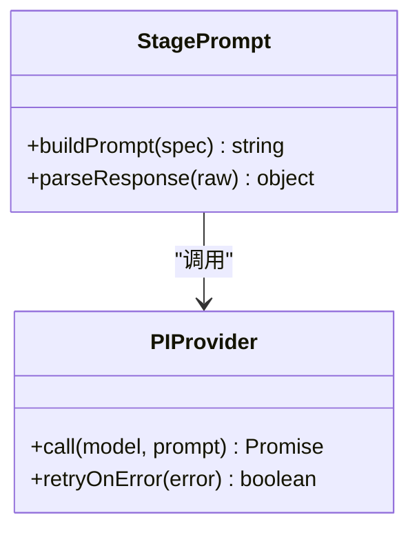

图表来源 
- [src/features/director/stage-prompt.ts](file://src/features/director/stage-prompt.ts)
- [src/features/director/pi-provider.ts](file://src/features/director/pi-provider.ts)

章节来源
- [src/features/director/stage-prompt.ts](file://src/features/director/stage-prompt.ts)
- [src/features/director/pi-provider.ts](file://src/features/director/pi-provider.ts)

### 渲染与导出服务
- 渲染器：将页面/模板渲染为媒体资源，支持帧级控制与质量参数。
- 导出服务：聚合渲染产物，生成最终交付物（视频/图片/字幕等）。

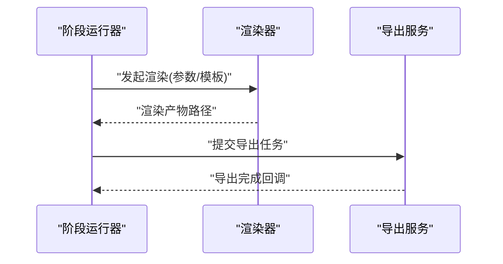

图表来源 
- [src/features/render/renderer.ts](file://src/features/render/renderer.ts)
- [src/features/render/export-service.ts](file://src/features/render/export-service.ts)

章节来源
- [src/features/render/renderer.ts](file://src/features/render/renderer.ts)
- [src/features/render/export-service.ts](file://src/features/render/export-service.ts)

### API 路由与事件流
- 管道路由：创建工作流、提交作业、查询状态。
- 阶段路由：触发特定阶段、查看阶段详情。
- 事件流路由：按节点或项目推送实时事件（SSE/WebSocket）。

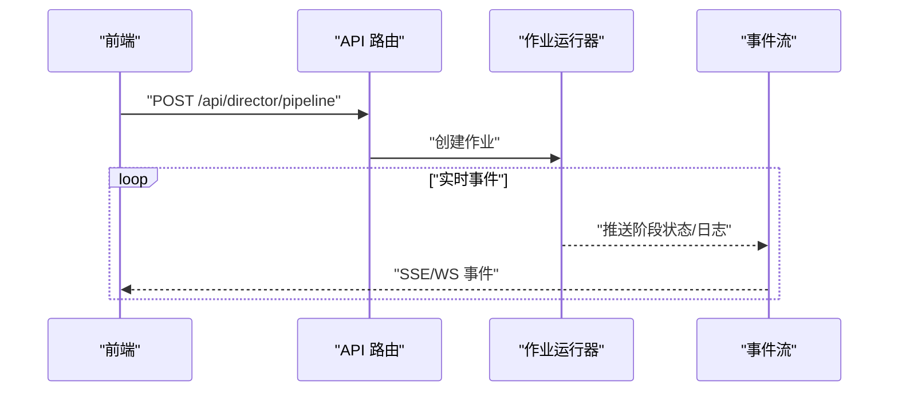

图表来源 
- [src/app/api/director/pipeline/route.ts](file://src/app/api/director/pipeline/route.ts)
- [src/app/api/director/stage/route.ts](file://src/app/api/director/stage/route.ts)
- [src/app/api/director/stream/[nodeId]/route.ts](file://src/app/api/director/stream/[nodeId]/route.ts)
- [server/src/server/job-runner.ts](file://server/src/server/job-runner.ts)

章节来源
- [src/app/api/director/pipeline/route.ts](file://src/app/api/director/pipeline/route.ts)
- [src/app/api/director/stage/route.ts](file://src/app/api/director/stage/route.ts)
- [src/app/api/director/stream/[nodeId]/route.ts](file://src/app/api/director/stream/[nodeId]/route.ts)
- [server/src/server/job-runner.ts](file://server/src/server/job-runner.ts)

## 依赖关系分析
- 松耦合：各组件通过接口与消息协议交互，降低直接依赖。
- 内聚性：阶段运行器聚合了输入读取、执行、副作用、结果提交等职责。
- 潜在循环：应避免在阶段效果器中反向依赖阶段运行器，防止死锁。
- 外部依赖：AI 提供商、对象存储、数据库与消息队列均为可替换扩展点。

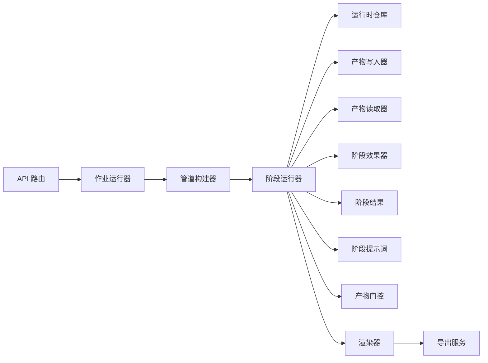

图表来源 
- [src/app/api/director/pipeline/route.ts](file://src/app/api/director/pipeline/route.ts)
- [server/src/server/job-runner.ts](file://server/src/server/job-runner.ts)
- [src/features/director/pipeline.ts](file://src/features/director/pipeline.ts)
- [src/features/director/stage-runner.ts](file://src/features/director/stage-runner.ts)
- [src/features/director/runtime-repository.ts](file://src/features/director/runtime-repository.ts)
- [src/features/director/runtime-artifact-writer.ts](file://src/features/director/runtime-artifact-writer.ts)
- [src/features/director/runtime-artifact-reader.ts](file://src/features/director/runtime-artifact-reader.ts)
- [src/features/director/stage-effects.ts](file://src/features/director/stage-effects.ts)
- [src/features/director/stage-result.ts](file://src/features/director/stage-result.ts)
- [src/features/director/stage-prompt.ts](file://src/features/director/stage-prompt.ts)
- [src/features/director/stage-artifact-gate.ts](file://src/features/director/stage-artifact-gate.ts)
- [src/features/render/renderer.ts](file://src/features/render/renderer.ts)
- [src/features/render/export-service.ts](file://src/features/render/export-service.ts)

章节来源
- [src/features/director/types.ts](file://src/features/director/types.ts)
- [src/features/director/advance.ts](file://src/features/director/advance.ts)

## 性能考量
- 拓扑并行：对无依赖的阶段进行最大并行度调度，提升吞吐。
- 产物缓存：相同输入哈希命中已有产物，避免重复计算。
- 批处理：合并小产物写入，减少 IO 放大。
- 背压与限流：对下游渲染/导出服务设置并发上限与退避策略。
- 内存管理：大对象分块处理，及时释放引用，避免 OOM。
- 监控与采样：关键路径埋点，采集延迟分布与错误率。

[本节为通用指导，无需代码来源]

## 故障排查指南
- 常见问题定位：
  - 阶段失败：检查阶段结果中的诊断字段与错误堆栈。
  - 产物缺失：确认前置阶段是否成功，检查产物门控条件。
  - 状态不一致：核对运行时仓库的状态快照与进度。
  - 并发冲突：观察锁竞争与重试风暴，调整并发与退避。
- 调试手段：
  - 启用阶段效果器的详细日志。
  - 使用会话快照对比差异。
  - 回放事件流定位问题阶段。
- 恢复策略：
  - 断点续跑：从最近成功阶段继续。
  - 降级路径：跳过非关键阶段，保证主链路可用。

章节来源
- [src/features/director/stage-result.ts](file://src/features/director/stage-result.ts)
- [src/features/director/stage-effects.ts](file://src/features/director/stage-effects.ts)
- [src/features/director/runtime-repository.ts](file://src/features/director/runtime-repository.ts)
- [src/features/director/session-store.ts](file://src/features/director/session-store.ts)

## 结论
PurpleInk 工作流编排引擎以“管道构建器 + 阶段运行器 + 运行时仓库”为核心，结合产物门控、效果器与事件流，实现了高内聚、低耦合、可扩展的编排体系。通过拓扑并行、产物缓存与批处理等手段，可在复杂媒体生产场景中取得稳定高效的执行表现。建议遵循本文的最佳实践与性能建议，持续完善模板库与阶段生态。

[本节为总结，无需代码来源]

## 附录
- 工作流模板系统：通过模板参数化节点与边，快速生成多实例工作流。
- 条件分支处理：基于产物门控与运行时变量实现 if/else/switch 分支。
- 并行执行策略：按拓扑层级并行，配合全局并发上限与资源配额。
- 数据传递协议：键值产物 + 元数据描述，支持类型校验与版本演进。
- 状态同步机制：事件驱动 + 快照持久化，支持回放与审计。

[本节为概念性内容，无需代码来源]