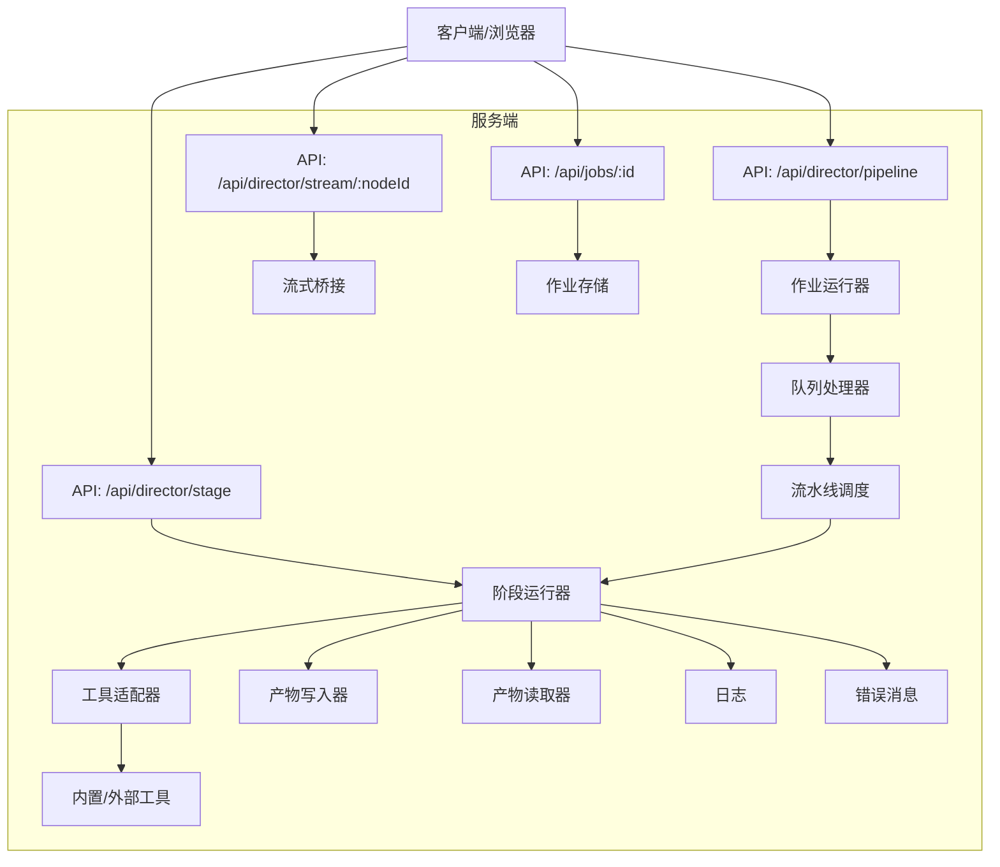
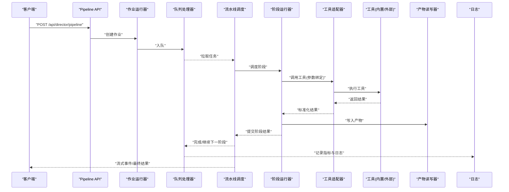
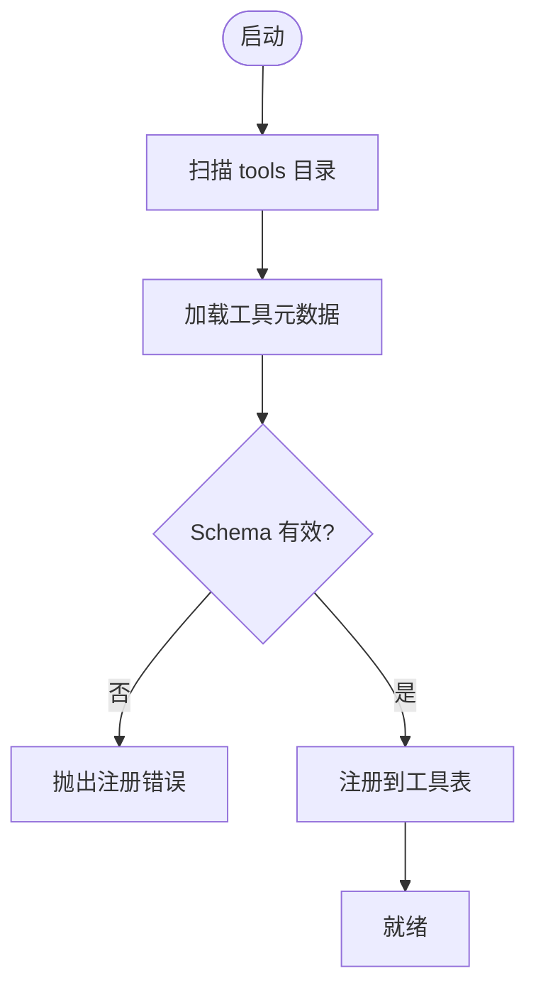
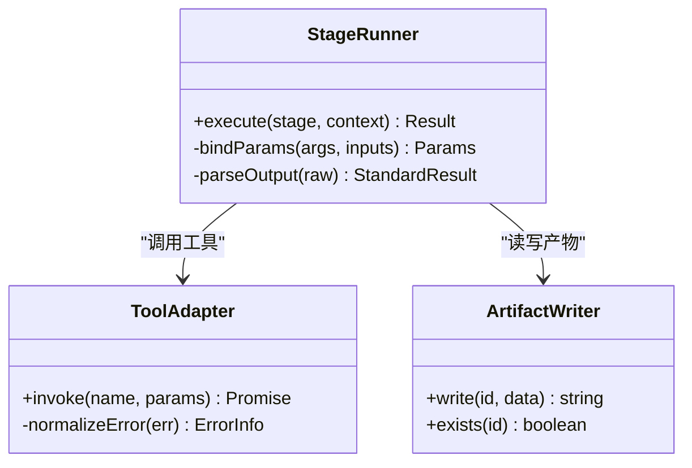
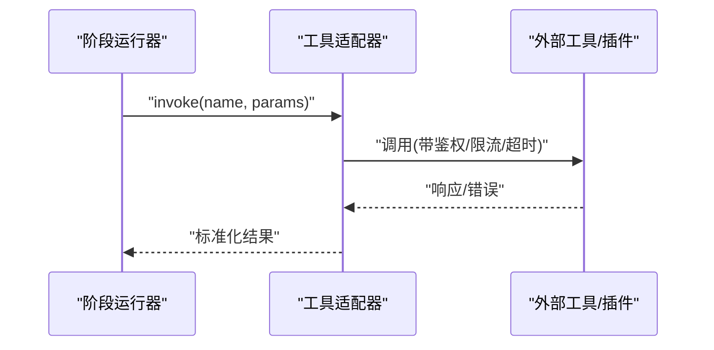
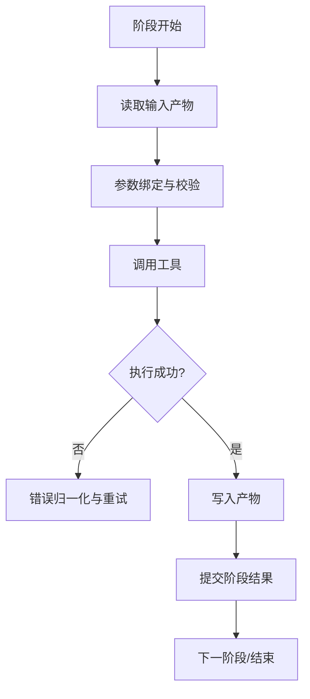
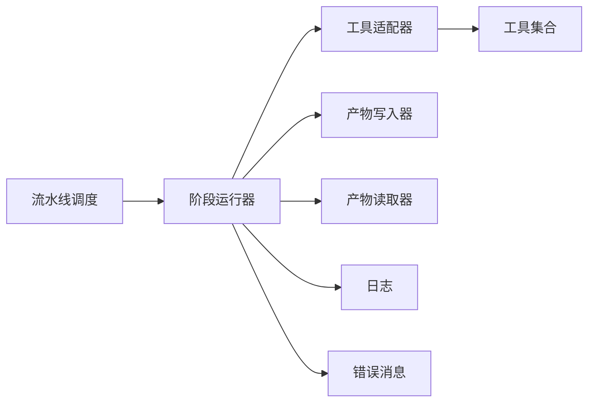

# 工具链集成

<cite>
**本文引用的文件**   
- [server/src/index.ts](file://server/src/index.ts)
- [server/src/server/api.ts](file://server/src/server/api.ts)
- [server/src/server/job-runner.ts](file://server/src/server/job-runner.ts)
- [server/src/server/job-store.ts](file://server/src/server/job-store.ts)
- [src/features/director/pipeline.ts](file://src/features/director/pipeline.ts)
- [src/features/director/stage-runner.ts](file://src/features/director/stage-runner.ts)
- [src/features/director/advance.ts](file://src/features/director/advance.ts)
- [src/features/director/pi-tool-adapter.ts](file://src/features/director/pi-tool-adapter.ts)
- [src/features/director/tools/write-artifact.ts](file://src/features/director/tools/write-artifact.ts)
- [src/features/director/tools/check-determinism.ts](file://src/features/director/tools/check-determinism.ts)
- [src/features/director/tools/validate-shot-plan.ts](file://src/features/director/tools/validate-shot-plan.ts)
- [src/features/director/runtime-artifact-writer.ts](file://src/features/director/runtime-artifact-writer.ts)
- [src/features/director/runtime-artifact-reader.ts](file://src/features/director/runtime-artifact-reader.ts)
- [src/features/director/runtime-node-data.ts](file://src/features/director/runtime-node-data.ts)
- [src/features/director/stage-result.ts](file://src/features/director/stage-result.ts)
- [src/features/director/stage-effects.ts](file://src/features/director/stage-effects.ts)
- [src/features/director/stage-prompt.ts](file://src/features/director/stage-prompt.ts)
- [src/features/director/pi-output.ts](file://src/features/director/pi-output.ts)
- [src/features/director/pi-session.ts](file://src/features/director/pi-session.ts)
- [src/features/director/pi-provider.ts](file://src/features/director/pi-provider.ts)
- [src/features/director/queue-handler.ts](file://src/features/director/queue-handler.ts)
- [src/features/director/session-store.ts](file://src/features/director/session-store.ts)
- [src/features/director/output-recovery.ts](file://src/features/director/output-recovery.ts)
- [src/app/api/director/pipeline/route.ts](file://src/app/api/director/pipeline/route.ts)
- [src/app/api/director/stage/route.ts](file://src/app/api/director/stage/route.ts)
- [src/app/api/director/stream/[nodeId]/route.ts](file://src/app/api/director/stream/[nodeId]/route.ts)
- [src/app/api/jobs/[id]/route.ts](file://src/app/api/jobs/[id]/route.ts)
- [src/lib/queue/index.ts](file://src/lib/queue/index.ts)
- [server/src/lib/logger.ts](file://server/src/lib/logger.ts)
- [server/src/lib/error-message.ts](file://server/src/lib/error-message.ts)
</cite>

## 目录
1. [简介](#简介)
2. [项目结构](#项目结构)
3. [核心组件](#核心组件)
4. [架构总览](#架构总览)
5. [详细组件分析](#详细组件分析)
6. [依赖关系分析](#依赖关系分析)
7. [性能考量](#性能考量)
8. [故障排查指南](#故障排查指南)
9. [结论](#结论)
10. [附录：新工具集成指南与最佳实践](#附录新工具集成指南与最佳实践)

## 简介
本文件面向 PurpleInK 工具链集成系统，系统性阐述工具发现机制、参数绑定与结果解析流程；说明内置工具集、外部工具调用方式与插件扩展接口；覆盖权限控制、安全沙箱与资源限制策略；并提供工具调用监控、日志记录与性能分析方法。同时给出新工具集成指南与最佳实践，帮助开发者快速扩展能力并保持系统稳定与安全。

## 项目结构
PurpleInK 的工具链相关代码主要分布在以下区域：
- 服务端入口与 API 路由：负责接收请求、编排任务、暴露流式事件与作业状态查询
- Director（导演）子系统：负责流水线调度、阶段执行、工具适配与产物管理
- 队列与持久化：负责任务入队、出队、重试与恢复
- 日志与错误处理：统一日志输出与错误信息格式化
- 前端 API 路由：聚合后端能力，提供统一的 HTTP 接口

**图示来源** 
- [server/src/index.ts](file://server/src/index.ts)
- [src/app/api/director/pipeline/route.ts](file://src/app/api/director/pipeline/route.ts)
- [src/app/api/director/stage/route.ts](file://src/app/api/director/stage/route.ts)
- [src/app/api/director/stream/[nodeId]/route.ts](file://src/app/api/director/stream/[nodeId]/route.ts)
- [src/app/api/jobs/[id]/route.ts](file://src/app/api/jobs/[id]/route.ts)
- [server/src/server/job-runner.ts](file://server/src/server/job-runner.ts)
- [src/features/director/queue-handler.ts](file://src/features/director/queue-handler.ts)
- [src/features/director/pipeline.ts](file://src/features/director/pipeline.ts)
- [src/features/director/stage-runner.ts](file://src/features/director/stage-runner.ts)
- [src/features/director/pi-tool-adapter.ts](file://src/features/director/pi-tool-adapter.ts)
- [src/features/director/runtime-artifact-writer.ts](file://src/features/director/runtime-artifact-writer.ts)
- [src/features/director/runtime-artifact-reader.ts](file://src/features/director/runtime-artifact-reader.ts)
- [server/src/lib/logger.ts](file://server/src/lib/logger.ts)
- [server/src/lib/error-message.ts](file://server/src/lib/error-message.ts)

**章节来源**
- [server/src/index.ts](file://server/src/index.ts)
- [src/app/api/director/pipeline/route.ts](file://src/app/api/director/pipeline/route.ts)
- [src/app/api/director/stage/route.ts](file://src/app/api/director/stage/route.ts)
- [src/app/api/director/stream/[nodeId]/route.ts](file://src/app/api/director/stream/[nodeId]/route.ts)
- [src/app/api/jobs/[id]/route.ts](file://src/app/api/jobs/[id]/route.ts)

## 核心组件
- 流水线调度器：定义阶段顺序、依赖与数据流转，驱动阶段运行器按图执行
- 阶段运行器：封装单个阶段的执行上下文、输入输出、副作用与结果提交
- 工具适配器：将 LLM/外部命令/脚本等统一为可被阶段调用的工具接口
- 产物读写器：对运行时产物进行标准化读写，支持缓存与幂等
- 队列处理器：任务入队、并发控制、重试与失败恢复
- 会话与状态：维护工具调用会话、中间状态与恢复点
- 日志与错误：结构化日志、错误分类与用户可见的错误消息

**章节来源**
- [src/features/director/pipeline.ts](file://src/features/director/pipeline.ts)
- [src/features/director/stage-runner.ts](file://src/features/director/stage-runner.ts)
- [src/features/director/pi-tool-adapter.ts](file://src/features/director/pi-tool-adapter.ts)
- [src/features/director/runtime-artifact-writer.ts](file://src/features/director/runtime-artifact-writer.ts)
- [src/features/director/runtime-artifact-reader.ts](file://src/features/director/runtime-artifact-reader.ts)
- [src/features/director/queue-handler.ts](file://src/features/director/queue-handler.ts)
- [src/features/director/session-store.ts](file://src/features/director/session-store.ts)
- [server/src/lib/logger.ts](file://server/src/lib/logger.ts)
- [server/src/lib/error-message.ts](file://server/src/lib/error-message.ts)

## 架构总览
工具链整体采用“流水线-阶段-工具”的分层架构：
- 上层通过 REST API 触发流水线或阶段执行
- 流水线根据配置构建执行图并调度阶段
- 阶段运行器在隔离上下文中调用工具，读写产物，提交结果
- 工具适配器屏蔽不同工具的实现差异，统一参数与返回格式
- 队列处理器保障高吞吐与容错，支持断点恢复
- 日志与错误模块贯穿全链路，便于监控与排障

**图示来源** 
- [src/app/api/director/pipeline/route.ts](file://src/app/api/director/pipeline/route.ts)
- [server/src/server/job-runner.ts](file://server/src/server/job-runner.ts)
- [src/features/director/queue-handler.ts](file://src/features/director/queue-handler.ts)
- [src/features/director/pipeline.ts](file://src/features/director/pipeline.ts)
- [src/features/director/stage-runner.ts](file://src/features/director/stage-runner.ts)
- [src/features/director/pi-tool-adapter.ts](file://src/features/director/pi-tool-adapter.ts)
- [src/features/director/runtime-artifact-writer.ts](file://src/features/director/runtime-artifact-writer.ts)
- [server/src/lib/logger.ts](file://server/src/lib/logger.ts)

## 详细组件分析

### 工具发现与注册机制
- 工具发现：集中扫描 tools 目录下的模块，按约定导出元数据（名称、描述、参数 schema、权限标签）
- 注册表：维护工具名到实现的映射，支持版本与特性开关
- 动态加载：按需引入工具实现，避免冷启动开销
- 校验：启动时校验 schema 一致性，缺失必填字段或类型不匹配时报错

**图示来源** 
- [src/features/director/tools/write-artifact.ts](file://src/features/director/tools/write-artifact.ts)
- [src/features/director/tools/check-determinism.ts](file://src/features/director/tools/check-determinism.ts)
- [src/features/director/tools/validate-shot-plan.ts](file://src/features/director/tools/validate-shot-plan.ts)

**章节来源**
- [src/features/director/tools/write-artifact.ts](file://src/features/director/tools/write-artifact.ts)
- [src/features/director/tools/check-determinism.ts](file://src/features/director/tools/check-determinism.ts)
- [src/features/director/tools/validate-shot-plan.ts](file://src/features/director/tools/validate-shot-plan.ts)

### 参数绑定与结果解析
- 参数绑定：阶段运行器将上游产物与配置注入工具参数，支持路径展开、变量替换与默认值
- 类型校验：基于 schema 对输入进行严格校验，拒绝非法参数
- 结果解析：统一将工具输出转换为标准结构（成功/失败、数据体、元数据），异常归一化为错误对象
- 幂等性：对可重入操作使用幂等键，避免重复执行造成副作用

**图示来源** 
- [src/features/director/stage-runner.ts](file://src/features/director/stage-runner.ts)
- [src/features/director/pi-tool-adapter.ts](file://src/features/director/pi-tool-adapter.ts)
- [src/features/director/runtime-artifact-writer.ts](file://src/features/director/runtime-artifact-writer.ts)

**章节来源**
- [src/features/director/stage-runner.ts](file://src/features/director/stage-runner.ts)
- [src/features/director/pi-tool-adapter.ts](file://src/features/director/pi-tool-adapter.ts)
- [src/features/director/runtime-artifact-writer.ts](file://src/features/director/runtime-artifact-writer.ts)

### 内置工具集
- write-artifact：将阶段产物写入运行时存储，支持分块与校验
- check-determinism：检查关键步骤的确定性，用于回归与审计
- validate-shot-plan：校验镜头计划的结构与约束，确保下游可用性

这些工具均遵循统一接口，具备参数 schema、权限标签与可观测性。

**章节来源**
- [src/features/director/tools/write-artifact.ts](file://src/features/director/tools/write-artifact.ts)
- [src/features/director/tools/check-determinism.ts](file://src/features/director/tools/check-determinism.ts)
- [src/features/director/tools/validate-shot-plan.ts](file://src/features/director/tools/validate-shot-plan.ts)

### 外部工具调用与插件扩展接口
- 外部工具：通过命令行、HTTP 或 SDK 调用第三方服务，由工具适配器封装网络与超时
- 插件接口：定义插件元数据、生命周期钩子与沙箱边界，支持热插拔
- 安全边界：环境变量白名单、文件系统只读挂载、网络出口控制
- 扩展点：新增插件只需实现接口并注册，即可参与流水线

**图示来源** 
- [src/features/director/pi-tool-adapter.ts](file://src/features/director/pi-tool-adapter.ts)

**章节来源**
- [src/features/director/pi-tool-adapter.ts](file://src/features/director/pi-tool-adapter.ts)

### 权限控制、安全沙箱与资源限制
- 权限模型：基于角色与工具标签的访问控制，最小权限原则
- 沙箱策略：进程隔离、资源配额（CPU/内存/IO）、网络白名单
- 资源限制：队列并发度、阶段超时、产物大小上限
- 审计：记录工具调用轨迹、参数摘要与结果摘要

**章节来源**
- [src/features/director/stage-runner.ts](file://src/features/director/stage-runner.ts)
- [src/features/director/queue-handler.ts](file://src/features/director/queue-handler.ts)
- [server/src/lib/logger.ts](file://server/src/lib/logger.ts)

### 工具调用监控、日志记录与性能分析
- 监控：指标采集（耗时、成功率、错误码分布、队列长度）
- 日志：结构化 JSON 日志，包含 traceId、stageId、toolName、paramsHash
- 性能分析：热点函数定位、慢查询与 I/O 瓶颈识别、缓存命中率统计

**章节来源**
- [server/src/lib/logger.ts](file://server/src/lib/logger.ts)
- [src/features/director/queue-handler.ts](file://src/features/director/queue-handler.ts)

### 数据流与状态管理
- 运行时节点数据：阶段间传递的数据结构与版本兼容
- 会话与状态：保存中间态，支持中断恢复
- 结果提交：阶段完成后提交结果，触发后续阶段或结束流水线

**图示来源** 
- [src/features/director/runtime-node-data.ts](file://src/features/director/runtime-node-data.ts)
- [src/features/director/stage-result.ts](file://src/features/director/stage-result.ts)
- [src/features/director/stage-effects.ts](file://src/features/director/stage-effects.ts)

**章节来源**
- [src/features/director/runtime-node-data.ts](file://src/features/director/runtime-node-data.ts)
- [src/features/director/stage-result.ts](file://src/features/director/stage-result.ts)
- [src/features/director/stage-effects.ts](file://src/features/director/stage-effects.ts)

## 依赖关系分析
- 低耦合：阶段运行器仅依赖工具适配器与产物读写器，不关心具体工具实现
- 高内聚：工具模块自包含参数 schema、执行逻辑与错误处理
- 可扩展：新增工具无需修改核心调度逻辑，仅需注册与声明元数据
- 可观测：日志与错误模块贯穿各层，便于问题定位

**图示来源** 
- [src/features/director/pipeline.ts](file://src/features/director/pipeline.ts)
- [src/features/director/stage-runner.ts](file://src/features/director/stage-runner.ts)
- [src/features/director/pi-tool-adapter.ts](file://src/features/director/pi-tool-adapter.ts)
- [src/features/director/runtime-artifact-writer.ts](file://src/features/director/runtime-artifact-writer.ts)
- [src/features/director/runtime-artifact-reader.ts](file://src/features/director/runtime-artifact-reader.ts)
- [server/src/lib/logger.ts](file://server/src/lib/logger.ts)
- [server/src/lib/error-message.ts](file://server/src/lib/error-message.ts)

**章节来源**
- [src/features/director/pipeline.ts](file://src/features/director/pipeline.ts)
- [src/features/director/stage-runner.ts](file://src/features/director/stage-runner.ts)
- [src/features/director/pi-tool-adapter.ts](file://src/features/director/pi-tool-adapter.ts)
- [src/features/director/runtime-artifact-writer.ts](file://src/features/director/runtime-artifact-writer.ts)
- [src/features/director/runtime-artifact-reader.ts](file://src/features/director/runtime-artifact-reader.ts)
- [server/src/lib/logger.ts](file://server/src/lib/logger.ts)
- [server/src/lib/error-message.ts](file://server/src/lib/error-message.ts)

## 性能考量
- 队列并发：合理设置并发度，避免资源争用与 OOM
- 超时与重试：短超时+指数退避，提升鲁棒性
- 产物缓存：对确定性工具启用缓存，减少重复计算
- 流式输出：大结果分片传输，降低内存峰值
- 监控告警：关键指标阈值告警，及时扩容或降级

[本节为通用指导，不直接分析具体文件]

## 故障排查指南
- 常见问题
  - 工具未注册：检查 tools 目录与元数据导出
  - 参数校验失败：核对 schema 与输入类型
  - 外部调用超时：检查网络白名单与超时配置
  - 产物写入失败：确认存储路径与权限
- 定位方法
  - 查看结构化日志中的 traceId 与 stageId
  - 检查错误消息分类与堆栈
  - 使用流式事件观察阶段进度
- 恢复策略
  - 利用输出恢复模块从最近检查点恢复
  - 调整重试策略与并发度

**章节来源**
- [server/src/lib/error-message.ts](file://server/src/lib/error-message.ts)
- [src/features/director/output-recovery.ts](file://src/features/director/output-recovery.ts)
- [src/app/api/director/stream/[nodeId]/route.ts](file://src/app/api/director/stream/[nodeId]/route.ts)

## 结论
PurpleInK 工具链以“流水线-阶段-工具”为核心，结合严格的参数绑定与结果解析、完善的权限与沙箱策略、以及全面的监控与日志体系，提供了可扩展、可观测且安全的工具集成平台。通过统一的插件接口与注册机制，开发者可以快速扩展能力并保持系统稳定性。

[本节为总结，不直接分析具体文件]

## 附录：新工具集成指南与最佳实践
- 开发步骤
  - 在 tools 目录下新建模块，导出名称、描述、参数 schema 与执行函数
  - 实现参数校验与错误归一化，返回标准结果结构
  - 如需外部调用，封装网络、鉴权、超时与重试逻辑
  - 注册工具并加入流水线可用列表
- 最佳实践
  - 幂等设计：为可重入操作提供幂等键
  - 资源限制：限制 CPU/内存/IO，避免影响主服务
  - 安全边界：最小权限、白名单网络、只读文件系统
  - 可观测性：记录关键指标与结构化日志
  - 测试覆盖：单元测试与集成测试，验证参数与结果
- 示例参考
  - 写产物工具：[src/features/director/tools/write-artifact.ts](file://src/features/director/tools/write-artifact.ts)
  - 确定性检查工具：[src/features/director/tools/check-determinism.ts](file://src/features/director/tools/check-determinism.ts)
  - 镜头计划校验工具：[src/features/director/tools/validate-shot-plan.ts](file://src/features/director/tools/validate-shot-plan.ts)

**章节来源**
- [src/features/director/tools/write-artifact.ts](file://src/features/director/tools/write-artifact.ts)
- [src/features/director/tools/check-determinism.ts](file://src/features/director/tools/check-determinism.ts)
- [src/features/director/tools/validate-shot-plan.ts](file://src/features/director/tools/validate-shot-plan.ts)