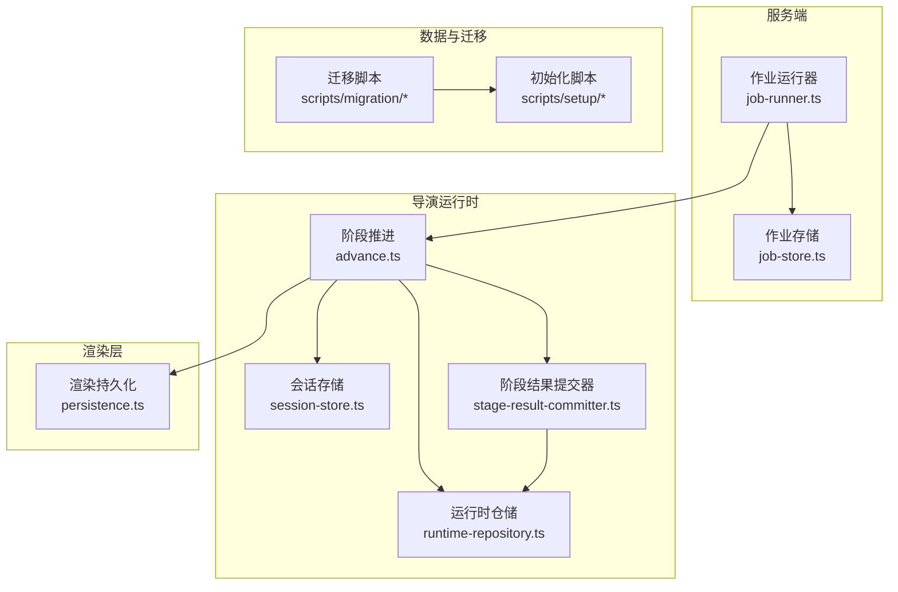
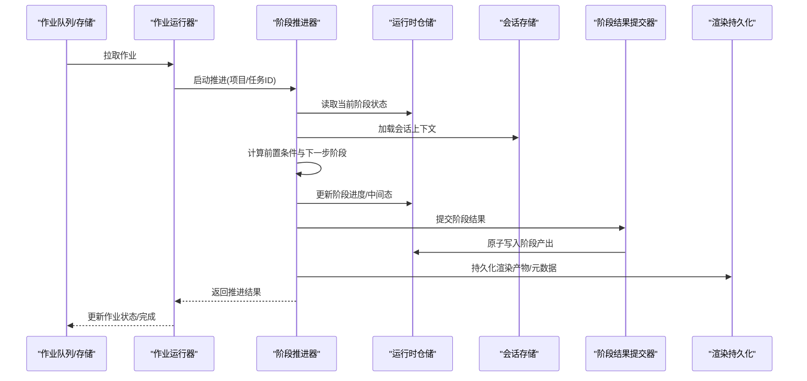
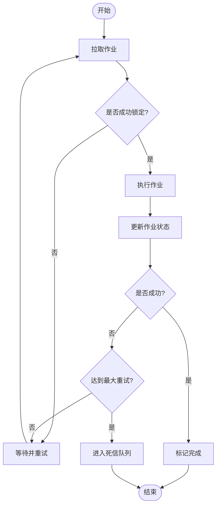
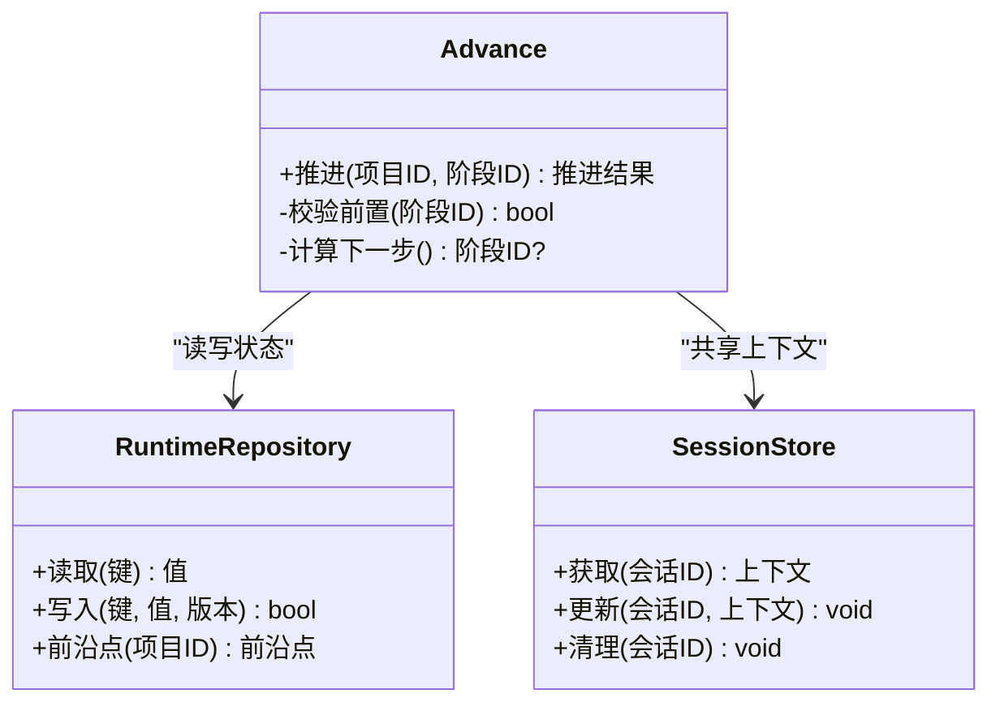
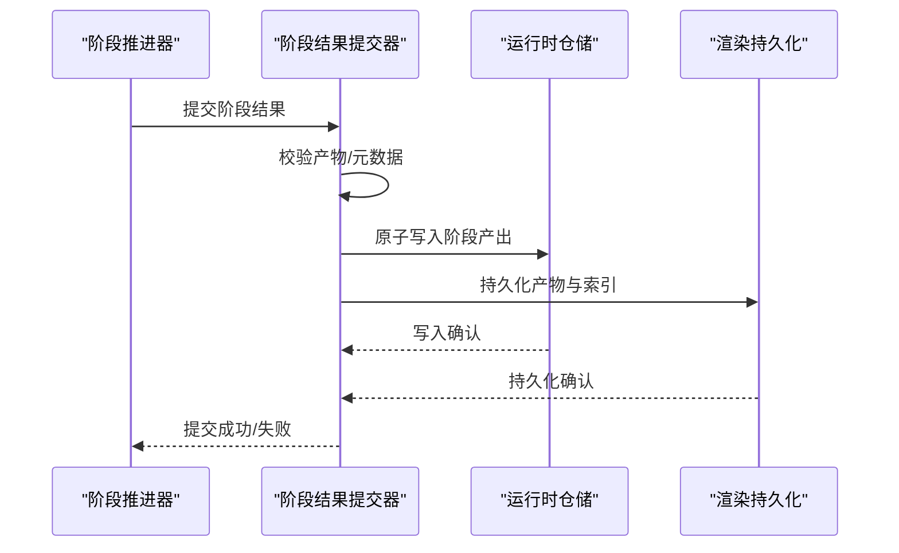
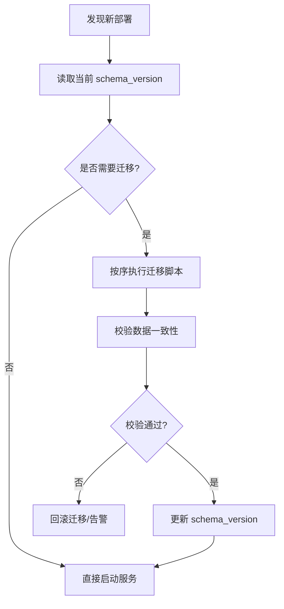
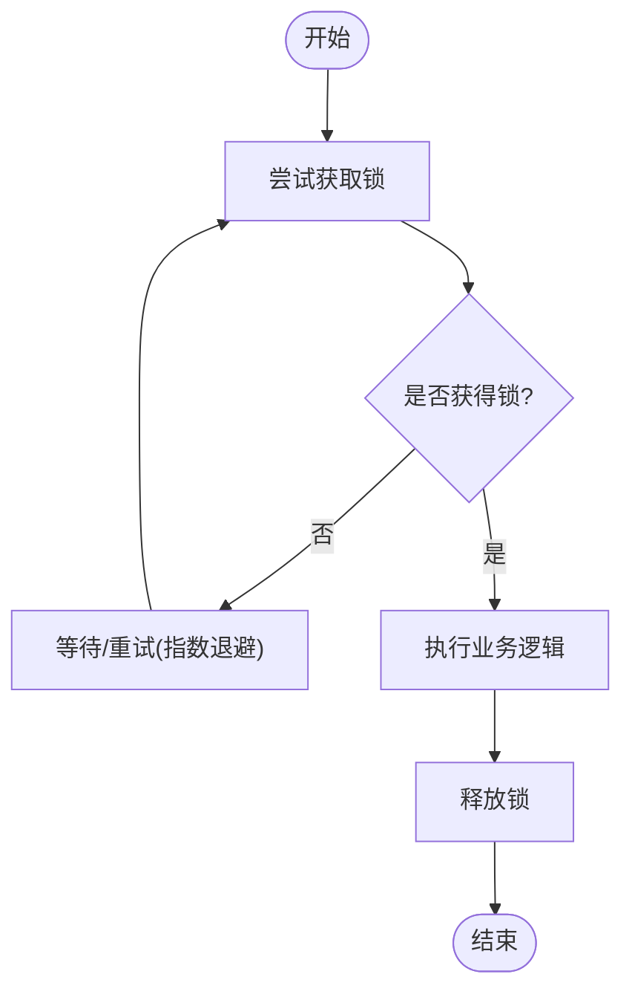
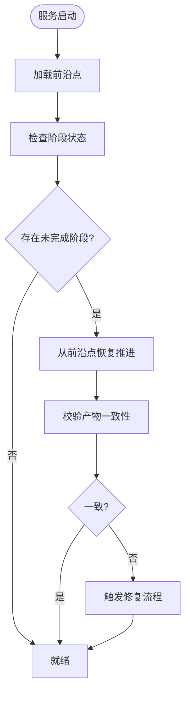
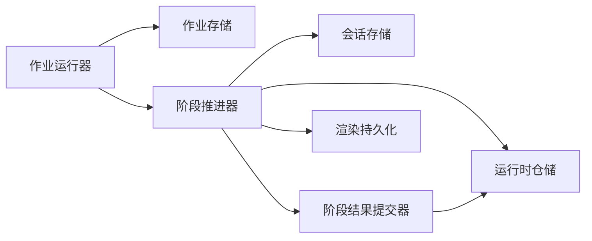

# 状态持久化

<cite>
**本文引用的文件**   
- [server/src/server/job-runner.ts](file://server/src/server/job-runner.ts)
- [server/src/server/job-store.ts](file://server/src/server/job-store.ts)
- [src/features/director/advance.ts](file://src/features/director/advance.ts)
- [src/features/director/runtime-repository.ts](file://src/features/director/runtime-repository.ts)
- [src/features/director/session-store.ts](file://src/features/director/session-store.ts)
- [src/features/director/stage-result-committer.ts](file://src/features/director/stage-result-committer.ts)
- [src/features/render/persistence.ts](file://src/features/render/persistence.ts)
- [scripts/migration/export-sqlite.ts](file://scripts/migration/export-sqlite.ts)
- [scripts/migration/import-postgres.ts](file://scripts/migration/import-postgres.ts)
- [scripts/migration/provision-master-key.ts](file://scripts/migration/provision-master-key.ts)
- [scripts/migration/reconcile-postgres.ts](file://scripts/migration/reconcile-postgres.ts)
- [scripts/migration/sqlite-backup.ts](file://scripts/migration/sqlite-backup.ts)
- [scripts/setup/db-migrate.ts](file://scripts/setup/db-migrate.ts)
- [scripts/setup/postgres-init.sql](file://scripts/setup/postgres-init.sql)
</cite>

## 目录
1. [简介](#简介)
2. [项目结构](#项目结构)
3. [核心组件](#核心组件)
4. [架构总览](#架构总览)
5. [详细组件分析](#详细组件分析)
6. [依赖关系分析](#依赖关系分析)
7. [性能考量](#性能考量)
8. [故障排查指南](#故障排查指南)
9. [结论](#结论)
10. [附录](#附录)

## 简介
本文件面向 PurpleInK 的状态持久化系统，围绕以下目标展开：
- 状态模型设计与版本控制、迁移策略
- 分布式锁机制、并发控制与冲突解决
- 前沿点管理、一致性与恢复机制
- 数据备份、灾难恢复与性能优化
- 状态调试工具与监控告警配置

该文档将结合代码仓库中的作业运行器、运行时仓储、会话存储、阶段结果提交器以及渲染持久化等模块，系统性阐述状态如何被建模、流转、落盘与恢复。

## 项目结构
状态持久化相关的关键位置包括：
- 服务端作业调度与执行：server/src/server/job-runner.ts、server/src/server/job-store.ts
- 导演（Director）运行时与阶段推进：src/features/director/advance.ts、runtime-repository.ts、session-store.ts、stage-result-committer.ts
- 渲染持久化：src/features/render/persistence.ts
- 数据库迁移与备份脚本：scripts/migration/*、scripts/setup/*

**图示来源** 
- [server/src/server/job-runner.ts](file://server/src/server/job-runner.ts)
- [server/src/server/job-store.ts](file://server/src/server/job-store.ts)
- [src/features/director/advance.ts](file://src/features/director/advance.ts)
- [src/features/director/runtime-repository.ts](file://src/features/director/runtime-repository.ts)
- [src/features/director/session-store.ts](file://src/features/director/session-store.ts)
- [src/features/director/stage-result-committer.ts](file://src/features/director/stage-result-committer.ts)
- [src/features/render/persistence.ts](file://src/features/render/persistence.ts)
- [scripts/migration/export-sqlite.ts](file://scripts/migration/export-sqlite.ts)
- [scripts/migration/import-postgres.ts](file://scripts/migration/import-postgres.ts)
- [scripts/migration/provision-master-key.ts](file://scripts/migration/provision-master-key.ts)
- [scripts/migration/reconcile-postgres.ts](file://scripts/migration/reconcile-postgres.ts)
- [scripts/migration/sqlite-backup.ts](file://scripts/migration/sqlite-backup.ts)
- [scripts/setup/db-migrate.ts](file://scripts/setup/db-migrate.ts)
- [scripts/setup/postgres-init.sql](file://scripts/setup/postgres-init.sql)

**章节来源**
- [server/src/server/job-runner.ts](file://server/src/server/job-runner.ts)
- [server/src/server/job-store.ts](file://server/src/server/job-store.ts)
- [src/features/director/advance.ts](file://src/features/director/advance.ts)
- [src/features/director/runtime-repository.ts](file://src/features/director/runtime-repository.ts)
- [src/features/director/session-store.ts](file://src/features/director/session-store.ts)
- [src/features/director/stage-result-committer.ts](file://src/features/director/stage-result-committer.ts)
- [src/features/render/persistence.ts](file://src/features/render/persistence.ts)
- [scripts/migration/export-sqlite.ts](file://scripts/migration/export-sqlite.ts)
- [scripts/migration/import-postgres.ts](file://scripts/migration/import-postgres.ts)
- [scripts/migration/provision-master-key.ts](file://scripts/migration/provision-master-key.ts)
- [scripts/migration/reconcile-postgres.ts](file://scripts/migration/reconcile-postgres.ts)
- [scripts/migration/sqlite-backup.ts](file://scripts/migration/sqlite-backup.ts)
- [scripts/setup/db-migrate.ts](file://scripts/setup/db-migrate.ts)
- [scripts/setup/postgres-init.sql](file://scripts/setup/postgres-init.sql)

## 核心组件
- 作业运行器（Job Runner）：负责拉取作业、编排执行生命周期、失败重试与完成上报。
- 作业存储（Job Store）：提供作业的持久化存取接口，通常基于数据库或消息队列后端。
- 阶段推进器（Advance）：驱动导演流水线各阶段的顺序推进，维护阶段间的前置条件与输出契约。
- 运行时仓储（Runtime Repository）：统一读写“运行时状态”（如节点输入/输出、进度、错误信息）。
- 会话存储（Session Store）：保存会话级上下文（例如对话历史、临时中间态），支持跨阶段共享。
- 阶段结果提交器（Stage Result Committer）：对阶段产出进行校验、合并与原子提交，确保一致性。
- 渲染持久化（Render Persistence）：将渲染产物与元数据写入对象存储或文件系统，并记录索引。

上述组件共同构成“作业—阶段—运行时—持久化”的闭环，保证状态可追踪、可恢复、可扩展。

**章节来源**
- [server/src/server/job-runner.ts](file://server/src/server/job-runner.ts)
- [server/src/server/job-store.ts](file://server/src/server/job-store.ts)
- [src/features/director/advance.ts](file://src/features/director/advance.ts)
- [src/features/director/runtime-repository.ts](file://src/features/director/runtime-repository.ts)
- [src/features/director/session-store.ts](file://src/features/director/session-store.ts)
- [src/features/director/stage-result-committer.ts](file://src/features/director/stage-result-committer.ts)
- [src/features/render/persistence.ts](file://src/features/render/persistence.ts)

## 架构总览
下图展示了从作业入队到阶段推进、状态落盘与产物持久化的整体流程。

**图示来源** 
- [server/src/server/job-runner.ts](file://server/src/server/job-runner.ts)
- [server/src/server/job-store.ts](file://server/src/server/job-store.ts)
- [src/features/director/advance.ts](file://src/features/director/advance.ts)
- [src/features/director/runtime-repository.ts](file://src/features/director/runtime-repository.ts)
- [src/features/director/session-store.ts](file://src/features/director/session-store.ts)
- [src/features/director/stage-result-committer.ts](file://src/features/director/stage-result-committer.ts)
- [src/features/render/persistence.ts](file://src/features/render/persistence.ts)

## 详细组件分析

### 作业运行器与作业存储
- 职责边界
  - 作业运行器：负责作业生命周期（拉取、执行、重试、完成）、异常捕获与指标上报。
  - 作业存储：抽象底层存储实现，提供增删改查与幂等操作。
- 关键行为
  - 拉取策略：按优先级/超时/重试次数选择作业。
  - 执行隔离：每个作业在独立上下文中执行，避免状态泄漏。
  - 失败处理：指数退避重试、死信队列与人工干预入口。
- 并发控制
  - 通过作业存储的“领取-锁定”语义防止重复消费。
  - 运行器侧限制并发度，避免资源争用。

**图示来源** 
- [server/src/server/job-runner.ts](file://server/src/server/job-runner.ts)
- [server/src/server/job-store.ts](file://server/src/server/job-store.ts)

**章节来源**
- [server/src/server/job-runner.ts](file://server/src/server/job-runner.ts)
- [server/src/server/job-store.ts](file://server/src/server/job-store.ts)

### 阶段推进器与运行时仓储
- 阶段推进器（Advance）
  - 依据阶段图与前置条件决定下一步阶段。
  - 维护阶段级事务边界，失败时回滚中间态。
- 运行时仓储（Runtime Repository）
  - 提供“读-改-写”原语，支持乐观锁版本号或CAS。
  - 暴露“前沿点”查询接口，用于断点续跑与一致性检查。
- 会话存储（Session Store）
  - 保存会话级上下文，支持过期与压缩。
  - 与运行时仓储解耦，便于横向扩展。

**图示来源** 
- [src/features/director/advance.ts](file://src/features/director/advance.ts)
- [src/features/director/runtime-repository.ts](file://src/features/director/runtime-repository.ts)
- [src/features/director/session-store.ts](file://src/features/director/session-store.ts)

**章节来源**
- [src/features/director/advance.ts](file://src/features/director/advance.ts)
- [src/features/director/runtime-repository.ts](file://src/features/director/runtime-repository.ts)
- [src/features/director/session-store.ts](file://src/features/director/session-store.ts)

### 阶段结果提交器与渲染持久化
- 阶段结果提交器（Stage Result Committer）
  - 对阶段产出进行校验（完整性、格式、依赖）。
  - 以事务方式合并多路输出，保证原子性。
- 渲染持久化（Render Persistence）
  - 将二进制产物与元数据落盘，生成索引与校验和。
  - 支持分片上传、断点续传与去重。

**图示来源** 
- [src/features/director/stage-result-committer.ts](file://src/features/director/stage-result-committer.ts)
- [src/features/render/persistence.ts](file://src/features/render/persistence.ts)
- [src/features/director/runtime-repository.ts](file://src/features/director/runtime-repository.ts)

**章节来源**
- [src/features/director/stage-result-committer.ts](file://src/features/director/stage-result-committer.ts)
- [src/features/render/persistence.ts](file://src/features/render/persistence.ts)

### 版本控制与迁移策略
- 版本控制
  - 为状态模型引入 schema_version 字段，所有变更需递增版本。
  - 兼容策略：向后兼容写入，向前兼容读取；旧版本仍可读但不再写入。
- 迁移策略
  - 增量迁移：每次变更对应一个迁移脚本，定义 up/down。
  - 幂等执行：迁移脚本需支持重复执行不破坏数据。
  - 灰度发布：先只读验证，再切换写入，最后清理旧字段。
- 参考脚本
  - 导出/导入：sqlite 与 postgres 之间的数据迁移与校验。
  - 主密钥准备：加密敏感字段的密钥轮换与初始化。
  - 一致性校验：跨库比对与修复。

**图示来源** 
- [scripts/migration/export-sqlite.ts](file://scripts/migration/export-sqlite.ts)
- [scripts/migration/import-postgres.ts](file://scripts/migration/import-postgres.ts)
- [scripts/migration/provision-master-key.ts](file://scripts/migration/provision-master-key.ts)
- [scripts/migration/reconcile-postgres.ts](file://scripts/migration/reconcile-postgres.ts)
- [scripts/setup/db-migrate.ts](file://scripts/setup/db-migrate.ts)
- [scripts/setup/postgres-init.sql](file://scripts/setup/postgres-init.sql)

**章节来源**
- [scripts/migration/export-sqlite.ts](file://scripts/migration/export-sqlite.ts)
- [scripts/migration/import-postgres.ts](file://scripts/migration/import-postgres.ts)
- [scripts/migration/provision-master-key.ts](file://scripts/migration/provision-master-key.ts)
- [scripts/migration/reconcile-postgres.ts](file://scripts/migration/reconcile-postgres.ts)
- [scripts/setup/db-migrate.ts](file://scripts/setup/db-migrate.ts)
- [scripts/setup/postgres-init.sql](file://scripts/setup/postgres-init.sql)

### 分布式锁、并发控制与冲突解决
- 分布式锁
  - 使用数据库唯一约束或行级锁实现细粒度锁（项目/阶段/节点级别）。
  - 锁持有者心跳检测，超时自动释放。
- 并发控制
  - 乐观锁：通过版本号/CAS 避免覆盖写。
  - 悲观锁：对热点资源加排他锁，配合超时与死锁检测。
- 冲突解决
  - 幂等键：同一请求多次提交仅生效一次。
  - 合并策略：对并行产出的冲突采用“最后写入优先”或“差异合并”。

[本节为通用并发控制说明，不直接分析具体文件]

### 前沿点管理与一致性保证
- 前沿点（Frontier）
  - 记录每个项目/任务的“已推进到的阶段”，作为断点续跑起点。
  - 与运行时仓储的版本号联动，确保读取最新一致视图。
- 一致性
  - 读写路径遵循“先写运行时，再写产物索引”的顺序。
  - 校验和与哈希校验保障产物完整性。
- 恢复
  - 重启后根据前沿点定位未完成阶段，继续推进。
  - 失败阶段支持“跳过/重试/强制完成”三种恢复策略。

**图示来源** 
- [src/features/director/runtime-repository.ts](file://src/features/director/runtime-repository.ts)
- [src/features/director/advance.ts](file://src/features/director/advance.ts)

**章节来源**
- [src/features/director/runtime-repository.ts](file://src/features/director/runtime-repository.ts)
- [src/features/director/advance.ts](file://src/features/director/advance.ts)

### 数据备份、灾难恢复与性能优化
- 备份策略
  - 定期快照：全量+增量备份，保留窗口期内的多个版本。
  - 离线归档：冷备至对象存储，开启版本控制与加密。
- 灾难恢复
  - 演练恢复：定期演练从备份恢复到可用状态。
  - 快速回滚：迁移失败时一键回滚到上一稳定版本。
- 性能优化
  - 批量化写入：合并小写，减少事务开销。
  - 连接池与索引：合理设置 DB 连接池大小与热点查询索引。
  - 缓存热点：对只读热点数据引入缓存层（如 Redis）。

[本节为通用指导，不直接分析具体文件]

### 状态调试工具与监控告警
- 调试工具
  - 前沿点查询：查看项目/任务当前推进位置。
  - 阶段日志：聚合阶段执行日志，支持按时间范围过滤。
  - 一致性检查：对比运行时状态与产物索引，输出差异报告。
- 监控告警
  - 作业积压：队列长度超过阈值告警。
  - 阶段失败率：单位时间内失败率突增告警。
  - 锁竞争：锁等待时长与超时率告警。
  - 存储健康：磁盘空间、IOPS、对象存储可用性告警。

[本节为通用指导，不直接分析具体文件]

## 依赖关系分析
- 组件耦合
  - 作业运行器依赖作业存储与阶段推进器，低耦合高内聚。
  - 阶段推进器依赖运行时仓储与会话存储，通过接口抽象屏蔽实现差异。
  - 阶段结果提交器与渲染持久化解耦，前者关注一致性，后者关注吞吐。
- 外部依赖
  - 数据库（PostgreSQL/SQLite）：状态与元数据存储。
  - 对象存储/文件系统：产物与索引存储。
  - 消息队列（可选）：作业入队与重试。

**图示来源** 
- [server/src/server/job-runner.ts](file://server/src/server/job-runner.ts)
- [server/src/server/job-store.ts](file://server/src/server/job-store.ts)
- [src/features/director/advance.ts](file://src/features/director/advance.ts)
- [src/features/director/runtime-repository.ts](file://src/features/director/runtime-repository.ts)
- [src/features/director/session-store.ts](file://src/features/director/session-store.ts)
- [src/features/director/stage-result-committer.ts](file://src/features/director/stage-result-committer.ts)
- [src/features/render/persistence.ts](file://src/features/render/persistence.ts)

**章节来源**
- [server/src/server/job-runner.ts](file://server/src/server/job-runner.ts)
- [server/src/server/job-store.ts](file://server/src/server/job-store.ts)
- [src/features/director/advance.ts](file://src/features/director/advance.ts)
- [src/features/director/runtime-repository.ts](file://src/features/director/runtime-repository.ts)
- [src/features/director/session-store.ts](file://src/features/director/session-store.ts)
- [src/features/director/stage-result-committer.ts](file://src/features/director/stage-result-committer.ts)
- [src/features/render/persistence.ts](file://src/features/render/persistence.ts)

## 性能考量
- 写入路径优化
  - 合并阶段结果写入，减少事务数量。
  - 异步持久化产物，同步仅写索引。
- 读取路径优化
  - 前沿点与最近状态缓存，降低热点查询压力。
  - 分页与投影查询，避免全表扫描。
- 资源隔离
  - 不同项目/任务使用独立连接池与线程池。
  - 限流与背压，保护下游存储与网络。

[本节为通用指导，不直接分析具体文件]

## 故障排查指南
- 常见问题
  - 作业卡住：检查锁持有者与心跳，必要时强制释放。
  - 阶段反复失败：查看阶段日志与产物校验结果，定位输入/依赖问题。
  - 数据不一致：运行一致性检查，修复差异后重新推进。
- 诊断步骤
  - 采集前沿点与阶段状态快照。
  - 拉取相关日志与指标，定位瓶颈。
  - 复现问题并应用修复，验证恢复流程。

[本节为通用指导，不直接分析具体文件]

## 结论
PurpleInK 的状态持久化系统通过清晰的组件划分、严格的版本控制与迁移策略、完善的并发与一致性保障，实现了高可靠、可扩展的状态管理。借助前沿点管理与恢复机制，系统在故障场景下具备快速自愈能力。配合备份与监控告警，可在生产环境中稳定运行。

[本节为总结性内容，不直接分析具体文件]

## 附录
- 术语
  - 前沿点：表示某项目/任务已推进到的阶段位置。
  - 运行时状态：阶段输入/输出、进度、错误信息等。
  - 阶段结果：阶段产出的结构化数据与产物引用。
- 最佳实践
  - 所有状态变更必须带版本号与校验和。
  - 迁移脚本需幂等且可回滚。
  - 关键路径增加重试与熔断。

[本节为补充信息，不直接分析具体文件]