# 阶段管理系统

<cite>
**本文档引用的文件**   
- [stage-runner.ts](file://src/features/director/stage-runner.ts)
- [stage-effects.ts](file://src/features/director/stage-effects.ts)
- [stage-result.ts](file://src/features/director/stage-result.ts)
- [advance.ts](file://src/features/director/advance.ts)
- [pipeline.ts](file://src/features/director/pipeline.ts)
- [queue-handler.ts](file://src/features/director/queue-handler.ts)
- [runtime-repository.ts](file://src/features/director/runtime-repository.ts)
- [stage-artifact-gate.ts](file://src/features/director/stage-artifact-gate.ts)
- [job-runner.ts](file://server/src/server/job-runner.ts)
- [job-store.ts](file://server/src/server/job-store.ts)
- [run-pipeline.ts](file://server/src/compose/run-pipeline.ts)
- [types.ts](file://src/features/director/types.ts)
</cite>

## 目录
1. [简介](#简介)
2. [项目结构](#项目结构)
3. [核心组件](#核心组件)
4. [架构总览](#架构总览)
5. [详细组件分析](#详细组件分析)
6. [依赖关系分析](#依赖关系分析)
7. [性能考量](#性能考量)
8. [故障排查指南](#故障排查指南)
9. [结论](#结论)
10. [附录](#附录)

## 简介
本文件为 PurpleInk 的阶段管理系统提供全面文档，覆盖阶段生命周期、状态转换与错误处理机制；阐述阶段输入输出契约、参数验证与数据格式化；描述阶段效果系统、副作用管理与资源清理；并给出重试策略、超时控制与取消机制的实现要点。同时包含自定义阶段开发指南、测试方法与调试技巧，帮助开发者快速构建稳定可靠的阶段。

## 项目结构
阶段管理相关代码主要分布在以下位置：
- 前端特性层（src/features/director）：阶段运行器、效果系统、结果提交、推进逻辑、队列处理器、运行时仓库等
- 服务端（server/src/server）：作业运行器与存储，负责持久化与调度
- 编排层（server/src/compose）：流水线执行入口与上下文装配

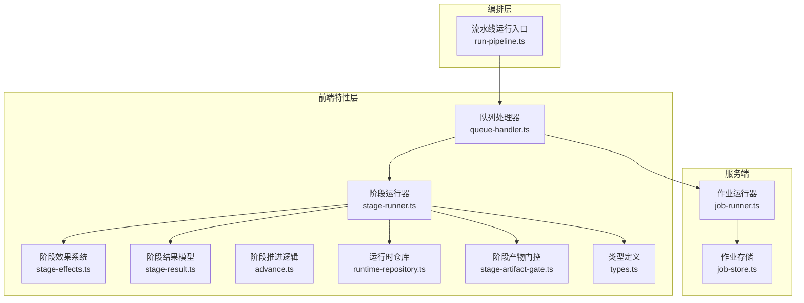

图表来源
- [stage-runner.ts:1-200](file://src/features/director/stage-runner.ts#L1-L200)
- [stage-effects.ts:1-200](file://src/features/director/stage-effects.ts#L1-L200)
- [stage-result.ts:1-200](file://src/features/director/stage-result.ts#L1-L200)
- [advance.ts:1-200](file://src/features/director/advance.ts#L1-L200)
- [queue-handler.ts:1-200](file://src/features/director/queue-handler.ts#L1-L200)
- [runtime-repository.ts:1-200](file://src/features/director/runtime-repository.ts#L1-L200)
- [stage-artifact-gate.ts:1-200](file://src/features/director/stage-artifact-gate.ts#L1-L200)
- [job-runner.ts:1-200](file://server/src/server/job-runner.ts#L1-L200)
- [job-store.ts:1-200](file://server/src/server/job-store.ts#L1-L200)
- [run-pipeline.ts:1-200](file://server/src/compose/run-pipeline.ts#L1-L200)

章节来源
- [stage-runner.ts:1-200](file://src/features/director/stage-runner.ts#L1-L200)
- [pipeline.ts:1-200](file://src/features/director/pipeline.ts#L1-L200)
- [run-pipeline.ts:1-200](file://server/src/compose/run-pipeline.ts#L1-L200)

## 核心组件
- 阶段运行器（Stage Runner）：负责加载阶段实现、执行阶段、捕获异常、触发效果、提交结果、管理超时与取消
- 阶段效果系统（Stage Effects）：统一注册与执行副作用（如写产物、更新状态、发送事件），支持幂等与回滚
- 阶段结果模型（Stage Result）：标准化阶段输出结构，包含成功/失败分支、元数据与校验信息
- 阶段推进逻辑（Advance）：基于前置条件与产物门控，决定下一阶段是否可执行
- 队列处理器（Queue Handler）：消费任务队列，协调并发与限流，驱动运行器
- 运行时仓库（Runtime Repository）：读写阶段运行期数据（输入、中间产物、日志、进度）
- 阶段产物门控（Artifact Gate）：确保下游阶段仅在所需产物就绪时执行
- 作业运行器与存储（Job Runner & Store）：服务端侧的作业调度与持久化

章节来源
- [stage-runner.ts:1-200](file://src/features/director/stage-runner.ts#L1-L200)
- [stage-effects.ts:1-200](file://src/features/director/stage-effects.ts#L1-L200)
- [stage-result.ts:1-200](file://src/features/director/stage-result.ts#L1-L200)
- [advance.ts:1-200](file://src/features/director/advance.ts#L1-L200)
- [queue-handler.ts:1-200](file://src/features/director/queue-handler.ts#L1-L200)
- [runtime-repository.ts:1-200](file://src/features/director/runtime-repository.ts#L1-L200)
- [stage-artifact-gate.ts:1-200](file://src/features/director/stage-artifact-gate.ts#L1-L200)
- [job-runner.ts:1-200](file://server/src/server/job-runner.ts#L1-L200)
- [job-store.ts:1-200](file://server/src/server/job-store.ts#L1-L200)

## 架构总览
阶段管理的整体流程从编排层启动流水线，进入队列处理器后由阶段运行器执行具体阶段。运行器在受控环境中调用阶段函数，期间通过效果系统完成副作用，并通过运行时仓库持久化中间状态。推进逻辑根据产物门控与前置条件决定下一步。

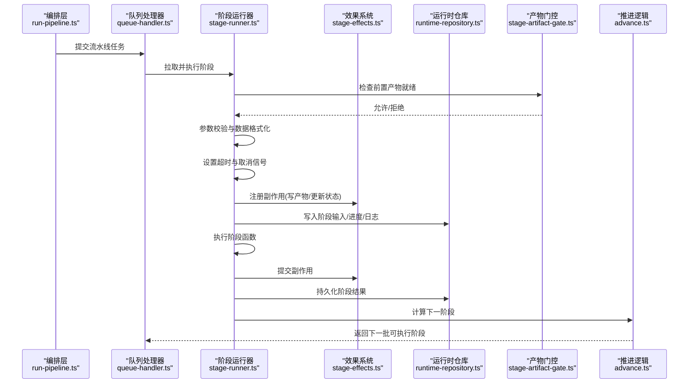

图表来源
- [run-pipeline.ts:1-200](file://server/src/compose/run-pipeline.ts#L1-L200)
- [queue-handler.ts:1-200](file://src/features/director/queue-handler.ts#L1-L200)
- [stage-runner.ts:1-200](file://src/features/director/stage-runner.ts#L1-L200)
- [stage-effects.ts:1-200](file://src/features/director/stage-effects.ts#L1-L200)
- [runtime-repository.ts:1-200](file://src/features/director/runtime-repository.ts#L1-L200)
- [stage-artifact-gate.ts:1-200](file://src/features/director/stage-artifact-gate.ts#L1-L200)
- [advance.ts:1-200](file://src/features/director/advance.ts#L1-L200)

## 详细组件分析

### 阶段运行器（Stage Runner）
- 职责
  - 加载阶段实现，解析阶段配置
  - 执行阶段函数，捕获异常并转换为标准结果
  - 管理超时、取消与重试
  - 触发效果系统与结果提交
- 关键行为
  - 参数校验与数据格式化：在进入阶段前对输入进行规范化，确保类型与约束正确
  - 超时控制：为每个阶段设置最大执行时间，超时时中断并标记失败
  - 取消机制：监听取消信号，及时释放资源并回滚未提交的副作用
  - 重试策略：对可重试错误按指数退避重试，限制最大次数
- 错误处理
  - 将运行时异常分类为可恢复/不可恢复，记录诊断信息
  - 失败时保留部分中间状态以便后续恢复

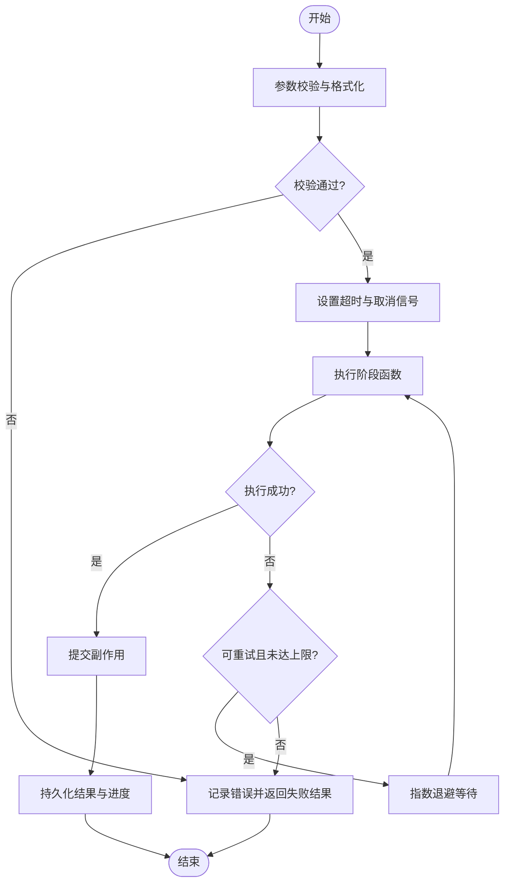

图表来源
- [stage-runner.ts:1-200](file://src/features/director/stage-runner.ts#L1-L200)

章节来源
- [stage-runner.ts:1-200](file://src/features/director/stage-runner.ts#L1-L200)

### 阶段效果系统（Stage Effects）
- 职责
  - 统一注册与执行副作用（写产物、更新状态、发送事件）
  - 保证副作用的幂等性与可回滚性
  - 提供事务式提交，失败时自动回滚
- 设计要点
  - 副作用注册阶段：在执行阶段函数之前收集所有副作用
  - 提交阶段：原子提交，任一失败则全部回滚
  - 资源清理：确保文件句柄、网络连接等在完成后释放

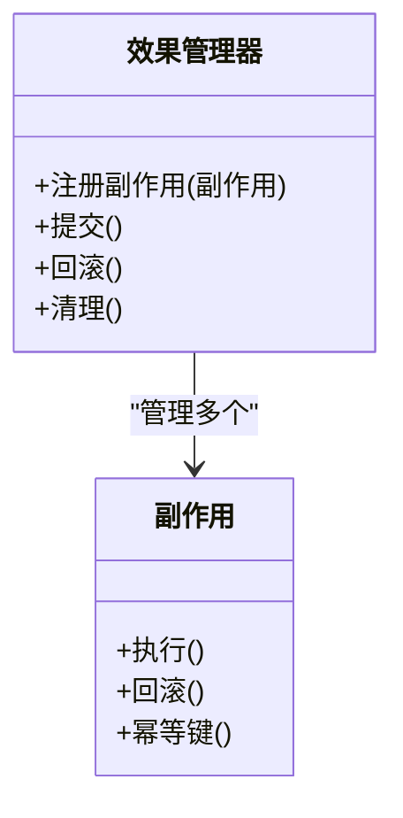

图表来源
- [stage-effects.ts:1-200](file://src/features/director/stage-effects.ts#L1-L200)

章节来源
- [stage-effects.ts:1-200](file://src/features/director/stage-effects.ts#L1-L200)

### 阶段结果模型（Stage Result）
- 职责
  - 标准化阶段输出结构，包含成功/失败分支、元数据与校验信息
- 字段说明
  - 状态：成功/失败/进行中
  - 数据：成功时的产物或中间结果
  - 错误：失败时的错误码与消息
  - 元数据：耗时、重试次数、追踪ID等

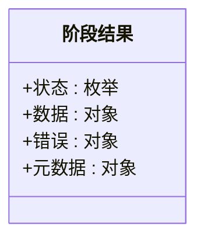

图表来源
- [stage-result.ts:1-200](file://src/features/director/stage-result.ts#L1-L200)

章节来源
- [stage-result.ts:1-200](file://src/features/director/stage-result.ts#L1-L200)

### 阶段推进逻辑（Advance）
- 职责
  - 基于前置条件与产物门控，决定下一阶段是否可执行
- 算法要点
  - 拓扑排序：确保依赖顺序
  - 门控检查：下游阶段所需产物是否就绪
  - 资源配额：根据并发限制选择下一批阶段

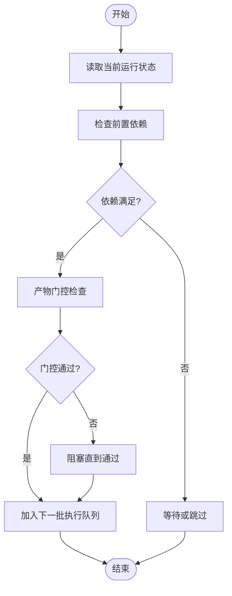

图表来源
- [advance.ts:1-200](file://src/features/director/advance.ts#L1-L200)

章节来源
- [advance.ts:1-200](file://src/features/director/advance.ts#L1-L200)

### 队列处理器（Queue Handler）
- 职责
  - 消费任务队列，协调并发与限流
  - 将任务分发给阶段运行器
  - 监控队列健康与背压处理
- 关键行为
  - 并发控制：限制同时执行的阶段数量
  - 优先级：支持高优先级任务插队
  - 背压：当消费者慢时暂停生产者

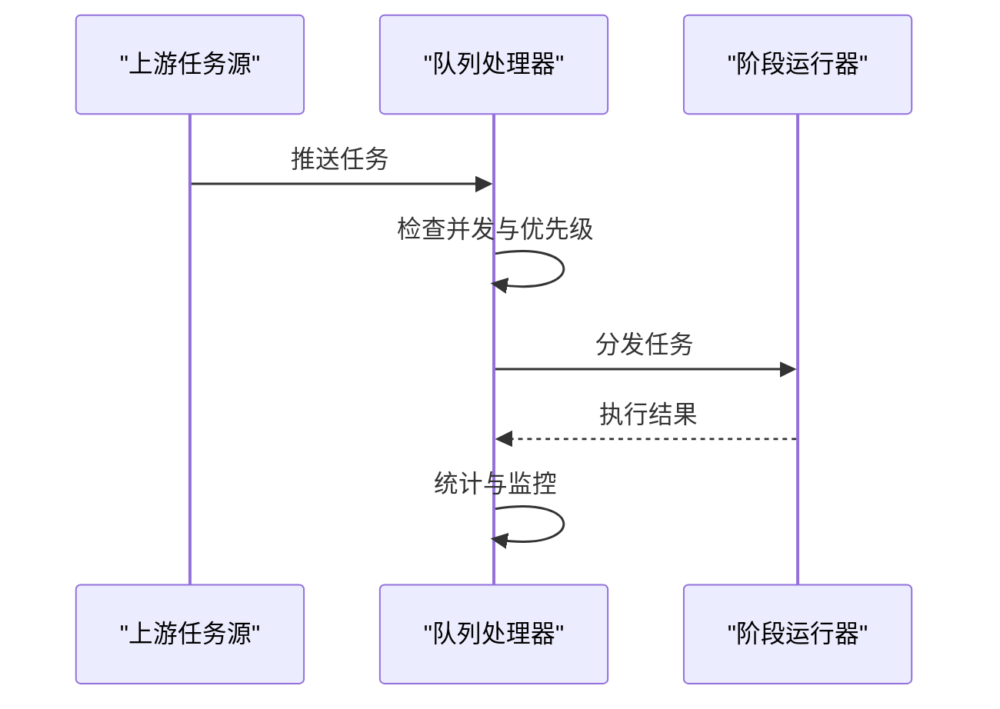

图表来源
- [queue-handler.ts:1-200](file://src/features/director/queue-handler.ts#L1-L200)

章节来源
- [queue-handler.ts:1-200](file://src/features/director/queue-handler.ts#L1-L200)

### 运行时仓库（Runtime Repository）
- 职责
  - 读写阶段运行期数据（输入、中间产物、日志、进度）
- 操作
  - 写入阶段输入与进度
  - 持久化阶段结果与日志
  - 查询运行状态用于恢复与调试

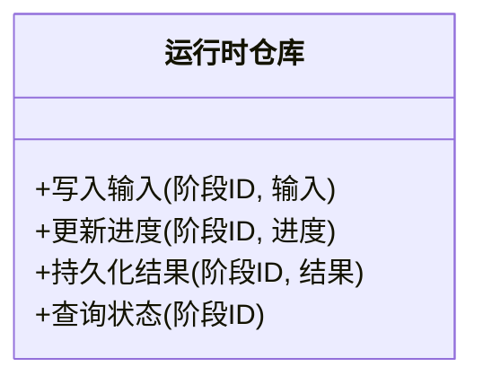

图表来源
- [runtime-repository.ts:1-200](file://src/features/director/runtime-repository.ts#L1-L200)

章节来源
- [runtime-repository.ts:1-200](file://src/features/director/runtime-repository.ts#L1-L200)

### 阶段产物门控（Artifact Gate）
- 职责
  - 确保下游阶段仅在所需产物就绪时执行
- 行为
  - 检查产物是否存在且有效
  - 等待或阻塞直到产物可用
  - 失败时通知上游重新生成

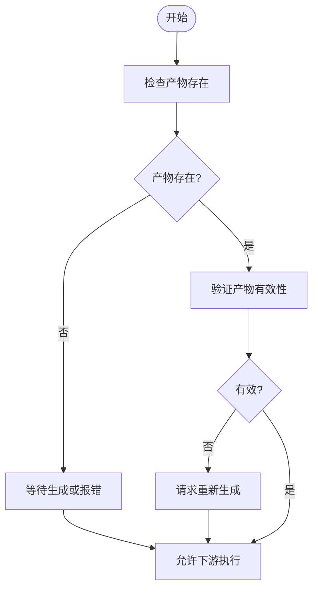

图表来源
- [stage-artifact-gate.ts:1-200](file://src/features/director/stage-artifact-gate.ts#L1-L200)

章节来源
- [stage-artifact-gate.ts:1-200](file://src/features/director/stage-artifact-gate.ts#L1-L200)

### 作业运行器与存储（Job Runner & Store）
- 职责
  - 服务端侧的作业调度与持久化
  - 与前端队列处理器协作，保证跨进程一致性
- 行为
  - 接收流水线任务并持久化
  - 调度执行并更新状态
  - 提供查询接口用于前端展示

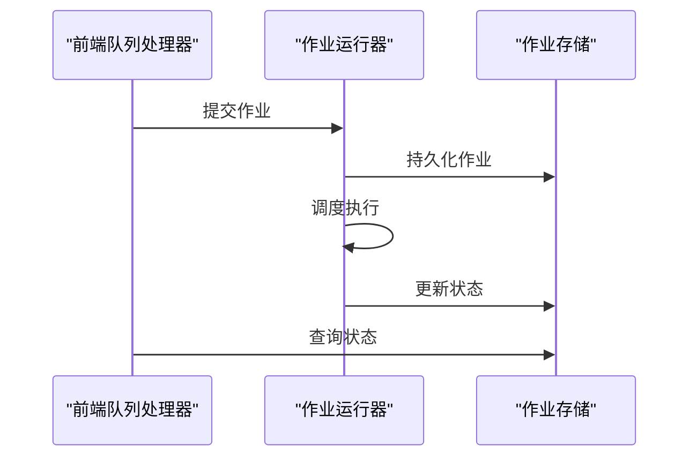

图表来源
- [job-runner.ts:1-200](file://server/src/server/job-runner.ts#L1-L200)
- [job-store.ts:1-200](file://server/src/server/job-store.ts#L1-L200)

章节来源
- [job-runner.ts:1-200](file://server/src/server/job-runner.ts#L1-L200)
- [job-store.ts:1-200](file://server/src/server/job-store.ts#L1-L200)

## 依赖关系分析
阶段管理系统各组件之间的依赖关系如下：

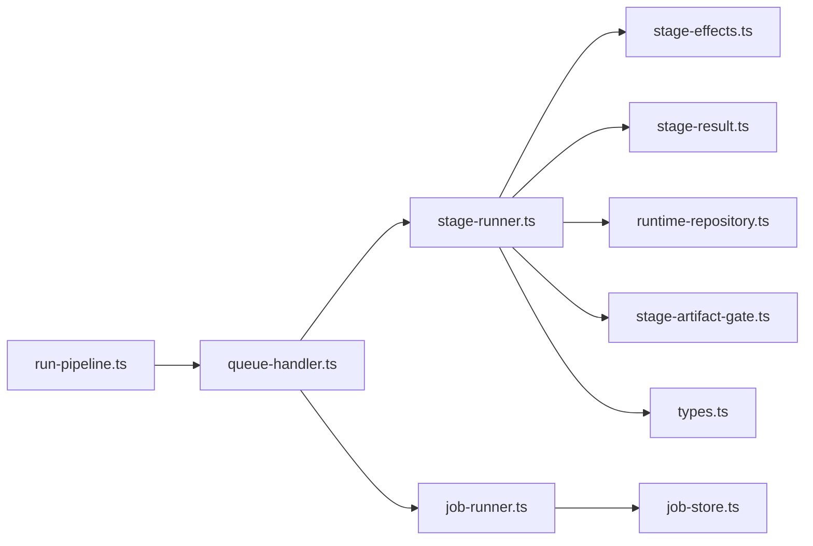

图表来源
- [run-pipeline.ts:1-200](file://server/src/compose/run-pipeline.ts#L1-L200)
- [queue-handler.ts:1-200](file://src/features/director/queue-handler.ts#L1-L200)
- [stage-runner.ts:1-200](file://src/features/director/stage-runner.ts#L1-L200)
- [stage-effects.ts:1-200](file://src/features/director/stage-effects.ts#L1-L200)
- [stage-result.ts:1-200](file://src/features/director/stage-result.ts#L1-L200)
- [runtime-repository.ts:1-200](file://src/features/director/runtime-repository.ts#L1-L200)
- [stage-artifact-gate.ts:1-200](file://src/features/director/stage-artifact-gate.ts#L1-L200)
- [types.ts:1-200](file://src/features/director/types.ts#L1-L200)
- [job-runner.ts:1-200](file://server/src/server/job-runner.ts#L1-L200)
- [job-store.ts:1-200](file://server/src/server/job-store.ts#L1-L200)

章节来源
- [pipeline.ts:1-200](file://src/features/director/pipeline.ts#L1-L200)
- [types.ts:1-200](file://src/features/director/types.ts#L1-L200)

## 性能考量
- 并发控制：合理设置阶段并发度，避免资源争用
- 缓存策略：对重复输入的结果进行缓存，减少重复计算
- 批量处理：合并小任务为批量，降低开销
- 内存管理：及时释放大对象引用，避免内存泄漏
- I/O 优化：使用异步 I/O，避免阻塞执行线程

## 故障排查指南
- 常见问题
  - 阶段超时：检查阶段函数是否长时间阻塞，调整超时阈值
  - 产物缺失：确认上游阶段是否正确生成产物，检查门控逻辑
  - 副作用失败：查看效果系统的回滚日志，定位失败点
  - 队列积压：监控队列长度与消费者速度，调整并发配置
- 调试技巧
  - 启用详细日志：记录阶段输入、输出与中间状态
  - 使用追踪ID：贯穿整个执行链路，便于问题定位
  - 模拟环境：使用 Mock 数据隔离外部依赖
  - 逐步执行：单步调试阶段函数，观察状态变化

## 结论
PurpleInk 的阶段管理系统通过清晰的组件划分与严格的契约定义，实现了可靠、可扩展的阶段执行框架。借助效果系统、产物门控与运行时仓库，系统能够优雅地处理副作用、依赖管理与状态持久化。结合重试、超时与取消机制，系统在复杂场景下仍能保持稳定。开发者可依据本文档快速理解系统架构并高效开发自定义阶段。

## 附录
- 自定义阶段开发指南
  - 定义阶段输入输出契约：明确数据类型、必填字段与约束
  - 实现阶段函数：遵循幂等原则，正确处理错误
  - 注册副作用：使用效果系统统一管理副作用
  - 编写测试用例：覆盖正常路径、边界条件与错误场景
  - 调试与监控：添加日志与追踪，便于问题定位
- 测试方法
  - 单元测试：针对阶段函数与工具函数进行测试
  - 集成测试：验证阶段间的数据流转与依赖关系
  - 端到端测试：模拟完整流水线执行，验证最终结果
- 调试技巧
  - 使用断点调试：逐步执行阶段函数，观察变量状态
  - 导出运行快照：保存中间状态用于复现问题
  - 分析日志：关注错误堆栈与警告信息
  - 性能分析：识别瓶颈与热点代码，进行优化