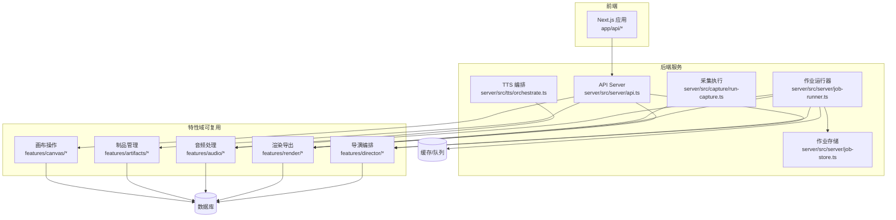
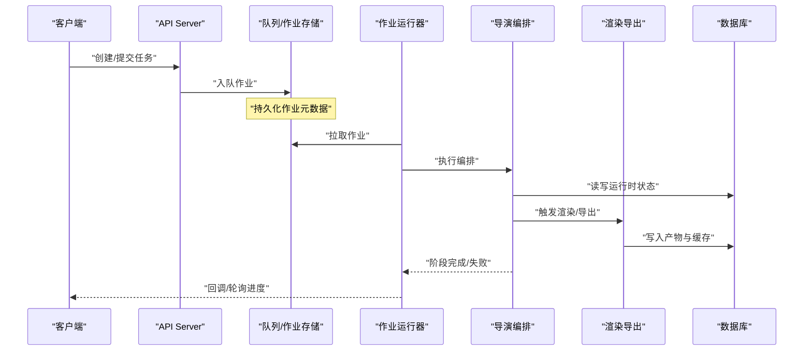
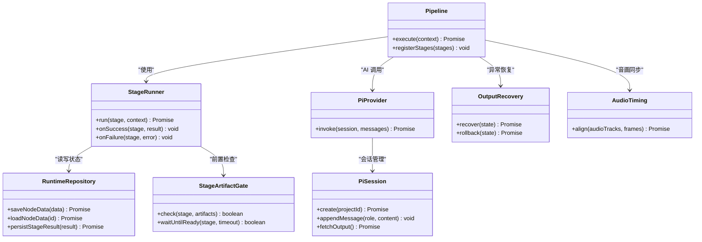
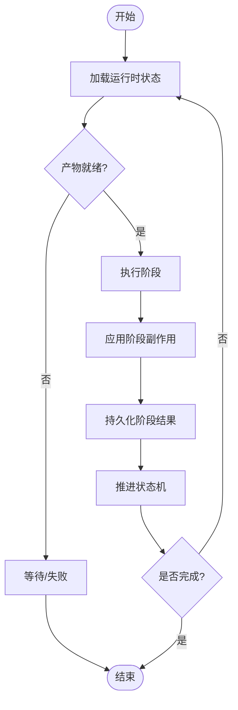
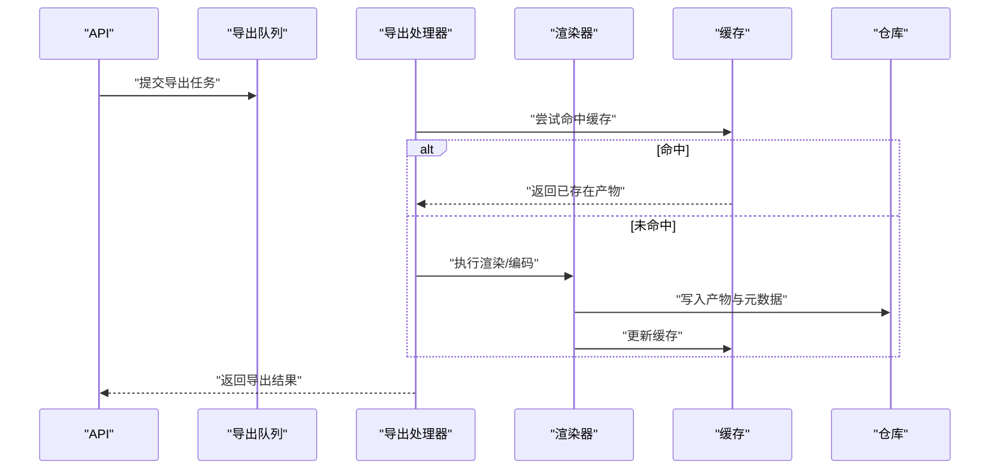
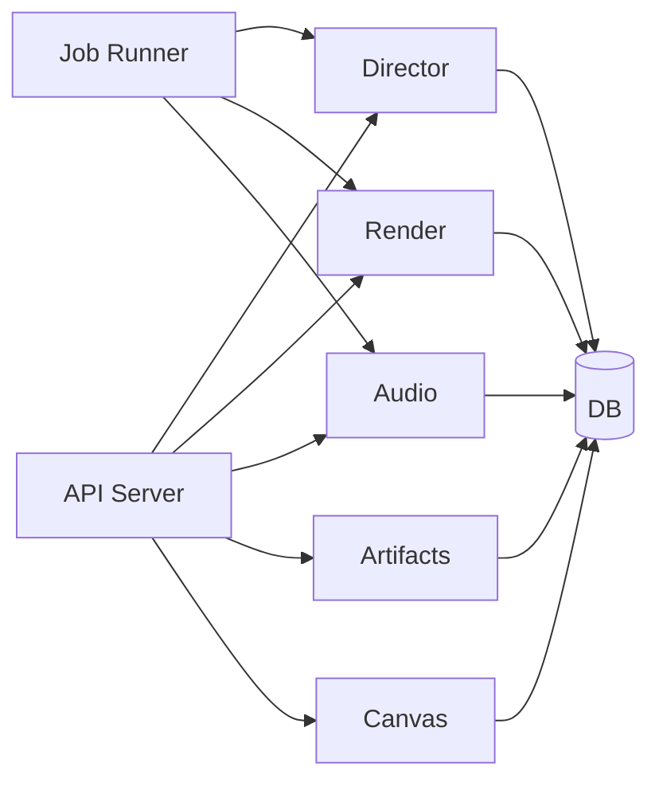

# 服务层架构

<cite>
**本文引用的文件**   
- [src/features/director/index.ts](file://src/features/director/index.ts)
- [src/features/director/pipeline.ts](file://src/features/director/pipeline.ts)
- [src/features/director/advance.ts](file://src/features/director/advance.ts)
- [src/features/director/runtime-repository.ts](file://src/features/director/runtime-repository.ts)
- [src/features/director/stage-runner.ts](file://src/features/director/stage-runner.ts)
- [src/features/director/stage-result.ts](file://src/features/director/stage-result.ts)
- [src/features/director/stage-effects.ts](file://src/features/director/stage-effects.ts)
- [src/features/director/stage-artifact-gate.ts](file://src/features/director/stage-artifact-gate.ts)
- [src/features/director/session-store.ts](file://src/features/director/session-store.ts)
- [src/features/director/pi-provider.ts](file://src/features/director/pi-provider.ts)
- [src/features/director/pi-session.ts](file://src/features/director/pi-session.ts)
- [src/features/director/pi-messages.ts](file://src/features/director/pi-messages.ts)
- [src/features/director/pi-output.ts](file://src/features/director/pi-output.ts)
- [src/features/director/output-recovery.ts](file://src/features/director/output-recovery.ts)
- [src/features/director/audio-timing.ts](file://src/features/director/audio-timing.ts)
- [src/features/director/fabricate.ts](file://src/features/director/fabricate.ts)
- [src/features/director/runtime-artifact-reader.ts](file://src/features/director/runtime-artifact-reader.ts)
- [src/features/director/runtime-artifact-writer.ts](file://src/features/director/runtime-artifact-writer.ts)
- [src/features/director/runtime-node-data.ts](file://src/features/director/runtime-node-data.ts)
- [src/features/render/renderer.ts](file://src/features/render/renderer.ts)
- [src/features/render/export-service.ts](file://src/features/render/export-service.ts)
- [src/features/render/repository.ts](file://src/features/render/repository.ts)
- [src/features/render/cache.ts](file://src/features/render/cache.ts)
- [src/features/render/queue-handler.ts](file://src/features/render/queue-handler.ts)
- [src/features/render/export-queue-handler.ts](file://src/features/render/export-queue-handler.ts)
- [src/features/artifacts/service.ts](file://src/features/artifacts/service.ts)
- [src/features/artifacts/commit.ts](file://src/features/artifacts/commit.ts)
- [src/features/audio/narration.ts](file://src/features/audio/narration.ts)
- [src/features/audio/repository.ts](file://src/features/audio/repository.ts)
- [src/features/audio/runtime-repository.ts](file://src/features/audio/runtime-repository.ts)
- [src/features/audio/sfx.ts](file://src/features/audio/sfx.ts)
- [src/features/audio/subtitle.ts](file://src/features/audio/subtitle.ts)
- [src/features/canvas/actions.ts](file://src/features/canvas/actions.ts)
- [src/features/canvas/queries.ts](file://src/features/canvas/queries.ts)
- [src/features/canvas/types.ts](file://src/features/canvas/types.ts)
- [src/lib/queue/index.ts](file://src/lib/queue/index.ts)
- [server/src/server/api.ts](file://server/src/server/api.ts)
- [server/src/server/job-runner.ts](file://server/src/server/job-runner.ts)
- [server/src/server/job-store.ts](file://server/src/server/job-store.ts)
- [server/src/compose/run-pipeline.ts](file://server/src/compose/run-pipeline.ts)
- [server/src/compose/render.ts](file://server/src/compose/render.ts)
- [server/src/tts/orchestrate.ts](file://server/src/tts/orchestrate.ts)
- [server/src/tts/narration.ts](file://server/src/tts/narration.ts)
- [server/src/tts/media.ts](file://server/src/tts/media.ts)
- [server/src/tts/listenhub.ts](file://server/src/tts/listenhub.ts)
- [server/src/capture/run-capture.ts](file://server/src/capture/run-capture.ts)
- [server/src/capture/playwright-driver.ts](file://server/src/capture/playwright-driver.ts)
- [server/src/lib/load-env.ts](file://server/src/lib/load-env.ts)
- [server/src/lib/logger.ts](file://server/src/lib/logger.ts)
- [drizzle.config.ts](file://drizzle.config.ts)
</cite>

## 目录
1. [简介](#简介)
2. [项目结构](#项目结构)
3. [核心组件](#核心组件)
4. [架构总览](#架构总览)
5. [详细组件分析](#详细组件分析)
6. [依赖关系分析](#依赖关系分析)
7. [性能考量](#性能考量)
8. [故障排查指南](#故障排查指南)
9. [结论](#结论)
10. [附录](#附录)

## 简介
本文件面向 PurpleInk 的服务层架构，聚焦业务逻辑封装模式、服务类设计、依赖注入机制、领域驱动设计在业务层的体现、实体关系建模与业务规则验证、服务间通信与事件驱动架构、事务管理与数据一致性、错误恢复策略、配置与环境适配以及扩展点设计。文档以“特性域（feature）”为组织单元，围绕导演编排（Director）、渲染导出（Render）、音频（Audio）、制品（Artifacts）、画布（Canvas）等核心域展开，并结合服务端 API、作业调度与 TTS/采集子系统，给出端到端的流程视图。

## 项目结构
PurpleInk 采用前后端分离与多进程部署：前端 Next.js 应用通过 API 路由调用后端服务；后端包含 Node.js 服务（API、作业运行器、TTS/采集子系统等），并通过共享的 features 库实现跨进程的业务能力复用。数据库迁移与配置由脚本与配置文件管理。

图表来源
- [server/src/server/api.ts](file://server/src/server/api.ts)
- [server/src/server/job-runner.ts](file://server/src/server/job-runner.ts)
- [server/src/server/job-store.ts](file://server/src/server/job-store.ts)
- [server/src/tts/orchestrate.ts](file://server/src/tts/orchestrate.ts)
- [server/src/capture/run-capture.ts](file://server/src/capture/run-capture.ts)
- [src/features/director/index.ts](file://src/features/director/index.ts)
- [src/features/render/renderer.ts](file://src/features/render/renderer.ts)
- [src/features/audio/narration.ts](file://src/features/audio/narration.ts)
- [src/features/artifacts/service.ts](file://src/features/artifacts/service.ts)
- [src/features/canvas/actions.ts](file://src/features/canvas/actions.ts)

章节来源
- [server/src/server/api.ts](file://server/src/server/api.ts)
- [server/src/server/job-runner.ts](file://server/src/server/job-runner.ts)
- [server/src/server/job-store.ts](file://server/src/server/job-store.ts)
- [server/src/lib/load-env.ts](file://server/src/lib/load-env.ts)
- [drizzle.config.ts](file://drizzle.config.ts)

## 核心组件
- 导演编排（Director）：负责分阶段流水线编排、状态推进、产物门控、会话持久化与 AI 交互桥接。
- 渲染导出（Render）：负责帧捕获、编码、缩略图生成、QA 检查、缓存与导出队列。
- 音频（Audio）：负责旁白、音效、字幕与运行时元数据存取。
- 制品（Artifacts）：负责版本提交、变更追踪与一致性校验。
- 画布（Canvas）：负责画布动作、查询与类型契约。
- 作业系统（Job System）：负责任务入队、执行、结果落库与重试恢复。
- TTS/采集：负责文本转语音与浏览器采集执行。

章节来源
- [src/features/director/index.ts](file://src/features/director/index.ts)
- [src/features/render/renderer.ts](file://src/features/render/renderer.ts)
- [src/features/audio/narration.ts](file://src/features/audio/narration.ts)
- [src/features/artifacts/service.ts](file://src/features/artifacts/service.ts)
- [src/features/canvas/actions.ts](file://src/features/canvas/actions.ts)
- [server/src/server/job-runner.ts](file://server/src/server/job-runner.ts)
- [server/src/tts/orchestrate.ts](file://server/src/tts/orchestrate.ts)
- [server/src/capture/run-capture.ts](file://server/src/capture/run-capture.ts)

## 架构总览
服务层遵循“特性域 + 基础设施”的分层设计。API 路由作为入口，将请求委派给对应特性域服务；作业运行器异步消费队列，驱动长耗时任务（渲染、导出、TTS、采集）。特性域之间通过明确的接口与消息协议协作，避免紧耦合。

图表来源
- [server/src/server/api.ts](file://server/src/server/api.ts)
- [server/src/server/job-runner.ts](file://server/src/server/job-runner.ts)
- [server/src/server/job-store.ts](file://server/src/server/job-store.ts)
- [src/features/director/index.ts](file://src/features/director/index.ts)
- [src/features/render/renderer.ts](file://src/features/render/renderer.ts)

## 详细组件分析

### 导演编排（Director）
- 职责：定义阶段（Stage）生命周期、推进状态机、产物门控、AI 会话与消息桥接、输出恢复与音频时序对齐。
- 关键模块：
  - 流水线与阶段运行器：编排阶段顺序、并行度与副作用。
  - 运行时仓库：持久化节点数据、阶段结果与会话上下文。
  - 产物门控：确保上游产物就绪后再进入下游阶段。
  - 会话与消息：封装 AI Provider 调用、消息格式与输出解析。
  - 输出恢复：从断点恢复或回滚不一致状态。
  - 音频时序：协调旁白/音效与画面时间线。

图表来源
- [src/features/director/pipeline.ts](file://src/features/director/pipeline.ts)
- [src/features/director/stage-runner.ts](file://src/features/director/stage-runner.ts)
- [src/features/director/runtime-repository.ts](file://src/features/director/runtime-repository.ts)
- [src/features/director/stage-artifact-gate.ts](file://src/features/director/stage-artifact-gate.ts)
- [src/features/director/pi-provider.ts](file://src/features/director/pi-provider.ts)
- [src/features/director/pi-session.ts](file://src/features/director/pi-session.ts)
- [src/features/director/output-recovery.ts](file://src/features/director/output-recovery.ts)
- [src/features/director/audio-timing.ts](file://src/features/director/audio-timing.ts)

章节来源
- [src/features/director/index.ts](file://src/features/director/index.ts)
- [src/features/director/pipeline.ts](file://src/features/director/pipeline.ts)
- [src/features/director/advance.ts](file://src/features/director/advance.ts)
- [src/features/director/runtime-repository.ts](file://src/features/director/runtime-repository.ts)
- [src/features/director/stage-runner.ts](file://src/features/director/stage-runner.ts)
- [src/features/director/stage-result.ts](file://src/features/director/stage-result.ts)
- [src/features/director/stage-effects.ts](file://src/features/director/stage-effects.ts)
- [src/features/director/stage-artifact-gate.ts](file://src/features/director/stage-artifact-gate.ts)
- [src/features/director/session-store.ts](file://src/features/director/session-store.ts)
- [src/features/director/pi-provider.ts](file://src/features/director/pi-provider.ts)
- [src/features/director/pi-session.ts](file://src/features/director/pi-session.ts)
- [src/features/director/pi-messages.ts](file://src/features/director/pi-messages.ts)
- [src/features/director/pi-output.ts](file://src/features/director/pi-output.ts)
- [src/features/director/output-recovery.ts](file://src/features/director/output-recovery.ts)
- [src/features/director/audio-timing.ts](file://src/features/director/audio-timing.ts)
- [src/features/director/fabricate.ts](file://src/features/director/fabricate.ts)
- [src/features/director/runtime-artifact-reader.ts](file://src/features/director/runtime-artifact-reader.ts)
- [src/features/director/runtime-artifact-writer.ts](file://src/features/director/runtime-artifact-writer.ts)
- [src/features/director/runtime-node-data.ts](file://src/features/director/runtime-node-data.ts)

#### 阶段推进流程图

图表来源
- [src/features/director/advance.ts](file://src/features/director/advance.ts)
- [src/features/director/stage-runner.ts](file://src/features/director/stage-runner.ts)
- [src/features/director/stage-result.ts](file://src/features/director/stage-result.ts)

### 渲染导出（Render）
- 职责：帧捕获、编码、缩略图生成、视觉 QA、缓存命中、导出队列与持久化。
- 关键模块：
  - 渲染器：编排帧序列、并发控制与错误边界。
  - 仓库：渲染任务与产物元数据的 CRUD。
  - 缓存：基于键值的中间结果缓存，减少重复计算。
  - 队列处理器：串行/并行消费导出任务，保障吞吐与稳定性。

图表来源
- [src/features/render/renderer.ts](file://src/features/render/renderer.ts)
- [src/features/render/repository.ts](file://src/features/render/repository.ts)
- [src/features/render/cache.ts](file://src/features/render/cache.ts)
- [src/features/render/queue-handler.ts](file://src/features/render/queue-handler.ts)
- [src/features/render/export-queue-handler.ts](file://src/features/render/export-queue-handler.ts)

章节来源
- [src/features/render/renderer.ts](file://src/features/render/renderer.ts)
- [src/features/render/export-service.ts](file://src/features/render/export-service.ts)
- [src/features/render/repository.ts](file://src/features/render/repository.ts)
- [src/features/render/cache.ts](file://src/features/render/cache.ts)
- [src/features/render/queue-handler.ts](file://src/features/render/queue-handler.ts)
- [src/features/render/export-queue-handler.ts](file://src/features/render/export-queue-handler.ts)

### 音频（Audio）
- 职责：旁白生成、音效合成、字幕生成与运行时元数据存取。
- 关键模块：
  - 旁白：文本到语音管线与时长估算。
  - 运行时仓库：保存音频轨道、时间戳与对齐信息。
  - 音效/字幕：辅助资源生成与校验。

章节来源
- [src/features/audio/narration.ts](file://src/features/audio/narration.ts)
- [src/features/audio/repository.ts](file://src/features/audio/repository.ts)
- [src/features/audio/runtime-repository.ts](file://src/features/audio/runtime-repository.ts)
- [src/features/audio/sfx.ts](file://src/features/audio/sfx.ts)
- [src/features/audio/subtitle.ts](file://src/features/audio/subtitle.ts)

### 制品（Artifacts）
- 职责：版本提交、变更追踪、一致性校验与快照管理。
- 关键模块：
  - 服务：对外暴露提交、查询、对比等操作。
  - 提交：原子性写入与校验和生成。

章节来源
- [src/features/artifacts/service.ts](file://src/features/artifacts/service.ts)
- [src/features/artifacts/commit.ts](file://src/features/artifacts/commit.ts)

### 画布（Canvas）
- 职责：画布动作编排、查询与类型契约，支撑可视化编辑与状态同步。
- 关键模块：
  - 动作：增删改查与批量操作。
  - 查询：高效读取与投影。
  - 类型：统一数据结构与约束。

章节来源
- [src/features/canvas/actions.ts](file://src/features/canvas/actions.ts)
- [src/features/canvas/queries.ts](file://src/features/canvas/queries.ts)
- [src/features/canvas/types.ts](file://src/features/canvas/types.ts)

### 作业系统与 TTS/采集
- 作业系统：API 入队、运行器拉取、执行与结果回写，支持重试与幂等。
- TTS：编排文本分段、语音合成、媒体封装与监听分发。
- 采集：浏览器驱动执行页面抓取与截图/录屏。

章节来源
- [server/src/server/job-runner.ts](file://server/src/server/job-runner.ts)
- [server/src/server/job-store.ts](file://server/src/server/job-store.ts)
- [server/src/tts/orchestrate.ts](file://server/src/tts/orchestrate.ts)
- [server/src/tts/narration.ts](file://server/src/tts/narration.ts)
- [server/src/tts/media.ts](file://server/src/tts/media.ts)
- [server/src/tts/listenhub.ts](file://server/src/tts/listenhub.ts)
- [server/src/capture/run-capture.ts](file://server/src/capture/run-capture.ts)
- [server/src/capture/playwright-driver.ts](file://server/src/capture/playwright-driver.ts)

## 依赖关系分析
- 松耦合：特性域通过接口与消息协议交互，避免直接引用实现细节。
- 分层清晰：API/作业运行器位于基础设施层，特性域位于业务层，数据访问通过仓库抽象。
- 外部依赖：数据库（Drizzle ORM）、队列/缓存（抽象接口）、AI 提供商（适配器模式）、浏览器驱动（Playwright）。

图表来源
- [server/src/server/api.ts](file://server/src/server/api.ts)
- [server/src/server/job-runner.ts](file://server/src/server/job-runner.ts)
- [src/features/director/index.ts](file://src/features/director/index.ts)
- [src/features/render/renderer.ts](file://src/features/render/renderer.ts)
- [src/features/audio/narration.ts](file://src/features/audio/narration.ts)
- [src/features/artifacts/service.ts](file://src/features/artifacts/service.ts)
- [src/features/canvas/actions.ts](file://src/features/canvas/actions.ts)

章节来源
- [server/src/server/api.ts](file://server/src/server/api.ts)
- [server/src/server/job-runner.ts](file://server/src/server/job-runner.ts)
- [src/features/director/index.ts](file://src/features/director/index.ts)
- [src/features/render/renderer.ts](file://src/features/render/renderer.ts)
- [src/features/audio/narration.ts](file://src/features/audio/narration.ts)
- [src/features/artifacts/service.ts](file://src/features/artifacts/service.ts)
- [src/features/canvas/actions.ts](file://src/features/canvas/actions.ts)

## 性能考量
- 并发与限流：渲染与导出队列采用并发控制，避免资源争用；阶段运行器支持批处理与背压。
- 缓存策略：中间产物与渲染结果按键缓存，命中即返回，降低重复计算。
- I/O 优化：数据库读写批量化、索引优化与只读查询投影；大对象走对象存储。
- 内存管理：流式处理与分块上传/下载，避免一次性加载大文件。
- 可观测性：结构化日志、指标上报与链路追踪，便于定位瓶颈。

## 故障排查指南
- 常见问题
  - 阶段卡住：检查产物门控与上游依赖是否就绪；查看运行时仓库状态。
  - 渲染失败：确认缓存键冲突、编码器参数与输入有效性；查看 QA 检查结果。
  - 导出超时：检查队列积压、并发上限与外部依赖延迟。
  - TTS/采集异常：验证浏览器驱动、网络与凭据配置。
- 诊断步骤
  - 查看作业状态与重试次数；核对错误码与堆栈。
  - 检索结构化日志与指标；定位慢查询与热点路径。
  - 复现实例：最小化输入、隔离依赖、逐步回放阶段。
- 恢复策略
  - 利用输出恢复模块进行断点续跑或回滚。
  - 对幂等接口进行重试；对非幂等操作加分布式锁。

章节来源
- [src/features/director/output-recovery.ts](file://src/features/director/output-recovery.ts)
- [src/features/render/cache.ts](file://src/features/render/cache.ts)
- [src/features/render/queue-handler.ts](file://src/features/render/queue-handler.ts)
- [server/src/server/job-runner.ts](file://server/src/server/job-runner.ts)
- [server/src/lib/logger.ts](file://server/src/lib/logger.ts)

## 结论
PurpleInk 服务层以特性域为核心，结合清晰的作业系统与基础设施抽象，实现了高内聚、低耦合的业务编排。导演编排贯穿阶段生命周期，渲染导出提供稳定高效的媒体处理能力，音频与制品域保障内容与一致性，画布域支撑可视化交互。通过事件驱动与消息传递，系统具备良好的可扩展性与弹性。配合完善的配置管理、错误恢复与可观测性，可在复杂生产环境中稳定运行。

## 附录
- 配置与环境
  - 环境变量加载与默认值；敏感凭据加密存储。
  - 数据库连接与迁移配置。
- 扩展点设计
  - 阶段插件：新增阶段只需注册到流水线并实现接口。
  - 渲染后端：替换编码器或存储后端无需改动上层逻辑。
  - AI 提供商：通过适配器接入新模型。
- 最佳实践
  - 幂等设计与重试语义明确。
  - 输入校验与领域不变量前置检查。
  - 日志与指标覆盖关键路径。

章节来源
- [server/src/lib/load-env.ts](file://server/src/lib/load-env.ts)
- [drizzle.config.ts](file://drizzle.config.ts)
- [src/features/director/pipeline.ts](file://src/features/director/pipeline.ts)
- [src/features/render/renderer.ts](file://src/features/render/renderer.ts)
- [src/features/director/pi-provider.ts](file://src/features/director/pi-provider.ts)