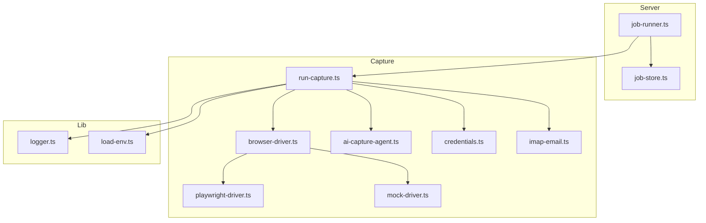
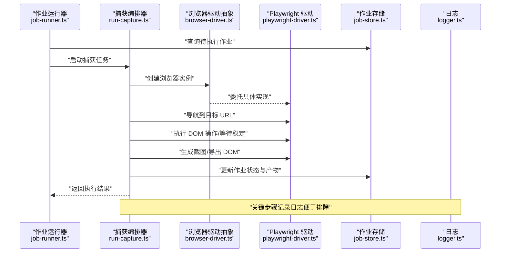
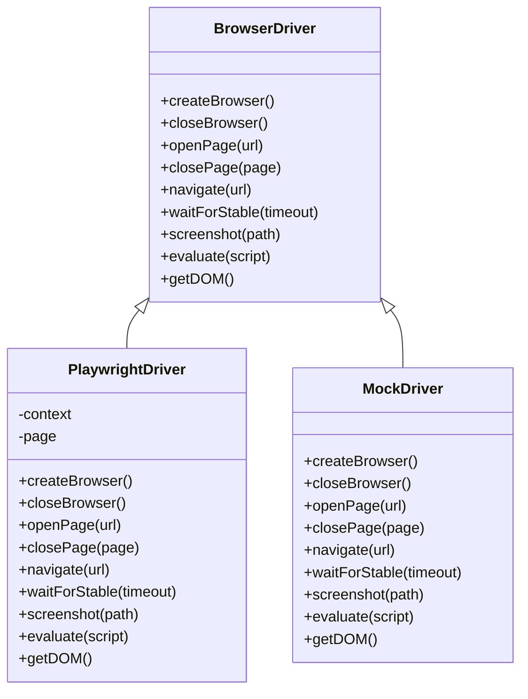
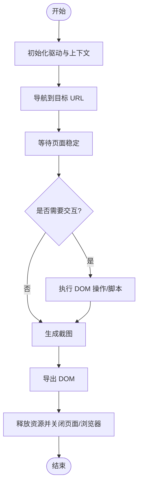
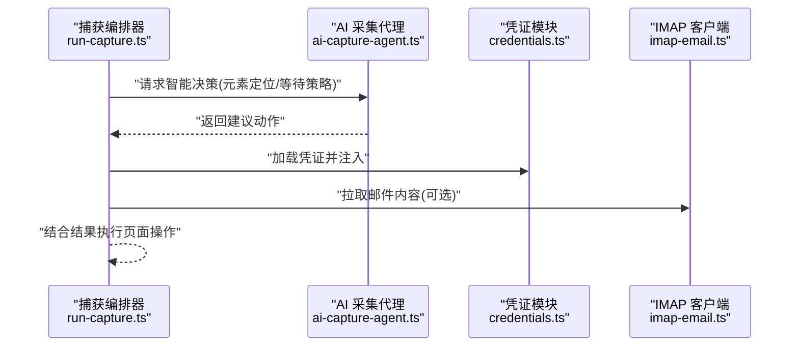
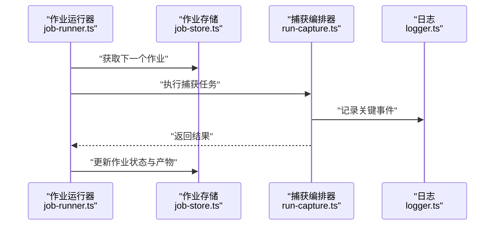
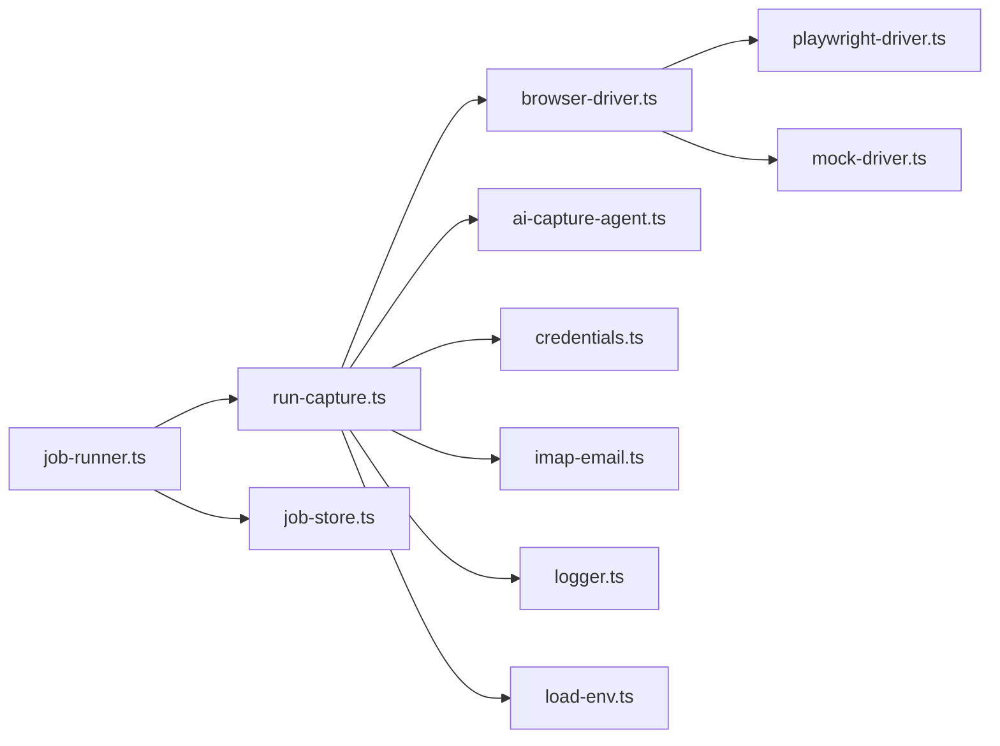

# 浏览器自动化引擎

<cite>
**本文引用的文件**   
- [server/src/capture/browser-driver.ts](file://server/src/capture/browser-driver.ts)
- [server/src/capture/playwright-driver.ts](file://server/src/capture/playwright-driver.ts)
- [server/src/capture/mock-driver.ts](file://server/src/capture/mock-driver.ts)
- [server/src/capture/run-capture.ts](file://server/src/capture/run-capture.ts)
- [server/src/capture/ai-capture-agent.ts](file://server/src/capture/ai-capture-agent.ts)
- [server/src/capture/credentials.ts](file://server/src/capture/credentials.ts)
- [server/src/capture/imap-email.ts](file://server/src/capture/imap-email.ts)
- [server/src/server/job-runner.ts](file://server/src/server/job-runner.ts)
- [server/src/server/job-store.ts](file://server/src/server/job-store.ts)
- [server/src/lib/logger.ts](file://server/src/lib/logger.ts)
- [server/src/lib/load-env.ts](file://server/src/lib/load-env.ts)
- [server/package.json](file://server/package.json)
</cite>

## 目录
1. [简介](#简介)
2. [项目结构](#项目结构)
3. [核心组件](#核心组件)
4. [架构总览](#架构总览)
5. [详细组件分析](#详细组件分析)
6. [依赖关系分析](#依赖关系分析)
7. [性能与并发](#性能与并发)
8. [故障排查指南](#故障排查指南)
9. [结论](#结论)
10. [附录：自定义驱动开发指南](#附录自定义驱动开发指南)

## 简介
本文件为 PurpleInk 浏览器自动化引擎的技术文档，聚焦 Playwright 驱动架构、浏览器实例管理、页面生命周期控制、页面捕获流程（截图生成与 DOM 操作）、配置选项、性能优化、错误处理策略、并发控制、资源清理与内存管理。同时提供自定义浏览器驱动开发与调试技巧，帮助开发者扩展或替换底层驱动能力。

## 项目结构
PurpleInk 的浏览器自动化相关代码集中在 server 子工程内，采用分层组织：
- capture：浏览器驱动抽象与实现、任务编排、凭证与邮件集成等
- server：作业运行器与持久化存储
- lib：日志与环境加载等通用库

**图示来源**
- [server/src/server/job-runner.ts](file://server/src/server/job-runner.ts)
- [server/src/server/job-store.ts](file://server/src/server/job-store.ts)
- [server/src/capture/run-capture.ts](file://server/src/capture/run-capture.ts)
- [server/src/capture/browser-driver.ts](file://server/src/capture/browser-driver.ts)
- [server/src/capture/playwright-driver.ts](file://server/src/capture/playwright-driver.ts)
- [server/src/capture/mock-driver.ts](file://server/src/capture/mock-driver.ts)
- [server/src/capture/ai-capture-agent.ts](file://server/src/capture/ai-capture-agent.ts)
- [server/src/capture/credentials.ts](file://server/src/capture/credentials.ts)
- [server/src/capture/imap-email.ts](file://server/src/capture/imap-email.ts)
- [server/src/lib/logger.ts](file://server/src/lib/logger.ts)
- [server/src/lib/load-env.ts](file://server/src/lib/load-env.ts)

**章节来源**
- [server/src/server/job-runner.ts](file://server/src/server/job-runner.ts)
- [server/src/server/job-store.ts](file://server/src/server/job-store.ts)
- [server/src/capture/run-capture.ts](file://server/src/capture/run-capture.ts)
- [server/src/capture/browser-driver.ts](file://server/src/capture/browser-driver.ts)
- [server/src/capture/playwright-driver.ts](file://server/src/capture/playwright-driver.ts)
- [server/src/capture/mock-driver.ts](file://server/src/capture/mock-driver.ts)
- [server/src/capture/ai-capture-agent.ts](file://server/src/capture/ai-capture-agent.ts)
- [server/src/capture/credentials.ts](file://server/src/capture/credentials.ts)
- [server/src/capture/imap-email.ts](file://server/src/capture/imap-email.ts)
- [server/src/lib/logger.ts](file://server/src/lib/logger.ts)
- [server/src/lib/load-env.ts](file://server/src/lib/load-env.ts)

## 核心组件
- 浏览器驱动抽象层：定义统一的驱动接口，屏蔽具体实现差异
- Playwright 驱动：基于 Playwright 的实际浏览器控制实现
- Mock 驱动：用于测试与无头环境快速验证
- 捕获编排器：协调页面导航、DOM 操作、截图、AI 辅助采集等步骤
- 凭证与邮件集成：支持登录态注入与邮件内容抓取
- 作业运行器与存储：负责任务调度、状态管理与结果持久化
- 日志与环境：统一日志输出与环境变量加载

**章节来源**
- [server/src/capture/browser-driver.ts](file://server/src/capture/browser-driver.ts)
- [server/src/capture/playwright-driver.ts](file://server/src/capture/playwright-driver.ts)
- [server/src/capture/mock-driver.ts](file://server/src/capture/mock-driver.ts)
- [server/src/capture/run-capture.ts](file://server/src/capture/run-capture.ts)
- [server/src/capture/credentials.ts](file://server/src/capture/credentials.ts)
- [server/src/capture/imap-email.ts](file://server/src/capture/imap-email.ts)
- [server/src/server/job-runner.ts](file://server/src/server/job-runner.ts)
- [server/src/server/job-store.ts](file://server/src/server/job-store.ts)
- [server/src/lib/logger.ts](file://server/src/lib/logger.ts)
- [server/src/lib/load-env.ts](file://server/src/lib/load-env.ts)

## 架构总览
整体采用“驱动抽象 + 具体实现”的分层设计，上层通过捕获编排器调用驱动接口，完成页面访问、交互、截图与数据提取；作业运行器负责任务队列与执行上下文管理。

**图示来源**
- [server/src/server/job-runner.ts](file://server/src/server/job-runner.ts)
- [server/src/capture/run-capture.ts](file://server/src/capture/run-capture.ts)
- [server/src/capture/browser-driver.ts](file://server/src/capture/browser-driver.ts)
- [server/src/capture/playwright-driver.ts](file://server/src/capture/playwright-driver.ts)
- [server/src/server/job-store.ts](file://server/src/server/job-store.ts)
- [server/src/lib/logger.ts](file://server/src/lib/logger.ts)

## 详细组件分析

### 浏览器驱动抽象与实现
- 抽象层定义统一方法：创建/关闭浏览器、打开/关闭页面、导航、等待、截图、执行脚本、获取 DOM 等
- Playwright 驱动实现上述接口，封装浏览器上下文、页面句柄、超时与重试策略
- Mock 驱动提供轻量替代，适合单元测试与 CI 环境

**图示来源**
- [server/src/capture/browser-driver.ts](file://server/src/capture/browser-driver.ts)
- [server/src/capture/playwright-driver.ts](file://server/src/capture/playwright-driver.ts)
- [server/src/capture/mock-driver.ts](file://server/src/capture/mock-driver.ts)

**章节来源**
- [server/src/capture/browser-driver.ts](file://server/src/capture/browser-driver.ts)
- [server/src/capture/playwright-driver.ts](file://server/src/capture/playwright-driver.ts)
- [server/src/capture/mock-driver.ts](file://server/src/capture/mock-driver.ts)

### 页面捕获流程与截图生成
- 捕获编排器按阶段组织：初始化驱动、导航、等待稳定、执行脚本、截图、导出 DOM、清理资源
- 截图路径与命名规则由配置决定，支持覆盖默认行为
- DOM 导出可用于后续分析与渲染

**图示来源**
- [server/src/capture/run-capture.ts](file://server/src/capture/run-capture.ts)
- [server/src/capture/playwright-driver.ts](file://server/src/capture/playwright-driver.ts)

**章节来源**
- [server/src/capture/run-capture.ts](file://server/src/capture/run-capture.ts)
- [server/src/capture/playwright-driver.ts](file://server/src/capture/playwright-driver.ts)

### AI 辅助采集与凭证/邮件集成
- AI 采集代理可辅助决策页面元素定位、滚动与截图时机
- 凭证模块支持注入登录态（Cookie/LocalStorage）
- IMAP 集成用于抓取邮件内容与附件，作为输入源之一

**图示来源**
- [server/src/capture/run-capture.ts](file://server/src/capture/run-capture.ts)
- [server/src/capture/ai-capture-agent.ts](file://server/src/capture/ai-capture-agent.ts)
- [server/src/capture/credentials.ts](file://server/src/capture/credentials.ts)
- [server/src/capture/imap-email.ts](file://server/src/capture/imap-email.ts)

**章节来源**
- [server/src/capture/run-capture.ts](file://server/src/capture/run-capture.ts)
- [server/src/capture/ai-capture-agent.ts](file://server/src/capture/ai-capture-agent.ts)
- [server/src/capture/credentials.ts](file://server/src/capture/credentials.ts)
- [server/src/capture/imap-email.ts](file://server/src/capture/imap-email.ts)

### 作业运行与持久化
- 作业运行器从存储读取任务，分配给捕获编排器执行
- 作业存储负责状态变更、产物落盘与失败重试标记
- 日志模块贯穿各层，便于问题追踪

**图示来源**
- [server/src/server/job-runner.ts](file://server/src/server/job-runner.ts)
- [server/src/server/job-store.ts](file://server/src/server/job-store.ts)
- [server/src/capture/run-capture.ts](file://server/src/capture/run-capture.ts)
- [server/src/lib/logger.ts](file://server/src/lib/logger.ts)

**章节来源**
- [server/src/server/job-runner.ts](file://server/src/server/job-runner.ts)
- [server/src/server/job-store.ts](file://server/src/server/job-store.ts)
- [server/src/capture/run-capture.ts](file://server/src/capture/run-capture.ts)
- [server/src/lib/logger.ts](file://server/src/lib/logger.ts)

## 依赖关系分析
- 驱动层对 Playwright 的依赖通过具体实现隔离，抽象层保持低耦合
- 捕获编排器依赖驱动抽象、凭证、IMAP、AI 代理等能力
- 作业运行器依赖存储与日志，不直接感知驱动细节

**图示来源**
- [server/src/server/job-runner.ts](file://server/src/server/job-runner.ts)
- [server/src/capture/run-capture.ts](file://server/src/capture/run-capture.ts)
- [server/src/capture/browser-driver.ts](file://server/src/capture/browser-driver.ts)
- [server/src/capture/playwright-driver.ts](file://server/src/capture/playwright-driver.ts)
- [server/src/capture/mock-driver.ts](file://server/src/capture/mock-driver.ts)
- [server/src/capture/ai-capture-agent.ts](file://server/src/capture/ai-capture-agent.ts)
- [server/src/capture/credentials.ts](file://server/src/capture/credentials.ts)
- [server/src/capture/imap-email.ts](file://server/src/capture/imap-email.ts)
- [server/src/server/job-store.ts](file://server/src/server/job-store.ts)
- [server/src/lib/logger.ts](file://server/src/lib/logger.ts)
- [server/src/lib/load-env.ts](file://server/src/lib/load-env.ts)

**章节来源**
- [server/src/server/job-runner.ts](file://server/src/server/job-runner.ts)
- [server/src/capture/run-capture.ts](file://server/src/capture/run-capture.ts)
- [server/src/capture/browser-driver.ts](file://server/src/capture/browser-driver.ts)
- [server/src/capture/playwright-driver.ts](file://server/src/capture/playwright-driver.ts)
- [server/src/capture/mock-driver.ts](file://server/src/capture/mock-driver.ts)
- [server/src/capture/ai-capture-agent.ts](file://server/src/capture/ai-capture-agent.ts)
- [server/src/capture/credentials.ts](file://server/src/capture/credentials.ts)
- [server/src/capture/imap-email.ts](file://server/src/capture/imap-email.ts)
- [server/src/server/job-store.ts](file://server/src/server/job-store.ts)
- [server/src/lib/logger.ts](file://server/src/lib/logger.ts)
- [server/src/lib/load-env.ts](file://server/src/lib/load-env.ts)

## 性能与并发
- 并发控制
  - 作业运行器应限制并行度，避免过多浏览器实例导致资源耗尽
  - 使用队列分片与限流策略，确保稳定的吞吐
- 资源清理
  - 每次捕获完成后必须关闭页面与浏览器上下文，释放内存与端口
  - 异常路径需保证 finally 块中的清理逻辑
- 内存管理
  - 避免在页面中保留大对象引用，及时清空缓存与临时文件
  - 合理设置截图分辨率与格式，减少 I/O 压力
- 性能优化
  - 启用无头模式与禁用不必要插件，降低开销
  - 复用浏览器上下文（谨慎评估稳定性），减少启动成本
  - 使用本地缓存与幂等策略，避免重复工作

[本节为通用指导，不直接分析具体文件]

## 故障排查指南
- 常见问题
  - 页面加载超时：检查网络、DNS、目标站点可用性；增加等待时间或改用更稳健的稳定条件
  - 截图为空或白屏：确认视口尺寸、渲染延迟与懒加载策略；必要时触发滚动或等待图片加载
  - 登录失败：校验凭证注入顺序与作用域；检查 Cookie/LocalStorage 是否被清除
  - 内存泄漏：监控进程内存增长；定位未释放的页面或全局引用
- 诊断手段
  - 开启详细日志，记录关键步骤与异常堆栈
  - 使用 Mock 驱动隔离外部依赖，快速定位问题范围
  - 在本地复现时启用可视化模式，观察页面状态变化

**章节来源**
- [server/src/lib/logger.ts](file://server/src/lib/logger.ts)
- [server/src/capture/mock-driver.ts](file://server/src/capture/mock-driver.ts)
- [server/src/capture/playwright-driver.ts](file://server/src/capture/playwright-driver.ts)
- [server/src/capture/credentials.ts](file://server/src/capture/credentials.ts)

## 结论
PurpleInk 的浏览器自动化引擎以清晰的驱动抽象为核心，结合 Playwright 的强大能力，实现了可扩展、可测试、易维护的页面捕获与截图流水线。通过合理的并发控制、资源清理与错误处理策略，能够在生产环境中稳定运行。开发者可基于抽象层快速扩展新的驱动或增强现有能力。

[本节为总结性内容，不直接分析具体文件]

## 附录：自定义驱动开发指南
- 实现要点
  - 遵循浏览器驱动抽象接口，确保方法语义一致（创建/关闭、导航、等待、截图、脚本执行、DOM 导出）
  - 处理异常与超时，保证资源释放路径可靠
  - 提供必要的配置项（如视口、超时、用户代理、代理服务器）
- 开发步骤
  - 新建驱动文件，继承或实现抽象接口
  - 在捕获编排器中注册新驱动，并通过环境变量切换
  - 编写单元测试，覆盖正常与异常路径
- 调试技巧
  - 使用 Mock 驱动先行验证编排逻辑
  - 逐步切换到真实驱动，逐步放大问题范围
  - 利用日志与可视模式定位渲染与交互问题

**章节来源**
- [server/src/capture/browser-driver.ts](file://server/src/capture/browser-driver.ts)
- [server/src/capture/playwright-driver.ts](file://server/src/capture/playwright-driver.ts)
- [server/src/capture/mock-driver.ts](file://server/src/capture/mock-driver.ts)
- [server/src/capture/run-capture.ts](file://server/src/capture/run-capture.ts)
- [server/src/lib/load-env.ts](file://server/src/lib/load-env.ts)
- [server/package.json](file://server/package.json)