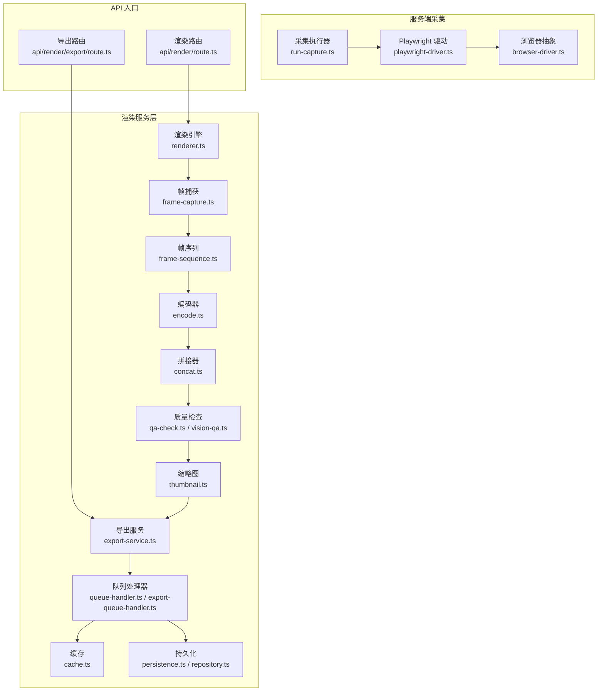
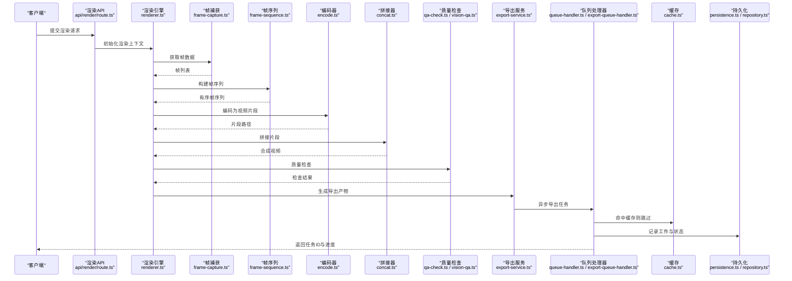
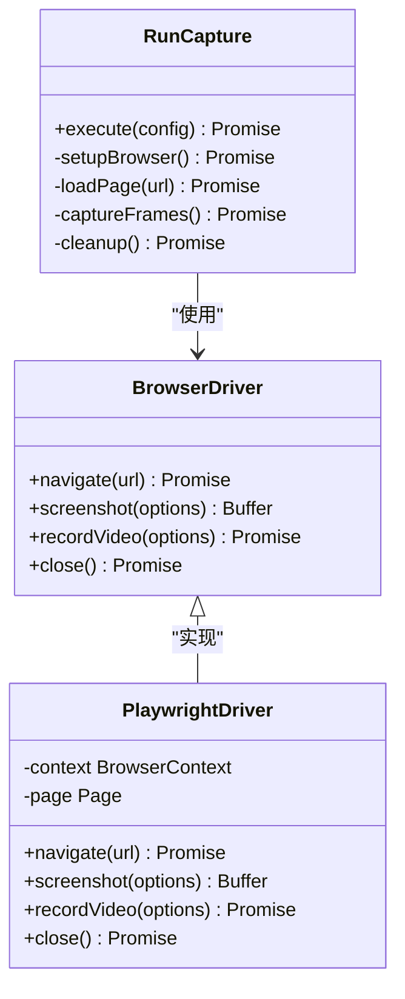
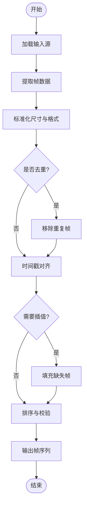
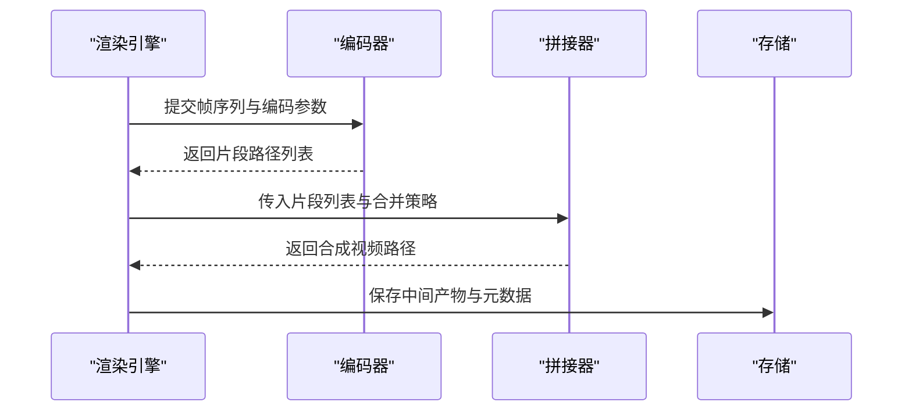
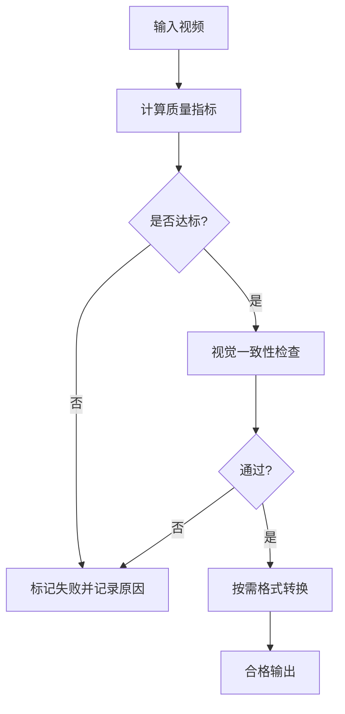
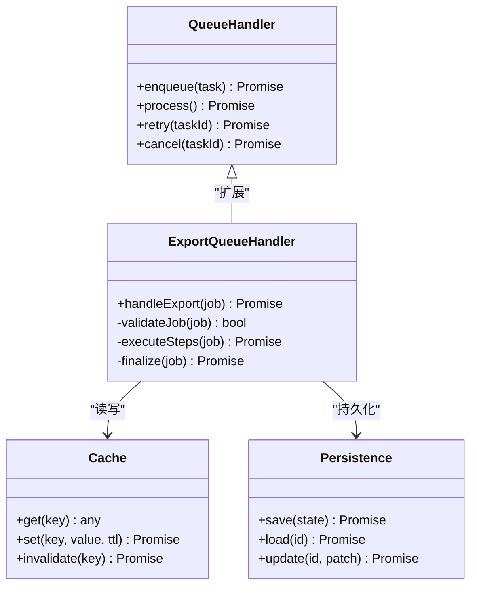
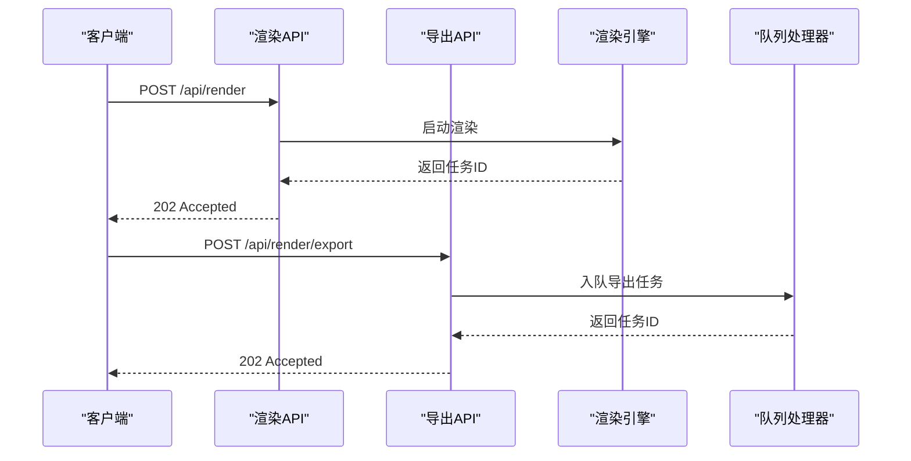
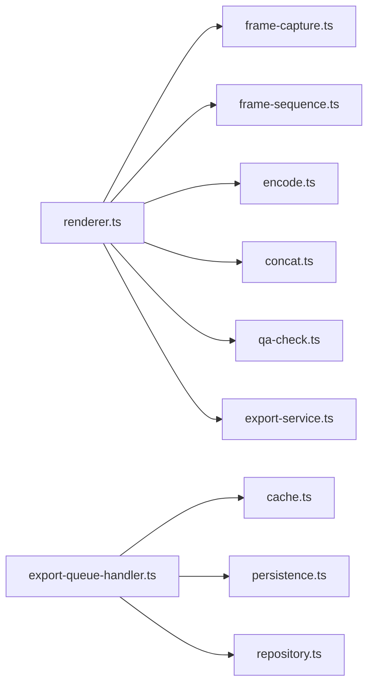

# 渲染服务层

<cite>
**本文引用的文件**   
- [server/src/capture/playwright-driver.ts](file://server/src/capture/playwright-driver.ts)
- [server/src/capture/browser-driver.ts](file://server/src/capture/browser-driver.ts)
- [server/src/capture/run-capture.ts](file://server/src/capture/run-capture.ts)
- [src/features/render/renderer.ts](file://src/features/render/renderer.ts)
- [src/features/render/frame-capture.ts](file://src/features/render/frame-capture.ts)
- [src/features/render/frame-sequence.ts](file://src/features/render/frame-sequence.ts)
- [src/features/render/encode.ts](file://src/features/render/encode.ts)
- [src/features/render/concat.ts](file://src/features/render/concat.ts)
- [src/features/render/qa-check.ts](file://src/features/render/qa-check.ts)
- [src/features/render/vision-qa.ts](file://src/features/render/vision-qa.ts)
- [src/features/render/export-service.ts](file://src/features/render/export-service.ts)
- [src/features/render/export-queue-handler.ts](file://src/features/render/export-queue-handler.ts)
- [src/features/render/queue-handler.ts](file://src/features/render/queue-handler.ts)
- [src/features/render/cache.ts](file://src/features/render/cache.ts)
- [src/features/render/persistence.ts](file://src/features/render/persistence.ts)
- [src/features/render/repository.ts](file://src/features/render/repository.ts)
- [src/features/render/render-artifact-repository.ts](file://src/features/render/render-artifact-repository.ts)
- [src/features/render/render-shot-repository.ts](file://src/features/render/render-shot-repository.ts)
- [src/features/render/thumbnail.ts](file://src/features/render/thumbnail.ts)
- [src/app/api/render/route.ts](file://src/app/api/render/route.ts)
- [src/app/api/render/export/route.ts](file://src/app/api/render/export/route.ts)
</cite>

## 目录
1. [简介](#简介)
2. [项目结构](#项目结构)
3. [核心组件](#核心组件)
4. [架构总览](#架构总览)
5. [详细组件分析](#详细组件分析)
6. [依赖关系分析](#依赖关系分析)
7. [性能考量](#性能考量)
8. [故障排查指南](#故障排查指南)
9. [结论](#结论)
10. [附录](#附录)

## 简介
本文件为 PurpleInk 渲染服务层的权威技术文档，聚焦浏览器自动化渲染、Playwright 驱动管理、页面捕获与帧序列处理、视频编码与媒体组装、质量检查与格式转换、输出优化、队列管理与任务调度、资源监控、缓存策略、增量渲染与并行能力。同时提供渲染配置示例与自定义渲染后处理器开发指南，帮助开发者快速理解并扩展渲染管线。

## 项目结构
渲染相关代码主要分布在两个区域：
- server 侧的采集与浏览器驱动模块，负责基于 Playwright 的页面加载、截图与录制。
- src/features/render 下的渲染服务层，负责帧捕获、序列编排、编码、拼接、质量检查、导出与持久化等。

图表来源
- [server/src/capture/playwright-driver.ts](file://server/src/capture/playwright-driver.ts)
- [server/src/capture/browser-driver.ts](file://server/src/capture/browser-driver.ts)
- [server/src/capture/run-capture.ts](file://server/src/capture/run-capture.ts)
- [src/features/render/renderer.ts](file://src/features/render/renderer.ts)
- [src/features/render/frame-capture.ts](file://src/features/render/frame-capture.ts)
- [src/features/render/frame-sequence.ts](file://src/features/render/frame-sequence.ts)
- [src/features/render/encode.ts](file://src/features/render/encode.ts)
- [src/features/render/concat.ts](file://src/features/render/concat.ts)
- [src/features/render/qa-check.ts](file://src/features/render/qa-check.ts)
- [src/features/render/vision-qa.ts](file://src/features/render/vision-qa.ts)
- [src/features/render/thumbnail.ts](file://src/features/render/thumbnail.ts)
- [src/features/render/export-service.ts](file://src/features/render/export-service.ts)
- [src/features/render/queue-handler.ts](file://src/features/render/queue-handler.ts)
- [src/features/render/export-queue-handler.ts](file://src/features/render/export-queue-handler.ts)
- [src/features/render/cache.ts](file://src/features/render/cache.ts)
- [src/features/render/persistence.ts](file://src/features/render/persistence.ts)
- [src/features/render/repository.ts](file://src/features/render/repository.ts)
- [src/app/api/render/route.ts](file://src/app/api/render/route.ts)
- [src/app/api/render/export/route.ts](file://src/app/api/render/export/route.ts)

章节来源
- [src/app/api/render/route.ts](file://src/app/api/render/route.ts)
- [src/app/api/render/export/route.ts](file://src/app/api/render/export/route.ts)
- [src/features/render/renderer.ts](file://src/features/render/renderer.ts)
- [server/src/capture/playwright-driver.ts](file://server/src/capture/playwright-driver.ts)

## 核心组件
- 渲染引擎（renderer.ts）：协调帧捕获、序列生成、编码、拼接、质量检查与导出，是渲染管线的中枢。
- 帧捕获（frame-capture.ts）：从浏览器或内存中抽取帧数据，支持多种输入源与分辨率控制。
- 帧序列（frame-sequence.ts）：对帧进行排序、去重、时间对齐与插值，确保时序一致性。
- 编码器（encode.ts）：将帧序列编码为视频流，支持多格式与参数调优。
- 拼接器（concat.ts）：将分段视频片段按顺序合并，保证无缝衔接。
- 质量检查（qa-check.ts, vision-qa.ts）：对输出进行指标校验与视觉一致性检测。
- 缩略图（thumbnail.ts）：生成预览图，加速前端展示与审核。
- 导出服务（export-service.ts）：封装最终产物打包、元数据写入与下载链接生成。
- 队列处理器（queue-handler.ts, export-queue-handler.ts）：任务入队、并发控制、重试与失败回滚。
- 缓存（cache.ts）：结果与中间产物缓存，支持键控与过期策略。
- 持久化（persistence.ts, repository.ts, render-artifact-repository.ts, render-shot-repository.ts）：渲染状态、工件与镜头数据的存储与检索。

章节来源
- [src/features/render/renderer.ts](file://src/features/render/renderer.ts)
- [src/features/render/frame-capture.ts](file://src/features/render/frame-capture.ts)
- [src/features/render/frame-sequence.ts](file://src/features/render/frame-sequence.ts)
- [src/features/render/encode.ts](file://src/features/render/encode.ts)
- [src/features/render/concat.ts](file://src/features/render/concat.ts)
- [src/features/render/qa-check.ts](file://src/features/render/qa-check.ts)
- [src/features/render/vision-qa.ts](file://src/features/render/vision-qa.ts)
- [src/features/render/thumbnail.ts](file://src/features/render/thumbnail.ts)
- [src/features/render/export-service.ts](file://src/features/render/export-service.ts)
- [src/features/render/queue-handler.ts](file://src/features/render/queue-handler.ts)
- [src/features/render/export-queue-handler.ts](file://src/features/render/export-queue-handler.ts)
- [src/features/render/cache.ts](file://src/features/render/cache.ts)
- [src/features/render/persistence.ts](file://src/features/render/persistence.ts)
- [src/features/render/repository.ts](file://src/features/render/repository.ts)
- [src/features/render/render-artifact-repository.ts](file://src/features/render/render-artifact-repository.ts)
- [src/features/render/render-shot-repository.ts](file://src/features/render/render-shot-repository.ts)

## 架构总览
渲染服务采用“采集-渲染-导出”三段式流水线，结合队列与缓存实现高吞吐与可恢复性。

图表来源
- [src/app/api/render/route.ts](file://src/app/api/render/route.ts)
- [src/features/render/renderer.ts](file://src/features/render/renderer.ts)
- [src/features/render/frame-capture.ts](file://src/features/render/frame-capture.ts)
- [src/features/render/frame-sequence.ts](file://src/features/render/frame-sequence.ts)
- [src/features/render/encode.ts](file://src/features/render/encode.ts)
- [src/features/render/concat.ts](file://src/features/render/concat.ts)
- [src/features/render/qa-check.ts](file://src/features/render/qa-check.ts)
- [src/features/render/vision-qa.ts](file://src/features/render/vision-qa.ts)
- [src/features/render/export-service.ts](file://src/features/render/export-service.ts)
- [src/features/render/queue-handler.ts](file://src/features/render/queue-handler.ts)
- [src/features/render/export-queue-handler.ts](file://src/features/render/export-queue-handler.ts)
- [src/features/render/cache.ts](file://src/features/render/cache.ts)
- [src/features/render/persistence.ts](file://src/features/render/persistence.ts)
- [src/features/render/repository.ts](file://src/features/render/repository.ts)

## 详细组件分析

### 浏览器自动化与 Playwright 驱动管理
- 浏览器抽象（browser-driver.ts）：定义统一的浏览器操作接口，屏蔽具体实现差异。
- Playwright 驱动（playwright-driver.ts）：基于 Playwright 实现页面导航、等待、截图与录制，支持并发实例与资源回收。
- 采集执行器（run-capture.ts）：编排一次完整的采集流程，包括环境准备、页面加载、交互脚本执行与结果落盘。

图表来源
- [server/src/capture/browser-driver.ts](file://server/src/capture/browser-driver.ts)
- [server/src/capture/playwright-driver.ts](file://server/src/capture/playwright-driver.ts)
- [server/src/capture/run-capture.ts](file://server/src/capture/run-capture.ts)

章节来源
- [server/src/capture/browser-driver.ts](file://server/src/capture/browser-driver.ts)
- [server/src/capture/playwright-driver.ts](file://server/src/capture/playwright-driver.ts)
- [server/src/capture/run-capture.ts](file://server/src/capture/run-capture.ts)

### 帧捕获与序列处理
- 帧捕获（frame-capture.ts）：从浏览器截图或内存缓冲区提取帧，支持分辨率缩放、裁剪与格式转换。
- 帧序列（frame-sequence.ts）：对帧进行时间戳对齐、去重、插值与补帧，确保播放流畅性与时长一致。

图表来源
- [src/features/render/frame-capture.ts](file://src/features/render/frame-capture.ts)
- [src/features/render/frame-sequence.ts](file://src/features/render/frame-sequence.ts)

章节来源
- [src/features/render/frame-capture.ts](file://src/features/render/frame-capture.ts)
- [src/features/render/frame-sequence.ts](file://src/features/render/frame-sequence.ts)

### 视频编码与媒体组装
- 编码器（encode.ts）：将帧序列编码为指定格式（如 MP4/WebM），支持码率、分辨率、关键帧间隔等参数。
- 拼接器（concat.ts）：将多个编码片段按顺序合并，处理边界帧与音频同步。

图表来源
- [src/features/render/encode.ts](file://src/features/render/encode.ts)
- [src/features/render/concat.ts](file://src/features/render/concat.ts)

章节来源
- [src/features/render/encode.ts](file://src/features/render/encode.ts)
- [src/features/render/concat.ts](file://src/features/render/concat.ts)

### 质量检查与格式转换
- 质量检查（qa-check.ts）：基于指标（如亮度、对比度、黑帧比例）判定输出是否符合标准。
- 视觉质量（vision-qa.ts）：通过图像相似度或特征比对，评估前后帧一致性。
- 格式转换：在导出阶段按需转码，适配不同终端与平台要求。

图表来源
- [src/features/render/qa-check.ts](file://src/features/render/qa-check.ts)
- [src/features/render/vision-qa.ts](file://src/features/render/vision-qa.ts)

章节来源
- [src/features/render/qa-check.ts](file://src/features/render/qa-check.ts)
- [src/features/render/vision-qa.ts](file://src/features/render/vision-qa.ts)

### 导出服务与缩略图
- 导出服务（export-service.ts）：封装产物打包、元数据写入、下载链接生成与回调通知。
- 缩略图（thumbnail.ts）：从视频中抽取关键帧生成预览图，提升前端加载体验。

章节来源
- [src/features/render/export-service.ts](file://src/features/render/export-service.ts)
- [src/features/render/thumbnail.ts](file://src/features/render/thumbnail.ts)

### 队列管理、任务调度与资源监控
- 队列处理器（queue-handler.ts, export-queue-handler.ts）：维护任务队列、并发限制、重试策略与失败回滚。
- 缓存（cache.ts）：对中间产物与最终结果进行键控缓存，减少重复计算。
- 持久化（persistence.ts, repository.ts, render-artifact-repository.ts, render-shot-repository.ts）：持久化渲染状态、工件与镜头信息，支持查询与恢复。

图表来源
- [src/features/render/queue-handler.ts](file://src/features/render/queue-handler.ts)
- [src/features/render/export-queue-handler.ts](file://src/features/render/export-queue-handler.ts)
- [src/features/render/cache.ts](file://src/features/render/cache.ts)
- [src/features/render/persistence.ts](file://src/features/render/persistence.ts)
- [src/features/render/repository.ts](file://src/features/render/repository.ts)
- [src/features/render/render-artifact-repository.ts](file://src/features/render/render-artifact-repository.ts)
- [src/features/render/render-shot-repository.ts](file://src/features/render/render-shot-repository.ts)

章节来源
- [src/features/render/queue-handler.ts](file://src/features/render/queue-handler.ts)
- [src/features/render/export-queue-handler.ts](file://src/features/render/export-queue-handler.ts)
- [src/features/render/cache.ts](file://src/features/render/cache.ts)
- [src/features/render/persistence.ts](file://src/features/render/persistence.ts)
- [src/features/render/repository.ts](file://src/features/render/repository.ts)
- [src/features/render/render-artifact-repository.ts](file://src/features/render/render-artifact-repository.ts)
- [src/features/render/render-shot-repository.ts](file://src/features/render/render-shot-repository.ts)

### API 入口与调用流程
- 渲染路由（api/render/route.ts）：接收渲染请求，校验参数，创建渲染上下文并触发渲染引擎。
- 导出路由（api/render/export/route.ts）：接收导出请求，创建导出任务并交由队列处理器执行。

图表来源
- [src/app/api/render/route.ts](file://src/app/api/render/route.ts)
- [src/app/api/render/export/route.ts](file://src/app/api/render/export/route.ts)
- [src/features/render/renderer.ts](file://src/features/render/renderer.ts)
- [src/features/render/queue-handler.ts](file://src/features/render/queue-handler.ts)

章节来源
- [src/app/api/render/route.ts](file://src/app/api/render/route.ts)
- [src/app/api/render/export/route.ts](file://src/app/api/render/export/route.ts)

## 依赖关系分析
渲染服务层内部模块耦合清晰，职责单一：
- renderer.ts 作为编排者，依赖 frame-capture.ts、frame-sequence.ts、encode.ts、concat.ts、qa-check.ts、export-service.ts。
- queue-handler.ts 与 export-queue-handler.ts 依赖 cache.ts 与 persistence.ts。
- 浏览器驱动模块独立于渲染服务，通过 run-capture.ts 暴露统一接口。

图表来源
- [src/features/render/renderer.ts](file://src/features/render/renderer.ts)
- [src/features/render/frame-capture.ts](file://src/features/render/frame-capture.ts)
- [src/features/render/frame-sequence.ts](file://src/features/render/frame-sequence.ts)
- [src/features/render/encode.ts](file://src/features/render/encode.ts)
- [src/features/render/concat.ts](file://src/features/render/concat.ts)
- [src/features/render/qa-check.ts](file://src/features/render/qa-check.ts)
- [src/features/render/export-service.ts](file://src/features/render/export-service.ts)
- [src/features/render/export-queue-handler.ts](file://src/features/render/export-queue-handler.ts)
- [src/features/render/cache.ts](file://src/features/render/cache.ts)
- [src/features/render/persistence.ts](file://src/features/render/persistence.ts)
- [src/features/render/repository.ts](file://src/features/render/repository.ts)

章节来源
- [src/features/render/renderer.ts](file://src/features/render/renderer.ts)
- [src/features/render/export-queue-handler.ts](file://src/features/render/export-queue-handler.ts)

## 性能考量
- 并发控制：队列处理器应限制同时运行的渲染任务数，避免内存与CPU过载。
- 分片编码：大视频建议分片编码后再拼接，降低单次内存峰值。
- 缓存策略：对相同输入的中间产物与最终结果进行缓存，设置合理 TTL。
- 增量渲染：仅重新渲染变更的片段，利用帧序列的时间戳定位范围。
- I/O 优化：使用流式读写，避免一次性加载大文件到内存。
- 资源回收：及时关闭浏览器实例与临时文件，防止句柄泄漏。

[本节为通用指导，不直接分析具体文件]

## 故障排查指南
- 浏览器崩溃：检查 playwright-driver.ts 的资源清理逻辑与超时配置。
- 帧丢失或错位：验证 frame-sequence.ts 的对齐与插值逻辑。
- 编码失败：确认 encode.ts 的参数与容器兼容性。
- 质量检查失败：查看 qa-check.ts 的阈值与 vision-qa.ts 的相似度算法。
- 队列积压：监控 export-queue-handler.ts 的任务堆积与重试次数。
- 缓存未命中：检查 cache.ts 的键生成规则与过期策略。
- 持久化异常：确认 persistence.ts 与 repository.ts 的事务与回滚机制。

章节来源
- [server/src/capture/playwright-driver.ts](file://server/src/capture/playwright-driver.ts)
- [src/features/render/frame-sequence.ts](file://src/features/render/frame-sequence.ts)
- [src/features/render/encode.ts](file://src/features/render/encode.ts)
- [src/features/render/qa-check.ts](file://src/features/render/qa-check.ts)
- [src/features/render/vision-qa.ts](file://src/features/render/vision-qa.ts)
- [src/features/render/export-queue-handler.ts](file://src/features/render/export-queue-handler.ts)
- [src/features/render/cache.ts](file://src/features/render/cache.ts)
- [src/features/render/persistence.ts](file://src/features/render/persistence.ts)
- [src/features/render/repository.ts](file://src/features/render/repository.ts)

## 结论
PurpleInk 渲染服务层以清晰的模块化设计与可扩展的插件式架构，实现了从浏览器自动化采集到高质量视频产物的完整流水线。通过队列、缓存与持久化机制，系统具备高吞吐、可恢复与易运维的特性。开发者可在现有基础上轻松扩展新的编码器、质量检查器或导出处理器，以满足多样化业务需求。

[本节为总结性内容，不直接分析具体文件]

## 附录

### 渲染配置示例
- 基础渲染配置：分辨率、帧率、编码参数、质量阈值、缓存 TTL、并发上限。
- 浏览器配置：用户代理、视口大小、网络模拟、脚本注入。
- 导出配置：目标格式、码率、字幕嵌入、缩略图生成。

[本节为概念性说明，不直接分析具体文件]

### 自定义渲染后处理器开发指南
- 接口约定：定义输入（视频路径、元数据）、输出（处理后路径、新元数据）。
- 注册机制：在导出服务中注册处理器，按顺序执行。
- 错误处理：捕获异常并记录日志，支持重试与回滚。
- 性能优化：流式处理、避免全量拷贝、合理使用临时文件。

[本节为概念性说明，不直接分析具体文件]