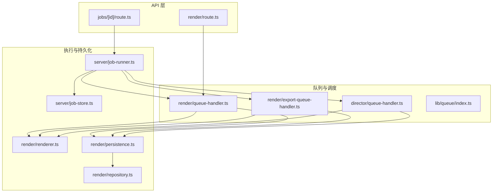
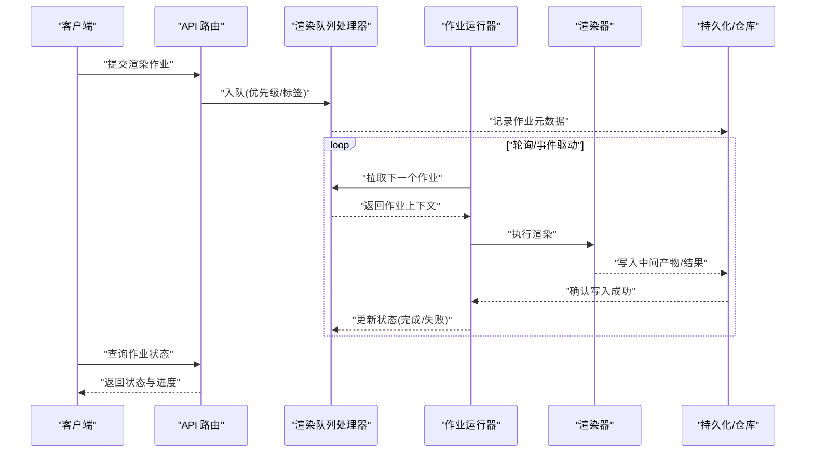
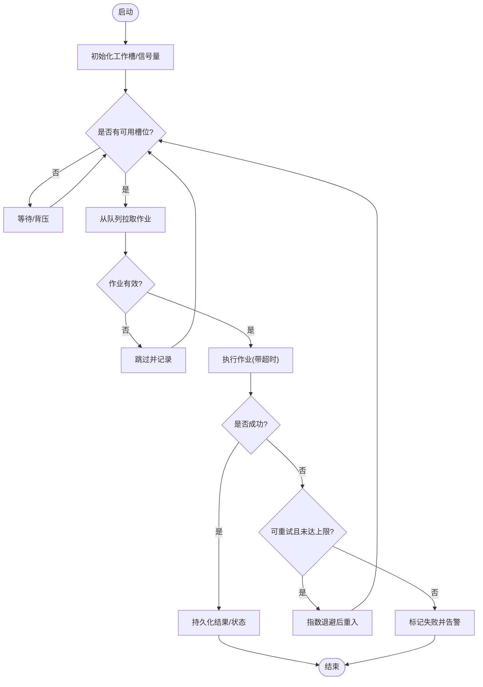
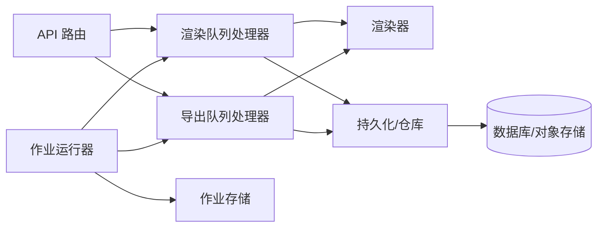

# 渲染队列管理

<cite>
**本文引用的文件**   
- [server/src/server/job-runner.ts](file://server/src/server/job-runner.ts)
- [server/src/server/job-store.ts](file://server/src/server/job-store.ts)
- [src/features/render/queue-handler.ts](file://src/features/render/queue-handler.ts)
- [src/features/render/export-queue-handler.ts](file://src/features/render/export-queue-handler.ts)
- [src/features/render/renderer.ts](file://src/features/render/renderer.ts)
- [src/features/render/persistence.ts](file://src/features/render/persistence.ts)
- [src/features/render/repository.ts](file://src/features/render/repository.ts)
- [src/features/director/queue-handler.ts](file://src/features/director/queue-handler.ts)
- [src/lib/queue/index.ts](file://src/lib/queue/index.ts)
- [src/app/api/render/route.ts](file://src/app/api/render/route.ts)
- [src/app/api/jobs/[id]/route.ts](file://src/app/api/jobs/[id]/route.ts)
- [deploy/compose.yaml](file://deploy/compose.yaml)
</cite>

## 目录
1. [简介](#简介)
2. [项目结构](#项目结构)
3. [核心组件](#核心组件)
4. [架构总览](#架构总览)
5. [详细组件分析](#详细组件分析)
6. [依赖关系分析](#依赖关系分析)
7. [性能考虑](#性能考虑)
8. [故障排查指南](#故障排查指南)
9. [结论](#结论)
10. [附录](#附录)

## 简介
本文件面向 PurpleInk 的“渲染队列管理系统”，系统性阐述任务调度算法、优先级与并发控制、队列持久化与故障恢复、负载均衡策略，以及任务状态跟踪、进度监控、错误重试、资源限制、超时处理与死锁预防。同时提供队列监控工具使用建议与性能调优指南，帮助读者从整体到细节全面掌握该子系统的设计与实现。

## 项目结构
渲染队列相关代码主要分布在以下位置：
- 服务端作业运行器与存储抽象：server/src/server/job-runner.ts、server/src/server/job-store.ts
- 渲染域队列处理器与执行器：src/features/render/queue-handler.ts、src/features/render/export-queue-handler.ts、src/features/render/renderer.ts
- 渲染持久化与仓库：src/features/render/persistence.ts、src/features/render/repository.ts
- 导演域队列处理器（跨域复用）：src/features/director/queue-handler.ts
- 通用队列库：src/lib/queue/index.ts
- API 入口（提交/查询作业）：src/app/api/render/route.ts、src/app/api/jobs/[id]/route.ts
- 部署编排（多进程/容器）：deploy/compose.yaml

图表来源
- [src/app/api/render/route.ts](file://src/app/api/render/route.ts)
- [src/app/api/jobs/[id]/route.ts](file://src/app/api/jobs/[id]/route.ts)
- [src/features/render/queue-handler.ts](file://src/features/render/queue-handler.ts)
- [src/features/render/export-queue-handler.ts](file://src/features/render/export-queue-handler.ts)
- [src/features/director/queue-handler.ts](file://src/features/director/queue-handler.ts)
- [src/lib/queue/index.ts](file://src/lib/queue/index.ts)
- [src/features/render/renderer.ts](file://src/features/render/renderer.ts)
- [src/features/render/persistence.ts](file://src/features/render/persistence.ts)
- [src/features/render/repository.ts](file://src/features/render/repository.ts)
- [server/src/server/job-runner.ts](file://server/src/server/job-runner.ts)
- [server/src/server/job-store.ts](file://server/src/server/job-store.ts)

章节来源
- [server/src/server/job-runner.ts](file://server/src/server/job-runner.ts)
- [server/src/server/job-store.ts](file://server/src/server/job-store.ts)
- [src/features/render/queue-handler.ts](file://src/features/render/queue-handler.ts)
- [src/features/render/export-queue-handler.ts](file://src/features/render/export-queue-handler.ts)
- [src/features/render/renderer.ts](file://src/features/render/renderer.ts)
- [src/features/render/persistence.ts](file://src/features/render/persistence.ts)
- [src/features/render/repository.ts](file://src/features/render/repository.ts)
- [src/features/director/queue-handler.ts](file://src/features/director/queue-handler.ts)
- [src/lib/queue/index.ts](file://src/lib/queue/index.ts)
- [src/app/api/render/route.ts](file://src/app/api/render/route.ts)
- [src/app/api/jobs/[id]/route.ts](file://src/app/api/jobs/[id]/route.ts)
- [deploy/compose.yaml](file://deploy/compose.yaml)

## 核心组件
- 作业运行器（Job Runner）：负责拉取待执行作业、分配工作线程、协调生命周期与失败重试。
- 作业存储（Job Store）：定义作业的持久化接口，屏蔽底层存储差异。
- 渲染队列处理器（Render Queue Handler）：将渲染任务入队、按优先级调度、维护执行上下文与状态。
- 导出队列处理器（Export Queue Handler）：针对导出类任务的专用处理器，支持批量与限速。
- 渲染器（Renderer）：具体渲染逻辑的执行者，封装媒体编码、帧捕获等能力。
- 持久化与仓库（Persistence & Repository）：统一读写作业元数据、中间产物与结果，保证一致性。
- 导演队列处理器（Director Queue Handler）：导演流程中的任务队列，复用通用队列机制。
- 通用队列库（Queue Library）：提供基础队列数据结构、优先级与并发控制原语。
- API 路由：暴露作业提交与状态查询接口，驱动上层业务。

章节来源
- [server/src/server/job-runner.ts](file://server/src/server/job-runner.ts)
- [server/src/server/job-store.ts](file://server/src/server/job-store.ts)
- [src/features/render/queue-handler.ts](file://src/features/render/queue-handler.ts)
- [src/features/render/export-queue-handler.ts](file://src/features/render/export-queue-handler.ts)
- [src/features/render/renderer.ts](file://src/features/render/renderer.ts)
- [src/features/render/persistence.ts](file://src/features/render/persistence.ts)
- [src/features/render/repository.ts](file://src/features/render/repository.ts)
- [src/features/director/queue-handler.ts](file://src/features/director/queue-handler.ts)
- [src/lib/queue/index.ts](file://src/lib/queue/index.ts)
- [src/app/api/render/route.ts](file://src/app/api/render/route.ts)
- [src/app/api/jobs/[id]/route.ts](file://src/app/api/jobs/[id]/route.ts)

## 架构总览
系统采用“API -> 队列处理器 -> 作业运行器 -> 持久化/仓库”的分层架构。API 接收请求并创建作业；队列处理器根据优先级与资源情况调度；作业运行器在隔离的工作单元中执行；持久化层确保状态可恢复与可观测。

图表来源
- [src/app/api/render/route.ts](file://src/app/api/render/route.ts)
- [src/features/render/queue-handler.ts](file://src/features/render/queue-handler.ts)
- [server/src/server/job-runner.ts](file://server/src/server/job-runner.ts)
- [src/features/render/renderer.ts](file://src/features/render/renderer.ts)
- [src/features/render/persistence.ts](file://src/features/render/persistence.ts)
- [src/features/render/repository.ts](file://src/features/render/repository.ts)

## 详细组件分析

### 作业运行器（Job Runner）
- 职责：从队列拉取作业、分配工作槽、管理超时与重试、汇总指标。
- 关键行为：
  - 拉取策略：优先高优先级作业，支持按标签/租户隔离。
  - 并发控制：基于信号量或线程池上限，避免过载。
  - 超时处理：为每个作业设置最大执行时间，超时报错并回滚部分状态。
  - 失败重试：指数退避 + 最大重试次数，区分可重试与不可重试错误。
  - 健康检查：定期上报存活与吞吐指标。

图表来源
- [server/src/server/job-runner.ts](file://server/src/server/job-runner.ts)

章节来源
- [server/src/server/job-runner.ts](file://server/src/server/job-runner.ts)

### 作业存储（Job Store）
- 职责：定义作业读写的抽象接口，屏蔽数据库/对象存储差异。
- 关键行为：
  - 原子性：入队/出队需满足幂等与一致性。
  - 可见性：出队后对其它消费者不可见，直到完成或超时。
  - 索引：按状态、优先级、标签、租户等维度快速检索。
  - 迁移：支持 schema 演进与数据迁移。

章节来源
- [server/src/server/job-store.ts](file://server/src/server/job-store.ts)

### 渲染队列处理器（Render Queue Handler）
- 职责：渲染任务的入队、优先级排序、资源准入控制、状态机推进。
- 关键行为：
  - 优先级：基于任务类型、SLA、用户等级等计算权重。
  - 准入控制：按资源配额与全局阈值限制入队速率。
  - 状态机：Pending -> Running -> Completed/Failed，支持暂停/恢复。
  - 进度上报：阶段级进度与关键指标回写持久化。

章节来源
- [src/features/render/queue-handler.ts](file://src/features/render/queue-handler.ts)

### 导出队列处理器（Export Queue Handler）
- 职责：导出类任务的批处理、限速与去重。
- 关键行为：
  - 批合并：相近时间的导出请求合并以减少重复计算。
  - 限速：按 I/O 或外部服务限流，避免雪崩。
  - 幂等：相同输入生成唯一键，避免重复执行。

章节来源
- [src/features/render/export-queue-handler.ts](file://src/features/render/export-queue-handler.ts)

### 渲染器（Renderer）
- 职责：执行具体的渲染步骤（如帧捕获、编码、合成）。
- 关键行为：
  - 分阶段执行：每步可独立失败与重试。
  - 资源隔离：临时文件清理、内存峰值控制。
  - 输出校验：生成后做完整性校验与 QA 检查。

章节来源
- [src/features/render/renderer.ts](file://src/features/render/renderer.ts)

### 持久化与仓库（Persistence & Repository）
- 职责：作业元数据、中间产物、结果的持久化与访问。
- 关键行为：
  - 事务边界：状态变更与产物落盘在同一事务内。
  - 版本化：产物与元数据版本管理，便于回滚。
  - 查询优化：常用查询路径建立索引。

章节来源
- [src/features/render/persistence.ts](file://src/features/render/persistence.ts)
- [src/features/render/repository.ts](file://src/features/render/repository.ts)

### 导演队列处理器（Director Queue Handler）
- 职责：导演流程中的任务队列，复用通用队列机制。
- 关键行为：
  - 阶段门控：上游阶段完成后解锁下游任务。
  - 依赖解析：拓扑排序避免循环依赖。

章节来源
- [src/features/director/queue-handler.ts](file://src/features/director/queue-handler.ts)

### 通用队列库（Queue Library）
- 职责：提供基础队列数据结构、优先级队列、并发控制原语。
- 关键行为：
  - 优先级队列：O(log n) 插入/弹出。
  - 并发控制：令牌桶/漏桶限流、信号量保护临界区。
  - 可观测性：内置计数与延迟直方图。

章节来源
- [src/lib/queue/index.ts](file://src/lib/queue/index.ts)

### API 路由（提交/查询）
- 职责：对外暴露作业提交与状态查询接口。
- 关键行为：
  - 参数校验：必填字段与格式校验。
  - 权限控制：鉴权与配额检查。
  - 响应规范：统一错误码与分页。

章节来源
- [src/app/api/render/route.ts](file://src/app/api/render/route.ts)
- [src/app/api/jobs/[id]/route.ts](file://src/app/api/jobs/[id]/route.ts)

## 依赖关系分析
- 低耦合：API 仅依赖队列处理器；运行器通过 Job Store 抽象与持久化解耦。
- 明确边界：渲染器专注执行，队列处理器专注调度，持久化专注一致性与可恢复。
- 可扩展：新增任务类型只需实现对应处理器与适配渲染器。

图表来源
- [src/app/api/render/route.ts](file://src/app/api/render/route.ts)
- [src/app/api/jobs/[id]/route.ts](file://src/app/api/jobs/[id]/route.ts)
- [src/features/render/queue-handler.ts](file://src/features/render/queue-handler.ts)
- [src/features/render/export-queue-handler.ts](file://src/features/render/export-queue-handler.ts)
- [src/features/render/renderer.ts](file://src/features/render/renderer.ts)
- [src/features/render/persistence.ts](file://src/features/render/persistence.ts)
- [src/features/render/repository.ts](file://src/features/render/repository.ts)
- [server/src/server/job-runner.ts](file://server/src/server/job-runner.ts)
- [server/src/server/job-store.ts](file://server/src/server/job-store.ts)

章节来源
- [src/app/api/render/route.ts](file://src/app/api/render/route.ts)
- [src/app/api/jobs/[id]/route.ts](file://src/app/api/jobs/[id]/route.ts)
- [src/features/render/queue-handler.ts](file://src/features/render/queue-handler.ts)
- [src/features/render/export-queue-handler.ts](file://src/features/render/export-queue-handler.ts)
- [src/features/render/renderer.ts](file://src/features/render/renderer.ts)
- [src/features/render/persistence.ts](file://src/features/render/persistence.ts)
- [src/features/render/repository.ts](file://src/features/render/repository.ts)
- [server/src/server/job-runner.ts](file://server/src/server/job-runner.ts)
- [server/src/server/job-store.ts](file://server/src/server/job-store.ts)

## 性能考虑
- 调度算法
  - 优先级队列：按 SLA/用户等级/任务大小加权，避免饥饿。
  - 公平性：同优先级内 FIFO，保障时延稳定性。
- 并发控制
  - 工作槽上限：依据 CPU/IO/外部 API 限额动态调整。
  - 背压：队列长度超过阈值时拒绝新入队或降级。
- 持久化
  - 批量写入：合并状态更新减少 IO 放大。
  - 异步落盘：非关键路径异步持久化降低主路径延迟。
- 缓存与去重
  - 结果缓存：相同输入命中缓存，避免重复计算。
  - 导入去重：基于内容哈希避免重复任务。
- 监控与调优
  - 指标：队列长度、平均耗时、成功率、超时率、重试率。
  - 告警：队列积压、持续失败、资源耗尽。
  - 容量规划：按峰值负载评估工作节点数与存储吞吐。

## 故障排查指南
- 常见问题
  - 队列积压：检查工作槽上限、外部依赖限流、持久化瓶颈。
  - 频繁重试：定位可重试错误类别，调整退避策略与上限。
  - 超时过多：优化渲染器步骤、增加超时预算、拆分大任务。
  - 死锁风险：避免长事务、严格加锁顺序、引入超时取消。
- 诊断步骤
  - 查看作业状态机流转与最近日志。
  - 检查持久化写入延迟与错误码。
  - 观察资源使用（CPU/内存/磁盘/网络）。
  - 复现最小用例并采集指标。
- 恢复策略
  - 失败作业自动重试或人工干预。
  - 快照回滚至稳定版本。
  - 扩容工作节点与并行度。

章节来源
- [server/src/server/job-runner.ts](file://server/src/server/job-runner.ts)
- [src/features/render/queue-handler.ts](file://src/features/render/queue-handler.ts)
- [src/features/render/persistence.ts](file://src/features/render/persistence.ts)

## 结论
PurpleInk 渲染队列管理系统以清晰的层次划分与明确的职责边界，实现了高可靠的任务调度与执行。通过优先级队列、并发控制、持久化与重试机制，系统在吞吐与时延之间取得平衡，并提供完善的监控与排障能力。建议在上线前进行容量规划与压测，结合指标与告警持续优化。

## 附录
- 部署建议
  - 使用容器编排扩展工作节点，按负载弹性伸缩。
  - 分离读写路径，读写库分离提升吞吐。
- 配置项参考
  - 队列大小、工作槽上限、超时时间、重试次数与退避策略。
  - 持久化连接池、批大小与压缩选项。
- 监控面板
  - 队列长度趋势、作业耗时分布、成功率与错误分类。
  - 资源利用率与外部依赖延迟。

章节来源
- [deploy/compose.yaml](file://deploy/compose.yaml)