# 缓存与存储

<cite>
**本文引用的文件**   
- [src/features/render/cache.ts](file://src/features/render/cache.ts)
- [src/features/render/persistence.ts](file://src/features/render/persistence.ts)
- [src/features/render/repository.ts](file://src/features/render/repository.ts)
- [src/features/render/renderer.ts](file://src/features/render/renderer.ts)
- [src/features/render/queue-handler.ts](file://src/features/render/queue-handler.ts)
- [src/features/render/export-service.ts](file://src/features/render/export-service.ts)
- [src/features/render/thumbnail.ts](file://src/features/render/thumbnail.ts)
- [src/lib/storage/index.ts](file://src/lib/storage/index.ts)
- [scripts/migration/sqlite-backup.ts](file://scripts/migration/sqlite-backup.ts)
- [scripts/migration/import-postgres.ts](file://scripts/migration/import-postgres.ts)
- [scripts/migration/export-sqlite.ts](file://scripts/migration/export-sqlite.ts)
</cite>

## 目录
1. [简介](#简介)
2. [项目结构](#项目结构)
3. [核心组件](#核心组件)
4. [架构总览](#架构总览)
5. [详细组件分析](#详细组件分析)
6. [依赖关系分析](#依赖关系分析)
7. [性能考量](#性能考量)
8. [故障排查指南](#故障排查指南)
9. [结论](#结论)
10. [附录](#附录)

## 简介
本文件为 PurpleInk 的缓存与存储系统提供系统化文档，覆盖多级缓存策略、增量渲染与缓存失效机制、文件存储管理、元数据持久化与版本控制、缓存优化算法、空间回收与数据迁移策略，以及分布式缓存、CDN 集成与备份恢复方案。同时给出存储后端扩展与性能监控的实践指南，帮助读者从整体到细节全面理解并高效使用该系统。

## 项目结构
与缓存与存储相关的代码主要分布在以下模块：
- 渲染与缓存层：负责缓存键生成、命中/未命中处理、增量渲染、缓存写入与失效
- 持久化与仓库层：负责元数据的读写、事务与一致性、版本控制
- 队列与导出服务：负责异步任务编排、并发控制与失败重试
- 存储抽象层：统一对象存储接口（本地/云存储），支持分片上传、断点续传与校验
- 缩略图与媒体处理：生成缩略图、转码与格式转换
- 迁移与备份脚本：SQLite 与 Postgres 之间的数据导入导出与备份

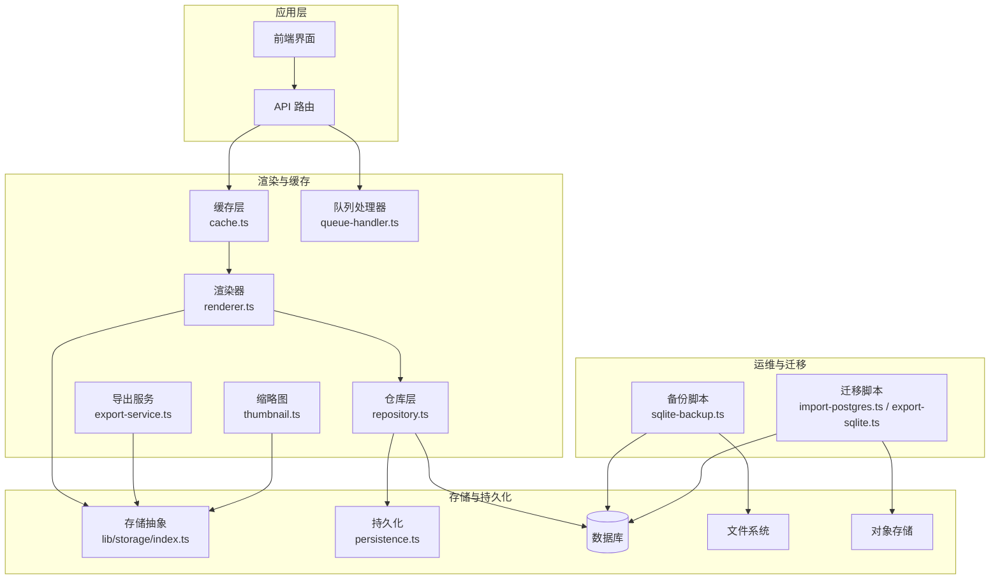

图表来源
- [src/features/render/cache.ts](file://src/features/render/cache.ts)
- [src/features/render/renderer.ts](file://src/features/render/renderer.ts)
- [src/features/render/repository.ts](file://src/features/render/repository.ts)
- [src/features/render/queue-handler.ts](file://src/features/render/queue-handler.ts)
- [src/features/render/export-service.ts](file://src/features/render/export-service.ts)
- [src/features/render/thumbnail.ts](file://src/features/render/thumbnail.ts)
- [src/lib/storage/index.ts](file://src/lib/storage/index.ts)
- [src/features/render/persistence.ts](file://src/features/render/persistence.ts)
- [scripts/migration/sqlite-backup.ts](file://scripts/migration/sqlite-backup.ts)
- [scripts/migration/import-postgres.ts](file://scripts/migration/import-postgres.ts)
- [scripts/migration/export-sqlite.ts](file://scripts/migration/export-sqlite.ts)

章节来源
- [src/features/render/cache.ts](file://src/features/render/cache.ts)
- [src/features/render/renderer.ts](file://src/features/render/renderer.ts)
- [src/features/render/repository.ts](file://src/features/render/repository.ts)
- [src/features/render/queue-handler.ts](file://src/features/render/queue-handler.ts)
- [src/features/render/export-service.ts](file://src/features/render/export-service.ts)
- [src/features/render/thumbnail.ts](file://src/features/render/thumbnail.ts)
- [src/lib/storage/index.ts](file://src/lib/storage/index.ts)
- [src/features/render/persistence.ts](file://src/features/render/persistence.ts)
- [scripts/migration/sqlite-backup.ts](file://scripts/migration/sqlite-backup.ts)
- [scripts/migration/import-postgres.ts](file://scripts/migration/import-postgres.ts)
- [scripts/migration/export-sqlite.ts](file://scripts/migration/export-sqlite.ts)

## 核心组件
- 缓存层（cache.ts）
  - 职责：构建缓存键、判断命中、读取/写入缓存、失效与清理、统计指标上报
  - 关键能力：多级缓存（内存/磁盘/对象存储）、TTL 与 LRU、按资源粒度失效、增量更新
- 渲染器（renderer.ts）
  - 职责：执行渲染管线、计算差异、触发增量渲染、合并结果、回写缓存
  - 关键能力：输入变更检测、阶段级缓存、幂等性保证、错误隔离
- 仓库层（repository.ts）
  - 职责：元数据读写、事务与一致性、版本控制、查询与索引
  - 关键能力：乐观锁、版本号字段、快照与差异记录、软删除
- 持久化（persistence.ts）
  - 职责：将渲染产物与元数据落盘或上云、校验完整性、原子替换
  - 关键能力：分片上传、断点续传、哈希校验、命名规范
- 队列处理器（queue-handler.ts）
  - 职责：任务入队、调度、重试、限流、死信队列
  - 关键能力：优先级队列、并发控制、幂等键、退避策略
- 导出服务（export-service.ts）
  - 职责：打包导出、格式转换、压缩、分发
  - 关键能力：流水线编排、进度回调、失败恢复
- 缩略图（thumbnail.ts）
  - 职责：生成缩略图、裁剪、缩放、缓存
  - 关键能力：尺寸策略、懒加载、缓存键与失效联动
- 存储抽象（lib/storage/index.ts）
  - 职责：统一对象存储接口（本地/云存储）、路径映射、权限与签名
  - 关键能力：适配器模式、可插拔后端、CDN 前缀注入

章节来源
- [src/features/render/cache.ts](file://src/features/render/cache.ts)
- [src/features/render/renderer.ts](file://src/features/render/renderer.ts)
- [src/features/render/repository.ts](file://src/features/render/repository.ts)
- [src/features/render/persistence.ts](file://src/features/render/persistence.ts)
- [src/features/render/queue-handler.ts](file://src/features/render/queue-handler.ts)
- [src/features/render/export-service.ts](file://src/features/render/export-service.ts)
- [src/features/render/thumbnail.ts](file://src/features/render/thumbnail.ts)
- [src/lib/storage/index.ts](file://src/lib/storage/index.ts)

## 架构总览
下图展示请求进入后，缓存与存储系统的协作流程：

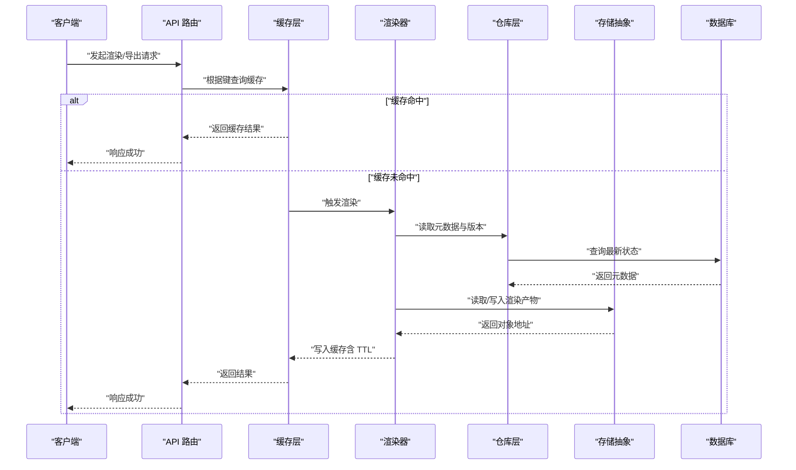

图表来源
- [src/features/render/cache.ts](file://src/features/render/cache.ts)
- [src/features/render/renderer.ts](file://src/features/render/renderer.ts)
- [src/features/render/repository.ts](file://src/features/render/repository.ts)
- [src/lib/storage/index.ts](file://src/lib/storage/index.ts)

## 详细组件分析

### 多级缓存策略与失效机制
- 多级缓存层次
  - 内存缓存：进程内 LRU，低延迟，适合热点数据
  - 磁盘缓存：本地文件缓存，跨进程共享，容量较大
  - 对象存储缓存：远端 CDN/对象存储，全局共享，适合大文件与静态资源
- 缓存键设计
  - 基于资源 ID、版本、参数哈希组合生成稳定键
  - 支持按维度（项目/镜头/片段）批量失效
- 失效策略
  - TTL 过期自动失效
  - 事件驱动失效：元数据更新、版本切换、配置变更时主动失效
  - 渐进式失效：先标记失效，后台异步清理
- 命中率与监控
  - 记录命中/未命中、大小、过期时间、清理次数
  - 暴露指标用于告警与调优

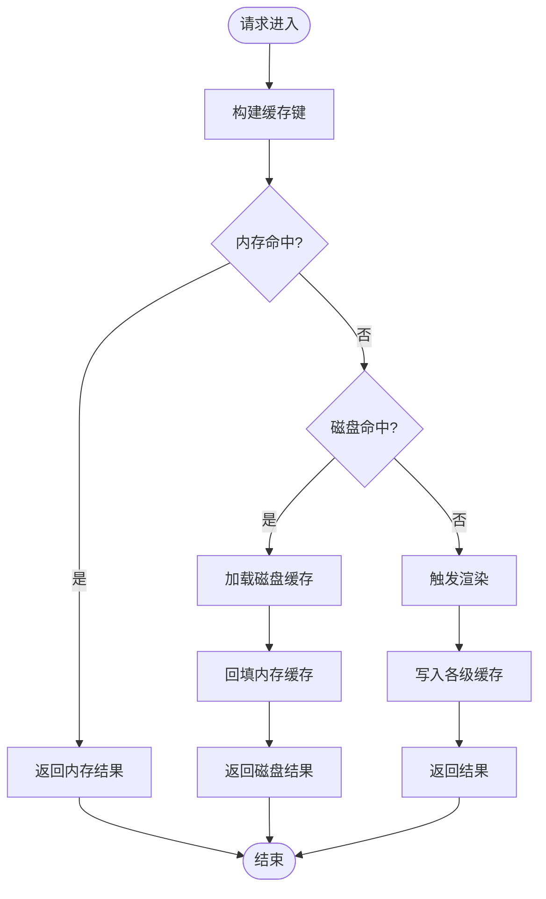

图表来源
- [src/features/render/cache.ts](file://src/features/render/cache.ts)

章节来源
- [src/features/render/cache.ts](file://src/features/render/cache.ts)

### 增量渲染与缓存协同
- 变更检测
  - 比较输入资源的哈希与版本，识别变化片段
  - 阶段级缓存：每个渲染阶段输出独立缓存，减少重复计算
- 差异合并
  - 仅重新渲染受影响片段，合并旧片段与新片段
  - 冲突解决：以最新版本为准，必要时回滚
- 幂等性与一致性
  - 所有写入操作具备幂等键，避免重复写入
  - 事务边界确保元数据与产物一致

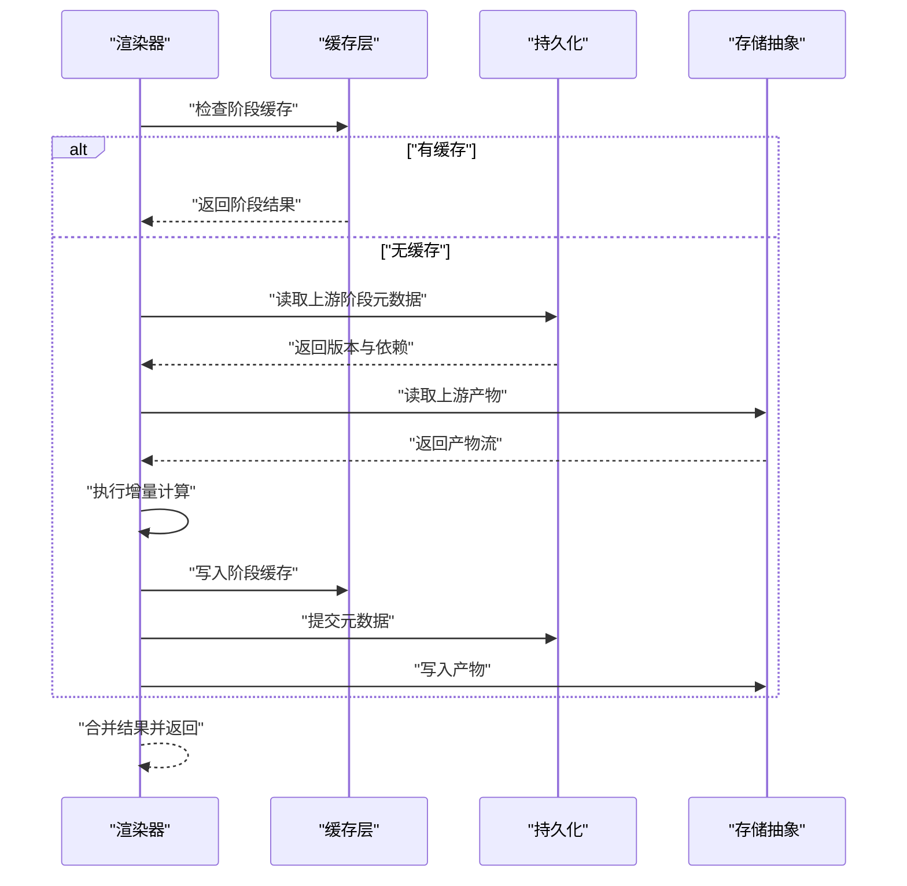

图表来源
- [src/features/render/renderer.ts](file://src/features/render/renderer.ts)
- [src/features/render/cache.ts](file://src/features/render/cache.ts)
- [src/features/render/persistence.ts](file://src/features/render/persistence.ts)
- [src/lib/storage/index.ts](file://src/lib/storage/index.ts)

章节来源
- [src/features/render/renderer.ts](file://src/features/render/renderer.ts)
- [src/features/render/cache.ts](file://src/features/render/cache.ts)
- [src/features/render/persistence.ts](file://src/features/render/persistence.ts)

### 文件存储管理与元数据持久化
- 存储抽象
  - 统一接口：上传、下载、删除、列表、签名 URL
  - 路径规范：按项目/类型/ID 分层，便于检索与清理
- 元数据模型
  - 资源 ID、版本、哈希、大小、MIME、创建/更新时间
  - 依赖关系：上游阶段与产物关联
- 版本控制
  - 乐观锁：基于版本号更新，防止覆盖
  - 快照与差异：保留历史版本，支持回滚
- 原子替换
  - 先写临时对象，校验通过后原子重命名/替换

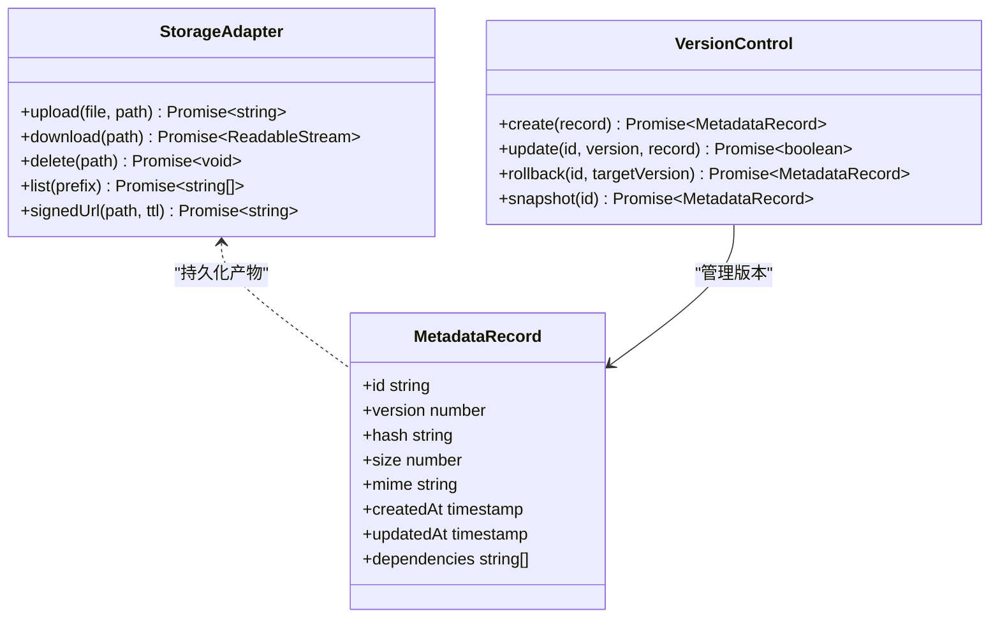

图表来源
- [src/lib/storage/index.ts](file://src/lib/storage/index.ts)
- [src/features/render/persistence.ts](file://src/features/render/persistence.ts)
- [src/features/render/repository.ts](file://src/features/render/repository.ts)

章节来源
- [src/lib/storage/index.ts](file://src/lib/storage/index.ts)
- [src/features/render/persistence.ts](file://src/features/render/persistence.ts)
- [src/features/render/repository.ts](file://src/features/render/repository.ts)

### 缓存优化算法与空间回收
- 淘汰策略
  - LRU/LFU：按最近最少使用/最不频繁使用淘汰
  - 容量阈值：达到上限触发清理
- 清理策略
  - 定时扫描：清理过期与冷数据
  - 事件触发：资源删除或版本切换时清理相关缓存
- 预取与预热
  - 预测访问热点，提前加载
  - 启动时预热常用模板与样式

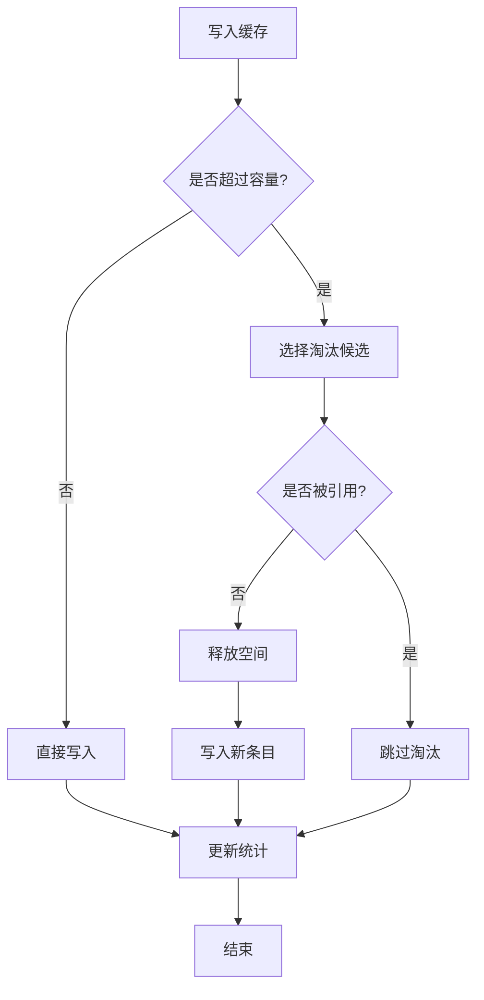

图表来源
- [src/features/render/cache.ts](file://src/features/render/cache.ts)

章节来源
- [src/features/render/cache.ts](file://src/features/render/cache.ts)

### 分布式缓存与 CDN 集成
- 分布式缓存
  - 通过对象存储作为共享缓存层，多实例共享同一份缓存
  - 一致性：基于哈希键与版本控制，避免脏读
- CDN 集成
  - 静态资源经 CDN 分发，降低源站压力
  - 缓存头：设置合适的 Cache-Control 与 ETag
  - 预热：发布新版本后预热热门资源

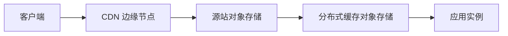

图表来源
- [src/lib/storage/index.ts](file://src/lib/storage/index.ts)
- [src/features/render/cache.ts](file://src/features/render/cache.ts)

章节来源
- [src/lib/storage/index.ts](file://src/lib/storage/index.ts)
- [src/features/render/cache.ts](file://src/features/render/cache.ts)

### 备份恢复与数据迁移
- 备份策略
  - 定期全量备份与增量备份结合
  - 备份校验：哈希校验与恢复演练
- 迁移工具
  - SQLite 与 Postgres 之间导入导出
  - 数据清洗与字段映射
- 恢复流程
  - 停止写入 -> 导入数据 -> 校验一致性 -> 重启服务

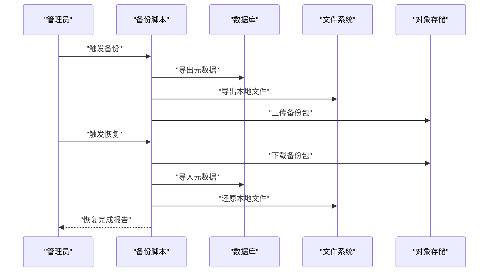

图表来源
- [scripts/migration/sqlite-backup.ts](file://scripts/migration/sqlite-backup.ts)
- [scripts/migration/import-postgres.ts](file://scripts/migration/import-postgres.ts)
- [scripts/migration/export-sqlite.ts](file://scripts/migration/export-sqlite.ts)

章节来源
- [scripts/migration/sqlite-backup.ts](file://scripts/migration/sqlite-backup.ts)
- [scripts/migration/import-postgres.ts](file://scripts/migration/import-postgres.ts)
- [scripts/migration/export-sqlite.ts](file://scripts/migration/export-sqlite.ts)

### 队列与导出服务
- 队列处理器
  - 任务入队：幂等键、优先级、超时
  - 调度：并发限制、重试退避、死信队列
- 导出服务
  - 流水线：收集产物、转码、压缩、打包
  - 进度：阶段性回调与最终结果通知

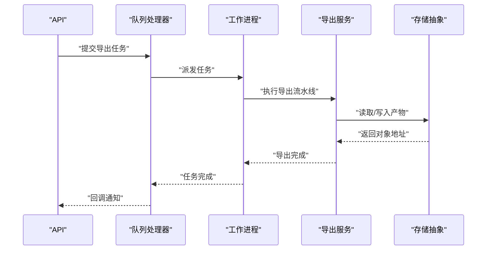

图表来源
- [src/features/render/queue-handler.ts](file://src/features/render/queue-handler.ts)
- [src/features/render/export-service.ts](file://src/features/render/export-service.ts)
- [src/lib/storage/index.ts](file://src/lib/storage/index.ts)

章节来源
- [src/features/render/queue-handler.ts](file://src/features/render/queue-handler.ts)
- [src/features/render/export-service.ts](file://src/features/render/export-service.ts)

### 缩略图与媒体处理
- 缩略图生成
  - 尺寸策略：标准尺寸与自适应裁剪
  - 懒加载：按需生成，减少初始负载
- 缓存联动
  - 缩略图缓存键与源资源版本绑定
  - 源资源更新时自动失效缩略图

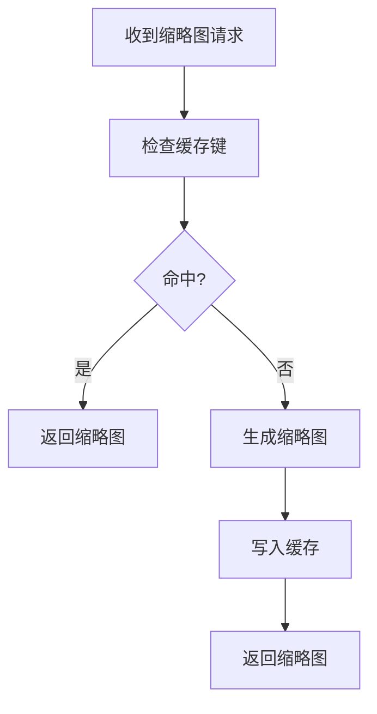

图表来源
- [src/features/render/thumbnail.ts](file://src/features/render/thumbnail.ts)
- [src/features/render/cache.ts](file://src/features/render/cache.ts)

章节来源
- [src/features/render/thumbnail.ts](file://src/features/render/thumbnail.ts)
- [src/features/render/cache.ts](file://src/features/render/cache.ts)

## 依赖关系分析
- 组件耦合
  - 缓存层依赖存储抽象与持久化，渲染器依赖仓库层与存储抽象
  - 队列处理器与导出服务解耦，通过消息传递
- 外部依赖
  - 数据库（Postgres/SQLite）
  - 对象存储（本地/云存储）
  - CDN（可选）
- 潜在循环依赖
  - 通过接口与适配器避免循环，保持单向依赖

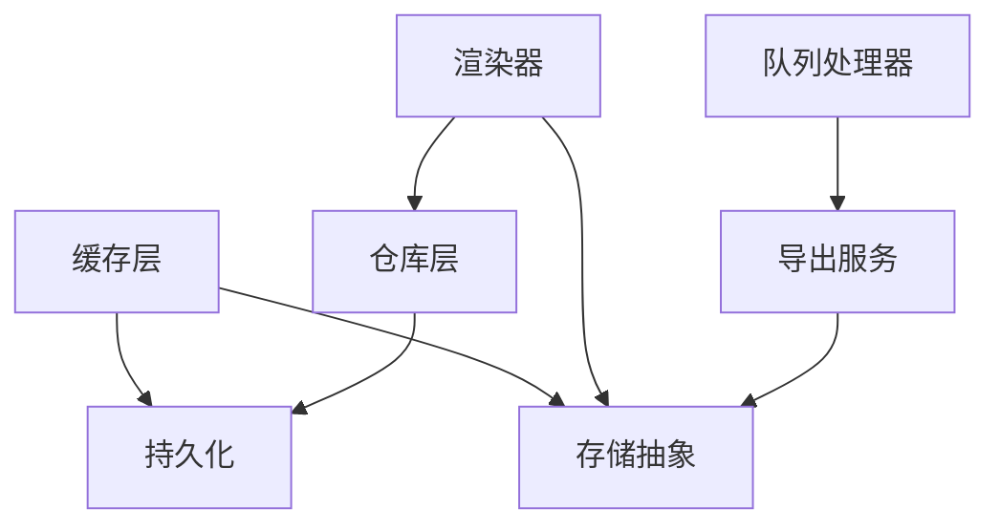

图表来源
- [src/features/render/cache.ts](file://src/features/render/cache.ts)
- [src/features/render/renderer.ts](file://src/features/render/renderer.ts)
- [src/features/render/repository.ts](file://src/features/render/repository.ts)
- [src/features/render/persistence.ts](file://src/features/render/persistence.ts)
- [src/features/render/queue-handler.ts](file://src/features/render/queue-handler.ts)
- [src/features/render/export-service.ts](file://src/features/render/export-service.ts)
- [src/lib/storage/index.ts](file://src/lib/storage/index.ts)

章节来源
- [src/features/render/cache.ts](file://src/features/render/cache.ts)
- [src/features/render/renderer.ts](file://src/features/render/renderer.ts)
- [src/features/render/repository.ts](file://src/features/render/repository.ts)
- [src/features/render/persistence.ts](file://src/features/render/persistence.ts)
- [src/features/render/queue-handler.ts](file://src/features/render/queue-handler.ts)
- [src/features/render/export-service.ts](file://src/features/render/export-service.ts)
- [src/lib/storage/index.ts](file://src/lib/storage/index.ts)

## 性能考量
- 缓存命中率优化
  - 合理设置 TTL 与容量阈值
  - 热点数据预热与预取
- 渲染性能
  - 增量渲染减少重复计算
  - 阶段级缓存提升复用率
- 存储性能
  - 分片上传与并行 IO
  - 对象存储选择就近区域与 CDN 加速
- 队列与并发
  - 合理设置并发度与限流
  - 失败重试与退避策略

## 故障排查指南
- 常见问题
  - 缓存未命中率高：检查缓存键生成与失效策略
  - 渲染失败：查看阶段日志与依赖版本
  - 存储写入失败：检查权限与网络连通性
- 诊断步骤
  - 启用详细日志与指标采集
  - 验证缓存键与对象存储路径
  - 检查数据库事务与锁竞争
- 恢复措施
  - 清理损坏缓存与临时文件
  - 回滚到上一版本
  - 重新导入备份数据

## 结论
PurpleInk 的缓存与存储系统通过多级缓存、增量渲染、版本控制与统一的存储抽象，实现了高性能、可扩展与高可用的数据管理。配合队列与导出服务、缩略图处理、备份迁移工具，形成完整的闭环。建议在生产环境中持续监控指标、优化缓存策略与存储后端，确保系统稳定与高效运行。

## 附录
- 配置建议
  - 缓存 TTL 与容量阈值按业务流量调整
  - 对象存储选择与 CDN 前缀配置
- 监控指标
  - 缓存命中率、平均延迟、错误率
  - 存储 IO 吞吐与对象数量
  - 队列长度与处理时长
- 最佳实践
  - 幂等键与版本控制贯穿全流程
  - 原子替换与校验保障一致性
  - 定期备份与恢复演练