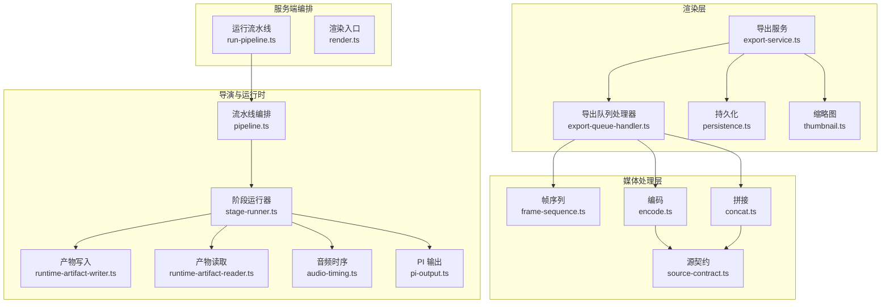
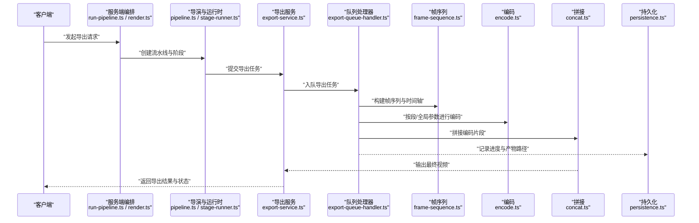
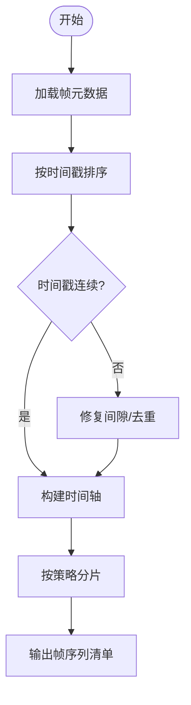
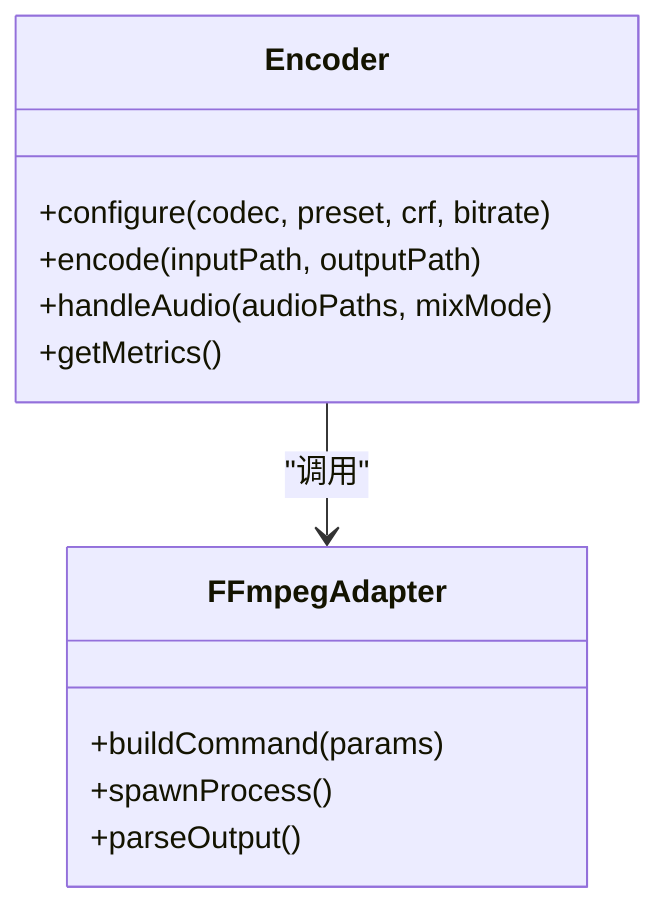
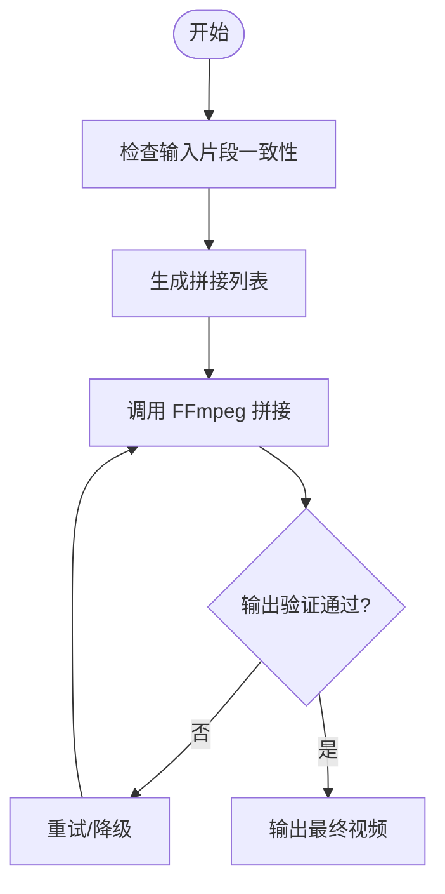
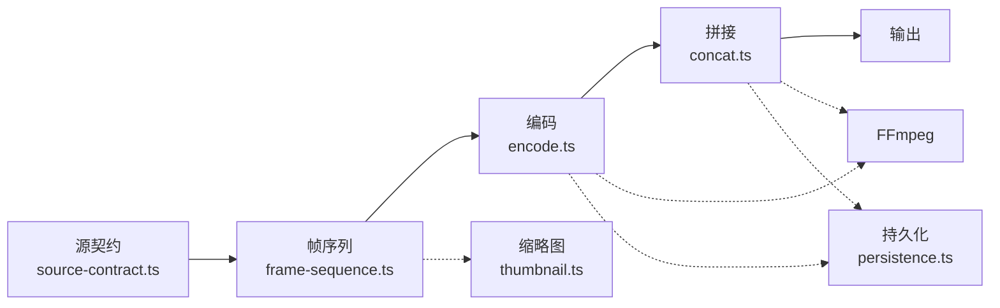

# 视频处理流水线

<cite>
**本文引用的文件**   
- [src/features/render/renderer.ts](file://src/features/render/renderer.ts)
- [src/features/render/encode.ts](file://src/features/render/encode.ts)
- [src/features/render/frame-sequence.ts](file://src/features/render/frame-sequence.ts)
- [src/features/render/concat.ts](file://src/features/render/concat.ts)
- [src/features/render/export-service.ts](file://src/features/render/export-service.ts)
- [src/features/render/export-queue-handler.ts](file://src/features/render/export-queue-handler.ts)
- [src/features/render/thumbnail.ts](file://src/features/render/thumbnail.ts)
- [src/features/render/persistence.ts](file://src/features/render/persistence.ts)
- [src/features/render/source-contract.ts](file://src/features/render/source-contract.ts)
- [src/features/director/pipeline.ts](file://src/features/director/pipeline.ts)
- [src/features/director/stage-runner.ts](file://src/features/director/stage-runner.ts)
- [src/features/director/runtime-artifact-writer.ts](file://src/features/director/runtime-artifact-writer.ts)
- [src/features/director/runtime-artifact-reader.ts](file://src/features/director/runtime-artifact-reader.ts)
- [src/features/director/audio-timing.ts](file://src/features/director/audio-timing.ts)
- [src/features/director/pi-output.ts](file://src/features/director/pi-output.ts)
- [server/src/compose/run-pipeline.ts](file://server/src/compose/run-pipeline.ts)
- [server/src/compose/render.ts](file://server/src/compose/render.ts)
</cite>

## 目录
1. [简介](#简介)
2. [项目结构](#项目结构)
3. [核心组件](#核心组件)
4. [架构总览](#架构总览)
5. [详细组件分析](#详细组件分析)
6. [依赖关系分析](#依赖关系分析)
7. [性能考量](#性能考量)
8. [故障排查指南](#故障排查指南)
9. [结论](#结论)
10. [附录](#附录)

## 简介
本文件面向 PurpleInk 的视频处理流水线，系统性阐述帧序列处理、媒体组装与视频编码流程。文档覆盖 FFmpeg 集成方式、格式转换与质量参数配置、视频拼接算法、时间轴同步与音频混合机制、编解码器选择与比特率控制、输出优化策略，以及自定义编码器与后处理器的开发指南。目标是帮助开发者快速理解并扩展渲染管线，确保高质量、可维护且高性能的视频导出能力。

## 项目结构
PurpleInk 的视频处理相关代码主要分布在以下模块：
- 渲染服务与队列：负责任务调度、持久化与导出编排
- 帧序列与媒体处理：负责帧抽取、缩略图生成、帧序列组织
- 编码与拼接：封装 FFmpeg 调用，完成转码、拼接与输出
- 导演与运行时：编排阶段执行、产物读写、音频时序对齐

图表来源
- [src/features/render/export-service.ts](file://src/features/render/export-service.ts)
- [src/features/render/export-queue-handler.ts](file://src/features/render/export-queue-handler.ts)
- [src/features/render/frame-sequence.ts](file://src/features/render/frame-sequence.ts)
- [src/features/render/encode.ts](file://src/features/render/encode.ts)
- [src/features/render/concat.ts](file://src/features/render/concat.ts)
- [src/features/render/source-contract.ts](file://src/features/render/source-contract.ts)
- [src/features/render/thumbnail.ts](file://src/features/render/thumbnail.ts)
- [src/features/render/persistence.ts](file://src/features/render/persistence.ts)
- [src/features/director/pipeline.ts](file://src/features/director/pipeline.ts)
- [src/features/director/stage-runner.ts](file://src/features/director/stage-runner.ts)
- [src/features/director/runtime-artifact-writer.ts](file://src/features/director/runtime-artifact-writer.ts)
- [src/features/director/runtime-artifact-reader.ts](file://src/features/director/runtime-artifact-reader.ts)
- [src/features/director/audio-timing.ts](file://src/features/director/audio-timing.ts)
- [src/features/director/pi-output.ts](file://src/features/director/pi-output.ts)
- [server/src/compose/run-pipeline.ts](file://server/src/compose/run-pipeline.ts)
- [server/src/compose/render.ts](file://server/src/compose/render.ts)

章节来源
- [src/features/render/export-service.ts](file://src/features/render/export-service.ts)
- [src/features/render/export-queue-handler.ts](file://src/features/render/export-queue-handler.ts)
- [src/features/render/frame-sequence.ts](file://src/features/render/frame-sequence.ts)
- [src/features/render/encode.ts](file://src/features/render/encode.ts)
- [src/features/render/concat.ts](file://src/features/render/concat.ts)
- [src/features/render/source-contract.ts](file://src/features/render/source-contract.ts)
- [src/features/render/thumbnail.ts](file://src/features/render/thumbnail.ts)
- [src/features/render/persistence.ts](file://src/features/render/persistence.ts)
- [src/features/director/pipeline.ts](file://src/features/director/pipeline.ts)
- [src/features/director/stage-runner.ts](file://src/features/director/stage-runner.ts)
- [src/features/director/runtime-artifact-writer.ts](file://src/features/director/runtime-artifact-writer.ts)
- [src/features/director/runtime-artifact-reader.ts](file://src/features/director/runtime-artifact-reader.ts)
- [src/features/director/audio-timing.ts](file://src/features/director/audio-timing.ts)
- [src/features/director/pi-output.ts](file://src/features/director/pi-output.ts)
- [server/src/compose/run-pipeline.ts](file://server/src/compose/run-pipeline.ts)
- [server/src/compose/render.ts](file://server/src/compose/render.ts)

## 核心组件
- 导出服务（Export Service）：对外提供导出接口，协调队列、存储与渲染生命周期
- 导出队列处理器（Queue Handler）：消费导出任务，按阶段驱动帧序列、编码与拼接
- 帧序列（Frame Sequence）：管理帧元数据、顺序与裁剪，支撑时间轴构建
- 编码（Encode）：封装 FFmpeg 转码，支持多编解码器、质量与比特率策略
- 拼接（Concat）：基于 FFmpeg 的流式或文件级拼接，保证时间戳连续与无缝衔接
- 源契约（Source Contract）：统一输入源抽象（本地文件、URL、内存流等）
- 缩略图（Thumbnail）：从视频或帧序列中抽取关键帧生成预览
- 持久化（Persistence）：导出状态、中间产物与最终输出的落盘与索引
- 导演与运行时（Director & Runtime）：阶段编排、产物读写、音频时序对齐与输出协议
- 服务端编排（Server Orchestration）：将业务请求接入流水线，触发渲染与导出

章节来源
- [src/features/render/export-service.ts](file://src/features/render/export-service.ts)
- [src/features/render/export-queue-handler.ts](file://src/features/render/export-queue-handler.ts)
- [src/features/render/frame-sequence.ts](file://src/features/render/frame-sequence.ts)
- [src/features/render/encode.ts](file://src/features/render/encode.ts)
- [src/features/render/concat.ts](file://src/features/render/concat.ts)
- [src/features/render/source-contract.ts](file://src/features/render/source-contract.ts)
- [src/features/render/thumbnail.ts](file://src/features/render/thumbnail.ts)
- [src/features/render/persistence.ts](file://src/features/render/persistence.ts)
- [src/features/director/pipeline.ts](file://src/features/director/pipeline.ts)
- [src/features/director/stage-runner.ts](file://src/features/director/stage-runner.ts)
- [src/features/director/runtime-artifact-writer.ts](file://src/features/director/runtime-artifact-writer.ts)
- [src/features/director/runtime-artifact-reader.ts](file://src/features/director/runtime-artifact-reader.ts)
- [src/features/director/audio-timing.ts](file://src/features/director/audio-timing.ts)
- [src/features/director/pi-output.ts](file://src/features/director/pi-output.ts)
- [server/src/compose/run-pipeline.ts](file://server/src/compose/run-pipeline.ts)
- [server/src/compose/render.ts](file://server/src/compose/render.ts)

## 架构总览
下图展示从请求到导出的端到端流程：服务端接收请求，进入导演编排，阶段运行器驱动产物读写与音频时序；导出服务通过队列处理器调度帧序列、编码与拼接，最终输出视频与缩略图，并持久化结果。

图表来源
- [server/src/compose/run-pipeline.ts](file://server/src/compose/run-pipeline.ts)
- [server/src/compose/render.ts](file://server/src/compose/render.ts)
- [src/features/director/pipeline.ts](file://src/features/director/pipeline.ts)
- [src/features/director/stage-runner.ts](file://src/features/director/stage-runner.ts)
- [src/features/render/export-service.ts](file://src/features/render/export-service.ts)
- [src/features/render/export-queue-handler.ts](file://src/features/render/export-queue-handler.ts)
- [src/features/render/frame-sequence.ts](file://src/features/render/frame-sequence.ts)
- [src/features/render/encode.ts](file://src/features/render/encode.ts)
- [src/features/render/concat.ts](file://src/features/render/concat.ts)
- [src/features/render/persistence.ts](file://src/features/render/persistence.ts)

## 详细组件分析

### 帧序列处理（Frame Sequence）
- 职责：组织帧元数据、排序、裁剪与时间轴映射，为后续编码与拼接提供有序输入
- 关键点：
  - 帧索引与时间戳一致性校验，避免跳帧或重复
  - 支持分段与合并，便于并行编码与增量更新
  - 与音频轨道的时间对齐，确保音画同步
- 复杂度：线性扫描与排序 O(n log n)，裁剪与映射 O(n)

图表来源
- [src/features/render/frame-sequence.ts](file://src/features/render/frame-sequence.ts)

章节来源
- [src/features/render/frame-sequence.ts](file://src/features/render/frame-sequence.ts)

### 媒体组装与视频编码（Encode）
- 职责：封装 FFmpeg 调用，实现格式转换、质量与比特率控制、多通道音频处理
- 关键点：
  - 编解码器选择：根据目标平台与兼容性选择 H.264/H.265/VP9 等
  - 质量参数：CRF/CQP、预设（preset）、速率控制（vbr/cbr）
  - 音频：采样率、声道数、编码格式（AAC/Opus），音量归一化
  - 错误处理：FFmpeg 退出码解析、重试与降级策略
- 性能：并行编码片段、GPU 加速（可选）、I/O 缓冲优化

图表来源
- [src/features/render/encode.ts](file://src/features/render/encode.ts)

章节来源
- [src/features/render/encode.ts](file://src/features/render/encode.ts)

### 视频拼接（Concat）
- 职责：将多个编码片段无缝拼接，保持时间戳连续与音画同步
- 关键点：
  - 使用 FFmpeg concat 协议或 demuxer，确保输入一致（分辨率、帧率、编码参数）
  - 处理音频混音与轨对齐，避免静音段或错位
  - 失败回滚与断点续拼
- 复杂度：线性拼接 O(n)，I/O 密集

图表来源
- [src/features/render/concat.ts](file://src/features/render/concat.ts)

章节来源
- [src/features/render/concat.ts](file://src/features/render/concat.ts)

### 源契约（Source Contract）
- 职责：统一输入源抽象，屏蔽本地文件、HTTP URL、内存流等差异
- 关键点：
  - 统一的读取接口与元数据获取
  - 流式读取与缓存策略，减少磁盘 I/O
  - 错误传播与超时控制

章节来源
- [src/features/render/source-contract.ts](file://src/features/render/source-contract.ts)

### 缩略图（Thumbnail）
- 职责：从视频或帧序列中抽取关键帧生成预览图
- 关键点：
  - 基于时间戳或内容相似度选取关键帧
  - 尺寸与格式配置（JPEG/PNG/WebP）
  - 并发生成与缓存命中

章节来源
- [src/features/render/thumbnail.ts](file://src/features/render/thumbnail.ts)

### 持久化（Persistence）
- 职责：导出任务状态、中间产物与最终输出的落盘与索引
- 关键点：
  - 原子写入与事务性更新，避免部分写入导致不一致
  - 元数据与路径映射，便于查询与恢复
  - 清理策略与空间回收

章节来源
- [src/features/render/persistence.ts](file://src/features/render/persistence.ts)

### 导出服务与队列（Export Service & Queue）
- 职责：对外提供导出 API，内部通过队列异步处理任务，保障吞吐与稳定性
- 关键点：
  - 任务入队、优先级与重试
  - 进度上报与状态机管理
  - 资源隔离与限流

章节来源
- [src/features/render/export-service.ts](file://src/features/render/export-service.ts)
- [src/features/render/export-queue-handler.ts](file://src/features/render/export-queue-handler.ts)

### 导演与运行时（Director & Runtime）
- 职责：编排各阶段执行，管理产物读写、音频时序对齐与输出协议
- 关键点：
  - 阶段运行器驱动产物写入与读取，解耦阶段逻辑
  - 音频时序对齐确保音画同步
  - PI 输出协议标准化产物结构

章节来源
- [src/features/director/pipeline.ts](file://src/features/director/pipeline.ts)
- [src/features/director/stage-runner.ts](file://src/features/director/stage-runner.ts)
- [src/features/director/runtime-artifact-writer.ts](file://src/features/director/runtime-artifact-writer.ts)
- [src/features/director/runtime-artifact-reader.ts](file://src/features/director/runtime-artifact-reader.ts)
- [src/features/director/audio-timing.ts](file://src/features/director/audio-timing.ts)
- [src/features/director/pi-output.ts](file://src/features/director/pi-output.ts)

### 服务端编排（Server Orchestration）
- 职责：将业务请求接入流水线，触发渲染与导出
- 关键点：
  - 请求解析与参数校验
  - 流水线启动与状态监控
  - 错误处理与用户反馈

章节来源
- [server/src/compose/run-pipeline.ts](file://server/src/compose/run-pipeline.ts)
- [server/src/compose/render.ts](file://server/src/compose/render.ts)

## 依赖关系分析
- 低耦合高内聚：各组件通过明确接口交互，如 Source Contract、Encoder 接口、Concat 协议
- 外部依赖：FFmpeg 作为核心媒体处理引擎，所有转码与拼接均通过其命令行或库调用
- 数据流：帧序列 → 编码 → 拼接 → 输出；音频时序在编码与拼接阶段参与对齐
- 潜在循环依赖：通过分层与接口隔离避免，如导演层不直接依赖 FFmpeg 实现细节

图表来源
- [src/features/render/source-contract.ts](file://src/features/render/source-contract.ts)
- [src/features/render/frame-sequence.ts](file://src/features/render/frame-sequence.ts)
- [src/features/render/encode.ts](file://src/features/render/encode.ts)
- [src/features/render/concat.ts](file://src/features/render/concat.ts)
- [src/features/render/thumbnail.ts](file://src/features/render/thumbnail.ts)
- [src/features/render/persistence.ts](file://src/features/render/persistence.ts)

章节来源
- [src/features/render/source-contract.ts](file://src/features/render/source-contract.ts)
- [src/features/render/frame-sequence.ts](file://src/features/render/frame-sequence.ts)
- [src/features/render/encode.ts](file://src/features/render/encode.ts)
- [src/features/render/concat.ts](file://src/features/render/concat.ts)
- [src/features/render/thumbnail.ts](file://src/features/render/thumbnail.ts)
- [src/features/render/persistence.ts](file://src/features/render/persistence.ts)

## 性能考量
- 并行编码：按帧序列分片并行编码，利用多核 CPU/GPU 加速
- I/O 优化：使用流式读取与写缓冲，减少磁盘随机 I/O
- 内存管理：限制单任务内存占用，避免大对象堆积
- 缓存策略：缩略图与中间产物缓存，命中则跳过重复计算
- 自适应质量：根据设备与网络动态调整 CRF/比特率，平衡质量与体积

[本节为通用指导，无需特定文件引用]

## 故障排查指南
- FFmpeg 错误码解析：捕获非零退出码，定位具体错误（如输入不支持、编码失败）
- 时间轴异常：检查帧序列时间戳连续性，确认音频偏移与对齐
- 拼接失败：验证输入片段一致性（分辨率、帧率、编码参数），检查 concat 列表
- 资源不足：监控 CPU/GPU/内存/磁盘空间，设置合理并发与限流
- 状态不一致：检查持久化写入原子性与事务性，必要时回滚与重建索引

章节来源
- [src/features/render/encode.ts](file://src/features/render/encode.ts)
- [src/features/render/concat.ts](file://src/features/render/concat.ts)
- [src/features/render/persistence.ts](file://src/features/render/persistence.ts)

## 结论
PurpleInk 的视频处理流水线以 FFmpeg 为核心，结合清晰的组件分层与接口契约，实现了高效的帧序列处理、媒体组装与视频编码。通过导出服务与队列机制，系统具备良好的吞吐与稳定性。开发者可基于现有接口扩展自定义编码器与后处理器，满足多样化需求。

[本节为总结，无需特定文件引用]

## 附录
- 编解码器选择建议：优先 H.264（兼容性好），H.265（更高压缩比），VP9（Web 场景）
- 质量参数推荐：CRF 18-23（视觉质量与体积平衡），preset medium/fast（速度与质量权衡）
- 音频配置：AAC-LC 128-192kbps，48kHz，立体声；必要时启用响度归一化
- 输出优化：启用硬件加速（NVENC/VAAPI），使用流式写入，避免临时文件过多

[本节为补充信息，无需特定文件引用]