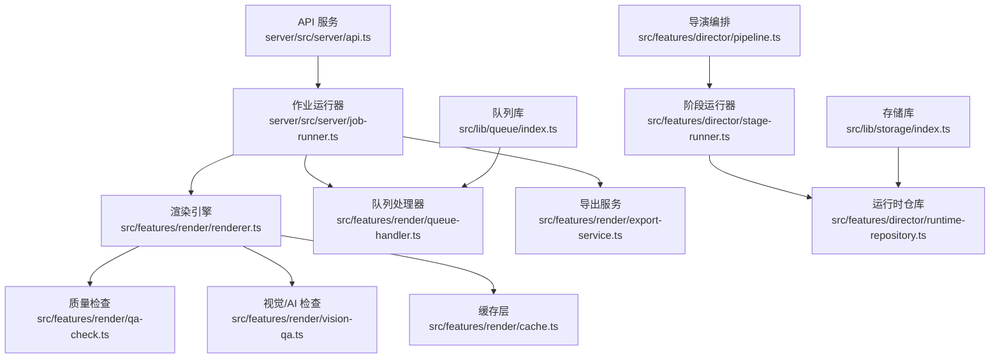
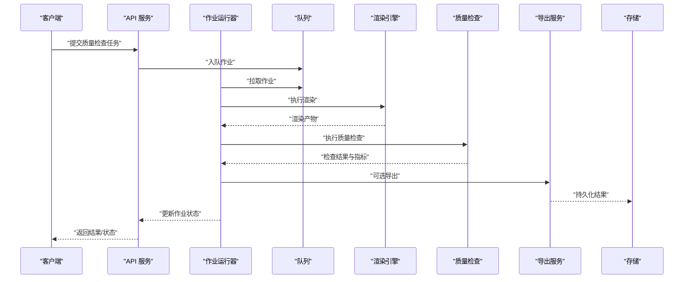
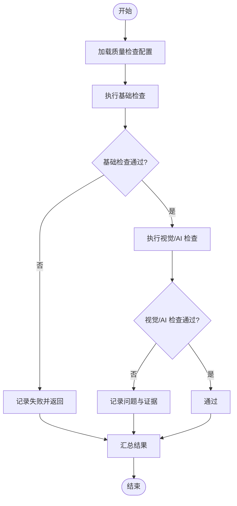
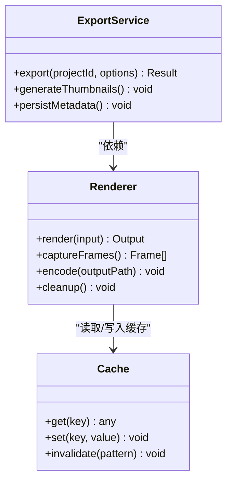
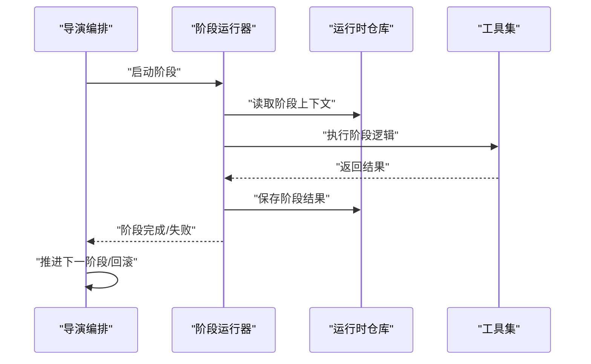
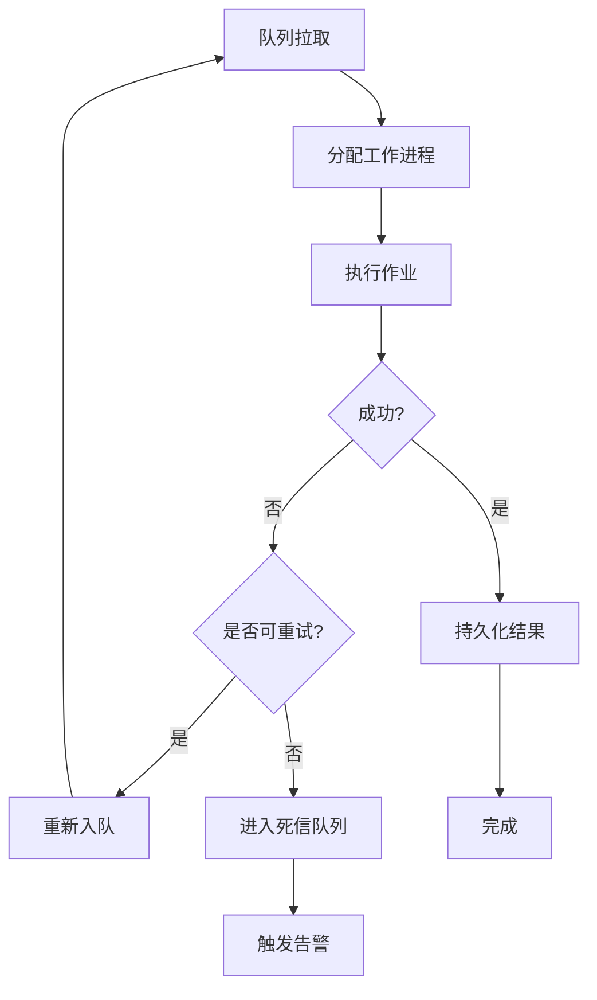
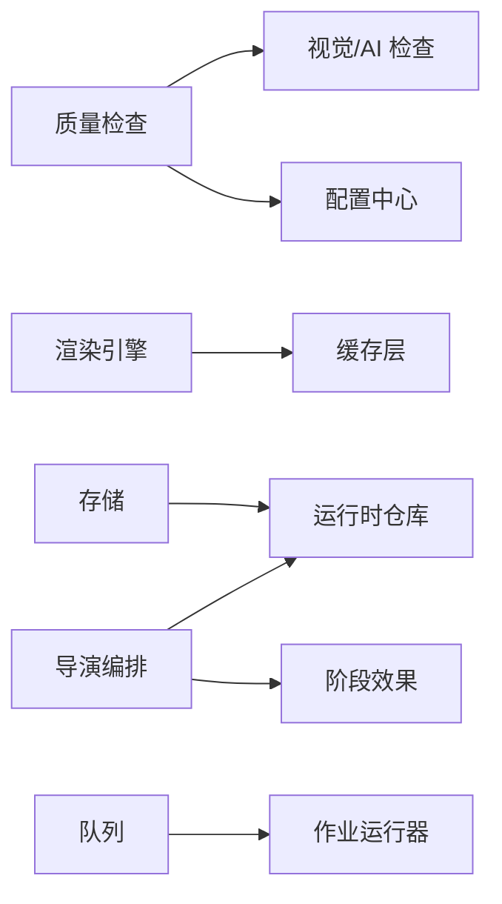

# 质量检查系统

<cite>
**本文引用的文件**   
- [server/src/index.ts](file://server/src/index.ts)
- [server/src/server/api.ts](file://server/src/server/api.ts)
- [server/src/server/job-runner.ts](file://server/src/server/job-runner.ts)
- [server/src/server/job-store.ts](file://server/src/server/job-store.ts)
- [src/features/render/qa-check.ts](file://src/features/render/qa-check.ts)
- [src/features/render/vision-qa.ts](file://src/features/render/vision-qa.ts)
- [src/features/render/renderer.ts](file://src/features/render/renderer.ts)
- [src/features/render/queue-handler.ts](file://src/features/render/queue-handler.ts)
- [src/features/render/export-service.ts](file://src/features/render/export-service.ts)
- [src/features/render/cache.ts](file://src/features/render/cache.ts)
- [src/features/director/pipeline.ts](file://src/features/director/pipeline.ts)
- [src/features/director/stage-runner.ts](file://src/features/director/stage-runner.ts)
- [src/features/director/runtime-repository.ts](file://src/features/director/runtime-repository.ts)
- [src/features/director/stage-result.ts](file://src/features/director/stage-result.ts)
- [src/features/director/stage-effects.ts](file://src/features/director/stage-effects.ts)
- [src/features/director/tools/validate-shot-plan.ts](file://src/features/director/tools/validate-shot-plan.ts)
- [src/features/director/tools/check-determinism.ts](file://src/features/director/tools/check-determinism.ts)
- [src/features/director/prompts/assemble.ts](file://src/features/director/prompts/assemble.ts)
- [src/lib/queue/index.ts](file://src/lib/queue/index.ts)
- [src/lib/storage/index.ts](file://src/lib/storage/index.ts)
- [deploy/compose.yaml](file://deploy/compose.yaml)
- [deploy/env.example](file://deploy/env.example)
- [scripts/verify/e2e-smoke.ts](file://scripts/verify/e2e-smoke.ts)
</cite>

## 目录
1. [简介](#简介)
2. [项目结构](#项目结构)
3. [核心组件](#核心组件)
4. [架构总览](#架构总览)
5. [详细组件分析](#详细组件分析)
6. [依赖关系分析](#依赖关系分析)
7. [性能考量](#性能考量)
8. [故障排查指南](#故障排查指南)
9. [结论](#结论)
10. [附录](#附录)

## 简介
本文件为 PurpleInk 质量检查系统的权威技术文档，聚焦视觉质量评估、AI 图像分析与内容验证机制。文档覆盖质量指标定义、阈值配置与异常检测算法；说明批量检查流程、结果报告与问题定位方法；并提供自定义检查规则开发与性能优化策略；最后给出质量监控与告警配置指南。读者无需深入代码即可理解系统能力与使用方式。

## 项目结构
质量检查系统由服务端 API、渲染与导出管线、导演编排（Pipeline）、队列与存储等模块组成。关键路径包括：
- 服务端入口与 API：负责接收任务、调度执行与返回结果
- 渲染与导出：负责帧捕获、编码、缩略图生成与导出
- 质量检查（QA）：包含通用 QA 检查与基于视觉/AI 的检查
- 导演编排：将多阶段任务组织为可执行的流水线，支持状态持久化与恢复
- 队列与存储：提供异步任务处理与数据持久化

图表来源
- [server/src/server/api.ts](file://server/src/server/api.ts)
- [server/src/server/job-runner.ts](file://server/src/server/job-runner.ts)
- [src/features/render/renderer.ts](file://src/features/render/renderer.ts)
- [src/features/render/qa-check.ts](file://src/features/render/qa-check.ts)
- [src/features/render/vision-qa.ts](file://src/features/render/vision-qa.ts)
- [src/features/render/cache.ts](file://src/features/render/cache.ts)
- [src/features/render/queue-handler.ts](file://src/features/render/queue-handler.ts)
- [src/features/render/export-service.ts](file://src/features/render/export-service.ts)
- [src/features/director/pipeline.ts](file://src/features/director/pipeline.ts)
- [src/features/director/stage-runner.ts](file://src/features/director/stage-runner.ts)
- [src/features/director/runtime-repository.ts](file://src/features/director/runtime-repository.ts)
- [src/lib/queue/index.ts](file://src/lib/queue/index.ts)
- [src/lib/storage/index.ts](file://src/lib/storage/index.ts)

章节来源
- [server/src/index.ts](file://server/src/index.ts)
- [server/src/server/api.ts](file://server/src/server/api.ts)
- [server/src/server/job-runner.ts](file://server/src/server/job-runner.ts)
- [src/features/render/renderer.ts](file://src/features/render/renderer.ts)
- [src/features/render/qa-check.ts](file://src/features/render/qa-check.ts)
- [src/features/render/vision-qa.ts](file://src/features/render/vision-qa.ts)
- [src/features/render/cache.ts](file://src/features/render/cache.ts)
- [src/features/render/queue-handler.ts](file://src/features/render/queue-handler.ts)
- [src/features/render/export-service.ts](file://src/features/render/export-service.ts)
- [src/features/director/pipeline.ts](file://src/features/director/pipeline.ts)
- [src/features/director/stage-runner.ts](file://src/features/director/stage-runner.ts)
- [src/features/director/runtime-repository.ts](file://src/features/director/runtime-repository.ts)
- [src/lib/queue/index.ts](file://src/lib/queue/index.ts)
- [src/lib/storage/index.ts](file://src/lib/storage/index.ts)

## 核心组件
- 质量检查（QA）模块
  - 通用质量检查：对渲染产物进行基础校验（如尺寸、格式、完整性）
  - 视觉/AI 检查：调用 AI 模型或视觉工具进行图像质量评估与内容验证
- 渲染引擎：协调帧捕获、编码、缩略图生成与导出
- 导演编排：将多阶段任务组织为流水线，管理状态、错误与重试
- 队列与存储：支撑异步任务与持久化

章节来源
- [src/features/render/qa-check.ts](file://src/features/render/qa-check.ts)
- [src/features/render/vision-qa.ts](file://src/features/render/vision-qa.ts)
- [src/features/render/renderer.ts](file://src/features/render/renderer.ts)
- [src/features/director/pipeline.ts](file://src/features/director/pipeline.ts)
- [src/features/director/stage-runner.ts](file://src/features/director/stage-runner.ts)
- [src/features/director/runtime-repository.ts](file://src/features/director/runtime-repository.ts)
- [src/lib/queue/index.ts](file://src/lib/queue/index.ts)
- [src/lib/storage/index.ts](file://src/lib/storage/index.ts)

## 架构总览
质量检查系统采用“API + 作业运行器 + 渲染/QA + 导演编排”的分层架构。API 层接收请求并创建作业；作业运行器从队列消费任务，驱动渲染与 QA；导演编排负责复杂的多阶段任务流；缓存与存储保障性能与可靠性。

图表来源
- [server/src/server/api.ts](file://server/src/server/api.ts)
- [server/src/server/job-runner.ts](file://server/src/server/job-runner.ts)
- [src/features/render/renderer.ts](file://src/features/render/renderer.ts)
- [src/features/render/qa-check.ts](file://src/features/render/qa-check.ts)
- [src/features/render/export-service.ts](file://src/features/render/export-service.ts)
- [src/lib/queue/index.ts](file://src/lib/queue/index.ts)
- [src/lib/storage/index.ts](file://src/lib/storage/index.ts)

## 详细组件分析

### 质量检查（QA）模块
- 通用质量检查
  - 职责：对渲染产物进行基础校验，如分辨率、宽高比、文件格式、文件大小、元数据完整性
  - 指标定义：分辨率阈值、宽高比容差、文件大小上限、缺失字段检测
  - 阈值配置：通过配置文件或环境变量注入，支持按项目或批次调整
  - 异常检测：当指标越界或缺失时记录告警并标记失败
- 视觉/AI 检查
  - 职责：调用 AI 模型或视觉工具进行图像质量评估与内容验证
  - 算法要点：清晰度评分、色彩一致性、文本可读性、对象识别与合规性校验
  - 集成点：通过适配器与外部模型服务通信，支持多模型路由与降级
  - 结果输出：结构化评分、问题定位（区域/标签）、置信度与证据截图

图表来源
- [src/features/render/qa-check.ts](file://src/features/render/qa-check.ts)
- [src/features/render/vision-qa.ts](file://src/features/render/vision-qa.ts)

章节来源
- [src/features/render/qa-check.ts](file://src/features/render/qa-check.ts)
- [src/features/render/vision-qa.ts](file://src/features/render/vision-qa.ts)

### 渲染引擎与导出
- 渲染引擎
  - 职责：驱动浏览器或渲染后端生成帧序列、合成与编码
  - 关键点：帧捕获稳定性、并发控制、资源清理与错误恢复
- 导出服务
  - 职责：将渲染产物打包导出（视频/图片集），生成缩略图与元数据
  - 关键点：编码参数、分片导出、进度上报与断点续传

图表来源
- [src/features/render/renderer.ts](file://src/features/render/renderer.ts)
- [src/features/render/export-service.ts](file://src/features/render/export-service.ts)
- [src/features/render/cache.ts](file://src/features/render/cache.ts)

章节来源
- [src/features/render/renderer.ts](file://src/features/render/renderer.ts)
- [src/features/render/export-service.ts](file://src/features/render/export-service.ts)
- [src/features/render/cache.ts](file://src/features/render/cache.ts)

### 导演编排（Pipeline）与阶段运行器
- 导演编排
  - 职责：将多阶段任务组织为流水线，管理输入输出、状态机与错误处理
  - 关键点：阶段依赖解析、幂等性、回滚与恢复
- 阶段运行器
  - 职责：执行单个阶段逻辑，封装上下文与副作用
  - 关键点：重试策略、超时控制、日志与审计
- 运行时仓库
  - 职责：持久化阶段状态、中间产物与结果，支持查询与恢复

图表来源
- [src/features/director/pipeline.ts](file://src/features/director/pipeline.ts)
- [src/features/director/stage-runner.ts](file://src/features/director/stage-runner.ts)
- [src/features/director/runtime-repository.ts](file://src/features/director/runtime-repository.ts)
- [src/features/director/stage-result.ts](file://src/features/director/stage-result.ts)

章节来源
- [src/features/director/pipeline.ts](file://src/features/director/pipeline.ts)
- [src/features/director/stage-runner.ts](file://src/features/director/stage-runner.ts)
- [src/features/director/runtime-repository.ts](file://src/features/director/runtime-repository.ts)
- [src/features/director/stage-result.ts](file://src/features/director/stage-result.ts)

### 队列与作业处理
- 队列处理器
  - 职责：从队列拉取作业，分配工作进程，处理并发与背压
  - 关键点：重试、死信队列、限流与优先级
- 作业运行器
  - 职责：协调渲染、QA 与导出，更新作业状态与结果

图表来源
- [src/features/render/queue-handler.ts](file://src/features/render/queue-handler.ts)
- [server/src/server/job-runner.ts](file://server/src/server/job-runner.ts)
- [src/lib/queue/index.ts](file://src/lib/queue/index.ts)

章节来源
- [src/features/render/queue-handler.ts](file://src/features/render/queue-handler.ts)
- [server/src/server/job-runner.ts](file://server/src/server/job-runner.ts)
- [src/lib/queue/index.ts](file://src/lib/queue/index.ts)

### 自定义检查规则开发
- 规则定义
  - 接口规范：输入为渲染产物与上下文，输出为检查结果（通过/失败/警告）与指标
  - 配置项：阈值、权重、启用开关、适用范围（项目/批次）
- 实现建议
  - 单一职责：每个规则专注一个质量维度（如清晰度、文本可读性）
  - 可测试性：提供单元测试与基准用例，确保稳定性
  - 可扩展性：通过插件机制注册新规则，避免侵入核心逻辑
- 集成步骤
  - 在 QA 模块中注册规则
  - 在配置中心声明阈值与开关
  - 在流水线中插入规则执行阶段

章节来源
- [src/features/render/qa-check.ts](file://src/features/render/qa-check.ts)
- [src/features/render/vision-qa.ts](file://src/features/render/vision-qa.ts)

### 批量检查流程
- 流程概述
  - 批量任务拆分：按项目/批次拆分为子任务，支持并行执行
  - 进度跟踪：实时上报进度与阶段性结果
  - 结果聚合：汇总各子任务结果，生成整体报告
- 关键机制
  - 并发控制：限制同时执行的子任务数，避免资源耗尽
  - 失败隔离：单个子任务失败不影响其他任务
  - 断点续跑：支持从中断处继续执行

章节来源
- [src/features/render/queue-handler.ts](file://src/features/render/queue-handler.ts)
- [src/features/director/pipeline.ts](file://src/features/director/pipeline.ts)

### 结果报告与问题定位
- 报告结构
  - 总体状态：通过/失败/警告
  - 指标明细：各项质量指标的数值与阈值对比
  - 问题清单：问题类型、位置、证据与修复建议
- 定位方法
  - 证据截图：标注问题区域与原因
  - 日志追踪：关联作业 ID 与阶段日志
  - 差异对比：与基线或历史版本对比，突出变化

章节来源
- [src/features/render/qa-check.ts](file://src/features/render/qa-check.ts)
- [src/features/render/vision-qa.ts](file://src/features/render/vision-qa.ts)

### 监控与告警配置
- 监控指标
  - 作业成功率、平均耗时、队列长度、错误率
  - 质量指标趋势（清晰度、文本可读性等）
- 告警规则
  - 阈值告警：超过阈值触发通知
  - 趋势告警：连续 N 次失败或指标下降
  - 容量告警：队列积压或资源不足
- 配置方式
  - 环境变量与配置文件
  - 集中式配置中心，支持热更新

章节来源
- [deploy/env.example](file://deploy/env.example)
- [deploy/compose.yaml](file://deploy/compose.yaml)

## 依赖关系分析
质量检查系统依赖以下核心模块：
- 渲染引擎依赖缓存层以提升性能
- QA 模块依赖视觉/AI 检查与配置中心
- 导演编排依赖运行时仓库与阶段效果处理
- 队列与存储为所有组件提供基础设施

图表来源
- [src/features/render/qa-check.ts](file://src/features/render/qa-check.ts)
- [src/features/render/vision-qa.ts](file://src/features/render/vision-qa.ts)
- [src/features/render/renderer.ts](file://src/features/render/renderer.ts)
- [src/features/render/cache.ts](file://src/features/render/cache.ts)
- [src/features/director/pipeline.ts](file://src/features/director/pipeline.ts)
- [src/features/director/runtime-repository.ts](file://src/features/director/runtime-repository.ts)
- [src/features/director/stage-effects.ts](file://src/features/director/stage-effects.ts)
- [src/lib/queue/index.ts](file://src/lib/queue/index.ts)
- [src/lib/storage/index.ts](file://src/lib/storage/index.ts)

章节来源
- [src/features/render/qa-check.ts](file://src/features/render/qa-check.ts)
- [src/features/render/vision-qa.ts](file://src/features/render/vision-qa.ts)
- [src/features/render/renderer.ts](file://src/features/render/renderer.ts)
- [src/features/render/cache.ts](file://src/features/render/cache.ts)
- [src/features/director/pipeline.ts](file://src/features/director/pipeline.ts)
- [src/features/director/runtime-repository.ts](file://src/features/director/runtime-repository.ts)
- [src/features/director/stage-effects.ts](file://src/features/director/stage-effects.ts)
- [src/lib/queue/index.ts](file://src/lib/queue/index.ts)
- [src/lib/storage/index.ts](file://src/lib/storage/index.ts)

## 性能考量
- 缓存策略
  - 渲染产物缓存：避免重复计算
  - 中间结果缓存：加速流水线执行
- 并发控制
  - 队列并发：限制同时处理的作业数
  - 资源隔离：CPU/GPU 资源池化管理
- 增量处理
  - 变更检测：仅处理变化的部分
  - 断点续跑：支持中断恢复
- 监控与调优
  - 指标采集：收集关键性能指标
  - 瓶颈分析：定位热点与慢查询

章节来源
- [src/features/render/cache.ts](file://src/features/render/cache.ts)
- [src/features/render/queue-handler.ts](file://src/features/render/queue-handler.ts)
- [src/features/director/pipeline.ts](file://src/features/director/pipeline.ts)

## 故障排查指南
- 常见问题
  - 渲染失败：检查浏览器驱动、内存与磁盘空间
  - QA 失败：核对阈值配置与输入数据
  - 队列积压：检查工作进程数量与处理能力
- 诊断步骤
  - 查看作业日志与错误堆栈
  - 检查中间产物与缓存状态
  - 复现问题并缩小范围
- 恢复策略
  - 重试与回滚：自动重试与手动回滚
  - 数据修复：修复损坏的中间产物
  - 扩容与降级：临时扩容或降级功能

章节来源
- [server/src/server/job-runner.ts](file://server/src/server/job-runner.ts)
- [src/features/render/queue-handler.ts](file://src/features/render/queue-handler.ts)
- [src/features/director/stage-runner.ts](file://src/features/director/stage-runner.ts)

## 结论
PurpleInk 质量检查系统通过分层架构与模块化设计，实现了高效的视觉质量评估、AI 图像分析与内容验证。系统支持自定义检查规则、批量处理、结果报告与问题定位，并提供完善的监控与告警能力。通过合理的性能优化与故障排查策略，可确保系统在大规模场景下的稳定与高效。

## 附录
- 部署参考
  - 使用 Docker Compose 快速部署
  - 环境变量配置示例
- 端到端验证
  - 使用脚本进行冒烟测试与基线验证

章节来源
- [deploy/compose.yaml](file://deploy/compose.yaml)
- [deploy/env.example](file://deploy/env.example)
- [scripts/verify/e2e-smoke.ts](file://scripts/verify/e2e-smoke.ts)