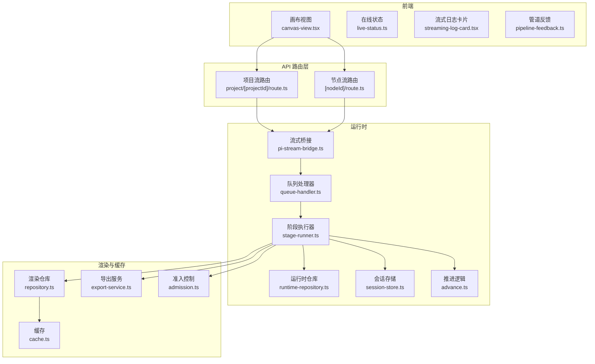
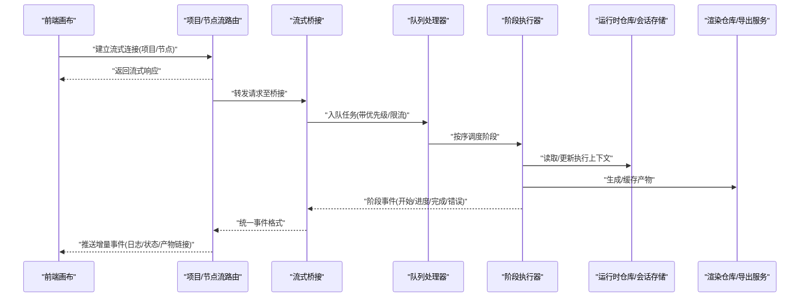
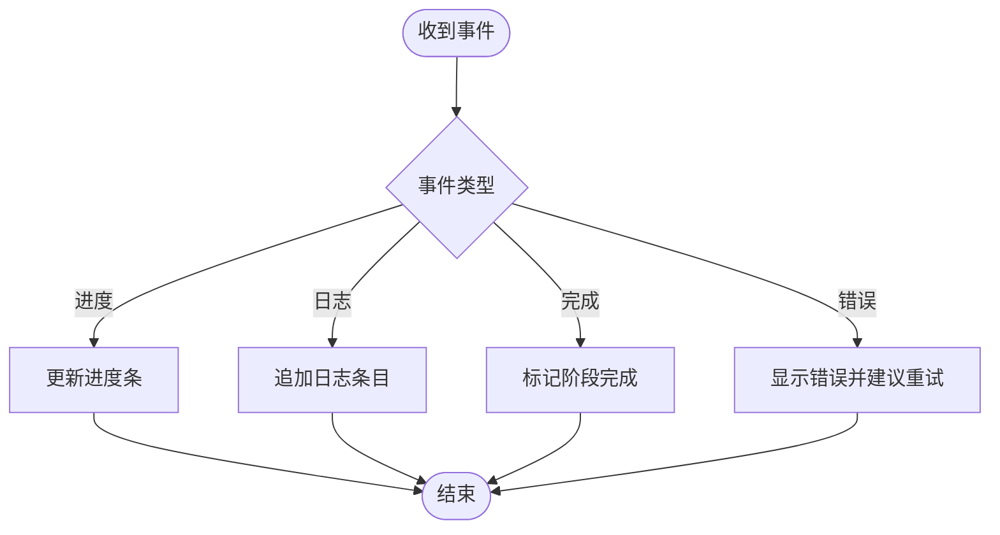
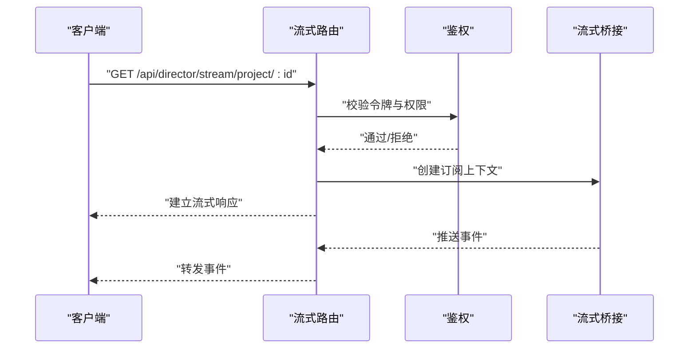
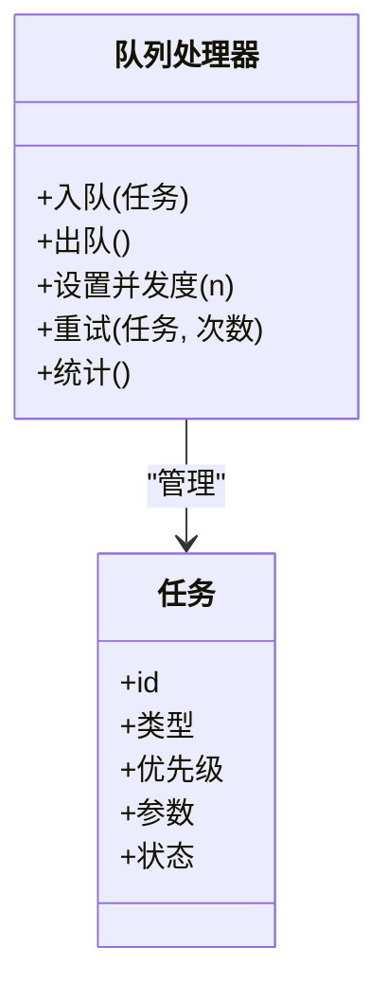
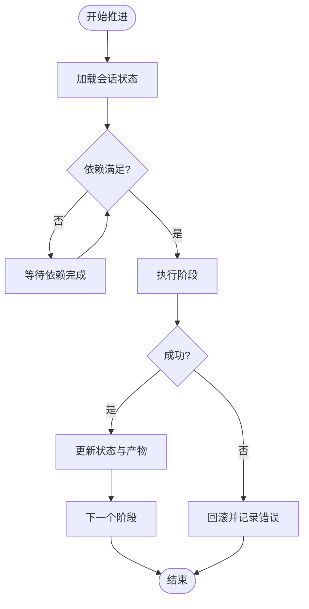
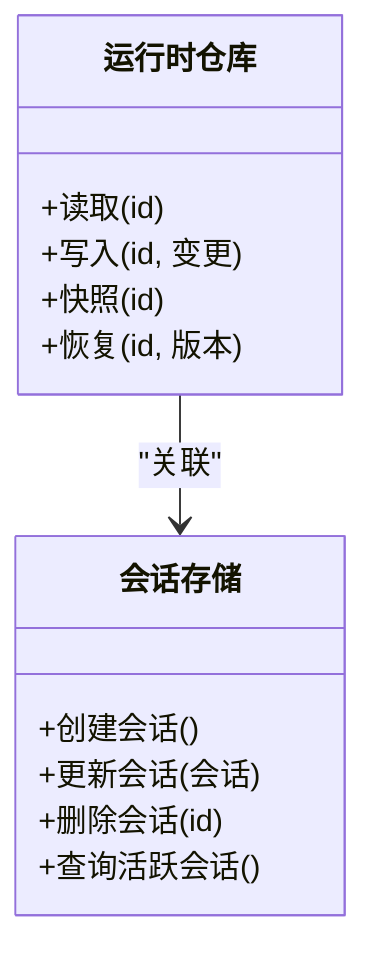
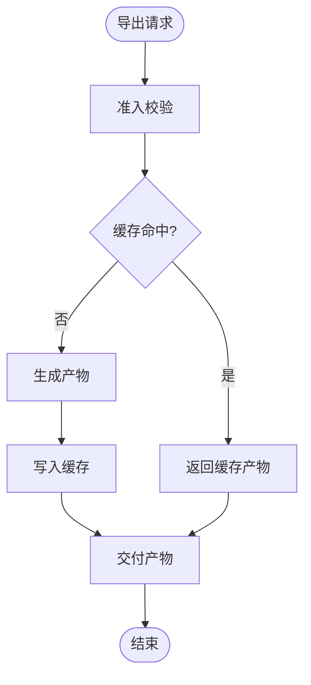
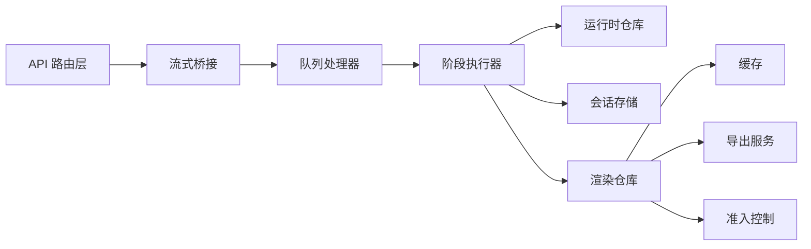

# 实时协作机制

<cite>
**本文档引用的文件**   
- [canvas-view.tsx](file://src/app/products/(app)/canvas/[projectId]/canvas-view.tsx)
- [live-status.ts](file://src/app/products/(app)/canvas/[projectId]/live-status.ts)
- [streaming-log-card.tsx](file://src/app/products/(app)/canvas/[projectId]/streaming-log-card.tsx)
- [pipeline-feedback.ts](file://src/app/products/(app)/canvas/[projectId]/pipeline-feedback.ts)
- [canvas-action-api.ts](file://src/app/products/(app)/canvas/[projectId]/canvas-action-api.ts)
- [route.ts](file://src/app/api/director/stream/project/[projectId]/route.ts)
- [route.ts](file://src/app/api/director/stream/[nodeId]/route.ts)
- [pi-stream-bridge.ts](file://src/features/director/pi-stream-bridge.ts)
- [queue-handler.ts](file://src/features/director/queue-handler.ts)
- [runtime-repository.ts](file://src/features/director/runtime-repository.ts)
- [session-store.ts](file://src/features/director/session-store.ts)
- [stage-runner.ts](file://src/features/director/stage-runner.ts)
- [advance.ts](file://src/features/director/advance.ts)
- [repository.ts](file://src/features/render/repository.ts)
- [export-service.ts](file://src/features/render/export-service.ts)
- [cache.ts](file://src/features/render/cache.ts)
- [admission.ts](file://src/features/render/admission.ts)
</cite>

## 目录
1. [简介](#简介)
2. [项目结构](#项目结构)
3. [核心组件](#核心组件)
4. [架构总览](#架构总览)
5. [详细组件分析](#详细组件分析)
6. [依赖关系分析](#依赖关系分析)
7. [性能考量](#性能考量)
8. [故障排查指南](#故障排查指南)
9. [结论](#结论)
10. [附录](#附录)

## 简介
本文件面向 PurpleInk 的“实时协作”能力，聚焦多用户编辑冲突解决、操作同步与状态一致性保证；描述 WebSocket 通信协议、消息格式与连接管理；说明增量更新、差异计算与合并策略；涵盖离线支持、断线重连与数据恢复；并给出权限控制、操作审计与安全考虑，以及集成与扩展指导。

## 项目结构
PurpleInk 的实时协作由前端画布视图、流式日志与反馈面板、API 路由层、导演运行时桥接、队列处理器、持久化仓库与会话存储等模块协同完成。关键路径包括：
- 前端通过 API 路由订阅项目或节点级别的流式输出，渲染为实时日志与反馈。
- 后端将导演运行时的阶段推进、产物生成与错误信息以事件形式推送给客户端。
- 队列处理器负责任务调度与并发控制，确保一致的执行顺序。
- 运行时仓库与会话存储维护执行上下文与中间结果，支撑断点续跑与恢复。

图表来源
- [canvas-view.tsx](file://src/app/products/(app)/canvas/[projectId]/canvas-view.tsx)
- [live-status.ts](file://src/app/products/(app)/canvas/[projectId]/live-status.ts)
- [streaming-log-card.tsx](file://src/app/products/(app)/canvas/[projectId]/streaming-log-card.tsx)
- [pipeline-feedback.ts](file://src/app/products/(app)/canvas/[projectId]/pipeline-feedback.ts)
- [route.ts](file://src/app/api/director/stream/project/[projectId]/route.ts)
- [route.ts](file://src/app/api/director/stream/[nodeId]/route.ts)
- [pi-stream-bridge.ts](file://src/features/director/pi-stream-bridge.ts)
- [queue-handler.ts](file://src/features/director/queue-handler.ts)
- [runtime-repository.ts](file://src/features/director/runtime-repository.ts)
- [session-store.ts](file://src/features/director/session-store.ts)
- [stage-runner.ts](file://src/features/director/stage-runner.ts)
- [advance.ts](file://src/features/director/advance.ts)
- [repository.ts](file://src/features/render/repository.ts)
- [export-service.ts](file://src/features/render/export-service.ts)
- [cache.ts](file://src/features/render/cache.ts)
- [admission.ts](file://src/features/render/admission.ts)

章节来源
- [canvas-view.tsx](file://src/app/products/(app)/canvas/[projectId]/canvas-view.tsx)
- [live-status.ts](file://src/app/products/(app)/canvas/[projectId]/live-status.ts)
- [streaming-log-card.tsx](file://src/app/products/(app)/canvas/[projectId]/streaming-log-card.tsx)
- [pipeline-feedback.ts](file://src/app/products/(app)/canvas/[projectId]/pipeline-feedback.ts)
- [route.ts](file://src/app/api/director/stream/project/[projectId]/route.ts)
- [route.ts](file://src/app/api/director/stream/[nodeId]/route.ts)
- [pi-stream-bridge.ts](file://src/features/director/pi-stream-bridge.ts)
- [queue-handler.ts](file://src/features/director/queue-handler.ts)
- [runtime-repository.ts](file://src/features/director/runtime-repository.ts)
- [session-store.ts](file://src/features/director/session-store.ts)
- [stage-runner.ts](file://src/features/director/stage-runner.ts)
- [advance.ts](file://src/features/director/advance.ts)
- [repository.ts](file://src/features/render/repository.ts)
- [export-service.ts](file://src/features/render/export-service.ts)
- [cache.ts](file://src/features/render/cache.ts)
- [admission.ts](file://src/features/render/admission.ts)

## 核心组件
- 画布视图与在线状态：负责展示项目画布与当前在线用户/节点状态，提供交互入口（如触发导演流程）。
- 流式日志与管道反馈：基于服务端推送的事件，渲染实时日志与进度反馈，提升用户体验与可观测性。
- API 路由层：暴露项目级与节点级的流式接口，作为客户端与服务端之间的桥梁。
- 流式桥接：将导演运行时的内部事件转换为统一的流式消息，供下游消费。
- 队列处理器：对任务进行排队、限流与重试，保障执行顺序与资源占用可控。
- 运行时仓库与会话存储：持久化执行上下文、阶段产物与会话状态，支撑断点续跑与恢复。
- 阶段执行器与推进逻辑：驱动各阶段按依赖顺序执行，处理输入输出与副作用。
- 渲染仓库、导出服务与缓存：负责最终产物生成、缓存命中与导出流程。
- 准入控制：在写入或导出前进行校验与配额检查，避免非法或超量操作。

章节来源
- [canvas-view.tsx](file://src/app/products/(app)/canvas/[projectId]/canvas-view.tsx)
- [live-status.ts](file://src/app/products/(app)/canvas/[projectId]/live-status.ts)
- [streaming-log-card.tsx](file://src/app/products/(app)/canvas/[projectId]/streaming-log-card.tsx)
- [pipeline-feedback.ts](file://src/app/products/(app)/canvas/[projectId]/pipeline-feedback.ts)
- [route.ts](file://src/app/api/director/stream/project/[projectId]/route.ts)
- [route.ts](file://src/app/api/director/stream/[nodeId]/route.ts)
- [pi-stream-bridge.ts](file://src/features/director/pi-stream-bridge.ts)
- [queue-handler.ts](file://src/features/director/queue-handler.ts)
- [runtime-repository.ts](file://src/features/director/runtime-repository.ts)
- [session-store.ts](file://src/features/director/session-store.ts)
- [stage-runner.ts](file://src/features/director/stage-runner.ts)
- [advance.ts](file://src/features/director/advance.ts)
- [repository.ts](file://src/features/render/repository.ts)
- [export-service.ts](file://src/features/render/export-service.ts)
- [cache.ts](file://src/features/render/cache.ts)
- [admission.ts](file://src/features/render/admission.ts)

## 架构总览
下图展示了从前端到后端的完整调用链与事件流转，强调流式推送与状态一致性。

图表来源
- [route.ts](file://src/app/api/director/stream/project/[projectId]/route.ts)
- [route.ts](file://src/app/api/director/stream/[nodeId]/route.ts)
- [pi-stream-bridge.ts](file://src/features/director/pi-stream-bridge.ts)
- [queue-handler.ts](file://src/features/director/queue-handler.ts)
- [stage-runner.ts](file://src/features/director/stage-runner.ts)
- [runtime-repository.ts](file://src/features/director/runtime-repository.ts)
- [session-store.ts](file://src/features/director/session-store.ts)
- [repository.ts](file://src/features/render/repository.ts)
- [export-service.ts](file://src/features/render/export-service.ts)

## 详细组件分析

### 流式日志与管道反馈
- 职责：消费服务端推送的事件，渲染为可读的日志与进度条，并提供错误提示与重试入口。
- 关键点：
  - 事件类型区分（阶段开始、进度、完成、错误）与幂等处理。
  - 增量更新：仅渲染新增事件，避免全量重绘。
  - 错误边界：捕获渲染异常并降级显示。
  - 与在线状态联动：根据连接状态切换 UI 行为（如禁用提交）。

图表来源
- [streaming-log-card.tsx](file://src/app/products/(app)/canvas/[projectId]/streaming-log-card.tsx)
- [pipeline-feedback.ts](file://src/app/products/(app)/canvas/[projectId]/pipeline-feedback.ts)

章节来源
- [streaming-log-card.tsx](file://src/app/products/(app)/canvas/[projectId]/streaming-log-card.tsx)
- [pipeline-feedback.ts](file://src/app/products/(app)/canvas/[projectId]/pipeline-feedback.ts)

### API 路由层与连接管理
- 职责：暴露项目级与节点级流式接口，鉴权与参数校验，建立并维护 SSE/WebSocket 连接。
- 关键点：
  - 连接生命周期：握手、心跳、超时断开、优雅关闭。
  - 权限校验：基于项目/节点访问控制，防止越权订阅。
  - 背压与限流：限制推送速率，避免客户端过载。
  - 错误码与重试策略：明确失败原因与客户端重试建议。

图表来源
- [route.ts](file://src/app/api/director/stream/project/[projectId]/route.ts)
- [route.ts](file://src/app/api/director/stream/[nodeId]/route.ts)
- [pi-stream-bridge.ts](file://src/features/director/pi-stream-bridge.ts)

章节来源
- [route.ts](file://src/app/api/director/stream/project/[projectId]/route.ts)
- [route.ts](file://src/app/api/director/stream/[nodeId]/route.ts)
- [pi-stream-bridge.ts](file://src/features/director/pi-stream-bridge.ts)

### 队列处理器与任务调度
- 职责：接收任务、分配执行槽位、控制并发度、处理重试与死信。
- 关键点：
  - 优先级队列：按任务类型与紧急程度排序。
  - 并发控制：限制同时执行的阶段数量，保护资源。
  - 幂等性：同一任务多次入队不会重复执行。
  - 监控指标：队列长度、平均等待时间、失败率。

图表来源
- [queue-handler.ts](file://src/features/director/queue-handler.ts)

章节来源
- [queue-handler.ts](file://src/features/director/queue-handler.ts)

### 阶段执行器与推进逻辑
- 职责：按依赖顺序执行各阶段，处理输入输出、副作用与错误恢复。
- 关键点：
  - 阶段图：定义阶段间的依赖关系与执行顺序。
  - 增量推进：仅重新执行受影响阶段，减少开销。
  - 回滚策略：在失败时回滚部分状态，保证一致性。
  - 审计日志：记录每个阶段的输入、输出与耗时。

图表来源
- [stage-runner.ts](file://src/features/director/stage-runner.ts)
- [advance.ts](file://src/features/director/advance.ts)

章节来源
- [stage-runner.ts](file://src/features/director/stage-runner.ts)
- [advance.ts](file://src/features/director/advance.ts)

### 运行时仓库与会话存储
- 职责：持久化执行上下文、阶段产物与会话状态，支撑断点续跑与恢复。
- 关键点：
  - 版本化：每次变更生成新版本，支持回溯。
  - 快照与增量：定期快照大对象，增量保存小变更。
  - 一致性：事务性写入，保证状态机一致性。
  - 清理策略：过期快照与中间产物自动清理。

图表来源
- [runtime-repository.ts](file://src/features/director/runtime-repository.ts)
- [session-store.ts](file://src/features/director/session-store.ts)

章节来源
- [runtime-repository.ts](file://src/features/director/runtime-repository.ts)
- [session-store.ts](file://src/features/director/session-store.ts)

### 渲染仓库、导出服务与缓存
- 职责：生成最终产物、缓存热点数据、处理导出任务。
- 关键点：
  - 缓存策略：LRU/TTL 结合，命中率优化。
  - 导出队列：异步处理大文件导出，避免阻塞。
  - 一致性：导出前校验产物完整性。
  - 准入控制：限制导出频率与大小。

图表来源
- [repository.ts](file://src/features/render/repository.ts)
- [export-service.ts](file://src/features/render/export-service.ts)
- [cache.ts](file://src/features/render/cache.ts)
- [admission.ts](file://src/features/render/admission.ts)

章节来源
- [repository.ts](file://src/features/render/repository.ts)
- [export-service.ts](file://src/features/render/export-service.ts)
- [cache.ts](file://src/features/render/cache.ts)
- [admission.ts](file://src/features/render/admission.ts)

## 依赖关系分析
- 松耦合设计：API 路由层与运行时通过桥接解耦，便于替换实现。
- 内聚性：队列处理器、阶段执行器与仓库各自职责清晰。
- 外部依赖：数据库、缓存、对象存储等通过抽象接口隔离。
- 循环依赖：通过事件总线与接口回调避免直接循环引用。

图表来源
- [route.ts](file://src/app/api/director/stream/project/[projectId]/route.ts)
- [route.ts](file://src/app/api/director/stream/[nodeId]/route.ts)
- [pi-stream-bridge.ts](file://src/features/director/pi-stream-bridge.ts)
- [queue-handler.ts](file://src/features/director/queue-handler.ts)
- [stage-runner.ts](file://src/features/director/stage-runner.ts)
- [runtime-repository.ts](file://src/features/director/runtime-repository.ts)
- [session-store.ts](file://src/features/director/session-store.ts)
- [repository.ts](file://src/features/render/repository.ts)
- [cache.ts](file://src/features/render/cache.ts)
- [export-service.ts](file://src/features/render/export-service.ts)
- [admission.ts](file://src/features/render/admission.ts)

章节来源
- [route.ts](file://src/app/api/director/stream/project/[projectId]/route.ts)
- [route.ts](file://src/app/api/director/stream/[nodeId]/route.ts)
- [pi-stream-bridge.ts](file://src/features/director/pi-stream-bridge.ts)
- [queue-handler.ts](file://src/features/director/queue-handler.ts)
- [stage-runner.ts](file://src/features/director/stage-runner.ts)
- [runtime-repository.ts](file://src/features/director/runtime-repository.ts)
- [session-store.ts](file://src/features/director/session-store.ts)
- [repository.ts](file://src/features/render/repository.ts)
- [cache.ts](file://src/features/render/cache.ts)
- [export-service.ts](file://src/features/render/export-service.ts)
- [admission.ts](file://src/features/render/admission.ts)

## 性能考量
- 流式推送：采用增量事件，避免全量传输；客户端按需渲染。
- 并发控制：限制阶段并行度，防止资源争用。
- 缓存命中：热点产物与配置缓存，降低重复计算。
- 背压处理：当客户端处理慢时，服务端暂停推送并通知。
- 内存管理：及时释放临时对象，避免内存泄漏。

## 故障排查指南
- 连接问题：检查网络、防火墙与代理设置；查看心跳与超时日志。
- 权限错误：确认令牌有效性与项目/节点访问权限。
- 任务卡住：检查队列长度与并发度；查看阶段依赖是否满足。
- 状态不一致：对比快照与增量日志；必要时回滚到稳定版本。
- 导出失败：检查存储空间与配额；查看准入控制规则。

章节来源
- [streaming-log-card.tsx](file://src/app/products/(app)/canvas/[projectId]/streaming-log-card.tsx)
- [pipeline-feedback.ts](file://src/app/products/(app)/canvas/[projectId]/pipeline-feedback.ts)
- [queue-handler.ts](file://src/features/director/queue-handler.ts)
- [stage-runner.ts](file://src/features/director/stage-runner.ts)
- [runtime-repository.ts](file://src/features/director/runtime-repository.ts)
- [session-store.ts](file://src/features/director/session-store.ts)
- [repository.ts](file://src/features/render/repository.ts)
- [export-service.ts](file://src/features/render/export-service.ts)
- [cache.ts](file://src/features/render/cache.ts)
- [admission.ts](file://src/features/render/admission.ts)

## 结论
PurpleInk 的实时协作机制通过流式推送、队列调度与状态持久化，实现了高效、可靠的多用户协作体验。未来可进一步增强冲突解决策略（如 OT/CRDT）、离线编辑与合并算法，以及更细粒度的权限控制与审计能力。

## 附录
- 集成指导：
  - 在前端引入流式日志与反馈组件，订阅项目/节点流。
  - 在后端扩展阶段执行器，注册新的处理逻辑。
  - 使用运行时仓库与会话存储管理状态，确保可恢复性。
- 扩展建议：
  - 引入差异计算库，实现增量同步。
  - 增加离线队列与本地缓存，提升鲁棒性。
  - 完善审计日志与合规报告，满足企业需求。