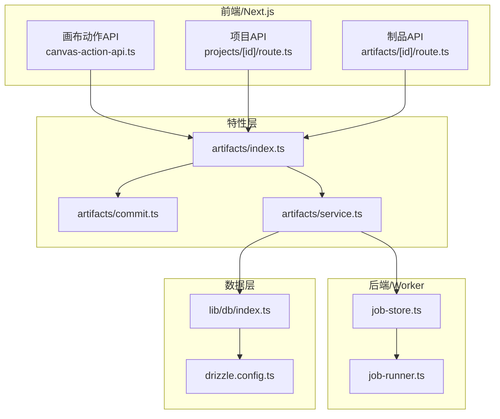
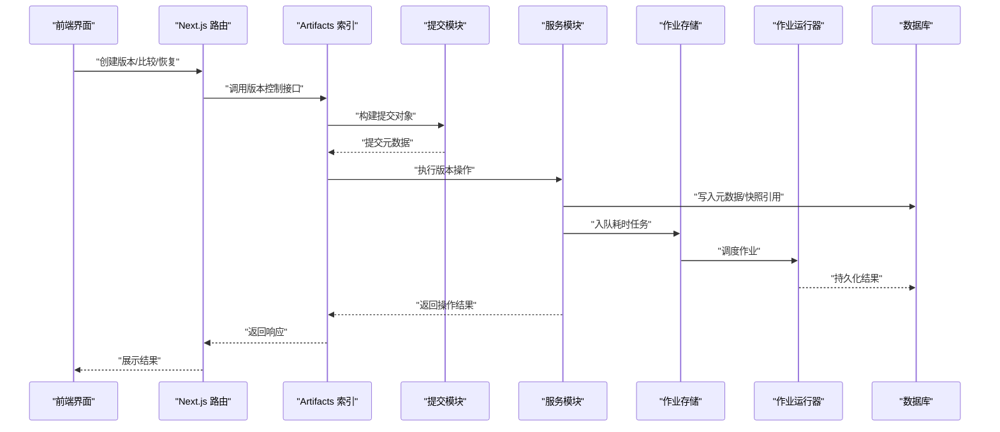
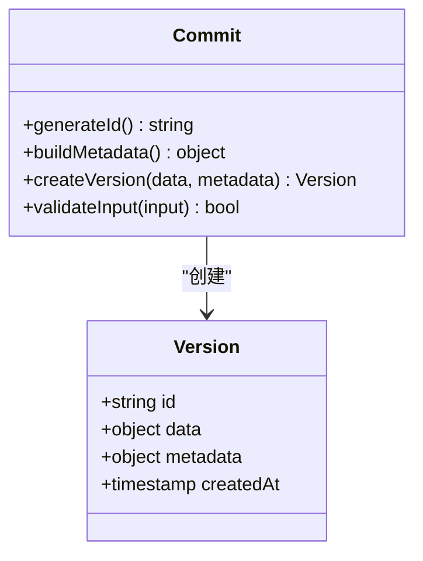
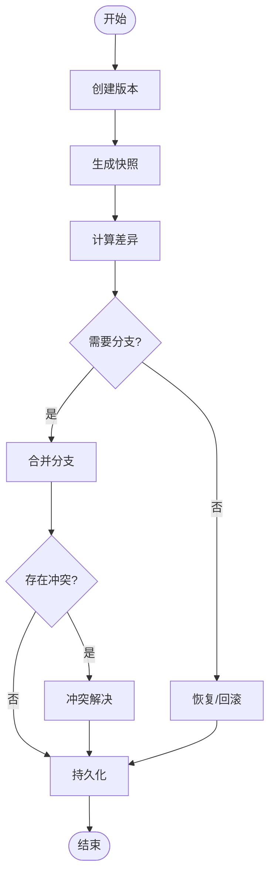
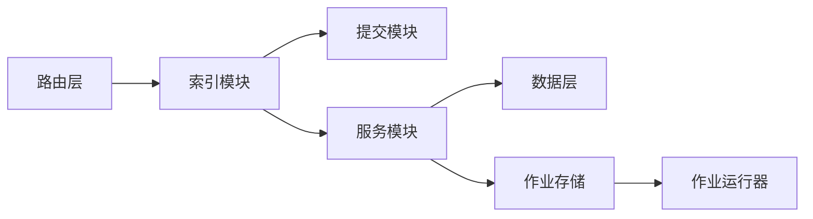

# 版本控制系统

<cite>
**本文引用的文件**   
- [src/features/artifacts/commit.ts](file://src/features/artifacts/commit.ts)
- [src/features/artifacts/service.ts](file://src/features/artifacts/service.ts)
- [src/features/artifacts/index.ts](file://src/features/artifacts/index.ts)
- [src/app/products/(app)/canvas/[projectId]/canvas-action-api.ts](file://src/app/products/(app)/canvas/[projectId]/canvas-action-api.ts)
- [src/app/api/projects/[id]/route.ts](file://src/app/api/projects/[id]/route.ts)
- [src/app/api/artifacts/[id]/route.ts](file://src/app/api/artifacts/[id]/route.ts)
- [src/lib/db/index.ts](file://src/lib/db/index.ts)
- [drizzle.config.ts](file://drizzle.config.ts)
- [server/src/server/job-store.ts](file://server/src/server/job-store.ts)
- [server/src/server/job-runner.ts](file://server/src/server/job-runner.ts)
</cite>

## 目录
1. [简介](#简介)
2. [项目结构](#项目结构)
3. [核心组件](#核心组件)
4. [架构总览](#架构总览)
5. [详细组件分析](#详细组件分析)
6. [依赖关系分析](#依赖关系分析)
7. [性能考量](#性能考量)
8. [故障排查指南](#故障排查指南)
9. [结论](#结论)
10. [附录](#附录)

## 简介
本文件为 PurpleInk 的版本控制系统提供系统化文档，聚焦画布版本的创建、存储、比较与恢复机制。内容涵盖：
- 版本差异算法与快照管理
- 增量更新策略
- 版本分支、合并与冲突解决
- 版本历史浏览、对比工具与回滚功能
- 版本标签、注释与元数据管理
- 版本控制 API 使用指导与最佳实践

该文档面向不同技术背景的读者，既提供高层概览，也深入到代码级实现细节，并辅以可视化图示帮助理解。

## 项目结构
PurpleInk 的版本控制能力主要分布在以下模块：
- artifacts 特性层：封装版本提交、服务编排与类型契约
- 应用路由层：暴露 REST API 用于项目的版本操作与制品访问
- 数据库与持久化：通过 Drizzle ORM 进行结构化存储
- 服务端作业系统：异步执行耗时任务（如生成快照、计算差异）

**图表来源** 
- [src/app/products/(app)/canvas/[projectId]/canvas-action-api.ts](file://src/app/products/(app)/canvas/[projectId]/canvas-action-api.ts)
- [src/app/api/projects/[id]/route.ts](file://src/app/api/projects/[id]/route.ts)
- [src/app/api/artifacts/[id]/route.ts](file://src/app/api/artifacts/[id]/route.ts)
- [src/features/artifacts/index.ts](file://src/features/artifacts/index.ts)
- [src/features/artifacts/commit.ts](file://src/features/artifacts/commit.ts)
- [src/features/artifacts/service.ts](file://src/features/artifacts/service.ts)
- [server/src/server/job-store.ts](file://server/src/server/job-store.ts)
- [server/src/server/job-runner.ts](file://server/src/server/job-runner.ts)
- [src/lib/db/index.ts](file://src/lib/db/index.ts)
- [drizzle.config.ts](file://drizzle.config.ts)

**章节来源**
- [src/features/artifacts/index.ts](file://src/features/artifacts/index.ts)
- [src/features/artifacts/commit.ts](file://src/features/artifacts/commit.ts)
- [src/features/artifacts/service.ts](file://src/features/artifacts/service.ts)
- [src/app/products/(app)/canvas/[projectId]/canvas-action-api.ts](file://src/app/products/(app)/canvas/[projectId]/canvas-action-api.ts)
- [src/app/api/projects/[id]/route.ts](file://src/app/api/projects/[id]/route.ts)
- [src/app/api/artifacts/[id]/route.ts](file://src/app/api/artifacts/[id]/route.ts)
- [server/src/server/job-store.ts](file://server/src/server/job-store.ts)
- [server/src/server/job-runner.ts](file://server/src/server/job-runner.ts)
- [src/lib/db/index.ts](file://src/lib/db/index.ts)
- [drizzle.config.ts](file://drizzle.config.ts)

## 核心组件
- 提交（Commit）模块：负责构建版本对象、生成唯一标识、记录元数据（时间戳、作者、备注等），并触发持久化流程。
- 服务（Service）模块：协调版本生命周期，包括创建快照、计算差异、分支与合并、冲突检测与解决、回滚与恢复。
- 索引（Index）模块：对外暴露统一接口，聚合提交与服务能力，供上层路由调用。
- 作业系统（Job Store/Runner）：将耗时操作（如大对象快照、差异计算）异步化，提升响应性与吞吐。
- 数据层（DB/Drizzle）：结构化存储版本元数据、快照引用与变更集；支持事务与一致性保障。

**章节来源**
- [src/features/artifacts/commit.ts](file://src/features/artifacts/commit.ts)
- [src/features/artifacts/service.ts](file://src/features/artifacts/service.ts)
- [src/features/artifacts/index.ts](file://src/features/artifacts/index.ts)
- [server/src/server/job-store.ts](file://server/src/server/job-store.ts)
- [server/src/server/job-runner.ts](file://server/src/server/job-runner.ts)
- [src/lib/db/index.ts](file://src/lib/db/index.ts)
- [drizzle.config.ts](file://drizzle.config.ts)

## 架构总览
版本控制的端到端流程如下：
- 前端发起版本操作（创建、比较、恢复）
- Next.js 路由接收请求，调用 artifacts 索引模块
- 索引模块根据操作类型选择提交或服务逻辑
- 服务模块协调数据层与作业系统完成持久化与异步处理
- 结果返回给前端，展示版本历史或差异信息

**图表来源** 
- [src/app/api/projects/[id]/route.ts](file://src/app/api/projects/[id]/route.ts)
- [src/app/api/artifacts/[id]/route.ts](file://src/app/api/artifacts/[id]/route.ts)
- [src/features/artifacts/index.ts](file://src/features/artifacts/index.ts)
- [src/features/artifacts/commit.ts](file://src/features/artifacts/commit.ts)
- [src/features/artifacts/service.ts](file://src/features/artifacts/service.ts)
- [server/src/server/job-store.ts](file://server/src/server/job-store.ts)
- [server/src/server/job-runner.ts](file://server/src/server/job-runner.ts)
- [src/lib/db/index.ts](file://src/lib/db/index.ts)

## 详细组件分析

### 提交模块（Commit）
职责：
- 生成版本唯一标识（基于内容哈希或时间戳+序列号）
- 收集元数据（作者、时间、备注、标签）
- 构建不可变版本对象，确保后续可追溯

关键设计点：
- 幂等性：相同输入产生相同版本标识，避免重复提交
- 可扩展性：元数据结构预留扩展字段，便于未来增强
- 校验：提交前对输入进行完整性与合法性检查

**图表来源** 
- [src/features/artifacts/commit.ts](file://src/features/artifacts/commit.ts)

**章节来源**
- [src/features/artifacts/commit.ts](file://src/features/artifacts/commit.ts)

### 服务模块（Service）
职责：
- 版本创建：整合提交与快照生成
- 差异计算：对比两个版本的差异，输出变更集
- 分支与合并：支持多分支并行开发，合并时检测冲突并提供解决策略
- 恢复与回滚：从指定版本恢复状态，支持部分恢复
- 标签与注释：为版本添加语义化标签与说明

关键设计点：
- 增量更新：仅存储变更部分，减少存储开销
- 快照管理：定期生成完整快照，作为差异的基准
- 冲突解决：自动检测冲突，提供手动干预入口

**图表来源** 
- [src/features/artifacts/service.ts](file://src/features/artifacts/service.ts)

**章节来源**
- [src/features/artifacts/service.ts](file://src/features/artifacts/service.ts)

### 索引模块（Index）
职责：
- 统一对外接口，屏蔽内部复杂度
- 路由分发到提交或服务模块
- 错误处理与日志记录

关键设计点：
- 接口稳定性：保持向后兼容的 API 契约
- 错误分类：区分业务错误与系统错误，便于前端提示
- 性能监控：记录关键路径耗时，辅助优化

**章节来源**
- [src/features/artifacts/index.ts](file://src/features/artifacts/index.ts)

### 作业系统（Job Store/Runner）
职责：
- 任务队列管理：入队、出队、重试、失败处理
- 并发控制：限制并行度，防止资源耗尽
- 状态追踪：记录作业执行状态与结果

关键设计点：
- 可靠性：保证至少一次执行，支持幂等处理
- 可观测性：提供作业状态查询与日志输出
- 弹性伸缩：根据负载动态调整工作进程数

**章节来源**
- [server/src/server/job-store.ts](file://server/src/server/job-store.ts)
- [server/src/server/job-runner.ts](file://server/src/server/job-runner.ts)

### 数据层（DB/Drizzle）
职责：
- 版本元数据存储：ID、时间戳、作者、备注、标签
- 快照存储：二进制或结构化数据引用
- 变更集存储：增量更新的差异描述
- 事务支持：确保数据一致性

关键设计点：
- 模式设计：采用规范化表结构，支持高效查询
- 索引优化：针对常用查询字段建立索引
- 迁移管理：通过 Drizzle 进行数据库版本控制

**章节来源**
- [src/lib/db/index.ts](file://src/lib/db/index.ts)
- [drizzle.config.ts](file://drizzle.config.ts)

## 依赖关系分析
版本控制模块之间的依赖关系如下：
- 路由层依赖索引模块
- 索引模块依赖提交与服务模块
- 服务模块依赖数据层与作业系统
- 作业系统独立于业务逻辑，提供通用任务处理能力

**图表来源** 
- [src/app/api/projects/[id]/route.ts](file://src/app/api/projects/[id]/route.ts)
- [src/app/api/artifacts/[id]/route.ts](file://src/app/api/artifacts/[id]/route.ts)
- [src/features/artifacts/index.ts](file://src/features/artifacts/index.ts)
- [src/features/artifacts/commit.ts](file://src/features/artifacts/commit.ts)
- [src/features/artifacts/service.ts](file://src/features/artifacts/service.ts)
- [server/src/server/job-store.ts](file://server/src/server/job-store.ts)
- [server/src/server/job-runner.ts](file://server/src/server/job-runner.ts)
- [src/lib/db/index.ts](file://src/lib/db/index.ts)

**章节来源**
- [src/app/api/projects/[id]/route.ts](file://src/app/api/projects/[id]/route.ts)
- [src/app/api/artifacts/[id]/route.ts](file://src/app/api/artifacts/[id]/route.ts)
- [src/features/artifacts/index.ts](file://src/features/artifacts/index.ts)
- [src/features/artifacts/commit.ts](file://src/features/artifacts/commit.ts)
- [src/features/artifacts/service.ts](file://src/features/artifacts/service.ts)
- [server/src/server/job-store.ts](file://server/src/server/job-store.ts)
- [server/src/server/job-runner.ts](file://server/src/server/job-runner.ts)
- [src/lib/db/index.ts](file://src/lib/db/index.ts)

## 性能考量
- 差异计算优化：采用增量算法，仅计算变更部分，避免全量比对
- 快照策略：定期生成完整快照，平衡存储空间与恢复速度
- 并发控制：限制作业并行度，防止数据库连接池耗尽
- 缓存机制：对频繁访问的版本元数据进行缓存，减少数据库压力
- 分页加载：版本历史列表采用分页加载，提升前端渲染性能

[本节为通用性能建议，不直接分析具体文件]

## 故障排查指南
常见问题与解决方案：
- 版本创建失败：检查输入数据格式与完整性，查看提交模块的校验逻辑
- 差异计算超时：确认作业队列是否阻塞，检查作业运行器状态
- 合并冲突：查看冲突检测结果，提供手动解决接口
- 恢复失败：验证目标版本是否存在，检查数据一致性
- 存储不足：监控快照大小，清理过期版本或压缩存储

**章节来源**
- [src/features/artifacts/commit.ts](file://src/features/artifacts/commit.ts)
- [server/src/server/job-store.ts](file://server/src/server/job-store.ts)
- [server/src/server/job-runner.ts](file://server/src/server/job-runner.ts)

## 结论
PurpleInk 的版本控制系统通过清晰的模块划分与可靠的作业系统，实现了高效的版本管理。其设计兼顾了性能与可扩展性，支持复杂的版本操作需求。建议在生产环境中加强监控与告警，确保系统稳定运行。

[本节为总结性内容，不直接分析具体文件]

## 附录
- API 使用示例：参考路由文件中的接口定义
- 配置项说明：查看 drizzle.config.ts 中的数据库配置
- 最佳实践：遵循幂等性设计，合理使用标签与注释

[本节为补充信息，不直接分析具体文件]