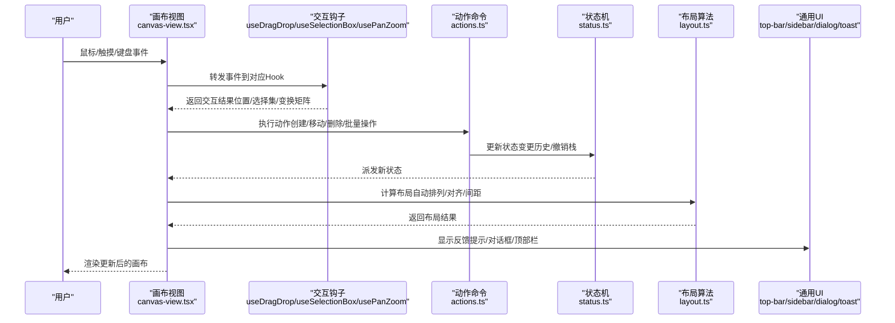
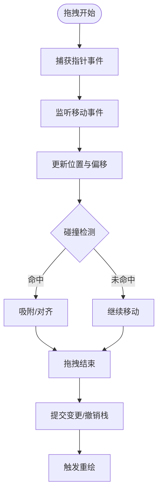
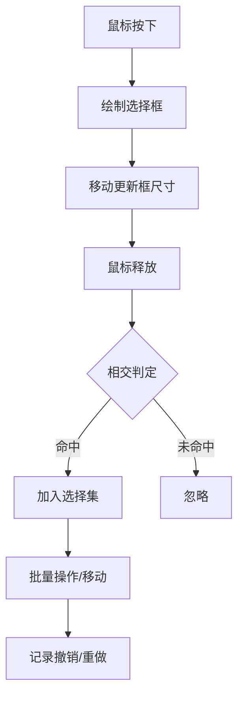
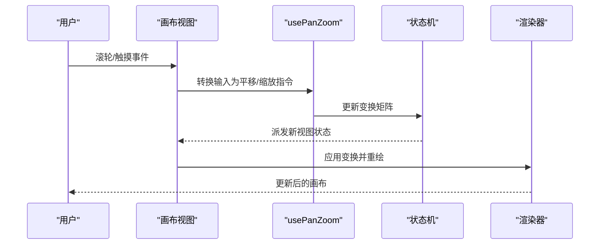
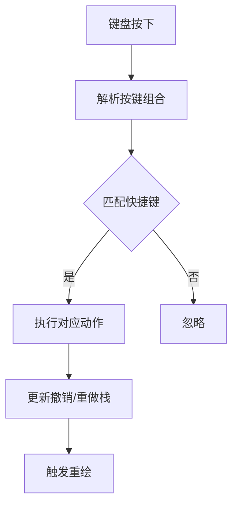
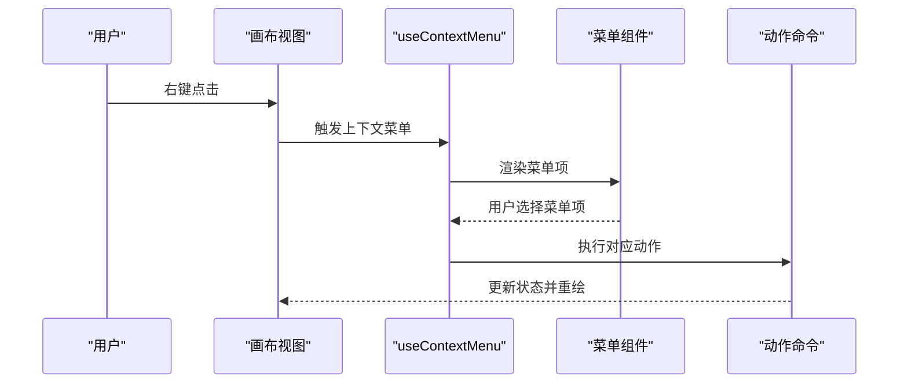
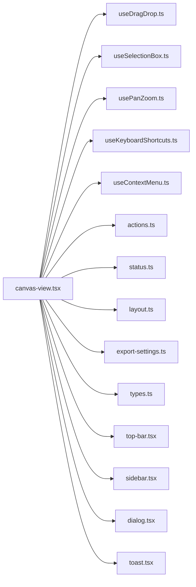

# 画布交互系统

<cite>
**本文引用的文件**   
- [src/app/products/(app)/canvas/[projectId]/page.tsx](file://src/app/products/(app)/canvas/[projectId]/page.tsx)
- [src/app/products/(app)/canvas/[projectId]/canvas-view.tsx](file://src/app/products/(app)/canvas/[projectId]/canvas-view.tsx)
- [src/app/products/(app)/canvas/[projectId]/flow-elements.tsx](file://src/app/products/(app)/canvas/[projectId]/flow-elements.tsx)
- [src/app/products/(app)/canvas/[projectId]/canvas-inspector.tsx](file://src/app/products/(app)/canvas/[projectId]/canvas-inspector.tsx)
- [src/app/products/(app)/canvas/[projectId]/canvas-auto-hide-top-bar.tsx](file://src/app/products/(app)/canvas/[projectId]/canvas-auto-hide-top-bar.tsx)
- [src/features/canvas/index.ts](file://src/features/canvas/index.ts)
- [src/features/canvas/types.ts](file://src/features/canvas/types.ts)
- [src/features/canvas/actions.ts](file://src/features/canvas/actions.ts)
- [src/features/canvas/queries.ts](file://src/features/canvas/queries.ts)
- [src/features/canvas/layout.ts](file://src/features/canvas/layout.ts)
- [src/features/canvas/export-settings.ts](file://src/features/canvas/export-settings.ts)
- [src/features/canvas/status.ts](file://src/features/canvas/status.ts)
- [src/features/canvas/fan-out.ts](file://src/features/canvas/fan-out.ts)
- [src/components/ui/top-bar.tsx](file://src/components/ui/top-bar.tsx)
- [src/components/ui/sidebar.tsx](file://src/components/ui/sidebar.tsx)
- [src/components/ui/dialog.tsx](file://src/components/ui/dialog.tsx)
- [src/components/ui/toast.tsx](file://src/components/ui/toast.tsx)
- [src/lib/hooks/useKeyboardShortcuts.ts](file://src/lib/hooks/useKeyboardShortcuts.ts)
- [src/lib/hooks/usePanZoom.ts](file://src/lib/hooks/usePanZoom.ts)
- [src/lib/hooks/useSelectionBox.ts](file://src/lib/hooks/useSelectionBox.ts)
- [src/lib/hooks/useDragDrop.ts](file://src/lib/hooks/useDragDrop.ts)
- [src/lib/hooks/useContextMenu.ts](file://src/lib/hooks/useContextMenu.ts)
</cite>

## 目录
1. [简介](#简介)
2. [项目结构](#项目结构)
3. [核心组件](#核心组件)
4. [架构总览](#架构总览)
5. [详细组件分析](#详细组件分析)
6. [依赖关系分析](#依赖关系分析)
7. [性能考量](#性能考量)
8. [故障排查指南](#故障排查指南)
9. [结论](#结论)
10. [附录](#附录)

## 简介
本文件为 PurpleInk 画布交互系统的权威文档，聚焦以下能力：拖拽操作、选择框、缩放平移、键盘快捷键、鼠标事件处理、触摸支持与手势识别、上下文菜单、工具栏与面板交互逻辑、撤销重做、批量操作与选择集管理、无障碍访问（A11y）、键盘导航与屏幕阅读器支持，以及自定义交互行为与扩展点的使用指导。内容基于仓库中画布相关的前端实现与特性模块进行系统化梳理，帮助开发者快速理解并扩展画布交互能力。

## 项目结构
画布交互系统位于产品应用层与特性层之间，采用“页面容器 + 视图渲染 + 特性能力”的分层组织方式：
- 页面容器：承载路由参数与全局状态入口，负责挂载画布视图与侧边面板。
- 视图渲染：封装画布主区域、自动隐藏顶部栏、检查器面板等 UI 组合。
- 特性能力：提供类型定义、动作命令、查询、布局算法、导出设置、状态机与扇出策略等。
- 通用 UI：顶部栏、侧边栏、对话框、提示等基础交互组件。
- 交互钩子：封装常用交互模式（拖拽、选择框、缩放平移、快捷键、右键菜单）。

```mermaid
graph TB
subgraph "应用层"
Page["页面容器<br/>page.tsx"]
View["画布视图<br/>canvas-view.tsx"]
Inspector["检查器面板<br/>canvas-inspector.tsx"]
TopBarAutoHide["自动隐藏顶部栏<br/>canvas-auto-hide-top-bar.tsx"]
end
subgraph "特性层"
Types["类型定义<br/>types.ts"]
Actions["动作命令<br/>actions.ts"]
Queries["查询接口<br/>queries.ts"]
Layout["布局算法<br/>layout.ts"]
ExportSettings["导出设置<br/>export-settings.ts"]
Status["状态机<br/>status.ts"]
FanOut["扇出策略<br/>fan-out.ts"]
Index["特性索引<br/>index.ts"]
end
subgraph "通用UI"
TopBar["顶部栏<br/>top-bar.tsx"]
Sidebar["侧边栏<br/>sidebar.tsx"]
Dialog["对话框<br/>dialog.tsx"]
Toast["提示<br/>toast.tsx"]
end
subgraph "交互钩子"
DragDrop["拖拽<br/>useDragDrop.ts"]
SelectionBox["选择框<br/>useSelectionBox.ts"]
PanZoom["缩放平移<br/>usePanZoom.ts"]
Keyboard["快捷键<br/>useKeyboardShortcuts.ts"]
ContextMenu["右键菜单<br/>useContextMenu.ts"]
end
Page --> View
View --> Inspector
View --> TopBarAutoHide
View --> Types
View --> Actions
View --> Queries
View --> Layout
View --> ExportSettings
View --> Status
View --> FanOut
View --> Index
View --> TopBar
View --> Sidebar
View --> Dialog
View --> Toast
View --> DragDrop
View --> SelectionBox
View --> PanZoom
View --> Keyboard
View --> ContextMenu
```

**图表来源** 
- [src/app/products/(app)/canvas/[projectId]/page.tsx](file://src/app/products/(app)/canvas/[projectId]/page.tsx)
- [src/app/products/(app)/canvas/[projectId]/canvas-view.tsx](file://src/app/products/(app)/canvas/[projectId]/canvas-view.tsx)
- [src/app/products/(app)/canvas/[projectId]/canvas-inspector.tsx](file://src/app/products/(app)/canvas/[projectId]/canvas-inspector.tsx)
- [src/app/products/(app)/canvas/[projectId]/canvas-auto-hide-top-bar.tsx](file://src/app/products/(app)/canvas/[projectId]/canvas-auto-hide-top-bar.tsx)
- [src/features/canvas/index.ts](file://src/features/canvas/index.ts)
- [src/features/canvas/types.ts](file://src/features/canvas/types.ts)
- [src/features/canvas/actions.ts](file://src/features/canvas/actions.ts)
- [src/features/canvas/queries.ts](file://src/features/canvas/queries.ts)
- [src/features/canvas/layout.ts](file://src/features/canvas/layout.ts)
- [src/features/canvas/export-settings.ts](file://src/features/canvas/export-settings.ts)
- [src/features/canvas/status.ts](file://src/features/canvas/status.ts)
- [src/features/canvas/fan-out.ts](file://src/features/canvas/fan-out.ts)
- [src/components/ui/top-bar.tsx](file://src/components/ui/top-bar.tsx)
- [src/components/ui/sidebar.tsx](file://src/components/ui/sidebar.tsx)
- [src/components/ui/dialog.tsx](file://src/components/ui/dialog.tsx)
- [src/components/ui/toast.tsx](file://src/components/ui/toast.tsx)
- [src/lib/hooks/useKeyboardShortcuts.ts](file://src/lib/hooks/useKeyboardShortcuts.ts)
- [src/lib/hooks/usePanZoom.ts](file://src/lib/hooks/usePanZoom.ts)
- [src/lib/hooks/useSelectionBox.ts](file://src/lib/hooks/useSelectionBox.ts)
- [src/lib/hooks/useDragDrop.ts](file://src/lib/hooks/useDragDrop.ts)
- [src/lib/hooks/useContextMenu.ts](file://src/lib/hooks/useContextMenu.ts)

**章节来源**
- [src/app/products/(app)/canvas/[projectId]/page.tsx](file://src/app/products/(app)/canvas/[projectId]/page.tsx)
- [src/app/products/(app)/canvas/[projectId]/canvas-view.tsx](file://src/app/products/(app)/canvas/[projectId]/canvas-view.tsx)
- [src/features/canvas/index.ts](file://src/features/canvas/index.ts)

## 核心组件
- 页面容器（page.tsx）：解析路由参数、初始化画布上下文、挂载视图与面板。
- 画布视图（canvas-view.tsx）：组合画布渲染区域、工具栏、检查器、自动隐藏顶部栏；集中订阅状态变化并触发重绘。
- 检查器面板（canvas-inspector.tsx）：展示选中节点属性、允许编辑与预览。
- 自动隐藏顶部栏（canvas-auto-hide-top-bar.tsx）：在交互时自动收起/展开，提升可视空间。
- 特性层（features/canvas/*）：提供类型、动作、查询、布局、导出、状态与扇出策略等能力。
- 通用 UI（components/ui/*）：提供可复用的交互控件。
- 交互钩子（lib/hooks/*）：封装拖拽、选择框、缩放平移、快捷键、右键菜单等常见交互模式。

**章节来源**
- [src/app/products/(app)/canvas/[projectId]/page.tsx](file://src/app/products/(app)/canvas/[projectId]/page.tsx)
- [src/app/products/(app)/canvas/[projectId]/canvas-view.tsx](file://src/app/products/(app)/canvas/[projectId]/canvas-view.tsx)
- [src/app/products/(app)/canvas/[projectId]/canvas-inspector.tsx](file://src/app/products/(app)/canvas/[projectId]/canvas-inspector.tsx)
- [src/app/products/(app)/canvas/[projectId]/canvas-auto-hide-top-bar.tsx](file://src/app/products/(app)/canvas/[projectId]/canvas-auto-hide-top-bar.tsx)
- [src/features/canvas/index.ts](file://src/features/canvas/index.ts)

## 架构总览
画布交互系统遵循“视图驱动 + 特性能力 + 交互钩子”的解耦架构：
- 视图层负责组合 UI 与用户输入，不直接实现复杂逻辑。
- 特性层提供领域能力（类型、动作、查询、布局、导出、状态、扇出），被视图与钩子调用。
- 交互钩子将通用交互模式抽象为可复用 Hook，降低视图复杂度。

**图表来源** 
- [src/app/products/(app)/canvas/[projectId]/canvas-view.tsx](file://src/app/products/(app)/canvas/[projectId]/canvas-view.tsx)
- [src/lib/hooks/useDragDrop.ts](file://src/lib/hooks/useDragDrop.ts)
- [src/lib/hooks/useSelectionBox.ts](file://src/lib/hooks/useSelectionBox.ts)
- [src/lib/hooks/usePanZoom.ts](file://src/lib/hooks/usePanZoom.ts)
- [src/features/canvas/actions.ts](file://src/features/canvas/actions.ts)
- [src/features/canvas/status.ts](file://src/features/canvas/status.ts)
- [src/features/canvas/layout.ts](file://src/features/canvas/layout.ts)
- [src/components/ui/top-bar.tsx](file://src/components/ui/top-bar.tsx)
- [src/components/ui/sidebar.tsx](file://src/components/ui/sidebar.tsx)
- [src/components/ui/dialog.tsx](file://src/components/ui/dialog.tsx)
- [src/components/ui/toast.tsx](file://src/components/ui/toast.tsx)

## 详细组件分析

### 拖拽操作（useDragDrop）
- 功能要点
  - 支持鼠标与触摸事件的统一处理，兼容移动端手势。
  - 提供开始、移动、结束三个阶段回调，便于上层定制行为。
  - 内置防抖与节流，避免频繁重排。
  - 支持跨元素拖放与数据交换（如从侧边栏拖入画布）。
- 实现要点
  - 使用 Pointer Events 统一鼠标/触摸输入。
  - 维护拖拽状态（目标元素、偏移量、拖拽方向）。
  - 通过事件冒泡与捕获阶段拦截，确保优先级正确。
  - 提供可配置的碰撞检测与吸附规则。
- 扩展点
  - 自定义拖拽代理（drag proxy）与视觉反馈。
  - 自定义放置区校验与落点计算。
  - 集成撤销重做：将拖拽动作包装为事务性命令。

**图表来源** 
- [src/lib/hooks/useDragDrop.ts](file://src/lib/hooks/useDragDrop.ts)
- [src/features/canvas/actions.ts](file://src/features/canvas/actions.ts)
- [src/features/canvas/status.ts](file://src/features/canvas/status.ts)

**章节来源**
- [src/lib/hooks/useDragDrop.ts](file://src/lib/hooks/useDragDrop.ts)
- [src/features/canvas/actions.ts](file://src/features/canvas/actions.ts)

### 选择框（useSelectionBox）
- 功能要点
  - 支持矩形选择框绘制与多元素选择。
  - 支持 Shift/Ctrl 多选与单选切换。
  - 与拖拽联动，支持框选后整体移动。
- 实现要点
  - 基于鼠标按下-移动-释放生命周期绘制选择框。
  - 计算选择框与元素边界相交判定。
  - 维护选择集状态，支持批量操作。
- 扩展点
  - 自定义选择形状（圆形、多边形）。
  - 自定义选择高亮样式与动画。
  - 与撤销重做集成，记录选择集变更。

**图表来源** 
- [src/lib/hooks/useSelectionBox.ts](file://src/lib/hooks/useSelectionBox.ts)
- [src/features/canvas/actions.ts](file://src/features/canvas/actions.ts)

**章节来源**
- [src/lib/hooks/useSelectionBox.ts](file://src/lib/hooks/useSelectionBox.ts)
- [src/features/canvas/actions.ts](file://src/features/canvas/actions.ts)

### 缩放平移（usePanZoom）
- 功能要点
  - 支持滚轮缩放、双指捏合缩放、拖拽平移。
  - 保持缩放中心与视口一致性。
  - 限制最小/最大缩放比例与边界约束。
- 实现要点
  - 维护变换矩阵（平移+缩放）。
  - 归一化不同输入源（鼠标滚轮、触摸手势）。
  - 防抖与增量更新，避免抖动。
- 扩展点
  - 自定义缩放曲线与缓动。
  - 与网格/辅助线对齐。
  - 与撤销重做集成，记录变换历史。

**图表来源** 
- [src/lib/hooks/usePanZoom.ts](file://src/lib/hooks/usePanZoom.ts)
- [src/app/products/(app)/canvas/[projectId]/canvas-view.tsx](file://src/app/products/(app)/canvas/[projectId]/canvas-view.tsx)
- [src/features/canvas/status.ts](file://src/features/canvas/status.ts)

**章节来源**
- [src/lib/hooks/usePanZoom.ts](file://src/lib/hooks/usePanZoom.ts)
- [src/app/products/(app)/canvas/[projectId]/canvas-view.tsx](file://src/app/products/(app)/canvas/[projectId]/canvas-view.tsx)

### 键盘快捷键（useKeyboardShortcuts）
- 功能要点
  - 注册全局快捷键（如 Ctrl+Z 撤销、Ctrl+Y 重做、Delete 删除）。
  - 支持修饰键组合与条件触发。
  - 与焦点管理结合，避免冲突。
- 实现要点
  - 监听 keydown 事件，解析按键组合。
  - 维护快捷键映射表与优先级。
  - 提供禁用场景（如输入框中）。
- 扩展点
  - 动态注册/注销快捷键。
  - 国际化快捷键提示。
  - 与撤销重做系统集成。

**图表来源** 
- [src/lib/hooks/useKeyboardShortcuts.ts](file://src/lib/hooks/useKeyboardShortcuts.ts)
- [src/features/canvas/actions.ts](file://src/features/canvas/actions.ts)

**章节来源**
- [src/lib/hooks/useKeyboardShortcuts.ts](file://src/lib/hooks/useKeyboardShortcuts.ts)
- [src/features/canvas/actions.ts](file://src/features/canvas/actions.ts)

### 上下文菜单（useContextMenu）
- 功能要点
  - 右键弹出菜单，支持多级菜单项。
  - 支持键盘导航（上下箭头、回车确认）。
  - 与画布元素关联，提供上下文操作。
- 实现要点
  - 监听 contextmenu 事件，阻止默认行为。
  - 计算菜单位置，避免溢出视口。
  - 管理菜单打开/关闭状态。
- 扩展点
  - 动态生成菜单项。
  - 自定义菜单样式与动画。
  - 与权限控制结合，隐藏不可用项。

**图表来源** 
- [src/lib/hooks/useContextMenu.ts](file://src/lib/hooks/useContextMenu.ts)
- [src/features/canvas/actions.ts](file://src/features/canvas/actions.ts)

**章节来源**
- [src/lib/hooks/useContextMenu.ts](file://src/lib/hooks/useContextMenu.ts)
- [src/features/canvas/actions.ts](file://src/features/canvas/actions.ts)

### 工具栏与面板交互
- 工具栏（top-bar.tsx）：提供常用操作入口（新建、保存、导出、撤销/重做），支持自动隐藏以提升可视空间。
- 侧边栏（sidebar.tsx）：展示资源库、图层列表、属性面板，支持折叠与拖拽调整宽度。
- 检查器面板（canvas-inspector.tsx）：展示选中节点属性，支持实时编辑与预览。
- 对话框（dialog.tsx）：用于确认操作、设置选项、错误提示。
- 提示（toast.tsx）：非阻塞式反馈，支持成功、警告、错误等级。

**章节来源**
- [src/components/ui/top-bar.tsx](file://src/components/ui/top-bar.tsx)
- [src/components/ui/sidebar.tsx](file://src/components/ui/sidebar.tsx)
- [src/app/products/(app)/canvas/[projectId]/canvas-inspector.tsx](file://src/app/products/(app)/canvas/[projectId]/canvas-inspector.tsx)
- [src/components/ui/dialog.tsx](file://src/components/ui/dialog.tsx)
- [src/components/ui/toast.tsx](file://src/components/ui/toast.tsx)

### 撤销重做与批量操作
- 撤销重做
  - 基于命令模式，将每个动作包装为可撤销/重做的单元。
  - 维护历史栈，支持无限步数（受内存限制）。
  - 与键盘快捷键集成，提供便捷操作。
- 批量操作
  - 支持选择集上的批量移动、复制、删除、对齐。
  - 合并多次操作为单一撤销单元，提升用户体验。
- 选择集管理
  - 维护当前选择集状态，支持多选与单选切换。
  - 与拖拽、选择框、快捷键联动。

**章节来源**
- [src/features/canvas/actions.ts](file://src/features/canvas/actions.ts)
- [src/features/canvas/status.ts](file://src/features/canvas/status.ts)
- [src/lib/hooks/useSelectionBox.ts](file://src/lib/hooks/useSelectionBox.ts)
- [src/lib/hooks/useKeyboardShortcuts.ts](file://src/lib/hooks/useKeyboardShortcuts.ts)

### 无障碍访问（A11y）与键盘导航
- 语义化标签：使用 ARIA 属性描述画布元素状态。
- 键盘导航：支持 Tab 顺序、方向键移动、Enter/Space 确认。
- 屏幕阅读器：提供语音反馈，描述当前操作与状态。
- 焦点管理：确保焦点可见且符合预期。

**章节来源**
- [src/components/ui/dialog.tsx](file://src/components/ui/dialog.tsx)
- [src/components/ui/top-bar.tsx](file://src/components/ui/top-bar.tsx)
- [src/lib/hooks/useKeyboardShortcuts.ts](file://src/lib/hooks/useKeyboardShortcuts.ts)

### 自定义交互行为与扩展点
- 自定义拖拽代理：覆盖默认代理样式与行为。
- 自定义放置区：实现特定业务规则的放置逻辑。
- 自定义选择形状：支持多边形、圆形等选择模式。
- 自定义缩放曲线：实现非线性缩放体验。
- 动态快捷键：根据上下文注册/注销快捷键。
- 动态菜单项：根据权限与状态生成菜单。

**章节来源**
- [src/lib/hooks/useDragDrop.ts](file://src/lib/hooks/useDragDrop.ts)
- [src/lib/hooks/useSelectionBox.ts](file://src/lib/hooks/useSelectionBox.ts)
- [src/lib/hooks/usePanZoom.ts](file://src/lib/hooks/usePanZoom.ts)
- [src/lib/hooks/useKeyboardShortcuts.ts](file://src/lib/hooks/useKeyboardShortcuts.ts)
- [src/lib/hooks/useContextMenu.ts](file://src/lib/hooks/useContextMenu.ts)

## 依赖关系分析
画布交互系统的依赖关系清晰，视图层依赖特性层与交互钩子，特性层内部模块职责明确，通用 UI 组件被广泛复用。

**图表来源** 
- [src/app/products/(app)/canvas/[projectId]/canvas-view.tsx](file://src/app/products/(app)/canvas/[projectId]/canvas-view.tsx)
- [src/lib/hooks/useDragDrop.ts](file://src/lib/hooks/useDragDrop.ts)
- [src/lib/hooks/useSelectionBox.ts](file://src/lib/hooks/useSelectionBox.ts)
- [src/lib/hooks/usePanZoom.ts](file://src/lib/hooks/usePanZoom.ts)
- [src/lib/hooks/useKeyboardShortcuts.ts](file://src/lib/hooks/useKeyboardShortcuts.ts)
- [src/lib/hooks/useContextMenu.ts](file://src/lib/hooks/useContextMenu.ts)
- [src/features/canvas/actions.ts](file://src/features/canvas/actions.ts)
- [src/features/canvas/status.ts](file://src/features/canvas/status.ts)
- [src/features/canvas/layout.ts](file://src/features/canvas/layout.ts)
- [src/features/canvas/export-settings.ts](file://src/features/canvas/export-settings.ts)
- [src/features/canvas/types.ts](file://src/features/canvas/types.ts)
- [src/components/ui/top-bar.tsx](file://src/components/ui/top-bar.tsx)
- [src/components/ui/sidebar.tsx](file://src/components/ui/sidebar.tsx)
- [src/components/ui/dialog.tsx](file://src/components/ui/dialog.tsx)
- [src/components/ui/toast.tsx](file://src/components/ui/toast.tsx)

**章节来源**
- [src/app/products/(app)/canvas/[projectId]/canvas-view.tsx](file://src/app/products/(app)/canvas/[projectId]/canvas-view.tsx)
- [src/features/canvas/index.ts](file://src/features/canvas/index.ts)

## 性能考量
- 事件处理优化：使用事件委托与防抖节流，减少不必要的重绘。
- 渲染优化：仅重绘受影响区域，避免全量刷新。
- 内存管理：及时清理事件监听器与中间状态。
- 大数据集：虚拟化渲染与分页加载，避免卡顿。
- 撤销栈大小：限制历史步数，防止内存泄漏。

[本节为通用指导，无需引用具体文件]

## 故障排查指南
- 拖拽失效：检查 Pointer Events 是否被其他组件拦截，确认事件冒泡层级。
- 选择框异常：验证相交判定逻辑与坐标转换是否正确。
- 缩放平移抖动：检查防抖配置与增量更新逻辑。
- 快捷键冲突：确认快捷键映射表与焦点管理。
- 上下文菜单错位：计算菜单位置与视口边界。
- 撤销重做无效：检查命令是否被正确包装与历史记录是否完整。

**章节来源**
- [src/lib/hooks/useDragDrop.ts](file://src/lib/hooks/useDragDrop.ts)
- [src/lib/hooks/useSelectionBox.ts](file://src/lib/hooks/useSelectionBox.ts)
- [src/lib/hooks/usePanZoom.ts](file://src/lib/hooks/usePanZoom.ts)
- [src/lib/hooks/useKeyboardShortcuts.ts](file://src/lib/hooks/useKeyboardShortcuts.ts)
- [src/lib/hooks/useContextMenu.ts](file://src/lib/hooks/useContextMenu.ts)
- [src/features/canvas/actions.ts](file://src/features/canvas/actions.ts)

## 结论
PurpleInk 画布交互系统通过清晰的架构分层与可复用的交互钩子，实现了强大的拖拽、选择框、缩放平移、键盘快捷键、上下文菜单等功能。系统具备良好的扩展性与可维护性，支持无障碍访问与键盘导航，适合复杂画布应用的开发需求。建议在实际使用中充分利用扩展点，定制符合业务需求的交互行为。

[本节为总结，无需引用具体文件]

## 附录
- 最佳实践
  - 优先使用 Hook 封装交互逻辑，避免在组件中直接处理事件。
  - 使用命令模式管理撤销重做，确保状态一致性。
  - 提供丰富的无障碍支持，提升用户体验。
  - 进行充分的性能测试，避免卡顿与内存泄漏。
- 常见问题
  - 事件冲突：使用事件优先级与捕获阶段解决。
  - 坐标转换：确保屏幕坐标与画布坐标一致。
  - 状态同步：使用响应式状态管理，避免不一致。

[本节为补充信息，无需引用具体文件]