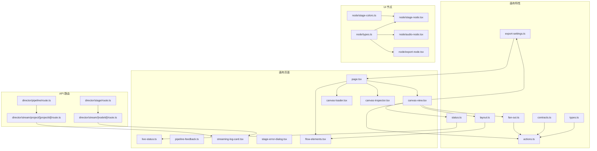
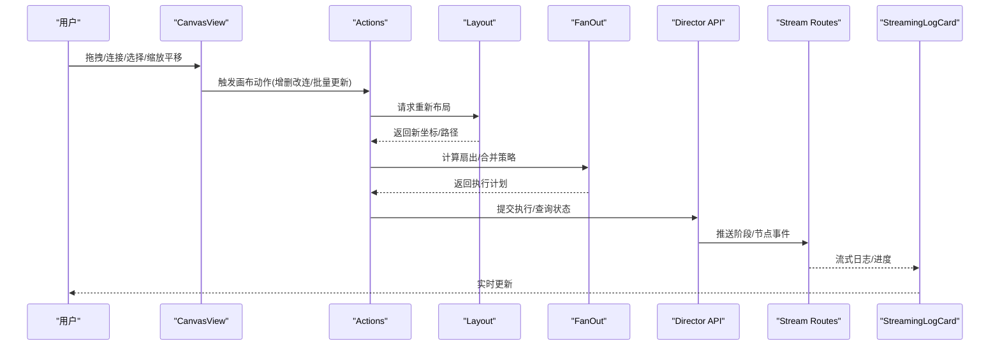
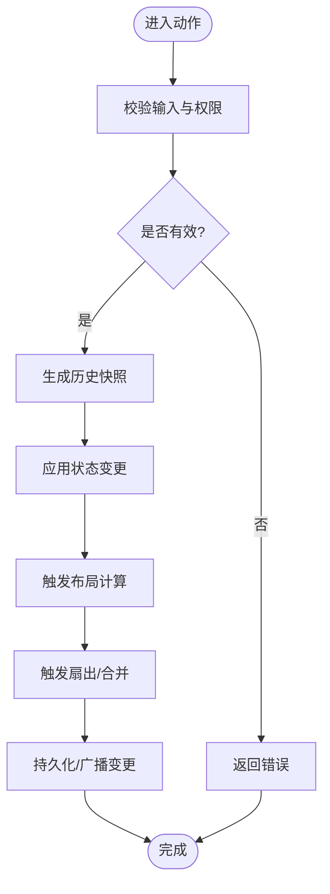
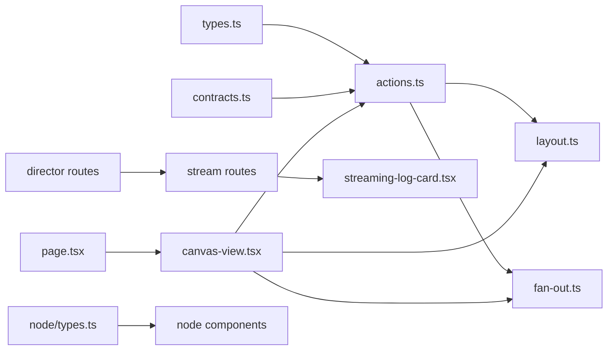

# 画布服务层

<cite>
**本文引用的文件**   
- [src/features/canvas/index.ts](file://src/features/canvas/index.ts)
- [src/features/canvas/types.ts](file://src/features/canvas/types.ts)
- [src/features/canvas/contracts.ts](file://src/features/canvas/contracts.ts)
- [src/features/canvas/actions.ts](file://src/features/canvas/actions.ts)
- [src/features/canvas/layout.ts](file://src/features/canvas/layout.ts)
- [src/features/canvas/fan-out.ts](file://src/features/canvas/fan-out.ts)
- [src/features/canvas/export-settings.ts](file://src/features/canvas/export-settings.ts)
- [src/features/canvas/status.ts](file://src/features/canvas/status.ts)
- [src/app/products/(app)/canvas/[projectId]/page.tsx](file://src/app/products/(app)/canvas/[projectId]/page.tsx)
- [src/app/products/(app)/canvas/[projectId]/flow-elements.tsx](file://src/app/products/(app)/canvas/[projectId]/flow-elements.tsx)
- [src/app/products/(app)/canvas/[projectId]/canvas-view.tsx](file://src/app/products/(app)/canvas/[projectId]/canvas-view.tsx)
- [src/app/products/(app)/canvas/[projectId]/canvas-loader.tsx](file://src/app/products/(app)/canvas/[projectId]/canvas-loader.tsx)
- [src/app/products/(app)/canvas/[projectId]/canvas-inspector.tsx](file://src/app/products/(app)/canvas/[projectId]/canvas-inspector.tsx)
- [src/app/products/(app)/canvas/[projectId]/live-status.ts](file://src/app/products/(app)/canvas/[projectId]/live-status.ts)
- [src/app/products/(app)/canvas/[projectId]/pipeline-feedback.ts](file://src/app/products/(app)/canvas/[projectId]/pipeline-feedback.ts)
- [src/app/products/(app)/canvas/[projectId]/streaming-log-card.tsx](file://src/app/products/(app)/canvas/[projectId]/streaming-log-card.tsx)
- [src/app/products/(app)/canvas/[projectId]/stage-error-dialog.tsx](file://src/app/products/(app)/canvas/[projectId]/stage-error-dialog.tsx)
- [src/app/api/director/pipeline/route.ts](file://src/app/api/director/pipeline/route.ts)
- [src/app/api/director/stage/route.ts](file://src/app/api/director/stage/route.ts)
- [src/app/api/director/stream/[nodeId]/route.ts](file://src/app/api/director/stream/[nodeId]/route.ts)
- [src/app/api/director/stream/project/[projectId]/route.ts](file://src/app/api/director/stream/project/[projectId]/route.ts)
- [src/components/ui/node/types.ts](file://src/components/ui/node/types.ts)
- [src/components/ui/node/stage-node.tsx](file://src/components/ui/node/stage-node.tsx)
- [src/components/ui/node/audio-node.tsx](file://src/components/ui/node/audio-node.tsx)
- [src/components/ui/node/export-node.tsx](file://src/components/ui/node/export-node.tsx)
- [src/components/ui/node/stage-colors.ts](file://src/components/ui/node/stage-colors.ts)
</cite>

## 目录
1. [简介](#简介)
2. [项目结构](#项目结构)
3. [核心组件](#核心组件)
4. [架构总览](#架构总览)
5. [详细组件分析](#详细组件分析)
6. [依赖分析](#依赖分析)
7. [性能考虑](#性能考虑)
8. [故障排查指南](#故障排查指南)
9. [结论](#结论)
10. [附录](#附录)

## 简介
本文件面向 PurpleInk 的“画布服务层”，聚焦可视化编辑器的核心架构、节点管理系统与实时协作机制。内容涵盖：
- 画布操作（新增/删除/移动/连接）、布局算法与状态同步策略
- 版本控制、撤销重做与历史记录管理思路
- 拖拽交互、缩放平移与选择操作的实现要点
- 与后端的数据同步、冲突解决与性能优化
- 画布扩展开发与自定义节点实现指南

说明：本文档基于仓库中 src/features/canvas 与相关页面、API 路由及 UI 节点组件进行归纳，提供从高层到代码级的系统化解读。

## 项目结构
画布能力由“特性模块 + 页面容器 + API 路由 + UI 节点”共同构成：
- 特性模块 features/canvas：定义类型、契约、动作、布局、扇出、导出设置、状态等
- 页面容器 app/products/(app)/canvas/[projectId]：承载画布视图、加载器、检查器、流式日志、错误弹窗等
- API 路由 app/api/director/*：编排管道、阶段推进、流式事件推送
- UI 节点 components/ui/node/*：节点渲染、颜色主题、类型定义

图表来源 
- [src/features/canvas/types.ts](file://src/features/canvas/types.ts)
- [src/features/canvas/contracts.ts](file://src/features/canvas/contracts.ts)
- [src/features/canvas/actions.ts](file://src/features/canvas/actions.ts)
- [src/features/canvas/layout.ts](file://src/features/canvas/layout.ts)
- [src/features/canvas/fan-out.ts](file://src/features/canvas/fan-out.ts)
- [src/features/canvas/export-settings.ts](file://src/features/canvas/export-settings.ts)
- [src/features/canvas/status.ts](file://src/features/canvas/status.ts)
- [src/app/products/(app)/canvas/[projectId]/page.tsx](file://src/app/products/(app)/canvas/[projectId]/page.tsx)
- [src/app/products/(app)/canvas/[projectId]/canvas-view.tsx](file://src/app/products/(app)/canvas/[projectId]/canvas-view.tsx)
- [src/app/products/(app)/canvas/[projectId]/canvas-loader.tsx](file://src/app/products/(app)/canvas/[projectId]/canvas-loader.tsx)
- [src/app/products/(app)/canvas/[projectId]/canvas-inspector.tsx](file://src/app/products/(app)/canvas/[projectId]/canvas-inspector.tsx)
- [src/app/products/(app)/canvas/[projectId]/live-status.ts](file://src/app/products/(app)/canvas/[projectId]/live-status.ts)
- [src/app/products/(app)/canvas/[projectId]/pipeline-feedback.ts](file://src/app/products/(app)/canvas/[projectId]/pipeline-feedback.ts)
- [src/app/products/(app)/canvas/[projectId]/streaming-log-card.tsx](file://src/app/products/(app)/canvas/[projectId]/streaming-log-card.tsx)
- [src/app/products/(app)/canvas/[projectId]/stage-error-dialog.tsx](file://src/app/products/(app)/canvas/[projectId]/stage-error-dialog.tsx)
- [src/app/products/(app)/canvas/[projectId]/flow-elements.tsx](file://src/app/products/(app)/canvas/[projectId]/flow-elements.tsx)
- [src/app/api/director/pipeline/route.ts](file://src/app/api/director/pipeline/route.ts)
- [src/app/api/director/stage/route.ts](file://src/app/api/director/stage/route.ts)
- [src/app/api/director/stream/[nodeId]/route.ts](file://src/app/api/director/stream/[nodeId]/route.ts)
- [src/app/api/director/stream/project/[projectId]/route.ts](file://src/app/api/director/stream/project/[projectId]/route.ts)
- [src/components/ui/node/types.ts](file://src/components/ui/node/types.ts)
- [src/components/ui/node/stage-node.tsx](file://src/components/ui/node/stage-node.tsx)
- [src/components/ui/node/audio-node.tsx](file://src/components/ui/node/audio-node.tsx)
- [src/components/ui/node/export-node.tsx](file://src/components/ui/node/export-node.tsx)
- [src/components/ui/node/stage-colors.ts](file://src/components/ui/node/stage-colors.ts)

章节来源
- [src/features/canvas/index.ts](file://src/features/canvas/index.ts)
- [src/app/products/(app)/canvas/[projectId]/page.tsx](file://src/app/products/(app)/canvas/[projectId]/page.tsx)

## 核心组件
- 类型与契约
  - types.ts：定义画布节点、边、视图状态、布局参数、导出配置等核心数据结构
  - contracts.ts：定义前后端交互契约（如节点状态、阶段结果、流式事件）
- 动作系统
  - actions.ts：封装画布操作（增删改查、连接、批量更新），并驱动状态变更与历史快照
- 布局引擎
  - layout.ts：提供自动布局算法（层级/网格/树形等），计算节点坐标与连线路径
- 扇出与并行
  - fan-out.ts：处理分支扇出、合并与并发执行策略
- 导出设置
  - export-settings.ts：管理导出格式、分辨率、帧率、编码参数等
- 状态与反馈
  - status.ts：维护节点运行状态、错误码、进度指标
  - live-status.ts / pipeline-feedback.ts：聚合运行时状态与用户反馈
  - streaming-log-card.tsx：展示流式日志
  - stage-error-dialog.tsx：阶段错误弹窗

章节来源
- [src/features/canvas/types.ts](file://src/features/canvas/types.ts)
- [src/features/canvas/contracts.ts](file://src/features/canvas/contracts.ts)
- [src/features/canvas/actions.ts](file://src/features/canvas/actions.ts)
- [src/features/canvas/layout.ts](file://src/features/canvas/layout.ts)
- [src/features/canvas/fan-out.ts](file://src/features/canvas/fan-out.ts)
- [src/features/canvas/export-settings.ts](file://src/features/canvas/export-settings.ts)
- [src/features/canvas/status.ts](file://src/features/canvas/status.ts)
- [src/app/products/(app)/canvas/[projectId]/live-status.ts](file://src/app/products/(app)/canvas/[projectId]/live-status.ts)
- [src/app/products/(app)/canvas/[projectId]/pipeline-feedback.ts](file://src/app/products/(app)/canvas/[projectId]/pipeline-feedback.ts)
- [src/app/products/(app)/canvas/[projectId]/streaming-log-card.tsx](file://src/app/products/(app)/canvas/[projectId]/streaming-log-card.tsx)
- [src/app/products/(app)/canvas/[projectId]/stage-error-dialog.tsx](file://src/app/products/(app)/canvas/[projectId]/stage-error-dialog.tsx)

## 架构总览
画布服务层采用“前端特性模块 + 页面容器 + API 路由 + UI 节点”的分层架构：
- 前端特性模块负责数据模型、业务动作、布局与导出策略
- 页面容器组合视图、加载器、检查器与流式日志
- API 路由负责编排管道、阶段推进与流式事件推送
- UI 节点提供可插拔的可视化元素

图表来源 
- [src/app/products/(app)/canvas/[projectId]/canvas-view.tsx](file://src/app/products/(app)/canvas/[projectId]/canvas-view.tsx)
- [src/features/canvas/actions.ts](file://src/features/canvas/actions.ts)
- [src/features/canvas/layout.ts](file://src/features/canvas/layout.ts)
- [src/features/canvas/fan-out.ts](file://src/features/canvas/fan-out.ts)
- [src/app/api/director/pipeline/route.ts](file://src/app/api/director/pipeline/route.ts)
- [src/app/api/director/stage/route.ts](file://src/app/api/director/stage/route.ts)
- [src/app/api/director/stream/[nodeId]/route.ts](file://src/app/api/director/stream/[nodeId]/route.ts)
- [src/app/products/(app)/canvas/[projectId]/streaming-log-card.tsx](file://src/app/products/(app)/canvas/[projectId]/streaming-log-card.tsx)

## 详细组件分析

### 类型与契约（types.ts, contracts.ts）
- 职责
  - 统一节点、边、视图状态、布局参数、导出配置、运行状态、流式事件的结构
  - 约束前后端交互字段，确保序列化一致性
- 关键点
  - 节点类型枚举与扩展点，便于自定义节点接入
  - 状态机字段（如 pending/running/success/error）用于驱动 UI 与协作同步
  - 版本/时间戳字段支持冲突检测与合并

章节来源
- [src/features/canvas/types.ts](file://src/features/canvas/types.ts)
- [src/features/canvas/contracts.ts](file://src/features/canvas/contracts.ts)

### 动作系统（actions.ts）
- 职责
  - 封装画布操作：添加节点、删除节点、移动节点、建立/断开连接、批量更新
  - 驱动状态变更、生成历史快照、触发布局与扇出计算
- 关键点
  - 原子性事务：将多个子操作打包为一次状态提交，保证一致性
  - 撤销/重做：通过历史栈记录操作元数据，支持回滚与重放
  - 副作用派发：在动作完成后触发布局、扇出、导出设置更新

图表来源 
- [src/features/canvas/actions.ts](file://src/features/canvas/actions.ts)

章节来源
- [src/features/canvas/actions.ts](file://src/features/canvas/actions.ts)

### 布局引擎（layout.ts）
- 职责
  - 根据图结构与约束条件计算节点位置与连线路径
  - 支持多种布局策略（层级、网格、树形、力导向等）
- 关键点
  - 复杂度：通常为 O(N log N) 或 O(N^2)，需按规模选择合适策略
  - 增量更新：仅对受影响子图重算，降低重排开销
  - 碰撞检测与间距规则，保证可读性与美观

章节来源
- [src/features/canvas/layout.ts](file://src/features/canvas/layout.ts)

### 扇出与并行（fan-out.ts）
- 职责
  - 解析图的分支与合并，生成执行计划
  - 控制并发度与资源配额，避免过载
- 关键点
  - 拓扑排序与关键路径识别
  - 失败重试与熔断策略
  - 与状态同步结合，确保 UI 与后端一致

章节来源
- [src/features/canvas/fan-out.ts](file://src/features/canvas/fan-out.ts)

### 导出设置（export-settings.ts）
- 职责
  - 管理导出格式、分辨率、帧率、编码参数等
- 关键点
  - 默认值与校验规则
  - 与渲染管线对接的参数映射

章节来源
- [src/features/canvas/export-settings.ts](file://src/features/canvas/export-settings.ts)

### 状态与反馈（status.ts, live-status.ts, pipeline-feedback.ts, streaming-log-card.tsx, stage-error-dialog.tsx）
- 职责
  - 维护节点运行状态、错误码、进度指标
  - 聚合运行时状态与用户反馈，展示流式日志与错误弹窗
- 关键点
  - 状态去抖与节流，避免频繁重绘
  - 错误分类与提示策略

章节来源
- [src/features/canvas/status.ts](file://src/features/canvas/status.ts)
- [src/app/products/(app)/canvas/[projectId]/live-status.ts](file://src/app/products/(app)/canvas/[projectId]/live-status.ts)
- [src/app/products/(app)/canvas/[projectId]/pipeline-feedback.ts](file://src/app/products/(app)/canvas/[projectId]/pipeline-feedback.ts)
- [src/app/products/(app)/canvas/[projectId]/streaming-log-card.tsx](file://src/app/products/(app)/canvas/[projectId]/streaming-log-card.tsx)
- [src/app/products/(app)/canvas/[projectId]/stage-error-dialog.tsx](file://src/app/products/(app)/canvas/[projectId]/stage-error-dialog.tsx)

### 页面容器（page.tsx, canvas-view.tsx, canvas-loader.tsx, canvas-inspector.tsx, flow-elements.tsx）
- 职责
  - 组合画布视图、加载器、检查器与流程元素
  - 管理用户交互（拖拽、缩放平移、选择）与状态绑定
- 关键点
  - 视图与数据解耦，通过动作系统驱动
  - 懒加载与虚拟滚动提升大画布性能

章节来源
- [src/app/products/(app)/canvas/[projectId]/page.tsx](file://src/app/products/(app)/canvas/[projectId]/page.tsx)
- [src/app/products/(app)/canvas/[projectId]/canvas-view.tsx](file://src/app/products/(app)/canvas/[projectId]/canvas-view.tsx)
- [src/app/products/(app)/canvas/[projectId]/canvas-loader.tsx](file://src/app/products/(app)/canvas/[projectId]/canvas-loader.tsx)
- [src/app/products/(app)/canvas/[projectId]/canvas-inspector.tsx](file://src/app/products/(app)/canvas/[projectId]/canvas-inspector.tsx)
- [src/app/products/(app)/canvas/[projectId]/flow-elements.tsx](file://src/app/products/(app)/canvas/[projectId]/flow-elements.tsx)

### API 路由（director/pipeline/route.ts, director/stage/route.ts, director/stream/[nodeId]/route.ts, director/stream/project/[projectId]/route.ts）
- 职责
  - 编排管道、推进阶段、推送流式事件
- 关键点
  - 幂等性与重试
  - 流式输出（SSE/WebSocket）保障实时协作

章节来源
- [src/app/api/director/pipeline/route.ts](file://src/app/api/director/pipeline/route.ts)
- [src/app/api/director/stage/route.ts](file://src/app/api/director/stage/route.ts)
- [src/app/api/director/stream/[nodeId]/route.ts](file://src/app/api/director/stream/[nodeId]/route.ts)
- [src/app/api/director/stream/project/[projectId]/route.ts](file://src/app/api/director/stream/project/[projectId]/route.ts)

### UI 节点（node/types.ts, node/stage-node.tsx, node/audio-node.tsx, node/export-node.tsx, node/stage-colors.ts）
- 职责
  - 定义节点类型与渲染逻辑，提供颜色主题
- 关键点
  - 可扩展的节点注册表
  - 与画布动作系统的集成（选中、拖拽、属性编辑）

章节来源
- [src/components/ui/node/types.ts](file://src/components/ui/node/types.ts)
- [src/components/ui/node/stage-node.tsx](file://src/components/ui/node/stage-node.tsx)
- [src/components/ui/node/audio-node.tsx](file://src/components/ui/node/audio-node.tsx)
- [src/components/ui/node/export-node.tsx](file://src/components/ui/node/export-node.tsx)
- [src/components/ui/node/stage-colors.ts](file://src/components/ui/node/stage-colors.ts)

## 依赖分析
- 耦合关系
  - 动作系统依赖类型与契约，驱动布局与扇出计算
  - 页面容器依赖动作系统与 UI 节点，组合视图与交互
  - API 路由依赖状态与流式事件，向客户端推送变更
- 外部依赖
  - 数据库/存储（持久化状态与历史）
  - 消息通道（SSE/WebSocket）用于实时协作

图表来源 
- [src/features/canvas/types.ts](file://src/features/canvas/types.ts)
- [src/features/canvas/contracts.ts](file://src/features/canvas/contracts.ts)
- [src/features/canvas/actions.ts](file://src/features/canvas/actions.ts)
- [src/features/canvas/layout.ts](file://src/features/canvas/layout.ts)
- [src/features/canvas/fan-out.ts](file://src/features/canvas/fan-out.ts)
- [src/app/products/(app)/canvas/[projectId]/page.tsx](file://src/app/products/(app)/canvas/[projectId]/page.tsx)
- [src/app/products/(app)/canvas/[projectId]/canvas-view.tsx](file://src/app/products/(app)/canvas/[projectId]/canvas-view.tsx)
- [src/app/api/director/pipeline/route.ts](file://src/app/api/director/pipeline/route.ts)
- [src/app/api/director/stage/route.ts](file://src/app/api/director/stage/route.ts)
- [src/app/api/director/stream/[nodeId]/route.ts](file://src/app/api/director/stream/[nodeId]/route.ts)
- [src/app/products/(app)/canvas/[projectId]/streaming-log-card.tsx](file://src/app/products/(app)/canvas/[projectId]/streaming-log-card.tsx)
- [src/components/ui/node/types.ts](file://src/components/ui/node/types.ts)

章节来源
- [src/features/canvas/index.ts](file://src/features/canvas/index.ts)

## 性能考虑
- 布局与渲染
  - 使用增量布局与局部重算，避免全量重排
  - 虚拟滚动与按需渲染，减少 DOM 压力
- 状态同步
  - 事件去抖与节流，合并高频操作
  - 差异同步与补丁传输，降低带宽占用
- 并发与资源
  - 限制扇出并发度，避免资源争用
  - 失败重试与退避策略，提高鲁棒性
- 缓存与持久化
  - 本地缓存热点数据，离线可用
  - 异步持久化，避免阻塞主线程

[本节为通用指导，不直接分析具体文件]

## 故障排查指南
- 常见问题定位
  - 节点状态异常：检查 status.ts 的状态机与错误码
  - 布局错乱：查看 layout.ts 的约束与碰撞检测
  - 扇出失败：确认 fan-out.ts 的拓扑与并发策略
  - 流式日志中断：检查 stream routes 的连接与重连逻辑
- 调试建议
  - 启用详细日志与追踪 ID
  - 使用浏览器网络面板观察 SSE/WebSocket 事件
  - 回放历史快照定位问题

章节来源
- [src/features/canvas/status.ts](file://src/features/canvas/status.ts)
- [src/features/canvas/layout.ts](file://src/features/canvas/layout.ts)
- [src/features/canvas/fan-out.ts](file://src/features/canvas/fan-out.ts)
- [src/app/api/director/stream/[nodeId]/route.ts](file://src/app/api/director/stream/[nodeId]/route.ts)
- [src/app/products/(app)/canvas/[projectId]/streaming-log-card.tsx](file://src/app/products/(app)/canvas/[projectId]/streaming-log-card.tsx)

## 结论
PurpleInk 画布服务层以清晰的类型契约与动作系统为核心，配合布局引擎与扇出策略，实现了可扩展、高性能的可视化编辑器。通过 API 路由与流式事件，达成实时协作与状态同步。遵循本文档的实践，可在保证稳定性的同时快速扩展画布能力与自定义节点。

[本节为总结，不直接分析具体文件]

## 附录
- 扩展开发指南
  - 新增节点类型：在 node/types.ts 中扩展类型，并在 UI 节点组件中实现渲染与交互
  - 注册节点：在节点注册表中声明新节点，关联动作与属性面板
  - 自定义布局：在 layout.ts 中实现新的布局策略，并通过动作系统调用
  - 自定义导出：在 export-settings.ts 中扩展导出参数，并与渲染管线对接
- 最佳实践
  - 保持动作原子性与幂等性
  - 使用版本/时间戳进行冲突检测与合并
  - 对高频操作进行去抖与节流
  - 合理划分组件边界，提升可测试性与可维护性

[本节为补充信息，不直接分析具体文件]