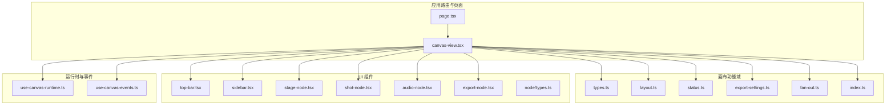
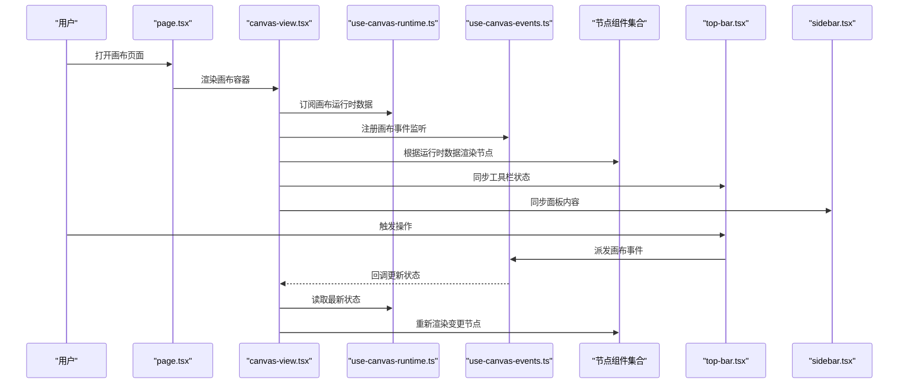
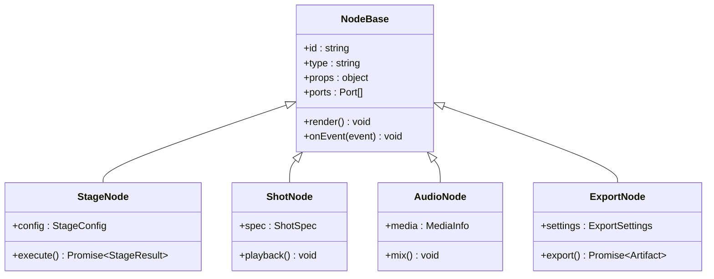
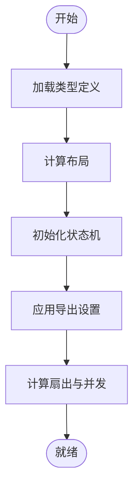
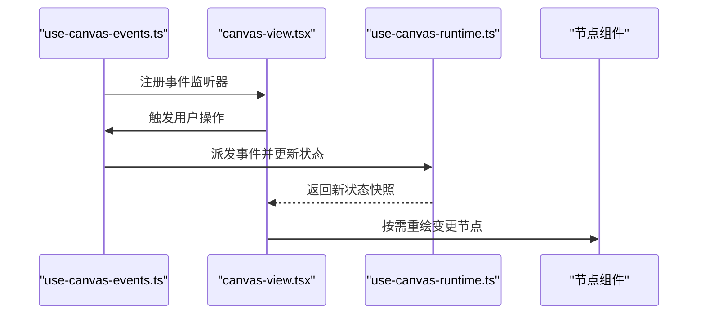
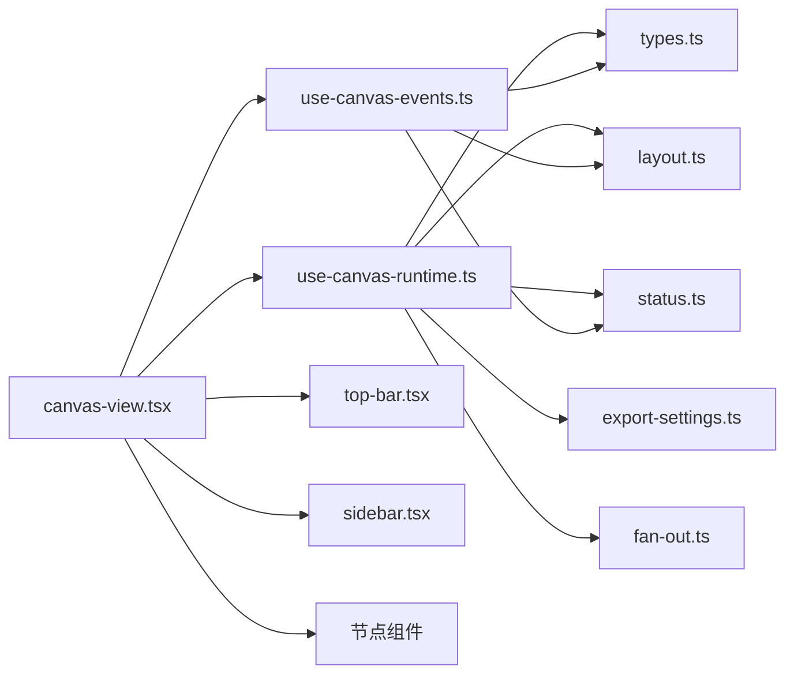

# 画布核心架构

<cite>
**本文引用的文件**   
- [src/app/products/(app)/canvas/[projectId]/page.tsx](file://src/app/products/(app)/canvas/[projectId]/page.tsx)
- [src/app/products/(app)/canvas/[projectId]/canvas-view.tsx](file://src/app/products/(app)/canvas/[projectId]/canvas-view.tsx)
- [src/app/products/(app)/canvas/[projectId]/flow-elements.tsx](file://src/app/products/(app)/canvas/[projectId]/flow-elements.tsx)
- [src/app/products/(app)/canvas/[projectId]/canvas-action-api.ts](file://src/app/products/(app)/canvas/[projectId]/canvas-action-api.ts)
- [src/features/canvas/index.ts](file://src/features/canvas/index.ts)
- [src/features/canvas/types.ts](file://src/features/canvas/types.ts)
- [src/features/canvas/layout.ts](file://src/features/canvas/layout.ts)
- [src/features/canvas/status.ts](file://src/features/canvas/status.ts)
- [src/features/canvas/export-settings.ts](file://src/features/canvas/export-settings.ts)
- [src/features/canvas/fan-out.ts](file://src/features/canvas/fan-out.ts)
- [src/components/ui/node/stage-node.tsx](file://src/components/ui/node/stage-node.tsx)
- [src/components/ui/node/shot-node.tsx](file://src/components/ui/node/shot-node.tsx)
- [src/components/ui/node/audio-node.tsx](file://src/components/ui/node/audio-node.tsx)
- [src/components/ui/node/export-node.tsx](file://src/components/ui/node/export-node.tsx)
- [src/components/ui/node/types.ts](file://src/components/ui/node/types.ts)
- [src/components/ui/top-bar.tsx](file://src/components/ui/top-bar.tsx)
- [src/components/ui/sidebar.tsx](file://src/components/ui/sidebar.tsx)
- [src/lib/hooks/use-canvas-runtime.ts](file://src/lib/hooks/use-canvas-runtime.ts)
- [src/lib/hooks/use-canvas-events.ts](file://src/lib/hooks/use-canvas-events.ts)
</cite>

## 目录
1. [简介](#简介)
2. [项目结构](#项目结构)
3. [核心组件](#核心组件)
4. [架构总览](#架构总览)
5. [详细组件分析](#详细组件分析)
6. [依赖关系分析](#依赖关系分析)
7. [性能考量](#性能考量)
8. [故障排查指南](#故障排查指南)
9. [结论](#结论)
10. [附录](#附录)

## 简介
本文件为 PurpleInk 画布核心架构的技术文档，面向希望理解并扩展画布系统的开发者。内容覆盖画布容器的初始化流程、渲染循环与事件处理机制、与节点系统以及工具栏和面板的集成方式，同时给出状态管理、性能优化与内存管理的策略建议，并提供扩展开发的基础指导与最佳实践。

## 项目结构
画布相关代码主要分布在以下位置：
- 页面与视图层：路由页面、画布容器与视图组件
- 功能域（features）：画布类型、布局、状态、导出设置、扇出计算等
- UI 组件：节点类型、顶部工具栏、侧边栏
- Hooks：运行时数据获取、事件绑定与分发

图表来源
- [src/app/products/(app)/canvas/[projectId]/page.tsx](file://src/app/products/(app)/canvas/[projectId]/page.tsx)
- [src/app/products/(app)/canvas/[projectId]/canvas-view.tsx](file://src/app/products/(app)/canvas/[projectId]/canvas-view.tsx)
- [src/features/canvas/index.ts](file://src/features/canvas/index.ts)
- [src/features/canvas/types.ts](file://src/features/canvas/types.ts)
- [src/features/canvas/layout.ts](file://src/features/canvas/layout.ts)
- [src/features/canvas/status.ts](file://src/features/canvas/status.ts)
- [src/features/canvas/export-settings.ts](file://src/features/canvas/export-settings.ts)
- [src/features/canvas/fan-out.ts](file://src/features/canvas/fan-out.ts)
- [src/components/ui/top-bar.tsx](file://src/components/ui/top-bar.tsx)
- [src/components/ui/sidebar.tsx](file://src/components/ui/sidebar.tsx)
- [src/components/ui/node/stage-node.tsx](file://src/components/ui/node/stage-node.tsx)
- [src/components/ui/node/shot-node.tsx](file://src/components/ui/node/shot-node.tsx)
- [src/components/ui/node/audio-node.tsx](file://src/components/ui/node/audio-node.tsx)
- [src/components/ui/node/export-node.tsx](file://src/components/ui/node/export-node.tsx)
- [src/components/ui/node/types.ts](file://src/components/ui/node/types.ts)
- [src/lib/hooks/use-canvas-runtime.ts](file://src/lib/hooks/use-canvas-runtime.ts)
- [src/lib/hooks/use-canvas-events.ts](file://src/lib/hooks/use-canvas-events.ts)

章节来源
- [src/app/products/(app)/canvas/[projectId]/page.tsx](file://src/app/products/(app)/canvas/[projectId]/page.tsx)
- [src/app/products/(app)/canvas/[projectId]/canvas-view.tsx](file://src/app/products/(app)/canvas/[projectId]/canvas-view.tsx)
- [src/features/canvas/index.ts](file://src/features/canvas/index.ts)

## 核心组件
- 画布容器与视图：负责挂载画布、订阅运行时数据、协调工具栏与面板交互
- 节点系统：统一的节点类型定义与渲染组件，支撑阶段节点、镜头节点、音频节点、导出节点等
- 画布功能域：类型定义、布局算法、状态机、导出配置、扇出计算等
- 运行时与事件：提供画布运行时的数据访问与事件绑定能力
- 工具栏与侧边栏：提供操作入口与上下文面板

章节来源
- [src/app/products/(app)/canvas/[projectId]/canvas-view.tsx](file://src/app/products/(app)/canvas/[projectId]/canvas-view.tsx)
- [src/components/ui/node/types.ts](file://src/components/ui/node/types.ts)
- [src/features/canvas/types.ts](file://src/features/canvas/types.ts)
- [src/lib/hooks/use-canvas-runtime.ts](file://src/lib/hooks/use-canvas-runtime.ts)
- [src/lib/hooks/use-canvas-events.ts](file://src/lib/hooks/use-canvas-events.ts)

## 架构总览
画布采用“视图-运行时-功能域”的分层架构：
- 视图层：React 组件负责渲染与用户交互
- 运行时层：通过 hooks 暴露画布状态与事件，解耦 UI 与业务逻辑
- 功能域层：纯函数与类型定义实现布局、状态、导出、扇出等核心算法

图表来源
- [src/app/products/(app)/canvas/[projectId]/page.tsx](file://src/app/products/(app)/canvas/[projectId]/page.tsx)
- [src/app/products/(app)/canvas/[projectId]/canvas-view.tsx](file://src/app/products/(app)/canvas/[projectId]/canvas-view.tsx)
- [src/lib/hooks/use-canvas-runtime.ts](file://src/lib/hooks/use-canvas-runtime.ts)
- [src/lib/hooks/use-canvas-events.ts](file://src/lib/hooks/use-canvas-events.ts)
- [src/components/ui/top-bar.tsx](file://src/components/ui/top-bar.tsx)
- [src/components/ui/sidebar.tsx](file://src/components/ui/sidebar.tsx)

## 详细组件分析

### 画布容器与视图
- 职责：挂载画布区域、加载运行时数据、响应工具栏与面板事件、驱动节点渲染
- 关键点：
  - 初始化时订阅运行时数据，确保视图与状态一致
  - 事件总线将用户操作转换为画布内部事件
  - 与工具栏和侧边栏保持双向同步

章节来源
- [src/app/products/(app)/canvas/[projectId]/canvas-view.tsx](file://src/app/products/(app)/canvas/[projectId]/canvas-view.tsx)
- [src/lib/hooks/use-canvas-runtime.ts](file://src/lib/hooks/use-canvas-runtime.ts)
- [src/lib/hooks/use-canvas-events.ts](file://src/lib/hooks/use-canvas-events.ts)

### 节点系统与类型
- 节点类型：阶段节点、镜头节点、音频节点、导出节点等
- 统一接口：节点属性、连接端口、渲染行为、事件回调
- 渲染策略：按类型选择对应组件，支持拖拽、连线、缩放等操作

图表来源
- [src/components/ui/node/types.ts](file://src/components/ui/node/types.ts)
- [src/components/ui/node/stage-node.tsx](file://src/components/ui/node/stage-node.tsx)
- [src/components/ui/node/shot-node.tsx](file://src/components/ui/node/shot-node.tsx)
- [src/components/ui/node/audio-node.tsx](file://src/components/ui/node/audio-node.tsx)
- [src/components/ui/node/export-node.tsx](file://src/components/ui/node/export-node.tsx)

章节来源
- [src/components/ui/node/types.ts](file://src/components/ui/node/types.ts)
- [src/components/ui/node/stage-node.tsx](file://src/components/ui/node/stage-node.tsx)
- [src/components/ui/node/shot-node.tsx](file://src/components/ui/node/shot-node.tsx)
- [src/components/ui/node/audio-node.tsx](file://src/components/ui/node/audio-node.tsx)
- [src/components/ui/node/export-node.tsx](file://src/components/ui/node/export-node.tsx)

### 画布功能域：类型、布局、状态、导出、扇出
- 类型定义：画布图结构、节点类型、连接关系、运行时快照
- 布局算法：自动排列、对齐、间距控制
- 状态机：节点执行状态、错误恢复、进度追踪
- 导出设置：输出格式、质量、并发限制
- 扇出计算：并行度评估、资源预估

图表来源
- [src/features/canvas/types.ts](file://src/features/canvas/types.ts)
- [src/features/canvas/layout.ts](file://src/features/canvas/layout.ts)
- [src/features/canvas/status.ts](file://src/features/canvas/status.ts)
- [src/features/canvas/export-settings.ts](file://src/features/canvas/export-settings.ts)
- [src/features/canvas/fan-out.ts](file://src/features/canvas/fan-out.ts)

章节来源
- [src/features/canvas/types.ts](file://src/features/canvas/types.ts)
- [src/features/canvas/layout.ts](file://src/features/canvas/layout.ts)
- [src/features/canvas/status.ts](file://src/features/canvas/status.ts)
- [src/features/canvas/export-settings.ts](file://src/features/canvas/export-settings.ts)
- [src/features/canvas/fan-out.ts](file://src/features/canvas/fan-out.ts)

### 运行时与事件
- 运行时：提供画布当前状态、节点列表、连接关系、执行进度
- 事件：鼠标、键盘、拖拽、连线、撤销重做等
- 设计原则：单向数据流、事件不可变、状态可序列化

图表来源
- [src/lib/hooks/use-canvas-events.ts](file://src/lib/hooks/use-canvas-events.ts)
- [src/lib/hooks/use-canvas-runtime.ts](file://src/lib/hooks/use-canvas-runtime.ts)
- [src/app/products/(app)/canvas/[projectId]/canvas-view.tsx](file://src/app/products/(app)/canvas/[projectId]/canvas-view.tsx)

章节来源
- [src/lib/hooks/use-canvas-events.ts](file://src/lib/hooks/use-canvas-events.ts)
- [src/lib/hooks/use-canvas-runtime.ts](file://src/lib/hooks/use-canvas-runtime.ts)

### 工具栏与面板集成
- 工具栏：常用操作的快捷入口，如新建节点、删除、撤销、重做、导出
- 侧边栏：上下文面板，显示节点详情、设置、日志与反馈
- 集成方式：通过事件与运行时状态联动，避免直接耦合

章节来源
- [src/components/ui/top-bar.tsx](file://src/components/ui/top-bar.tsx)
- [src/components/ui/sidebar.tsx](file://src/components/ui/sidebar.tsx)

### 画布动作 API
- 作用：封装画布常见操作（添加节点、移动、连线、批量编辑）
- 特点：幂等性、事务性、可回滚

章节来源
- [src/app/products/(app)/canvas/[projectId]/canvas-action-api.ts](file://src/app/products/(app)/canvas/[projectId]/canvas-action-api.ts)

## 依赖关系分析
画布模块之间的依赖清晰分层：
- 视图层依赖运行时与事件钩子
- 运行时与事件钩子依赖功能域的类型与算法
- UI 组件依赖节点类型定义与运行时数据

图表来源
- [src/app/products/(app)/canvas/[projectId]/canvas-view.tsx](file://src/app/products/(app)/canvas/[projectId]/canvas-view.tsx)
- [src/lib/hooks/use-canvas-runtime.ts](file://src/lib/hooks/use-canvas-runtime.ts)
- [src/lib/hooks/use-canvas-events.ts](file://src/lib/hooks/use-canvas-events.ts)
- [src/features/canvas/index.ts](file://src/features/canvas/index.ts)
- [src/features/canvas/types.ts](file://src/features/canvas/types.ts)
- [src/features/canvas/layout.ts](file://src/features/canvas/layout.ts)
- [src/features/canvas/status.ts](file://src/features/canvas/status.ts)
- [src/features/canvas/export-settings.ts](file://src/features/canvas/export-settings.ts)
- [src/features/canvas/fan-out.ts](file://src/features/canvas/fan-out.ts)
- [src/components/ui/top-bar.tsx](file://src/components/ui/top-bar.tsx)
- [src/components/ui/sidebar.tsx](file://src/components/ui/sidebar.tsx)

章节来源
- [src/features/canvas/index.ts](file://src/features/canvas/index.ts)

## 性能考量
- 渲染优化：
  - 使用选择性重绘，仅更新变更节点
  - 虚拟化大列表，减少 DOM 数量
  - 合并多次状态更新，降低重排重绘
- 事件处理：
  - 防抖与节流高频事件（拖拽、缩放）
  - 事件去重与优先级调度
- 内存管理：
  - 及时释放事件监听器与定时器
  - 避免闭包持有大对象引用
  - 使用弱引用缓存热点数据
- 并发与扇出：
  - 基于 fan-out 计算动态调整并行度
  - 限制最大并发，防止资源耗尽

[本节为通用指导，不直接分析具体文件]

## 故障排查指南
- 常见问题：
  - 节点未渲染：检查运行时数据是否加载、节点类型是否正确
  - 事件无响应：确认事件监听器已注册且未被移除
  - 布局错乱：验证布局算法输入参数与约束条件
  - 导出失败：检查导出设置与权限
- 调试建议：
  - 打印运行时快照，对比前后差异
  - 使用浏览器性能面板定位瓶颈
  - 在关键路径添加日志与埋点

章节来源
- [src/app/products/(app)/canvas/[projectId]/canvas-view.tsx](file://src/app/products/(app)/canvas/[projectId]/canvas-view.tsx)
- [src/lib/hooks/use-canvas-runtime.ts](file://src/lib/hooks/use-canvas-runtime.ts)
- [src/lib/hooks/use-canvas-events.ts](file://src/lib/hooks/use-canvas-events.ts)

## 结论
PurpleInk 画布核心架构以清晰的层次划分与模块化设计为基础，通过运行时与事件钩子解耦 UI 与业务逻辑，结合节点系统与功能域算法实现高内聚、低耦合的可扩展画布平台。遵循本文档的最佳实践与性能策略，可有效提升稳定性与用户体验。

[本节为总结，不直接分析具体文件]

## 附录
- 扩展开发基础：
  - 新增节点类型：在节点类型定义中声明，并实现对应组件与运行时逻辑
  - 自定义布局：扩展布局算法，适配新的节点形态与连接规则
  - 事件扩展：在事件钩子中注册新事件，并在视图中处理
- 最佳实践：
  - 保持状态不可变与可序列化
  - 单一职责与最小化依赖
  - 充分测试边界条件与异常路径

[本节为补充说明，不直接分析具体文件]