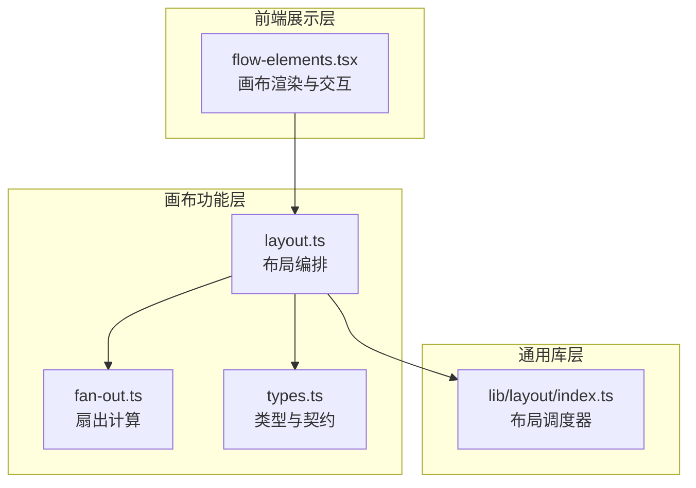
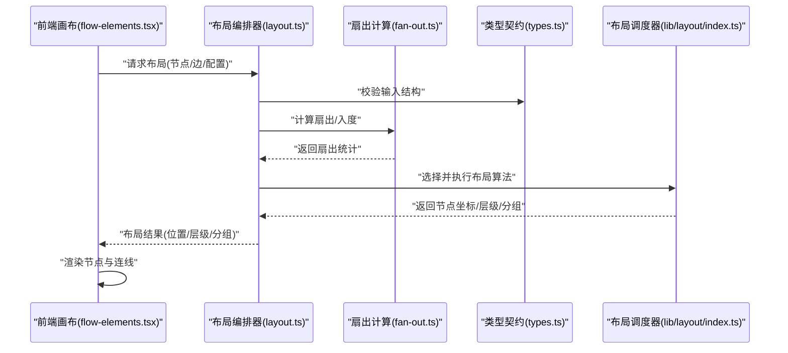
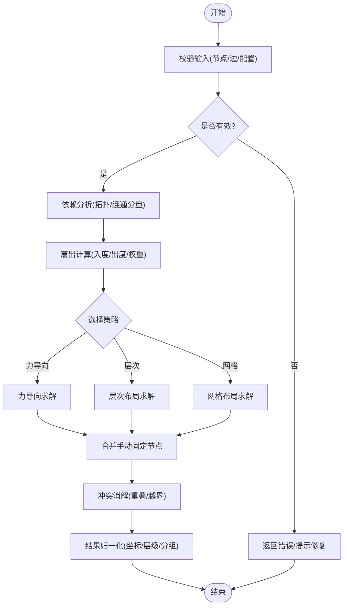
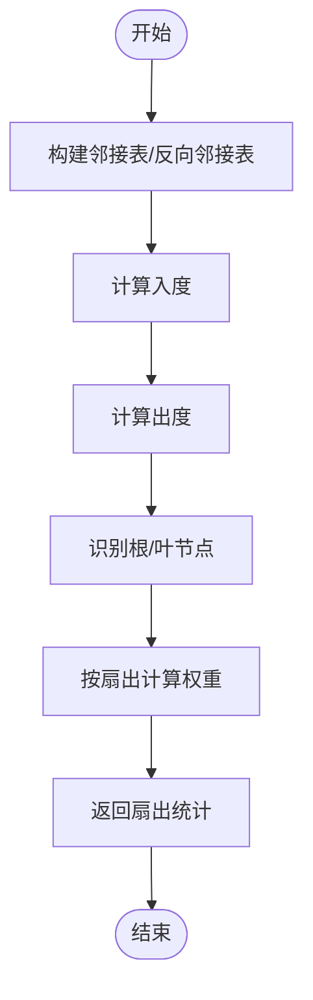
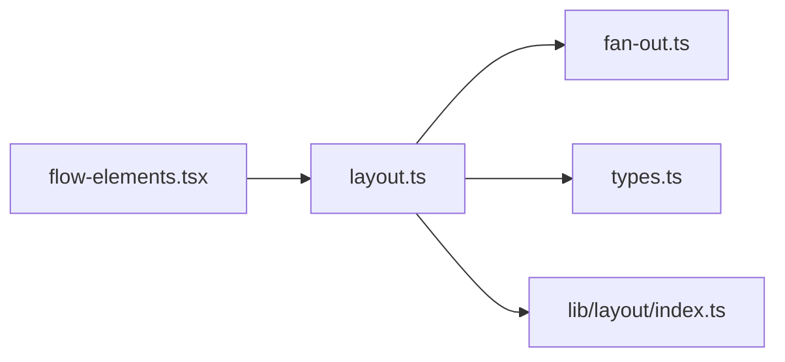

# 布局算法

<cite>
**本文引用的文件**   
- [src/features/canvas/layout.ts](file://src/features/canvas/layout.ts)
- [src/features/canvas/fan-out.ts](file://src/features/canvas/fan-out.ts)
- [src/features/canvas/types.ts](file://src/features/canvas/types.ts)
- [src/lib/layout/index.ts](file://src/lib/layout/index.ts)
- [src/app/products/(app)/canvas/[projectId]/flow-elements.tsx](file://src/app/products/(app)/canvas/[projectId]/flow-elements.tsx)
</cite>

## 目录
1. [简介](#简介)
2. [项目结构](#项目结构)
3. [核心组件](#核心组件)
4. [架构总览](#架构总览)
5. [详细组件分析](#详细组件分析)
6. [依赖关系分析](#依赖关系分析)
7. [性能考虑](#性能考虑)
8. [故障排查指南](#故障排查指南)
9. [结论](#结论)
10. [附录](#附录)

## 简介
本文件为 PurpleInk 画布布局算法的权威文档，聚焦自动布局与手动调整协同机制。内容涵盖：
- 力导向、层次布局与网格布局的实现原理与适用场景
- 节点依赖分析与拓扑排序策略
- 扇出计算、连接优化与空间分配策略
- 手动调整与自动布局的协调机制
- 性能优化技巧与自定义布局扩展方法

## 项目结构
与布局相关的代码主要分布在以下模块：
- features/canvas：画布业务逻辑（布局、扇出、类型定义等）
- lib/layout：通用布局能力封装与调度入口
- app/products/.../canvas：前端画布渲染与交互（触发布局、应用结果）

图表来源
- [src/features/canvas/layout.ts](file://src/features/canvas/layout.ts)
- [src/features/canvas/fan-out.ts](file://src/features/canvas/fan-out.ts)
- [src/features/canvas/types.ts](file://src/features/canvas/types.ts)
- [src/lib/layout/index.ts](file://src/lib/layout/index.ts)
- [src/app/products/(app)/canvas/[projectId]/flow-elements.tsx](file://src/app/products/(app)/canvas/[projectId]/flow-elements.tsx)

章节来源
- [src/features/canvas/layout.ts](file://src/features/canvas/layout.ts)
- [src/features/canvas/fan-out.ts](file://src/features/canvas/fan-out.ts)
- [src/features/canvas/types.ts](file://src/features/canvas/types.ts)
- [src/lib/layout/index.ts](file://src/lib/layout/index.ts)
- [src/app/products/(app)/canvas/[projectId]/flow-elements.tsx](file://src/app/products/(app)/canvas/[projectId]/flow-elements.tsx)

## 核心组件
- 布局编排器（features/canvas/layout.ts）
  - 负责选择并执行具体布局策略（力导向、层次、网格），协调输入数据、约束与输出位置。
- 扇出计算（features/canvas/fan-out.ts）
  - 基于节点依赖图计算每个节点的入度/出度，用于布局权重、层级划分与连线优化。
- 类型与契约（features/canvas/types.ts）
  - 定义节点、边、布局配置、布局结果等数据结构，确保各模块间一致的数据契约。
- 通用布局调度器（lib/layout/index.ts）
  - 提供统一的布局接口，支持注册/切换布局算法、批量处理与增量更新。
- 前端画布渲染（flow-elements.tsx）
  - 触发布局、接收布局结果、驱动节点与连线的渲染与交互。

章节来源
- [src/features/canvas/layout.ts](file://src/features/canvas/layout.ts)
- [src/features/canvas/fan-out.ts](file://src/features/canvas/fan-out.ts)
- [src/features/canvas/types.ts](file://src/features/canvas/types.ts)
- [src/lib/layout/index.ts](file://src/lib/layout/index.ts)
- [src/app/products/(app)/canvas/[projectId]/flow-elements.tsx](file://src/app/products/(app)/canvas/[projectId]/flow-elements.tsx)

## 架构总览
整体流程从前端触发布局请求开始，经由布局编排器选择策略，结合依赖分析与扇出信息，生成最终坐标并回写至画布进行渲染。

图表来源
- [src/app/products/(app)/canvas/[projectId]/flow-elements.tsx](file://src/app/products/(app)/canvas/[projectId]/flow-elements.tsx)
- [src/features/canvas/layout.ts](file://src/features/canvas/layout.ts)
- [src/features/canvas/fan-out.ts](file://src/features/canvas/fan-out.ts)
- [src/features/canvas/types.ts](file://src/features/canvas/types.ts)
- [src/lib/layout/index.ts](file://src/lib/layout/index.ts)

## 详细组件分析

### 布局编排器（features/canvas/layout.ts）
- 职责
  - 解析输入（节点、边、布局参数），校验数据一致性
  - 根据策略选择力导向、层次或网格布局
  - 合并手动固定节点与自动布局结果
  - 输出标准化布局结果（坐标、层级、分组、边界框）
- 关键流程
  - 输入校验 → 依赖分析 → 扇出计算 → 策略选择 → 布局求解 → 冲突消解 → 结果归一化
- 错误处理
  - 对非法图结构（环、孤立点、缺失字段）给出可恢复策略或明确报错
- 可扩展性
  - 通过策略接口注册新布局算法，保持编排器稳定

图表来源
- [src/features/canvas/layout.ts](file://src/features/canvas/layout.ts)

章节来源
- [src/features/canvas/layout.ts](file://src/features/canvas/layout.ts)

### 扇出计算（features/canvas/fan-out.ts）
- 目标
  - 计算每个节点的入度/出度、扇出大小、关键路径权重，辅助布局权重与层级划分
- 算法要点
  - 构建邻接表与反向邻接表
  - 遍历图计算入度/出度，识别根/叶节点
  - 可选：按扇出大小加权，影响力导向斥力或层次间距
- 复杂度
  - 时间 O(V+E)，空间 O(V+E)

图表来源
- [src/features/canvas/fan-out.ts](file://src/features/canvas/fan-out.ts)

章节来源
- [src/features/canvas/fan-out.ts](file://src/features/canvas/fan-out.ts)

### 类型与契约（features/canvas/types.ts）
- 定义
  - 节点：标识、尺寸、固定标记、元数据
  - 边：源/目标、样式、权重
  - 布局配置：策略、参数、约束（边界、间距、对齐）
  - 布局结果：坐标、层级、分组、边界框
- 作用
  - 统一数据契约，保证布局、渲染、持久化的一致性

章节来源
- [src/features/canvas/types.ts](file://src/features/canvas/types.ts)

### 通用布局调度器（lib/layout/index.ts）
- 职责
  - 暴露统一布局接口，支持多算法注册与切换
  - 管理布局生命周期（初始化、执行、增量更新、撤销/重做）
  - 缓存中间结果，提升重复布局性能
- 设计模式
  - 策略模式：不同布局算法作为独立实现
  - 工厂模式：按配置创建具体布局实例

章节来源
- [src/lib/layout/index.ts](file://src/lib/layout/index.ts)

### 前端画布渲染（flow-elements.tsx）
- 职责
  - 监听用户操作（新增/删除/拖拽/固定）
  - 触发布局编排器，接收布局结果并驱动渲染
  - 将手动固定节点与自动布局结果融合显示
- 交互要点
  - 防抖/节流布局触发，避免频繁重排
  - 局部增量更新，仅重算受影响子图

章节来源
- [src/app/products/(app)/canvas/[projectId]/flow-elements.tsx](file://src/app/products/(app)/canvas/[projectId]/flow-elements.tsx)

## 依赖关系分析
- 耦合关系
  - 编排器依赖扇出计算与类型契约；调度器抽象布局实现；前端仅依赖编排器与类型契约
- 循环依赖
  - 通过类型契约与调度器接口解耦，避免直接循环引用
- 外部依赖
  - 无强外部依赖，布局算法以纯函数形式提供，便于测试与替换

图表来源
- [src/app/products/(app)/canvas/[projectId]/flow-elements.tsx](file://src/app/products/(app)/canvas/[projectId]/flow-elements.tsx)
- [src/features/canvas/layout.ts](file://src/features/canvas/layout.ts)
- [src/features/canvas/fan-out.ts](file://src/features/canvas/fan-out.ts)
- [src/features/canvas/types.ts](file://src/features/canvas/types.ts)
- [src/lib/layout/index.ts](file://src/lib/layout/index.ts)

章节来源
- [src/features/canvas/layout.ts](file://src/features/canvas/layout.ts)
- [src/features/canvas/fan-out.ts](file://src/features/canvas/fan-out.ts)
- [src/features/canvas/types.ts](file://src/features/canvas/types.ts)
- [src/lib/layout/index.ts](file://src/lib/layout/index.ts)
- [src/app/products/(app)/canvas/[projectId]/flow-elements.tsx](file://src/app/products/(app)/canvas/[projectId]/flow-elements.tsx)

## 性能考虑
- 图规模控制
  - 对大图进行分片/懒加载，仅对可见区域或活跃子图执行布局
- 增量更新
  - 变更检测后仅重算受影响节点及其邻域，减少全局重排
- 缓存与去抖
  - 缓存布局中间结果（邻接表、扇出统计、层级划分），对用户输入进行去抖
- 并行与批处理
  - 对无依赖的子图并行计算布局，批处理批量变更
- 内存与对象复用
  - 复用临时对象，避免频繁分配；使用不可变数据结构降低拷贝成本

[本节为通用指导，不直接分析具体文件]

## 故障排查指南
- 常见错误
  - 输入结构不完整或缺失字段：检查类型契约与输入校验
  - 图中存在环导致拓扑排序失败：启用环检测与降级策略（如忽略弱环）
  - 节点重叠或越界：调整间距、边界约束与冲突消解参数
  - 性能抖动：开启增量更新与缓存，限制单次布局规模
- 定位步骤
  - 打印扇出统计与层级划分，确认依赖分析正确
  - 逐步禁用布局策略，定位问题来源
  - 使用最小复现用例验证算法稳定性

章节来源
- [src/features/canvas/layout.ts](file://src/features/canvas/layout.ts)
- [src/features/canvas/fan-out.ts](file://src/features/canvas/fan-out.ts)
- [src/features/canvas/types.ts](file://src/features/canvas/types.ts)

## 结论
PurpleInk 的布局系统以清晰的职责分层与稳定的数据契约为基础，通过编排器统一调度多种布局策略，并结合扇出计算与依赖分析实现高质量的自动布局。配合手动固定与增量更新机制，既保证了交互流畅性，也提供了良好的可扩展性与性能表现。

[本节为总结性内容，不直接分析具体文件]

## 附录

### 自动布局算法说明
- 力导向布局
  - 适用：自由探索型流程图、知识图谱
  - 要点：斥力与引力平衡、阻尼收敛、初始温度与迭代次数
- 层次布局
  - 适用：有向无环图、流水线、阶段式流程
  - 要点：拓扑排序、层级划分、跨层边优化（折线/路由）
- 网格布局
  - 适用：规整矩阵、表格化节点、对齐优先场景
  - 要点：行列分配、间距与对齐约束、边界适配

[本节为概念性说明，不直接分析具体文件]

### 手动调整与自动布局协调机制
- 固定节点优先级高于自动布局结果
- 增量布局时保留用户手动偏移，仅对未固定节点重新计算
- 提供“锁定/解锁”状态，支持选择性参与自动布局

[本节为概念性说明，不直接分析具体文件]

### 自定义布局算法扩展方法
- 在调度器中注册新策略，实现统一接口（输入/输出/参数）
- 复用扇出与依赖分析结果，避免重复计算
- 提供单元测试覆盖典型图结构与边界条件

[本节为概念性说明，不直接分析具体文件]