# 节点生命周期管理

<cite>
**本文引用的文件**   
- [src/features/director/runtime-node-data.ts](file://src/features/director/runtime-node-data.ts)
- [src/features/director/stage-runner.ts](file://src/features/director/stage-runner.ts)
- [src/features/director/advance.ts](file://src/features/director/advance.ts)
- [src/features/director/output-recovery.ts](file://src/features/director/output-recovery.ts)
- [src/features/director/stage-result.ts](file://src/features/director/stage-result.ts)
- [src/features/director/runtime-repository.ts](file://src/features/director/runtime-repository.ts)
- [src/features/director/session-store.ts](file://src/features/director/session-store.ts)
- [src/features/director/pipeline.ts](file://src/features/director/pipeline.ts)
- [src/app/api/director/stream/[nodeId]/route.ts](file://src/app/api/director/stream/[nodeId]/route.ts)
- [src/app/api/director/stage/route.ts](file://src/app/api/director/stage/route.ts)
- [server/src/server/job-runner.ts](file://server/src/server/job-runner.ts)
- [server/src/server/job-store.ts](file://server/src/server/job-store.ts)
- [src/lib/workflow/index.ts](file://src/lib/workflow/index.ts)
- [src/components/ui/node/types.ts](file://src/components/ui/node/types.ts)
</cite>

## 目录
1. [简介](#简介)
2. [项目结构](#项目结构)
3. [核心组件](#核心组件)
4. [架构总览](#架构总览)
5. [详细组件分析](#详细组件分析)
6. [依赖关系分析](#依赖关系分析)
7. [性能考量](#性能考量)
8. [故障排查指南](#故障排查指南)
9. [结论](#结论)
10. [附录](#附录)

## 简介
本文件面向 PurpleInk 的“节点生命周期管理”，聚焦于节点的创建、初始化、运行、暂停、恢复与销毁等状态转换，以及状态机设计、状态同步机制、错误处理与异常恢复、故障转移策略。同时涵盖执行监控、日志记录、调试信息收集、健康检查、性能监控与故障诊断工具的使用说明，帮助读者从高层到代码级全面理解并可靠运维节点执行过程。

## 项目结构
与节点生命周期相关的核心代码主要分布在以下模块：
- 运行时数据与状态模型：runtime-node-data.ts、stage-result.ts
- 阶段执行器与推进逻辑：stage-runner.ts、advance.ts
- 输出恢复与持久化：output-recovery.ts、runtime-repository.ts、session-store.ts
- 管道编排：pipeline.ts
- 前端流式接口与阶段控制：stream/[nodeId]/route.ts、stage/route.ts
- Worker 作业执行：job-runner.ts、job-store.ts
- 工作流抽象：lib/workflow/index.ts
- UI 节点类型定义：components/ui/node/types.ts

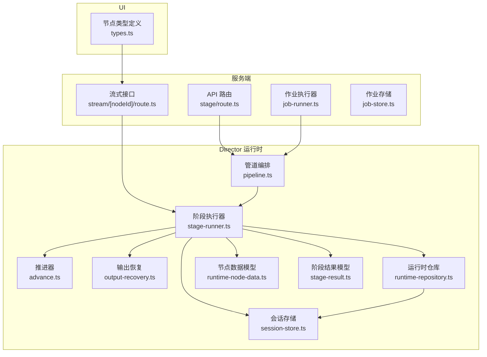

图表来源 
- [src/app/api/director/stage/route.ts](file://src/app/api/director/stage/route.ts)
- [src/app/api/director/stream/[nodeId]/route.ts](file://src/app/api/director/stream/[nodeId]/route.ts)
- [server/src/server/job-runner.ts](file://server/src/server/job-runner.ts)
- [server/src/server/job-store.ts](file://server/src/server/job-store.ts)
- [src/features/director/pipeline.ts](file://src/features/director/pipeline.ts)
- [src/features/director/stage-runner.ts](file://src/features/director/stage-runner.ts)
- [src/features/director/advance.ts](file://src/features/director/advance.ts)
- [src/features/director/output-recovery.ts](file://src/features/director/output-recovery.ts)
- [src/features/director/runtime-repository.ts](file://src/features/director/runtime-repository.ts)
- [src/features/director/session-store.ts](file://src/features/director/session-store.ts)
- [src/features/director/runtime-node-data.ts](file://src/features/director/runtime-node-data.ts)
- [src/features/director/stage-result.ts](file://src/features/director/stage-result.ts)
- [src/components/ui/node/types.ts](file://src/components/ui/node/types.ts)

章节来源
- [src/features/director/runtime-node-data.ts](file://src/features/director/runtime-node-data.ts)
- [src/features/director/stage-runner.ts](file://src/features/director/stage-runner.ts)
- [src/features/director/advance.ts](file://src/features/director/advance.ts)
- [src/features/director/output-recovery.ts](file://src/features/director/output-recovery.ts)
- [src/features/director/stage-result.ts](file://src/features/director/stage-result.ts)
- [src/features/director/runtime-repository.ts](file://src/features/director/runtime-repository.ts)
- [src/features/director/session-store.ts](file://src/features/director/session-store.ts)
- [src/features/director/pipeline.ts](file://src/features/director/pipeline.ts)
- [src/app/api/director/stream/[nodeId]/route.ts](file://src/app/api/director/stream/[nodeId]/route.ts)
- [src/app/api/director/stage/route.ts](file://src/app/api/director/stage/route.ts)
- [server/src/server/job-runner.ts](file://server/src/server/job-runner.ts)
- [server/src/server/job-store.ts](file://server/src/server/job-store.ts)
- [src/lib/workflow/index.ts](file://src/lib/workflow/index.ts)
- [src/components/ui/node/types.ts](file://src/components/ui/node/types.ts)

## 核心组件
- 节点数据模型（runtime-node-data.ts）：定义节点在运行时的数据结构与状态字段，作为状态机的载体。
- 阶段执行器（stage-runner.ts）：负责单个阶段的启动、执行、进度上报、错误捕获与结果提交，是生命周期管理的核心。
- 推进器（advance.ts）：根据阶段结果决定下一步节点或阶段，实现状态推进与分支决策。
- 输出恢复（output-recovery.ts）：在失败或中断后尝试从持久化中恢复中间输出，保障幂等与可恢复性。
- 运行时仓库（runtime-repository.ts）：提供节点状态、阶段结果、执行上下文的读写能力，保证一致性。
- 会话存储（session-store.ts）：维护会话级上下文与跨阶段共享数据。
- 管道编排（pipeline.ts）：将多个阶段组织为可执行的流水线，协调阶段顺序与依赖。
- 作业执行器（job-runner.ts）：Worker 侧的作业调度与执行，驱动阶段执行器。
- 作业存储（job-store.ts）：作业元数据与状态的持久化。
- 流式接口（stream/[nodeId]/route.ts）：向客户端推送节点执行事件与日志。
- 阶段控制接口（stage/route.ts）：对外暴露暂停、恢复、终止等操作。
- UI 节点类型（types.ts）：前端展示节点状态与交互所需的数据契约。

章节来源
- [src/features/director/runtime-node-data.ts](file://src/features/director/runtime-node-data.ts)
- [src/features/director/stage-runner.ts](file://src/features/director/stage-runner.ts)
- [src/features/director/advance.ts](file://src/features/director/advance.ts)
- [src/features/director/output-recovery.ts](file://src/features/director/output-recovery.ts)
- [src/features/director/runtime-repository.ts](file://src/features/director/runtime-repository.ts)
- [src/features/director/session-store.ts](file://src/features/director/session-store.ts)
- [src/features/director/pipeline.ts](file://src/features/director/pipeline.ts)
- [server/src/server/job-runner.ts](file://server/src/server/job-runner.ts)
- [server/src/server/job-store.ts](file://server/src/server/job-store.ts)
- [src/app/api/director/stream/[nodeId]/route.ts](file://src/app/api/director/stream/[nodeId]/route.ts)
- [src/app/api/director/stage/route.ts](file://src/app/api/director/stage/route.ts)
- [src/components/ui/node/types.ts](file://src/components/ui/node/types.ts)

## 架构总览
节点生命周期由“API/Worker”触发，“Pipeline”编排，“StageRunner”执行，“Advance”推进，“OutputRecovery”恢复，“Repository/Session”持久化，并通过“Stream”接口实时反馈给前端。

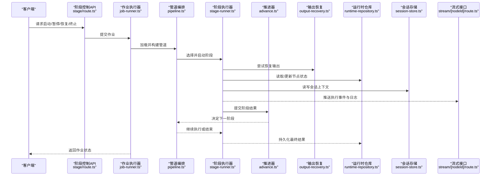

图表来源 
- [src/app/api/director/stage/route.ts](file://src/app/api/director/stage/route.ts)
- [server/src/server/job-runner.ts](file://server/src/server/job-runner.ts)
- [src/features/director/pipeline.ts](file://src/features/director/pipeline.ts)
- [src/features/director/stage-runner.ts](file://src/features/director/stage-runner.ts)
- [src/features/director/advance.ts](file://src/features/director/advance.ts)
- [src/features/director/output-recovery.ts](file://src/features/director/output-recovery.ts)
- [src/features/director/runtime-repository.ts](file://src/features/director/runtime-repository.ts)
- [src/features/director/session-store.ts](file://src/features/director/session-store.ts)
- [src/app/api/director/stream/[nodeId]/route.ts](file://src/app/api/director/stream/[nodeId]/route.ts)

## 详细组件分析

### 节点状态机与生命周期
- 状态集合：包括未初始化、已创建、初始化中、运行中、暂停、恢复中、完成、失败、销毁等。
- 转换规则：
  - 创建→初始化：分配资源、校验输入、准备上下文。
  - 初始化→运行：进入阶段执行循环。
  - 运行→暂停：响应外部暂停指令，保存中间状态。
  - 暂停→恢复：恢复上下文，继续执行。
  - 运行→失败：捕获异常，记录错误，尝试恢复。
  - 失败→恢复：基于输出恢复策略重建部分状态。
  - 运行→完成：所有阶段成功，提交最终结果。
  - 任意→销毁：清理资源，释放锁与临时文件。

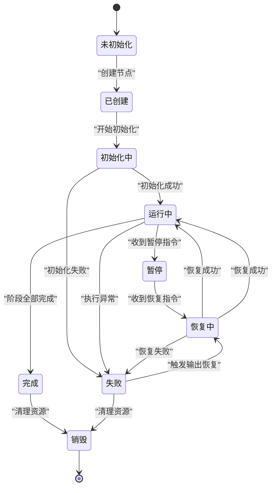

图表来源 
- [src/features/director/runtime-node-data.ts](file://src/features/director/runtime-node-data.ts)
- [src/features/director/stage-runner.ts](file://src/features/director/stage-runner.ts)
- [src/features/director/advance.ts](file://src/features/director/advance.ts)
- [src/features/director/output-recovery.ts](file://src/features/director/output-recovery.ts)

章节来源
- [src/features/director/runtime-node-data.ts](file://src/features/director/runtime-node-data.ts)
- [src/features/director/stage-runner.ts](file://src/features/director/stage-runner.ts)
- [src/features/director/advance.ts](file://src/features/director/advance.ts)
- [src/features/director/output-recovery.ts](file://src/features/director/output-recovery.ts)

### 阶段执行器（StageRunner）
- 职责：
  - 启动阶段：加载配置、初始化上下文、建立资源句柄。
  - 执行循环：按批次处理任务，持续上报进度与日志。
  - 错误处理：捕获异常，分类处理（可重试、不可重试），触发恢复流程。
  - 结果提交：将阶段结果写入仓库与会话，供推进器决策。
  - 生命周期钩子：支持暂停/恢复钩子，确保状态一致。
- 关键行为：
  - 进度上报通过流式接口推送至客户端。
  - 中间状态定期持久化，避免长时任务丢失。
  - 与推进器协作，依据结果决定下一节点。

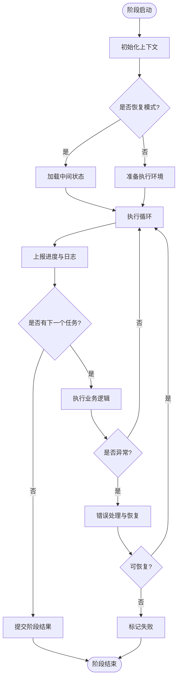

图表来源 
- [src/features/director/stage-runner.ts](file://src/features/director/stage-runner.ts)
- [src/features/director/output-recovery.ts](file://src/features/director/output-recovery.ts)
- [src/app/api/director/stream/[nodeId]/route.ts](file://src/app/api/director/stream/[nodeId]/route.ts)

章节来源
- [src/features/director/stage-runner.ts](file://src/features/director/stage-runner.ts)
- [src/features/director/output-recovery.ts](file://src/features/director/output-recovery.ts)
- [src/app/api/director/stream/[nodeId]/route.ts](file://src/app/api/director/stream/[nodeId]/route.ts)

### 推进器（Advance）
- 职责：根据阶段结果计算下一步节点或阶段，处理分支与合并。
- 决策逻辑：
  - 成功路径：直接推进到下一个阶段。
  - 失败路径：评估是否可重试或回退。
  - 条件分支：依据上游输出动态选择下游节点。
- 与状态机集成：更新节点状态，触发持久化。

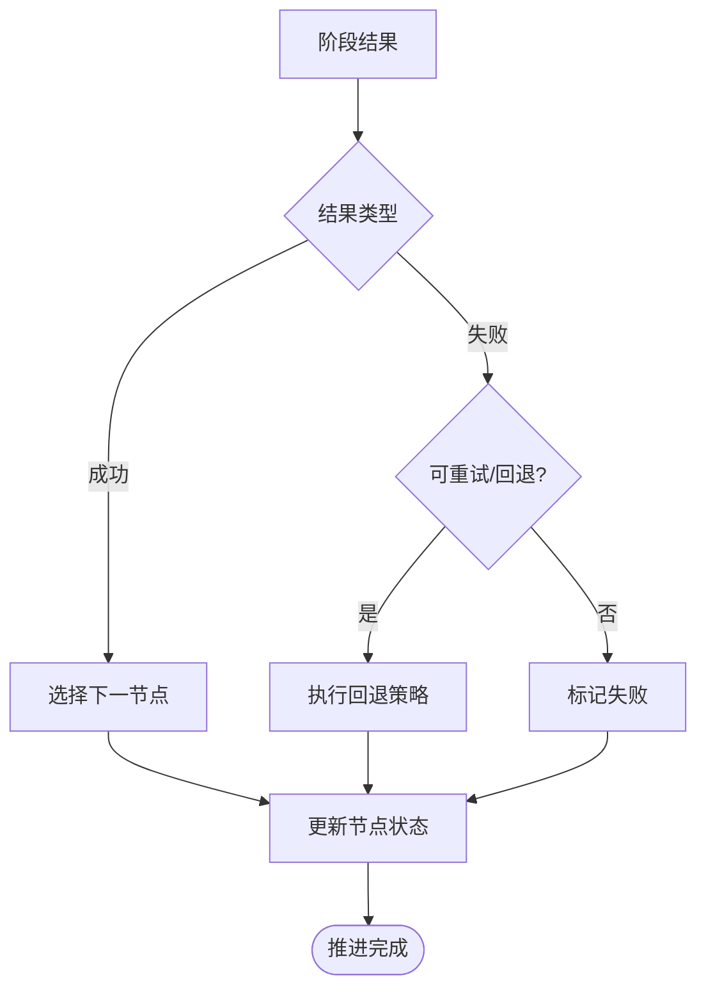

图表来源 
- [src/features/director/advance.ts](file://src/features/director/advance.ts)
- [src/features/director/runtime-node-data.ts](file://src/features/director/runtime-node-data.ts)

章节来源
- [src/features/director/advance.ts](file://src/features/director/advance.ts)
- [src/features/director/runtime-node-data.ts](file://src/features/director/runtime-node-data.ts)

### 输出恢复（OutputRecovery）
- 目标：在失败或中断后尽可能恢复中间输出，减少重复计算。
- 策略：
  - 增量恢复：仅恢复缺失或部分损坏的输出。
  - 幂等执行：同一输入产生相同输出，允许安全重试。
  - 版本兼容：输出格式变更时进行迁移或降级。
- 与仓库协作：读取/写入恢复点，确保一致性。

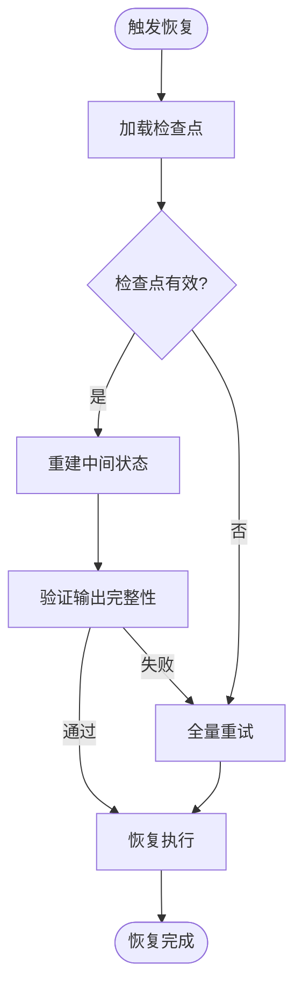

图表来源 
- [src/features/director/output-recovery.ts](file://src/features/director/output-recovery.ts)
- [src/features/director/runtime-repository.ts](file://src/features/director/runtime-repository.ts)

章节来源
- [src/features/director/output-recovery.ts](file://src/features/director/output-recovery.ts)
- [src/features/director/runtime-repository.ts](file://src/features/director/runtime-repository.ts)

### 运行时仓库与会话存储
- 运行时仓库（runtime-repository.ts）：
  - 提供节点状态、阶段结果、执行上下文的原子读写。
  - 支持事务与并发控制，避免竞态条件。
- 会话存储（session-store.ts）：
  - 维护会话级数据，如用户偏好、临时变量。
  - 支持过期与清理策略。

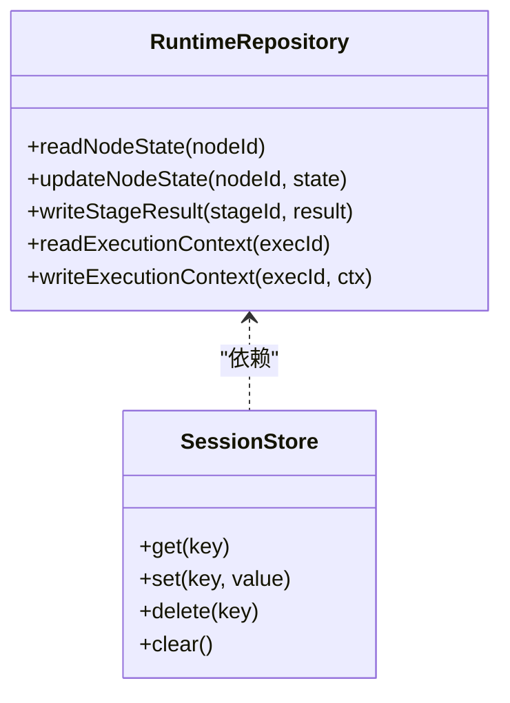

图表来源 
- [src/features/director/runtime-repository.ts](file://src/features/director/runtime-repository.ts)
- [src/features/director/session-store.ts](file://src/features/director/session-store.ts)

章节来源
- [src/features/director/runtime-repository.ts](file://src/features/director/runtime-repository.ts)
- [src/features/director/session-store.ts](file://src/features/director/session-store.ts)

### 管道编排（Pipeline）
- 职责：将多个阶段组织为有向无环图，管理依赖与顺序。
- 特性：
  - 动态构建：根据输入与配置生成执行计划。
  - 并行执行：支持独立阶段的并发。
  - 失败隔离：单阶段失败不影响其他分支。

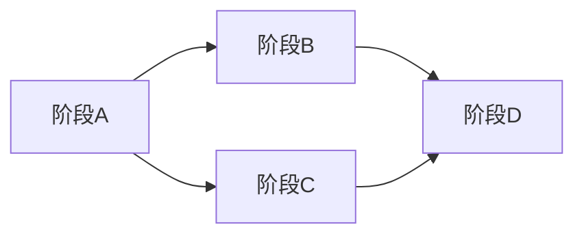

图表来源 
- [src/features/director/pipeline.ts](file://src/features/director/pipeline.ts)

章节来源
- [src/features/director/pipeline.ts](file://src/features/director/pipeline.ts)

### 作业执行器（JobRunner）与作业存储（JobStore）
- JobRunner：
  - 接收作业请求，分配执行资源。
  - 驱动 StageRunner 执行阶段。
  - 处理作业级超时与取消。
- JobStore：
  - 持久化作业元数据与状态。
  - 支持查询与审计。

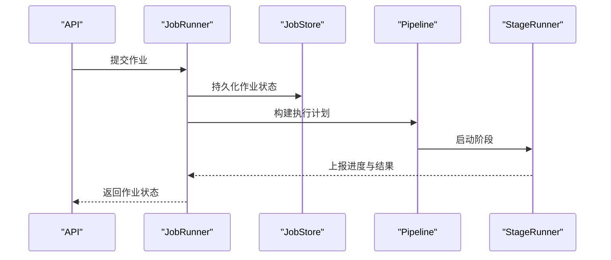

图表来源 
- [server/src/server/job-runner.ts](file://server/src/server/job-runner.ts)
- [server/src/server/job-store.ts](file://server/src/server/job-store.ts)
- [src/features/director/pipeline.ts](file://src/features/director/pipeline.ts)
- [src/features/director/stage-runner.ts](file://src/features/director/stage-runner.ts)

章节来源
- [server/src/server/job-runner.ts](file://server/src/server/job-runner.ts)
- [server/src/server/job-store.ts](file://server/src/server/job-store.ts)
- [src/features/director/pipeline.ts](file://src/features/director/pipeline.ts)
- [src/features/director/stage-runner.ts](file://src/features/director/stage-runner.ts)

### 流式接口与阶段控制
- 流式接口（stream/[nodeId]/route.ts）：
  - 推送节点执行事件、进度、日志到客户端。
  - 支持断线重连与事件去重。
- 阶段控制（stage/route.ts）：
  - 暴露暂停、恢复、终止等控制命令。
  - 与 StageRunner 的生命周期钩子对接。

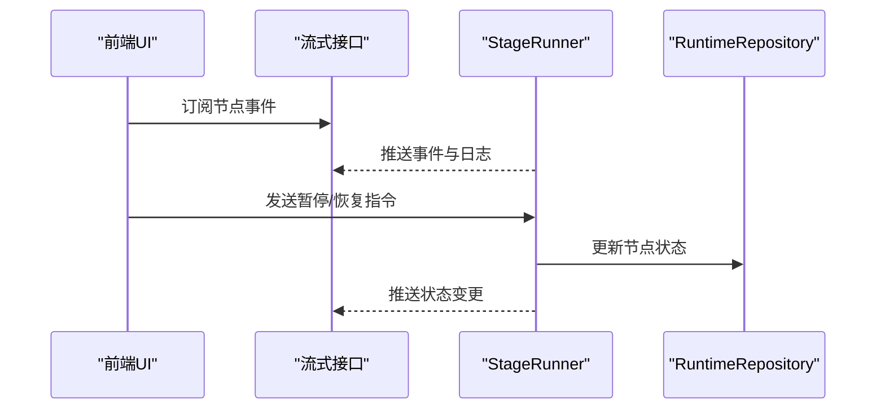

图表来源 
- [src/app/api/director/stream/[nodeId]/route.ts](file://src/app/api/director/stream/[nodeId]/route.ts)
- [src/app/api/director/stage/route.ts](file://src/app/api/director/stage/route.ts)
- [src/features/director/stage-runner.ts](file://src/features/director/stage-runner.ts)
- [src/features/director/runtime-repository.ts](file://src/features/director/runtime-repository.ts)

章节来源
- [src/app/api/director/stream/[nodeId]/route.ts](file://src/app/api/director/stream/[nodeId]/route.ts)
- [src/app/api/director/stage/route.ts](file://src/app/api/director/stage/route.ts)
- [src/features/director/stage-runner.ts](file://src/features/director/stage-runner.ts)
- [src/features/director/runtime-repository.ts](file://src/features/director/runtime-repository.ts)

### UI 节点类型与状态映射
- types.ts 定义了前端展示的节点状态与交互契约，与后端状态机保持一致。
- 建议在前端使用统一的状态映射表，确保显示与行为正确。

章节来源
- [src/components/ui/node/types.ts](file://src/components/ui/node/types.ts)

## 依赖关系分析
- 低耦合高内聚：StageRunner 依赖 Repository、Session、OutputRecovery，但不直接依赖 API 或 UI。
- 明确边界：Pipeline 仅关注阶段编排，Advance 仅关注状态推进。
- 外部依赖：JobRunner 与 JobStore 提供作业级抽象，屏蔽底层执行细节。

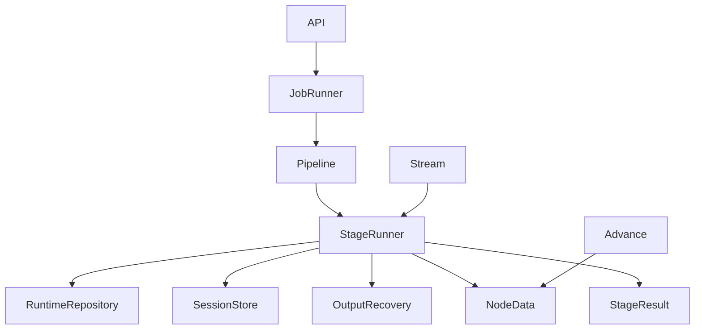

图表来源 
- [src/features/director/stage-runner.ts](file://src/features/director/stage-runner.ts)
- [src/features/director/runtime-repository.ts](file://src/features/director/runtime-repository.ts)
- [src/features/director/session-store.ts](file://src/features/director/session-store.ts)
- [src/features/director/output-recovery.ts](file://src/features/director/output-recovery.ts)
- [src/features/director/runtime-node-data.ts](file://src/features/director/runtime-node-data.ts)
- [src/features/director/stage-result.ts](file://src/features/director/stage-result.ts)
- [src/features/director/pipeline.ts](file://src/features/director/pipeline.ts)
- [src/features/director/advance.ts](file://src/features/director/advance.ts)
- [server/src/server/job-runner.ts](file://server/src/server/job-runner.ts)
- [src/app/api/director/stage/route.ts](file://src/app/api/director/stage/route.ts)
- [src/app/api/director/stream/[nodeId]/route.ts](file://src/app/api/director/stream/[nodeId]/route.ts)

章节来源
- [src/features/director/stage-runner.ts](file://src/features/director/stage-runner.ts)
- [src/features/director/runtime-repository.ts](file://src/features/director/runtime-repository.ts)
- [src/features/director/session-store.ts](file://src/features/director/session-store.ts)
- [src/features/director/output-recovery.ts](file://src/features/director/output-recovery.ts)
- [src/features/director/runtime-node-data.ts](file://src/features/director/runtime-node-data.ts)
- [src/features/director/stage-result.ts](file://src/features/director/stage-result.ts)
- [src/features/director/pipeline.ts](file://src/features/director/pipeline.ts)
- [src/features/director/advance.ts](file://src/features/director/advance.ts)
- [server/src/server/job-runner.ts](file://server/src/server/job-runner.ts)
- [src/app/api/director/stage/route.ts](file://src/app/api/director/stage/route.ts)
- [src/app/api/director/stream/[nodeId]/route.ts](file://src/app/api/director/stream/[nodeId]/route.ts)

## 性能考量
- 批处理与分页：StageRunner 应分批处理任务，避免内存峰值。
- 异步与并发：独立阶段可并发执行，但需限制并发度防止资源争用。
- 缓存与复用：对可重用资源（连接、模型实例）进行池化管理。
- 持久化频率：平衡中间状态持久化频率与 I/O 开销。
- 背压与限流：当上游输入过快时，采用背压机制保护系统。

[本节为通用指导，不直接分析具体文件]

## 故障排查指南
- 常见问题定位：
  - 节点卡在初始化：检查输入校验与资源分配。
  - 执行中途失败：查看错误分类与恢复策略是否生效。
  - 状态不同步：确认仓库写操作的事务性与幂等性。
- 监控与日志：
  - 通过流式接口订阅事件，观察进度与日志。
  - 启用详细日志级别，记录关键路径与异常堆栈。
- 健康检查：
  - 暴露健康检查端点，检测依赖服务可用性。
  - 定期检查作业队列长度与执行延迟。
- 诊断工具：
  - 使用导出功能获取执行快照，便于离线分析。
  - 结合时间戳与追踪 ID，串联多阶段调用链。

章节来源
- [src/app/api/director/stream/[nodeId]/route.ts](file://src/app/api/director/stream/[nodeId]/route.ts)
- [src/features/director/stage-runner.ts](file://src/features/director/stage-runner.ts)
- [src/features/director/runtime-repository.ts](file://src/features/director/runtime-repository.ts)

## 结论
PurpleInk 的节点生命周期管理以清晰的状态机为核心，通过 StageRunner、Advance、OutputRecovery、Repository、Session 等组件协同，实现了健壮的执行流程与可靠的恢复机制。配合流式接口与作业执行器，提供了良好的可观测性与可运维性。建议在后续迭代中进一步完善监控指标、自动化恢复策略与性能调优工具，以提升整体稳定性与效率。

[本节为总结，不直接分析具体文件]

## 附录
- 术语表：
  - 节点：执行单元，对应一个或多个阶段。
  - 阶段：节点内的最小执行步骤。
  - 管道：由多个阶段组成的执行流程。
  - 作业：一次完整的执行请求。
- 最佳实践：
  - 保持阶段幂等，便于重试与恢复。
  - 合理划分阶段粒度，平衡细粒度与开销。
  - 使用统一的错误码与消息格式，便于前端展示与后端处理。

[本节为补充信息，不直接分析具体文件]