# 节点管理系统

<cite>
**本文引用的文件**   
- [src/features/canvas/types.ts](file://src/features/canvas/types.ts)
- [src/features/canvas/layout.ts](file://src/features/canvas/layout.ts)
- [src/features/canvas/queries.ts](file://src/features/canvas/queries.ts)
- [src/features/canvas/actions.ts](file://src/features/canvas/actions.ts)
- [src/features/canvas/status.ts](file://src/features/canvas/status.ts)
- [src/features/canvas/fan-out.ts](file://src/features/canvas/fan-out.ts)
- [src/features/canvas/export-settings.ts](file://src/features/canvas/export-settings.ts)
- [src/components/ui/node/types.ts](file://src/components/ui/node/types.ts)
- [src/components/ui/node/stage-node.tsx](file://src/components/ui/node/stage-node.tsx)
- [src/components/ui/node/audio-node.tsx](file://src/components/ui/node/audio-node.tsx)
- [src/components/ui/node/export-node.tsx](file://src/components/ui/node/export-node.tsx)
- [src/app/products/(app)/canvas/[projectId]/page.tsx](file://src/app/products/(app)/canvas/[projectId]/page.tsx)
- [src/app/products/(app)/canvas/[projectId]/flow-elements.tsx](file://src/app/products/(app)/canvas/[projectId]/flow-elements.tsx)
- [src/app/products/(app)/canvas/[projectId]/live-status.ts](file://src/app/products/(app)/canvas/[projectId]/live-status.ts)
- [src/app/products/(app)/canvas/[projectId]/pipeline-feedback.ts](file://src/app/products/(app)/canvas/[projectId]/pipeline-feedback.ts)
- [src/app/api/director/pipeline/route.ts](file://src/app/api/director/pipeline/route.ts)
- [src/app/api/director/stage/route.ts](file://src/app/api/director/stage/route.ts)
- [src/app/api/director/stream/[nodeId]/route.ts](file://src/app/api/director/stream/[nodeId]/route.ts)
- [server/src/compose/run-pipeline.ts](file://server/src/compose/run-pipeline.ts)
- [server/src/server/job-runner.ts](file://server/src/server/job-runner.ts)
</cite>

## 目录
1. [简介](#简介)
2. [项目结构](#项目结构)
3. [核心组件](#核心组件)
4. [架构总览](#架构总览)
5. [详细组件分析](#详细组件分析)
6. [依赖关系分析](#依赖关系分析)
7. [性能考量](#性能考量)
8. [故障排查指南](#故障排查指南)
9. [结论](#结论)
10. [附录](#附录)

## 简介
本文件为 PurpleInk 节点管理系统的权威技术文档，聚焦于节点的创建、配置、连接与生命周期管理；深入解析节点布局算法、自动排列与手动调整能力；说明节点间依赖关系、数据流向与执行顺序；覆盖节点类型系统、属性验证与错误处理机制；阐述状态管理、撤销重做与历史记录策略；并提供自定义节点开发与节点库构建的实践指导。读者无需深厚前端或后端背景即可理解整体设计与实现要点。

## 项目结构
PurpleInk 的节点系统由“前端画布与交互”、“API 编排与流式反馈”、“服务端流水线执行”三部分组成：
- 前端画布层：定义节点类型、布局算法、查询与动作、状态机与导出设置，并通过 UI 组件渲染节点。
- API 编排层：提供管道与阶段控制接口，以及按节点维度的流式日志输出。
- 服务端执行层：负责调度任务、运行流水线、持久化结果与中间产物。

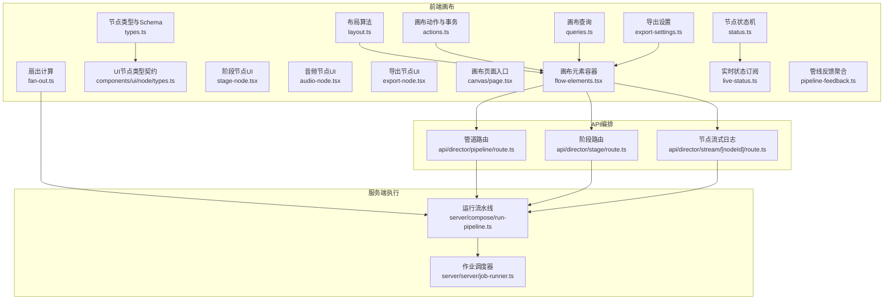

**图表来源** 
- [src/features/canvas/types.ts](file://src/features/canvas/types.ts)
- [src/features/canvas/layout.ts](file://src/features/canvas/layout.ts)
- [src/features/canvas/actions.ts](file://src/features/canvas/actions.ts)
- [src/features/canvas/queries.ts](file://src/features/canvas/queries.ts)
- [src/features/canvas/status.ts](file://src/features/canvas/status.ts)
- [src/features/canvas/fan-out.ts](file://src/features/canvas/fan-out.ts)
- [src/features/canvas/export-settings.ts](file://src/features/canvas/export-settings.ts)
- [src/components/ui/node/types.ts](file://src/components/ui/node/types.ts)
- [src/components/ui/node/stage-node.tsx](file://src/components/ui/node/stage-node.tsx)
- [src/components/ui/node/audio-node.tsx](file://src/components/ui/node/audio-node.tsx)
- [src/components/ui/node/export-node.tsx](file://src/components/ui/node/export-node.tsx)
- [src/app/products/(app)/canvas/[projectId]/page.tsx](file://src/app/products/(app)/canvas/[projectId]/page.tsx)
- [src/app/products/(app)/canvas/[projectId]/flow-elements.tsx](file://src/app/products/(app)/canvas/[projectId]/flow-elements.tsx)
- [src/app/products/(app)/canvas/[projectId]/live-status.ts](file://src/app/products/(app)/canvas/[projectId]/live-status.ts)
- [src/app/products/(app)/canvas/[projectId]/pipeline-feedback.ts](file://src/app/products/(app)/canvas/[projectId]/pipeline-feedback.ts)
- [src/app/api/director/pipeline/route.ts](file://src/app/api/director/pipeline/route.ts)
- [src/app/api/director/stage/route.ts](file://src/app/api/director/stage/route.ts)
- [src/app/api/director/stream/[nodeId]/route.ts](file://src/app/api/director/stream/[nodeId]/route.ts)
- [server/src/compose/run-pipeline.ts](file://server/src/compose/run-pipeline.ts)
- [server/src/server/job-runner.ts](file://server/src/server/job-runner.ts)

**章节来源**
- [src/features/canvas/types.ts](file://src/features/canvas/types.ts)
- [src/features/canvas/layout.ts](file://src/features/canvas/layout.ts)
- [src/features/canvas/actions.ts](file://src/features/canvas/actions.ts)
- [src/features/canvas/queries.ts](file://src/features/canvas/queries.ts)
- [src/features/canvas/status.ts](file://src/features/canvas/status.ts)
- [src/features/canvas/fan-out.ts](file://src/features/canvas/fan-out.ts)
- [src/features/canvas/export-settings.ts](file://src/features/canvas/export-settings.ts)
- [src/components/ui/node/types.ts](file://src/components/ui/node/types.ts)
- [src/components/ui/node/stage-node.tsx](file://src/components/ui/node/stage-node.tsx)
- [src/components/ui/node/audio-node.tsx](file://src/components/ui/node/audio-node.tsx)
- [src/components/ui/node/export-node.tsx](file://src/components/ui/node/export-node.tsx)
- [src/app/products/(app)/canvas/[projectId]/page.tsx](file://src/app/products/(app)/canvas/[projectId]/page.tsx)
- [src/app/products/(app)/canvas/[projectId]/flow-elements.tsx](file://src/app/products/(app)/canvas/[projectId]/flow-elements.tsx)
- [src/app/products/(app)/canvas/[projectId]/live-status.ts](file://src/app/products/(app)/canvas/[projectId]/live-status.ts)
- [src/app/products/(app)/canvas/[projectId]/pipeline-feedback.ts](file://src/app/products/(app)/canvas/[projectId]/pipeline-feedback.ts)
- [src/app/api/director/pipeline/route.ts](file://src/app/api/director/pipeline/route.ts)
- [src/app/api/director/stage/route.ts](file://src/app/api/director/stage/route.ts)
- [src/app/api/director/stream/[nodeId]/route.ts](file://src/app/api/director/stream/[nodeId]/route.ts)
- [server/src/compose/run-pipeline.ts](file://server/src/compose/run-pipeline.ts)
- [server/src/server/job-runner.ts](file://server/src/server/job-runner.ts)

## 核心组件
- 节点类型系统与 Schema：集中定义节点类型、输入输出端口、属性校验规则与默认值，确保前后端一致的数据契约。
- 布局算法：支持自动排列（如分层、网格、树形）与手动拖拽调整，维护节点坐标与连线拓扑一致性。
- 画布动作与事务：封装增删改查、批量操作、撤销重做与历史快照，保证画布状态可回滚。
- 查询与视图：提供高效查询接口，支撑筛选、搜索与可视化渲染。
- 状态机：定义节点运行态（空闲、排队、运行中、成功、失败、取消等），驱动 UI 与事件流转。
- 扇出计算：根据依赖图计算并行度与执行批次，优化吞吐与资源占用。
- 导出设置：将画布转换为可执行的导出描述，供服务端流水线消费。
- UI 节点组件：阶段节点、音频节点、导出节点等，承载属性编辑与运行时反馈。
- 画布页面与元素容器：集成上述能力，提供用户交互入口与渲染容器。
- API 编排：管道与阶段的启动、暂停、重试、终止，以及按节点维度的流式日志。
- 服务端执行：任务调度、流水线编排、产物持久化与错误恢复。

**章节来源**
- [src/features/canvas/types.ts](file://src/features/canvas/types.ts)
- [src/features/canvas/layout.ts](file://src/features/canvas/layout.ts)
- [src/features/canvas/actions.ts](file://src/features/canvas/actions.ts)
- [src/features/canvas/queries.ts](file://src/features/canvas/queries.ts)
- [src/features/canvas/status.ts](file://src/features/canvas/status.ts)
- [src/features/canvas/fan-out.ts](file://src/features/canvas/fan-out.ts)
- [src/features/canvas/export-settings.ts](file://src/features/canvas/export-settings.ts)
- [src/components/ui/node/types.ts](file://src/components/ui/node/types.ts)
- [src/components/ui/node/stage-node.tsx](file://src/components/ui/node/stage-node.tsx)
- [src/components/ui/node/audio-node.tsx](file://src/components/ui/node/audio-node.tsx)
- [src/components/ui/node/export-node.tsx](file://src/components/ui/node/export-node.tsx)
- [src/app/products/(app)/canvas/[projectId]/page.tsx](file://src/app/products/(app)/canvas/[projectId]/page.tsx)
- [src/app/products/(app)/canvas/[projectId]/flow-elements.tsx](file://src/app/products/(app)/canvas/[projectId]/flow-elements.tsx)
- [src/app/api/director/pipeline/route.ts](file://src/app/api/director/pipeline/route.ts)
- [src/app/api/director/stage/route.ts](file://src/app/api/director/stage/route.ts)
- [src/app/api/director/stream/[nodeId]/route.ts](file://src/app/api/director/stream/[nodeId]/route.ts)
- [server/src/compose/run-pipeline.ts](file://server/src/compose/run-pipeline.ts)
- [server/src/server/job-runner.ts](file://server/src/server/job-runner.ts)

## 架构总览
下图展示了从用户操作到服务端执行的端到端流程，包括画布状态更新、依赖解析、并行批处理与流式日志返回。

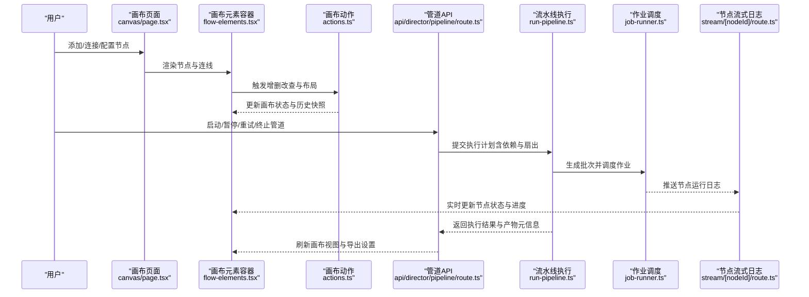

**图表来源** 
- [src/app/products/(app)/canvas/[projectId]/page.tsx](file://src/app/products/(app)/canvas/[projectId]/page.tsx)
- [src/app/products/(app)/canvas/[projectId]/flow-elements.tsx](file://src/app/products/(app)/canvas/[projectId]/flow-elements.tsx)
- [src/features/canvas/actions.ts](file://src/features/canvas/actions.ts)
- [src/app/api/director/pipeline/route.ts](file://src/app/api/director/pipeline/route.ts)
- [server/src/compose/run-pipeline.ts](file://server/src/compose/run-pipeline.ts)
- [server/src/server/job-runner.ts](file://server/src/server/job-runner.ts)
- [src/app/api/director/stream/[nodeId]/route.ts](file://src/app/api/director/stream/[nodeId]/route.ts)

## 详细组件分析

### 节点类型系统与属性验证
- 类型契约：统一声明节点类型、端口名称、数据类型、必填项与默认值，确保 UI 编辑器与服务端执行器的一致性。
- 属性验证：在创建与更新时进行强类型校验，拦截非法配置，避免运行时错误。
- 扩展点：通过注册表机制新增节点类型，复用通用输入输出与校验逻辑。

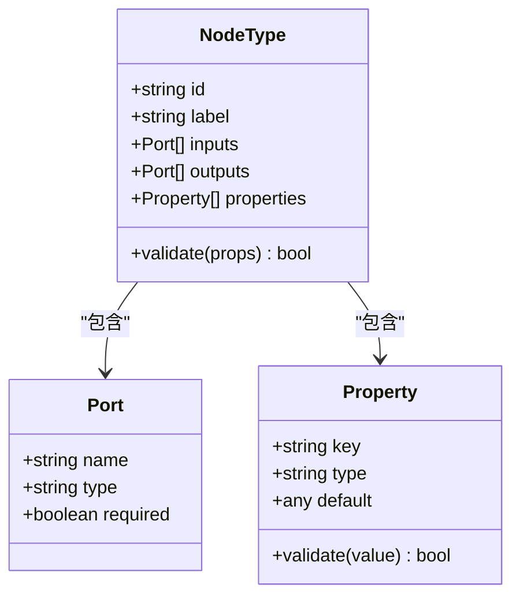

**图表来源** 
- [src/features/canvas/types.ts](file://src/features/canvas/types.ts)
- [src/components/ui/node/types.ts](file://src/components/ui/node/types.ts)

**章节来源**
- [src/features/canvas/types.ts](file://src/features/canvas/types.ts)
- [src/components/ui/node/types.ts](file://src/components/ui/node/types.ts)

### 布局算法与自动排列
- 自动排列：基于依赖拓扑进行分层或树形布局，减少连线交叉，提升可读性。
- 手动调整：支持拖拽节点、吸附对齐、间距约束，保持布局稳定性。
- 一致性：布局变更同步至画布状态，参与撤销重做与历史快照。

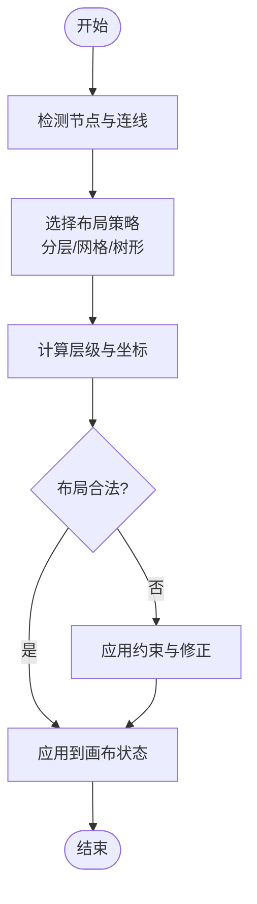

**图表来源** 
- [src/features/canvas/layout.ts](file://src/features/canvas/layout.ts)
- [src/features/canvas/actions.ts](file://src/features/canvas/actions.ts)

**章节来源**
- [src/features/canvas/layout.ts](file://src/features/canvas/layout.ts)
- [src/features/canvas/actions.ts](file://src/features/canvas/actions.ts)

### 画布动作与撤销重做
- 动作封装：所有画布变更以动作形式记录，支持批量与原子提交。
- 历史快照：每次提交生成不可变快照，便于撤销与重做。
- 冲突解决：并发编辑场景下采用合并策略与版本戳，避免覆盖丢失。

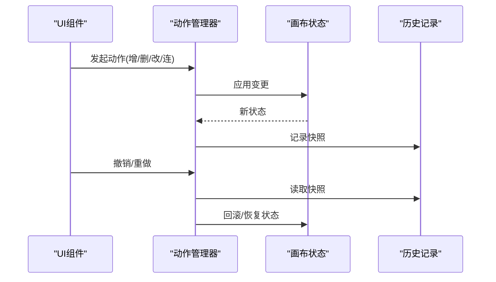

**图表来源** 
- [src/features/canvas/actions.ts](file://src/features/canvas/actions.ts)

**章节来源**
- [src/features/canvas/actions.ts](file://src/features/canvas/actions.ts)

### 节点状态机与生命周期
- 状态定义：空闲、排队、运行中、成功、失败、取消等。
- 事件驱动：外部事件（用户操作、服务回调）驱动状态迁移。
- 可视化反馈：UI 实时反映状态变化，支持进度与错误提示。

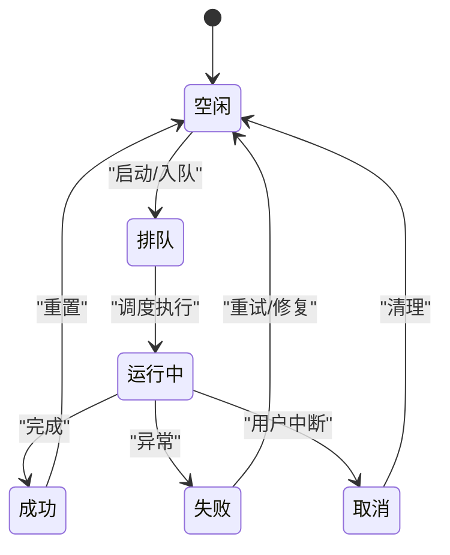

**图表来源** 
- [src/features/canvas/status.ts](file://src/features/canvas/status.ts)
- [src/app/products/(app)/canvas/[projectId]/live-status.ts](file://src/app/products/(app)/canvas/[projectId]/live-status.ts)

**章节来源**
- [src/features/canvas/status.ts](file://src/features/canvas/status.ts)
- [src/app/products/(app)/canvas/[projectId]/live-status.ts](file://src/app/products/(app)/canvas/[projectId]/live-status.ts)

### 依赖关系、数据流向与执行顺序
- 依赖解析：基于输入输出端口建立有向无环图（DAG）。
- 扇出计算：统计每个节点的下游数量，决定并行批次与资源分配。
- 执行顺序：按拓扑排序生成执行批次，保证上游先于下游完成。

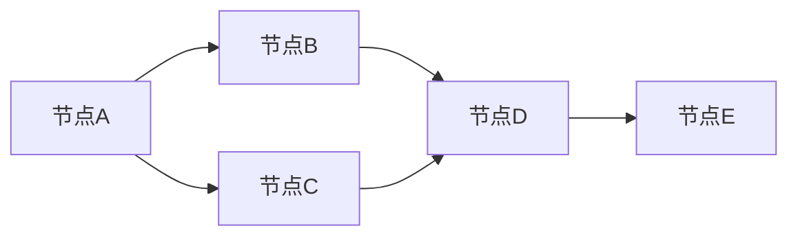

**图表来源** 
- [src/features/canvas/fan-out.ts](file://src/features/canvas/fan-out.ts)
- [server/src/compose/run-pipeline.ts](file://server/src/compose/run-pipeline.ts)

**章节来源**
- [src/features/canvas/fan-out.ts](file://src/features/canvas/fan-out.ts)
- [server/src/compose/run-pipeline.ts](file://server/src/compose/run-pipeline.ts)

### 导出设置与可执行描述
- 导出模型：将画布转换为结构化描述，包含节点、连线、属性与执行参数。
- 校验与优化：检查连通性与循环依赖，预计算扇出与批次。
- 传输协议：通过 API 传递给服务端执行器，作为运行蓝图。

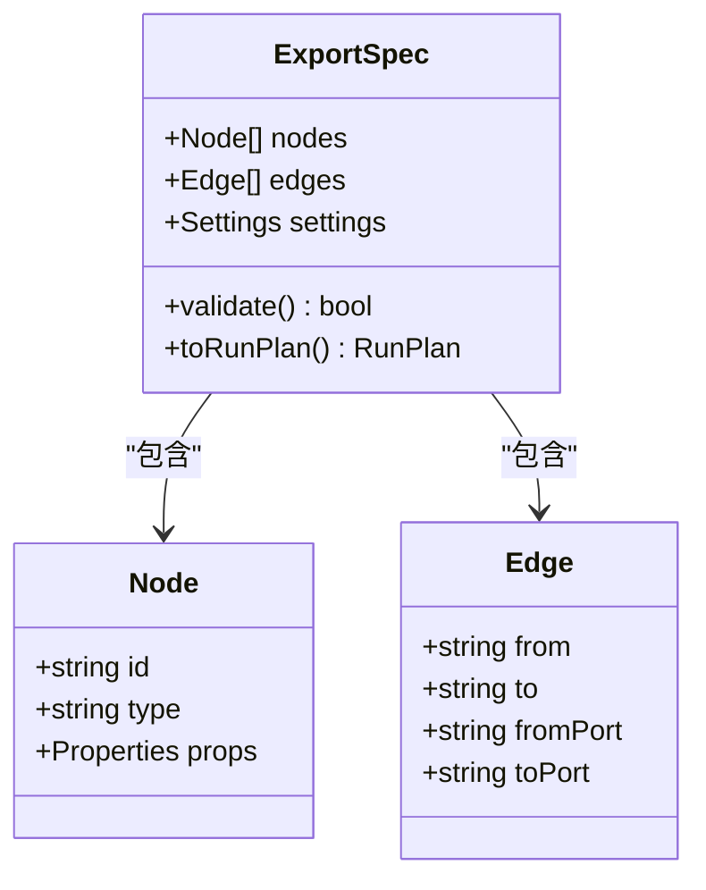

**图表来源** 
- [src/features/canvas/export-settings.ts](file://src/features/canvas/export-settings.ts)

**章节来源**
- [src/features/canvas/export-settings.ts](file://src/features/canvas/export-settings.ts)

### UI 节点组件与交互
- 阶段节点：展示阶段信息、进度与错误详情，支持参数编辑。
- 音频节点：音频相关属性与播放控制，集成媒体元数据。
- 导出节点：导出配置与预览，触发下载或远程存储。

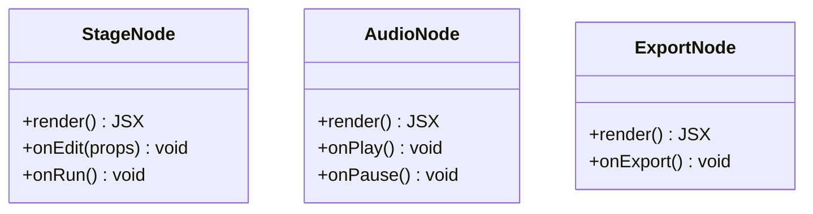

**图表来源** 
- [src/components/ui/node/stage-node.tsx](file://src/components/ui/node/stage-node.tsx)
- [src/components/ui/node/audio-node.tsx](file://src/components/ui/node/audio-node.tsx)
- [src/components/ui/node/export-node.tsx](file://src/components/ui/node/export-node.tsx)

**章节来源**
- [src/components/ui/node/stage-node.tsx](file://src/components/ui/node/stage-node.tsx)
- [src/components/ui/node/audio-node.tsx](file://src/components/ui/node/audio-node.tsx)
- [src/components/ui/node/export-node.tsx](file://src/components/ui/node/export-node.tsx)

### API 编排与流式反馈
- 管道控制：启动、暂停、重试、终止，返回执行 ID 与状态。
- 阶段控制：细粒度管理阶段生命周期，支持断点续跑。
- 流式日志：按节点维度推送运行日志，前端实时更新。

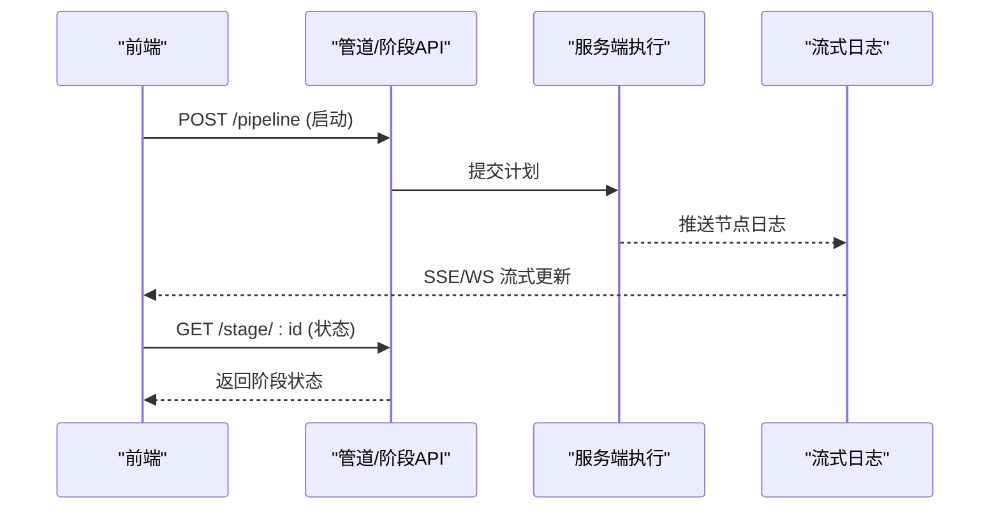

**图表来源** 
- [src/app/api/director/pipeline/route.ts](file://src/app/api/director/pipeline/route.ts)
- [src/app/api/director/stage/route.ts](file://src/app/api/director/stage/route.ts)
- [src/app/api/director/stream/[nodeId]/route.ts](file://src/app/api/director/stream/[nodeId]/route.ts)

**章节来源**
- [src/app/api/director/pipeline/route.ts](file://src/app/api/director/pipeline/route.ts)
- [src/app/api/director/stage/route.ts](file://src/app/api/director/stage/route.ts)
- [src/app/api/director/stream/[nodeId]/route.ts](file://src/app/api/director/stream/[nodeId]/route.ts)

### 服务端执行与作业调度
- 流水线编排：解析导出描述，生成 DAG 与批次，调度执行。
- 作业调度：管理并发、重试、超时与资源限制。
- 产物持久化：保存中间与最终产物，支持回放与审计。

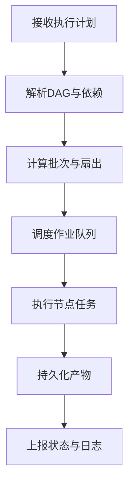

**图表来源** 
- [server/src/compose/run-pipeline.ts](file://server/src/compose/run-pipeline.ts)
- [server/src/server/job-runner.ts](file://server/src/server/job-runner.ts)

**章节来源**
- [server/src/compose/run-pipeline.ts](file://server/src/compose/run-pipeline.ts)
- [server/src/server/job-runner.ts](file://server/src/server/job-runner.ts)

### 概念总览
以下流程图概括了从用户操作到执行完成的整体工作流，帮助非技术读者快速理解系统行为。

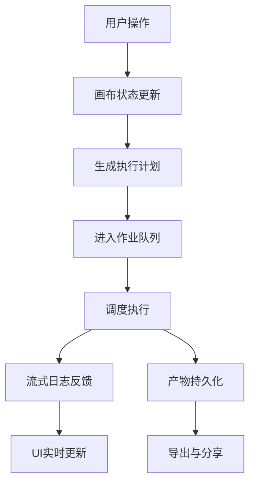

[本图为概念性示意，不直接映射具体源码文件]

## 依赖关系分析
- 模块耦合：画布类型与 UI 组件共享类型契约，降低不一致风险。
- 数据流：画布动作驱动状态变更，API 编排将状态转为执行计划，服务端执行后通过流式日志回写前端。
- 外部依赖：作业调度器与存储服务用于持久化与并发控制。

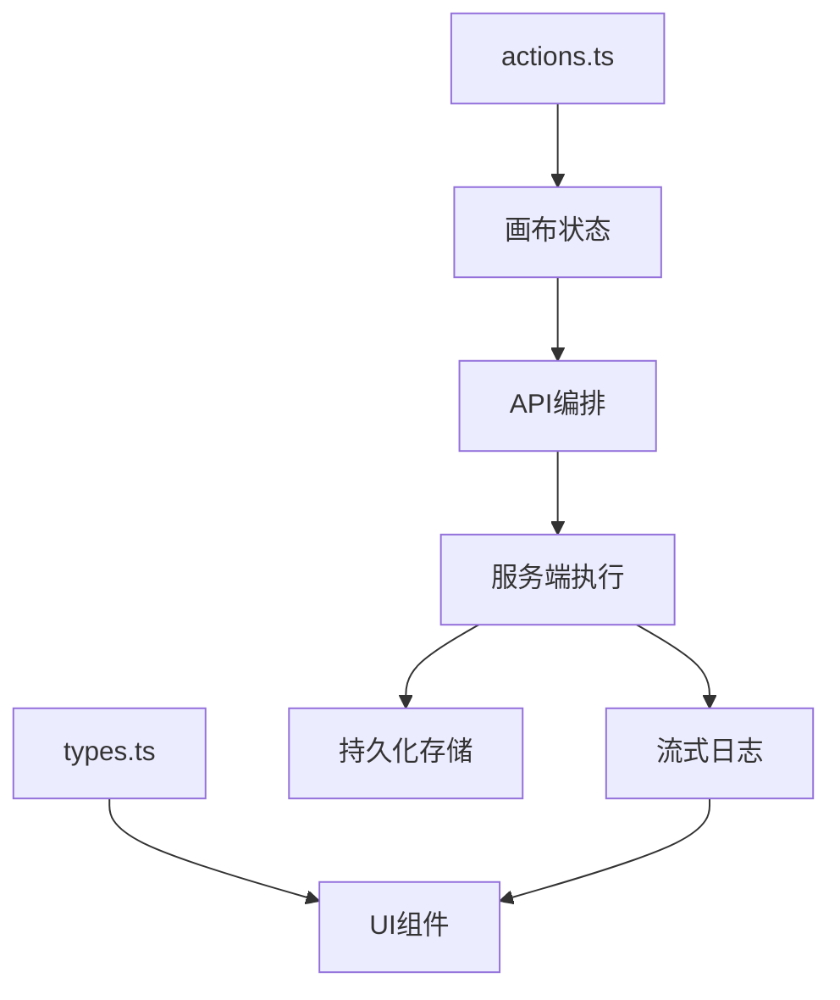

**图表来源** 
- [src/features/canvas/types.ts](file://src/features/canvas/types.ts)
- [src/features/canvas/actions.ts](file://src/features/canvas/actions.ts)
- [src/app/api/director/pipeline/route.ts](file://src/app/api/director/pipeline/route.ts)
- [server/src/compose/run-pipeline.ts](file://server/src/compose/run-pipeline.ts)
- [src/app/api/director/stream/[nodeId]/route.ts](file://src/app/api/director/stream/[nodeId]/route.ts)

**章节来源**
- [src/features/canvas/types.ts](file://src/features/canvas/types.ts)
- [src/features/canvas/actions.ts](file://src/features/canvas/actions.ts)
- [src/app/api/director/pipeline/route.ts](file://src/app/api/director/pipeline/route.ts)
- [server/src/compose/run-pipeline.ts](file://server/src/compose/run-pipeline.ts)
- [src/app/api/director/stream/[nodeId]/route.ts](file://src/app/api/director/stream/[nodeId]/route.ts)

## 性能考量
- 布局复杂度：自动排列应避免 O(n^2) 的密集计算，使用增量更新与缓存。
- 扇出与并发：合理设置最大并行度，防止资源争用与内存峰值。
- 流式日志：按需过滤与节流，减少前端渲染压力。
- 撤销重做：快照压缩与差异合并，降低历史存储开销。

[本节为通用指导，不直接分析具体文件]

## 故障排查指南
- 节点状态异常：检查状态机迁移路径与事件源，确认上游依赖是否满足。
- 布局错乱：验证连线端口匹配与约束条件，重新触发自动排列。
- 执行失败：查看流式日志与错误码，定位失败节点与原因。
- 撤销失效：检查历史快照完整性与版本戳冲突。

**章节来源**
- [src/features/canvas/status.ts](file://src/features/canvas/status.ts)
- [src/features/canvas/layout.ts](file://src/features/canvas/layout.ts)
- [src/app/api/director/stream/[nodeId]/route.ts](file://src/app/api/director/stream/[nodeId]/route.ts)
- [src/features/canvas/actions.ts](file://src/features/canvas/actions.ts)

## 结论
PurpleInk 节点管理系统通过清晰的类型契约、稳健的状态机、高效的布局算法与可靠的执行编排，实现了从画布设计到流水线运行的完整闭环。其模块化设计与可扩展的节点类型体系，为后续自定义节点与节点库建设奠定了坚实基础。建议在生产环境中关注并发控制、日志节流与快照压缩，以获得更优的性能与稳定性。

[本节为总结性内容，不直接分析具体文件]

## 附录
- 自定义节点开发步骤：
  - 定义节点类型与属性 Schema，遵循类型契约。
  - 实现 UI 组件，绑定属性编辑与事件回调。
  - 在服务端注册执行器，处理输入输出与错误。
  - 通过注册表暴露给画布与导出流程。
- 节点库构建建议：
  - 统一命名与版本管理，提供示例与测试用例。
  - 文档化输入输出与依赖要求，便于复用与组合。
  - 提供兼容性矩阵与升级指引。

[本节为实践指导，不直接分析具体文件]