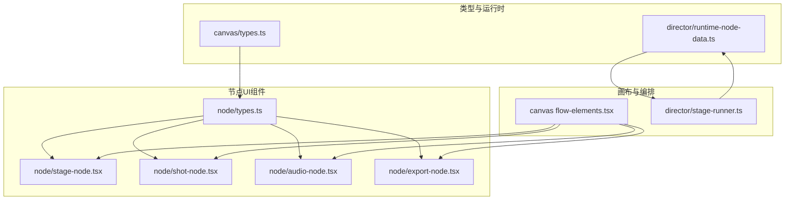
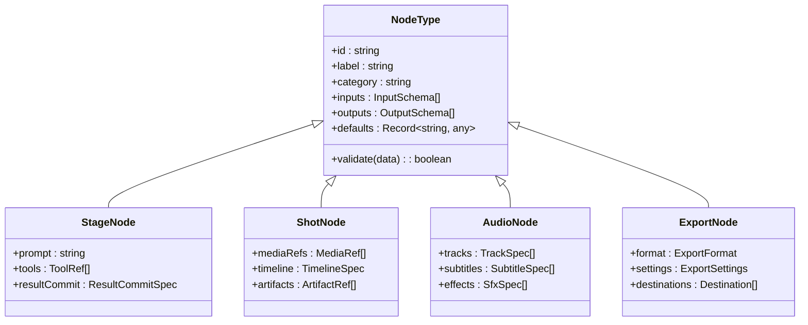
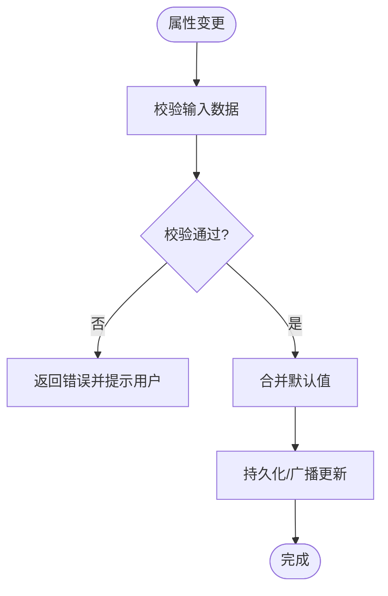
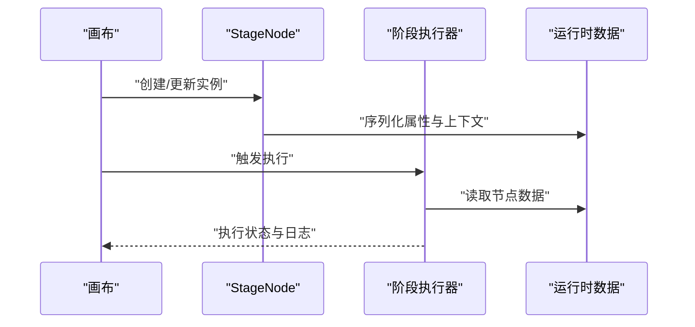
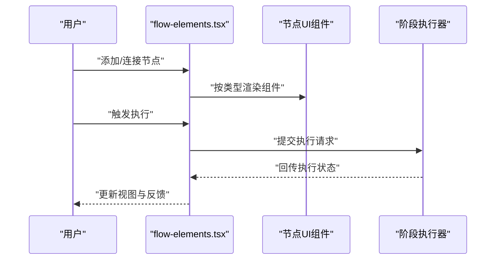
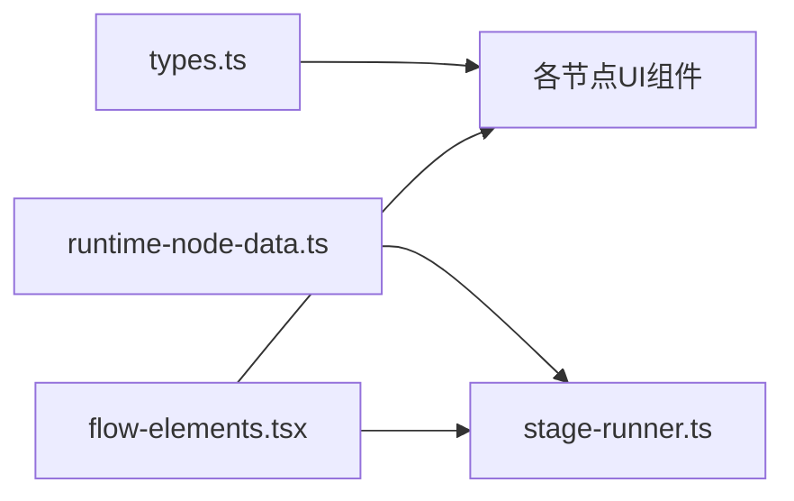

# 节点类型系统

<cite>
**本文引用的文件**   
- [src/components/ui/node/types.ts](file://src/components/ui/node/types.ts)
- [src/components/ui/node/stage-node.tsx](file://src/components/ui/node/stage-node.tsx)
- [src/components/ui/node/shot-node.tsx](file://src/components/ui/node/shot-node.tsx)
- [src/components/ui/node/audio-node.tsx](file://src/components/ui/node/audio-node.tsx)
- [src/components/ui/node/export-node.tsx](file://src/components/ui/node/export-node.tsx)
- [src/features/canvas/types.ts](file://src/features/canvas/types.ts)
- [src/features/canvas/index.ts](file://src/features/canvas/index.ts)
- [src/features/director/runtime-node-data.ts](file://src/features/director/runtime-node-data.ts)
- [src/features/director/stage-runner.ts](file://src/features/director/stage-runner.ts)
- [src/app/products/(app)/canvas/[projectId]/flow-elements.tsx](file://src/app/products/(app)/canvas/[projectId]/flow-elements.tsx)
</cite>

## 目录
1. [简介](#简介)
2. [项目结构](#项目结构)
3. [核心组件](#核心组件)
4. [架构总览](#架构总览)
5. [详细组件分析](#详细组件分析)
6. [依赖关系分析](#依赖关系分析)
7. [性能考虑](#性能考虑)
8. [故障排查指南](#故障排查指南)
9. [结论](#结论)
10. [附录](#附录)

## 简介
本文件面向 PurpleInk 的“节点类型系统”，系统性阐述节点类型的定义、继承与扩展机制，覆盖内置节点类型（StageNode、ShotNode、AudioNode、ExportNode）的职责与特性，并说明节点属性的定义规范、数据类型验证与默认值处理。同时提供自定义节点开发的完整流程（从接口实现到 UI 组件构建），以及节点类型注册、发现与加载的技术细节，帮助开发者快速理解并扩展该体系。

## 项目结构
与节点类型系统相关的代码主要分布在以下位置：
- 节点类型与运行时数据模型：src/features/canvas/types.ts、src/features/director/runtime-node-data.ts
- 节点 UI 组件与演示：src/components/ui/node/*（stage-node、shot-node、audio-node、export-node）
- 画布编排与渲染入口：src/app/products/(app)/canvas/[projectId]/flow-elements.tsx
- 节点运行与阶段执行：src/features/director/stage-runner.ts

**图表来源** 
- [src/features/canvas/types.ts](file://src/features/canvas/types.ts)
- [src/features/director/runtime-node-data.ts](file://src/features/director/runtime-node-data.ts)
- [src/components/ui/node/types.ts](file://src/components/ui/node/types.ts)
- [src/components/ui/node/stage-node.tsx](file://src/components/ui/node/stage-node.tsx)
- [src/components/ui/node/shot-node.tsx](file://src/components/ui/node/shot-node.tsx)
- [src/components/ui/node/audio-node.tsx](file://src/components/ui/node/audio-node.tsx)
- [src/components/ui/node/export-node.tsx](file://src/components/ui/node/export-node.tsx)
- [src/app/products/(app)/canvas/[projectId]/flow-elements.tsx](file://src/app/products/(app)/canvas/[projectId]/flow-elements.tsx)
- [src/features/director/stage-runner.ts](file://src/features/director/stage-runner.ts)

**章节来源**
- [src/features/canvas/types.ts](file://src/features/canvas/types.ts)
- [src/features/director/runtime-node-data.ts](file://src/features/director/runtime-node-data.ts)
- [src/components/ui/node/types.ts](file://src/components/ui/node/types.ts)
- [src/app/products/(app)/canvas/[projectId]/flow-elements.tsx](file://src/app/products/(app)/canvas/[projectId]/flow-elements.tsx)

## 核心组件
- 节点类型定义与公共契约：通过统一的类型描述节点属性、输入输出、状态与元信息，确保 UI 与运行时一致。
- 内置节点：
  - StageNode：表示一个可执行的“阶段”节点，承载提示词、工具调用与结果提交等能力。
  - ShotNode：表示镜头级节点，聚合素材、时间线与媒体产物。
  - AudioNode：音频相关节点，负责音轨、字幕与音效的处理。
  - ExportNode：导出节点，负责将管线产物打包输出。
- 画布编排：在画布中根据节点类型动态渲染对应 UI，并维护连接关系与执行顺序。
- 运行期：将节点类型映射为可执行任务，驱动阶段执行与结果持久化。

**章节来源**
- [src/components/ui/node/types.ts](file://src/components/ui/node/types.ts)
- [src/components/ui/node/stage-node.tsx](file://src/components/ui/node/stage-node.tsx)
- [src/components/ui/node/shot-node.tsx](file://src/components/ui/node/shot-node.tsx)
- [src/components/ui/node/audio-node.tsx](file://src/components/ui/node/audio-node.tsx)
- [src/components/ui/node/export-node.tsx](file://src/components/ui/node/export-node.tsx)
- [src/features/director/runtime-node-data.ts](file://src/features/director/runtime-node-data.ts)
- [src/features/director/stage-runner.ts](file://src/features/director/stage-runner.ts)

## 架构总览
节点类型系统的整体架构分为三层：
- 类型层：集中定义节点类型、属性模式、校验规则与默认值。
- UI 层：按节点类型渲染交互界面，支持属性编辑、预览与调试。
- 运行层：将节点实例转换为运行时数据，交由阶段执行器调度执行。

**图表来源** 
- [src/components/ui/node/types.ts](file://src/components/ui/node/types.ts)
- [src/features/director/runtime-node-data.ts](file://src/features/director/runtime-node-data.ts)

## 详细组件分析

### 节点类型定义与属性规范
- 统一类型契约：所有节点类型需遵循公共接口，包含标识、标签、分类、输入/输出模式、默认值与校验方法。
- 属性定义规范：
  - 输入/输出：以结构化 Schema 描述字段名、类型、是否必填、默认值与展示控件。
  - 数据类型验证：在节点初始化或属性变更时进行校验，失败则阻止更新并提示。
  - 默认值处理：未提供的属性使用默认值；复杂对象采用深合并策略避免覆盖。
- 扩展点：新增节点类型只需实现公共接口并提供 UI 组件，即可被画布与运行期识别。

**图表来源** 
- [src/components/ui/node/types.ts](file://src/components/ui/node/types.ts)

**章节来源**
- [src/components/ui/node/types.ts](file://src/components/ui/node/types.ts)

### StageNode（阶段节点）
- 职责：封装一次“阶段”的执行上下文，包括提示词、工具引用与结果提交策略。
- 关键特性：
  - 提示词模板：支持变量注入与上下文拼接。
  - 工具链：声明式配置可调用的工具集合。
  - 结果提交：定义如何把执行结果写入制品库或下游节点。
- 运行期映射：阶段节点会被转换为运行时任务，由阶段执行器调度。

**图表来源** 
- [src/components/ui/node/stage-node.tsx](file://src/components/ui/node/stage-node.tsx)
- [src/features/director/runtime-node-data.ts](file://src/features/director/runtime-node-data.ts)
- [src/features/director/stage-runner.ts](file://src/features/director/stage-runner.ts)

**章节来源**
- [src/components/ui/node/stage-node.tsx](file://src/components/ui/node/stage-node.tsx)
- [src/features/director/runtime-node-data.ts](file://src/features/director/runtime-node-data.ts)
- [src/features/director/stage-runner.ts](file://src/features/director/stage-runner.ts)

### ShotNode（镜头节点）
- 职责：管理镜头维度的媒体资源、时间线片段与产物引用。
- 关键特性：
  - 媒体引用：图片、视频、音频等多媒体资源的统一引用。
  - 时间线：定义镜头内片段顺序、时长与转场。
  - 产物：生成缩略图、帧序列或合成结果。
- 适用场景：分镜编排、多素材合成与预览。

**章节来源**
- [src/components/ui/node/shot-node.tsx](file://src/components/ui/node/shot-node.tsx)

### AudioNode（音频节点）
- 职责：处理音轨、字幕与音效，提供剪辑与混音能力。
- 关键特性：
  - 轨道：多轨音频管理与同步。
  - 字幕：文本到语音或字幕文件的生成与对齐。
  - 音效：SFX 插入、音量与淡入淡出控制。
- 适用场景：配音、配乐与后期音频处理。

**章节来源**
- [src/components/ui/node/audio-node.tsx](file://src/components/ui/node/audio-node.tsx)

### ExportNode（导出节点）
- 职责：将管线产物按格式与设置导出到目标位置。
- 关键特性：
  - 格式：视频、图像、音频等不同导出格式。
  - 设置：分辨率、码率、编码参数等。
  - 目的地：本地存储、云存储或分发渠道。
- 适用场景：最终成品输出与批量导出。

**章节来源**
- [src/components/ui/node/export-node.tsx](file://src/components/ui/node/export-node.tsx)

### 画布中的节点渲染与编排
- 动态渲染：根据节点类型选择对应 UI 组件进行渲染。
- 连接关系：维护节点间的输入输出连接，保证数据流正确。
- 执行顺序：依据拓扑排序与依赖关系确定执行顺序。

**图表来源** 
- [src/app/products/(app)/canvas/[projectId]/flow-elements.tsx](file://src/app/products/(app)/canvas/[projectId]/flow-elements.tsx)
- [src/components/ui/node/stage-node.tsx](file://src/components/ui/node/stage-node.tsx)
- [src/components/ui/node/shot-node.tsx](file://src/components/ui/node/shot-node.tsx)
- [src/components/ui/node/audio-node.tsx](file://src/components/ui/node/audio-node.tsx)
- [src/components/ui/node/export-node.tsx](file://src/components/ui/node/export-node.tsx)
- [src/features/director/stage-runner.ts](file://src/features/director/stage-runner.ts)

**章节来源**
- [src/app/products/(app)/canvas/[projectId]/flow-elements.tsx](file://src/app/products/(app)/canvas/[projectId]/flow-elements.tsx)

## 依赖关系分析
- 类型与 UI 解耦：节点类型定义独立于 UI 组件，便于复用与测试。
- 运行期映射：运行时数据模型与阶段执行器紧密耦合，确保执行语义一致。
- 画布编排：画布层仅依赖类型与 UI 组件，不直接感知运行细节。

**图表来源** 
- [src/components/ui/node/types.ts](file://src/components/ui/node/types.ts)
- [src/features/director/runtime-node-data.ts](file://src/features/director/runtime-node-data.ts)
- [src/features/director/stage-runner.ts](file://src/features/director/stage-runner.ts)
- [src/app/products/(app)/canvas/[projectId]/flow-elements.tsx](file://src/app/products/(app)/canvas/[projectId]/flow-elements.tsx)

**章节来源**
- [src/components/ui/node/types.ts](file://src/components/ui/node/types.ts)
- [src/features/director/runtime-node-data.ts](file://src/features/director/runtime-node-data.ts)
- [src/features/director/stage-runner.ts](file://src/features/director/stage-runner.ts)
- [src/app/products/(app)/canvas/[projectId]/flow-elements.tsx](file://src/app/products/(app)/canvas/[projectId]/flow-elements.tsx)

## 性能考虑
- 属性校验缓存：对频繁变更的属性进行增量校验，减少重复计算。
- 懒加载 UI：仅在节点可见时渲染对应组件，降低首屏压力。
- 执行批处理：将多个节点任务合并调度，提升吞吐。
- 产物缓存：对中间结果与导出产物进行缓存，避免重复计算。

[本节为通用指导，无需具体文件来源]

## 故障排查指南
- 属性校验失败：检查输入数据的类型与必填项，确认默认值是否正确合并。
- 节点无法渲染：确认节点类型已正确注册且 UI 组件路径无误。
- 执行异常：查看阶段执行器的日志与运行时数据，定位上下文缺失或工具调用失败。
- 导出失败：核对导出格式与设置，检查目标存储权限与网络连通性。

**章节来源**
- [src/components/ui/node/types.ts](file://src/components/ui/node/types.ts)
- [src/features/director/stage-runner.ts](file://src/features/director/stage-runner.ts)

## 结论
PurpleInk 的节点类型系统通过统一的类型契约、清晰的职责划分与可扩展的 UI 组件机制，实现了从类型定义到运行执行的完整闭环。内置节点覆盖了阶段、镜头、音频与导出等核心场景，配合画布编排与阶段执行器，形成稳定高效的管线体系。开发者可通过实现公共接口与提供 UI 组件快速扩展新节点类型，满足多样化业务需求。

[本节为总结性内容，无需具体文件来源]

## 附录
- 自定义节点开发流程建议：
  - 定义节点类型：在类型文件中补充新的节点类型与属性模式。
  - 实现 UI 组件：创建对应的节点 UI 组件，支持属性编辑与预览。
  - 注册与发现：确保画布能识别新节点类型并渲染对应组件。
  - 运行期映射：如需要执行逻辑，完善运行时数据模型与执行器适配。
  - 测试与文档：编写单元测试与使用示例，确保稳定性与可维护性。

[本节为概念性内容，无需具体文件来源]