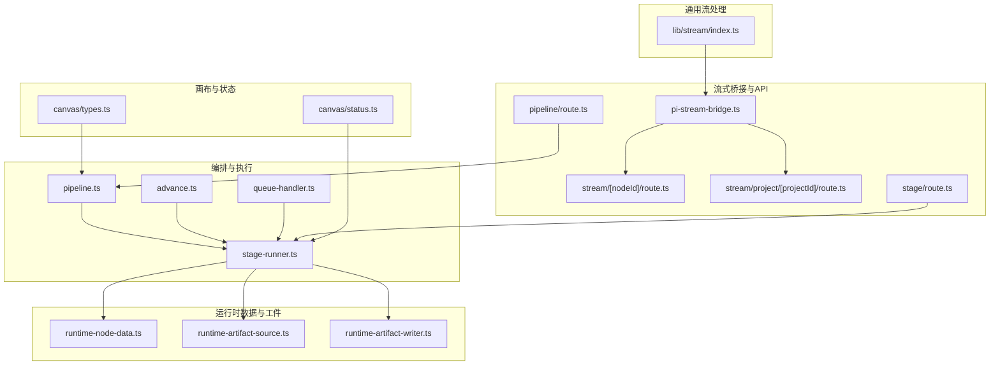
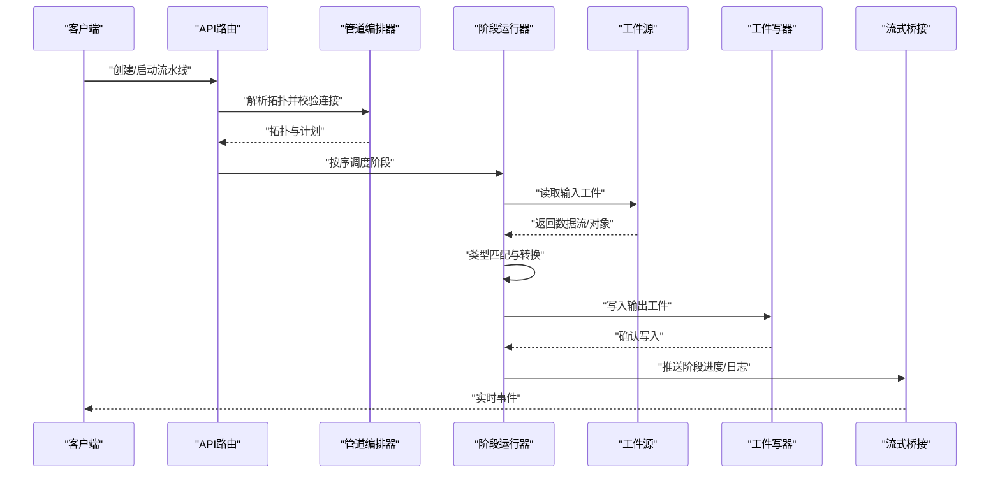
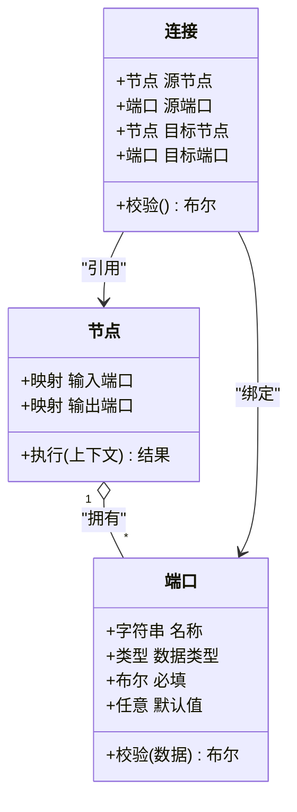
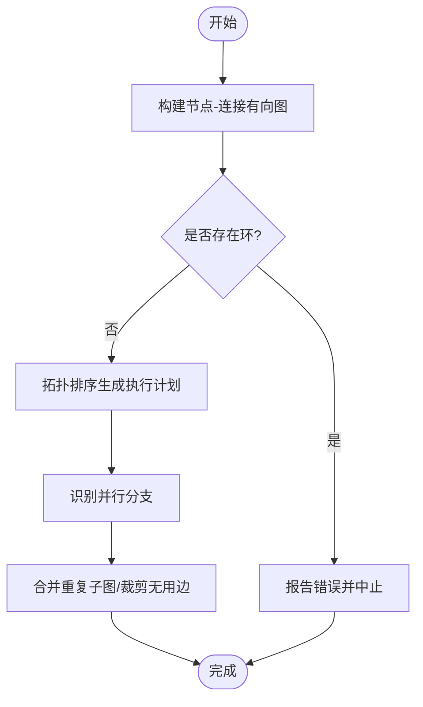
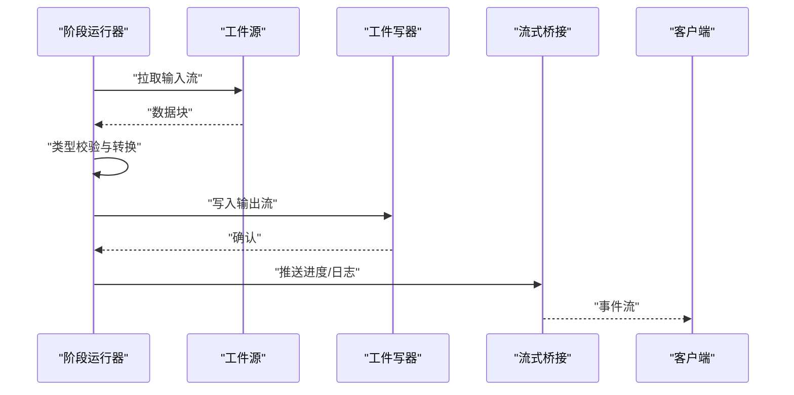
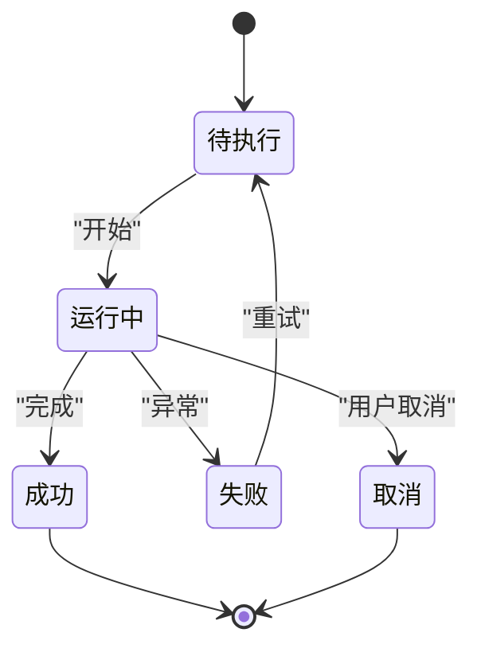
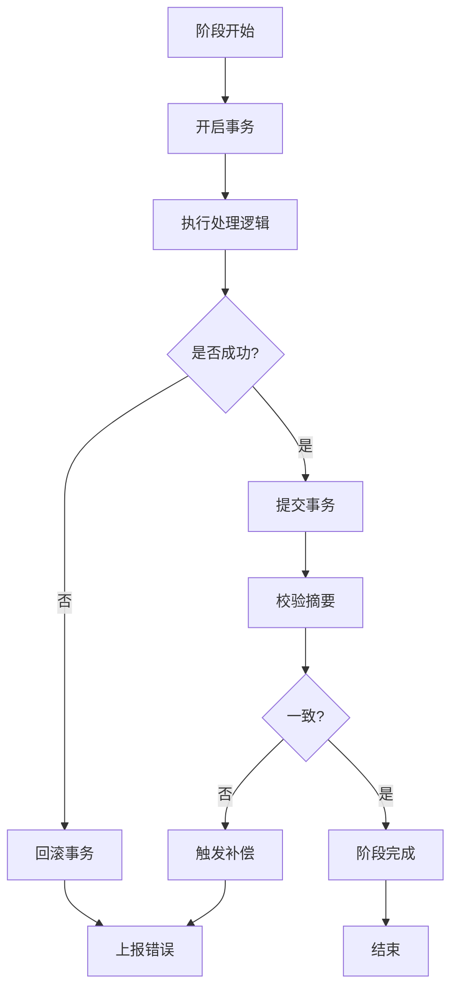
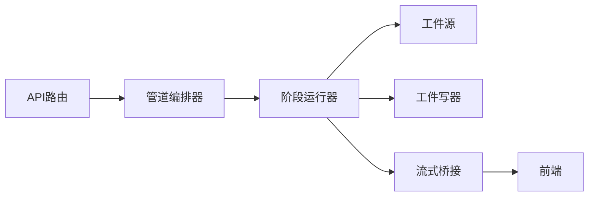

# 节点连接系统

<cite>
**本文引用的文件**   
- [src/features/director/pipeline.ts](file://src/features/director/pipeline.ts)
- [src/features/director/stage-runner.ts](file://src/features/director/stage-runner.ts)
- [src/features/director/runtime-node-data.ts](file://src/features/director/runtime-node-data.ts)
- [src/features/director/runtime-artifact-source.ts](file://src/features/director/runtime-artifact-source.ts)
- [src/features/director/runtime-artifact-writer.ts](file://src/features/director/runtime-artifact-writer.ts)
- [src/features/director/advance.ts](file://src/features/director/advance.ts)
- [src/features/director/queue-handler.ts](file://src/features/director/queue-handler.ts)
- [src/features/director/pi-stream-bridge.ts](file://src/features/director/pi-stream-bridge.ts)
- [src/app/api/director/stream/[nodeId]/route.ts](file://src/app/api/director/stream/[nodeId]/route.ts)
- [src/app/api/director/stream/project/[projectId]/route.ts](file://src/app/api/director/stream/project/[projectId]/route.ts)
- [src/app/api/director/pipeline/route.ts](file://src/app/api/director/pipeline/route.ts)
- [src/app/api/director/stage/route.ts](file://src/app/api/director/stage/route.ts)
- [src/features/canvas/types.ts](file://src/features/canvas/types.ts)
- [src/features/canvas/status.ts](file://src/features/canvas/status.ts)
- [src/lib/stream/index.ts](file://src/lib/stream/index.ts)
</cite>

## 目录
1. [简介](#简介)
2. [项目结构](#项目结构)
3. [核心组件](#核心组件)
4. [架构总览](#架构总览)
5. [详细组件分析](#详细组件分析)
6. [依赖关系分析](#依赖关系分析)
7. [性能考量](#性能考量)
8. [故障排查指南](#故障排查指南)
9. [结论](#结论)
10. [附录](#附录)

## 简介
本文件为 PurpleInk 节点连接系统的权威文档，聚焦于“节点间数据连接的建立、验证与维护”。内容涵盖：
- 连接端口的定义与类型匹配
- 数据传输协议（流式与批式）
- 连接拓扑分析与循环依赖检测
- 连接优化策略（并发、背压、缓存）
- 连接状态同步、断线重连与一致性保证
- 调试工具、流量监控与性能分析方法

该文档面向不同技术背景的读者，提供从高层架构到代码级细节的渐进式说明。

## 项目结构
与节点连接系统相关的核心代码主要分布在以下模块：
- 编排与执行：pipeline、stage-runner、advance、queue-handler
- 运行时数据与工件：runtime-node-data、runtime-artifact-source、runtime-artifact-writer
- 流式桥接与API：pi-stream-bridge、stream API路由
- 画布与状态：canvas types、status
- 通用流处理：lib/stream

图表来源
- [src/features/director/pipeline.ts](file://src/features/director/pipeline.ts)
- [src/features/director/stage-runner.ts](file://src/features/director/stage-runner.ts)
- [src/features/director/runtime-node-data.ts](file://src/features/director/runtime-node-data.ts)
- [src/features/director/runtime-artifact-source.ts](file://src/features/director/runtime-artifact-source.ts)
- [src/features/director/runtime-artifact-writer.ts](file://src/features/director/runtime-artifact-writer.ts)
- [src/features/director/advance.ts](file://src/features/director/advance.ts)
- [src/features/director/queue-handler.ts](file://src/features/director/queue-handler.ts)
- [src/features/director/pi-stream-bridge.ts](file://src/features/director/pi-stream-bridge.ts)
- [src/app/api/director/stream/[nodeId]/route.ts](file://src/app/api/director/stream/[nodeId]/route.ts)
- [src/app/api/director/stream/project/[projectId]/route.ts](file://src/app/api/director/stream/project/[projectId]/route.ts)
- [src/app/api/director/pipeline/route.ts](file://src/app/api/director/pipeline/route.ts)
- [src/app/api/director/stage/route.ts](file://src/app/api/director/stage/route.ts)
- [src/features/canvas/types.ts](file://src/features/canvas/types.ts)
- [src/features/canvas/status.ts](file://src/features/canvas/status.ts)
- [src/lib/stream/index.ts](file://src/lib/stream/index.ts)

章节来源
- [src/features/director/pipeline.ts](file://src/features/director/pipeline.ts)
- [src/features/director/stage-runner.ts](file://src/features/director/stage-runner.ts)
- [src/features/director/runtime-node-data.ts](file://src/features/director/runtime-node-data.ts)
- [src/features/director/runtime-artifact-source.ts](file://src/features/director/runtime-artifact-source.ts)
- [src/features/director/runtime-artifact-writer.ts](file://src/features/director/runtime-artifact-writer.ts)
- [src/features/director/advance.ts](file://src/features/director/advance.ts)
- [src/features/director/queue-handler.ts](file://src/features/director/queue-handler.ts)
- [src/features/director/pi-stream-bridge.ts](file://src/features/director/pi-stream-bridge.ts)
- [src/app/api/director/stream/[nodeId]/route.ts](file://src/app/api/director/stream/[nodeId]/route.ts)
- [src/app/api/director/stream/project/[projectId]/route.ts](file://src/app/api/director/stream/project/[projectId]/route.ts)
- [src/app/api/director/pipeline/route.ts](file://src/app/api/director/pipeline/route.ts)
- [src/app/api/director/stage/route.ts](file://src/app/api/director/stage/route.ts)
- [src/features/canvas/types.ts](file://src/features/canvas/types.ts)
- [src/features/canvas/status.ts](file://src/features/canvas/status.ts)
- [src/lib/stream/index.ts](file://src/lib/stream/index.ts)

## 核心组件
- 管道编排器（Pipeline）：负责解析节点图、构建连接拓扑、调度阶段执行顺序。
- 阶段运行器（Stage Runner）：驱动单个阶段的输入消费、处理逻辑与输出写入。
- 运行时节点数据（Runtime Node Data）：维护节点运行时的端口值、元数据与生命周期。
- 工件源/写器（Artifact Source/Writer）：抽象外部存储或中间件的数据读写接口。
- 推进器（Advance）：控制阶段推进、依赖满足与结果提交。
- 队列处理器（Queue Handler）：将任务入队、限流与重试。
- 流式桥接（Stream Bridge）：将后端流事件桥接到前端，支持实时状态与日志。
- 画布类型与状态（Canvas Types/Status）：定义节点端口类型、连接约束与运行状态机。

章节来源
- [src/features/director/pipeline.ts](file://src/features/director/pipeline.ts)
- [src/features/director/stage-runner.ts](file://src/features/director/stage-runner.ts)
- [src/features/director/runtime-node-data.ts](file://src/features/director/runtime-node-data.ts)
- [src/features/director/runtime-artifact-source.ts](file://src/features/director/runtime-artifact-source.ts)
- [src/features/director/runtime-artifact-writer.ts](file://src/features/director/runtime-artifact-writer.ts)
- [src/features/director/advance.ts](file://src/features/director/advance.ts)
- [src/features/director/queue-handler.ts](file://src/features/director/queue-handler.ts)
- [src/features/director/pi-stream-bridge.ts](file://src/features/director/pi-stream-bridge.ts)
- [src/features/canvas/types.ts](file://src/features/canvas/types.ts)
- [src/features/canvas/status.ts](file://src/features/canvas/status.ts)

## 架构总览
下图展示了从请求入口到节点执行的端到端流程，包括连接建立、类型校验、数据流转与状态同步。

图表来源
- [src/app/api/director/pipeline/route.ts](file://src/app/api/director/pipeline/route.ts)
- [src/features/director/pipeline.ts](file://src/features/director/pipeline.ts)
- [src/features/director/stage-runner.ts](file://src/features/director/stage-runner.ts)
- [src/features/director/runtime-artifact-source.ts](file://src/features/director/runtime-artifact-source.ts)
- [src/features/director/runtime-artifact-writer.ts](file://src/features/director/runtime-artifact-writer.ts)
- [src/features/director/pi-stream-bridge.ts](file://src/features/director/pi-stream-bridge.ts)

## 详细组件分析

### 连接端口定义与类型匹配
- 端口模型：每个节点暴露输入/输出端口，端口包含名称、数据类型、可选默认值与约束（如必填、范围）。
- 类型匹配：连接建立前对两端端口进行类型兼容检查，确保数据可序列化与可转换。
- 连接约束：禁止自环、强制单向数据流、允许多对一合并与一对多扇出。

图表来源
- [src/features/canvas/types.ts](file://src/features/canvas/types.ts)
- [src/features/director/stage-runner.ts](file://src/features/director/stage-runner.ts)

章节来源
- [src/features/canvas/types.ts](file://src/features/canvas/types.ts)
- [src/features/director/stage-runner.ts](file://src/features/director/stage-runner.ts)

### 连接拓扑分析与循环依赖检测
- 拓扑构建：基于节点与连接构建有向图，计算入度/出度，生成执行计划。
- 循环检测：使用深度优先搜索或拓扑排序检测环；发现环后回滚并提示修复建议。
- 优化策略：识别可并行执行的分支，减少关键路径长度；合并重复子图。

图表来源
- [src/features/director/pipeline.ts](file://src/features/director/pipeline.ts)
- [src/features/director/advance.ts](file://src/features/director/advance.ts)

章节来源
- [src/features/director/pipeline.ts](file://src/features/director/pipeline.ts)
- [src/features/director/advance.ts](file://src/features/director/advance.ts)

### 数据传输协议与流式桥接
- 协议选择：小对象采用JSON批式传输，大媒体采用分块流式传输。
- 流式桥接：通过SSE或WebSocket将后端事件推送到前端，支持心跳与断线重连。
- 背压控制：消费者侧缓冲上限与丢弃策略，避免内存溢出。

图表来源
- [src/features/director/stage-runner.ts](file://src/features/director/stage-runner.ts)
- [src/features/director/runtime-artifact-source.ts](file://src/features/director/runtime-artifact-source.ts)
- [src/features/director/runtime-artifact-writer.ts](file://src/features/director/runtime-artifact-writer.ts)
- [src/features/director/pi-stream-bridge.ts](file://src/features/director/pi-stream-bridge.ts)

章节来源
- [src/features/director/stage-runner.ts](file://src/features/director/stage-runner.ts)
- [src/features/director/runtime-artifact-source.ts](file://src/features/director/runtime-artifact-source.ts)
- [src/features/director/runtime-artifact-writer.ts](file://src/features/director/runtime-artifact-writer.ts)
- [src/features/director/pi-stream-bridge.ts](file://src/features/director/pi-stream-bridge.ts)

### 连接状态同步与断线重连
- 状态机：节点状态包括待执行、运行中、成功、失败、取消等。
- 同步机制：阶段完成后广播状态变更，前端订阅更新UI。
- 断线重连：检测到连接中断时指数退避重试，恢复后增量同步缺失事件。

图表来源
- [src/features/canvas/status.ts](file://src/features/canvas/status.ts)
- [src/features/director/pi-stream-bridge.ts](file://src/features/director/pi-stream-bridge.ts)

章节来源
- [src/features/canvas/status.ts](file://src/features/canvas/status.ts)
- [src/features/director/pi-stream-bridge.ts](file://src/features/director/pi-stream-bridge.ts)

### 数据一致性保证
- 幂等写入：输出工件写入具备幂等键，避免重复写入导致不一致。
- 事务边界：阶段内操作以事务包裹，失败时回滚。
- 校验与回滚：写入后校验摘要，不匹配则触发补偿流程。

图表来源
- [src/features/director/stage-runner.ts](file://src/features/director/stage-runner.ts)
- [src/features/director/runtime-artifact-writer.ts](file://src/features/director/runtime-artifact-writer.ts)

章节来源
- [src/features/director/stage-runner.ts](file://src/features/director/stage-runner.ts)
- [src/features/director/runtime-artifact-writer.ts](file://src/features/director/runtime-artifact-writer.ts)

### 连接优化策略
- 并发控制：限制同时运行的阶段数，避免资源争用。
- 背压管理：上游生产速率与下游消费速率平衡，防止堆积。
- 缓存复用：相同输入哈希命中缓存，跳过重复计算。
- 流水线并行：相邻阶段无依赖时可并行执行。

章节来源
- [src/features/director/queue-handler.ts](file://src/features/director/queue-handler.ts)
- [src/features/director/pipeline.ts](file://src/features/director/pipeline.ts)

## 依赖关系分析
- 低耦合：阶段运行器仅依赖工件源/写器接口，便于替换实现。
- 明确边界：API路由负责鉴权与参数校验，编排器专注拓扑与调度。
- 潜在环路风险：若自定义节点引入反向依赖，需在拓扑分析阶段拦截。

图表来源
- [src/app/api/director/pipeline/route.ts](file://src/app/api/director/pipeline/route.ts)
- [src/features/director/pipeline.ts](file://src/features/director/pipeline.ts)
- [src/features/director/stage-runner.ts](file://src/features/director/stage-runner.ts)
- [src/features/director/runtime-artifact-source.ts](file://src/features/director/runtime-artifact-source.ts)
- [src/features/director/runtime-artifact-writer.ts](file://src/features/director/runtime-artifact-writer.ts)
- [src/features/director/pi-stream-bridge.ts](file://src/features/director/pi-stream-bridge.ts)

章节来源
- [src/app/api/director/pipeline/route.ts](file://src/app/api/director/pipeline/route.ts)
- [src/features/director/pipeline.ts](file://src/features/director/pipeline.ts)
- [src/features/director/stage-runner.ts](file://src/features/director/stage-runner.ts)
- [src/features/director/runtime-artifact-source.ts](file://src/features/director/runtime-artifact-source.ts)
- [src/features/director/runtime-artifact-writer.ts](file://src/features/director/runtime-artifact-writer.ts)
- [src/features/director/pi-stream-bridge.ts](file://src/features/director/pi-stream-bridge.ts)

## 性能考量
- 流式处理优先：大文件与媒体数据采用分块流式传输，降低内存峰值。
- 背压与缓冲：合理设置缓冲区大小与丢弃策略，避免OOM。
- 并发与限流：根据CPU/IO能力调整并发度，避免热点瓶颈。
- 缓存与去重：利用输入哈希缓存中间结果，减少重复计算。
- 监控指标：记录阶段耗时、吞吐、错误率与队列长度，辅助定位问题。

[本节为通用指导，无需特定文件来源]

## 故障排查指南
- 连接建立失败：检查端口类型兼容性、必填字段与默认值配置。
- 循环依赖：查看拓扑分析报告，修正反向连接或拆分阶段。
- 数据不一致：核对摘要校验与事务日志，必要时触发补偿。
- 断线重连：观察心跳与重连次数，检查网络与服务器负载。
- 性能瓶颈：分析阶段耗时分布与队列积压，调整并发与缓存策略。

章节来源
- [src/features/director/pipeline.ts](file://src/features/director/pipeline.ts)
- [src/features/director/stage-runner.ts](file://src/features/director/stage-runner.ts)
- [src/features/director/pi-stream-bridge.ts](file://src/features/director/pi-stream-bridge.ts)

## 结论
PurpleInk 节点连接系统通过严格的端口类型匹配、拓扑分析与流式桥接，实现了高可靠、高性能的节点间数据连接。结合状态同步、断线重连与一致性保障，系统在复杂工作流场景下仍保持稳定。建议在生产环境启用监控与告警，持续优化并发与缓存策略，以获得更佳的性能与用户体验。

[本节为总结性内容，无需特定文件来源]

## 附录
- 调试工具：
  - 阶段日志与事件流：通过流式桥接订阅节点事件，过滤与聚合关键信息。
  - 拓扑可视化：导出节点-连接图，人工审查依赖与并行度。
- 流量监控：
  - 指标采集：阶段耗时、吞吐、错误率、队列长度、缓存命中率。
  - 采样与追踪：对慢查询与长耗时阶段进行采样追踪。
- 性能分析：
  - 火焰图与热点分析：定位CPU与IO热点。
  - 压力测试：模拟高并发与大数据量，评估稳定性与容量。

[本节为补充信息，无需特定文件来源]