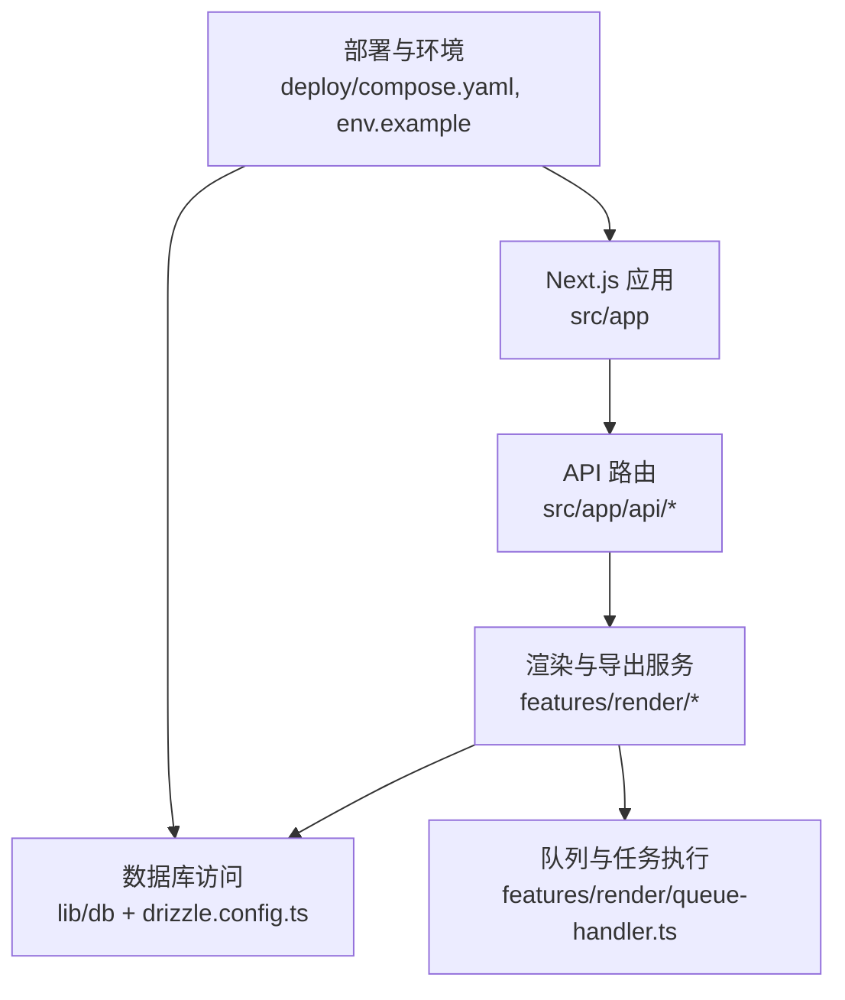
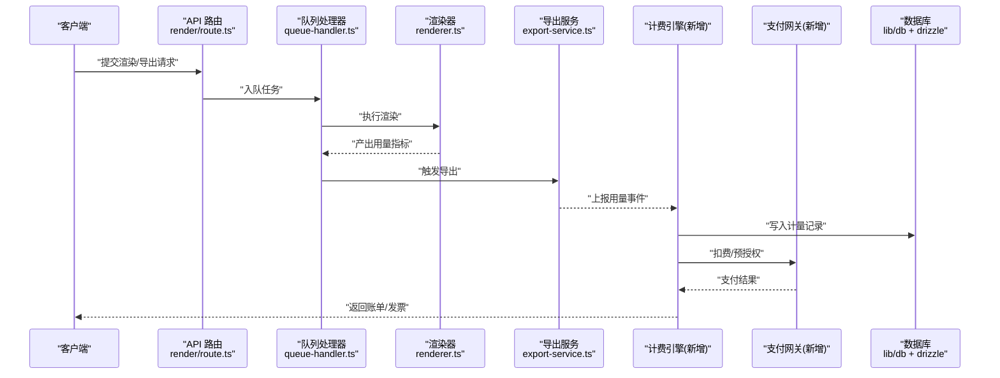
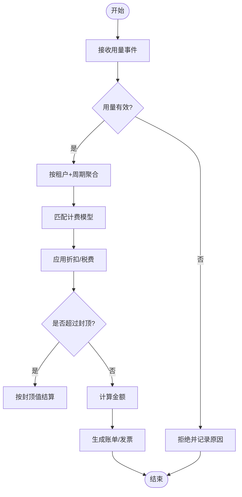
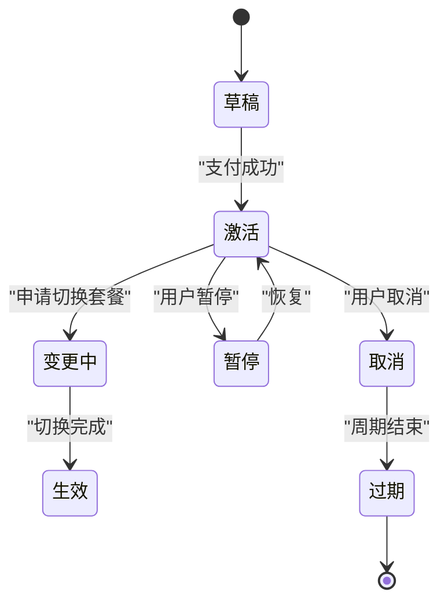
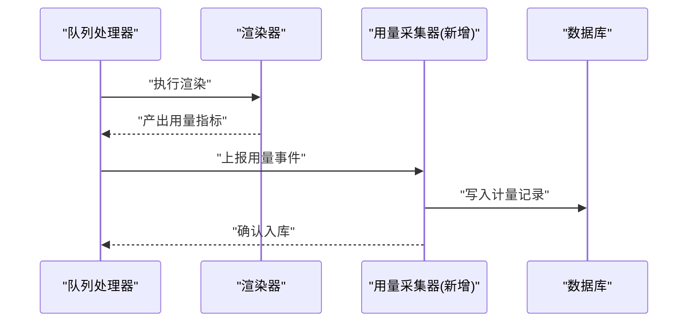
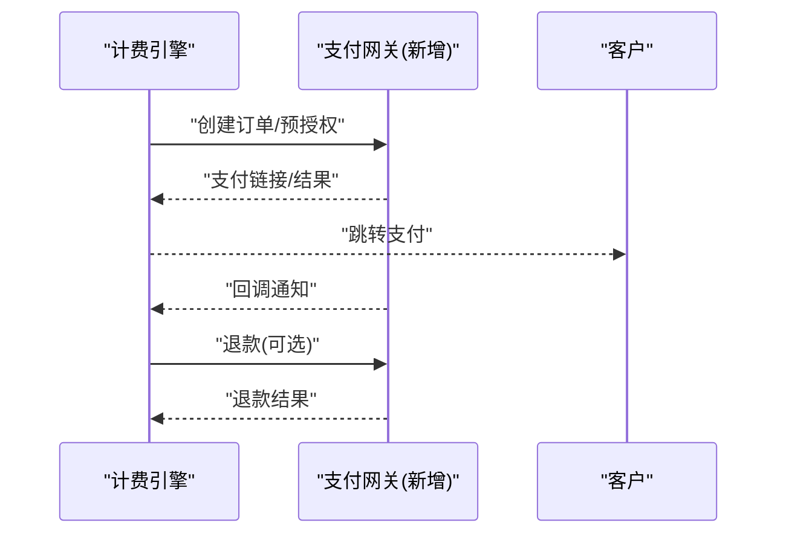
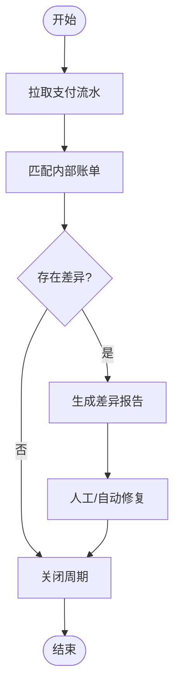
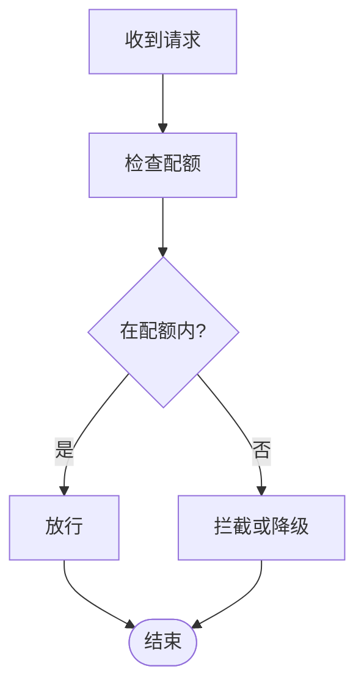
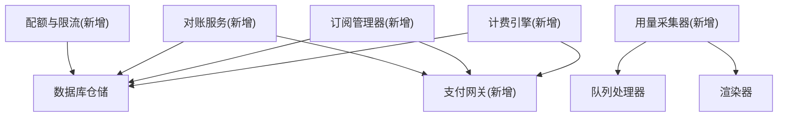

# 计费服务层

<cite>
**本文档引用的文件**   
- [package.json](file://package.json)
- [drizzle.config.ts](file://drizzle.config.ts)
- [server/src/index.ts](file://server/src/index.ts)
- [src/app/api/render/route.ts](file://src/app/api/render/route.ts)
- [src/features/render/export-service.ts](file://src/features/render/export-service.ts)
- [src/features/render/queue-handler.ts](file://src/features/render/queue-handler.ts)
- [src/features/render/renderer.ts](file://src/features/render/renderer.ts)
- [src/features/render/repository.ts](file://src/features/render/repository.ts)
- [src/lib/db/index.ts](file://src/lib/db/index.ts)
- [deploy/compose.yaml](file://deploy/compose.yaml)
- [deploy/env.example](file://deploy/env.example)
</cite>

## 目录
1. [简介](#简介)
2. [项目结构](#项目结构)
3. [核心组件](#核心组件)
4. [架构总览](#架构总览)
5. [详细组件分析](#详细组件分析)
6. [依赖关系分析](#依赖关系分析)
7. [性能考量](#性能考量)
8. [故障排查指南](#故障排查指南)
9. [结论](#结论)
10. [附录](#附录)

## 简介
本文件为 PurpleInk 计费服务层的全面技术文档，聚焦计费模型设计、用量统计与账单生成机制，覆盖订阅管理、套餐切换与续费处理；费用计算、折扣应用与发票生成流程；支付集成、退款处理与财务对账；用量限制、配额管理与超额处理；以及计费规则配置与自定义计费逻辑的实现指南。

说明：当前仓库未包含已实现的计费模块代码。本文基于现有渲染与导出链路、数据库与部署配置进行架构化设计与实现建议，确保在不侵入既有业务的前提下提供可扩展的计费能力。

## 项目结构
- 前端 Next.js 应用位于 src/app，API 路由通过 app/api 暴露。
- 渲染与导出相关功能集中在 features/render，包括队列处理器、渲染器、仓储等。
- 数据库访问通过 Drizzle ORM 配置与 lib/db 抽象。
- 部署使用 Docker Compose，环境变量示例在 deploy/env.example。

图表来源
- [server/src/index.ts:1-200](file://server/src/index.ts#L1-L200)
- [src/app/api/render/route.ts:1-200](file://src/app/api/render/route.ts#L1-L200)
- [src/features/render/export-service.ts:1-200](file://src/features/render/export-service.ts#L1-L200)
- [src/features/render/queue-handler.ts:1-200](file://src/features/render/queue-handler.ts#L1-L200)
- [src/features/render/renderer.ts:1-200](file://src/features/render/renderer.ts#L1-L200)
- [src/features/render/repository.ts:1-200](file://src/features/render/repository.ts#L1-L200)
- [src/lib/db/index.ts:1-200](file://src/lib/db/index.ts#L1-L200)
- [drizzle.config.ts:1-200](file://drizzle.config.ts#L1-L200)
- [deploy/compose.yaml:1-200](file://deploy/compose.yaml#L1-L200)
- [deploy/env.example:1-200](file://deploy/env.example#L1-L200)

章节来源
- [package.json:1-200](file://package.json#L1-L200)
- [drizzle.config.ts:1-200](file://drizzle.config.ts#L1-L200)
- [server/src/index.ts:1-200](file://server/src/index.ts#L1-L200)
- [deploy/compose.yaml:1-200](file://deploy/compose.yaml#L1-L200)
- [deploy/env.example:1-200](file://deploy/env.example#L1-L200)

## 核心组件
- 计费引擎（新增）：负责计费模型解析、用量聚合、折扣与税费计算、账单生成与发票输出。
- 订阅管理器（新增）：管理订阅生命周期、套餐切换、自动续费与到期提醒。
- 用量采集器（新增）：从渲染与导出事件中提取用量指标，写入计量表并支持窗口聚合。
- 支付网关适配器（新增）：封装支付渠道（如 Stripe），统一创建订单、处理回调与退款。
- 对账服务（新增）：周期性拉取支付流水，与内部账单核对，生成差异报告。
- 配额与限流（新增）：按订阅套餐设置资源配额与速率限制，超限拦截或降级。

说明：以上组件为设计目标，尚未在当前仓库中实现。后续章节将给出与现有渲染导出的集成点与扩展方式。

## 架构总览
计费服务层以“事件驱动”的方式接入渲染与导出链路，保证低耦合与高扩展性。关键数据流如下：

图表来源
- [src/app/api/render/route.ts:1-200](file://src/app/api/render/route.ts#L1-L200)
- [src/features/render/queue-handler.ts:1-200](file://src/features/render/queue-handler.ts#L1-L200)
- [src/features/render/renderer.ts:1-200](file://src/features/render/renderer.ts#L1-L200)
- [src/features/render/export-service.ts:1-200](file://src/features/render/export-service.ts#L1-L200)
- [src/lib/db/index.ts:1-200](file://src/lib/db/index.ts#L1-L200)

## 详细组件分析

### 计费引擎（新增）
职责
- 解析计费模型（按量、阶梯、包月、混合）。
- 聚合用量（分钟、帧数、导出次数、存储大小等）。
- 应用折扣、税费、封顶策略。
- 生成账单与发票（PDF/JSON），支持多币种。

数据结构（建议）
- 计费模型：定价项、单位、阈值、折扣券、税费率、封顶值。
- 用量事件：租户ID、资源类型、数量、时间戳、来源任务ID。
- 账单：周期、明细、折扣、税费、总额、状态、发票号。

复杂度与优化
- 用量聚合采用窗口函数与分区索引，避免全表扫描。
- 折扣与税费计算幂等，支持重试与回滚。

错误处理
- 模型校验失败返回明确错误码。
- 外部支付失败走补偿与重试。

图表来源
- [src/features/render/export-service.ts:1-200](file://src/features/render/export-service.ts#L1-L200)
- [src/features/render/queue-handler.ts:1-200](file://src/features/render/queue-handler.ts#L1-L200)
- [src/lib/db/index.ts:1-200](file://src/lib/db/index.ts#L1-L200)

章节来源
- [src/features/render/export-service.ts:1-200](file://src/features/render/export-service.ts#L1-L200)
- [src/features/render/queue-handler.ts:1-200](file://src/features/render/queue-handler.ts#L1-L200)
- [src/lib/db/index.ts:1-200](file://src/lib/db/index.ts#L1-L200)

### 订阅管理器（新增）
职责
- 订阅创建、变更、暂停、取消。
- 套餐切换（立即生效/下周期生效）。
- 自动续费与到期提醒。
- 历史版本与审计日志。

状态机（建议）
- 草稿 → 激活 → 变更中 → 生效 → 暂停 → 取消 → 过期

图表来源
- [src/lib/db/index.ts:1-200](file://src/lib/db/index.ts#L1-L200)

章节来源
- [src/lib/db/index.ts:1-200](file://src/lib/db/index.ts#L1-L200)

### 用量采集器（新增）
职责
- 从渲染与导出事件中提取用量指标。
- 去重与幂等写入。
- 窗口聚合与快照。

集成点
- 在渲染完成后上报时长、帧数、分辨率等。
- 在导出完成后上报文件大小、格式、页数等。

图表来源
- [src/features/render/queue-handler.ts:1-200](file://src/features/render/queue-handler.ts#L1-L200)
- [src/features/render/renderer.ts:1-200](file://src/features/render/renderer.ts#L1-L200)
- [src/lib/db/index.ts:1-200](file://src/lib/db/index.ts#L1-L200)

章节来源
- [src/features/render/queue-handler.ts:1-200](file://src/features/render/queue-handler.ts#L1-L200)
- [src/features/render/renderer.ts:1-200](file://src/features/render/renderer.ts#L1-L200)
- [src/lib/db/index.ts:1-200](file://src/lib/db/index.ts#L1-L200)

### 支付网关适配器（新增）
职责
- 统一对接支付渠道（如 Stripe）。
- 创建订单、预授权、扣款、退款。
- 处理回调、签名验证与幂等。

图表来源
- [src/lib/db/index.ts:1-200](file://src/lib/db/index.ts#L1-L200)

章节来源
- [src/lib/db/index.ts:1-200](file://src/lib/db/index.ts#L1-L200)

### 对账服务（新增）
职责
- 定时拉取支付流水。
- 与内部账单比对，生成差异报告。
- 自动修复或告警。

图表来源
- [src/lib/db/index.ts:1-200](file://src/lib/db/index.ts#L1-L200)

章节来源
- [src/lib/db/index.ts:1-200](file://src/lib/db/index.ts#L1-L200)

### 配额与限流（新增）
职责
- 按订阅套餐设置并发、导出次数、存储上限。
- 实时检查与拦截超额请求。
- 降级策略（排队、提示升级）。

图表来源
- [src/lib/db/index.ts:1-200](file://src/lib/db/index.ts#L1-L200)

章节来源
- [src/lib/db/index.ts:1-200](file://src/lib/db/index.ts#L1-L200)

## 依赖关系分析
- 计费引擎依赖数据库仓储与支付网关适配器。
- 用量采集器依赖队列处理器与渲染器的事件输出。
- 订阅管理器依赖数据库与支付回调。
- 对账服务依赖支付流水源与内部账单仓储。

图表来源
- [src/features/render/queue-handler.ts:1-200](file://src/features/render/queue-handler.ts#L1-L200)
- [src/features/render/renderer.ts:1-200](file://src/features/render/renderer.ts#L1-L200)
- [src/lib/db/index.ts:1-200](file://src/lib/db/index.ts#L1-L200)

章节来源
- [src/features/render/queue-handler.ts:1-200](file://src/features/render/queue-handler.ts#L1-L200)
- [src/features/render/renderer.ts:1-200](file://src/features/render/renderer.ts#L1-L200)
- [src/lib/db/index.ts:1-200](file://src/lib/db/index.ts#L1-L200)

## 性能考量
- 用量聚合使用分区表与物化视图，减少查询延迟。
- 计费计算幂等化，支持分布式重试与冲突解决。
- 支付回调异步处理，避免阻塞主流程。
- 配额检查缓存热点键，降低数据库压力。
- 批量写入计量记录，提升吞吐。

[本节为通用指导，不直接分析具体文件]

## 故障排查指南
- 用量缺失：检查队列处理器与渲染器的上报路径，确认事件完整性与幂等键。
- 计费异常：核对计费模型配置、折扣券有效性、税费率与封顶策略。
- 支付失败：查看支付网关回调与签名验证日志，确认订单状态一致性。
- 对账差异：定位差异账单，核对支付流水与内部账单的时间窗口与币种换算。
- 配额拦截：检查租户套餐与配额阈值，确认限流策略与降级行为。

章节来源
- [src/features/render/queue-handler.ts:1-200](file://src/features/render/queue-handler.ts#L1-L200)
- [src/features/render/renderer.ts:1-200](file://src/features/render/renderer.ts#L1-L200)
- [src/lib/db/index.ts:1-200](file://src/lib/db/index.ts#L1-L200)

## 结论
本计费服务层设计以事件驱动为核心，围绕用量采集、计费引擎、订阅管理、支付集成与对账形成闭环。通过模块化与幂等设计，确保在高并发与分布式环境下稳定运行。未来可在不改动现有渲染导出的前提下，逐步落地上述组件，实现灵活的计费与账单能力。

[本节为总结，不直接分析具体文件]

## 附录
- 计费规则配置建议
  - 定价项：按分钟、按帧、按导出次数、按存储容量。
  - 阶梯价格：用量区间对应不同单价。
  - 折扣与税费：优惠券、会员折扣、地区税费。
  - 封顶策略：月度消费上限与超阈降级。
- 自定义计费逻辑实现指南
  - 定义计费模型描述文件（JSON/YAML）。
  - 在计费引擎中加载并校验模型。
  - 通过插件式策略注入折扣与税费计算。
  - 单元测试覆盖边界条件与异常路径。
- 支付集成要点
  - 统一订单模型与幂等键。
  - 回调签名验证与重试机制。
  - 退款与部分退款的原子操作。
- 财务对账流程
  - 定时任务拉取流水。
  - 匹配与差异报告。
  - 自动化修复与人工介入流程。

[本节为补充信息，不直接分析具体文件]