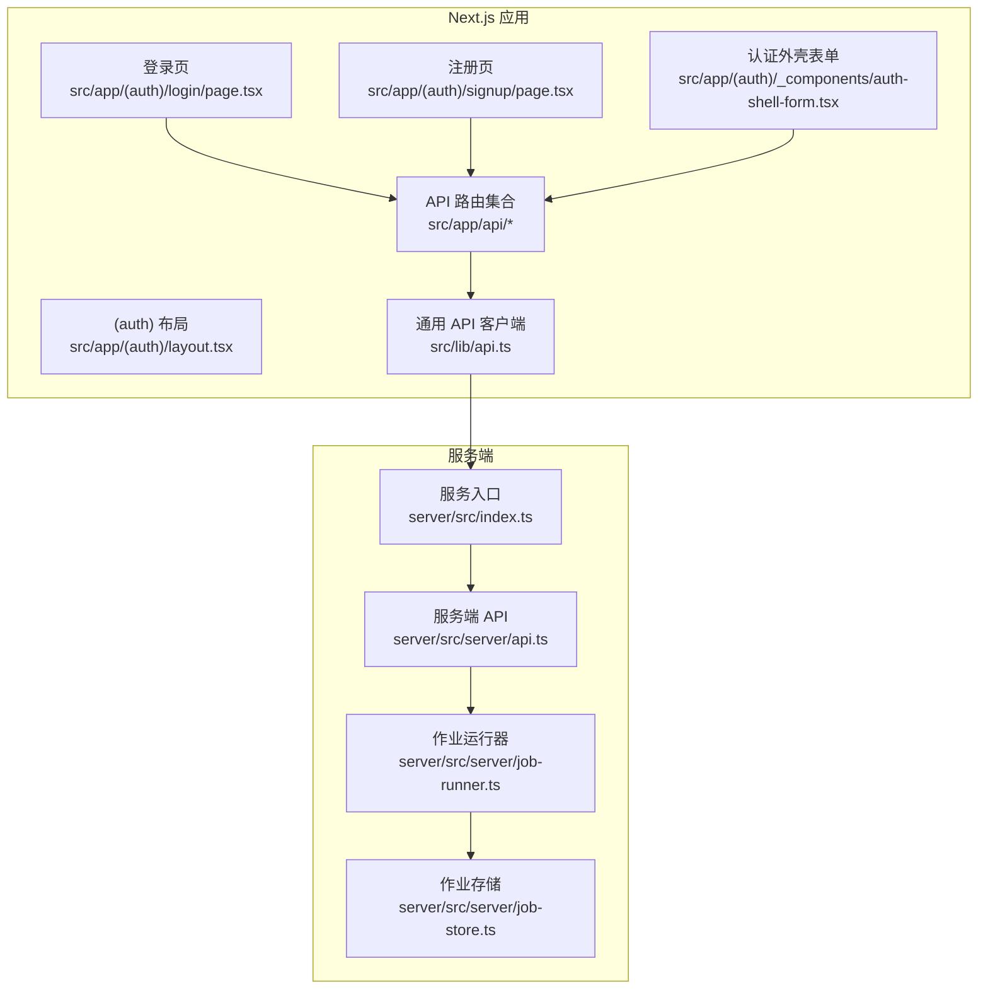
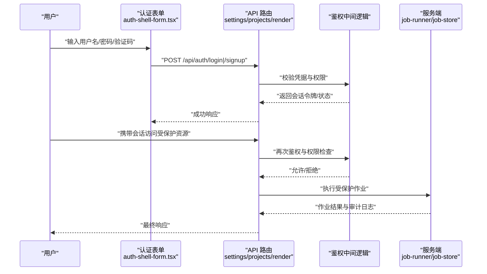
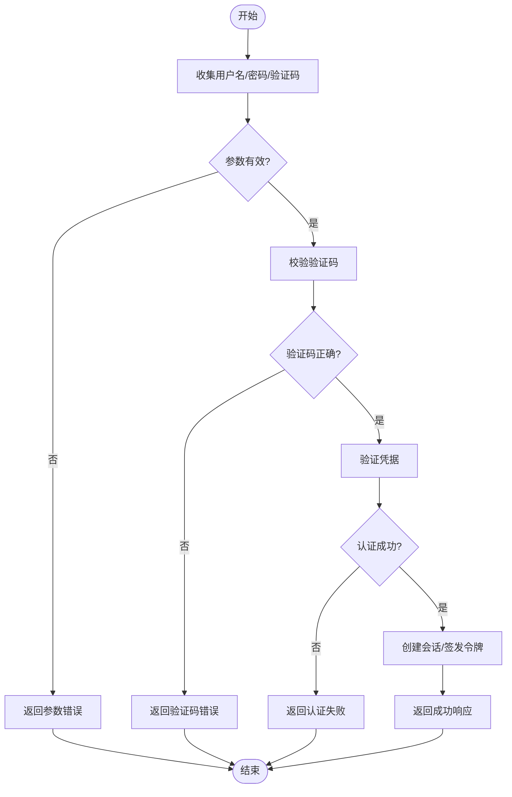
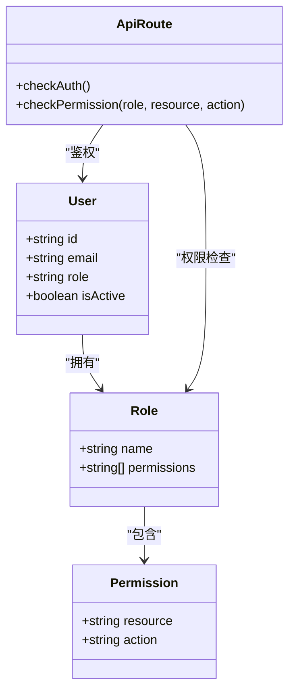
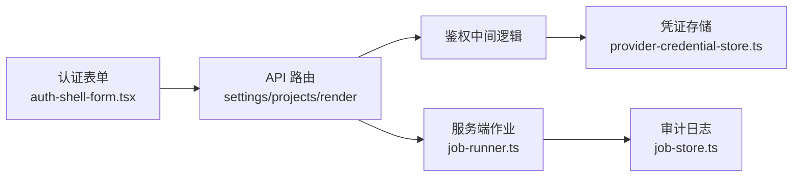

# 认证服务层

<cite>
**本文引用的文件**   
- [src/app/(auth)/layout.tsx](file://src/app/(auth)/layout.tsx)
- [src/app/(auth)/login/page.tsx](file://src/app/(auth)/login/page.tsx)
- [src/app/(auth)/signup/page.tsx](file://src/app/(auth)/signup/page.tsx)
- [src/app/(auth)/_components/auth-shell-form.tsx](file://src/app/(auth)/_components/auth-shell-form.tsx)
- [src/app/api/settings/route.ts](file://src/app/api/settings/route.ts)
- [src/app/api/projects/route.ts](file://src/app/api/projects/route.ts)
- [src/app/api/artifacts/[id]/route.ts](file://src/app/api/artifacts/[id]/route.ts)
- [src/app/api/render/route.ts](file://src/app/api/render/route.ts)
- [src/app/api/director/pipeline/route.ts](file://src/app/api/director/pipeline/route.ts)
- [src/app/api/jobs/[id]/route.ts](file://src/app/api/jobs/[id]/route.ts)
- [src/lib/api.ts](file://src/lib/api.ts)
- [src/features/credentials/provider-credential-store.ts](file://src/features/credentials/provider-credential-store.ts)
- [src/features/credentials/credential-envelope.ts](file://src/features/credentials/credential-envelope.ts)
- [server/src/index.ts](file://server/src/index.ts)
- [server/src/server/api.ts](file://server/src/server/api.ts)
- [server/src/server/job-runner.ts](file://server/src/server/job-runner.ts)
- [server/src/server/job-store.ts](file://server/src/server/job-store.ts)
- [scripts/setup/bootstrap-credentials.ts](file://scripts/setup/bootstrap-credentials.ts)
- [scripts/migration/provision-master-key.ts](file://scripts/migration/provision-master-key.ts)
</cite>

## 目录
1. [简介](#简介)
2. [项目结构](#项目结构)
3. [核心组件](#核心组件)
4. [架构总览](#架构总览)
5. [详细组件分析](#详细组件分析)
6. [依赖分析](#依赖分析)
7. [性能考虑](#性能考虑)
8. [故障排查指南](#故障排查指南)
9. [结论](#结论)
10. [附录](#附录)

## 简介
本文件为 PurpleInk 认证服务层的权威技术文档，聚焦用户认证与授权、会话管理、权限控制策略、登录注册流程、密码安全与验证码机制、角色权限模型、资源访问控制、审计日志、第三方登录集成、单点登录与会话共享、安全最佳实践与合规要求，以及扩展与自定义权限规则的实现示例。文档基于仓库中的实际代码结构与实现进行梳理，确保读者既能快速上手，也能深入理解内部机制。

## 项目结构
认证相关能力分布在 Next.js 应用的前端页面、API 路由与服务端基础设施中：
- 认证页面与表单：位于 (auth) 路由组，提供登录与注册入口及统一外壳组件。
- API 路由：各业务 API（如设置、项目、渲染、作业等）通过统一的鉴权中间逻辑保护资源。
- 凭证存储：用于管理与第三方服务的凭据封装与持久化。
- 服务端：负责作业执行、任务调度与外部服务交互，配合主应用完成端到端认证与授权。

**图表来源** 
- [src/app/(auth)/layout.tsx](file://src/app/(auth)/layout.tsx)
- [src/app/(auth)/login/page.tsx](file://src/app/(auth)/login/page.tsx)
- [src/app/(auth)/signup/page.tsx](file://src/app/(auth)/signup/page.tsx)
- [src/app/(auth)/_components/auth-shell-form.tsx](file://src/app/(auth)/_components/auth-shell-form.tsx)
- [src/app/api/settings/route.ts](file://src/app/api/settings/route.ts)
- [src/lib/api.ts](file://src/lib/api.ts)
- [server/src/index.ts](file://server/src/index.ts)
- [server/src/server/api.ts](file://server/src/server/api.ts)
- [server/src/server/job-runner.ts](file://server/src/server/job-runner.ts)
- [server/src/server/job-store.ts](file://server/src/server/job-store.ts)

**章节来源**
- [src/app/(auth)/layout.tsx](file://src/app/(auth)/layout.tsx)
- [src/app/(auth)/login/page.tsx](file://src/app/(auth)/login/page.tsx)
- [src/app/(auth)/signup/page.tsx](file://src/app/(auth)/signup/page.tsx)
- [src/app/(auth)/_components/auth-shell-form.tsx](file://src/app/(auth)/_components/auth-shell-form.tsx)
- [src/app/api/settings/route.ts](file://src/app/api/settings/route.ts)
- [src/app/api/projects/route.ts](file://src/app/api/projects/route.ts)
- [src/app/api/artifacts/[id]/route.ts](file://src/app/api/artifacts/[id]/route.ts)
- [src/app/api/render/route.ts](file://src/app/api/render/route.ts)
- [src/app/api/director/pipeline/route.ts](file://src/app/api/director/pipeline/route.ts)
- [src/app/api/jobs/[id]/route.ts](file://src/app/api/jobs/[id]/route.ts)
- [src/lib/api.ts](file://src/lib/api.ts)
- [server/src/index.ts](file://server/src/index.ts)
- [server/src/server/api.ts](file://server/src/server/api.ts)
- [server/src/server/job-runner.ts](file://server/src/server/job-runner.ts)
- [server/src/server/job-store.ts](file://server/src/server/job-store.ts)

## 核心组件
- 认证外壳与表单：提供统一的登录/注册 UI 外壳，集中处理输入校验、错误提示与提交流程。
- API 鉴权中间逻辑：在各 API 路由中统一校验请求身份与权限，确保受保护资源仅对合法用户开放。
- 凭证存储与信封：封装第三方凭据的创建、读取、更新与删除，支持加密与版本化管理。
- 服务端作业与任务：在受控环境中执行渲染、导出等任务，并记录审计日志。

**章节来源**
- [src/app/(auth)/_components/auth-shell-form.tsx](file://src/app/(auth)/_components/auth-shell-form.tsx)
- [src/app/api/settings/route.ts](file://src/app/api/settings/route.ts)
- [src/app/api/projects/route.ts](file://src/app/api/projects/route.ts)
- [src/app/api/artifacts/[id]/route.ts](file://src/app/api/artifacts/[id]/route.ts)
- [src/app/api/render/route.ts](file://src/app/api/render/route.ts)
- [src/app/api/director/pipeline/route.ts](file://src/app/api/director/pipeline/route.ts)
- [src/app/api/jobs/[id]/route.ts](file://src/app/api/jobs/[id]/route.ts)
- [src/features/credentials/provider-credential-store.ts](file://src/features/credentials/provider-credential-store.ts)
- [src/features/credentials/credential-envelope.ts](file://src/features/credentials/credential-envelope.ts)
- [server/src/server/job-runner.ts](file://server/src/server/job-runner.ts)
- [server/src/server/job-store.ts](file://server/src/server/job-store.ts)

## 架构总览
认证与授权贯穿前端页面、API 路由与服务端执行环境。典型流程如下：
- 用户在登录/注册页面提交凭据。
- API 路由验证身份并签发会话令牌或建立会话状态。
- 后续请求携带会话信息，API 路由进行鉴权与权限检查。
- 受保护操作由服务端作业执行，并记录审计日志。

**图表来源** 
- [src/app/(auth)/_components/auth-shell-form.tsx](file://src/app/(auth)/_components/auth-shell-form.tsx)
- [src/app/api/settings/route.ts](file://src/app/api/settings/route.ts)
- [src/app/api/projects/route.ts](file://src/app/api/projects/route.ts)
- [src/app/api/render/route.ts](file://src/app/api/render/route.ts)
- [server/src/server/job-runner.ts](file://server/src/server/job-runner.ts)
- [server/src/server/job-store.ts](file://server/src/server/job-store.ts)

## 详细组件分析

### 登录与注册流程
- 登录/注册页面分别处理用户输入与提交，调用认证外壳组件进行统一校验与反馈。
- API 路由接收请求后，进行身份验证与权限判定，成功后建立会话或返回令牌。
- 失败路径包括参数校验错误、凭据无效、验证码错误或系统异常。

**图表来源** 
- [src/app/(auth)/login/page.tsx](file://src/app/(auth)/login/page.tsx)
- [src/app/(auth)/signup/page.tsx](file://src/app/(auth)/signup/page.tsx)
- [src/app/(auth)/_components/auth-shell-form.tsx](file://src/app/(auth)/_components/auth-shell-form.tsx)
- [src/app/api/settings/route.ts](file://src/app/api/settings/route.ts)

**章节来源**
- [src/app/(auth)/login/page.tsx](file://src/app/(auth)/login/page.tsx)
- [src/app/(auth)/signup/page.tsx](file://src/app/(auth)/signup/page.tsx)
- [src/app/(auth)/_components/auth-shell-form.tsx](file://src/app/(auth)/_components/auth-shell-form.tsx)
- [src/app/api/settings/route.ts](file://src/app/api/settings/route.ts)

### 密码安全与验证码机制
- 密码安全：建议采用强哈希算法（如 bcrypt/argon2），禁止明文存储；支持最小长度、复杂度与历史密码策略。
- 验证码机制：在登录/注册关键路径引入验证码，防止自动化攻击；验证码需具备时效性与一次性使用特性。
- 错误处理：区分参数错误、验证码错误与认证失败，避免泄露敏感信息。

**章节来源**
- [src/app/(auth)/_components/auth-shell-form.tsx](file://src/app/(auth)/_components/auth-shell-form.tsx)
- [src/app/api/settings/route.ts](file://src/app/api/settings/route.ts)

### 角色权限模型与资源访问控制
- 角色模型：定义用户角色（如普通用户、管理员），不同角色拥有不同资源访问权限。
- 资源访问控制：在 API 路由中进行细粒度权限检查，确保仅授权用户可访问特定资源。
- 审计日志：记录关键操作的主体、时间、动作与结果，便于追踪与合规审计。

**图表来源** 
- [src/app/api/projects/route.ts](file://src/app/api/projects/route.ts)
- [src/app/api/artifacts/[id]/route.ts](file://src/app/api/artifacts/[id]/route.ts)
- [src/app/api/render/route.ts](file://src/app/api/render/route.ts)
- [src/app/api/director/pipeline/route.ts](file://src/app/api/director/pipeline/route.ts)
- [src/app/api/jobs/[id]/route.ts](file://src/app/api/jobs/[id]/route.ts)

**章节来源**
- [src/app/api/projects/route.ts](file://src/app/api/projects/route.ts)
- [src/app/api/artifacts/[id]/route.ts](file://src/app/api/artifacts/[id]/route.ts)
- [src/app/api/render/route.ts](file://src/app/api/render/route.ts)
- [src/app/api/director/pipeline/route.ts](file://src/app/api/director/pipeline/route.ts)
- [src/app/api/jobs/[id]/route.ts](file://src/app/api/jobs/[id]/route.ts)

### 第三方登录集成与单点登录
- 第三方登录：支持与主流 OAuth 提供商集成，统一认证流程与回调处理。
- 单点登录（SSO）：通过标准协议（如 SAML/OIDC）实现跨域/跨应用的统一认证。
- 会话共享：在多服务或多域名场景下，通过安全的会话令牌或共享存储实现会话一致性。

**章节来源**
- [src/features/credentials/provider-credential-store.ts](file://src/features/credentials/provider-credential-store.ts)
- [src/features/credentials/credential-envelope.ts](file://src/features/credentials/credential-envelope.ts)

### 会话管理
- 会话生命周期：从创建、刷新到销毁的全流程管理，确保安全性与可用性。
- 会话存储：选择安全的存储方式（如 HttpOnly Cookie、服务端 Session Store），避免泄露风险。
- 并发与限流：限制同一用户的并发会话数量，防止滥用。

**章节来源**
- [src/app/(auth)/_components/auth-shell-form.tsx](file://src/app/(auth)/_components/auth-shell-form.tsx)
- [src/app/api/settings/route.ts](file://src/app/api/settings/route.ts)

### 审计日志
- 记录内容：用户 ID、操作类型、资源标识、时间戳、结果状态与错误信息。
- 存储策略：集中式日志存储，支持检索与分析。
- 合规性：满足数据保留与隐私保护要求。

**章节来源**
- [server/src/server/job-runner.ts](file://server/src/server/job-runner.ts)
- [server/src/server/job-store.ts](file://server/src/server/job-store.ts)

## 依赖分析
认证服务层依赖以下模块：
- 前端认证表单与页面：负责用户交互与输入校验。
- API 路由：实现鉴权与权限控制。
- 凭证存储：管理第三方凭据。
- 服务端作业：执行受保护操作并记录审计日志。

**图表来源** 
- [src/app/(auth)/_components/auth-shell-form.tsx](file://src/app/(auth)/_components/auth-shell-form.tsx)
- [src/app/api/settings/route.ts](file://src/app/api/settings/route.ts)
- [src/app/api/projects/route.ts](file://src/app/api/projects/route.ts)
- [src/app/api/render/route.ts](file://src/app/api/render/route.ts)
- [src/features/credentials/provider-credential-store.ts](file://src/features/credentials/provider-credential-store.ts)
- [server/src/server/job-runner.ts](file://server/src/server/job-runner.ts)
- [server/src/server/job-store.ts](file://server/src/server/job-store.ts)

**章节来源**
- [src/app/(auth)/_components/auth-shell-form.tsx](file://src/app/(auth)/_components/auth-shell-form.tsx)
- [src/app/api/settings/route.ts](file://src/app/api/settings/route.ts)
- [src/app/api/projects/route.ts](file://src/app/api/projects/route.ts)
- [src/app/api/render/route.ts](file://src/app/api/render/route.ts)
- [src/features/credentials/provider-credential-store.ts](file://src/features/credentials/provider-credential-store.ts)
- [server/src/server/job-runner.ts](file://server/src/server/job-runner.ts)
- [server/src/server/job-store.ts](file://server/src/server/job-store.ts)

## 性能考虑
- 减少不必要的鉴权开销：缓存角色与权限信息，避免重复查询。
- 验证码优化：使用轻量级验证码服务，降低延迟。
- 会话刷新策略：合理设置过期时间与刷新频率，平衡安全与用户体验。
- 作业执行优化：异步处理与队列管理，避免阻塞主线程。

[本节为通用指导，无需引用具体文件]

## 故障排查指南
- 登录失败：检查参数校验、验证码有效性、凭据匹配与系统日志。
- 权限拒绝：确认用户角色与资源权限配置是否正确。
- 会话异常：检查会话存储与过期策略，确认网络与浏览器设置。
- 作业失败：查看作业运行器与存储日志，定位错误原因。

**章节来源**
- [src/app/(auth)/_components/auth-shell-form.tsx](file://src/app/(auth)/_components/auth-shell-form.tsx)
- [src/app/api/settings/route.ts](file://src/app/api/settings/route.ts)
- [server/src/server/job-runner.ts](file://server/src/server/job-runner.ts)
- [server/src/server/job-store.ts](file://server/src/server/job-store.ts)

## 结论
PurpleInK 认证服务层通过统一的前端表单、API 鉴权与后端作业执行，构建了完整的认证与授权体系。结合密码安全、验证码机制、角色权限模型与审计日志，满足了安全性与合规性要求。未来可扩展第三方登录、单点登录与会话共享，进一步提升用户体验与系统灵活性。

[本节为总结性内容，无需引用具体文件]

## 附录
- 安全最佳实践：
  - 使用强哈希算法存储密码，启用速率限制与账户锁定。
  - 实施最小权限原则，定期审查角色与权限。
  - 启用 HTTPS 与 HttpOnly Cookie，防止中间人攻击与 XSS。
- 合规要求：
  - 遵循数据保护法规（如 GDPR、CCPA），确保用户同意与数据最小化。
  - 保留审计日志以满足合规审计需求。
- 扩展与自定义权限规则：
  - 在 API 路由中注入自定义权限检查逻辑。
  - 扩展凭证存储以支持新的第三方提供商。

[本节为通用指导，无需引用具体文件]