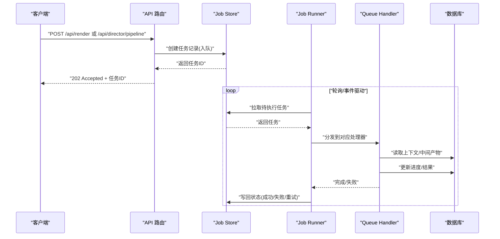
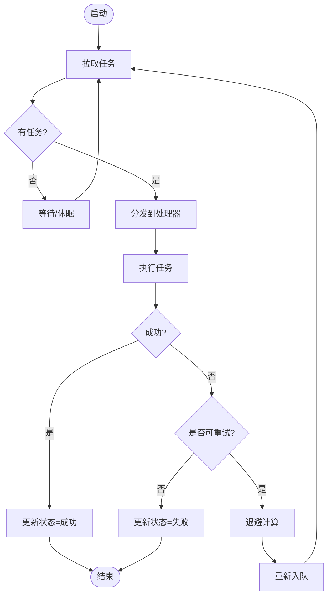
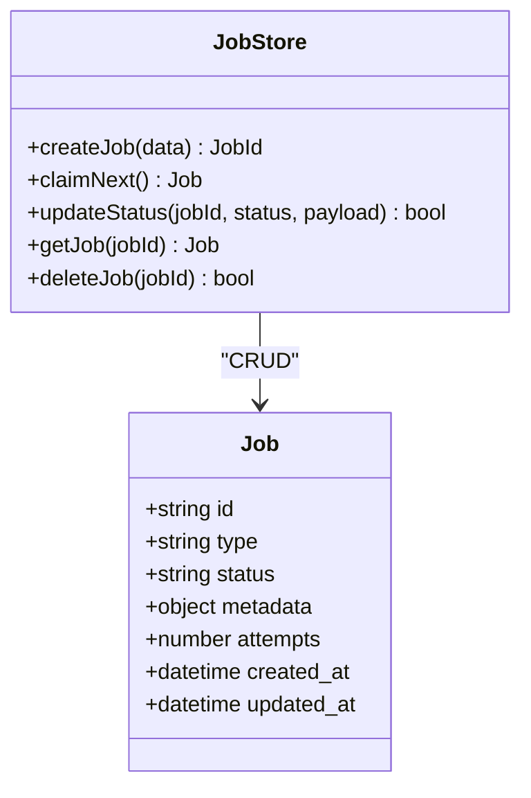
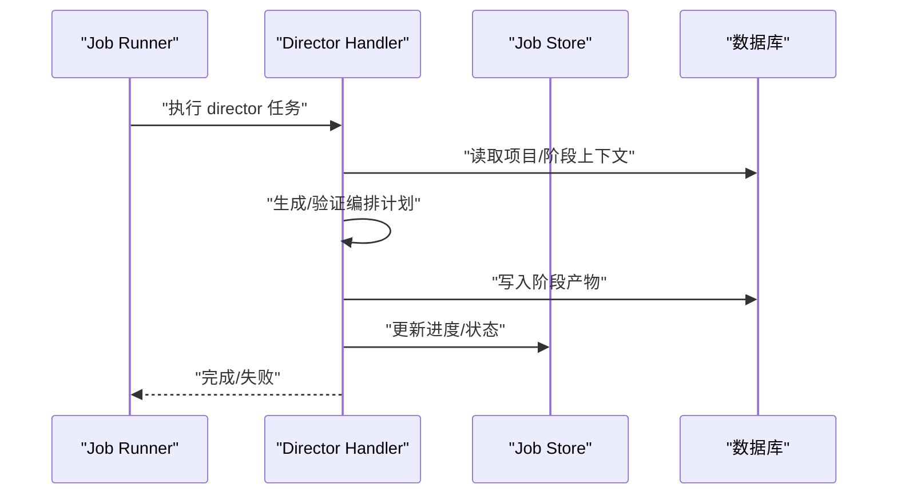
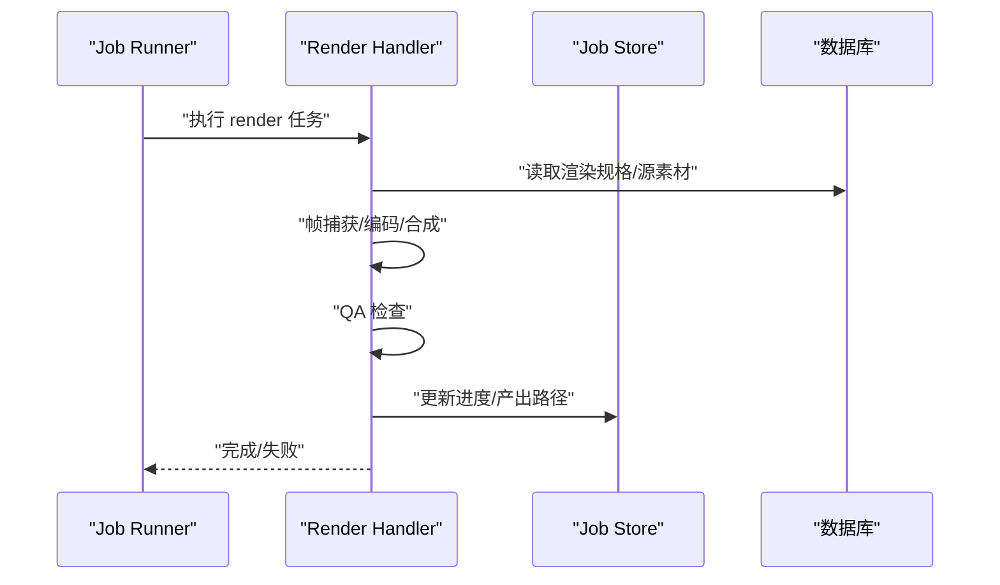
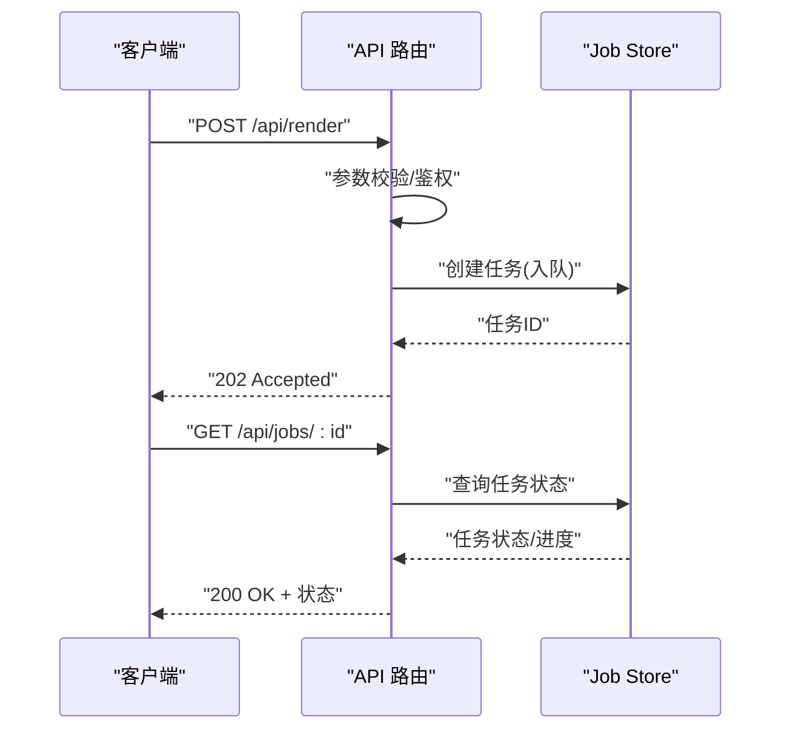
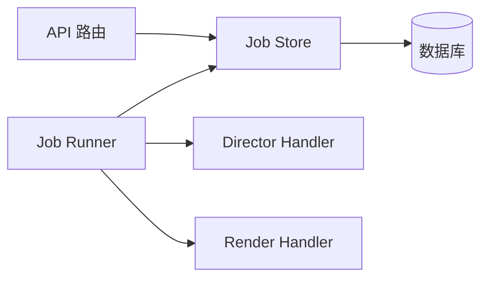

# 队列服务层

<cite>
**本文引用的文件**   
- [server/src/index.ts](file://server/src/index.ts)
- [server/src/server/job-runner.ts](file://server/src/server/job-runner.ts)
- [server/src/server/job-store.ts](file://server/src/server/job-store.ts)
- [src/features/director/queue-handler.ts](file://src/features/director/queue-handler.ts)
- [src/features/render/queue-handler.ts](file://src/features/render/queue-handler.ts)
- [src/lib/queue/index.ts](file://src/lib/queue/index.ts)
- [src/app/api/jobs/[id]/route.ts](file://src/app/api/jobs/[id]/route.ts)
- [src/app/api/render/route.ts](file://src/app/api/render/route.ts)
- [src/app/api/director/pipeline/route.ts](file://src/app/api/director/pipeline/route.ts)
- [deploy/compose.yaml](file://deploy/compose.yaml)
- [deploy/env.example](file://deploy/env.example)
- [deploy/worker.env.example](file://deploy/worker.env.example)
</cite>

## 目录
1. [简介](#简介)
2. [项目结构](#项目结构)
3. [核心组件](#核心组件)
4. [架构总览](#架构总览)
5. [详细组件分析](#详细组件分析)
6. [依赖关系分析](#依赖关系分析)
7. [性能考量](#性能考量)
8. [故障排查指南](#故障排查指南)
9. [结论](#结论)
10. [附录](#附录)

## 简介
本文件为 PurpleInk 的“队列服务层”提供系统化文档，聚焦异步任务队列的架构、调度与执行机制。内容涵盖：
- 任务优先级、重试策略与失败处理
- 分布式任务处理、负载均衡与状态同步
- 任务监控、性能指标与故障诊断
- 任务持久化、恢复机制与数据一致性
- 自定义任务类型与处理器开发示例

该服务层通过 API 路由将请求入队，由后台 Worker 进程消费队列并执行具体业务（导演编排、渲染导出等），并通过数据库进行状态持久化与一致性保障。

## 项目结构
队列相关代码主要分布在以下位置：
- server 子工程：Worker 运行时、Job Runner、Job Store
- src/features：领域级队列处理器（director、render）
- src/lib/queue：通用队列能力（如抽象接口或工具）
- src/app/api：HTTP 入口，负责接收请求并投递到队列
- deploy：容器编排与环境配置

```mermaid
graph TB
subgraph "Web 进程"
API_Jobs["API: /api/jobs/[id]"]
API_Render["API: /api/render"]
API_Director["API: /api/director/pipeline"]
end
subgraph "Worker 进程"
JobRunner["Job Runner"]
JobStore["Job Store"]
QH_Director["Director Queue Handler"]
QH_Render["Render Queue Handler"]
end
DB[("数据库")]
API_Jobs --> |提交/查询任务| JobStore
API_Render --> |提交渲染任务| JobStore
API_Director --> |提交编排任务| JobStore
JobStore < --> DB
JobRunner --> JobStore
JobRunner --> QH_Director
JobRunner --> QH_Render
```

图表来源
- [server/src/server/job-runner.ts](file://server/src/server/job-runner.ts)
- [server/src/server/job-store.ts](file://server/src/server/job-store.ts)
- [src/features/director/queue-handler.ts](file://src/features/director/queue-handler.ts)
- [src/features/render/queue-handler.ts](file://src/features/render/queue-handler.ts)
- [src/app/api/jobs/[id]/route.ts](file://src/app/api/jobs/[id]/route.ts)
- [src/app/api/render/route.ts](file://src/app/api/render/route.ts)
- [src/app/api/director/pipeline/route.ts](file://src/app/api/director/pipeline/route.ts)

章节来源
- [server/src/index.ts](file://server/src/index.ts)
- [deploy/compose.yaml](file://deploy/compose.yaml)

## 核心组件
- Job Runner（任务运行器）
  - 负责从 Job Store 拉取任务、分配给对应处理器、管理生命周期与重试
  - 支持并发控制、超时与错误隔离
- Job Store（任务存储）
  - 抽象任务持久化与查询接口，对接数据库
  - 提供入队、出队、状态更新、幂等与事务语义
- Queue Handlers（队列处理器）
  - 按领域划分：导演编排（director）、渲染导出（render）
  - 实现具体业务逻辑、资源清理与结果落库
- API 路由（入队与查询）
  - 统一暴露 HTTP 接口，校验参数、写入 Job Store，返回任务 ID
  - 提供任务状态查询与进度获取

章节来源
- [server/src/server/job-runner.ts](file://server/src/server/job-runner.ts)
- [server/src/server/job-store.ts](file://server/src/server/job-store.ts)
- [src/features/director/queue-handler.ts](file://src/features/director/queue-handler.ts)
- [src/features/render/queue-handler.ts](file://src/features/render/queue-handler.ts)
- [src/app/api/jobs/[id]/route.ts](file://src/app/api/jobs/[id]/route.ts)
- [src/app/api/render/route.ts](file://src/app/api/render/route.ts)
- [src/app/api/director/pipeline/route.ts](file://src/app/api/director/pipeline/route.ts)

## 架构总览
下图展示请求从 Web 进程进入，经 API 路由入队，再由 Worker 进程中的 Job Runner 调度执行，最终通过 Job Store 持久化的完整流程。



图表来源
- [src/app/api/render/route.ts](file://src/app/api/render/route.ts)
- [src/app/api/director/pipeline/route.ts](file://src/app/api/director/pipeline/route.ts)
- [server/src/server/job-store.ts](file://server/src/server/job-store.ts)
- [server/src/server/job-runner.ts](file://server/src/server/job-runner.ts)
- [src/features/render/queue-handler.ts](file://src/features/render/queue-handler.ts)
- [src/features/director/queue-handler.ts](file://src/features/director/queue-handler.ts)

## 详细组件分析

### Job Runner（任务运行器）
- 职责
  - 周期性或事件驱动地从 Job Store 拉取任务
  - 根据任务类型分发给对应的 Queue Handler
  - 管理执行上下文、超时、重试与失败回滚
- 关键行为
  - 并发控制：限制同时运行的任务数，避免资源争用
  - 幂等性：同一任务多次拉取不会重复执行
  - 可观测性：记录开始/结束时间、错误堆栈、进度指标



图表来源
- [server/src/server/job-runner.ts](file://server/src/server/job-runner.ts)

章节来源
- [server/src/server/job-runner.ts](file://server/src/server/job-runner.ts)

### Job Store（任务存储）
- 职责
  - 定义任务的持久化模型与操作接口（创建、查询、更新、删除）
  - 保证事务性与一致性，支持幂等写入与乐观锁
- 关键行为
  - 入队：生成唯一任务 ID，设置初始状态与元数据
  - 出队：基于优先级/队列名选择任务，加锁防止重复消费
  - 状态机：pending -> running -> completed | failed | retrying
  - 审计：记录变更日志与错误信息



图表来源
- [server/src/server/job-store.ts](file://server/src/server/job-store.ts)

章节来源
- [server/src/server/job-store.ts](file://server/src/server/job-store.ts)

### Director Queue Handler（导演编排处理器）
- 职责
  - 消费“导演编排”类型的任务，协调多阶段流水线
  - 管理阶段间产物、提示词组装与结果合并
- 关键行为
  - 阶段推进：按顺序或条件分支推进 stage
  - 错误恢复：对可恢复错误进行局部重试
  - 结果落库：保存编排计划与中间产物



图表来源
- [src/features/director/queue-handler.ts](file://src/features/director/queue-handler.ts)

章节来源
- [src/features/director/queue-handler.ts](file://src/features/director/queue-handler.ts)

### Render Queue Handler（渲染导出处理器）
- 职责
  - 消费“渲染导出”类型的任务，执行帧捕获、编码、合成与 QA
  - 管理临时文件、缓存与输出制品
- 关键行为
  - 资源隔离：每个任务独立工作目录
  - 断点续跑：支持从最近成功阶段恢复
  - 质量检查：视觉/音频 QA 门禁



图表来源
- [src/features/render/queue-handler.ts](file://src/features/render/queue-handler.ts)

章节来源
- [src/features/render/queue-handler.ts](file://src/features/render/queue-handler.ts)

### API 路由（入队与查询）
- /api/render
  - 接收渲染请求，校验参数，写入 Job Store，返回任务 ID
- /api/director/pipeline
  - 接收编排请求，校验参数，写入 Job Store，返回任务 ID
- /api/jobs/[id]
  - 查询任务状态、进度与错误信息



图表来源
- [src/app/api/render/route.ts](file://src/app/api/render/route.ts)
- [src/app/api/director/pipeline/route.ts](file://src/app/api/director/pipeline/route.ts)
- [src/app/api/jobs/[id]/route.ts](file://src/app/api/jobs/[id]/route.ts)
- [server/src/server/job-store.ts](file://server/src/server/job-store.ts)

章节来源
- [src/app/api/render/route.ts](file://src/app/api/render/route.ts)
- [src/app/api/director/pipeline/route.ts](file://src/app/api/director/pipeline/route.ts)
- [src/app/api/jobs/[id]/route.ts](file://src/app/api/jobs/[id]/route.ts)

## 依赖关系分析
- 组件耦合
  - Job Runner 依赖 Job Store 与具体 Queue Handler
  - API 路由仅依赖 Job Store，保持无状态
- 外部依赖
  - 数据库：用于任务状态、中间产物与结果持久化
  - 可选消息总线/对象存储：扩展高吞吐场景
- 潜在循环依赖
  - 通过接口解耦（Job Store 抽象、Handler 注册表）避免循环



图表来源
- [server/src/server/job-runner.ts](file://server/src/server/job-runner.ts)
- [server/src/server/job-store.ts](file://server/src/server/job-store.ts)
- [src/features/director/queue-handler.ts](file://src/features/director/queue-handler.ts)
- [src/features/render/queue-handler.ts](file://src/features/render/queue-handler.ts)

章节来源
- [server/src/server/job-runner.ts](file://server/src/server/job-runner.ts)
- [server/src/server/job-store.ts](file://server/src/server/job-store.ts)
- [src/features/director/queue-handler.ts](file://src/features/director/queue-handler.ts)
- [src/features/render/queue-handler.ts](file://src/features/render/queue-handler.ts)

## 性能考量
- 并发与限流
  - 合理设置 Worker 并发度，避免 CPU/IO 瓶颈
  - 针对 I/O 密集型任务（渲染）与 CPU 密集型任务（AI 编排）分别扩缩容
- 队列设计
  - 按任务类型拆分队列，避免长尾阻塞
  - 使用优先级队列满足紧急任务优先
- 存储优化
  - 批量更新状态，减少数据库往返
  - 大对象走对象存储，数据库仅存引用
- 可观测性
  - 采集任务耗时、成功率、重试率、队列长度等指标
  - 结构化日志便于追踪与排障

## 故障排查指南
- 常见问题
  - 任务堆积：检查 Worker 数量、处理器耗时、下游依赖延迟
  - 频繁重试：定位不稳定依赖（网络、第三方 API），调整退避策略
  - 状态不一致：确认 Job Store 的事务与幂等性是否正确
- 诊断步骤
  - 查看任务状态与错误堆栈
  - 检查数据库锁与事务冲突
  - 核对处理器日志与资源占用
- 恢复策略
  - 失败任务自动重试（指数退避）
  - 死信队列归档不可恢复任务
  - 人工介入重放关键任务

章节来源
- [server/src/server/job-runner.ts](file://server/src/server/job-runner.ts)
- [server/src/server/job-store.ts](file://server/src/server/job-store.ts)

## 结论
PurpleInk 队列服务层以 Job Runner + Job Store + 领域处理器为核心，实现了可扩展、可观测、可恢复的异步任务处理能力。通过清晰的职责边界与接口抽象，系统能够灵活扩展新的任务类型与处理器，并在分布式环境下保持稳定与一致。

## 附录

### 部署与运行
- 容器编排
  - Web 与 Worker 分离部署，Worker 通过环境变量配置并发与队列参数
- 环境变量
  - 数据库连接、队列参数、处理器开关等

章节来源
- [deploy/compose.yaml](file://deploy/compose.yaml)
- [deploy/env.example](file://deploy/env.example)
- [deploy/worker.env.example](file://deploy/worker.env.example)

### 自定义任务类型与处理器开发示例
- 新增任务类型
  - 在 Job Store 中扩展任务类型枚举与元数据字段
  - 在 API 路由中增加入队端点，校验并写入 Job Store
- 实现处理器
  - 新建处理器文件，实现标准接口（初始化、执行、清理）
  - 在 Job Runner 中注册处理器映射
- 测试与上线
  - 单元测试覆盖正常/异常路径
  - 集成测试验证端到端流程
  - 灰度发布与指标监控

章节来源
- [src/features/director/queue-handler.ts](file://src/features/director/queue-handler.ts)
- [src/features/render/queue-handler.ts](file://src/features/render/queue-handler.ts)
- [server/src/server/job-runner.ts](file://server/src/server/job-runner.ts)
- [server/src/server/job-store.ts](file://server/src/server/job-store.ts)
- [src/app/api/render/route.ts](file://src/app/api/render/route.ts)
- [src/app/api/director/pipeline/route.ts](file://src/app/api/director/pipeline/route.ts)