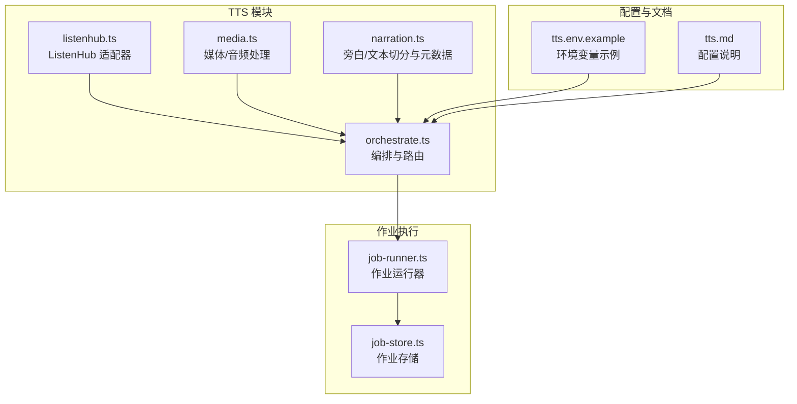
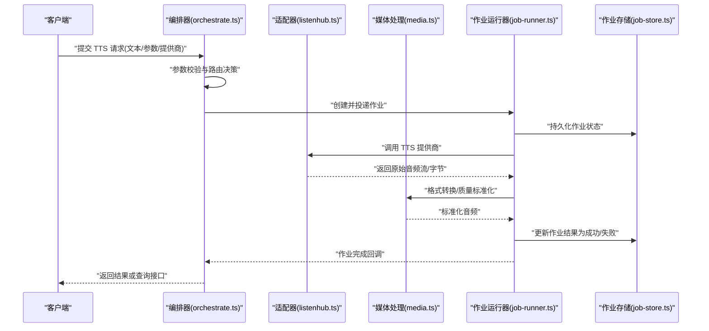
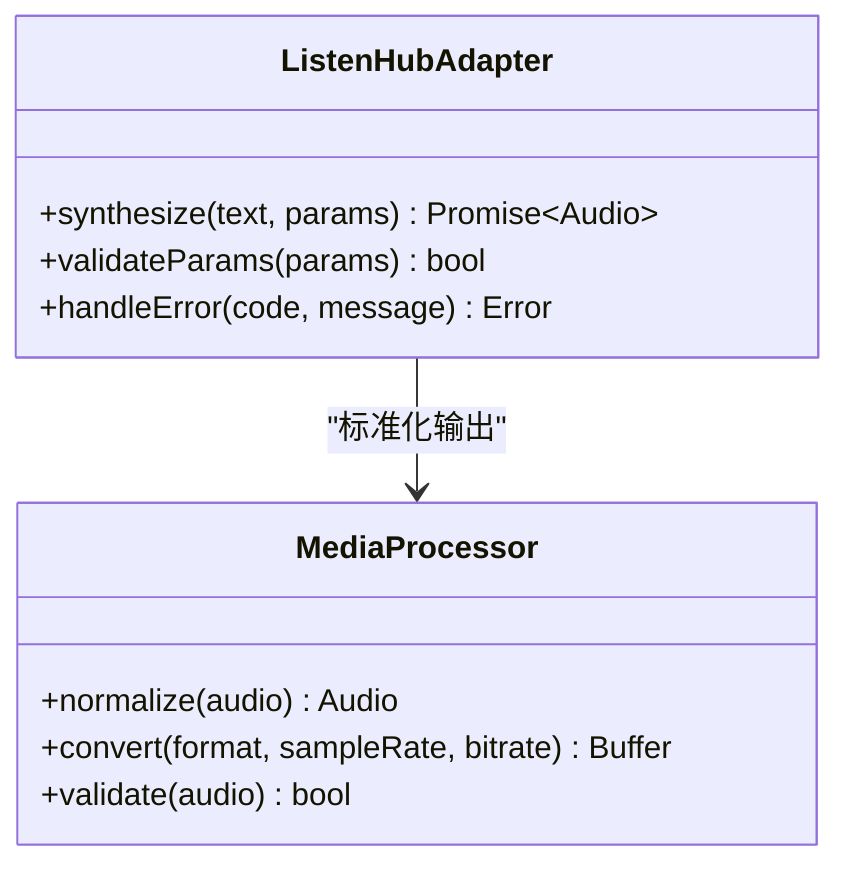
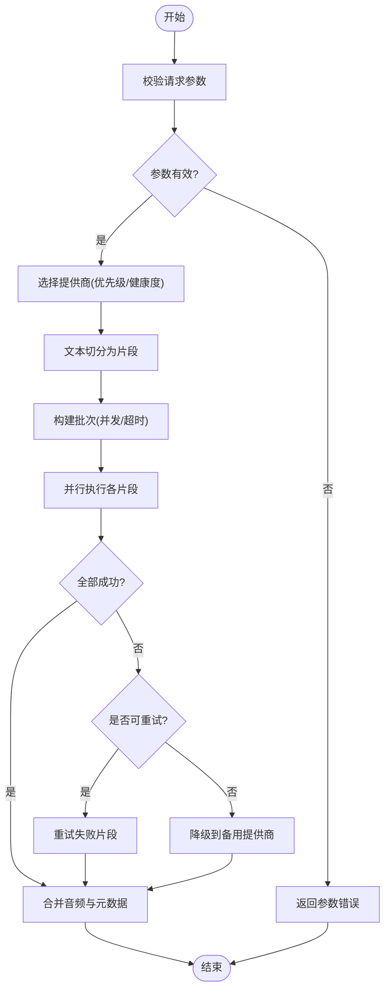
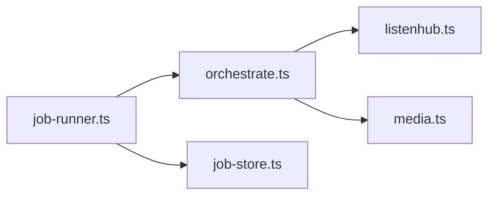

# TTS 语音合成服务

<cite>
**本文引用的文件**   
- [server/src/tts/listenhub.ts](file://server/src/tts/listenhub.ts)
- [server/src/tts/media.ts](file://server/src/tts/media.ts)
- [server/src/tts/narration.ts](file://server/src/tts/narration.ts)
- [server/src/tts/orchestrate.ts](file://server/src/tts/orchestrate.ts)
- [server/src/server/job-runner.ts](file://server/src/server/job-runner.ts)
- [server/src/server/job-store.ts](file://server/src/server/job-store.ts)
- [server/package.json](file://server/package.json)
- [config/tts.env.example](file://config/tts.env.example)
- [docs/configuration/tts.md](file://docs/configuration/tts.md)
- [tests/tts-config.test.ts](file://tests/tts-config.test.ts)
- [tests/tts-narration.test.ts](file://tests/tts-narration.test.ts)
- [tests/tts-orchestration.test.ts](file://tests/tts-orchestration.test.ts)
- [tests/tts-pipeline-integration.test.ts](file://tests/tts-pipeline-integration.test.ts)
- [tests/tts-runtime.test.ts](file://tests/tts-runtime.test.ts)
</cite>

## 目录
1. [简介](#简介)
2. [项目结构](#项目结构)
3. [核心组件](#核心组件)
4. [架构总览](#架构总览)
5. [详细组件分析](#详细组件分析)
6. [依赖关系分析](#依赖关系分析)
7. [性能考虑](#性能考虑)
8. [故障排查指南](#故障排查指南)
9. [结论](#结论)
10. [附录](#附录)

## 简介
本文件为 TTS（文本转语音）语音合成服务的完整技术文档。内容覆盖多提供商 TTS 集成架构（ListenHub、Mimo、StepFun 等）、请求处理流程、队列与异步任务调度、音频格式与音质参数配置、批量处理能力、错误处理与重试机制、降级策略，以及自定义 TTS 提供商的集成示例与性能优化建议。读者无需深入源码即可理解系统设计与使用方式。

## 项目结构
TTS 相关代码主要位于 server/src/tts 目录，配合 server/src/server 中的作业运行器与存储实现，形成“接入层 + 编排层 + 执行层”的分层架构。配置与示例在 config 与 docs 中提供，测试用例覆盖配置、编排、运行时与集成路径。

图表来源
- [server/src/tts/listenhub.ts](file://server/src/tts/listenhub.ts)
- [server/src/tts/media.ts](file://server/src/tts/media.ts)
- [server/src/tts/narration.ts](file://server/src/tts/narration.ts)
- [server/src/tts/orchestrate.ts](file://server/src/tts/orchestrate.ts)
- [server/src/server/job-runner.ts](file://server/src/server/job-runner.ts)
- [server/src/server/job-store.ts](file://server/src/server/job-store.ts)
- [config/tts.env.example](file://config/tts.env.example)
- [docs/configuration/tts.md](file://docs/configuration/tts.md)

章节来源
- [server/src/tts/listenhub.ts](file://server/src/tts/listenhub.ts)
- [server/src/tts/media.ts](file://server/src/tts/media.ts)
- [server/src/tts/narration.ts](file://server/src/tts/narration.ts)
- [server/src/tts/orchestrate.ts](file://server/src/tts/orchestrate.ts)
- [server/src/server/job-runner.ts](file://server/src/server/job-runner.ts)
- [server/src/server/job-store.ts](file://server/src/server/job-store.ts)
- [config/tts.env.example](file://config/tts.env.example)
- [docs/configuration/tts.md](file://docs/configuration/tts.md)

## 核心组件
- ListenHub 适配器：封装对 ListenHub TTS 服务的调用，负责鉴权、参数映射与响应解析。
- 媒体处理：统一音频编码、采样率、比特率、格式转换与校验。
- 旁白处理：文本切分、段落对齐、时长估算与元数据生成。
- 编排器：根据配置选择 TTS 提供商、合并结果、管理批次与状态。
- 作业运行器与存储：将 TTS 任务入队、持久化、并发消费与完成回调。

章节来源
- [server/src/tts/listenhub.ts](file://server/src/tts/listenhub.ts)
- [server/src/tts/media.ts](file://server/src/tts/media.ts)
- [server/src/tts/narration.ts](file://server/src/tts/narration.ts)
- [server/src/tts/orchestrate.ts](file://server/src/tts/orchestrate.ts)
- [server/src/server/job-runner.ts](file://server/src/server/job-runner.ts)
- [server/src/server/job-store.ts](file://server/src/server/job-store.ts)

## 架构总览
TTS 服务采用“适配层 + 编排层 + 作业执行”的分层设计。外部请求进入后，由编排器进行参数校验与提供商路由；随后通过具体适配器调用第三方 TTS 服务；音频产物经媒体处理标准化后落库或返回；所有耗时操作通过作业运行器异步执行，支持批量与重试。

图表来源
- [server/src/tts/orchestrate.ts](file://server/src/tts/orchestrate.ts)
- [server/src/tts/listenhub.ts](file://server/src/tts/listenhub.ts)
- [server/src/tts/media.ts](file://server/src/tts/media.ts)
- [server/src/server/job-runner.ts](file://server/src/server/job-runner.ts)
- [server/src/server/job-store.ts](file://server/src/server/job-store.ts)

## 详细组件分析

### 适配器层：ListenHub
- 职责：对接 ListenHub TTS API，处理鉴权、参数映射、流式/非流式响应解析与错误码归一化。
- 关键点：
  - 输入参数映射：文本、音色、语速、音量、语言、输出格式等。
  - 输出处理：二进制音频流或文件路径，统一转换为内部媒体对象。
  - 错误处理：网络异常、限流、鉴权失败等分类与重试策略。
- 扩展点：新增提供商需实现相同接口契约（鉴权、调用、解析）。

图表来源
- [server/src/tts/listenhub.ts](file://server/src/tts/listenhub.ts)
- [server/src/tts/media.ts](file://server/src/tts/media.ts)

章节来源
- [server/src/tts/listenhub.ts](file://server/src/tts/listenhub.ts)
- [server/src/tts/media.ts](file://server/src/tts/media.ts)

### 媒体处理：音频格式与音质
- 职责：统一音频格式（如 MP3、WAV、AAC）、采样率（如 16k/24k/48k）、比特率控制、声道数与时长校验。
- 关键点：
  - 输入校验：长度、采样率范围、格式支持列表。
  - 转码管线：编码器选择、质量控制（CBR/VBR）、元数据写入。
  - 输出规范：固定输出容器与标签，便于下游播放与存储。
- 性能：优先流式处理，减少内存峰值；按需转码避免重复计算。

章节来源
- [server/src/tts/media.ts](file://server/src/tts/media.ts)

### 旁白处理：文本切分与元数据
- 职责：长文本切分为可朗读片段，生成段落级元数据（起止时间、字数、预估时长）。
- 关键点：
  - 切分策略：按标点、语义边界、最大长度限制。
  - 元数据：每段文本、目标提供商、参数快照、关联 ID。
  - 对齐：与最终音频时长对齐，用于字幕与回放。
- 扩展：支持不同语言的断句规则与停顿模型。

章节来源
- [server/src/tts/narration.ts](file://server/src/tts/narration.ts)

### 编排器：路由与批处理
- 职责：接收 TTS 请求，校验参数，选择提供商，组织批次，协调并行与顺序执行，汇总结果。
- 关键点：
  - 路由策略：基于配置与可用性选择提供商（ListenHub/Mimo/StepFun）。
  - 批处理：将长文本拆分为多个子任务，设置并发上限与超时。
  - 状态机：待处理、进行中、成功、失败、重试中。
  - 降级：主提供商失败时自动切换备用提供商。
- 输出：统一的音频片段集合与元数据，供后续拼接或下载。

图表来源
- [server/src/tts/orchestrate.ts](file://server/src/tts/orchestrate.ts)

章节来源
- [server/src/tts/orchestrate.ts](file://server/src/tts/orchestrate.ts)

### 作业运行器与存储：队列与异步调度
- 职责：将 TTS 任务持久化到作业存储，按并发策略消费，处理成功/失败/重试，触发回调。
- 关键点：
  - 入队：创建作业记录，分配优先级与超时。
  - 出队：从队列拉取任务，限制并发，避免过载。
  - 执行：调用编排器与适配器，捕获异常并记录日志。
  - 完成：更新状态，回写结果，触发下游事件。
- 可靠性：幂等性、去重、死信队列与告警。

章节来源
- [server/src/server/job-runner.ts](file://server/src/server/job-runner.ts)
- [server/src/server/job-store.ts](file://server/src/server/job-store.ts)

## 依赖关系分析
- 模块内依赖：
  - 编排器依赖适配器与媒体处理。
  - 适配器依赖媒体处理进行输出标准化。
  - 作业运行器依赖作业存储与编排器。
- 外部依赖：
  - TTS 提供商 API（ListenHub/Mimo/StepFun）。
  - 音频编解码库（由媒体处理模块封装）。
- 潜在循环依赖：无直接循环，通过接口解耦。

图表来源
- [server/src/tts/orchestrate.ts](file://server/src/tts/orchestrate.ts)
- [server/src/tts/listenhub.ts](file://server/src/tts/listenhub.ts)
- [server/src/tts/media.ts](file://server/src/tts/media.ts)
- [server/src/server/job-runner.ts](file://server/src/server/job-runner.ts)
- [server/src/server/job-store.ts](file://server/src/server/job-store.ts)

章节来源
- [server/src/tts/orchestrate.ts](file://server/src/tts/orchestrate.ts)
- [server/src/tts/listenhub.ts](file://server/src/tts/listenhub.ts)
- [server/src/tts/media.ts](file://server/src/tts/media.ts)
- [server/src/server/job-runner.ts](file://server/src/server/job-runner.ts)
- [server/src/server/job-store.ts](file://server/src/server/job-store.ts)

## 性能考虑
- 并发与限流：
  - 作业运行器限制并发度，避免上游提供商限流。
  - 批次大小与超时时间可调，平衡吞吐与延迟。
- 内存与 I/O：
  - 媒体处理尽量流式，避免大文件驻留内存。
  - 使用临时文件与清理策略，防止磁盘膨胀。
- 缓存与复用：
  - 对相同文本与参数的结果进行缓存，减少重复调用。
  - 音频片段预编码，提升拼接效率。
- 监控与指标：
  - 记录各提供商成功率、延迟分布、错误类型。
  - 关键阈值告警（队列积压、失败率上升）。

[本节为通用指导，不直接分析具体文件]

## 故障排查指南
- 常见问题定位：
  - 参数错误：检查文本长度、格式、音色与语言是否受支持。
  - 提供商失败：查看鉴权、限流、网络超时与错误码。
  - 音频异常：确认采样率、比特率与格式兼容性。
- 重试与降级：
  - 自动重试次数与退避策略配置。
  - 备用提供商切换条件与回滚策略。
- 日志与追踪：
  - 作业 ID 贯穿全流程，便于跨模块追踪。
  - 关键节点打点（入队、出队、调用、转码、完成）。

章节来源
- [server/src/server/job-runner.ts](file://server/src/server/job-runner.ts)
- [server/src/server/job-store.ts](file://server/src/server/job-store.ts)
- [server/src/tts/orchestrate.ts](file://server/src/tts/orchestrate.ts)
- [server/src/tts/listenhub.ts](file://server/src/tts/listenhub.ts)
- [server/src/tts/media.ts](file://server/src/tts/media.ts)

## 结论
TTS 语音合成服务通过清晰的层次划分与模块化设计，实现了多提供商的统一接入、稳定的异步作业调度与可靠的音频处理流水线。借助配置驱动的路由与降级策略，系统在可用性与性能之间取得良好平衡。未来可扩展更多 TTS 提供商与增强媒体处理能力，以满足多样化业务需求。

[本节为总结性内容，不直接分析具体文件]

## 附录

### 配置与环境变量
- 环境变量示例：参见 tts.env.example，包含提供商密钥、默认格式、并发度与超时等。
- 配置说明：详见 tts.md，涵盖参数含义、取值范围与生效范围。

章节来源
- [config/tts.env.example](file://config/tts.env.example)
- [docs/configuration/tts.md](file://docs/configuration/tts.md)

### 测试与验证
- 配置测试：tts-config.test.ts 覆盖参数校验与默认值。
- 旁白测试：tts-narration.test.ts 验证文本切分与元数据生成。
- 编排测试：tts-orchestration.test.ts 验证路由、批处理与降级。
- 集成测试：tts-pipeline-integration.test.ts 端到端流程验证。
- 运行时测试：tts-runtime.test.ts 验证作业执行与状态流转。

章节来源
- [tests/tts-config.test.ts](file://tests/tts-config.test.ts)
- [tests/tts-narration.test.ts](file://tests/tts-narration.test.ts)
- [tests/tts-orchestration.test.ts](file://tests/tts-orchestration.test.ts)
- [tests/tts-pipeline-integration.test.ts](file://tests/tts-pipeline-integration.test.ts)
- [tests/tts-runtime.test.ts](file://tests/tts-runtime.test.ts)

### 自定义 TTS 提供商集成示例
- 步骤概览：
  - 新建适配器文件，实现鉴权、参数映射、调用与解析。
  - 在编排器注册新提供商，设置优先级与健康检查。
  - 补充媒体处理支持（如需特定格式或参数）。
  - 添加单元测试与集成测试，确保稳定性。
- 参考实现：
  - 适配器接口与用法可参考 listenhub.ts。
  - 媒体处理规范参考 media.ts。
  - 编排器路由逻辑参考 orchestrate.ts。

章节来源
- [server/src/tts/listenhub.ts](file://server/src/tts/listenhub.ts)
- [server/src/tts/media.ts](file://server/src/tts/media.ts)
- [server/src/tts/orchestrate.ts](file://server/src/tts/orchestrate.ts)

### 包管理与依赖
- 服务器包定义：参见 package.json，包含脚本、依赖与构建配置。

章节来源
- [server/package.json](file://server/package.json)