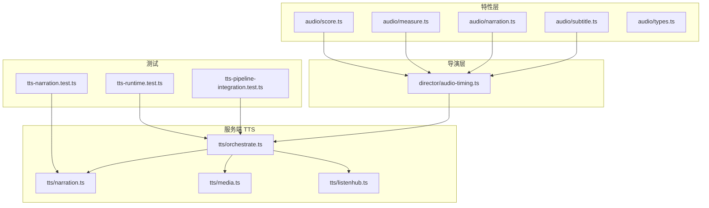
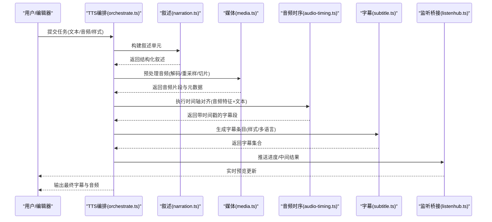
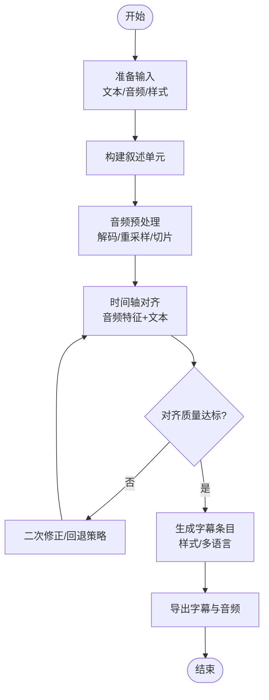
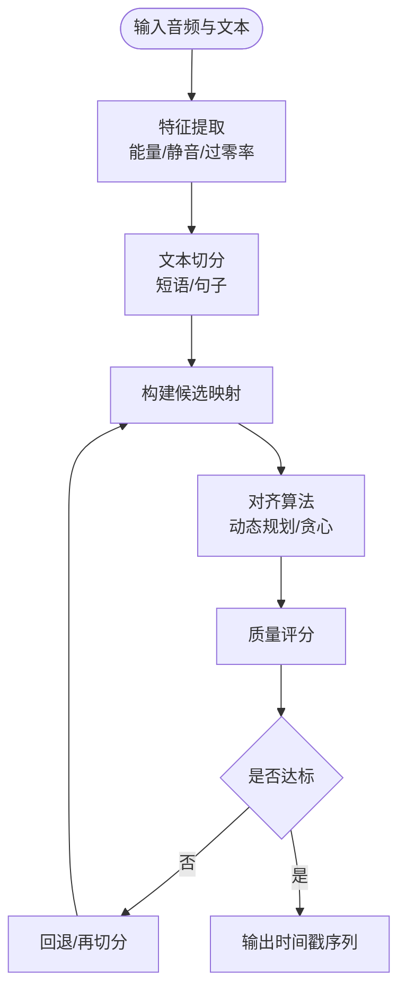
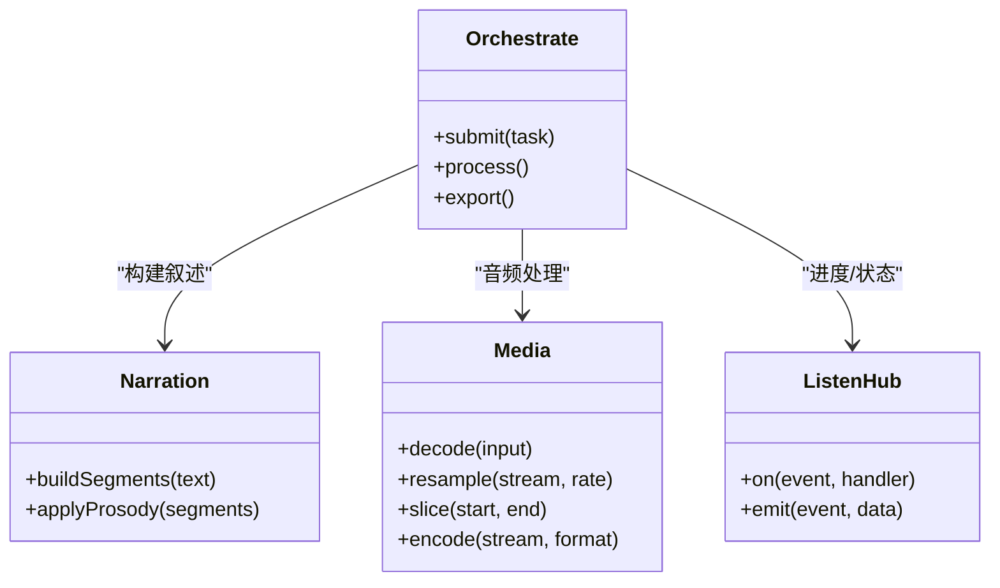
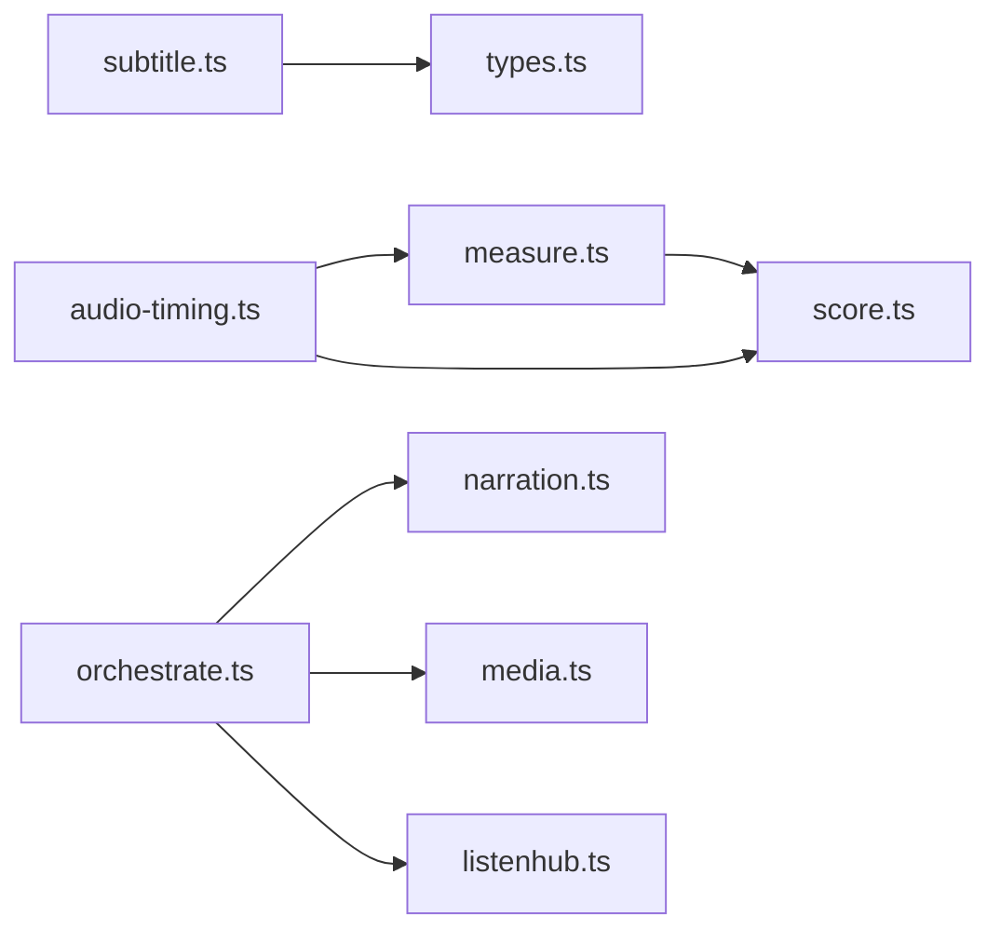

# 字幕生成与同步

<cite>
**本文引用的文件**   
- [src/features/audio/subtitle.ts](file://src/features/audio/subtitle.ts)
- [src/features/audio/narration.ts](file://src/features/audio/narration.ts)
- [src/features/audio/types.ts](file://src/features/audio/types.ts)
- [src/features/audio/measure.ts](file://src/features/audio/measure.ts)
- [src/features/audio/score.ts](file://src/features/audio/score.ts)
- [src/features/director/audio-timing.ts](file://src/features/director/audio-timing.ts)
- [server/src/tts/orchestrate.ts](file://server/src/tts/orchestrate.ts)
- [server/src/tts/narration.ts](file://server/src/tts/narration.ts)
- [server/src/tts/media.ts](file://server/src/tts/media.ts)
- [server/src/tts/listenhub.ts](file://server/src/tts/listenhub.ts)
- [tests/tts-pipeline-integration.test.ts](file://tests/tts-pipeline-integration.test.ts)
- [tests/tts-runtime.test.ts](file://tests/tts-runtime.test.ts)
- [tests/tts-narration.test.ts](file://tests/tts-narration.test.ts)
</cite>

## 目录
1. [简介](#简介)
2. [项目结构](#项目结构)
3. [核心组件](#核心组件)
4. [架构总览](#架构总览)
5. [详细组件分析](#详细组件分析)
6. [依赖关系分析](#依赖关系分析)
7. [性能考量](#性能考量)
8. [故障排查指南](#故障排查指南)
9. [结论](#结论)
10. [附录](#附录)

## 简介
本文件面向“字幕生成与同步系统”，围绕自动字幕生成流程、时间轴对齐算法、语音转文本（TTS）技术、ASS 字幕格式支持、样式定义与视觉效果配置、用户音频时间线管理、片段分割与精确同步机制、字幕样式模板、字体嵌入与多语言支持，以及字幕编辑工具集成与实时预览实现进行系统化说明。文档以仓库中的音频与 TTS 相关模块为依据，结合测试用例与服务器端编排逻辑，给出从输入到输出的端到端视图，并提供可操作的排障建议与优化方向。

## 项目结构
与字幕和 TTS 相关的代码主要分布在以下位置：
- 前端/通用特性层：src/features/audio 下的字幕、音频测量、评分、叙事等能力
- 导演调度层：src/features/director 下的音频时序对齐与管线协调
- 服务端 TTS：server/src/tts 下的编排、媒体处理、叙述生成与监听桥接
- 测试与验证：tests 下覆盖 TTS 管道、运行时行为与叙述生成的关键路径

图表来源
- [src/features/audio/subtitle.ts](file://src/features/audio/subtitle.ts)
- [src/features/audio/narration.ts](file://src/features/audio/narration.ts)
- [src/features/audio/measure.ts](file://src/features/audio/measure.ts)
- [src/features/audio/score.ts](file://src/features/audio/score.ts)
- [src/features/audio/types.ts](file://src/features/audio/types.ts)
- [src/features/director/audio-timing.ts](file://src/features/director/audio-timing.ts)
- [server/src/tts/orchestrate.ts](file://server/src/tts/orchestrate.ts)
- [server/src/tts/narration.ts](file://server/src/tts/narration.ts)
- [server/src/tts/media.ts](file://server/src/tts/media.ts)
- [server/src/tts/listenhub.ts](file://server/src/tts/listenhub.ts)
- [tests/tts-pipeline-integration.test.ts](file://tests/tts-pipeline-integration.test.ts)
- [tests/tts-runtime.test.ts](file://tests/tts-runtime.test.ts)
- [tests/tts-narration.test.ts](file://tests/tts-narration.test.ts)

章节来源
- [src/features/audio/subtitle.ts](file://src/features/audio/subtitle.ts)
- [src/features/audio/narration.ts](file://src/features/audio/narration.ts)
- [src/features/audio/measure.ts](file://src/features/audio/measure.ts)
- [src/features/audio/score.ts](file://src/features/audio/score.ts)
- [src/features/audio/types.ts](file://src/features/audio/types.ts)
- [src/features/director/audio-timing.ts](file://src/features/director/audio-timing.ts)
- [server/src/tts/orchestrate.ts](file://server/src/tts/orchestrate.ts)
- [server/src/tts/narration.ts](file://server/src/tts/narration.ts)
- [server/src/tts/media.ts](file://server/src/tts/media.ts)
- [server/src/tts/listenhub.ts](file://server/src/tts/listenhub.ts)
- [tests/tts-pipeline-integration.test.ts](file://tests/tts-pipeline-integration.test.ts)
- [tests/tts-runtime.test.ts](file://tests/tts-runtime.test.ts)
- [tests/tts-narration.test.ts](file://tests/tts-narration.test.ts)

## 核心组件
- 字幕数据模型与操作（subtitle.ts）
  - 负责字幕条目结构、时间区间、样式引用、多语言字段等基础建模与转换
- 音频测量与评分（measure.ts、score.ts）
  - 提供时长测量、静音检测、能量阈值、分段启发式策略，为时间轴对齐提供信号依据
- 叙述与脚本（narration.ts）
  - 将文本内容组织为可播放的叙述单元，驱动 TTS 合成与字幕切分
- 导演音频时序（audio-timing.ts）
  - 基于音频特征与文本语义进行时间轴对齐，输出带时间戳的字幕序列
- 服务端 TTS 编排（orchestrate.ts）
  - 串联媒体处理、叙述生成、监听回调与结果落盘，形成端到端流水线
- 媒体处理（media.ts）
  - 封装音频解码、重采样、切片、编码等底层能力
- 监听桥接（listenhub.ts）
  - 暴露事件流，供 UI 实时预览与进度反馈

章节来源
- [src/features/audio/subtitle.ts](file://src/features/audio/subtitle.ts)
- [src/features/audio/measure.ts](file://src/features/audio/measure.ts)
- [src/features/audio/score.ts](file://src/features/audio/score.ts)
- [src/features/audio/narration.ts](file://src/features/audio/narration.ts)
- [src/features/director/audio-timing.ts](file://src/features/director/audio-timing.ts)
- [server/src/tts/orchestrate.ts](file://server/src/tts/orchestrate.ts)
- [server/src/tts/media.ts](file://server/src/tts/media.ts)
- [server/src/tts/listenhub.ts](file://server/src/tts/listenhub.ts)

## 架构总览
下图展示从“输入文本/音频”到“字幕与配音”的端到端流程，包括 TTS 合成、时间轴对齐、字幕生成与导出。

图表来源
- [server/src/tts/orchestrate.ts](file://server/src/tts/orchestrate.ts)
- [server/src/tts/narration.ts](file://server/src/tts/narration.ts)
- [server/src/tts/media.ts](file://server/src/tts/media.ts)
- [src/features/director/audio-timing.ts](file://src/features/director/audio-timing.ts)
- [src/features/audio/subtitle.ts](file://src/features/audio/subtitle.ts)
- [server/src/tts/listenhub.ts](file://server/src/tts/listenhub.ts)

## 详细组件分析

### 自动字幕生成流程
- 输入阶段
  - 文本与可选参考音频进入编排器，叙述模块将其拆分为可合成的段落
  - 媒体模块对参考音频进行解码、重采样与必要切片
- 对齐阶段
  - 音频时序模块基于音频能量/静音边界与文本语义进行对齐，产出候选时间戳
  - 评分模块用于评估候选对齐质量，必要时触发回退或二次修正
- 字幕生成阶段
  - 字幕模块根据对齐结果生成条目，填充样式引用、多语言字段与效果标签
- 输出阶段
  - 编排器汇总结果并通过监听桥接推送进度，最终输出字幕文件与配音

图表来源
- [server/src/tts/orchestrate.ts](file://server/src/tts/orchestrate.ts)
- [server/src/tts/narration.ts](file://server/src/tts/narration.ts)
- [server/src/tts/media.ts](file://server/src/tts/media.ts)
- [src/features/director/audio-timing.ts](file://src/features/director/audio-timing.ts)
- [src/features/audio/score.ts](file://src/features/audio/score.ts)
- [src/features/audio/subtitle.ts](file://src/features/audio/subtitle.ts)

章节来源
- [server/src/tts/orchestrate.ts](file://server/src/tts/orchestrate.ts)
- [server/src/tts/narration.ts](file://server/src/tts/narration.ts)
- [server/src/tts/media.ts](file://server/src/tts/media.ts)
- [src/features/director/audio-timing.ts](file://src/features/director/audio-timing.ts)
- [src/features/audio/score.ts](file://src/features/audio/score.ts)
- [src/features/audio/subtitle.ts](file://src/features/audio/subtitle.ts)

### 时间轴对齐算法
- 信号特征提取
  - 使用音频测量模块计算能量包络、静音段、过零率等指标，定位潜在断点
- 文本切分与匹配
  - 将叙述文本按语义切分为短语/句子，与音频片段建立候选映射
- 动态规划/贪心对齐
  - 在候选映射上寻找最优时间戳序列，使文本与音频边界尽可能一致
- 质量评估与修正
  - 通过评分模块对对齐结果打分，低于阈值时触发回退策略（如放宽约束、重新切分）

图表来源
- [src/features/audio/measure.ts](file://src/features/audio/measure.ts)
- [src/features/audio/score.ts](file://src/features/audio/score.ts)
- [src/features/director/audio-timing.ts](file://src/features/director/audio-timing.ts)

章节来源
- [src/features/audio/measure.ts](file://src/features/audio/measure.ts)
- [src/features/audio/score.ts](file://src/features/audio/score.ts)
- [src/features/director/audio-timing.ts](file://src/features/director/audio-timing.ts)

### 语音转文本（TTS）技术与集成
- 叙述生成
  - 将原始文本组织为叙述单元，包含语速、停顿、强调等元信息
- 媒体处理
  - 音频解码、重采样、切片与编码，确保与播放器/渲染器兼容
- 编排与监听
  - 编排器串联各步骤，监听桥接提供进度与中间产物，便于 UI 实时预览
- 测试覆盖
  - 集成测试与运行时测试覆盖端到端流程与关键路径稳定性

图表来源
- [server/src/tts/orchestrate.ts](file://server/src/tts/orchestrate.ts)
- [server/src/tts/narration.ts](file://server/src/tts/narration.ts)
- [server/src/tts/media.ts](file://server/src/tts/media.ts)
- [server/src/tts/listenhub.ts](file://server/src/tts/listenhub.ts)

章节来源
- [server/src/tts/orchestrate.ts](file://server/src/tts/orchestrate.ts)
- [server/src/tts/narration.ts](file://server/src/tts/narration.ts)
- [server/src/tts/media.ts](file://server/src/tts/media.ts)
- [server/src/tts/listenhub.ts](file://server/src/tts/listenhub.ts)
- [tests/tts-pipeline-integration.test.ts](file://tests/tts-pipeline-integration.test.ts)
- [tests/tts-runtime.test.ts](file://tests/tts-runtime.test.ts)
- [tests/tts-narration.test.ts](file://tests/tts-narration.test.ts)

### ASS 字幕格式支持与样式定义
- 字幕条目
  - 每个条目包含起始/结束时间、样式引用、对话内容与多语言字段
- 样式定义
  - 通过样式表定义字体、字号、颜色、描边、阴影、对齐方式等
- 视觉效果
  - 支持动画、淡入淡出、滚动、缩放等特效标签
- 字体嵌入
  - 可在样式中指定字体资源并随字幕文件打包，保证跨平台一致性
- 多语言支持
  - 同一时间轴可承载多种语言版本，切换显示不影响时间线

章节来源
- [src/features/audio/subtitle.ts](file://src/features/audio/subtitle.ts)
- [src/features/audio/types.ts](file://src/features/audio/types.ts)

### 用户音频时间线管理、片段分割与精确同步
- 时间线管理
  - 维护音频轨道、标记点、片段边界与播放头位置
- 片段分割
  - 基于静音检测与能量阈值自动切分，同时允许手动微调
- 精确同步
  - 通过对齐算法与评分校验，确保字幕与音频边界误差控制在毫秒级

章节来源
- [src/features/audio/measure.ts](file://src/features/audio/measure.ts)
- [src/features/director/audio-timing.ts](file://src/features/director/audio-timing.ts)

### 字幕样式模板、字体嵌入与多语言支持
- 样式模板
  - 提供预设模板（标题、正文、注释、翻译），支持主题化与动态切换
- 字体嵌入
  - 将字体文件与样式绑定，导出时一并打包，避免缺失字体导致的渲染差异
- 多语言
  - 同一时间轴内并列存储多语言文本，UI 侧提供语言切换与并行对比

章节来源
- [src/features/audio/subtitle.ts](file://src/features/audio/subtitle.ts)
- [src/features/audio/types.ts](file://src/features/audio/types.ts)

### 字幕编辑工具集成与实时预览
- 编辑集成
  - 通过 API 暴露字幕增删改查接口，编辑器可直接调用
- 实时预览
  - 监听桥接推送进度与中间产物，播放器根据当前时间戳高亮对应字幕
- 示例流程
  - 用户在编辑器修改某条字幕，后端即时重算时间轴并推送到前端预览

章节来源
- [server/src/tts/listenhub.ts](file://server/src/tts/listenhub.ts)
- [server/src/tts/orchestrate.ts](file://server/src/tts/orchestrate.ts)

## 依赖关系分析
- 模块耦合
  - 编排器依赖叙述、媒体与监听桥接；对齐模块依赖测量与评分；字幕模块依赖类型定义
- 外部依赖
  - 媒体处理可能依赖编解码库；TTS 引擎通过编排器抽象接入
- 循环依赖
  - 当前结构未见明显循环依赖，职责边界清晰

图表来源
- [src/features/audio/subtitle.ts](file://src/features/audio/subtitle.ts)
- [src/features/audio/types.ts](file://src/features/audio/types.ts)
- [src/features/audio/measure.ts](file://src/features/audio/measure.ts)
- [src/features/audio/score.ts](file://src/features/audio/score.ts)
- [src/features/director/audio-timing.ts](file://src/features/director/audio-timing.ts)
- [server/src/tts/orchestrate.ts](file://server/src/tts/orchestrate.ts)
- [server/src/tts/narration.ts](file://server/src/tts/narration.ts)
- [server/src/tts/media.ts](file://server/src/tts/media.ts)
- [server/src/tts/listenhub.ts](file://server/src/tts/listenhub.ts)

章节来源
- [src/features/audio/subtitle.ts](file://src/features/audio/subtitle.ts)
- [src/features/audio/types.ts](file://src/features/audio/types.ts)
- [src/features/audio/measure.ts](file://src/features/audio/measure.ts)
- [src/features/audio/score.ts](file://src/features/audio/score.ts)
- [src/features/director/audio-timing.ts](file://src/features/director/audio-timing.ts)
- [server/src/tts/orchestrate.ts](file://server/src/tts/orchestrate.ts)
- [server/src/tts/narration.ts](file://server/src/tts/narration.ts)
- [server/src/tts/media.ts](file://server/src/tts/media.ts)
- [server/src/tts/listenhub.ts](file://server/src/tts/listenhub.ts)

## 性能考量
- 音频预处理
  - 合理设置重采样与切片粒度，避免频繁 IO 与内存抖动
- 对齐算法
  - 采用增量计算与缓存策略，减少重复特征提取
- 并发与队列
  - 编排器应支持任务排队与限流，防止过载
- 导出优化
  - 批量写入与流式编码降低峰值内存占用

[本节为通用指导，不直接分析具体文件]

## 故障排查指南
- 常见症状
  - 字幕与音频不同步、静音误判导致切分错误、样式未生效、字体缺失
- 排查步骤
  - 检查音频测量参数（阈值、窗口大小）
  - 查看对齐评分与回退日志
  - 确认样式模板与字体资源路径
  - 监听桥接事件是否被正确消费
- 定位方法
  - 启用调试日志，观察中间产物（音频片段、时间戳、字幕条目）
  - 使用最小复现用例隔离问题

章节来源
- [src/features/audio/measure.ts](file://src/features/audio/measure.ts)
- [src/features/director/audio-timing.ts](file://src/features/director/audio-timing.ts)
- [server/src/tts/listenhub.ts](file://server/src/tts/listenhub.ts)

## 结论
本系统通过“叙述构建—媒体处理—时间轴对齐—字幕生成—导出”的流水线，实现了高质量的自动字幕生成与精确同步。测量与评分模块为对齐提供稳健的信号基础，编排器与监听桥接保障了端到端的可观测性与实时性。ASS 样式与多语言支持满足多样化场景需求。建议在大规模使用时引入缓存与并发控制，进一步提升吞吐与稳定性。

[本节为总结性内容，不直接分析具体文件]

## 附录
- 术语
  - 时间轴对齐：将文本片段与音频边界进行毫秒级匹配的过程
  - 叙述单元：可独立合成的文本段落，包含韵律与停顿信息
  - 监听桥接：用于事件驱动的进度与中间结果推送机制
- 最佳实践
  - 先粗切后精调：先用静音检测快速切分，再人工微调边界
  - 样式与字体分离：样式模板集中管理，字体按需嵌入
  - 多语言并行：保持时间轴一致，仅替换文本内容

[本节为补充信息，不直接分析具体文件]