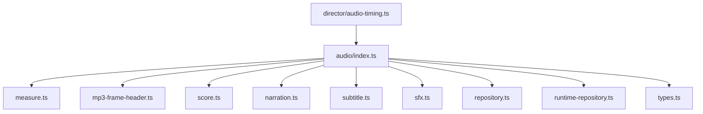
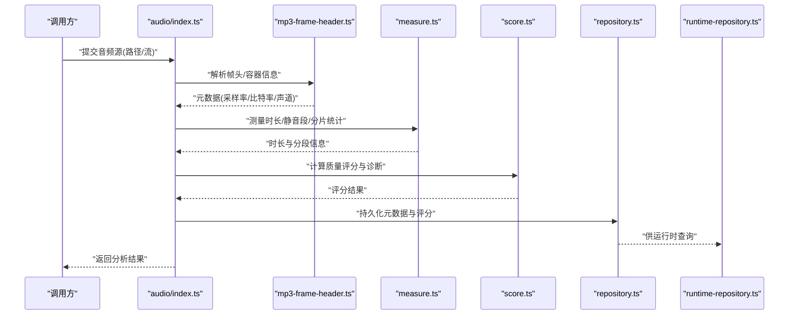
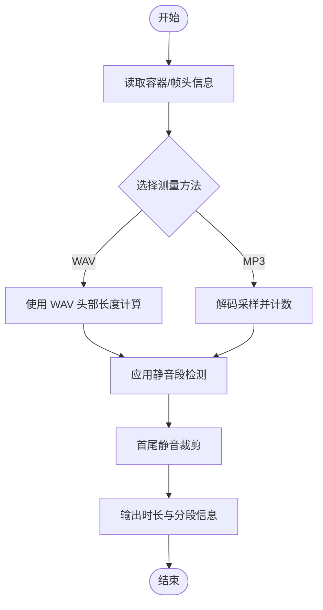
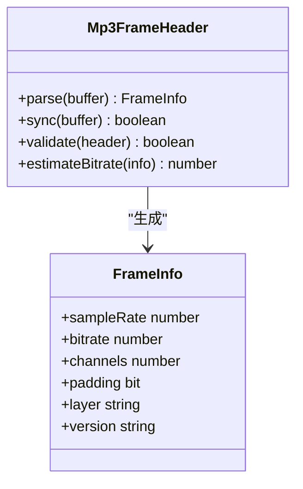
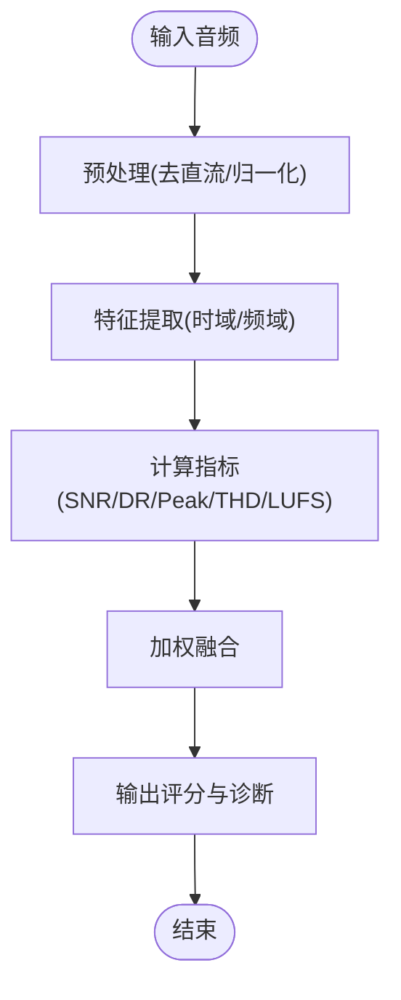
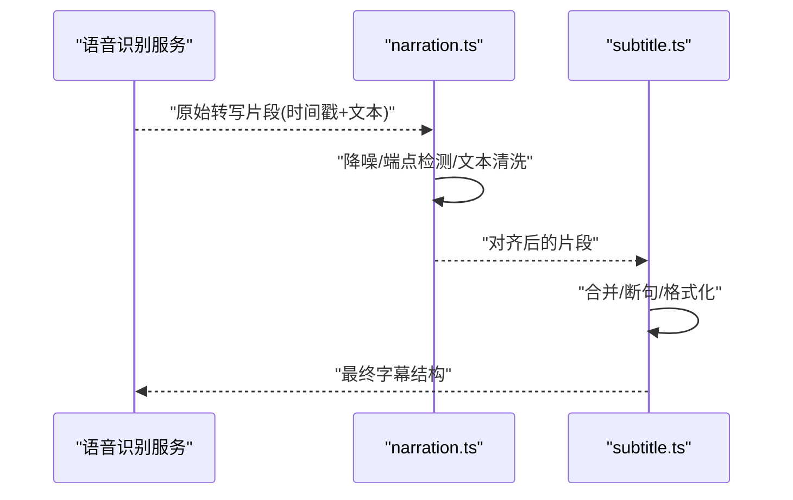
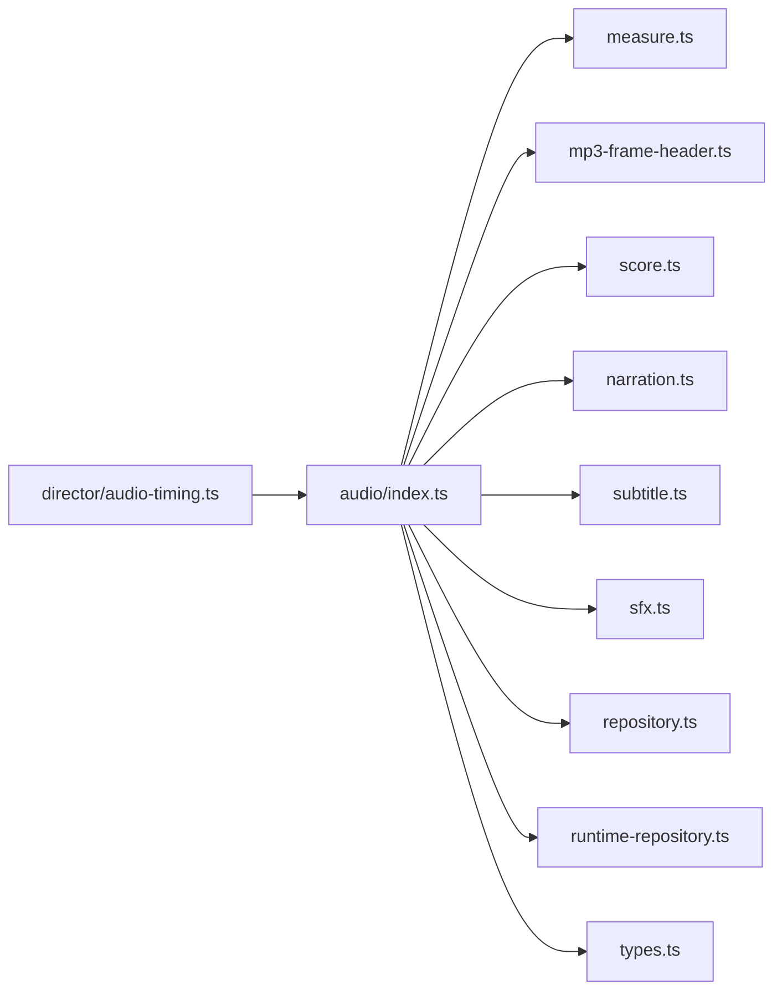

# 音频分析与处理

<cite>
**本文引用的文件**   
- [src/features/audio/index.ts](file://src/features/audio/index.ts)
- [src/features/audio/measure.ts](file://src/features/audio/measure.ts)
- [src/features/audio/mp3-frame-header.ts](file://src/features/audio/mp3-frame-header.ts)
- [src/features/audio/narration.ts](file://src/features/audio/narration.ts)
- [src/features/audio/repository.ts](file://src/features/audio/repository.ts)
- [src/features/audio/runtime-repository.ts](file://src/features/audio/runtime-repository.ts)
- [src/features/audio/score.ts](file://src/features/audio/score.ts)
- [src/features/audio/sfx.ts](file://src/features/audio/sfx.ts)
- [src/features/audio/subtitle.ts](file://src/features/audio/subtitle.ts)
- [src/features/audio/types.ts](file://src/features/audio/types.ts)
- [src/features/director/audio-timing.ts](file://src/features/director/audio-timing.ts)
</cite>

## 目录
1. [简介](#简介)
2. [项目结构](#项目结构)
3. [核心组件](#核心组件)
4. [架构总览](#架构总览)
5. [详细组件分析](#详细组件分析)
6. [依赖关系分析](#依赖关系分析)
7. [性能考量](#性能考量)
8. [故障排查指南](#故障排查指南)
9. [结论](#结论)
10. [附录](#附录)

## 简介
本模块聚焦于音频分析与处理，覆盖以下关键能力：
- 音频元数据提取与时长测量（MP3/WAV）
- MP3 帧头解析与流式分析
- 音频质量评分与噪声检测
- 语音识别预处理（字幕/旁白）
- 音频格式转换、编码参数优化与内存管理策略
- 工具使用示例与自定义分析器实现指南

该文档面向开发者与内容工程师，既提供高层架构说明，也深入到具体实现细节，帮助快速定位问题并扩展功能。

## 项目结构
音频相关代码集中在 src/features/audio 目录，辅以 director 子模块中的时间对齐逻辑。主要职责划分如下：
- measure.ts：时长测量与采样统计
- mp3-frame-header.ts：MP3 帧头解析与同步
- score.ts：质量评分算法与指标计算
- narration.ts / subtitle.ts：旁白与字幕处理，语音识别预处理
- sfx.ts：音效片段管理与裁剪
- repository.ts / runtime-repository.ts：持久化与运行时访问
- types.ts：类型定义与契约
- index.ts：对外导出与聚合入口

图表来源
- [src/features/audio/index.ts](file://src/features/audio/index.ts)
- [src/features/audio/measure.ts](file://src/features/audio/measure.ts)
- [src/features/audio/mp3-frame-header.ts](file://src/features/audio/mp3-frame-header.ts)
- [src/features/audio/score.ts](file://src/features/audio/score.ts)
- [src/features/audio/narration.ts](file://src/features/audio/narration.ts)
- [src/features/audio/subtitle.ts](file://src/features/audio/subtitle.ts)
- [src/features/audio/sfx.ts](file://src/features/audio/sfx.ts)
- [src/features/audio/repository.ts](file://src/features/audio/repository.ts)
- [src/features/audio/runtime-repository.ts](file://src/features/audio/runtime-repository.ts)
- [src/features/audio/types.ts](file://src/features/audio/types.ts)
- [src/features/director/audio-timing.ts](file://src/features/director/audio-timing.ts)

章节来源
- [src/features/audio/index.ts](file://src/features/audio/index.ts)
- [src/features/audio/types.ts](file://src/features/audio/types.ts)

## 核心组件
- 时长测量（measure.ts）
  - 支持对 MP3/WAV 进行采样或基于容器信息的时长估算
  - 提供分片统计、静音段检测与边界修正
- MP3 帧头解析（mp3-frame-header.ts）
  - 解析 MPEG 帧头，获取采样率、比特率、声道数、填充位等
  - 支持帧同步与无效帧跳过
- 质量评分（score.ts）
  - 综合信噪比、动态范围、峰值、失真度等指标
  - 输出标准化分数与诊断信息
- 旁白与字幕（narration.ts, subtitle.ts）
  - 将语音转写结果与时间轴对齐，生成结构化字幕
  - 预处理降噪、端点检测与文本清洗
- 音效片段（sfx.ts）
  - 片段裁剪、拼接与音量归一化
- 存储与运行时（repository.ts, runtime-repository.ts）
  - 封装持久化接口与运行时查询，解耦底层存储
- 类型契约（types.ts）
  - 统一定义音频对象、评分模型、元数据结构

章节来源
- [src/features/audio/measure.ts](file://src/features/audio/measure.ts)
- [src/features/audio/mp3-frame-header.ts](file://src/features/audio/mp3-frame-header.ts)
- [src/features/audio/score.ts](file://src/features/audio/score.ts)
- [src/features/audio/narration.ts](file://src/features/audio/narration.ts)
- [src/features/audio/subtitle.ts](file://src/features/audio/subtitle.ts)
- [src/features/audio/sfx.ts](file://src/features/audio/sfx.ts)
- [src/features/audio/repository.ts](file://src/features/audio/repository.ts)
- [src/features/audio/runtime-repository.ts](file://src/features/audio/runtime-repository.ts)
- [src/features/audio/types.ts](file://src/features/audio/types.ts)

## 架构总览
音频处理管线以“输入 -> 解析 -> 分析 -> 评分 -> 输出”为主线，结合持久化与运行时访问，形成闭环。

图表来源
- [src/features/audio/index.ts](file://src/features/audio/index.ts)
- [src/features/audio/mp3-frame-header.ts](file://src/features/audio/mp3-frame-header.ts)
- [src/features/audio/measure.ts](file://src/features/audio/measure.ts)
- [src/features/audio/score.ts](file://src/features/audio/score.ts)
- [src/features/audio/repository.ts](file://src/features/audio/repository.ts)
- [src/features/audio/runtime-repository.ts](file://src/features/audio/runtime-repository.ts)

## 详细组件分析

### 时长测量与采样统计（measure.ts）
- 目标
  - 准确测量音频时长，支持 MP3/WAV
  - 提供静音段检测、分片统计与边界修正
- 关键点
  - 基于容器信息（WAV 头部）或解码采样计数（MP3）
  - 滑动窗口能量阈值用于静音段判定
  - 首尾静音裁剪与有效区间收敛
- 复杂度
  - 线性扫描 O(N)，N 为采样点数
- 优化建议
  - 大文件采用流式读取与分块处理
  - 缓存中间统计结果避免重复计算

图表来源
- [src/features/audio/measure.ts](file://src/features/audio/measure.ts)

章节来源
- [src/features/audio/measure.ts](file://src/features/audio/measure.ts)

### MP3 帧头解析（mp3-frame-header.ts）
- 目标
  - 解析 MPEG 帧头，提取采样率、比特率、声道模式、填充位等
  - 保证帧同步与错误恢复
- 关键点
  - 帧头校验与同步字匹配
  - 根据层与版本表查找参数映射
  - 处理 VBR 时的平均比特率估算
- 错误处理
  - 非法帧头跳过与重试
  - 记录解析失败位置便于诊断

图表来源
- [src/features/audio/mp3-frame-header.ts](file://src/features/audio/mp3-frame-header.ts)

章节来源
- [src/features/audio/mp3-frame-header.ts](file://src/features/audio/mp3-frame-header.ts)

### 音频质量评分（score.ts）
- 目标
  - 量化音频质量，输出标准化分数与诊断项
- 指标
  - 信噪比（SNR）、动态范围（DR）、峰值电平（Peak）、失真度（THD）、响度（LUFS）
  - 静音占比、削波比例、频段均衡度
- 算法流程
  - 预处理（去直流、归一化）
  - 特征提取（时域/频域）
  - 加权融合得到总分
- 可配置性
  - 权重与阈值可通过配置调整

图表来源
- [src/features/audio/score.ts](file://src/features/audio/score.ts)

章节来源
- [src/features/audio/score.ts](file://src/features/audio/score.ts)

### 旁白与字幕处理（narration.ts, subtitle.ts）
- 目标
  - 将语音转写结果与时间轴对齐，生成结构化字幕
  - 语音识别预处理：降噪、端点检测、文本清洗
- 关键点
  - 时间戳对齐与合并相邻短句
  - 标点与断句规则
  - 多语言支持与字符集规范化

图表来源
- [src/features/audio/narration.ts](file://src/features/audio/narration.ts)
- [src/features/audio/subtitle.ts](file://src/features/audio/subtitle.ts)

章节来源
- [src/features/audio/narration.ts](file://src/features/audio/narration.ts)
- [src/features/audio/subtitle.ts](file://src/features/audio/subtitle.ts)

### 音效片段管理（sfx.ts）
- 目标
  - 片段裁剪、拼接、音量归一化与格式转换
- 关键点
  - 精确到毫秒级的起止点控制
  - 跨格式重采样与比特深度转换
  - 批量操作的事务性与回滚

章节来源
- [src/features/audio/sfx.ts](file://src/features/audio/sfx.ts)

### 存储与运行时访问（repository.ts, runtime-repository.ts）
- 目标
  - 统一抽象音频元数据与评分结果的持久化
  - 提供运行时查询接口，解耦上层业务
- 关键点
  - 读写分离与缓存策略
  - 事务与一致性保障

章节来源
- [src/features/audio/repository.ts](file://src/features/audio/repository.ts)
- [src/features/audio/runtime-repository.ts](file://src/features/audio/runtime-repository.ts)

### 类型契约（types.ts）
- 目标
  - 统一定义音频对象、评分模型、元数据结构
- 关键点
  - 强类型约束与校验
  - 向后兼容的字段演进策略

章节来源
- [src/features/audio/types.ts](file://src/features/audio/types.ts)

### 时间对齐（director/audio-timing.ts）
- 目标
  - 将音频事件与视频/渲染时间轴对齐
- 关键点
  - 时间基准统一（采样率/帧率）
  - 延迟补偿与抖动平滑

章节来源
- [src/features/director/audio-timing.ts](file://src/features/director/audio-timing.ts)

## 依赖关系分析
- 内部依赖
  - index.ts 聚合 measure、mp3-frame-header、score、narration、subtitle、sfx、repository、runtime-repository、types
  - audio-timing 依赖 audio 模块的时间与元数据
- 外部依赖
  - 音频解码库（如 ffmpeg/wav-parser 等，按实际集成）
  - 存储后端（SQLite/PostgreSQL，通过 repository 抽象）

图表来源
- [src/features/audio/index.ts](file://src/features/audio/index.ts)
- [src/features/director/audio-timing.ts](file://src/features/director/audio-timing.ts)

章节来源
- [src/features/audio/index.ts](file://src/features/audio/index.ts)
- [src/features/director/audio-timing.ts](file://src/features/director/audio-timing.ts)

## 性能考量
- 流式处理
  - 对大文件采用分块读取与增量计算，降低内存峰值
- 并行与批处理
  - 多文件分析任务并发执行，限制线程池大小避免过载
- 缓存策略
  - 元数据与评分结果缓存，减少重复计算
- 精度与速度权衡
  - 可选近似算法（如降采样、窗口缩短）提升吞吐
- 资源回收
  - 显式释放解码器与缓冲区，避免内存泄漏

[本节为通用指导，不直接分析具体文件]

## 故障排查指南
- 常见错误
  - MP3 帧头解析失败：检查同步字与版本/层映射
  - 时长异常：确认容器信息与解码采样计数一致性
  - 评分不稳定：检查预处理步骤与阈值配置
  - 内存溢出：启用流式处理与限制并发
- 诊断手段
  - 记录解析失败位置与样本片段
  - 输出中间特征与指标日志
  - 对比不同采样率/比特率下的结果差异

章节来源
- [src/features/audio/mp3-frame-header.ts](file://src/features/audio/mp3-frame-header.ts)
- [src/features/audio/measure.ts](file://src/features/audio/measure.ts)
- [src/features/audio/score.ts](file://src/features/audio/score.ts)

## 结论
本模块提供了完整的音频分析与处理能力，涵盖从格式解析、时长测量、质量评分到字幕与音效处理的端到端流程。通过清晰的组件划分与类型契约，易于扩展与维护。建议在大规模场景下强化流式处理与缓存策略，确保性能与稳定性。

[本节为总结，不直接分析具体文件]

## 附录
- 使用示例（概念性）
  - 解析 MP3 并测量时长：调用 index 聚合函数传入音频源，返回元数据与时长
  - 计算质量评分：输入音频缓冲或路径，输出评分与诊断
  - 生成字幕：输入转写片段与时间戳，输出结构化字幕
- 自定义分析器实现指南
  - 在 types.ts 中扩展数据结构
  - 新增分析模块并注册至 index.ts
  - 在 repository.ts 中增加持久化字段
  - 在 runtime-repository.ts 中暴露查询接口
  - 编写单元测试验证正确性与边界条件

[本节为补充说明，不直接分析具体文件]