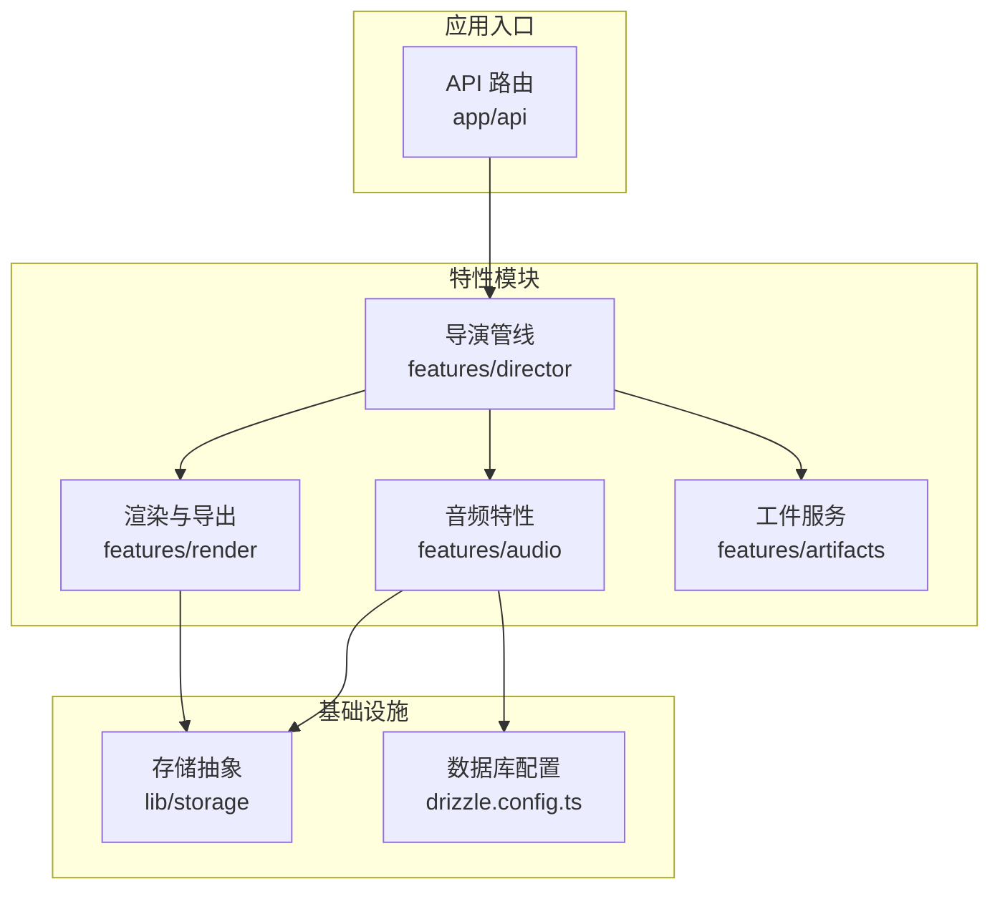
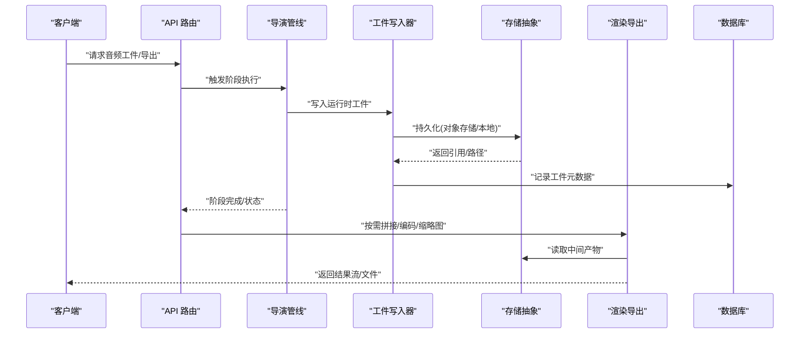
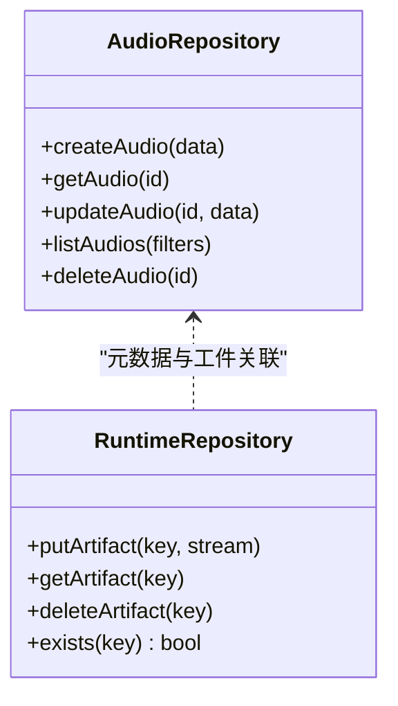
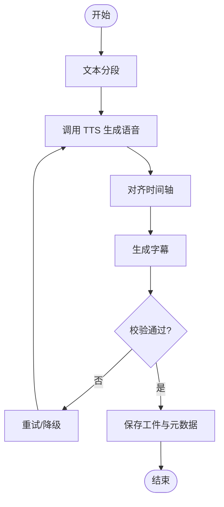
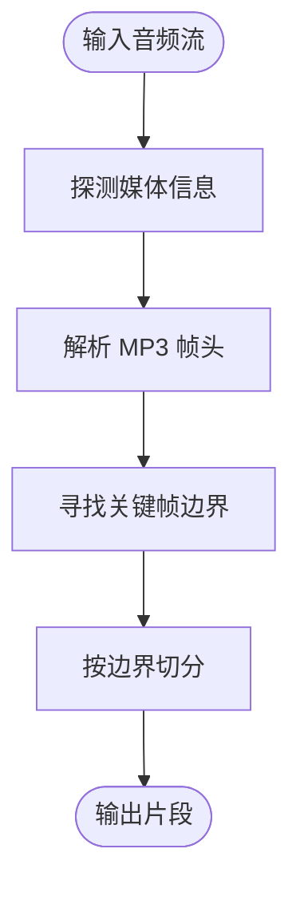
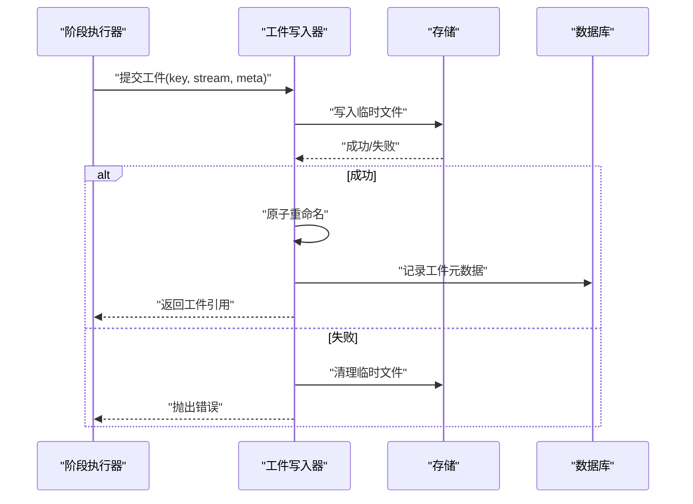
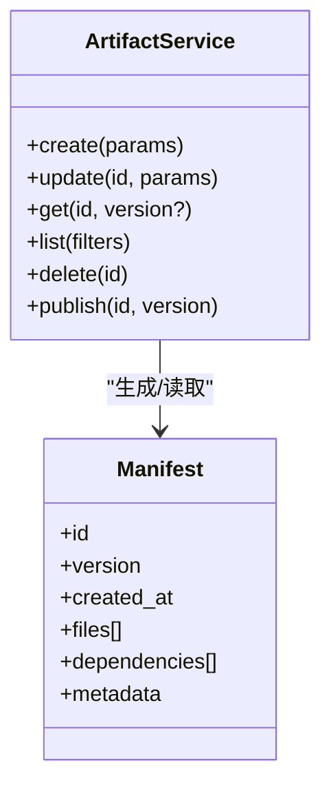
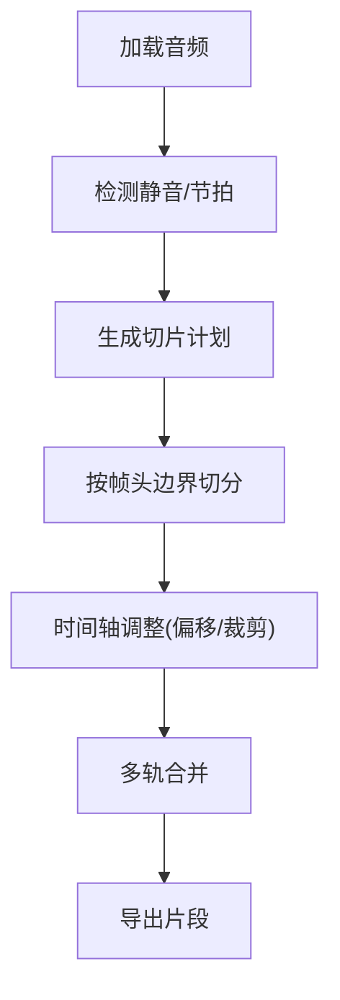
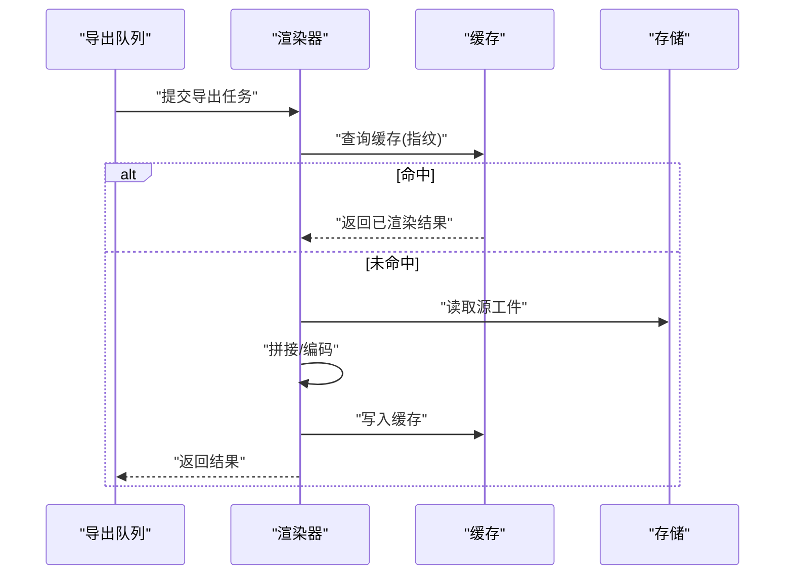
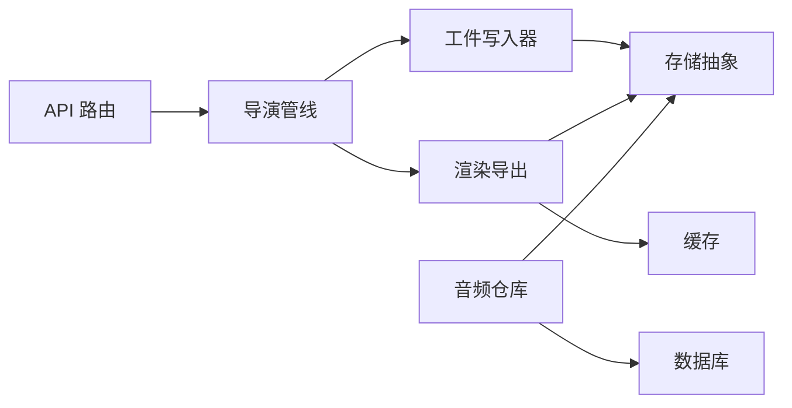

# 音频工件管理

<cite>
**本文引用的文件**   
- [src/features/audio/index.ts](file://src/features/audio/index.ts)
- [src/features/audio/repository.ts](file://src/features/audio/repository.ts)
- [src/features/audio/runtime-repository.ts](file://src/features/audio/runtime-repository.ts)
- [src/features/audio/narration.ts](file://src/features/audio/narration.ts)
- [src/features/audio/narration-repository.ts](file://src/features/audio/narration-repository.ts)
- [src/features/audio/score.ts](file://src/features/audio/score.ts)
- [src/features/audio/subtitle.ts](file://src/features/audio/subtitle.ts)
- [src/features/audio/measure.ts](file://src/features/audio/measure.ts)
- [src/features/audio/mp3-frame-header.ts](file://src/features/audio/mp3-frame-header.ts)
- [src/features/audio/types.ts](file://src/features/audio/types.ts)
- [src/features/director/runtime-artifact-writer.ts](file://src/features/director/runtime-artifact-writer.ts)
- [src/features/director/runtime-artifact-source.ts](file://src/features/director/runtime-artifact-source.ts)
- [src/features/director/stage-result-committer.ts](file://src/features/director/stage-result-committer.ts)
- [src/features/director/stage-runner.ts](file://src/features/director/stage-runner.ts)
- [src/features/director/pipeline.ts](file://src/features/director/pipeline.ts)
- [src/features/director/advance.ts](file://src/features/director/advance.ts)
- [src/features/director/audio-timing.ts](file://src/features/director/audio-timing.ts)
- [src/features/artifacts/service.ts](file://src/features/artifacts/service.ts)
- [src/features/artifacts/commit.ts](file://src/features/artifacts/commit.ts)
- [src/app/api/artifacts/[id]/route.ts](file://src/app/api/artifacts/[id]/route.ts)
- [src/app/api/render/export/route.ts](file://src/app/api/render/export/route.ts)
- [src/app/api/render/thumbnails/route.ts](file://src/app/api/render/thumbnails/route.ts)
- [src/features/render/cache.ts](file://src/features/render/cache.ts)
- [src/features/render/renderer.ts](file://src/features/render/renderer.ts)
- [src/features/render/concat.ts](file://src/features/render/concat.ts)
- [src/features/render/encode.ts](file://src/features/render/encode.ts)
- [src/features/render/persistence.ts](file://src/features/render/persistence.ts)
- [src/lib/storage/index.ts](file://src/lib/storage/index.ts)
- [drizzle.config.ts](file://drizzle.config.ts)
</cite>

## 目录
1. [简介](#简介)
2. [项目结构](#项目结构)
3. [核心组件](#核心组件)
4. [架构总览](#架构总览)
5. [详细组件分析](#详细组件分析)
6. [依赖分析](#依赖分析)
7. [性能考虑](#性能考虑)
8. [故障排查指南](#故障排查指南)
9. [结论](#结论)
10. [附录](#附录)

## 简介
本文件为“音频工件管理系统”的权威技术文档，覆盖音频文件的生命周期管理、版本控制与存储策略；解释尝试工件写入器（Runtime Artifact Writer）工作机制、用户音频制品管理与清单文件结构；描述音频切片算法、时间轴操作与批量处理功能；并给出数据库持久化、缓存策略与性能优化建议。同时提供音频资源检索、下载与管理 API 的使用示例，帮助开发者快速集成与排障。

## 项目结构
本项目采用按特性分层的组织方式，音频相关能力集中在 features/audio 与 features/director 模块中，API 层位于 app/api，渲染与导出在 features/render，通用存储抽象在 lib/storage。

图表来源
- [src/app/api/artifacts/[id]/route.ts](file://src/app/api/artifacts/[id]/route.ts)
- [src/features/director/pipeline.ts](file://src/features/director/pipeline.ts)
- [src/features/audio/index.ts](file://src/features/audio/index.ts)
- [src/features/render/renderer.ts](file://src/features/render/renderer.ts)
- [src/lib/storage/index.ts](file://src/lib/storage/index.ts)
- [drizzle.config.ts](file://drizzle.config.ts)

章节来源
- [src/features/audio/index.ts](file://src/features/audio/index.ts)
- [src/features/director/pipeline.ts](file://src/features/director/pipeline.ts)
- [src/features/render/renderer.ts](file://src/features/render/renderer.ts)
- [src/lib/storage/index.ts](file://src/lib/storage/index.ts)
- [drizzle.config.ts](file://drizzle.config.ts)

## 核心组件
- 音频仓库与运行时仓库：负责音频元数据、片段、字幕、评分等数据的读写与查询，以及运行期工件的存取。
- 叙述与字幕：将文本转换为语音（TTS），生成字幕与时间戳，支撑多轨合成。
- 测量与帧头解析：对音频时长、采样率、比特率等进行测量，解析 MP3 帧头以支持高效切分。
- 导演工件写入器：在管线阶段产出工件时，安全地写入运行时工件，保证幂等与一致性。
- 工件服务与提交：统一对外暴露工件创建、更新、版本化与清单管理能力。
- 渲染与导出：拼接、编码、缩略图生成与导出队列，结合缓存提升吞吐。

章节来源
- [src/features/audio/repository.ts](file://src/features/audio/repository.ts)
- [src/features/audio/runtime-repository.ts](file://src/features/audio/runtime-repository.ts)
- [src/features/audio/narration.ts](file://src/features/audio/narration.ts)
- [src/features/audio/subtitle.ts](file://src/features/audio/subtitle.ts)
- [src/features/audio/measure.ts](file://src/features/audio/measure.ts)
- [src/features/audio/mp3-frame-header.ts](file://src/features/audio/mp3-frame-header.ts)
- [src/features/director/runtime-artifact-writer.ts](file://src/features/director/runtime-artifact-writer.ts)
- [src/features/artifacts/service.ts](file://src/features/artifacts/service.ts)
- [src/features/render/renderer.ts](file://src/features/render/renderer.ts)

## 架构总览
系统围绕“管线驱动 + 工件中心”的架构展开：导演管线编排各阶段任务，阶段产出通过运行时工件写入器落盘或对象存储，并由工件服务进行版本化管理；渲染层负责最终导出与缓存命中；API 层暴露检索、下载与导出接口。

图表来源
- [src/app/api/artifacts/[id]/route.ts](file://src/app/api/artifacts/[id]/route.ts)
- [src/features/director/pipeline.ts](file://src/features/director/pipeline.ts)
- [src/features/director/runtime-artifact-writer.ts](file://src/features/director/runtime-artifact-writer.ts)
- [src/lib/storage/index.ts](file://src/lib/storage/index.ts)
- [src/features/render/renderer.ts](file://src/features/render/renderer.ts)

## 详细组件分析

### 音频仓库与运行时仓库
- 职责
  - repository.ts：定义音频实体、片段、字幕、评分等模型的持久化访问方法。
  - runtime-repository.ts：面向运行期的工件存取，包含临时产物、中间态与最终产物的读写。
- 设计要点
  - 分离“业务模型”和“运行期工件”，避免耦合。
  - 运行时仓库支持幂等写入与冲突检测，保障并发安全。
  - 与存储抽象解耦，便于切换后端（本地、S3、OSS）。

图表来源
- [src/features/audio/repository.ts](file://src/features/audio/repository.ts)
- [src/features/audio/runtime-repository.ts](file://src/features/audio/runtime-repository.ts)

章节来源
- [src/features/audio/repository.ts](file://src/features/audio/repository.ts)
- [src/features/audio/runtime-repository.ts](file://src/features/audio/runtime-repository.ts)

### 叙述与字幕
- 职责
  - narration.ts：调用 TTS 服务生成语音，管理会话与重试。
  - subtitle.ts：生成 SRT/VTT 字幕，维护时间轴对齐。
- 关键点
  - 文本分段与静音检测，确保自然停顿。
  - 字幕与音频时间轴对齐，支持偏移与裁剪。
  - 失败重试与降级策略（如回退到默认声音）。

图表来源
- [src/features/audio/narration.ts](file://src/features/audio/narration.ts)
- [src/features/audio/subtitle.ts](file://src/features/audio/subtitle.ts)

章节来源
- [src/features/audio/narration.ts](file://src/features/audio/narration.ts)
- [src/features/audio/subtitle.ts](file://src/features/audio/subtitle.ts)

### 测量与 MP3 帧头解析
- 职责
  - measure.ts：测量音频时长、采样率、声道数、比特率等。
  - mp3-frame-header.ts：解析 MP3 帧头，定位关键帧边界，用于无损切分。
- 关键点
  - 使用流式探测减少 I/O 开销。
  - 基于帧头的切分避免破坏音频结构。

图表来源
- [src/features/audio/measure.ts](file://src/features/audio/measure.ts)
- [src/features/audio/mp3-frame-header.ts](file://src/features/audio/mp3-frame-header.ts)

章节来源
- [src/features/audio/measure.ts](file://src/features/audio/measure.ts)
- [src/features/audio/mp3-frame-header.ts](file://src/features/audio/mp3-frame-header.ts)

### 导演工件写入器（Runtime Artifact Writer）
- 职责
  - 在管线阶段产出工件时，原子写入并记录元数据，保证幂等与一致性。
  - 支持并发写入保护与冲突解决。
- 关键点
  - 先写临时位置，再原子重命名/移动。
  - 写入前检查存在性，避免重复计算。
  - 失败自动清理临时文件。

图表来源
- [src/features/director/runtime-artifact-writer.ts](file://src/features/director/runtime-artifact-writer.ts)
- [src/lib/storage/index.ts](file://src/lib/storage/index.ts)

章节来源
- [src/features/director/runtime-artifact-writer.ts](file://src/features/director/runtime-artifact-writer.ts)

### 用户音频制品管理与清单文件结构
- 工件服务（service.ts）：统一创建、更新、删除与列出工件，支持版本化与标签。
- 提交（commit.ts）：将阶段结果合并为工件快照，生成清单文件（manifest），包含版本、依赖、哈希等。
- 清单结构要点
  - 标识：工件 ID、版本号、创建时间。
  - 内容：文件路径/URL、大小、哈希、格式、时长。
  - 依赖：上游工件 ID、阶段名、参数摘要。
  - 审计：操作人、来源节点、流水线 ID。

图表来源
- [src/features/artifacts/service.ts](file://src/features/artifacts/service.ts)
- [src/features/artifacts/commit.ts](file://src/features/artifacts/commit.ts)

章节来源
- [src/features/artifacts/service.ts](file://src/features/artifacts/service.ts)
- [src/features/artifacts/commit.ts](file://src/features/artifacts/commit.ts)

### 音频切片算法与时间轴操作
- 切片策略
  - 基于 MP3 帧头的关键帧对齐切分，避免破坏帧结构。
  - 结合静音检测与语义分段，提高可听性与剪辑质量。
- 时间轴操作
  - 偏移、裁剪、拼接、淡入淡出。
  - 多轨对齐：叙述、音效、背景音乐的时间同步。

图表来源
- [src/features/audio/measure.ts](file://src/features/audio/measure.ts)
- [src/features/audio/mp3-frame-header.ts](file://src/features/audio/mp3-frame-header.ts)
- [src/features/director/audio-timing.ts](file://src/features/director/audio-timing.ts)

章节来源
- [src/features/audio/measure.ts](file://src/features/audio/measure.ts)
- [src/features/audio/mp3-frame-header.ts](file://src/features/audio/mp3-frame-header.ts)
- [src/features/director/audio-timing.ts](file://src/features/director/audio-timing.ts)

### 批量处理与渲染导出
- 渲染管道
  - concat.ts：片段拼接，保持时间线连续性。
  - encode.ts：转码为目标格式（如 AAC/MP3），设置码率与声道。
  - renderer.ts：协调阶段任务、缓存命中与失败重试。
- 缓存策略
  - 基于输入指纹（哈希）的缓存键，命中直接返回结果。
  - 分层缓存：内存、磁盘、对象存储。

图表来源
- [src/features/render/renderer.ts](file://src/features/render/renderer.ts)
- [src/features/render/concat.ts](file://src/features/render/concat.ts)
- [src/features/render/encode.ts](file://src/features/render/encode.ts)
- [src/features/render/cache.ts](file://src/features/render/cache.ts)

章节来源
- [src/features/render/renderer.ts](file://src/features/render/renderer.ts)
- [src/features/render/concat.ts](file://src/features/render/concat.ts)
- [src/features/render/encode.ts](file://src/features/render/encode.ts)
- [src/features/render/cache.ts](file://src/features/render/cache.ts)

### 数据库持久化与配置
- 使用 Drizzle ORM 管理音频工件、叙述、字幕、评分等表结构。
- 配置 drizzle.config.ts 指定连接信息与迁移脚本路径。
- 运行时仓库与持久化仓库协作，保证事务一致性与回滚。

章节来源
- [drizzle.config.ts](file://drizzle.config.ts)
- [src/features/audio/repository.ts](file://src/features/audio/repository.ts)
- [src/features/audio/runtime-repository.ts](file://src/features/audio/runtime-repository.ts)

## 依赖分析
- 组件耦合
  - 导演管线依赖工件写入器与运行时仓库，低耦合于具体存储实现。
  - 渲染层依赖缓存与存储抽象，屏蔽后端差异。
  - API 层仅暴露稳定契约，内部实现可替换。
- 外部依赖
  - 存储抽象（lib/storage）支持多种后端。
  - 数据库（Drizzle）提供结构化持久化。
  - TTS 服务（narration）可插拔。

图表来源
- [src/app/api/artifacts/[id]/route.ts](file://src/app/api/artifacts/[id]/route.ts)
- [src/features/director/pipeline.ts](file://src/features/director/pipeline.ts)
- [src/features/director/runtime-artifact-writer.ts](file://src/features/director/runtime-artifact-writer.ts)
- [src/lib/storage/index.ts](file://src/lib/storage/index.ts)
- [src/features/render/renderer.ts](file://src/features/render/renderer.ts)
- [src/features/audio/repository.ts](file://src/features/audio/repository.ts)

章节来源
- [src/app/api/artifacts/[id]/route.ts](file://src/app/api/artifacts/[id]/route.ts)
- [src/features/director/pipeline.ts](file://src/features/director/pipeline.ts)
- [src/lib/storage/index.ts](file://src/lib/storage/index.ts)
- [src/features/render/renderer.ts](file://src/features/render/renderer.ts)
- [src/features/audio/repository.ts](file://src/features/audio/repository.ts)

## 性能考虑
- 流式处理：音频测量与切分尽量使用流式 API，降低内存占用。
- 缓存优先：渲染与导出优先命中缓存，减少重复计算。
- 并行度控制：导出队列与阶段执行限制并发，避免资源争用。
- 原子写入：工件写入采用临时文件+原子重命名，避免部分写入导致损坏。
- 索引优化：数据库对常用查询字段建立索引（工件 ID、版本、哈希、时间戳）。
- 压缩与分片：大文件分块上传与传输压缩，降低带宽压力。

[本节为通用指导，不直接分析具体文件]

## 故障排查指南
- 常见问题
  - 工件写入失败：检查存储后端连通性与权限，确认临时文件清理逻辑。
  - 时间轴错位：核对字幕与音频的对齐参数，检查偏移与裁剪顺序。
  - 导出超时：查看缓存命中率与队列积压情况，适当扩容。
- 诊断步骤
  - 查看阶段日志与工件元数据，定位失败阶段。
  - 验证输入工件完整性（哈希比对）。
  - 检查数据库事务与锁竞争。
- 恢复策略
  - 启用幂等重试与断点续传。
  - 回滚到上一可用版本。

章节来源
- [src/features/director/runtime-artifact-writer.ts](file://src/features/director/runtime-artifact-writer.ts)
- [src/features/render/cache.ts](file://src/features/render/cache.ts)
- [src/features/audio/subtitle.ts](file://src/features/audio/subtitle.ts)

## 结论
本系统以“管线驱动 + 工件中心”为核心，结合流式处理、原子写入与缓存策略，实现了高可靠、高性能的音频工件管理。通过清晰的职责划分与可扩展的存储抽象，系统能够灵活适配不同后端与业务需求。建议在大规模部署时重点关注并发控制、缓存命中率与数据库索引优化。

[本节为总结，不直接分析具体文件]

## 附录

### API 使用示例（音频资源检索、下载与管理）
- 获取工件详情
  - 方法：GET
  - 路径：/api/artifacts/:id
  - 说明：返回工件元数据与清单，支持按版本过滤。
- 下载工件
  - 方法：GET
  - 路径：/api/artifacts/:id/download
  - 说明：返回工件二进制流或预签名 URL。
- 导出音频
  - 方法：POST
  - 路径：/api/render/export
  - 说明：提交导出任务，返回任务 ID 与进度查询接口。
- 生成缩略图
  - 方法：GET
  - 路径：/api/render/thumbnails/:id
  - 说明：根据工件生成缩略图或封面帧。

章节来源
- [src/app/api/artifacts/[id]/route.ts](file://src/app/api/artifacts/[id]/route.ts)
- [src/app/api/render/export/route.ts](file://src/app/api/render/export/route.ts)
- [src/app/api/render/thumbnails/route.ts](file://src/app/api/render/thumbnails/route.ts)