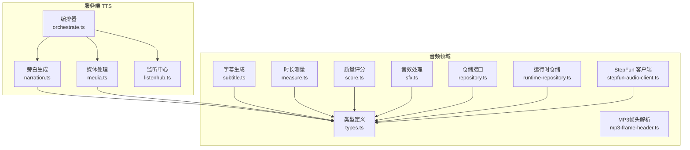
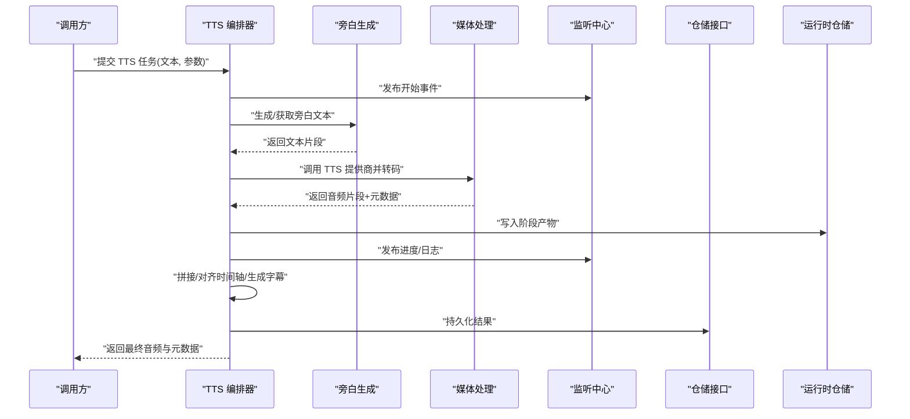
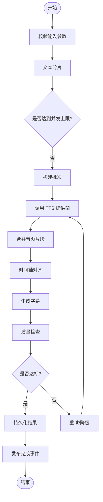
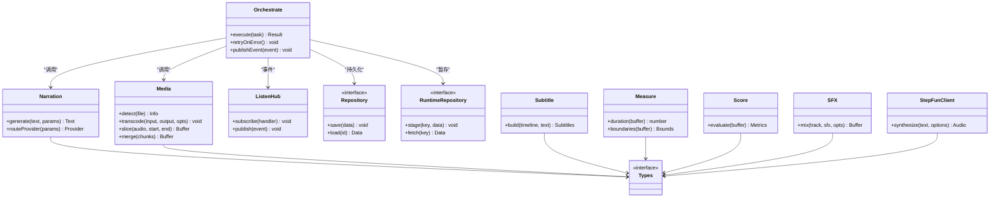

# 音频服务层

<cite>
**本文引用的文件**   
- [server/src/tts/orchestrate.ts](file://server/src/tts/orchestrate.ts)
- [server/src/tts/narration.ts](file://server/src/tts/narration.ts)
- [server/src/tts/media.ts](file://server/src/tts/media.ts)
- [server/src/tts/listenhub.ts](file://server/src/tts/listenhub.ts)
- [src/features/audio/index.ts](file://src/features/audio/index.ts)
- [src/features/audio/types.ts](file://src/features/audio/types.ts)
- [src/features/audio/repository.ts](file://src/features/audio/repository.ts)
- [src/features/audio/runtime-repository.ts](file://src/features/audio/runtime-repository.ts)
- [src/features/audio/narration.ts](file://src/features/audio/narration.ts)
- [src/features/audio/subtitle.ts](file://src/features/audio/subtitle.ts)
- [src/features/audio/measure.ts](file://src/features/audio/measure.ts)
- [src/features/audio/score.ts](file://src/features/audio/score.ts)
- [src/features/audio/sfx.ts](file://src/features/audio/sfx.ts)
- [src/features/audio/mp3-frame-header.ts](file://src/features/audio/mp3-frame-header.ts)
- [src/features/audio/stepfun-audio-client.ts](file://src/features/audio/stepfun-audio-client.ts)
- [tests/tts-config.test.ts](file://tests/tts-config.test.ts)
- [tests/tts-narration.test.ts](file://tests/tts-narration.test.ts)
- [tests/tts-orchestration.test.ts](file://tests/tts-orchestration.test.ts)
- [tests/tts-pipeline-integration.test.ts](file://tests/tts-pipeline-integration.test.ts)
- [tests/tts-runtime.test.ts](file://tests/tts-runtime.test.ts)
- [config/tts.env.example](file://config/tts.env.example)
- [docs/configuration/tts.md](file://docs/configuration/tts.md)
</cite>

## 目录
1. [简介](#简介)
2. [项目结构](#项目结构)
3. [核心组件](#核心组件)
4. [架构总览](#架构总览)
5. [详细组件分析](#详细组件分析)
6. [依赖关系分析](#依赖关系分析)
7. [性能考量](#性能考量)
8. [故障排查指南](#故障排查指南)
9. [结论](#结论)
10. [附录](#附录)

## 简介
本文件为 PurpleInk 的音频服务层提供全面文档，重点覆盖：
- TTS 语音合成服务的架构、多提供商支持与音频格式处理
- 音频转录、时间轴同步与字幕生成流程
- 音频分析、格式转换与质量检测机制
- 音频文件管理、元数据处理与存储策略
- 批量处理、异步任务与进度跟踪
- 音频处理管道配置与自定义音频处理器实现示例

该服务层以“编排器 + 领域能力”为核心组织方式，将 TTS 编排、媒体处理、字幕与度量等能力解耦，并通过统一的类型系统与仓库接口对接持久化与运行时数据。

## 项目结构
音频相关代码主要分布在两个区域：
- server/src/tts：TTS 服务层的编排与媒体处理（服务端）
- src/features/audio：音频领域能力（类型、仓储、字幕、度量、SFX、客户端等）

图表来源
- [server/src/tts/orchestrate.ts](file://server/src/tts/orchestrate.ts)
- [server/src/tts/narration.ts](file://server/src/tts/narration.ts)
- [server/src/tts/media.ts](file://server/src/tts/media.ts)
- [server/src/tts/listenhub.ts](file://server/src/tts/listenhub.ts)
- [src/features/audio/types.ts](file://src/features/audio/types.ts)
- [src/features/audio/repository.ts](file://src/features/audio/repository.ts)
- [src/features/audio/runtime-repository.ts](file://src/features/audio/runtime-repository.ts)
- [src/features/audio/subtitle.ts](file://src/features/audio/subtitle.ts)
- [src/features/audio/measure.ts](file://src/features/audio/measure.ts)
- [src/features/audio/score.ts](file://src/features/audio/score.ts)
- [src/features/audio/sfx.ts](file://src/features/audio/sfx.ts)
- [src/features/audio/mp3-frame-header.ts](file://src/features/audio/mp3-frame-header.ts)
- [src/features/audio/stepfun-audio-client.ts](file://src/features/audio/stepfun-audio-client.ts)

章节来源
- [server/src/tts/orchestrate.ts](file://server/src/tts/orchestrate.ts)
- [server/src/tts/narration.ts](file://server/src/tts/narration.ts)
- [server/src/tts/media.ts](file://server/src/tts/media.ts)
- [server/src/tts/listenhub.ts](file://server/src/tts/listenhub.ts)
- [src/features/audio/index.ts](file://src/features/audio/index.ts)
- [src/features/audio/types.ts](file://src/features/audio/types.ts)

## 核心组件
- 编排器（Orchestrator）
  - 职责：协调 TTS 文本到语音的合成、分段、拼接、转码与质检；驱动并行与重试；统一错误与进度上报。
  - 关键输入：文本片段、提供商参数、输出格式、质量阈值。
  - 关键输出：音频片段、时间轴、字幕、质量指标。
- 旁白生成（Narration）
  - 职责：根据脚本与上下文生成旁白文本或调用外部 TTS 提供商；支持多提供商路由与回退。
- 媒体处理（Media）
  - 职责：音频格式检测、转码、切片、合并、采样率/声道规范化；封装 FFmpeg/原生工具调用。
- 监听中心（ListenHub）
  - 职责：事件总线，用于进度、日志、错误与完成事件的发布/订阅，便于前端与队列消费方实时反馈。
- 音频领域（Audio Features）
  - 类型系统：统一描述音频片段、时间轴、字幕、质量评分、SFX 等数据结构。
  - 仓储接口：抽象持久化与运行时访问，屏蔽底层存储差异。
  - 字幕生成：基于时间轴与文本对齐生成标准字幕。
  - 时长测量：精确测量音频时长与边界。
  - 质量评分：对噪声、失真、静音段等进行量化评估。
  - 音效处理：SFX 插入、混音、淡入淡出。
  - MP3 帧头：快速读取 MP3 元信息，避免全量解码。
  - StepFun 客户端：对接特定 TTS/音频提供商 SDK。

章节来源
- [server/src/tts/orchestrate.ts](file://server/src/tts/orchestrate.ts)
- [server/src/tts/narration.ts](file://server/src/tts/narration.ts)
- [server/src/tts/media.ts](file://server/src/tts/media.ts)
- [server/src/tts/listenhub.ts](file://server/src/tts/listenhub.ts)
- [src/features/audio/types.ts](file://src/features/audio/types.ts)
- [src/features/audio/repository.ts](file://src/features/audio/repository.ts)
- [src/features/audio/runtime-repository.ts](file://src/features/audio/runtime-repository.ts)
- [src/features/audio/subtitle.ts](file://src/features/audio/subtitle.ts)
- [src/features/audio/measure.ts](file://src/features/audio/measure.ts)
- [src/features/audio/score.ts](file://src/features/audio/score.ts)
- [src/features/audio/sfx.ts](file://src/features/audio/sfx.ts)
- [src/features/audio/mp3-frame-header.ts](file://src/features/audio/mp3-frame-header.ts)
- [src/features/audio/stepfun-audio-client.ts](file://src/features/audio/stepfun-audio-client.ts)

## 架构总览
整体采用“编排器驱动 + 领域能力 + 仓储抽象”的分层架构。编排器负责工作流控制，领域模块专注单一职责，仓储层屏蔽存储细节。

图表来源
- [server/src/tts/orchestrate.ts](file://server/src/tts/orchestrate.ts)
- [server/src/tts/narration.ts](file://server/src/tts/narration.ts)
- [server/src/tts/media.ts](file://server/src/tts/media.ts)
- [server/src/tts/listenhub.ts](file://server/src/tts/listenhub.ts)
- [src/features/audio/repository.ts](file://src/features/audio/repository.ts)
- [src/features/audio/runtime-repository.ts](file://src/features/audio/runtime-repository.ts)

## 详细组件分析

### TTS 编排器（Orchestrator）
- 设计要点
  - 将长文本切分为可管理的片段，按批次并发调用 TTS 提供商。
  - 维护全局时间轴，确保片段顺序与无缝衔接。
  - 失败重试与降级策略（如切换提供商）。
  - 通过监听中心推送进度与日志，供前端或队列消费。
- 关键流程
  - 输入校验与参数归一化
  - 文本分片与优先级排序
  - 并行合成与结果聚合
  - 后处理（转码、降噪、音量均衡）
  - 质量检查与阈值判定
  - 持久化与事件通知

图表来源
- [server/src/tts/orchestrate.ts](file://server/src/tts/orchestrate.ts)
- [server/src/tts/listenhub.ts](file://server/src/tts/listenhub.ts)

章节来源
- [server/src/tts/orchestrate.ts](file://server/src/tts/orchestrate.ts)
- [server/src/tts/listenhub.ts](file://server/src/tts/listenhub.ts)

### 旁白生成（Narration）
- 功能范围
  - 文本预处理（清洗、标点修正、段落划分）
  - 多提供商路由（按语言、音色、延迟要求选择）
  - 缓存命中与增量更新
- 扩展点
  - 新增提供商适配器（实现统一接口）
  - 自定义文本分割策略

章节来源
- [server/src/tts/narration.ts](file://server/src/tts/narration.ts)
- [src/features/audio/types.ts](file://src/features/audio/types.ts)

### 媒体处理（Media）
- 功能范围
  - 格式检测（容器、编码、采样率、声道）
  - 转码与重采样（目标格式、比特率、声道数）
  - 切片与拼接（基于时间戳与帧对齐）
  - 元数据读写（标题、艺术家、专辑、封面）
- 优化策略
  - 使用 MP3 帧头快速探测，避免全量解码
  - 流式处理降低内存占用

章节来源
- [server/src/tts/media.ts](file://server/src/tts/media.ts)
- [src/features/audio/mp3-frame-header.ts](file://src/features/audio/mp3-frame-header.ts)

### 监听中心（ListenHub）
- 事件模型
  - 任务生命周期：开始、进行中、完成、失败
  - 进度：百分比、当前片段索引、剩余估计
  - 日志：结构化日志，包含级别与上下文
- 使用建议
  - 前端订阅事件渲染进度条与日志面板
  - 队列消费者监听完成事件触发下游任务

章节来源
- [server/src/tts/listenhub.ts](file://server/src/tts/listenhub.ts)

### 音频领域：类型与仓储
- 类型系统
  - 音频片段、时间轴、字幕条目、质量评分、SFX 标记等统一类型
- 仓储接口
  - repository：持久化音频制品、元数据、字幕
  - runtime-repository：运行期临时产物与中间状态

章节来源
- [src/features/audio/types.ts](file://src/features/audio/types.ts)
- [src/features/audio/repository.ts](file://src/features/audio/repository.ts)
- [src/features/audio/runtime-repository.ts](file://src/features/audio/runtime-repository.ts)

### 字幕生成（Subtitle）
- 流程
  - 基于时间轴与文本片段生成时间戳区间
  - 对齐策略：按音节/词边界切分，保证可读性
  - 输出格式：SRT/VTT 等
- 质量控制
  - 最小/最大显示时长限制
  - 行宽与换行规则

章节来源
- [src/features/audio/subtitle.ts](file://src/features/audio/subtitle.ts)

### 时长测量（Measure）
- 能力
  - 精确测量音频时长与起止时间
  - 支持流式探测与快速估算
- 应用场景
  - 时间轴对齐、静音检测、片段裁剪

章节来源
- [src/features/audio/measure.ts](file://src/features/audio/measure.ts)

### 质量评分（Score）
- 指标
  - 信噪比、失真度、静音占比、峰值电平
- 决策
  - 低于阈值触发重合成或降噪处理

章节来源
- [src/features/audio/score.ts](file://src/features/audio/score.ts)

### 音效处理（SFX）
- 能力
  - 插入背景音、淡入淡出、音量平衡
  - 与旁音轨混音并保持相位一致

章节来源
- [src/features/audio/sfx.ts](file://src/features/audio/sfx.ts)

### StepFun 音频客户端
- 职责
  - 封装 StepFun 提供商的 TTS/音频 API
  - 处理鉴权、限流、重试与错误映射
- 扩展性
  - 与其他提供商保持一致的调用契约

章节来源
- [src/features/audio/stepfun-audio-client.ts](file://src/features/audio/stepfun-audio-client.ts)

## 依赖关系分析
- 低耦合高内聚
  - 编排器仅依赖领域能力与仓储接口，不关心具体实现
  - 媒体处理与字幕生成独立于提供商逻辑
- 外部依赖
  - TTS 提供商（如 StepFun）
  - 音视频工具链（FFmpeg 等）
  - 存储后端（对象存储/数据库）

图表来源
- [server/src/tts/orchestrate.ts](file://server/src/tts/orchestrate.ts)
- [server/src/tts/narration.ts](file://server/src/tts/narration.ts)
- [server/src/tts/media.ts](file://server/src/tts/media.ts)
- [server/src/tts/listenhub.ts](file://server/src/tts/listenhub.ts)
- [src/features/audio/types.ts](file://src/features/audio/types.ts)
- [src/features/audio/repository.ts](file://src/features/audio/repository.ts)
- [src/features/audio/runtime-repository.ts](file://src/features/audio/runtime-repository.ts)
- [src/features/audio/subtitle.ts](file://src/features/audio/subtitle.ts)
- [src/features/audio/measure.ts](file://src/features/audio/measure.ts)
- [src/features/audio/score.ts](file://src/features/audio/score.ts)
- [src/features/audio/sfx.ts](file://src/features/audio/sfx.ts)
- [src/features/audio/stepfun-audio-client.ts](file://src/features/audio/stepfun-audio-client.ts)

章节来源
- [src/features/audio/index.ts](file://src/features/audio/index.ts)
- [src/features/audio/types.ts](file://src/features/audio/types.ts)

## 性能考量
- 并发与批处理
  - 合理设置并发批次，避免 I/O 与 CPU 争用
  - 使用流式处理减少内存峰值
- 缓存与复用
  - 文本片段哈希缓存，避免重复合成
  - 常用转码参数预编译
- 资源隔离
  - 媒体处理进程隔离，防止阻塞主线程
- 监控与告警
  - 关键指标：合成耗时、失败率、内存/CPU 使用率

[本节为通用指导，无需引用具体文件]

## 故障排查指南
- 常见问题定位
  - 提供商超时/限流：检查鉴权、配额与重试策略
  - 转码失败：确认输入格式与目标参数兼容性
  - 时间轴错位：核对片段边界与采样率一致性
  - 质量不达标：查看评分指标与阈值配置
- 调试手段
  - 启用详细日志与事件追踪
  - 导出中间产物进行离线分析
  - 使用单元测试与集成测试复现问题

章节来源
- [tests/tts-config.test.ts](file://tests/tts-config.test.ts)
- [tests/tts-narration.test.ts](file://tests/tts-narration.test.ts)
- [tests/tts-orchestration.test.ts](file://tests/tts-orchestration.test.ts)
- [tests/tts-pipeline-integration.test.ts](file://tests/tts-pipeline-integration.test.ts)
- [tests/tts-runtime.test.ts](file://tests/tts-runtime.test.ts)

## 结论
PurpleInk 音频服务层通过清晰的编排与领域分层，实现了可扩展、可观测、高性能的 TTS 与音频处理能力。借助统一类型与仓储接口，系统具备良好的可替换性与可测试性。建议在后续迭代中持续完善质量评分与自动化回归测试，进一步提升稳定性与用户体验。

[本节为总结性内容，无需引用具体文件]

## 附录

### 配置与环境
- 环境变量示例
  - 提供商密钥、端点、超时、重试次数、并发限制等
- 配置文件
  - 默认参数、质量阈值、输出格式、存储路径

章节来源
- [config/tts.env.example](file://config/tts.env.example)
- [docs/configuration/tts.md](file://docs/configuration/tts.md)

### 批量处理与异步任务
- 批量策略
  - 分片大小、批次上限、失败重试与补偿
- 异步任务
  - 队列接入、任务调度、幂等性保障
- 进度跟踪
  - 事件订阅、前端实时更新、断点续传

章节来源
- [server/src/tts/orchestrate.ts](file://server/src/tts/orchestrate.ts)
- [server/src/tts/listenhub.ts](file://server/src/tts/listenhub.ts)

### 自定义音频处理器实现示例
- 步骤
  - 定义处理器接口（输入/输出/副作用）
  - 在编排器注册处理器并按需插入流水线
  - 编写单元测试验证行为与边界条件
- 注意事项
  - 保持幂等与可恢复性
  - 记录必要元数据与日志

章节来源
- [server/src/tts/orchestrate.ts](file://server/src/tts/orchestrate.ts)
- [src/features/audio/types.ts](file://src/features/audio/types.ts)