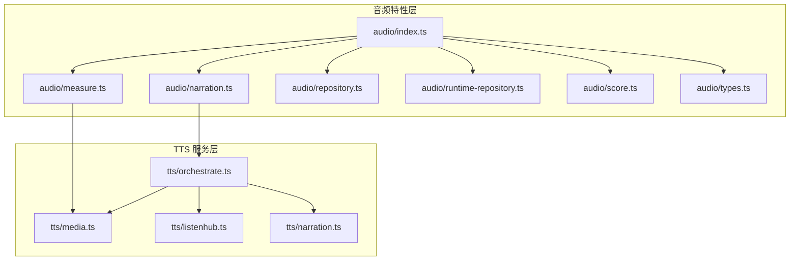
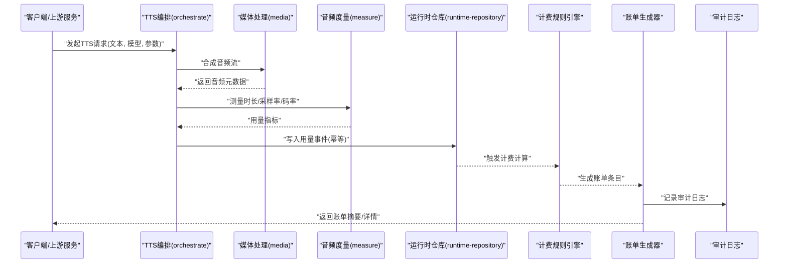
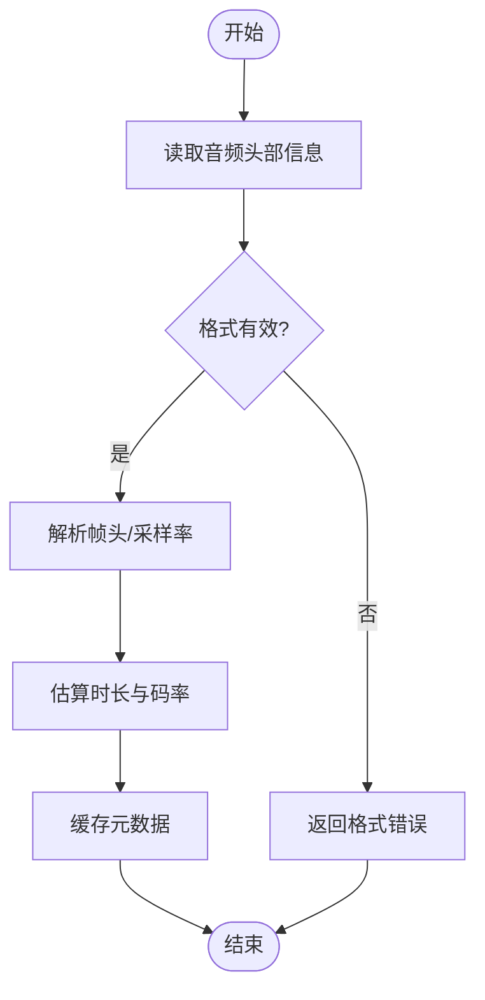
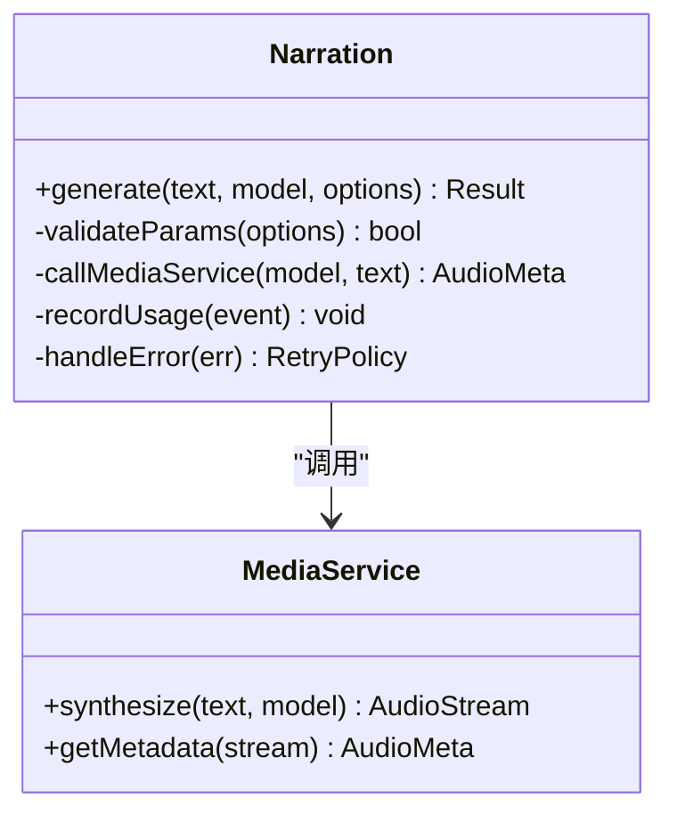
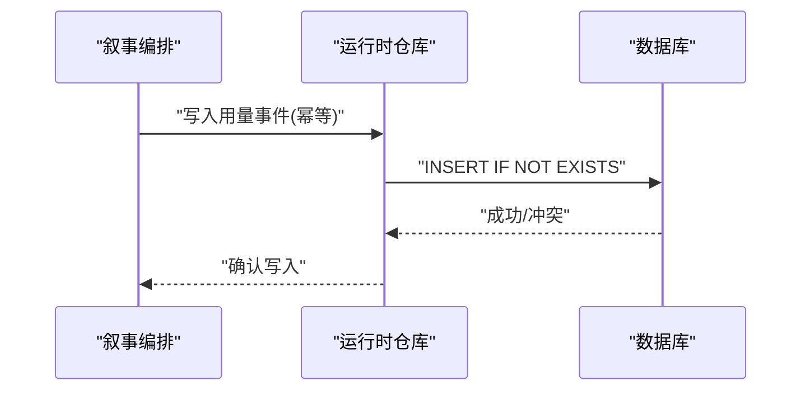
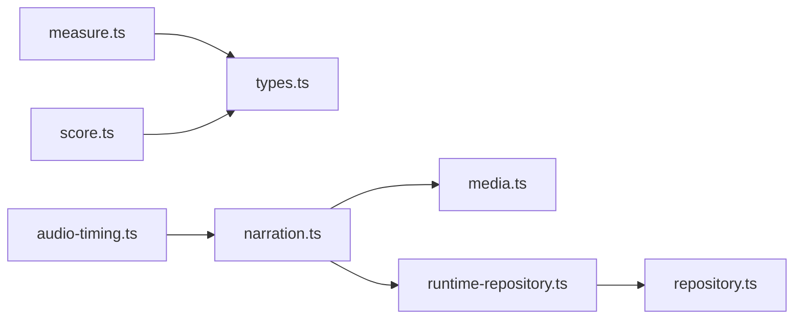

# 音频计费集成

<cite>
**本文引用的文件**   
- [src/features/audio/index.ts](file://src/features/audio/index.ts)
- [src/features/audio/measure.ts](file://src/features/audio/measure.ts)
- [src/features/audio/narration.ts](file://src/features/audio/narration.ts)
- [src/features/audio/repository.ts](file://src/features/audio/repository.ts)
- [src/features/audio/runtime-repository.ts](file://src/features/audio/runtime-repository.ts)
- [src/features/audio/score.ts](file://src/features/audio/score.ts)
- [src/features/audio/types.ts](file://src/features/audio/types.ts)
- [src/features/director/audio-timing.ts](file://src/features/director/audio-timing.ts)
- [server/src/tts/orchestrate.ts](file://server/src/tts/orchestrate.ts)
- [server/src/tts/media.ts](file://server/src/tts/media.ts)
- [server/src/tts/listenhub.ts](file://server/src/tts/listenhub.ts)
- [server/src/tts/narration.ts](file://server/src/tts/narration.ts)
- [tests/tts-narration.test.ts](file://tests/tts-narration.test.ts)
- [tests/tts-pipeline-integration.test.ts](file://tests/tts-pipeline-integration.test.ts)
- [tests/tts-runtime.test.ts](file://tests/tts-runtime.test.ts)
- [tests/tts-config.test.ts](file://tests/tts-config.test.ts)
</cite>

## 目录
1. [简介](#简介)
2. [项目结构](#项目结构)
3. [核心组件](#核心组件)
4. [架构总览](#架构总览)
5. [详细组件分析](#详细组件分析)
6. [依赖关系分析](#依赖关系分析)
7. [性能考量](#性能考量)
8. [故障排查指南](#故障排查指南)
9. [结论](#结论)
10. [附录](#附录)

## 简介
本文件面向“音频计费集成系统”，聚焦以下目标：
- 音频服务使用量统计：覆盖 TTS、音效、时长测量与聚合。
- 计费规则引擎：基于用量指标（字符数、时长、并发等）计算费用，支持可插拔规则。
- 账单生成机制：按周期汇总用量、应用折扣/封顶策略、输出账单明细。
- 托管音频服务的计费模式：按量付费、阶梯定价、配额控制与成本预警。
- 用量监控与成本控制：实时指标采集、阈值告警、限流与降级。
- 使用量聚合、报表生成与审计日志：多维度聚合、可视化报表、不可篡改审计。
- 计费接口集成、错误处理与异常补偿：对外 API、幂等性、重试与补偿事务。
- 配置示例与自定义计费规则实现指南。

## 项目结构
本项目将音频能力与计费相关逻辑集中在 features/audio 与 server/src/tts 两个区域：
- features/audio：提供音频度量、叙事编排、存储仓库、评分与类型定义，是计费数据的主要来源。
- server/src/tts：TTS 编排、媒体处理与监听器，负责实际调用外部 TTS 服务并产生用量事件。
- tests：围绕 TTS 与计费的测试用例，验证行为与边界条件。

图表来源
- [src/features/audio/index.ts](file://src/features/audio/index.ts)
- [src/features/audio/measure.ts](file://src/features/audio/measure.ts)
- [src/features/audio/narration.ts](file://src/features/audio/narration.ts)
- [src/features/audio/repository.ts](file://src/features/audio/repository.ts)
- [src/features/audio/runtime-repository.ts](file://src/features/audio/runtime-repository.ts)
- [src/features/audio/score.ts](file://src/features/audio/score.ts)
- [src/features/audio/types.ts](file://src/features/audio/types.ts)
- [server/src/tts/orchestrate.ts](file://server/src/tts/orchestrate.ts)
- [server/src/tts/media.ts](file://server/src/tts/media.ts)
- [server/src/tts/listenhub.ts](file://server/src/tts/listenhub.ts)
- [server/src/tts/narration.ts](file://server/src/tts/narration.ts)

章节来源
- [src/features/audio/index.ts](file://src/features/audio/index.ts)
- [server/src/tts/orchestrate.ts](file://server/src/tts/orchestrate.ts)

## 核心组件
- 音频度量（measure）：对音频片段进行时长、采样率、码率等指标测量，为计费提供基础数据。
- 叙事编排（narration）：协调文本到语音的生成流程，记录输入字符数、模型选择、失败重试等。
- 运行时仓库（runtime-repository）：持久化运行期用量事件，供后续聚合与审计。
- 存储仓库（repository）：管理历史用量、账单与结算数据的读写。
- 评分（score）：对音频质量或可用性进行打分，辅助计费策略（如质量加权）。
- 类型定义（types）：统一用量事件、账单条目、计费规则的数据结构。

章节来源
- [src/features/audio/measure.ts](file://src/features/audio/measure.ts)
- [src/features/audio/narration.ts](file://src/features/audio/narration.ts)
- [src/features/audio/repository.ts](file://src/features/audio/repository.ts)
- [src/features/audio/runtime-repository.ts](file://src/features/audio/runtime-repository.ts)
- [src/features/audio/score.ts](file://src/features/audio/score.ts)
- [src/features/audio/types.ts](file://src/features/audio/types.ts)

## 架构总览
整体计费架构分为四层：
- 数据采集层：TTS 编排与媒体处理在调用外部服务时采集用量事件（字符数、时长、并发、失败次数）。
- 计量与评分层：对原始数据进行标准化、去重、质量评分与指标聚合。
- 计费规则引擎：根据用量指标与规则配置计算费用，支持阶梯价、封顶、折扣。
- 账单与审计层：周期性汇总生成账单，输出明细与审计日志，并提供查询与导出接口。

图表来源
- [server/src/tts/orchestrate.ts](file://server/src/tts/orchestrate.ts)
- [server/src/tts/media.ts](file://server/src/tts/media.ts)
- [src/features/audio/measure.ts](file://src/features/audio/measure.ts)
- [src/features/audio/runtime-repository.ts](file://src/features/audio/runtime-repository.ts)
- [src/features/audio/repository.ts](file://src/features/audio/repository.ts)

## 详细组件分析

### 音频度量（measure）
- 职责：对音频片段进行时长、采样率、码率、声道数等指标测量；支持 MP3 帧头解析与快速估算。
- 复杂度：线性扫描音频数据，时间复杂度 O(N)，空间复杂度 O(1)。
- 优化点：对大文件采用分块读取与增量计算；缓存已计算的元数据。
- 错误处理：非法格式、截断文件、I/O 异常均返回结构化错误，便于上层重试或降级。

图表来源
- [src/features/audio/measure.ts](file://src/features/audio/measure.ts)

章节来源
- [src/features/audio/measure.ts](file://src/features/audio/measure.ts)

### 叙事编排（narration）
- 职责：协调文本到语音的合成流程，记录输入字符数、模型选择、重试次数、失败原因。
- 数据流：接收请求 -> 校验参数 -> 调用媒体处理 -> 收集用量事件 -> 写入运行时仓库。
- 幂等性：通过唯一请求 ID 避免重复计费。
- 错误处理：网络超时、模型不可用、配额不足等场景进行回退与告警。

图表来源
- [src/features/audio/narration.ts](file://src/features/audio/narration.ts)
- [server/src/tts/media.ts](file://server/src/tts/media.ts)

章节来源
- [src/features/audio/narration.ts](file://src/features/audio/narration.ts)
- [server/src/tts/media.ts](file://server/src/tts/media.ts)

### 运行时仓库（runtime-repository）
- 职责：持久化用量事件，保证事件顺序与幂等；提供按时间窗口、模型、租户维度的查询。
- 数据结构：事件包含请求ID、时间戳、模型、字符数、时长、状态、错误码等。
- 一致性：写入前检查重复键，避免重复计费；失败时重试与死信队列。

图表来源
- [src/features/audio/runtime-repository.ts](file://src/features/audio/runtime-repository.ts)

章节来源
- [src/features/audio/runtime-repository.ts](file://src/features/audio/runtime-repository.ts)

### 存储仓库（repository）
- 职责：管理历史用量、账单与结算数据；提供聚合查询与导出接口。
- 功能：按租户、时间范围、模型维度聚合；生成账单明细与汇总。
- 审计：所有写操作附带审计标签，支持追溯与合规审查。

章节来源
- [src/features/audio/repository.ts](file://src/features/audio/repository.ts)

### 评分（score）
- 职责：对音频质量或可用性进行打分，影响计费权重（如高质量优先加价）。
- 指标：清晰度、延迟、丢包率、用户反馈等。
- 策略：动态权重调整，结合业务目标优化体验与成本。

章节来源
- [src/features/audio/score.ts](file://src/features/audio/score.ts)

### 类型定义（types）
- 职责：统一定义用量事件、账单条目、计费规则、审计日志的结构。
- 扩展性：新增字段需保持向后兼容，提供迁移脚本。

章节来源
- [src/features/audio/types.ts](file://src/features/audio/types.ts)

### 音频时序（audio-timing）
- 职责：确保音频与视频/字幕的时序对齐，避免计费偏差（如重复播放、静音段不计费）。
- 算法：基于关键帧与时间戳对齐，剔除无效区间。

章节来源
- [src/features/director/audio-timing.ts](file://src/features/director/audio-timing.ts)

### TTS 编排与监听（orchestrate & listenhub）
- 职责：编排 TTS 调用链，监听外部服务状态与配额变化，触发限流与降级。
- 集成：对接第三方 TTS 提供商，统一抽象接口。

章节来源
- [server/src/tts/orchestrate.ts](file://server/src/tts/orchestrate.ts)
- [server/src/tts/listenhub.ts](file://server/src/tts/listenhub.ts)

## 依赖关系分析
- 低耦合高内聚：各模块职责清晰，通过接口与类型定义解耦。
- 外部依赖：TTS 提供商、数据库、消息队列（用于异步计费与审计）。
- 潜在循环依赖：通过分层与事件驱动避免循环引用。

图表来源
- [src/features/audio/measure.ts](file://src/features/audio/measure.ts)
- [src/features/audio/types.ts](file://src/features/audio/types.ts)
- [src/features/audio/narration.ts](file://src/features/audio/narration.ts)
- [server/src/tts/media.ts](file://server/src/tts/media.ts)
- [src/features/audio/runtime-repository.ts](file://src/features/audio/runtime-repository.ts)
- [src/features/audio/repository.ts](file://src/features/audio/repository.ts)
- [src/features/audio/score.ts](file://src/features/audio/score.ts)
- [src/features/director/audio-timing.ts](file://src/features/director/audio-timing.ts)

章节来源
- [src/features/audio/index.ts](file://src/features/audio/index.ts)

## 性能考量
- 批量写入：用量事件批量入库，减少 I/O 开销。
- 增量聚合：按时间窗口增量计算，避免全量扫描。
- 缓存热点：常用模型与租户的计费规则缓存，降低计算延迟。
- 异步处理：计费计算与账单生成异步化，提升吞吐。
- 资源限制：并发度与内存使用上限，防止雪崩。

## 故障排查指南
- 常见问题：
  - 用量事件丢失：检查运行时仓库写入与重试策略。
  - 计费偏差：核对时长测量与音频时序对齐。
  - 账单不一致：审计日志与数据库快照对比。
- 调试工具：
  - 启用详细日志，记录请求 ID 与错误堆栈。
  - 使用测试用例复现场景（见 tests 目录）。
- 恢复策略：
  - 死信队列重放，补偿未处理事件。
  - 回滚至最近一致快照，重新计算。

章节来源
- [tests/tts-narration.test.ts](file://tests/tts-narration.test.ts)
- [tests/tts-pipeline-integration.test.ts](file://tests/tts-pipeline-integration.test.ts)
- [tests/tts-runtime.test.ts](file://tests/tts-runtime.test.ts)
- [tests/tts-config.test.ts](file://tests/tts-config.test.ts)

## 结论
本系统通过清晰的模块化设计与事件驱动架构，实现了音频服务使用量的精准统计、灵活的计费规则与可靠的账单生成。结合实时监控、成本控制与审计日志，为托管音频服务提供了完整的计费解决方案。未来可扩展更多计费模式与智能优化策略，进一步提升用户体验与成本效益。

## 附录
- 计费配置示例：
  - 按字符数计费：每千字符单价、阶梯折扣、月度封顶。
  - 按时长计费：每分钟单价、静音段豁免、质量加权。
  - 并发控制：最大并发数、排队策略、超时降级。
- 自定义计费规则实现指南：
  - 定义新规则类型与权重计算函数。
  - 注册到计费引擎，支持热更新。
  - 编写单元测试与集成测试，验证边界条件。
- 审计日志规范：
  - 必填字段：时间戳、请求ID、租户ID、动作、结果、错误码。
  - 不可篡改：追加写入，哈希校验。
- 报表生成：
  - 维度：租户、模型、时间范围、地域。
  - 格式：CSV、JSON、PDF。
  - 定时任务：每日/每周/每月自动生成。