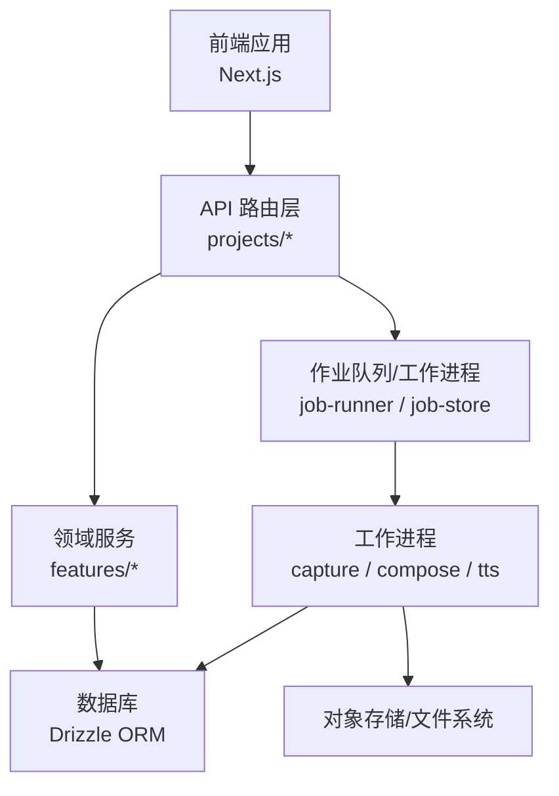
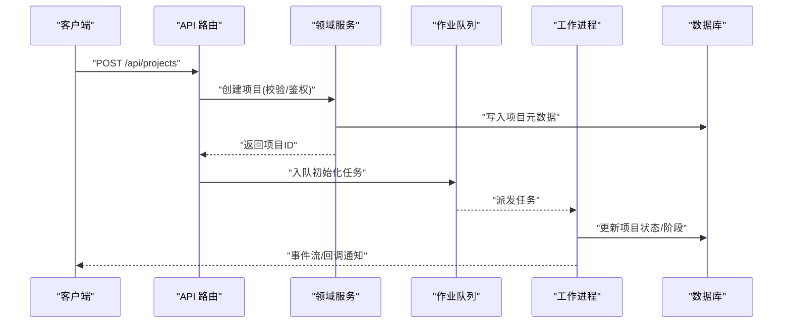
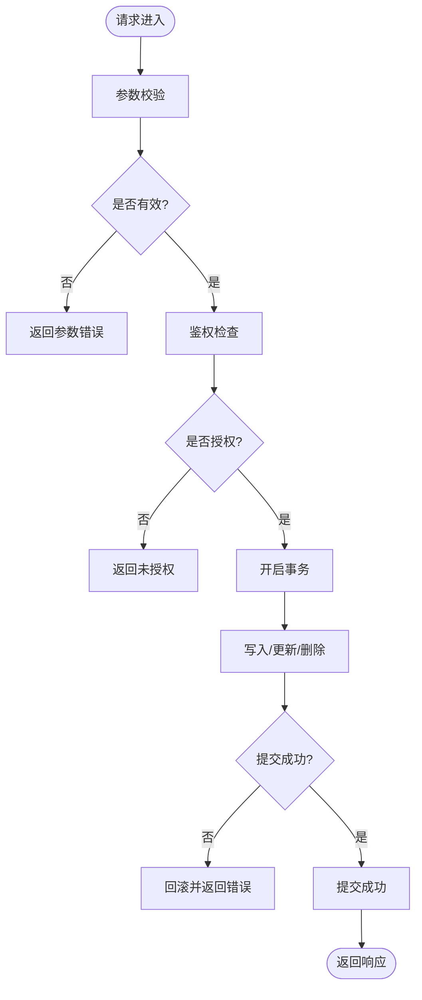
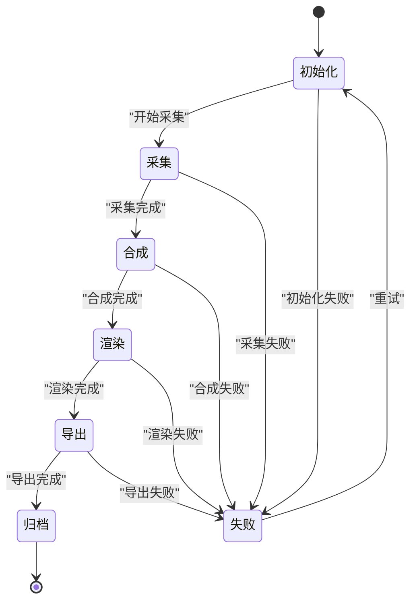
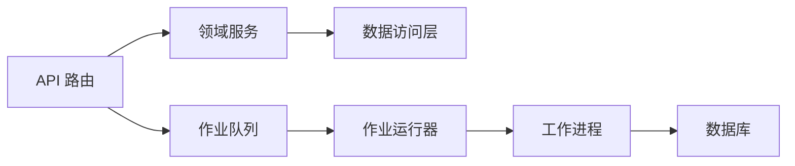

# 项目服务层

<cite>
**本文引用的文件**   
- [src/app/api/projects/route.ts](file://src/app/api/projects/route.ts)
- [src/app/api/projects/[id]/route.ts](file://src/app/api/projects/[id]/route.ts)
- [src/features/projects/project-list.tsx](file://src/features/projects/project-list.tsx)
- [src/features/projects/project-list.test.ts](file://src/features/projects/project-list.test.ts)
- [src/app/_components/new-project-api.ts](file://src/app/_components/new-project-api.ts)
- [src/app/_components/new-project-dialog.tsx](file://src/app/_components/new-project-dialog.tsx)
- [drizzle.config.ts](file://drizzle.config.ts)
- [scripts/setup/db-migrate.ts](file://scripts/setup/db-migrate.ts)
- [scripts/migration/sqlite-backup.ts](file://scripts/migration/sqlite-backup.ts)
- [scripts/migration/export-sqlite.ts](file://scripts/migration/export-sqlite.ts)
- [scripts/migration/import-postgres.ts](file://scripts/migration/import-postgres.ts)
- [scripts/migration/reconcile-postgres.ts](file://scripts/migration/reconcile-postgres.ts)
- [server/src/server/job-runner.ts](file://server/src/server/job-runner.ts)
- [server/src/server/job-store.ts](file://server/src/server/job-store.ts)
- [server/src/compose/project.ts](file://server/src/compose/project.ts)
- [server/src/compose/render.ts](file://server/src/compose/render.ts)
- [server/src/compose/run-pipeline.ts](file://server/src/compose/run-pipeline.ts)
- [server/src/capture/run-capture.ts](file://server/src/capture/run-capture.ts)
- [server/src/tts/orchestrate.ts](file://server/src/tts/orchestrate.ts)
- [server/src/lib/logger.ts](file://server/src/lib/logger.ts)
- [server/src/lib/llm-response-parser.ts](file://server/src/lib/llm-response-parser.ts)
- [server/src/lib/error-message.ts](file://server/src/lib/error-message.ts)
</cite>

## 目录
1. [简介](#简介)
2. [项目结构](#项目结构)
3. [核心组件](#核心组件)
4. [架构总览](#架构总览)
5. [详细组件分析](#详细组件分析)
6. [依赖关系分析](#依赖关系分析)
7. [性能考虑](#性能考虑)
8. [故障排查指南](#故障排查指南)
9. [结论](#结论)
10. [附录](#附录)

## 简介
本文件面向 PurpleInk 项目的“项目服务层”，聚焦项目管理核心能力与数据一致性保障，覆盖以下主题：
- 项目 CRUD 操作、生命周期管理、状态转换与权限控制机制
- 项目模板、克隆与迁移策略
- 数据备份、恢复与清理机制
- 与数据库的交互模式、事务管理与查询优化
- 扩展开发与自定义属性的实现指南

该文档以代码仓库中的实际实现为依据，结合 API 路由、特性模块、脚本与服务器端编排组件进行系统化说明。

## 项目结构
项目服务层由前端 API 路由、特性模块、服务端编排与脚本工具共同构成：
- API 路由层：提供 RESTful 接口，负责请求校验、鉴权、调用领域服务并返回响应
- 特性模块：封装业务逻辑（如项目列表、渲染、导演流水线等）
- 服务端编排：调度任务、执行捕获/合成/TTS 等长耗时流程
- 脚本工具：数据库迁移、备份/恢复、数据对齐等运维能力

图表来源
- [src/app/api/projects/route.ts](file://src/app/api/projects/route.ts)
- [src/app/api/projects/[id]/route.ts](file://src/app/api/projects/[id]/route.ts)
- [server/src/server/job-runner.ts](file://server/src/server/job-runner.ts)
- [server/src/server/job-store.ts](file://server/src/server/job-store.ts)

章节来源
- [src/app/api/projects/route.ts](file://src/app/api/projects/route.ts)
- [src/app/api/projects/[id]/route.ts](file://src/app/api/projects/[id]/route.ts)
- [drizzle.config.ts](file://drizzle.config.ts)

## 核心组件
- 项目 API 路由
  - 列表与创建：提供 GET/POST 接口，处理参数校验、权限检查、调用领域服务
  - 详情与更新：提供 GET/PUT/PATCH/DELETE 接口，支持按 ID 获取、更新、删除
- 项目列表特性模块
  - 展示与筛选：聚合项目元数据，支持分页、排序、过滤
- 新建项目对话框与 API 辅助
  - 表单校验、模板选择、默认属性填充、错误提示
- 作业运行器与存储
  - 任务入队、出队、重试、失败处理；持久化作业状态
- 编排与执行
  - 项目级流水线编排（渲染、捕获、TTS），阶段推进与结果落库

章节来源
- [src/app/api/projects/route.ts](file://src/app/api/projects/route.ts)
- [src/app/api/projects/[id]/route.ts](file://src/app/api/projects/[id]/route.ts)
- [src/features/projects/project-list.tsx](file://src/features/projects/project-list.tsx)
- [src/app/_components/new-project-api.ts](file://src/app/_components/new-project-api.ts)
- [src/app/_components/new-project-dialog.tsx](file://src/app/_components/new-project-dialog.tsx)
- [server/src/server/job-runner.ts](file://server/src/server/job-runner.ts)
- [server/src/server/job-store.ts](file://server/src/server/job-store.ts)

## 架构总览
项目服务层采用“API 路由 + 领域服务 + 作业编排”的分层架构：
- API 路由层：对外暴露 REST 接口，统一鉴权、校验、错误处理
- 领域服务层：封装项目生命周期、状态机、权限与一致性约束
- 作业编排层：将长耗时任务异步化，保证可观测性与可恢复性
- 数据访问层：通过 Drizzle ORM 与数据库交互，支持事务与索引优化

图表来源
- [src/app/api/projects/route.ts](file://src/app/api/projects/route.ts)
- [server/src/server/job-runner.ts](file://server/src/server/job-runner.ts)
- [server/src/server/job-store.ts](file://server/src/server/job-store.ts)

## 详细组件分析

### 项目 API 路由（CRUD）
- 功能要点
  - 列表查询：支持分页、排序、过滤，返回项目摘要
  - 创建项目：接收模板标识、初始属性，生成唯一 ID，写入元数据
  - 详情/更新/删除：按 ID 操作，包含权限校验与并发安全
- 数据一致性
  - 使用事务包裹关键写操作，确保元数据与关联表一致
  - 对幂等键（如外部引用 ID）做冲突检测与去重
- 权限控制
  - 基于用户上下文与资源归属进行授权，拒绝越权访问
- 错误处理
  - 统一错误码与消息，区分参数错误、权限不足、资源不存在等

图表来源
- [src/app/api/projects/route.ts](file://src/app/api/projects/route.ts)
- [src/app/api/projects/[id]/route.ts](file://src/app/api/projects/[id]/route.ts)

章节来源
- [src/app/api/projects/route.ts](file://src/app/api/projects/route.ts)
- [src/app/api/projects/[id]/route.ts](file://src/app/api/projects/[id]/route.ts)

### 项目列表与展示
- 功能要点
  - 聚合项目元数据，支持按时间、名称、状态筛选
  - 分页加载与懒渲染，提升大列表性能
- 性能优化
  - 使用只读视图或物化查询减少热点表压力
  - 缓存最近访问项目列表，缩短首屏时间

章节来源
- [src/features/projects/project-list.tsx](file://src/features/projects/project-list.tsx)
- [src/features/projects/project-list.test.ts](file://src/features/projects/project-list.test.ts)

### 新建项目与模板
- 功能要点
  - 模板选择：内置模板与自定义模板注册
  - 默认属性填充：根据模板注入初始字段与配置
  - 表单校验：前端与后端双重校验，避免脏数据入库
- 模板与克隆
  - 模板定义：结构化描述项目结构与默认值
  - 克隆策略：复制模板为实例，建立独立命名空间与权限边界

章节来源
- [src/app/_components/new-project-api.ts](file://src/app/_components/new-project-api.ts)
- [src/app/_components/new-project-dialog.tsx](file://src/app/_components/new-project-dialog.tsx)

### 作业编排与项目生命周期
- 功能要点
  - 生命周期阶段：初始化、采集、合成、渲染、导出、归档
  - 状态机：严格的状态转换规则，禁止非法跳转
  - 进度与事件：阶段性事件上报，便于前端实时反馈
- 可靠性
  - 任务重试与退避策略
  - 失败补偿与人工干预入口

图表来源
- [server/src/compose/project.ts](file://server/src/compose/project.ts)
- [server/src/compose/render.ts](file://server/src/compose/render.ts)
- [server/src/compose/run-pipeline.ts](file://server/src/compose/run-pipeline.ts)
- [server/src/capture/run-capture.ts](file://server/src/capture/run-capture.ts)
- [server/src/tts/orchestrate.ts](file://server/src/tts/orchestrate.ts)

章节来源
- [server/src/server/job-runner.ts](file://server/src/server/job-runner.ts)
- [server/src/server/job-store.ts](file://server/src/server/job-store.ts)
- [server/src/compose/project.ts](file://server/src/compose/project.ts)
- [server/src/compose/render.ts](file://server/src/compose/render.ts)
- [server/src/compose/run-pipeline.ts](file://server/src/compose/run-pipeline.ts)
- [server/src/capture/run-capture.ts](file://server/src/capture/run-capture.ts)
- [server/src/tts/orchestrate.ts](file://server/src/tts/orchestrate.ts)

### 数据备份、恢复与清理
- 备份
  - SQLite 快照与导出：定时备份与按需导出
  - Postgres 导入：跨库迁移与版本对齐
- 恢复
  - 从备份还原至新环境，重建索引与约束
- 清理
  - 过期任务与临时文件清理，释放存储空间

章节来源
- [scripts/migration/sqlite-backup.ts](file://scripts/migration/sqlite-backup.ts)
- [scripts/migration/export-sqlite.ts](file://scripts/migration/export-sqlite.ts)
- [scripts/migration/import-postgres.ts](file://scripts/migration/import-postgres.ts)
- [scripts/migration/reconcile-postgres.ts](file://scripts/migration/reconcile-postgres.ts)

### 数据库交互与事务管理
- 交互模式
  - 使用 Drizzle ORM 进行类型安全的查询与变更
  - 读写分离：列表查询走只读副本，写操作走主库
- 事务管理
  - 关键写路径包裹事务，确保原子性与一致性
  - 死锁检测与重试策略，提升高并发稳定性
- 查询优化
  - 合理索引设计，避免全表扫描
  - 分页与投影裁剪，减少网络与内存开销

章节来源
- [drizzle.config.ts](file://drizzle.config.ts)
- [scripts/setup/db-migrate.ts](file://scripts/setup/db-migrate.ts)

## 依赖关系分析
- 组件耦合
  - API 路由依赖领域服务，领域服务依赖数据访问层
  - 作业运行器与工作进程解耦，通过队列通信
- 外部依赖
  - 数据库驱动、对象存储、消息队列
- 潜在循环依赖
  - 通过接口抽象与依赖注入避免循环引用

图表来源
- [src/app/api/projects/route.ts](file://src/app/api/projects/route.ts)
- [server/src/server/job-runner.ts](file://server/src/server/job-runner.ts)
- [server/src/server/job-store.ts](file://server/src/server/job-store.ts)

章节来源
- [src/app/api/projects/route.ts](file://src/app/api/projects/route.ts)
- [server/src/server/job-runner.ts](file://server/src/server/job-runner.ts)
- [server/src/server/job-store.ts](file://server/src/server/job-store.ts)

## 性能考虑
- 列表与详情
  - 使用分页、排序与过滤减少数据传输量
  - 缓存热点数据，降低数据库压力
- 作业编排
  - 并行度控制与限流，避免资源争用
  - 任务分片与断点续传，提升容错能力
- 数据库
  - 索引优化与查询计划审查
  - 连接池大小与超时配置调优

## 故障排查指南
- 常见问题
  - 权限不足：检查用户上下文与资源归属
  - 状态不一致：查看作业日志与数据库事务状态
  - 备份失败：确认存储路径与权限
- 诊断工具
  - 日志收集：集中式日志与链路追踪
  - 健康检查：API 与数据库连通性检测

章节来源
- [server/src/lib/logger.ts](file://server/src/lib/logger.ts)
- [server/src/lib/error-message.ts](file://server/src/lib/error-message.ts)
- [server/src/lib/llm-response-parser.ts](file://server/src/lib/llm-response-parser.ts)

## 结论
PurpleInk 项目服务层通过清晰的层次划分与严格的约束，实现了可靠的项目管理与数据处理能力。API 路由、领域服务、作业编排与数据访问各司其职，配合完善的备份恢复与监控机制，保障了系统的稳定性与可扩展性。建议在生产环境中持续优化索引与并发策略，完善权限模型与审计日志，进一步提升系统的安全性与性能。

## 附录
- 扩展开发指南
  - 新增自定义属性：在模板定义中扩展字段，并在 API 路由与领域服务中同步校验与持久化
  - 新增阶段：在工作进程中实现阶段逻辑，定义状态转换与事件上报
  - 插件化：通过接口抽象接入第三方服务，保持核心逻辑稳定