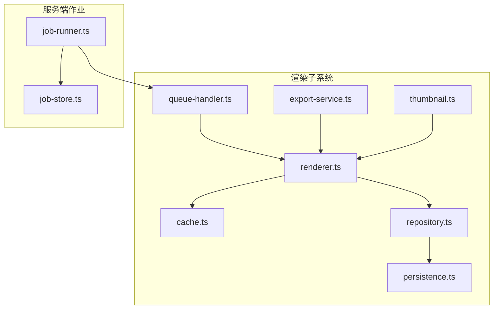
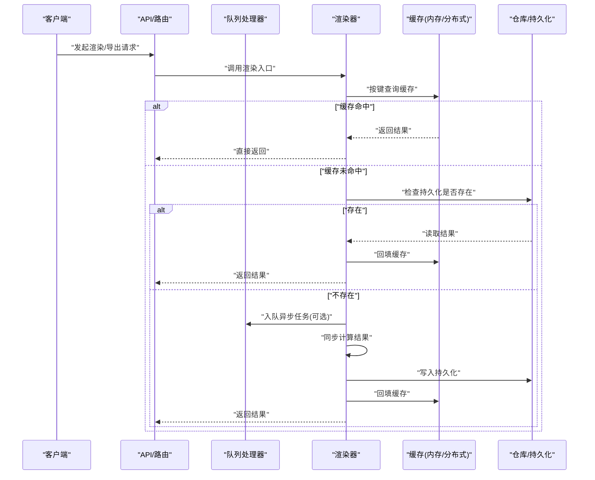
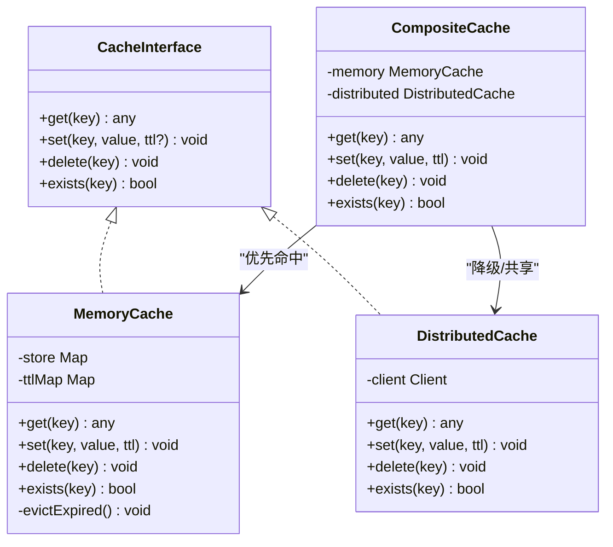
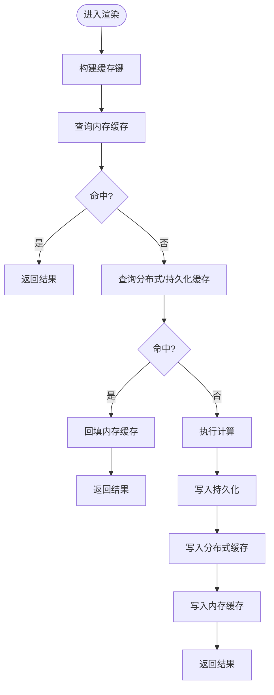
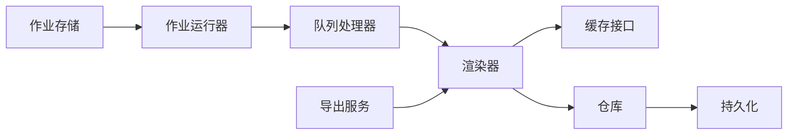

# 缓存策略

<cite>
**本文引用的文件**   
- [src/features/render/cache.ts](file://src/features/render/cache.ts)
- [src/features/render/cache.pg.test.ts](file://src/features/render/cache.pg.test.ts)
- [src/features/render/renderer.ts](file://src/features/render/renderer.ts)
- [src/features/render/repository.ts](file://src/features/render/repository.ts)
- [src/features/render/persistence.ts](file://src/features/render/persistence.ts)
- [src/features/render/queue-handler.ts](file://src/features/render/queue-handler.ts)
- [src/features/render/export-service.ts](file://src/features/render/export-service.ts)
- [src/features/render/thumbnail.ts](file://src/features/render/thumbnail.ts)
- [server/src/server/job-runner.ts](file://server/src/server/job-runner.ts)
- [server/src/server/job-store.ts](file://server/src/server/job-store.ts)
</cite>

## 目录
1. [简介](#简介)
2. [项目结构](#项目结构)
3. [核心组件](#核心组件)
4. [架构总览](#架构总览)
5. [详细组件分析](#详细组件分析)
6. [依赖关系分析](#依赖关系分析)
7. [性能考量](#性能考量)
8. [故障排查指南](#故障排查指南)
9. [结论](#结论)
10. [附录](#附录)

## 简介
本技术文档围绕 PurpleInK 渲染与导出子系统的缓存策略展开，重点覆盖多级缓存架构（内存缓存、持久化/分布式缓存）、缓存失效策略、数据一致性保障、缓存穿透防护、热点数据识别与预加载/预热机制、性能监控与命中率统计、容量规划以及配置管理与动态调整、故障恢复方案。文档面向研发与运维人员，兼顾非技术读者理解。

## 项目结构
与缓存相关的关键代码集中在 src/features/render 目录，涉及缓存实现、渲染器、仓库与持久化层；服务端侧的 job-runner 与 job-store 负责任务调度与状态存储，影响缓存写入时机与一致性边界。

图表来源
- [src/features/render/renderer.ts](file://src/features/render/renderer.ts)
- [src/features/render/cache.ts](file://src/features/render/cache.ts)
- [src/features/render/repository.ts](file://src/features/render/repository.ts)
- [src/features/render/persistence.ts](file://src/features/render/persistence.ts)
- [src/features/render/queue-handler.ts](file://src/features/render/queue-handler.ts)
- [src/features/render/export-service.ts](file://src/features/render/export-service.ts)
- [src/features/render/thumbnail.ts](file://src/features/render/thumbnail.ts)
- [server/src/server/job-runner.ts](file://server/src/server/job-runner.ts)
- [server/src/server/job-store.ts](file://server/src/server/job-store.ts)

章节来源
- [src/features/render/cache.ts](file://src/features/render/cache.ts)
- [src/features/render/cache.pg.test.ts](file://src/features/render/cache.pg.test.ts)
- [src/features/render/renderer.ts](file://src/features/render/renderer.ts)
- [src/features/render/repository.ts](file://src/features/render/repository.ts)
- [src/features/render/persistence.ts](file://src/features/render/persistence.ts)
- [src/features/render/queue-handler.ts](file://src/features/render/queue-handler.ts)
- [src/features/render/export-service.ts](file://src/features/render/export-service.ts)
- [src/features/render/thumbnail.ts](file://src/features/render/thumbnail.ts)
- [server/src/server/job-runner.ts](file://server/src/server/job-runner.ts)
- [server/src/server/job-store.ts](file://server/src/server/job-store.ts)

## 核心组件
- 缓存抽象与实现：提供统一的缓存接口与具体实现，支持内存缓存与后端持久化/分布式缓存的切换与组合。
- 渲染器：在生成或转换资源时优先命中缓存，未命中则执行计算并回填缓存。
- 仓库与持久化：对渲染产物进行统一存取，作为二级缓存或最终落盘点。
- 队列处理器与导出服务：将耗时任务异步化，结合缓存减少重复计算。
- 缩略图：针对高频读取的小尺寸资源提供独立缓存路径。
- 作业运行器与作业存储：协调任务生命周期，确保缓存写入与状态一致。

章节来源
- [src/features/render/cache.ts](file://src/features/render/cache.ts)
- [src/features/render/renderer.ts](file://src/features/render/renderer.ts)
- [src/features/render/repository.ts](file://src/features/render/repository.ts)
- [src/features/render/persistence.ts](file://src/features/render/persistence.ts)
- [src/features/render/queue-handler.ts](file://src/features/render/queue-handler.ts)
- [src/features/render/export-service.ts](file://src/features/render/export-service.ts)
- [src/features/render/thumbnail.ts](file://src/features/render/thumbnail.ts)
- [server/src/server/job-runner.ts](file://server/src/server/job-runner.ts)
- [server/src/server/job-store.ts](file://server/src/server/job-store.ts)

## 架构总览
PurpleInK 的缓存体系采用“多级缓存 + 异步任务”的组合模式：
- 一级缓存：进程内内存缓存，用于极短 TTL 的高频读场景，降低延迟。
- 二级缓存：持久化/分布式缓存（如对象存储或数据库），用于跨实例共享与容灾。
- 计算层：渲染器根据输入参数生成结果，命中缓存则直接返回，未命中则计算后回填。
- 任务层：通过队列处理器与作业运行器解耦耗时操作，避免阻塞请求链路。

图表来源
- [src/features/render/renderer.ts](file://src/features/render/renderer.ts)
- [src/features/render/cache.ts](file://src/features/render/cache.ts)
- [src/features/render/repository.ts](file://src/features/render/repository.ts)
- [src/features/render/queue-handler.ts](file://src/features/render/queue-handler.ts)

章节来源
- [src/features/render/renderer.ts](file://src/features/render/renderer.ts)
- [src/features/render/cache.ts](file://src/features/render/cache.ts)
- [src/features/render/repository.ts](file://src/features/render/repository.ts)
- [src/features/render/queue-handler.ts](file://src/features/render/queue-handler.ts)

## 详细组件分析

### 缓存抽象与实现（内存缓存与分布式缓存）
- 设计要点
  - 统一接口：定义 get/set/delete/exists 等基础方法，屏蔽底层差异。
  - 多级组合：先查内存，再查持久化/分布式，最后回源计算。
  - TTL 与淘汰：支持过期时间与 LRU/LFU 策略，控制内存占用。
  - 并发安全：读写锁或原子操作，避免竞态条件。
  - 可观测性：记录命中率、延迟、错误率等指标。
- 使用场景
  - 内存缓存：热键、短 TTL、低延迟读。
  - 分布式缓存：跨实例共享、长 TTL、高可用。
- 失效策略
  - 主动失效：更新或删除键。
  - 被动失效：TTL 到期自动清理。
  - 版本化键：通过版本号或哈希变更触发失效。
- 穿透防护
  - 布隆过滤器：拦截不存在的键。
  - 空值缓存：为短期不存在的键设置短 TTL 占位。
  - 限流与熔断：防止雪崩。

图表来源
- [src/features/render/cache.ts](file://src/features/render/cache.ts)

章节来源
- [src/features/render/cache.ts](file://src/features/render/cache.ts)
- [src/features/render/cache.pg.test.ts](file://src/features/render/cache.pg.test.ts)

### 渲染器与缓存集成
- 职责
  - 构建稳定的缓存键（基于输入参数哈希）。
  - 命中缓存直接返回，未命中则计算并回填。
  - 处理异常与降级，保证可用性。
- 关键点
  - 幂等性：相同输入产生相同输出，便于缓存复用。
  - 细粒度键空间：避免大对象污染缓存。
  - 写回顺序：先写持久化，再写缓存，保证一致性。

图表来源
- [src/features/render/renderer.ts](file://src/features/render/renderer.ts)
- [src/features/render/cache.ts](file://src/features/render/cache.ts)
- [src/features/render/repository.ts](file://src/features/render/repository.ts)

章节来源
- [src/features/render/renderer.ts](file://src/features/render/renderer.ts)
- [src/features/render/cache.ts](file://src/features/render/cache.ts)
- [src/features/render/repository.ts](file://src/features/render/repository.ts)

### 仓库与持久化层
- 职责
  - 统一读写渲染产物，作为二级缓存与最终落盘。
  - 提供事务或幂等写入，避免重复与脏数据。
- 关键点
  - 分桶/命名空间隔离不同业务域。
  - 压缩与分片优化存储与传输。
  - 校验和校验数据完整性。

章节来源
- [src/features/render/repository.ts](file://src/features/render/repository.ts)
- [src/features/render/persistence.ts](file://src/features/render/persistence.ts)

### 队列处理器与导出服务
- 职责
  - 将耗时渲染/导出任务异步化，提升吞吐。
  - 结合缓存减少重复计算，失败重试与死信处理。
- 关键点
  - 任务去重：基于键或指纹避免重复入队。
  - 背压与限流：保护下游与缓存。
  - 进度与回调：前端可感知任务状态。

章节来源
- [src/features/render/queue-handler.ts](file://src/features/render/queue-handler.ts)
- [src/features/render/export-service.ts](file://src/features/render/export-service.ts)

### 缩略图缓存
- 职责
  - 为高频访问的缩略图提供独立缓存路径与策略。
- 关键点
  - 小尺寸、短 TTL、高命中率。
  - 与主资源缓存键分离，避免相互影响。

章节来源
- [src/features/render/thumbnail.ts](file://src/features/render/thumbnail.ts)

### 作业运行器与作业存储
- 职责
  - 调度任务执行，维护任务状态与生命周期。
  - 与缓存写入时机协同，确保一致性。
- 关键点
  - 幂等执行与去重。
  - 失败重试与告警。
  - 与持久化/分布式缓存的协作顺序。

章节来源
- [server/src/server/job-runner.ts](file://server/src/server/job-runner.ts)
- [server/src/server/job-store.ts](file://server/src/server/job-store.ts)

## 依赖关系分析
- 耦合关系
  - 渲染器强依赖缓存接口，弱依赖持久化层。
  - 仓库与持久化层解耦，便于替换存储后端。
  - 队列处理器与作业运行器通过消息协议交互。
- 外部依赖
  - 分布式缓存客户端（如 Redis）。
  - 对象存储或数据库（如 S3/Postgres）。
- 潜在循环依赖
  - 通过接口与事件解耦，避免模块间循环引用。

图表来源
- [src/features/render/renderer.ts](file://src/features/render/renderer.ts)
- [src/features/render/cache.ts](file://src/features/render/cache.ts)
- [src/features/render/repository.ts](file://src/features/render/repository.ts)
- [src/features/render/persistence.ts](file://src/features/render/persistence.ts)
- [src/features/render/queue-handler.ts](file://src/features/render/queue-handler.ts)
- [src/features/render/export-service.ts](file://src/features/render/export-service.ts)
- [server/src/server/job-runner.ts](file://server/src/server/job-runner.ts)
- [server/src/server/job-store.ts](file://server/src/server/job-store.ts)

章节来源
- [src/features/render/renderer.ts](file://src/features/render/renderer.ts)
- [src/features/render/cache.ts](file://src/features/render/cache.ts)
- [src/features/render/repository.ts](file://src/features/render/repository.ts)
- [src/features/render/persistence.ts](file://src/features/render/persistence.ts)
- [src/features/render/queue-handler.ts](file://src/features/render/queue-handler.ts)
- [src/features/render/export-service.ts](file://src/features/render/export-service.ts)
- [server/src/server/job-runner.ts](file://server/src/server/job-runner.ts)
- [server/src/server/job-store.ts](file://server/src/server/job-store.ts)

## 性能考量
- 命中率与延迟
  - 目标：内存缓存命中率 > 90%，P95 延迟 < 5ms。
  - 监控：QPS、命中率、平均/分位延迟、错误率。
- 容量规划
  - 内存缓存：按热点键数量与大小估算，预留 20% 冗余。
  - 分布式缓存：按键总量与 TTL 估算，考虑副本与分区。
  - 持久化：按 IOPS 与带宽评估，启用压缩与分片。
- 预热与预加载
  - 启动阶段加载热点键集合。
  - 定时任务增量预热新热点。
- 限流与熔断
  - 对上游请求限流，对下游缓存/存储熔断。
- 批处理与合并
  - 批量写入与读取，减少网络与 IO 开销。

[本节为通用指导，无需特定文件来源]

## 故障排查指南
- 常见问题
  - 缓存未命中率高：检查键生成是否稳定、TTL 是否过短、预热是否生效。
  - 数据不一致：确认写回顺序（先持久化后缓存）、并发写入冲突。
  - 穿透导致雪崩：检查布隆过滤器与空值缓存策略。
  - 内存溢出：检查 LRU/LFU 阈值、对象大小与淘汰策略。
  - 分布式缓存不可用：检查连接池、超时与重试策略。
- 诊断步骤
  - 查看命中率与延迟指标，定位瓶颈。
  - 抽样日志追踪关键键的读写路径。
  - 模拟负载验证预热与限流效果。
  - 灰度发布与回滚预案。

章节来源
- [src/features/render/cache.pg.test.ts](file://src/features/render/cache.pg.test.ts)
- [src/features/render/renderer.ts](file://src/features/render/renderer.ts)
- [src/features/render/queue-handler.ts](file://src/features/render/queue-handler.ts)
- [server/src/server/job-runner.ts](file://server/src/server/job-runner.ts)

## 结论
PurpleInK 的缓存策略以多级缓存为核心，结合异步任务与持久化层，实现了高吞吐、低延迟与高可用的渲染与导出能力。通过严格的键设计、失效策略、穿透防护与完善的监控告警，系统能够在复杂生产环境中保持稳定与弹性。建议持续优化热点识别与预热机制，完善容量规划与故障恢复流程，进一步提升整体性能与可靠性。

[本节为总结性内容，无需特定文件来源]

## 附录
- 配置管理建议
  - 环境变量集中管理，区分开发/测试/生产环境。
  - 动态调整：支持运行时修改 TTL、容量上限与开关。
  - 灰度与回滚：按租户或流量比例逐步放量。
- 监控与告警
  - 指标：命中率、延迟、错误率、内存使用、队列长度。
  - 告警：命中率骤降、延迟突增、错误率超阈、内存接近上限。
- 最佳实践
  - 幂等性与版本化键。
  - 小对象优先，避免大对象污染缓存。
  - 分层缓存与合理 TTL。
  - 异步化与背压。

[本节为补充信息，无需特定文件来源]