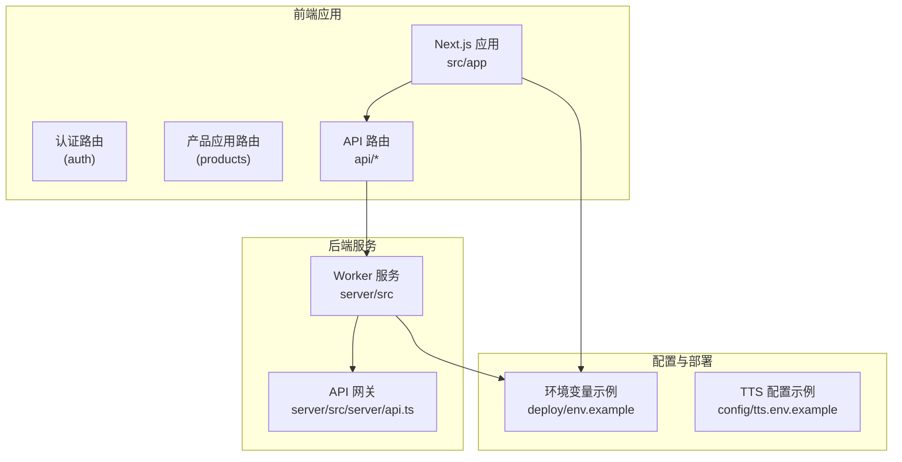
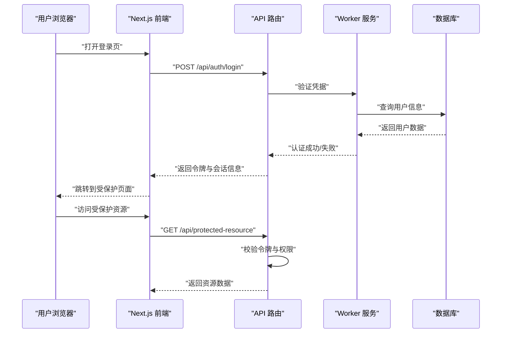
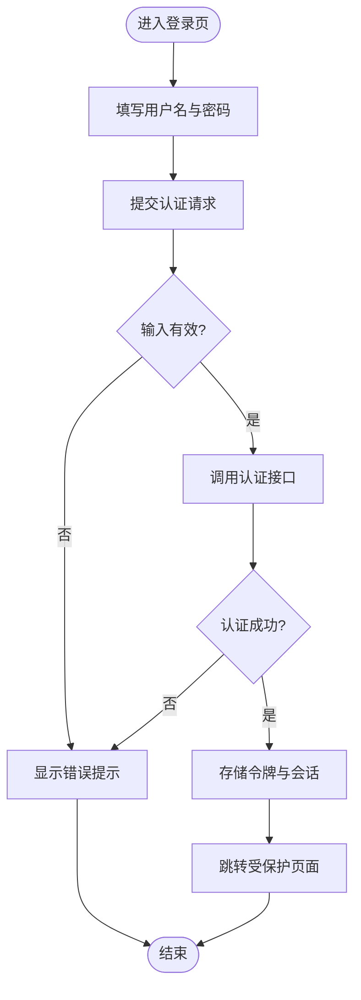
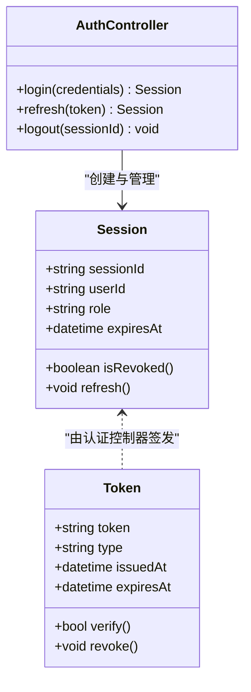
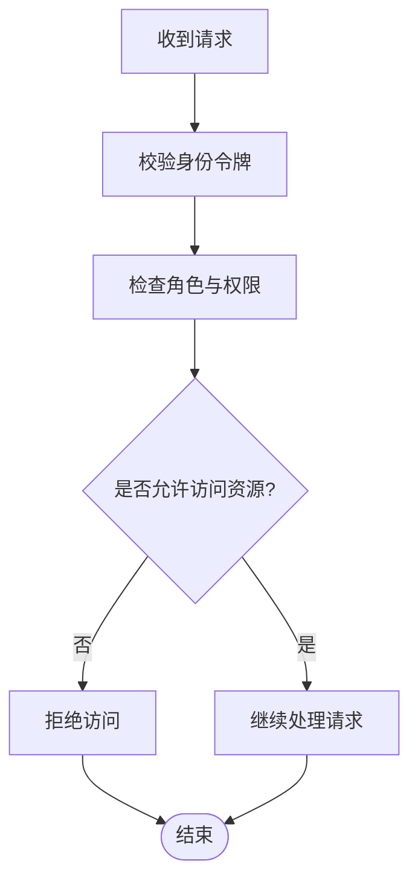
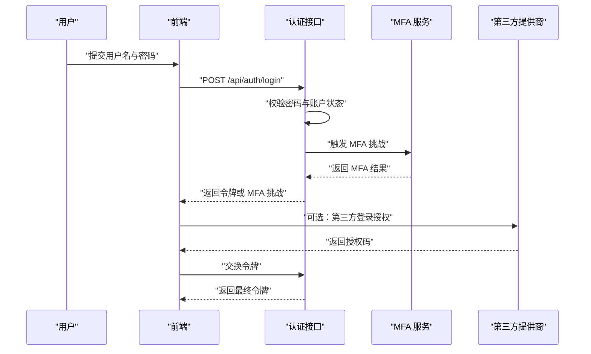
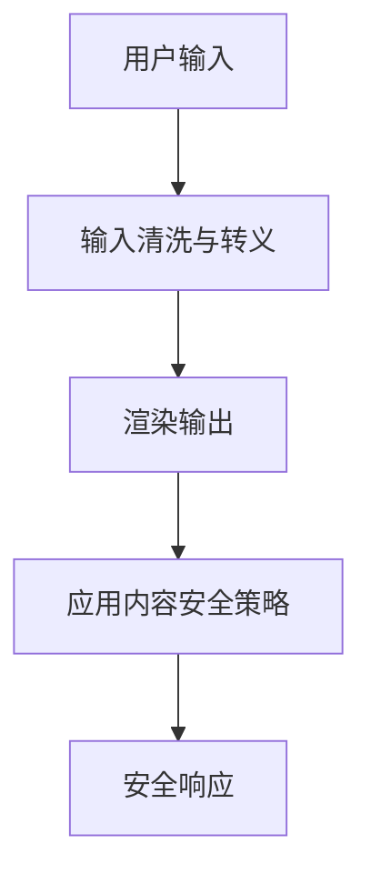
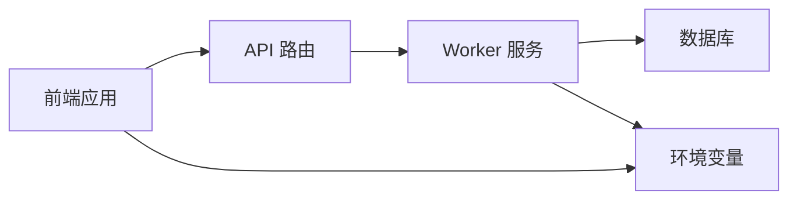

# 认证授权系统

<cite>
**本文档引用的文件**   
- [src/app/(auth)/layout.tsx](file://src/app/(auth)/layout.tsx)
- [src/app/(auth)/login/page.tsx](file://src/app/(auth)/login/page.tsx)
- [src/app/(auth)/signup/page.tsx](file://src/app/(auth)/signup/page.tsx)
- [src/app/(auth)/_components/auth-shell-form.tsx](file://src/app/(auth)/_components/auth-shell-form.tsx)
- [src/app/api/settings/route.ts](file://src/app/api/settings/route.ts)
- [src/app/api/projects/route.ts](file://src/app/api/projects/route.ts)
- [src/app/api/artifacts/[id]/route.ts](file://src/app/api/artifacts/[id]/route.ts)
- [src/app/api/render/route.ts](file://src/app/api/render/route.ts)
- [src/app/api/director/pipeline/route.ts](file://src/app/api/director/pipeline/route.ts)
- [src/app/products/(app)/layout.tsx](file://src/app/products/(app)/layout.tsx)
- [src/app/products/(app)/page.tsx](file://src/app/products/(app)/page.tsx)
- [src/lib/api.ts](file://src/lib/api.ts)
- [server/src/index.ts](file://server/src/index.ts)
- [server/src/server/api.ts](file://server/src/server/api.ts)
- [scripts/setup/bootstrap-credentials.ts](file://scripts/setup/bootstrap-credentials.ts)
- [scripts/migration/provision-master-key.ts](file://scripts/migration/provision-master-key.ts)
- [deploy/env.example](file://deploy/env.example)
- [config/tts.env.example](file://config/tts.env.example)
</cite>

## 目录
1. [简介](#简介)
2. [项目结构](#项目结构)
3. [核心组件](#核心组件)
4. [架构总览](#架构总览)
5. [详细组件分析](#详细组件分析)
6. [依赖关系分析](#依赖关系分析)
7. [性能与安全考量](#性能与安全考量)
8. [故障排查指南](#故障排查指南)
9. [结论](#结论)
10. [附录](#附录)

## 简介
本安全文档面向 PurpleInk 认证与授权子系统，覆盖用户认证流程、会话管理与令牌机制、角色权限模型、资源访问控制、细粒度权限管理、密码安全策略、多因素认证（MFA）与第三方登录集成、会话劫持防护、CSRF 与 XSS 防护、审计日志、安全监控与合规性检查等关键主题。文档基于仓库现有代码结构与实现进行梳理，并给出可操作的改进建议与最佳实践。

## 项目结构
PurpleInk 采用 Next.js 应用与独立 Worker 服务的双端结构：
- 前端应用位于 src/app，包含认证路由 (auth)、产品应用路由 (products)、API 路由 (api) 等。
- 后端 Worker 服务位于 server/src，提供渲染、编排、队列处理等能力。
- 部署与环境配置位于 deploy 与 config 目录。
- 脚本工具位于 scripts，涵盖初始化、迁移、密钥管理等。

**图表来源** 
- [src/app/(auth)/layout.tsx](file://src/app/(auth)/layout.tsx)
- [src/app/products/(app)/layout.tsx](file://src/app/products/(app)/layout.tsx)
- [server/src/server/api.ts](file://server/src/server/api.ts)
- [deploy/env.example](file://deploy/env.example)

**章节来源**
- [src/app/(auth)/layout.tsx](file://src/app/(auth)/layout.tsx)
- [src/app/products/(app)/layout.tsx](file://src/app/products/(app)/layout.tsx)
- [server/src/server/api.ts](file://server/src/server/api.ts)
- [deploy/env.example](file://deploy/env.example)

## 核心组件
- 认证页面与表单
  - 登录与注册页面：用于收集用户凭据并发起认证请求。
  - 认证外壳表单：封装通用认证交互逻辑与错误处理。
- API 路由与鉴权中间件
  - 各业务 API 路由负责接收请求、校验身份、执行权限检查。
  - 统一 API 客户端封装用于携带令牌与错误处理。
- 后端服务与网关
  - Worker 服务处理异步任务与数据持久化。
  - 网关层集中处理跨域、请求解析与基础安全头。

**章节来源**
- [src/app/(auth)/login/page.tsx](file://src/app/(auth)/login/page.tsx)
- [src/app/(auth)/signup/page.tsx](file://src/app/(auth)/signup/page.tsx)
- [src/app/(auth)/_components/auth-shell-form.tsx](file://src/app/(auth)/_components/auth-shell-form.tsx)
- [src/lib/api.ts](file://src/lib/api.ts)
- [server/src/server/api.ts](file://server/src/server/api.ts)

## 架构总览
认证授权系统在前后端之间通过 HTTP 接口协作，典型流程包括：
- 用户提交凭据至认证接口。
- 服务端验证凭据并签发短期令牌或建立会话。
- 前端在后续请求中携带令牌，服务端校验并授权访问受保护资源。
- 敏感操作需满足额外条件（如 MFA、二次确认）。

[此图为概念流程图，不直接映射具体源码文件]

## 详细组件分析

### 认证流程与页面组件
- 登录与注册页面负责展示表单、收集输入、调用认证接口并处理响应。
- 认证外壳表单封装了通用的表单状态、错误提示与重试逻辑。
- 建议在表单层启用最小权限原则，仅暴露必要字段；对输入进行严格校验与转义。

**章节来源**
- [src/app/(auth)/login/page.tsx](file://src/app/(auth)/login/page.tsx)
- [src/app/(auth)/signup/page.tsx](file://src/app/(auth)/signup/page.tsx)
- [src/app/(auth)/_components/auth-shell-form.tsx](file://src/app/(auth)/_components/auth-shell-form.tsx)

### 会话管理与令牌机制
- 令牌类型与生命周期
  - 建议使用短期访问令牌（Access Token）配合刷新令牌（Refresh Token），减少泄露风险。
  - 令牌应包含最小必要声明（用户 ID、角色、过期时间等）。
- 存储与传输
  - 前端优先使用 httpOnly Cookie 存储会话令牌，避免 XSS 读取。
  - 所有接口强制 HTTPS，启用 Strict-Transport-Security。
- 刷新与轮换
  - 刷新令牌定期轮换，失效后要求重新认证。
  - 支持撤销与黑名单机制，防止重放攻击。

[此图为概念类图，不直接映射具体源码文件]

### 角色权限模型与资源访问控制
- 角色模型
  - 定义基础角色（如管理员、编辑者、访客），并为每个角色分配最小权限集合。
  - 支持角色继承与动态权限扩展。
- 资源访问控制
  - 在 API 路由层实施 RBAC（基于角色的访问控制）与 ABAC（基于属性的访问控制）组合策略。
  - 对敏感资源（如导出、渲染、项目设置）进行细粒度校验。
- 细粒度权限
  - 针对操作维度（读、写、删除、共享）进行授权检查。
  - 支持资源级权限（项目、镜头、制品）与上下文属性（所有者、部门）。

**章节来源**
- [src/app/api/settings/route.ts](file://src/app/api/settings/route.ts)
- [src/app/api/projects/route.ts](file://src/app/api/projects/route.ts)
- [src/app/api/artifacts/[id]/route.ts](file://src/app/api/artifacts/[id]/route.ts)
- [src/app/api/render/route.ts](file://src/app/api/render/route.ts)
- [src/app/api/director/pipeline/route.ts](file://src/app/api/director/pipeline/route.ts)

### 密码安全策略与多因素认证
- 密码策略
  - 强制复杂度（长度、字符集）、禁止常见弱密码、历史密码重复检测。
  - 服务端哈希存储（如 bcrypt/argon2），禁止明文存储。
- 多因素认证（MFA）
  - 支持 TOTP 或短信验证码作为第二因素。
  - 在敏感操作前触发 MFA 校验。
- 第三方登录集成
  - 使用 OAuth 2.0/OpenID Connect，限制回调域名与作用域。
  - 对用户邮箱进行验证与去重处理。

[此图为概念序列图，不直接映射具体源码文件]

### CSRF 与 XSS 防护措施
- CSRF 防护
  - 使用 SameSite Cookie 与 CSRF Token 双重保护。
  - 对状态变更接口进行来源校验（Referer/Origin）。
- XSS 防护
  - 前端对所有用户输入进行转义与白名单过滤。
  - 后端输出内容设置 Content-Type 与 CSP（内容安全策略）。
  - 禁用危险函数与内联脚本，启用自动转义模板引擎。

[此图为概念流程图，不直接映射具体源码文件]

### 审计日志、安全监控与合规性检查
- 审计日志
  - 记录认证事件（登录成功/失败、MFA 挑战、令牌刷新/撤销）。
  - 记录权限决策（谁在何时访问了什么资源，结果如何）。
  - 日志脱敏，避免泄露敏感信息。
- 安全监控
  - 异常登录检测（地理位置、设备指纹、频率限制）。
  - 告警规则（暴力破解、令牌滥用、越权尝试）。
- 合规性检查
  - 定期扫描依赖漏洞与配置错误。
  - 自动化测试覆盖安全用例（输入校验、权限绕过、会话固定）。

**章节来源**
- [server/src/index.ts](file://server/src/index.ts)
- [server/src/server/api.ts](file://server/src/server/api.ts)

## 依赖关系分析
- 前端依赖
  - 认证页面依赖认证外壳表单与 API 客户端。
  - 产品应用路由依赖鉴权布局与权限守卫。
- 后端依赖
  - API 路由依赖 Worker 服务进行业务处理与数据持久化。
  - Worker 服务依赖数据库与外部服务（如邮件、第三方登录）。
- 配置依赖
  - 环境变量提供密钥、数据库连接、第三方服务凭证。

**章节来源**
- [src/lib/api.ts](file://src/lib/api.ts)
- [src/app/products/(app)/layout.tsx](file://src/app/products/(app)/layout.tsx)
- [server/src/index.ts](file://server/src/index.ts)
- [deploy/env.example](file://deploy/env.example)

## 性能与安全考量
- 性能优化
  - 令牌校验缓存（内存或 Redis）降低数据库压力。
  - 批量权限检查与懒加载减少首屏延迟。
- 安全加固
  - 速率限制与熔断机制防止滥用。
  - 最小权限原则与零信任架构逐步落地。
  - 定期更新依赖与补丁修复。

[本节为通用指导，不直接分析具体文件]

## 故障排查指南
- 常见问题
  - 登录失败：检查凭据格式、账户状态、MFA 配置。
  - 令牌无效：检查过期时间、签名算法、存储位置。
  - 权限拒绝：核对角色分配、资源归属、策略配置。
- 调试步骤
  - 查看认证与权限相关日志。
  - 模拟请求验证接口行为。
  - 检查环境变量与密钥配置。

**章节来源**
- [src/app/api/settings/route.ts](file://src/app/api/settings/route.ts)
- [src/app/api/projects/route.ts](file://src/app/api/projects/route.ts)
- [src/app/api/artifacts/[id]/route.ts](file://src/app/api/artifacts/[id]/route.ts)

## 结论
PurpleInk 的认证授权系统已具备基础的用户认证、会话管理与资源访问控制能力。为进一步强化安全性，建议完善令牌机制、引入 MFA、加强 CSRF/XSS 防护、建立审计日志与监控体系，并定期进行合规性检查与安全演练。通过持续迭代与最佳实践落地，可显著提升系统的整体安全水位。

[本节为总结性内容，不直接分析具体文件]

## 附录
- 环境配置示例
  - 部署环境变量：包含数据库、密钥、第三方服务配置。
  - TTS 配置示例：语音合成服务相关参数。
- 脚本工具
  - 初始化凭据与主密钥管理。
  - 数据库迁移与备份恢复。

**章节来源**
- [deploy/env.example](file://deploy/env.example)
- [config/tts.env.example](file://config/tts.env.example)
- [scripts/setup/bootstrap-credentials.ts](file://scripts/setup/bootstrap-credentials.ts)
- [scripts/migration/provision-master-key.ts](file://scripts/migration/provision-master-key.ts)