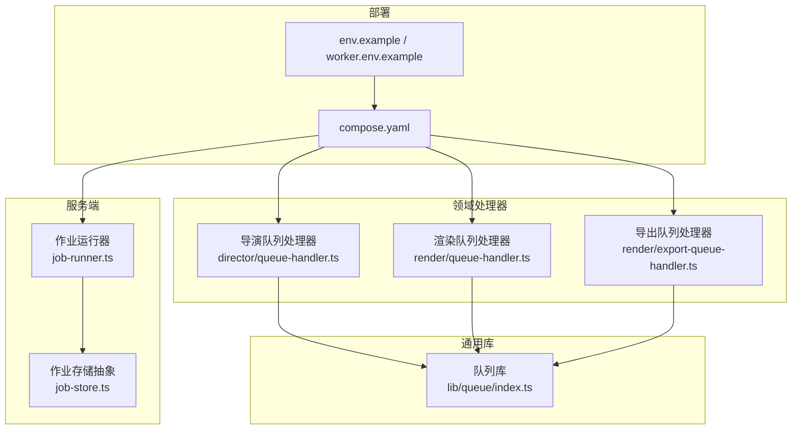
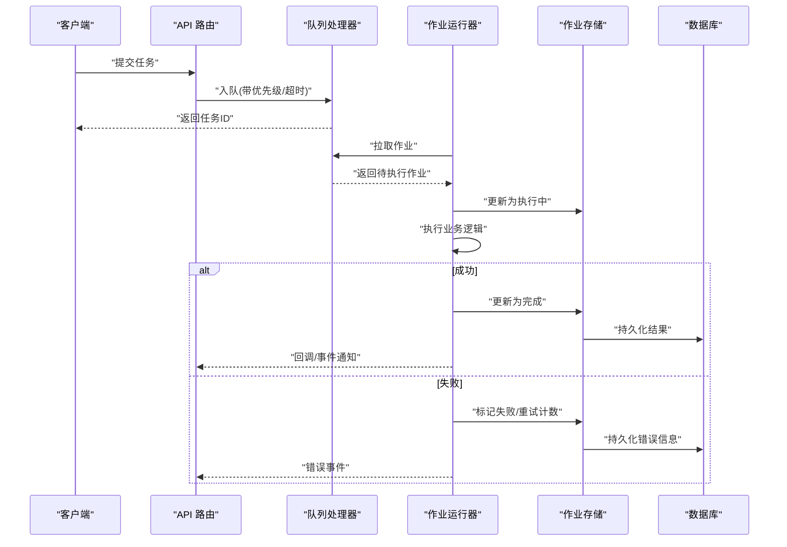
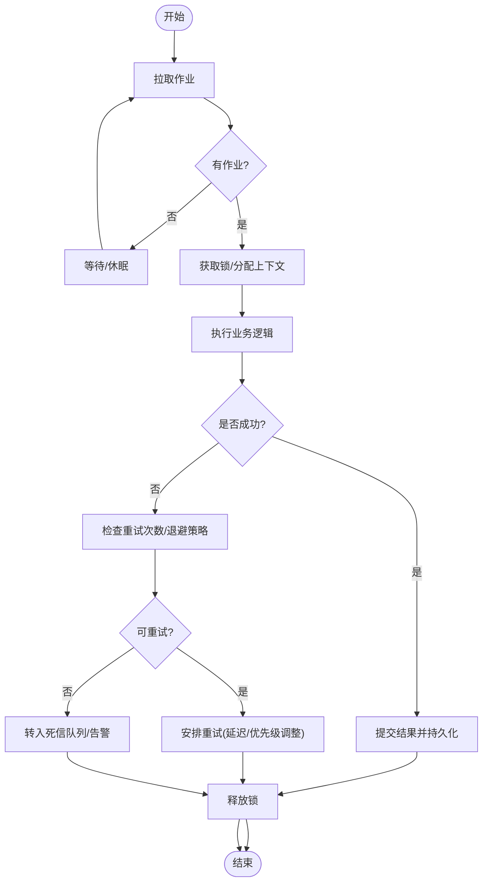
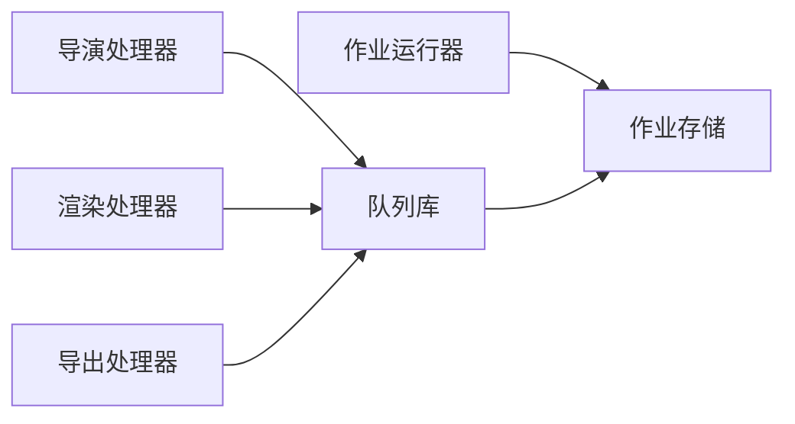

# 队列系统

<cite>
**本文引用的文件**   
- [server/src/server/job-runner.ts](file://server/src/server/job-runner.ts)
- [server/src/server/job-store.ts](file://server/src/server/job-store.ts)
- [src/features/director/queue-handler.ts](file://src/features/director/queue-handler.ts)
- [src/features/render/queue-handler.ts](file://src/features/render/queue-handler.ts)
- [src/features/render/export-queue-handler.ts](file://src/features/render/export-queue-handler.ts)
- [src/lib/queue/index.ts](file://src/lib/queue/index.ts)
- [deploy/compose.yaml](file://deploy/compose.yaml)
- [deploy/env.example](file://deploy/env.example)
- [deploy/worker.env.example](file://deploy/worker.env.example)
- [docs/issues/ISSUE-004-queue-concurrency-lanes.md](file://docs/issues/ISSUE-004-queue-concurrency-lanes.md)
- [scripts/setup/db-migrate.ts](file://scripts/setup/db-migrate.ts)
</cite>

## 目录
1. [简介](#简介)
2. [项目结构](#项目结构)
3. [核心组件](#核心组件)
4. [架构总览](#架构总览)
5. [详细组件分析](#详细组件分析)
6. [依赖关系分析](#依赖关系分析)
7. [性能考量](#性能考量)
8. [故障排查指南](#故障排查指南)
9. [结论](#结论)
10. [附录](#附录)

## 简介
本技术文档面向 PurpleInK 的队列系统，聚焦异步任务处理、任务调度与优先级管理、任务持久化、重试机制与失败补偿策略、队列监控与容量规划、分布式支持与负载均衡、以及开发规范与调试工具。文档以仓库中的实际实现为依据，结合部署配置与问题记录，给出从架构到落地的完整说明。

## 项目结构
队列系统由“服务端作业运行器”、“作业存储抽象”、“领域队列处理器（导演、渲染、导出）”、“通用队列库”和“部署编排与环境变量”组成：
- 服务端作业运行器与存储抽象位于 server/src/server 下，负责进程内作业调度与持久化接口。
- 领域队列处理器位于 src/features 下的 director 与 render 模块，分别处理导演管线与渲染/导出任务。
- 通用队列库位于 src/lib/queue，提供可复用的队列能力。
- 部署编排通过 docker-compose 与环境变量驱动多进程/多容器运行，支持水平扩展与故障转移。

图表来源
- [server/src/server/job-runner.ts](file://server/src/server/job-runner.ts)
- [server/src/server/job-store.ts](file://server/src/server/job-store.ts)
- [src/features/director/queue-handler.ts](file://src/features/director/queue-handler.ts)
- [src/features/render/queue-handler.ts](file://src/features/render/queue-handler.ts)
- [src/features/render/export-queue-handler.ts](file://src/features/render/export-queue-handler.ts)
- [src/lib/queue/index.ts](file://src/lib/queue/index.ts)
- [deploy/compose.yaml](file://deploy/compose.yaml)
- [deploy/env.example](file://deploy/env.example)
- [deploy/worker.env.example](file://deploy/worker.env.example)

章节来源
- [server/src/server/job-runner.ts](file://server/src/server/job-runner.ts)
- [server/src/server/job-store.ts](file://server/src/server/job-store.ts)
- [src/features/director/queue-handler.ts](file://src/features/director/queue-handler.ts)
- [src/features/render/queue-handler.ts](file://src/features/render/queue-handler.ts)
- [src/features/render/export-queue-handler.ts](file://src/features/render/export-queue-handler.ts)
- [src/lib/queue/index.ts](file://src/lib/queue/index.ts)
- [deploy/compose.yaml](file://deploy/compose.yaml)
- [deploy/env.example](file://deploy/env.example)
- [deploy/worker.env.example](file://deploy/worker.env.example)

## 核心组件
- 作业运行器（Job Runner）：负责拉取作业、执行生命周期管理、状态回写与错误上报。
- 作业存储（Job Store）：定义作业的持久化接口，屏蔽底层存储差异。
- 领域队列处理器：按业务域划分，如导演、渲染、导出，各自实现任务入队、出队、执行与结果提交。
- 通用队列库：封装队列基础能力（如并发控制、重试、优先级等），供各处理器复用。
- 部署与环境：通过 compose 与环境变量控制实例数量、资源限制、数据库连接与队列后端。

章节来源
- [server/src/server/job-runner.ts](file://server/src/server/job-runner.ts)
- [server/src/server/job-store.ts](file://server/src/server/job-store.ts)
- [src/features/director/queue-handler.ts](file://src/features/director/queue-handler.ts)
- [src/features/render/queue-handler.ts](file://src/features/render/queue-handler.ts)
- [src/features/render/export-queue-handler.ts](file://src/features/render/export-queue-handler.ts)
- [src/lib/queue/index.ts](file://src/lib/queue/index.ts)

## 架构总览
下图展示请求进入后，如何经 API 路由入队，再由作业运行器消费并执行业务逻辑，最终将结果持久化与反馈给调用方。

图表来源
- [server/src/server/job-runner.ts](file://server/src/server/job-runner.ts)
- [server/src/server/job-store.ts](file://server/src/server/job-store.ts)
- [src/features/director/queue-handler.ts](file://src/features/director/queue-handler.ts)
- [src/features/render/queue-handler.ts](file://src/features/render/queue-handler.ts)
- [src/features/render/export-queue-handler.ts](file://src/features/render/export-queue-handler.ts)

## 详细组件分析

### 作业运行器（Job Runner）
- 职责：周期性拉取作业、维护执行上下文、处理超时与中断、统一错误捕获与重试决策、状态回写。
- 关键流程：
  - 拉取：根据队列策略选择下一个作业（考虑优先级、延迟、重试间隔）。
  - 执行：在隔离上下文中执行业务逻辑，记录日志与指标。
  - 收尾：成功则提交结果；失败则计算重试策略或转入死信队列。
- 并发与限流：可通过运行器参数控制并发度，避免资源争用。

图表来源
- [server/src/server/job-runner.ts](file://server/src/server/job-runner.ts)

章节来源
- [server/src/server/job-runner.ts](file://server/src/server/job-runner.ts)

### 作业存储（Job Store）
- 职责：定义作业的生命周期操作（创建、查询、更新、删除）、状态机转换、索引优化与事务边界。
- 设计要点：
  - 幂等性：确保重复提交不产生副作用。
  - 一致性：状态变更需原子写入，避免中间态泄露。
  - 可扩展：支持不同后端（内存、SQLite、PostgreSQL）的适配。

章节来源
- [server/src/server/job-store.ts](file://server/src/server/job-store.ts)

### 导演队列处理器（Director Queue Handler）
- 职责：处理导演相关任务，如脚本生成、分镜编排、提示词组装等。
- 特性：
  - 优先级：基于任务类型与 SLA 设置优先级。
  - 重试：对网络/外部服务异常进行指数退避重试。
  - 补偿：失败时保留中间产物，支持断点续跑。

章节来源
- [src/features/director/queue-handler.ts](file://src/features/director/queue-handler.ts)

### 渲染队列处理器（Render Queue Handler）
- 职责：处理视频帧渲染、编码、合成等任务。
- 特性：
  - 并发控制：按 CPU/GPU 资源限制并发度。
  - 缓存：命中缓存直接返回结果，减少重复计算。
  - 质量校验：输出后进行 QA 检查，不合格自动重跑。

章节来源
- [src/features/render/queue-handler.ts](file://src/features/render/queue-handler.ts)

### 导出队列处理器（Export Queue Handler）
- 职责：处理最终产物打包、上传、分发等任务。
- 特性：
  - 幂等导出：相同输入保证一致输出。
  - 分片上传：大文件分块上传，支持断点续传。
  - 失败补偿：上传失败自动重试并记录失败原因。

章节来源
- [src/features/render/export-queue-handler.ts](file://src/features/render/export-queue-handler.ts)

### 通用队列库（Lib Queue）
- 职责：提供队列基础能力，包括优先级队列、延迟队列、重试退避、死信队列、指标采集等。
- 使用方式：各领域处理器通过该库实现统一的队列语义，降低重复实现成本。

章节来源
- [src/lib/queue/index.ts](file://src/lib/queue/index.ts)

## 依赖关系分析
- 低耦合：处理器仅依赖通用队列库与作业存储抽象，避免与具体实现强绑定。
- 高内聚：每个处理器专注自身业务域，内部逻辑自洽。
- 外部依赖：数据库、对象存储、外部 AI/媒体服务等通过适配器接入。

图表来源
- [src/features/director/queue-handler.ts](file://src/features/director/queue-handler.ts)
- [src/features/render/queue-handler.ts](file://src/features/render/queue-handler.ts)
- [src/features/render/export-queue-handler.ts](file://src/features/render/export-queue-handler.ts)
- [src/lib/queue/index.ts](file://src/lib/queue/index.ts)
- [server/src/server/job-runner.ts](file://server/src/server/job-runner.ts)
- [server/src/server/job-store.ts](file://server/src/server/job-store.ts)

章节来源
- [src/features/director/queue-handler.ts](file://src/features/director/queue-handler.ts)
- [src/features/render/queue-handler.ts](file://src/features/render/queue-handler.ts)
- [src/features/render/export-queue-handler.ts](file://src/features/render/export-queue-handler.ts)
- [src/lib/queue/index.ts](file://src/lib/queue/index.ts)
- [server/src/server/job-runner.ts](file://server/src/server/job-runner.ts)
- [server/src/server/job-store.ts](file://server/src/server/job-store.ts)

## 性能考量
- 并发与吞吐：通过运行器并发度与处理器并行度调节整体吞吐；热点任务可拆分细粒度子任务提升并行度。
- 优先级与公平：高优先级任务优先调度，同时保障低优先级任务不被饥饿。
- 缓存与去重：渲染阶段利用缓存与内容哈希去重，显著降低重复计算。
- I/O 与背压：对外部服务调用增加超时与熔断，避免级联失败；对磁盘/网络 I/O 采用缓冲与批处理。
- 容量规划：依据峰值 QPS、平均处理时长与目标延迟，估算所需实例数与资源配额。

[本节为通用指导，无需特定文件引用]

## 故障排查指南
- 常见问题定位：
  - 任务堆积：检查运行器拉取频率、处理器并发度、下游依赖可用性。
  - 频繁重试：查看重试策略与退避参数，确认是否为瞬时错误。
  - 死信队列增长：分析失败根因，必要时人工介入修复数据或逻辑。
- 监控指标：
  - 队列长度、平均处理时长、成功率、重试率、死信数。
  - 资源利用率（CPU/GPU/内存）、I/O 等待、外部服务错误率。
- 调试工具：
  - 启用详细日志与追踪 ID，便于跨进程关联。
  - 使用本地模拟下游服务，快速验证处理器逻辑。
  - 通过数据库快照回放失败任务，复现问题。

章节来源
- [server/src/server/job-runner.ts](file://server/src/server/job-runner.ts)
- [server/src/server/job-store.ts](file://server/src/server/job-store.ts)
- [src/features/director/queue-handler.ts](file://src/features/director/queue-handler.ts)
- [src/features/render/queue-handler.ts](file://src/features/render/queue-handler.ts)
- [src/features/render/export-queue-handler.ts](file://src/features/render/export-queue-handler.ts)

## 结论
PurpleInK 队列系统通过清晰的职责分层与可复用的队列库，实现了稳定高效的异步任务处理能力。结合部署编排与环境变量，可在单机或多节点环境中灵活扩展。建议在生产环境完善监控告警、容量规划与演练预案，持续提升系统的可靠性与可观测性。

[本节为总结，无需特定文件引用]

## 附录

### 分布式队列支持与负载均衡
- 多实例部署：通过 compose 启动多个 worker 实例，共享同一队列后端，实现水平扩展。
- 负载均衡：作业拉取采用公平策略，避免单实例过载；可结合外部负载均衡器对入口流量进行分发。
- 故障转移：实例宕机后，未完成的作业可由其他实例接管；状态持久化确保一致性。

章节来源
- [deploy/compose.yaml](file://deploy/compose.yaml)
- [deploy/env.example](file://deploy/env.example)
- [deploy/worker.env.example](file://deploy/worker.env.example)

### 任务持久化与状态机
- 状态定义：待处理、执行中、已完成、失败、重试中、死信。
- 持久化时机：状态变更即落盘，确保崩溃恢复后能继续处理。
- 一致性保障：使用事务包裹状态更新，避免部分成功导致的不一致。

章节来源
- [server/src/server/job-store.ts](file://server/src/server/job-store.ts)

### 重试机制与失败补偿
- 重试策略：指数退避、最大重试次数、抖动随机化。
- 失败补偿：保留中间产物，支持断点续跑；对幂等操作可安全重试。
- 死信处理：超过重试上限的任务进入死信队列，触发告警与人工干预。

章节来源
- [server/src/server/job-runner.ts](file://server/src/server/job-runner.ts)
- [src/lib/queue/index.ts](file://src/lib/queue/index.ts)

### 队列监控与容量规划
- 监控项：队列长度、处理时长分布、错误率、重试率、资源使用率。
- 容量规划：基于历史峰值与目标 SLA，计算所需实例数与资源配额。
- 弹性伸缩：根据队列长度与处理时长动态扩缩容。

章节来源
- [docs/issues/ISSUE-004-queue-concurrency-lanes.md](file://docs/issues/ISSUE-004-queue-concurrency-lanes.md)

### 任务开发规范
- 任务设计：幂等、短小精悍、明确输入输出、携带必要上下文。
- 错误处理：区分可重试与不可重试错误，记录详细错误信息。
- 日志规范：结构化日志，包含任务 ID、阶段、耗时与关键指标。

章节来源
- [src/features/director/queue-handler.ts](file://src/features/director/queue-handler.ts)
- [src/features/render/queue-handler.ts](file://src/features/render/queue-handler.ts)
- [src/features/render/export-queue-handler.ts](file://src/features/render/export-queue-handler.ts)

### 数据库初始化与迁移
- 初始化脚本：提供数据库表结构与初始数据。
- 迁移策略：版本化管理，支持向前与向后兼容。

章节来源
- [scripts/setup/db-migrate.ts](file://scripts/setup/db-migrate.ts)