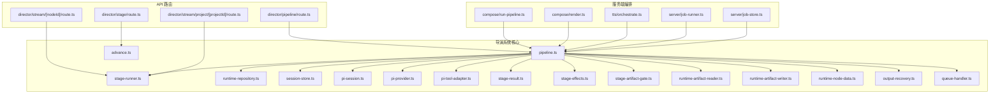
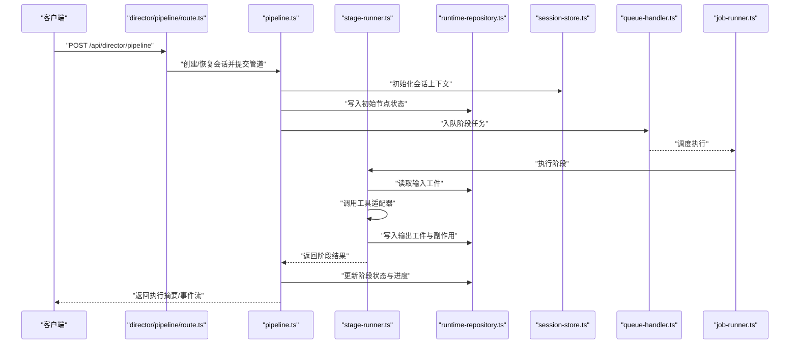
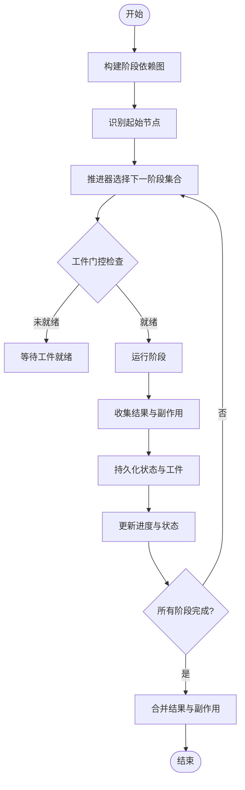
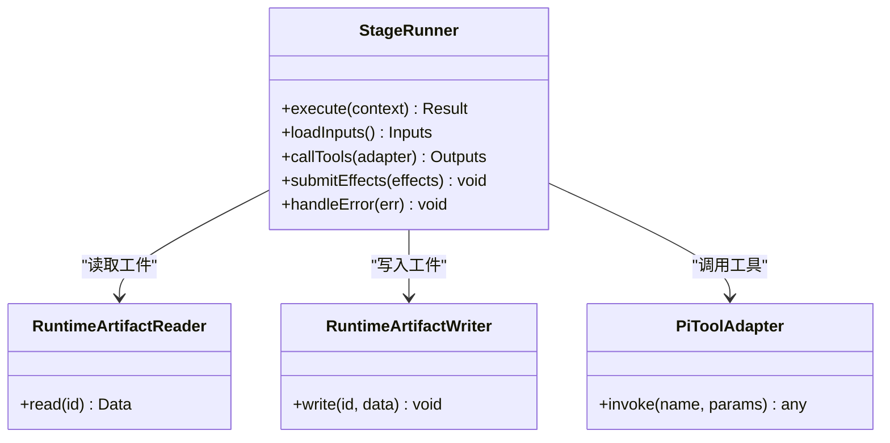
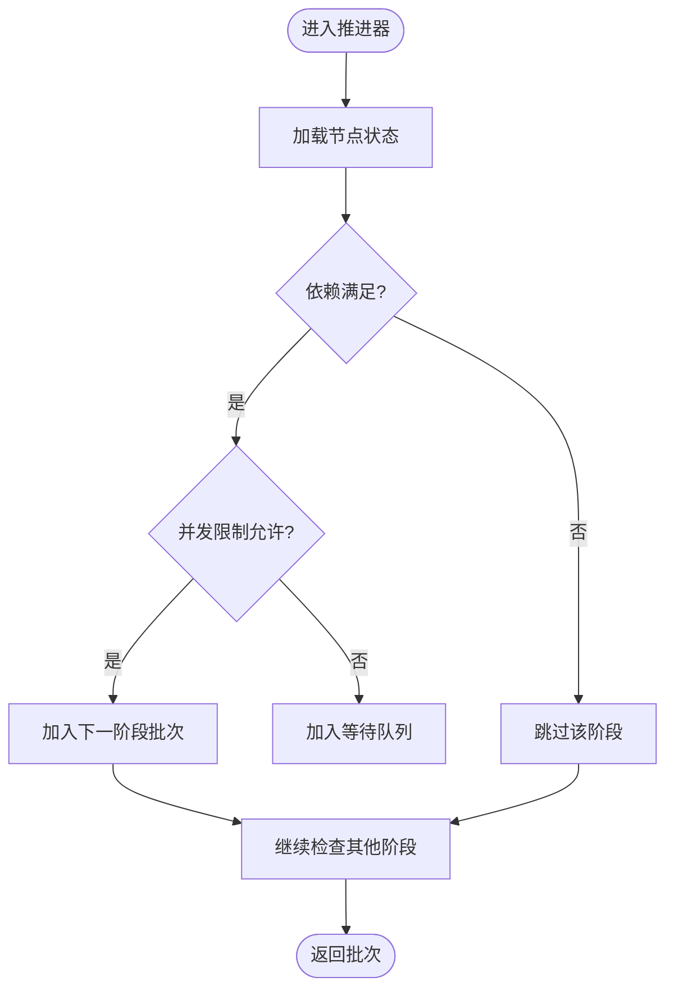
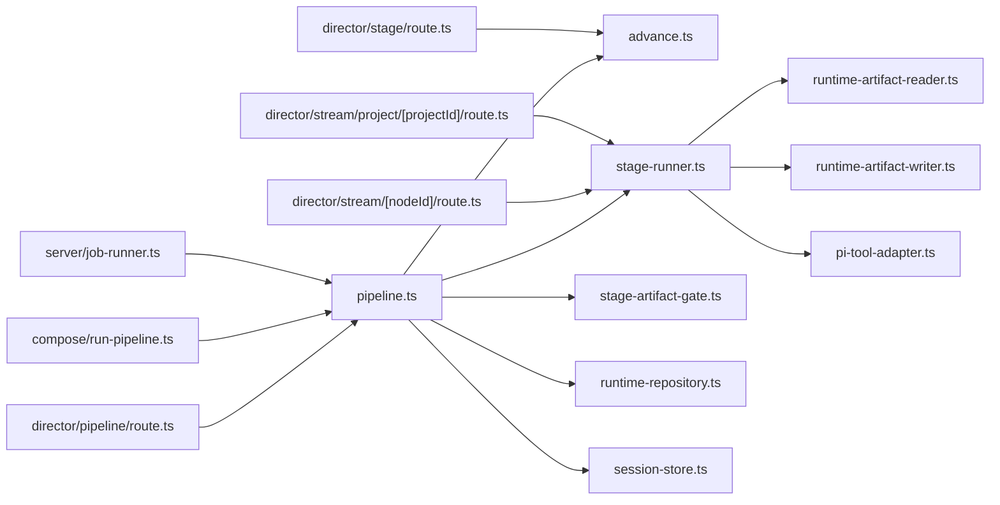

# 导演系统

<cite>
**本文引用的文件**   
- [src/features/director/index.ts](file://src/features/director/index.ts)
- [src/features/director/pipeline.ts](file://src/features/director/pipeline.ts)
- [src/features/director/stage-runner.ts](file://src/features/director/stage-runner.ts)
- [src/features/director/advance.ts](file://src/features/director/advance.ts)
- [src/features/director/runtime-repository.ts](file://src/features/director/runtime-repository.ts)
- [src/features/director/session-store.ts](file://src/features/director/session-store.ts)
- [src/features/director/pi-session.ts](file://src/features/director/pi-session.ts)
- [src/features/director/pi-provider.ts](file://src/features/director/pi-provider.ts)
- [src/features/director/pi-tool-adapter.ts](file://src/features/director/pi-tool-adapter.ts)
- [src/features/director/stage-result.ts](file://src/features/director/stage-result.ts)
- [src/features/director/stage-effects.ts](file://src/features/director/stage-effects.ts)
- [src/features/director/stage-artifact-gate.ts](file://src/features/director/stage-artifact-gate.ts)
- [src/features/director/runtime-artifact-reader.ts](file://src/features/director/runtime-artifact-reader.ts)
- [src/features/director/runtime-artifact-writer.ts](file://src/features/director/runtime-artifact-writer.ts)
- [src/features/director/runtime-node-data.ts](file://src/features/director/runtime-node-data.ts)
- [src/features/director/output-recovery.ts](file://src/features/director/output-recovery.ts)
- [src/features/director/queue-handler.ts](file://src/features/director/queue-handler.ts)
- [src/app/api/director/pipeline/route.ts](file://src/app/api/director/pipeline/route.ts)
- [src/app/api/director/stage/route.ts](file://src/app/api/director/stage/route.ts)
- [src/app/api/director/stream/[nodeId]/route.ts](file://src/app/api/director/stream/[nodeId]/route.ts)
- [src/app/api/director/stream/project/[projectId]/route.ts](file://src/app/api/director/stream/project/[projectId]/route.ts)
- [server/src/server/job-runner.ts](file://server/src/server/job-runner.ts)
- [server/src/server/job-store.ts](file://server/src/server/job-store.ts)
- [server/src/compose/run-pipeline.ts](file://server/src/compose/run-pipeline.ts)
- [server/src/compose/render.ts](file://server/src/compose/render.ts)
- [server/src/tts/orchestrate.ts](file://server/src/tts/orchestrate.ts)
</cite>

## 目录
1. [简介](#简介)
2. [项目结构](#项目结构)
3. [核心组件](#核心组件)
4. [架构总览](#架构总览)
5. [详细组件分析](#详细组件分析)
6. [依赖关系分析](#依赖关系分析)
7. [性能考量](#性能考量)
8. [故障排查指南](#故障排查指南)
9. [结论](#结论)
10. [附录](#附录)

## 简介
本文件为 PurpleInk 导演系统的全面架构文档，聚焦工作流编排引擎、阶段管理器与工具链集成机制。内容涵盖状态持久化策略、会话管理、并发控制、管道执行流程、错误处理与恢复机制、阶段定义规范、工具注册机制与插件扩展点，以及自定义阶段的开发指南与最佳实践。同时提供性能监控、调试工具与故障诊断方法，帮助开发者快速理解并高效扩展导演系统。

## 项目结构
导演系统位于前端特性模块 server 与 API 路由之间：
- 前端特性层（src/features/director）：实现编排引擎、阶段运行器、运行时工件读写、会话与持久化、队列处理器等核心能力。
- API 路由层（src/app/api/director）：暴露管道启动、阶段推进、实时流式事件等 HTTP/SSE 接口。
- 服务端编排（server/src/compose）：将导演系统与渲染、TTS 等子系统整合，驱动端到端流水线。
- 作业调度（server/src/server）：提供作业运行器与存储抽象，支撑异步任务与并发控制。

图表来源 
- [src/app/api/director/pipeline/route.ts](file://src/app/api/director/pipeline/route.ts)
- [src/app/api/director/stage/route.ts](file://src/app/api/director/stage/route.ts)
- [src/app/api/director/stream/[nodeId]/route.ts](file://src/app/api/director/stream/[nodeId]/route.ts)
- [src/app/api/director/stream/project/[projectId]/route.ts](file://src/app/api/director/stream/project/[projectId]/route.ts)
- [src/features/director/pipeline.ts](file://src/features/director/pipeline.ts)
- [src/features/director/stage-runner.ts](file://src/features/director/stage-runner.ts)
- [src/features/director/advance.ts](file://src/features/director/advance.ts)
- [src/features/director/runtime-repository.ts](file://src/features/director/runtime-repository.ts)
- [src/features/director/session-store.ts](file://src/features/director/session-store.ts)
- [src/features/director/pi-session.ts](file://src/features/director/pi-session.ts)
- [src/features/director/pi-provider.ts](file://src/features/director/pi-provider.ts)
- [src/features/director/pi-tool-adapter.ts](file://src/features/director/pi-tool-adapter.ts)
- [src/features/director/stage-result.ts](file://src/features/director/stage-result.ts)
- [src/features/director/stage-effects.ts](file://src/features/director/stage-effects.ts)
- [src/features/director/stage-artifact-gate.ts](file://src/features/director/stage-artifact-gate.ts)
- [src/features/director/runtime-artifact-reader.ts](file://src/features/director/runtime-artifact-reader.ts)
- [src/features/director/runtime-artifact-writer.ts](file://src/features/director/runtime-artifact-writer.ts)
- [src/features/director/runtime-node-data.ts](file://src/features/director/runtime-node-data.ts)
- [src/features/director/output-recovery.ts](file://src/features/director/output-recovery.ts)
- [src/features/director/queue-handler.ts](file://src/features/director/queue-handler.ts)
- [server/src/compose/run-pipeline.ts](file://server/src/compose/run-pipeline.ts)
- [server/src/compose/render.ts](file://server/src/compose/render.ts)
- [server/src/tts/orchestrate.ts](file://server/src/tts/orchestrate.ts)
- [server/src/server/job-runner.ts](file://server/src/server/job-runner.ts)
- [server/src/server/job-store.ts](file://server/src/server/job-store.ts)

章节来源
- [src/features/director/index.ts](file://src/features/director/index.ts)
- [src/app/api/director/pipeline/route.ts](file://src/app/api/director/pipeline/route.ts)
- [server/src/compose/run-pipeline.ts](file://server/src/compose/run-pipeline.ts)

## 核心组件
- 编排引擎 pipeline.ts：负责解析阶段图、计算执行顺序、协调阶段运行与结果合并、触发副作用与工件门控。
- 阶段运行器 stage-runner.ts：封装单个阶段的执行上下文、输入输出、工具调用、副作用与错误处理。
- 推进器 advance.ts：基于当前节点状态与依赖关系决定下一步可执行的阶段集合，支持并行与条件分支。
- 运行时仓库 runtime-repository.ts：统一存取运行时数据（节点数据、工件元数据、进度与状态）。
- 会话与会话存储 session-store.ts、pi-session.ts：维护一次导演会话的生命周期、上下文与跨阶段共享数据。
- AI 提供者与工具适配器 pi-provider.ts、pi-tool-adapter.ts：对接外部模型服务，并将工具能力暴露给阶段执行环境。
- 阶段结果与副作用 stage-result.ts、stage-effects.ts：定义阶段产出、副作用类型与提交策略。
- 工件门控 stage-artifact-gate.ts：确保下游阶段仅在所需工件就绪时执行。
- 工件读写 runtime-artifact-reader.ts、runtime-artifact-writer.ts：对运行时工件进行序列化、校验与持久化。
- 节点数据 runtime-node-data.ts：描述阶段节点的输入输出契约与类型约束。
- 输出恢复 output-recovery.ts：在失败或中断后尝试从中间状态恢复，保证幂等与一致性。
- 队列处理器 queue-handler.ts：将阶段执行放入队列，限制并发度，避免资源争用。

章节来源
- [src/features/director/pipeline.ts](file://src/features/director/pipeline.ts)
- [src/features/director/stage-runner.ts](file://src/features/director/stage-runner.ts)
- [src/features/director/advance.ts](file://src/features/director/advance.ts)
- [src/features/director/runtime-repository.ts](file://src/features/director/runtime-repository.ts)
- [src/features/director/session-store.ts](file://src/features/director/session-store.ts)
- [src/features/director/pi-session.ts](file://src/features/director/pi-session.ts)
- [src/features/director/pi-provider.ts](file://src/features/director/pi-provider.ts)
- [src/features/director/pi-tool-adapter.ts](file://src/features/director/pi-tool-adapter.ts)
- [src/features/director/stage-result.ts](file://src/features/director/stage-result.ts)
- [src/features/director/stage-effects.ts](file://src/features/director/stage-effects.ts)
- [src/features/director/stage-artifact-gate.ts](file://src/features/director/stage-artifact-gate.ts)
- [src/features/director/runtime-artifact-reader.ts](file://src/features/director/runtime-artifact-reader.ts)
- [src/features/director/runtime-artifact-writer.ts](file://src/features/director/runtime-artifact-writer.ts)
- [src/features/director/runtime-node-data.ts](file://src/features/director/runtime-node-data.ts)
- [src/features/director/output-recovery.ts](file://src/features/director/output-recovery.ts)
- [src/features/director/queue-handler.ts](file://src/features/director/queue-handler.ts)

## 架构总览
导演系统采用“编排引擎 + 阶段运行器 + 工具链”的分层设计：
- API 层接收请求，创建或恢复会话，提交管道到编排引擎。
- 编排引擎根据阶段图与依赖关系，通过推进器选择下一批可执行阶段。
- 阶段运行器在执行阶段时，通过工件门控检查输入工件是否就绪，使用工件读写器访问数据，并通过工具适配器调用外部能力。
- 运行时仓库与会话存储负责状态持久化与上下文共享。
- 队列处理器与作业运行器保障并发控制与任务调度。
- 输出恢复模块在异常路径上尝试回滚或补偿，确保最终一致性。

图表来源 
- [src/app/api/director/pipeline/route.ts](file://src/app/api/director/pipeline/route.ts)
- [src/features/director/pipeline.ts](file://src/features/director/pipeline.ts)
- [src/features/director/stage-runner.ts](file://src/features/director/stage-runner.ts)
- [src/features/director/runtime-repository.ts](file://src/features/director/runtime-repository.ts)
- [src/features/director/session-store.ts](file://src/features/director/session-store.ts)
- [src/features/director/queue-handler.ts](file://src/features/director/queue-handler.ts)
- [server/src/server/job-runner.ts](file://server/src/server/job-runner.ts)

## 详细组件分析

### 编排引擎 pipeline.ts
- 职责：解析阶段图、计算拓扑顺序、协调阶段执行、合并结果、触发副作用、管理工件门控。
- 关键流程：
  - 构建阶段依赖图，识别起始节点与终止节点。
  - 使用推进器 advance.ts 动态选择可执行阶段集合。
  - 通过阶段运行器 stage-runner.ts 执行阶段，收集结果与副作用。
  - 借助工件门控 stage-artifact-gate.ts 确保输入工件就绪。
  - 通过运行时仓库 runtime-repository.ts 持久化状态与工件元数据。
  - 使用会话存储 session-store.ts 维护上下文与共享数据。
- 并发控制：结合队列处理器 queue-handler.ts 限制并发度，避免资源竞争。
- 错误处理：捕获阶段异常，记录日志，触发输出恢复 output-recovery.ts 进行补偿或重试。

图表来源 
- [src/features/director/pipeline.ts](file://src/features/director/pipeline.ts)
- [src/features/director/advance.ts](file://src/features/director/advance.ts)
- [src/features/director/stage-artifact-gate.ts](file://src/features/director/stage-artifact-gate.ts)
- [src/features/director/runtime-repository.ts](file://src/features/director/runtime-repository.ts)
- [src/features/director/session-store.ts](file://src/features/director/session-store.ts)
- [src/features/director/output-recovery.ts](file://src/features/director/output-recovery.ts)

章节来源
- [src/features/director/pipeline.ts](file://src/features/director/pipeline.ts)
- [src/features/director/advance.ts](file://src/features/director/advance.ts)
- [src/features/director/stage-artifact-gate.ts](file://src/features/director/stage-artifact-gate.ts)

### 阶段运行器 stage-runner.ts
- 职责：封装单阶段执行上下文，管理输入输出、工具调用、副作用与错误处理。
- 执行步骤：
  - 加载输入工件与节点数据。
  - 注入工具适配器与 AI 提供者。
  - 执行阶段逻辑，捕获异常并记录。
  - 提交阶段结果与副作用至运行时仓库。
  - 触发事件流（SSE）供前端实时展示。
- 错误处理：区分可恢复与不可恢复错误，必要时触发输出恢复。

图表来源 
- [src/features/director/stage-runner.ts](file://src/features/director/stage-runner.ts)
- [src/features/director/runtime-artifact-reader.ts](file://src/features/director/runtime-artifact-reader.ts)
- [src/features/director/runtime-artifact-writer.ts](file://src/features/director/runtime-artifact-writer.ts)
- [src/features/director/pi-tool-adapter.ts](file://src/features/director/pi-tool-adapter.ts)

章节来源
- [src/features/director/stage-runner.ts](file://src/features/director/stage-runner.ts)
- [src/features/director/runtime-artifact-reader.ts](file://src/features/director/runtime-artifact-reader.ts)
- [src/features/director/runtime-artifact-writer.ts](file://src/features/director/runtime-artifact-writer.ts)
- [src/features/director/pi-tool-adapter.ts](file://src/features/director/pi-tool-adapter.ts)

### 推进器 advance.ts
- 职责：基于当前节点状态与依赖关系，计算下一批可执行阶段。
- 决策逻辑：
  - 检查阶段前置条件（输入工件、配置项）。
  - 评估并发限制与资源可用性。
  - 支持条件分支与并行执行。
- 优化点：缓存已计算的可执行集合，减少重复判断。

图表来源 
- [src/features/director/advance.ts](file://src/features/director/advance.ts)

章节来源
- [src/features/director/advance.ts](file://src/features/director/advance.ts)

### 运行时仓库 runtime-repository.ts
- 职责：统一存取运行时数据，包括节点状态、工件元数据、进度与副作用。
- 操作：
  - 读取/写入节点数据与工件引用。
  - 更新阶段状态（待执行、执行中、成功、失败）。
  - 事务性提交副作用，保证一致性。
- 持久化策略：优先内存缓存，落盘持久化，支持快照与增量更新。

章节来源
- [src/features/director/runtime-repository.ts](file://src/features/director/runtime-repository.ts)

### 会话与会话存储 session-store.ts、pi-session.ts
- 职责：维护一次导演会话的生命周期、上下文与跨阶段共享数据。
- 功能：
  - 初始化会话参数与权限。
  - 保存/恢复会话状态。
  - 提供线程安全的上下文访问。
- 与持久化：会话状态可持久化以支持断点续跑。

章节来源
- [src/features/director/session-store.ts](file://src/features/director/session-store.ts)
- [src/features/director/pi-session.ts](file://src/features/director/pi-session.ts)

### AI 提供者与工具适配器 pi-provider.ts、pi-tool-adapter.ts
- 职责：对接外部模型服务（如 Gemini、StepFun），将工具能力暴露给阶段执行环境。
- 机制：
  - 提供者负责认证、限流与重试。
  - 适配器将工具调用标准化，便于阶段内复用。
- 扩展点：新增工具只需实现适配器接口并注册。

章节来源
- [src/features/director/pi-provider.ts](file://src/features/director/pi-provider.ts)
- [src/features/director/pi-tool-adapter.ts](file://src/features/director/pi-tool-adapter.ts)

### 阶段结果与副作用 stage-result.ts、stage-effects.ts
- 职责：定义阶段产出结构与副作用类型，支持幂等提交。
- 内容：
  - 结果包含工件引用、元数据与校验信息。
  - 副作用包括文件写入、消息发送、状态变更等。
- 提交策略：批量提交与原子性保证。

章节来源
- [src/features/director/stage-result.ts](file://src/features/director/stage-result.ts)
- [src/features/director/stage-effects.ts](file://src/features/director/stage-effects.ts)

### 工件门控 stage-artifact-gate.ts
- 职责：确保下游阶段仅在所需工件就绪时执行。
- 机制：
  - 检查工件存在性与完整性。
  - 支持版本与哈希校验。
  - 触发等待或重试逻辑。

章节来源
- [src/features/director/stage-artifact-gate.ts](file://src/features/director/stage-artifact-gate.ts)

### 工件读写 runtime-artifact-reader.ts、runtime-artifact-writer.ts
- 职责：对运行时工件进行序列化、校验与持久化。
- 功能：
  - 读取工件并验证格式。
  - 写入工件并生成元数据。
  - 支持分块与流式处理。

章节来源
- [src/features/director/runtime-artifact-reader.ts](file://src/features/director/runtime-artifact-reader.ts)
- [src/features/director/runtime-artifact-writer.ts](file://src/features/director/runtime-artifact-writer.ts)

### 节点数据 runtime-node-data.ts
- 职责：描述阶段节点的输入输出契约与类型约束。
- 内容：
  - 输入模式与输出模式定义。
  - 必填字段与默认值。
  - 类型校验与转换。

章节来源
- [src/features/director/runtime-node-data.ts](file://src/features/director/runtime-node-data.ts)

### 输出恢复 output-recovery.ts
- 职责：在失败或中断后尝试从中间状态恢复，保证幂等与一致性。
- 策略：
  - 检测可恢复错误（网络超时、临时失败）。
  - 重放副作用或回滚未完成的操作。
  - 记录恢复轨迹以便审计。

章节来源
- [src/features/director/output-recovery.ts](file://src/features/director/output-recovery.ts)

### 队列处理器 queue-handler.ts
- 职责：将阶段执行放入队列，限制并发度，避免资源争用。
- 特性：
  - 支持优先级与延迟执行。
  - 监控队列长度与延迟。
  - 与作业运行器协作分配执行槽位。

章节来源
- [src/features/director/queue-handler.ts](file://src/features/director/queue-handler.ts)

### API 路由与 SSE 流
- director/pipeline/route.ts：接收管道启动请求，创建会话并提交到编排引擎。
- director/stage/route.ts：推进特定阶段，支持手动干预与重试。
- director/stream/[nodeId]/route.ts 与 director/stream/project/[projectId]/route.ts：提供 SSE 事件流，实时推送阶段状态与日志。

章节来源
- [src/app/api/director/pipeline/route.ts](file://src/app/api/director/pipeline/route.ts)
- [src/app/api/director/stage/route.ts](file://src/app/api/director/stage/route.ts)
- [src/app/api/director/stream/[nodeId]/route.ts](file://src/app/api/director/stream/[nodeId]/route.ts)
- [src/app/api/director/stream/project/[projectId]/route.ts](file://src/app/api/director/stream/project/[projectId]/route.ts)

### 服务端编排与作业调度
- compose/run-pipeline.ts：将导演系统与渲染、TTS 等子系统整合，驱动端到端流水线。
- compose/render.ts：处理渲染相关阶段，与导演系统交互工件与状态。
- tts/orchestrate.ts：编排语音合成阶段，与导演系统集成。
- server/job-runner.ts 与 server/job-store.ts：提供作业运行器与存储抽象，支撑异步任务与并发控制。

章节来源
- [server/src/compose/run-pipeline.ts](file://server/src/compose/run-pipeline.ts)
- [server/src/compose/render.ts](file://server/src/compose/render.ts)
- [server/src/tts/orchestrate.ts](file://server/src/tts/orchestrate.ts)
- [server/src/server/job-runner.ts](file://server/src/server/job-runner.ts)
- [server/src/server/job-store.ts](file://server/src/server/job-store.ts)

## 依赖关系分析
导演系统内部模块耦合度低、内聚性强：
- 编排引擎依赖推进器、阶段运行器、工件门控、运行时仓库与会话存储。
- 阶段运行器依赖工件读写器、工具适配器与运行时仓库。
- API 路由依赖编排引擎与会话存储。
- 服务端编排依赖导演系统与作业调度。

图表来源 
- [src/features/director/pipeline.ts](file://src/features/director/pipeline.ts)
- [src/features/director/advance.ts](file://src/features/director/advance.ts)
- [src/features/director/stage-runner.ts](file://src/features/director/stage-runner.ts)
- [src/features/director/stage-artifact-gate.ts](file://src/features/director/stage-artifact-gate.ts)
- [src/features/director/runtime-repository.ts](file://src/features/director/runtime-repository.ts)
- [src/features/director/session-store.ts](file://src/features/director/session-store.ts)
- [src/features/director/runtime-artifact-reader.ts](file://src/features/director/runtime-artifact-reader.ts)
- [src/features/director/runtime-artifact-writer.ts](file://src/features/director/runtime-artifact-writer.ts)
- [src/features/director/pi-tool-adapter.ts](file://src/features/director/pi-tool-adapter.ts)
- [src/app/api/director/pipeline/route.ts](file://src/app/api/director/pipeline/route.ts)
- [src/app/api/director/stage/route.ts](file://src/app/api/director/stage/route.ts)
- [src/app/api/director/stream/[nodeId]/route.ts](file://src/app/api/director/stream/[nodeId]/route.ts)
- [src/app/api/director/stream/project/[projectId]/route.ts](file://src/app/api/director/stream/project/[projectId]/route.ts)
- [server/src/compose/run-pipeline.ts](file://server/src/compose/run-pipeline.ts)
- [server/src/server/job-runner.ts](file://server/src/server/job-runner.ts)

章节来源
- [src/features/director/pipeline.ts](file://src/features/director/pipeline.ts)
- [src/app/api/director/pipeline/route.ts](file://src/app/api/director/pipeline/route.ts)
- [server/src/compose/run-pipeline.ts](file://server/src/compose/run-pipeline.ts)

## 性能考量
- 并发控制：通过队列处理器限制阶段并发度，避免资源争用与过载。
- 工件缓存：运行时仓库优先使用内存缓存，减少磁盘 IO。
- 流式处理：工件读写支持分块与流式传输，降低内存峰值。
- 幂等执行：阶段执行与副作用提交具备幂等性，支持重试与恢复。
- 监控指标：暴露队列长度、阶段耗时、工件大小等指标，便于性能调优。

[本节为通用指导，不直接分析具体文件]

## 故障排查指南
- 常见问题：
  - 阶段执行失败：检查输入工件是否存在与完整，查看阶段日志与错误堆栈。
  - 工件门控阻塞：确认上游阶段是否成功完成，检查工件版本与哈希。
  - 并发冲突：调整队列并发度，检查资源锁与事务冲突。
  - 会话丢失：检查会话存储是否可用，确认持久化策略与快照频率。
- 调试工具：
  - SSE 事件流：通过 /api/director/stream 订阅实时状态与日志。
  - 阶段推进 API：手动推进或重试特定阶段，定位问题。
  - 运行时仓库查询：检查节点状态、工件元数据与副作用提交记录。
- 恢复策略：
  - 使用输出恢复模块自动重试或补偿。
  - 从最近快照恢复会话与状态，避免重复执行。

章节来源
- [src/app/api/director/stream/[nodeId]/route.ts](file://src/app/api/director/stream/[nodeId]/route.ts)
- [src/app/api/director/stage/route.ts](file://src/app/api/director/stage/route.ts)
- [src/features/director/output-recovery.ts](file://src/features/director/output-recovery.ts)
- [src/features/director/runtime-repository.ts](file://src/features/director/runtime-repository.ts)

## 结论
PurpleInk 导演系统通过清晰的编排引擎、阶段运行器与工具链集成，实现了高内聚、低耦合的工作流处理能力。其状态持久化、会话管理与并发控制机制确保了系统的稳定性与可扩展性。结合输出恢复、SSE 事件流与调试工具，开发者能够快速定位与解决问题。建议遵循阶段定义规范与工具注册机制，充分利用插件扩展点，持续优化性能与可靠性。

[本节为总结，不直接分析具体文件]

## 附录
- 阶段定义规范：
  - 输入输出契约：明确节点数据的模式、必填字段与默认值。
  - 副作用声明：列出可能产生的副作用类型与影响范围。
  - 错误码与重试策略：定义可恢复错误与重试次数。
- 工具注册机制：
  - 实现工具适配器接口，注册到工具中心。
  - 提供认证、限流与重试配置。
- 插件扩展点：
  - 自定义阶段：实现阶段运行器接口，注入工具与工件读写。
  - 自定义工件格式：实现读写器接口，支持序列化与校验。
- 最佳实践：
  - 保持阶段幂等，避免副作用重复执行。
  - 合理使用工件门控，确保依赖正确性。
  - 监控关键指标，及时告警与扩容。

[本节为通用指导，不直接分析具体文件]