# 工作流管道

<cite>
**本文引用的文件**   
- [src/features/director/pipeline.ts](file://src/features/director/pipeline.ts)
- [src/features/director/stage-runner.ts](file://src/features/director/stage-runner.ts)
- [src/features/director/advance.ts](file://src/features/director/advance.ts)
- [src/features/director/runtime-repository.ts](file://src/features/director/runtime-repository.ts)
- [src/features/director/stage-result.ts](file://src/features/director/stage-result.ts)
- [src/features/director/stage-effects.ts](file://src/features/director/stage-effects.ts)
- [src/features/director/runtime-artifact-reader.ts](file://src/features/director/runtime-artifact-reader.ts)
- [src/features/director/runtime-artifact-writer.ts](file://src/features/director/runtime-artifact-writer.ts)
- [src/features/director/runtime-node-data.ts](file://src/features/director/runtime-node-data.ts)
- [src/features/director/stage-prompt.ts](file://src/features/director/stage-prompt.ts)
- [src/features/director/pi-provider.ts](file://src/features/director/pi-provider.ts)
- [src/features/director/queue-handler.ts](file://src/features/director/queue-handler.ts)
- [src/app/api/director/pipeline/route.ts](file://src/app/api/director/pipeline/route.ts)
- [src/app/api/director/stage/route.ts](file://src/app/api/director/stage/route.ts)
- [server/src/compose/run-pipeline.ts](file://server/src/compose/run-pipeline.ts)
- [server/src/server/job-runner.ts](file://server/src/server/job-runner.ts)
- [server/src/server/job-store.ts](file://server/src/server/job-store.ts)
</cite>

## 目录
1. [简介](#简介)
2. [项目结构](#项目结构)
3. [核心组件](#核心组件)
4. [架构总览](#架构总览)
5. [详细组件分析](#详细组件分析)
6. [依赖关系分析](#依赖关系分析)
7. [性能考量](#性能考量)
8. [故障排查指南](#故障排查指南)
9. [结论](#结论)
10. [附录](#附录)

## 简介
本文件为 PurpleInk 工作流管道系统的权威技术文档，聚焦于“管道执行引擎”的核心架构与实现细节。内容涵盖：
- 阶段调度器、依赖管理与执行顺序控制
- 阶段运行器的生命周期管理、状态转换与错误处理
- 管道配置格式、阶段定义规范与参数传递机制
- 管道监控、性能分析与调试工具使用指南
- 自定义阶段的开发示例与最佳实践

目标读者包括后端工程师、平台工程师以及希望扩展或集成 PurpleInk 管道的开发者。

## 项目结构
PurpleInk 的管道系统主要位于前端特性模块与服务器编排层两部分：
- 前端特性模块（src/features/director）：负责阶段调度、运行时数据、工件读写、结果提交、队列处理等核心逻辑。
- 服务器编排层（server/src/compose 与 server/src/server）：提供管道运行入口、作业调度与持久化存储。

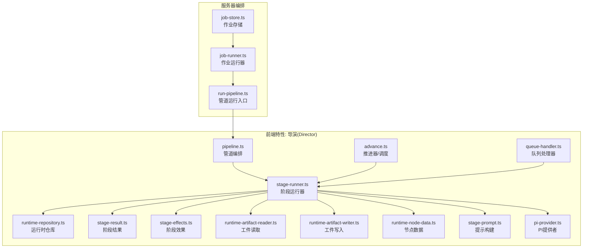

**图表来源** 
- [src/features/director/pipeline.ts](file://src/features/director/pipeline.ts)
- [src/features/director/stage-runner.ts](file://src/features/director/stage-runner.ts)
- [src/features/director/advance.ts](file://src/features/director/advance.ts)
- [src/features/director/runtime-repository.ts](file://src/features/director/runtime-repository.ts)
- [src/features/director/stage-result.ts](file://src/features/director/stage-result.ts)
- [src/features/director/stage-effects.ts](file://src/features/director/stage-effects.ts)
- [src/features/director/runtime-artifact-reader.ts](file://src/features/director/runtime-artifact-reader.ts)
- [src/features/director/runtime-artifact-writer.ts](file://src/features/director/runtime-artifact-writer.ts)
- [src/features/director/runtime-node-data.ts](file://src/features/director/runtime-node-data.ts)
- [src/features/director/stage-prompt.ts](file://src/features/director/stage-prompt.ts)
- [src/features/director/pi-provider.ts](file://src/features/director/pi-provider.ts)
- [src/features/director/queue-handler.ts](file://src/features/director/queue-handler.ts)
- [server/src/compose/run-pipeline.ts](file://server/src/compose/run-pipeline.ts)
- [server/src/server/job-runner.ts](file://server/src/server/job-runner.ts)
- [server/src/server/job-store.ts](file://server/src/server/job-store.ts)

**章节来源**
- [src/features/director/pipeline.ts](file://src/features/director/pipeline.ts)
- [server/src/compose/run-pipeline.ts](file://server/src/compose/run-pipeline.ts)
- [server/src/server/job-runner.ts](file://server/src/server/job-runner.ts)
- [server/src/server/job-store.ts](file://server/src/server/job-store.ts)

## 核心组件
- 管道编排器（Pipeline Orchestrator）
  - 职责：解析管道配置、构建阶段依赖图、计算执行拓扑、协调阶段调度与重试策略。
  - 关键能力：依赖解析、拓扑排序、并行度控制、失败快速返回或继续执行策略。
- 阶段运行器（Stage Runner）
  - 职责：封装单个阶段的完整生命周期，包括前置校验、上下文装配、执行、副作用处理、结果提交与错误恢复。
  - 关键能力：生命周期钩子、状态机驱动、错误分类与重试、工件读写、日志与指标上报。
- 推进器/调度器（Advance Engine）
  - 职责：基于依赖图与资源可用性，决定下一批可执行的阶段集合，并触发运行器执行。
  - 关键能力：就绪检测、并发限制、背压与限流、进度追踪。
- 运行时仓库（Runtime Repository）
  - 职责：维护阶段运行时的状态、输入输出、进度与元数据；提供查询与更新接口。
  - 关键能力：原子更新、快照与回滚、一致性保证。
- 阶段结果与效果（Stage Result & Effects）
  - 职责：标准化阶段输出结构与副作用描述（如通知、缓存刷新、下游触发）。
  - 关键能力：结果验证、副作用幂等性、事件发布。
- 工件读写（Artifact Reader/Writer）
  - 职责：抽象阶段间数据交换的介质（本地、对象存储、数据库），提供统一读写接口。
  - 关键能力：分块传输、校验和、压缩、缓存命中。
- 节点数据与提示构建（Node Data & Prompt Builder）
  - 职责：将运行时节点数据转换为阶段所需的输入结构；根据阶段类型生成提示或调用契约。
  - 关键能力：模板渲染、字段映射、默认值填充。
- PI 提供者（PI Provider）
  - 职责：对外部智能体或模型服务的适配与认证，屏蔽差异。
  - 关键能力：鉴权、重试、超时、降级。
- 队列处理器（Queue Handler）
  - 职责：消费任务队列消息，触发管道或阶段执行，保障可靠投递与去重。
  - 关键能力：分区、优先级、死信队列、幂等键。

**章节来源**
- [src/features/director/pipeline.ts](file://src/features/director/pipeline.ts)
- [src/features/director/stage-runner.ts](file://src/features/director/stage-runner.ts)
- [src/features/director/advance.ts](file://src/features/director/advance.ts)
- [src/features/director/runtime-repository.ts](file://src/features/director/runtime-repository.ts)
- [src/features/director/stage-result.ts](file://src/features/director/stage-result.ts)
- [src/features/director/stage-effects.ts](file://src/features/director/stage-effects.ts)
- [src/features/director/runtime-artifact-reader.ts](file://src/features/director/runtime-artifact-reader.ts)
- [src/features/director/runtime-artifact-writer.ts](file://src/features/director/runtime-artifact-writer.ts)
- [src/features/director/runtime-node-data.ts](file://src/features/director/runtime-node-data.ts)
- [src/features/director/stage-prompt.ts](file://src/features/director/stage-prompt.ts)
- [src/features/director/pi-provider.ts](file://src/features/director/pi-provider.ts)
- [src/features/director/queue-handler.ts](file://src/features/director/queue-handler.ts)

## 架构总览
下图展示了从 API 请求到阶段执行的端到端流程，以及各组件之间的交互关系。

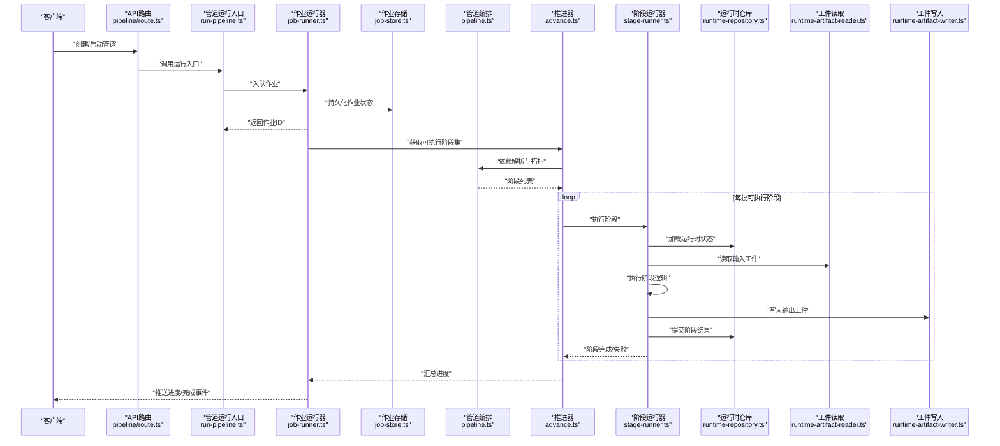

**图表来源** 
- [src/app/api/director/pipeline/route.ts](file://src/app/api/director/pipeline/route.ts)
- [server/src/compose/run-pipeline.ts](file://server/src/compose/run-pipeline.ts)
- [server/src/server/job-runner.ts](file://server/src/server/job-runner.ts)
- [server/src/server/job-store.ts](file://server/src/server/job-store.ts)
- [src/features/director/pipeline.ts](file://src/features/director/pipeline.ts)
- [src/features/director/advance.ts](file://src/features/director/advance.ts)
- [src/features/director/stage-runner.ts](file://src/features/director/stage-runner.ts)
- [src/features/director/runtime-repository.ts](file://src/features/director/runtime-repository.ts)
- [src/features/director/runtime-artifact-reader.ts](file://src/features/director/runtime-artifact-reader.ts)
- [src/features/director/runtime-artifact-writer.ts](file://src/features/director/runtime-artifact-writer.ts)

## 详细组件分析

### 阶段运行器（Stage Runner）
阶段运行器是管道执行的最小单元控制器，负责：
- 生命周期管理：初始化、前置校验、执行、后置处理、清理。
- 状态转换：待执行→运行中→成功/失败→完成。
- 错误处理：异常捕获、错误分类、重试与退避、失败分支处理。
- 工件与上下文：装配输入、读取工件、写入输出、记录指标。

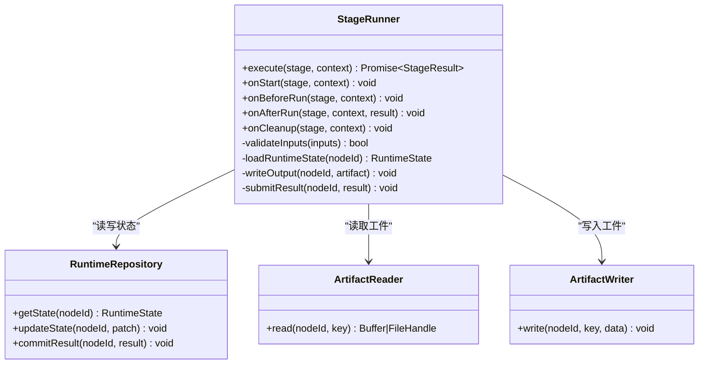

**图表来源** 
- [src/features/director/stage-runner.ts](file://src/features/director/stage-runner.ts)
- [src/features/director/runtime-repository.ts](file://src/features/director/runtime-repository.ts)
- [src/features/director/runtime-artifact-reader.ts](file://src/features/director/runtime-artifact-reader.ts)
- [src/features/director/runtime-artifact-writer.ts](file://src/features/director/runtime-artifact-writer.ts)

**章节来源**
- [src/features/director/stage-runner.ts](file://src/features/director/stage-runner.ts)
- [src/features/director/runtime-repository.ts](file://src/features/director/runtime-repository.ts)
- [src/features/director/runtime-artifact-reader.ts](file://src/features/director/runtime-artifact-reader.ts)
- [src/features/director/runtime-artifact-writer.ts](file://src/features/director/runtime-artifact-writer.ts)

### 推进器/调度器（Advance Engine）
推进器依据依赖图与资源约束，计算每批可执行阶段，确保：
- 依赖满足：所有上游阶段成功完成后才允许执行。
- 并发控制：限制同时运行的阶段数量，避免资源耗尽。
- 进度追踪：实时聚合阶段状态，更新整体进度。
- 失败隔离：单阶段失败不影响其他独立分支的执行。

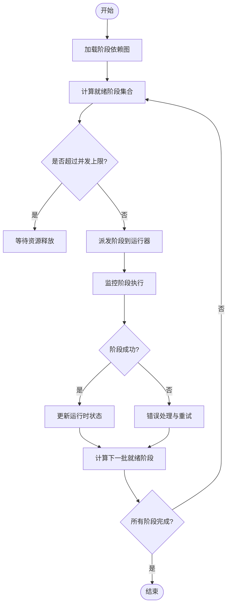

**图表来源** 
- [src/features/director/advance.ts](file://src/features/director/advance.ts)
- [src/features/director/pipeline.ts](file://src/features/director/pipeline.ts)

**章节来源**
- [src/features/director/advance.ts](file://src/features/director/advance.ts)
- [src/features/director/pipeline.ts](file://src/features/director/pipeline.ts)

### 运行时仓库（Runtime Repository）
运行时仓库负责阶段运行状态的持久化与一致性：
- 状态快照：保存阶段输入、输出、进度、错误信息。
- 原子更新：支持增量更新与事务性提交。
- 查询接口：按节点、阶段、时间范围检索。
- 回滚与恢复：在失败时恢复到最近一致点。

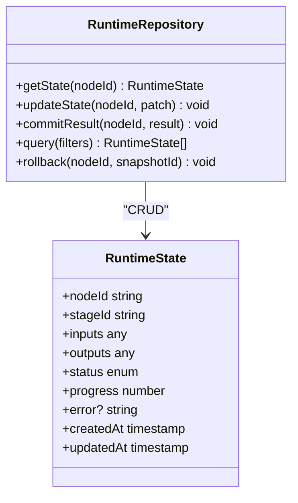

**图表来源** 
- [src/features/director/runtime-repository.ts](file://src/features/director/runtime-repository.ts)

**章节来源**
- [src/features/director/runtime-repository.ts](file://src/features/director/runtime-repository.ts)

### 阶段结果与效果（Stage Result & Effects）
- 结果标准化：统一阶段输出结构，包含数据、元数据与校验结果。
- 副作用声明：如发送通知、触发下游任务、刷新缓存等。
- 幂等性与重试：确保副作用在重复执行时不会产生副作用。

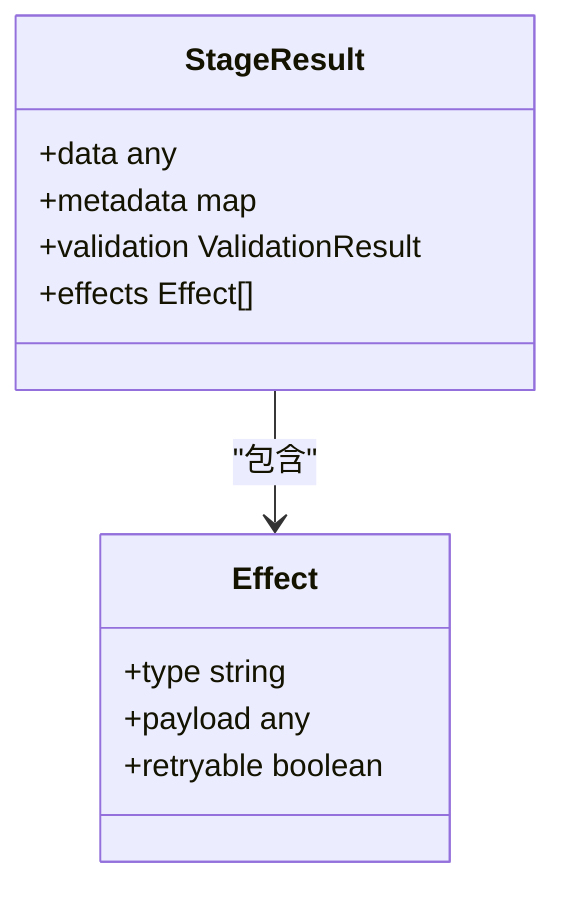

**图表来源** 
- [src/features/director/stage-result.ts](file://src/features/director/stage-result.ts)
- [src/features/director/stage-effects.ts](file://src/features/director/stage-effects.ts)

**章节来源**
- [src/features/director/stage-result.ts](file://src/features/director/stage-result.ts)
- [src/features/director/stage-effects.ts](file://src/features/director/stage-effects.ts)

### 工件读写（Artifact Reader/Writer）
- 读取：按节点与键定位工件，支持流式读取与校验。
- 写入：支持分块上传、压缩、校验和、缓存命中。
- 抽象：屏蔽底层存储差异（本地文件系统、对象存储、数据库）。

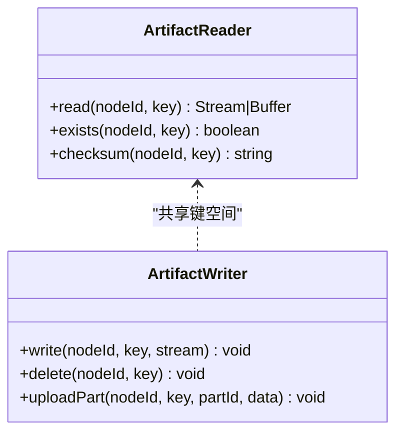

**图表来源** 
- [src/features/director/runtime-artifact-reader.ts](file://src/features/director/runtime-artifact-reader.ts)
- [src/features/director/runtime-artifact-writer.ts](file://src/features/director/runtime-artifact-writer.ts)

**章节来源**
- [src/features/director/runtime-artifact-reader.ts](file://src/features/director/runtime-artifact-reader.ts)
- [src/features/director/runtime-artifact-writer.ts](file://src/features/director/runtime-artifact-writer.ts)

### 节点数据与提示构建（Node Data & Prompt Builder）
- 节点数据：将运行时节点数据转换为阶段输入结构，处理默认值与类型转换。
- 提示构建：根据阶段类型生成提示或调用契约，支持模板与变量替换。

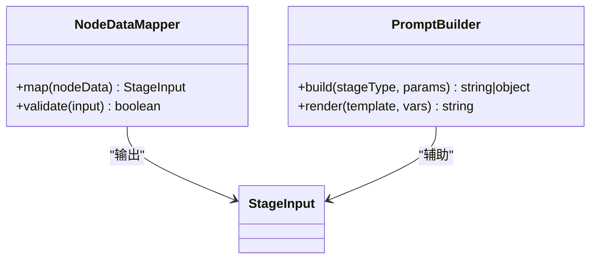

**图表来源** 
- [src/features/director/runtime-node-data.ts](file://src/features/director/runtime-node-data.ts)
- [src/features/director/stage-prompt.ts](file://src/features/director/stage-prompt.ts)

**章节来源**
- [src/features/director/runtime-node-data.ts](file://src/features/director/runtime-node-data.ts)
- [src/features/director/stage-prompt.ts](file://src/features/director/stage-prompt.ts)

### PI 提供者（PI Provider）
- 外部服务适配：封装 AI 模型或智能体调用，统一认证与错误处理。
- 重试与降级：支持指数退避、熔断与备用提供商。

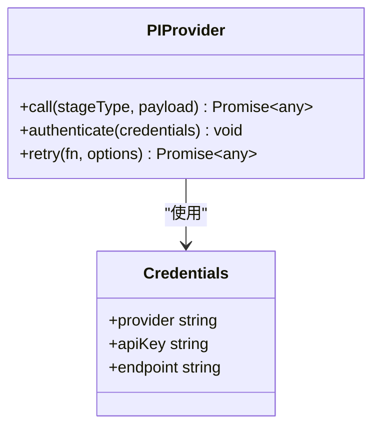

**图表来源** 
- [src/features/director/pi-provider.ts](file://src/features/director/pi-provider.ts)

**章节来源**
- [src/features/director/pi-provider.ts](file://src/features/director/pi-provider.ts)

### 队列处理器（Queue Handler）
- 任务消费：从队列拉取作业，分配给运行器执行。
- 可靠性：确保至少一次语义，支持去重与死信队列。
- 监控：统计吞吐、延迟与失败率。

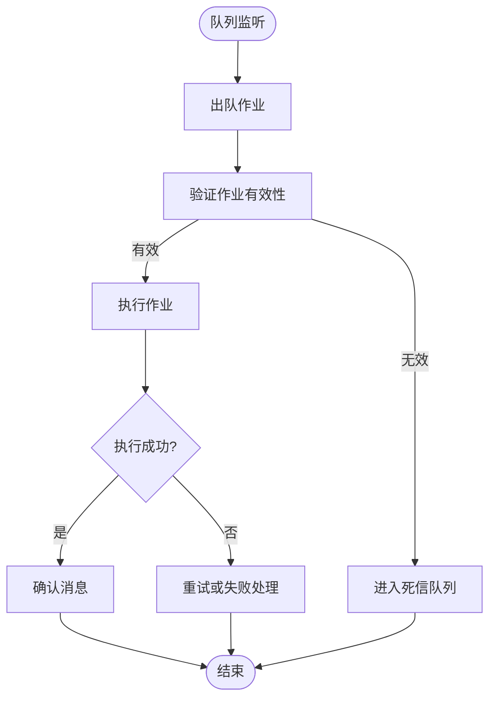

**图表来源** 
- [src/features/director/queue-handler.ts](file://src/features/director/queue-handler.ts)

**章节来源**
- [src/features/director/queue-handler.ts](file://src/features/director/queue-handler.ts)

### API 路由与作业调度
- API 路由：接收创建/启动管道请求，调用运行入口。
- 作业调度：将管道执行转为作业，持久化状态并异步执行。

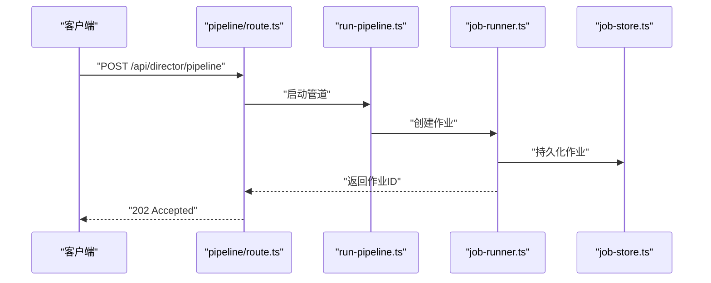

**图表来源** 
- [src/app/api/director/pipeline/route.ts](file://src/app/api/director/pipeline/route.ts)
- [server/src/compose/run-pipeline.ts](file://server/src/compose/run-pipeline.ts)
- [server/src/server/job-runner.ts](file://server/src/server/job-runner.ts)
- [server/src/server/job-store.ts](file://server/src/server/job-store.ts)

**章节来源**
- [src/app/api/director/pipeline/route.ts](file://src/app/api/director/pipeline/route.ts)
- [server/src/compose/run-pipeline.ts](file://server/src/compose/run-pipeline.ts)
- [server/src/server/job-runner.ts](file://server/src/server/job-runner.ts)
- [server/src/server/job-store.ts](file://server/src/server/job-store.ts)

## 依赖关系分析
- 松耦合设计：阶段运行器通过接口与仓库、工件读写解耦，便于替换实现。
- 依赖注入：PI 提供者、提示构建器等可通过配置注入，支持多环境切换。
- 无循环依赖：推进器仅依赖编排器与运行器，不反向依赖。
- 外部集成：队列处理器与作业存储作为外部边界，需关注一致性与容错。

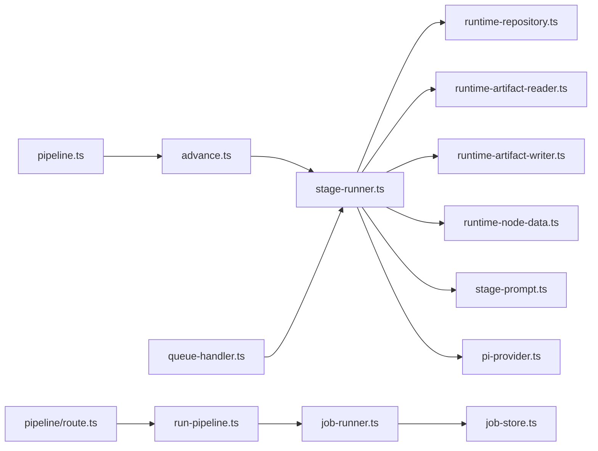

**图表来源** 
- [src/features/director/pipeline.ts](file://src/features/director/pipeline.ts)
- [src/features/director/advance.ts](file://src/features/director/advance.ts)
- [src/features/director/stage-runner.ts](file://src/features/director/stage-runner.ts)
- [src/features/director/runtime-repository.ts](file://src/features/director/runtime-repository.ts)
- [src/features/director/runtime-artifact-reader.ts](file://src/features/director/runtime-artifact-reader.ts)
- [src/features/director/runtime-artifact-writer.ts](file://src/features/director/runtime-artifact-writer.ts)
- [src/features/director/runtime-node-data.ts](file://src/features/director/runtime-node-data.ts)
- [src/features/director/stage-prompt.ts](file://src/features/director/stage-prompt.ts)
- [src/features/director/pi-provider.ts](file://src/features/director/pi-provider.ts)
- [src/features/director/queue-handler.ts](file://src/features/director/queue-handler.ts)
- [src/app/api/director/pipeline/route.ts](file://src/app/api/director/pipeline/route.ts)
- [server/src/compose/run-pipeline.ts](file://server/src/compose/run-pipeline.ts)
- [server/src/server/job-runner.ts](file://server/src/server/job-runner.ts)
- [server/src/server/job-store.ts](file://server/src/server/job-store.ts)

**章节来源**
- [src/features/director/pipeline.ts](file://src/features/director/pipeline.ts)
- [src/features/director/advance.ts](file://src/features/director/advance.ts)
- [src/features/director/stage-runner.ts](file://src/features/director/stage-runner.ts)
- [src/features/director/runtime-repository.ts](file://src/features/director/runtime-repository.ts)
- [src/features/director/runtime-artifact-reader.ts](file://src/features/director/runtime-artifact-reader.ts)
- [src/features/director/runtime-artifact-writer.ts](file://src/features/director/runtime-artifact-writer.ts)
- [src/features/director/runtime-node-data.ts](file://src/features/director/runtime-node-data.ts)
- [src/features/director/stage-prompt.ts](file://src/features/director/stage-prompt.ts)
- [src/features/director/pi-provider.ts](file://src/features/director/pi-provider.ts)
- [src/features/director/queue-handler.ts](file://src/features/director/queue-handler.ts)
- [src/app/api/director/pipeline/route.ts](file://src/app/api/director/pipeline/route.ts)
- [server/src/compose/run-pipeline.ts](file://server/src/compose/run-pipeline.ts)
- [server/src/server/job-runner.ts](file://server/src/server/job-runner.ts)
- [server/src/server/job-store.ts](file://server/src/server/job-store.ts)

## 性能考量
- 并发与限流：合理设置阶段并发度，避免 I/O 或 CPU 瓶颈；对慢依赖进行限流。
- 工件优化：启用分块传输、压缩与缓存命中，减少网络与磁盘开销。
- 状态更新：批量更新运行时状态，减少锁竞争与写放大。
- 重试策略：采用指数退避与最大重试次数，避免雪崩。
- 监控指标：采集阶段耗时、成功率、工件大小、队列深度等关键指标。

[本节为通用指导，无需特定文件引用]

## 故障排查指南
- 阶段失败
  - 检查运行时状态与错误信息，定位失败阶段与原因。
  - 查看工件读写日志，确认输入输出完整性。
  - 启用重试与降级，观察是否自愈。
- 依赖阻塞
  - 检查上游阶段状态，确认依赖是否满足。
  - 分析并发限制与资源占用，调整调度参数。
- 队列积压
  - 检查消费者健康与处理能力，扩容或优化逻辑。
  - 查看死信队列，分析失败作业根因。
- 性能问题
  - 采集阶段耗时分布，识别热点阶段。
  - 检查工件大小与传输效率，优化序列化与压缩。

**章节来源**
- [src/features/director/stage-runner.ts](file://src/features/director/stage-runner.ts)
- [src/features/director/runtime-repository.ts](file://src/features/director/runtime-repository.ts)
- [src/features/director/queue-handler.ts](file://src/features/director/queue-handler.ts)

## 结论
PurpleInk 工作流管道系统通过清晰的组件划分与松耦合设计，实现了高内聚、低耦合的管道执行引擎。阶段运行器、推进器与运行时仓库协同工作，提供了可靠的依赖管理、执行顺序控制与错误恢复能力。结合工件读写抽象与外部服务适配，系统具备良好的可扩展性与可维护性。建议在生产环境中加强监控与性能调优，持续优化并发与资源利用率。

[本节为总结性内容，无需特定文件引用]

## 附录
- 管道配置格式
  - 定义阶段列表、依赖关系、参数与运行时选项。
  - 支持环境变量与密钥注入，确保安全性。
- 阶段定义规范
  - 输入输出契约、错误码约定、副作用声明。
  - 单元测试与集成测试要求。
- 参数传递机制
  - 节点数据映射、提示模板渲染、默认值与类型校验。
- 自定义阶段开发示例
  - 实现阶段运行器接口，注册到调度器。
  - 编写工件读写逻辑，确保幂等与可恢复。
- 最佳实践
  - 小步快跑、单一职责、可观测性优先。
  - 灰度发布与回滚策略，保障稳定性。

[本节为概念性内容，无需特定文件引用]